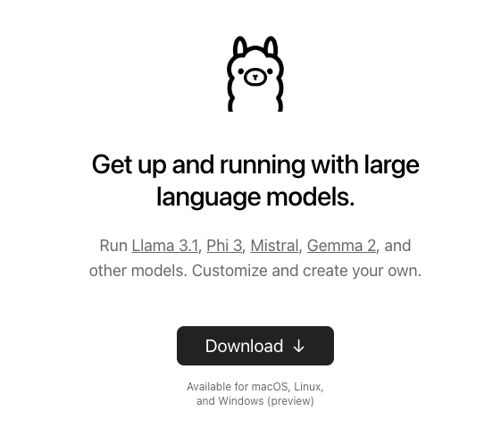
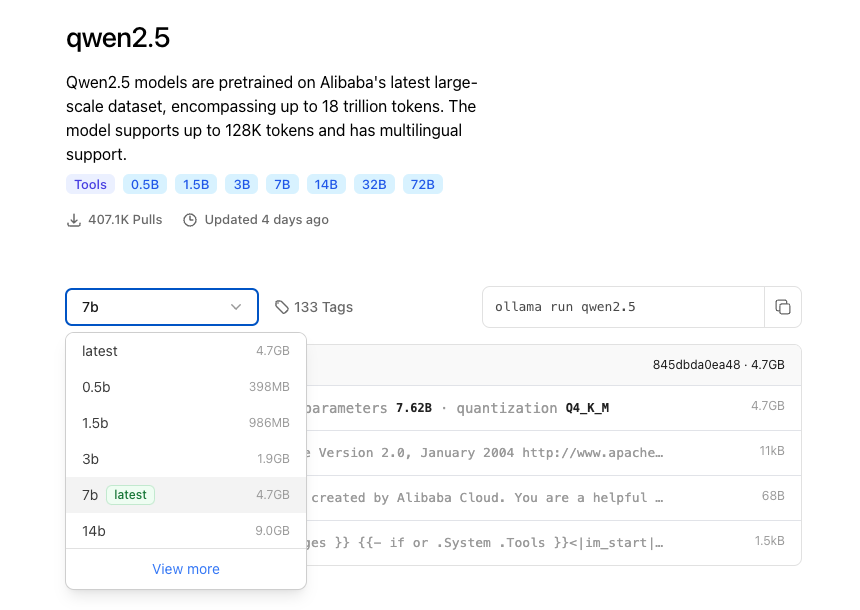
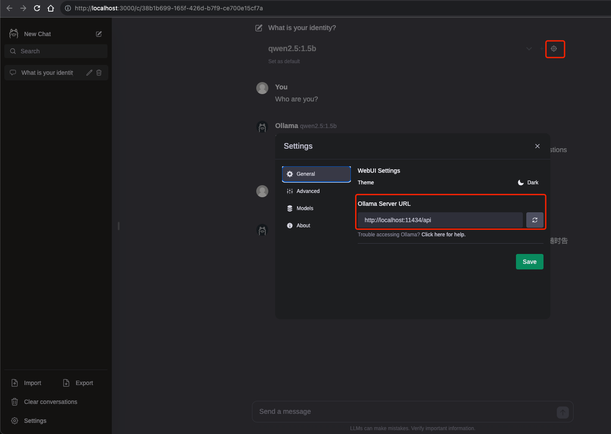

# Ollama 之本地 LLM 管理及 WebUI 对话

## 1. Ollama 是什么，它与 Llama 有什么关系？

`Ollama` 官网: `https://ollama.com/`，官方网站的介绍就一句话：`Get up and running with large language models`. （开始使用大语言模型。）

`Ollama` 是一个开源的 `LLM（大型语言模型）`服务工具，用于简化在本地运行大语言模型、降低使用大语言模型的门槛，使得大模型的开发者、研究人员和爱好者能够在本地环境快速实验、管理和部署最新大语言模型，包括如 `Qwen2`、`Llama3`、`Gemma2` 等开源的大型语言模型。

`Ollama` 支持的大语言模型列表，可通过搜索模型名称查看：`https://ollama.com/library`。

`Ollama` 官方 `GitHub` 源代码仓库：`https://github.com/ollama/ollama/`。

`Llama` 是 `Meta` 公司开源的备受欢迎的一个通用大语言模型，和其他大模型一样，`Llama` 可以通过 `Ollama` 进行管理部署和推理等。

因此，`Ollama` 与 `Llama` 的关系：`Llama` 是大语言模型，而 `Ollama` 是大语言模型（不限于 `Llama` 模型）便捷的管理和运维工具，它们只是`名字后面部分恰巧相同`而已！

Why Ollama?

- 能直接运行大模型，与大模型进行对话。
- `Ollama` 命令具有管理大模型的能力。
- 本地大模型安全可靠。
- 终端直接开始聊天。
- 社提供了 api 方式访问。

## 2. Ollama 安装和常用系统参数设置

在官网首页，我们可以直接下载 `Ollama` 安装程序（支持 Windows/MacOS/Linux）：`https://ollama.com/`。



在 `Linux` 上，可以使用以下命令行方式进行安装：

```bash
curl -fsSL https://ollama.com/install.sh | sh
```

此脚本会自动检测系统环境，并安装所需的依赖和 `Ollama` 本身。

`Ollama` 同样提供了官方 `Docker` 镜像，可以通过以下命令拉取:

```bash
docker pull ollama/ollama
```

使用 `Docker` 安装 `Ollama`，能够保证环境的一致性和隔离性，便于在不同的系统上进行部署和测试。

判断是否安装完成:

```bash
ollama -v
# ollama version is 0.3.11

ollama --version
# ollama version is 0.3.11
```

安装完成之后，有几个常用的系统`环境变量`参数可以进行设置：

- `OLLAMA_MODELS`：模型文件存放目录，默认目录为当前用户目录，其中
  - `Windows` 目录：`C:\Users\%username%\.ollama\models`，建议修改（如：`D:\OllamaModels`），避免 `C` 盘空间不足；
  - `MacOS` 目录：`~/.ollama/models`；
  - `Linux` 目录：`/usr/share/ollama/.ollama/models`；
- `OLLAMA_HOST`：`Ollama` 服务监听的网络地址，默认为 `127.0.0.1`，如果允许其他电脑访问 `Ollama`（如：局域网中的其他电脑），建议设置成 `0.0.0.0`，从而允许其他网络访问
- `OLLAMA_PORT`：`Ollama` 服务监听的默认端口，默认为 `11434`，如果端口有冲突，可以修改设置成其他端口（如：`8080` 等）
- `OLLAMA_ORIGINS`：`HTTP` 客户端请求来源，`,半角逗号`分隔列表，若本地使用无严格要求，可以设置成`*星号`，代表不受限制
- `OLLAMA_KEEP_ALIVE`：大模型加载到内存中后的存活时间，默认为 `5m` 即 `5 分钟`（如：纯数字如 `300` 代表 `300 秒`，`0` 代表处理请求响应后`立即卸载`模型，`任何负数`则表示`一直存活`）；我们可设置成 `24h`，即模型在内存中保持 `24 小时`，提高访问速度
- `OLLAMA_NUM_PARALLEL`：请求处理并发数量，默认为 `1`，即单并发串行处理请求，可根据实际情况进行调整
- `OLLAMA_MAX_QUEUE`：请求队列长度，默认值为 `512`，可以根据情况设置，超过队列长度请求被抛弃
- `OLLAMA_DEBUG`：输出 `Debug` 日志标识，应用研发阶段可以设置成 `1`，即输出详细日志信息，便于排查问题
- `OLLAMA_MAX_LOADED_MODELS`：最多同时加载到内存中模型的数量，默认为 `1`，即只能有 `1` 个模型在内存中

## 3. 大模型安装

一共有三种大模型安装方式:

- `Ollama` 从远程仓库下载大模型到本地
- `Ollama` 导入 `GGUF` 模型文件到本地磁盘
- `Ollama` 导入 `safetensors` 模型文件到到本地磁盘

这里仅介绍官方推荐的安装方式: `Ollama` 从远程仓库下载大模型到本地。

### 3.1 从远程仓库下载大模型到本地

通过 `pull` 命令从 `Ollama` 远程仓库完整下载或增量更新模型文件，模型名称格式为：`模型名称:参数规格`；如 `ollama pull qwen2:0.5b` 则代表从 `Ollama` 仓库下载 `qwen2` 大模型的 `0.5b` 参数规格大模型文件到本地磁盘。

这里 `https://ollama.com/library` 可以查看 `Ollama` 仓库中的所有模型名称及参数规格：



综合考虑到本地环境的空间，性能与稳定性，这里下载 `1.5b` 参数规格的大模型文件：

```bash
ollama pull qwen2.5:1.5b
# pulling manifest
# pulling 183715c43589... 100% ▕██████████████████████████████████████████████████████████████████▏ 986 MB
# pulling 66b9ea09bd5b... 100% ▕██████████████████████████████████████████████████████████████████▏   68 B
# pulling eb4402837c78... 100% ▕██████████████████████████████████████████████████████████████████▏ 1.5 KB
# pulling 832dd9e00a68... 100% ▕██████████████████████████████████████████████████████████████████▏  11 KB
# pulling 377ac4d7aeef... 100% ▕██████████████████████████████████████████████████████████████████▏  487 B
# verifying sha256 digest
# writing manifest
# success
```

下载完成后，可以通过 `ollama list` 命令查看已下载的大模型列表：

```bash
ollama list
# NAME            ID              SIZE      MODIFIED
# qwen2.5:1.5b    65ec06548149    986 MB    3 minutes ago
```

## 4. Ollama 管理本地已有大模型

### 4.1 展示本地大模型列表

```bash
ollama list
# NAME            ID              SIZE      MODIFIED
# qwen2.5:1.5b    65ec06548149    986 MB    3 minutes ago
```

### 4.2 复制本地大模型

```bash
ollama cp qwen2.5:1.5b qwen2.5:1.5b-test
# copied 'qwen2.5:1.5b' to 'qwen2.5:1.5b-test'

ollama list
# NAME                 ID              SIZE      MODIFIED
# qwen2.5:1.5b-test    65ec06548149    986 MB    9 seconds ago
# qwen2.5:1.5b         65ec06548149    986 MB    6 minutes ago
```

### 4.3 删除本地大模型

```bash
ollama rm qwen2.5:1.5b-test
# deleted 'qwen2.5:1.5b-test'

ollama list
# NAME            ID              SIZE      MODIFIED
# qwen2.5:1.5b    65ec06548149    986 MB    7 minutes ago
```

### 4.4 启动本地模型及对话

```bash
ollama run qwen2.5:1.5b
# >>> Who are you?
# I am Qwen, an AI language model developed by Alibaba Cloud. I was designed to be helpful and informative, while also being careful not to encourage harmful or illegal activities. Is there anything specific you would like to know or talk about?

# >>> 你好，你是谁？
# 您好！我是阿里云开发的一个语言模型助手。我的主要功能是提供帮助、解答问题和进行对话交流。如果您有任何疑问或需要指导，请随时告诉我，我会尽力协助您。

# Use Ctrl + d or /bye to exit.
# >>> /bye
```

可以使用 `"""` 来输入多行文本，例如：

```bash
ollama run qwen2.5:1.5b
# >>> """Who
# ... are
# ... you
# ... ?
# ... """
# I am Qwen, an AI assistant created by Alibaba Cloud to help you with your tasks and provide useful information. How may I assist you today?

# >>> /bye
```

### 4.5 查看本地运行中模型列表

```bash
ollama ps
# NAME            ID              SIZE      PROCESSOR    UNTIL
# qwen2.5:1.5b    65ec06548149    1.6 GB    100% CPU     3 minutes from now
```

`Ollama` 自带`控制台对话界面`体验总归是不太好，接下来部署 `Web` 可视化聊天界面：

### 4.6 Ollama 服务启动

#### 4.6.1 手动启动

```bash
ollama serve
# 2024/09/25 12:43:34 routes.go:1153: INFO server config env="map[HTTPS_PROXY: HTTP_PROXY: NO_PROXY: OLLAMA_DEBUG:false OLLAMA_FLASH_ATTENTION:false OLLAMA_GPU_OVERHEAD:0 OLLAMA_HOST:http://127.0.0.1:11434 OLLAMA_KEEP_ALIVE:5m0s OLLAMA_LLM_LIBRARY: OLLAMA_LOAD_TIMEOUT:5m0s OLLAMA_MAX_LOADED_MODELS:0 OLLAMA_MAX_QUEUE:512 OLLAMA_MODELS:/Users/[user]/.ollama/models OLLAMA_NOHISTORY:false OLLAMA_NOPRUNE:false OLLAMA_NUM_PARALLEL:0 OLLAMA_ORIGINS:[http://localhost https://localhost http://localhost:* https://localhost:* http://127.0.0.1 https://127.0.0.1 http://127.0.0.1:* https://127.0.0.1:* http://0.0.0.0 https://0.0.0.0 http://0.0.0.0:* https://0.0.0.0:* app://* file://* tauri://*] OLLAMA_SCHED_SPREAD:false OLLAMA_TMPDIR: http_proxy: https_proxy: no_proxy:]"
# time=2024-09-25T12:43:34.346+08:00 level=INFO source=images.go:753 msg="total blobs: 5"
# time=2024-09-25T12:43:34.347+08:00 level=INFO source=images.go:760 msg="total unused blobs removed: 0"
# time=2024-09-25T12:43:34.348+08:00 level=INFO source=routes.go:1200 msg="Listening on 127.0.0.1:11434 (version 0.3.11)"
# time=2024-09-25T12:43:34.349+08:00 level=INFO source=common.go:135 msg="extracting embedded files" dir=/var/folders/dq/pd5gw3qn5hs2n8p7kmd1r4qr0000gn/T/ollama3231496552/runners
# time=2024-09-25T12:43:34.385+08:00 level=INFO source=common.go:49 msg="Dynamic LLM libraries" runners="[cpu cpu_avx cpu_avx2]"
# time=2024-09-25T12:43:34.385+08:00 level=INFO source=types.go:107 msg="inference compute" id="" library=cpu variant=avx2 compute="" driver=0.0 name="" total="16.0 GiB" available="4.9 GiB"
```

如果服务已经启动了，则：

```bash
ollama serve
# Error: listen tcp 127.0.0.1:11434: bind: address already in use
```

#### 4.6.2 系统工具启动

如果是基于安装包的方式，可以通过系统工具启动服务。

- 如果在 Windows 或 MacOS 系统上运行 Ollama 服务，可以通过任务管理器终止相关进程。
- 如果 Ollama 提供了控制面板或管理界面，您可以在其中找到关闭或停止服务的选项。
- 在 macOS 或 Linux 系统上，您可以通过终端使用 kill 命令来终止服务进程。运行命令：`kill -9 <PID>` 即可。
- Linux 可通过 `service ollama stop` 或者 `systemctl stop ollama` 命令来停止服务。
- Linux 可通过 `nohup ./ollama server > log.txt 2>&1 &` 进行后台启动。

## 5. 基于 WebUI 部署 Ollama 可视化对话界面

### 5.1 环境依赖

```bash
node -v
# v20.12.0
```

### 5.2 下载并安装 Ollama WebUI

```bash
$ git clone https://github.com/ollama-webui/ollama-webui-lite
# Cloning into 'ollama-webui-lite'...
# remote: Enumerating objects: 313, done.
# remote: Counting objects: 100% (37/37), done.
# remote: Compressing objects: 100% (22/22), done.
# remote: Total 313 (delta 20), reused 15 (delta 15), pack-reused 276 (from 1)
# Receiving objects: 100% (313/313), 6.86 MiB | 303.00 KiB/s, done.
# Resolving deltas: 100% (113/113), done.

cd ollama-webui-lite
npm config set registry https://registry.npmmirror.com/
npm install

npm run dev
# > ollama-webui-lite@0.0.1 dev
# > vite dev --host --port 3000

# Forced re-optimization of dependencies

#   VITE v4.5.2  ready in 911 ms

#   ➜  Local:   http://localhost:3000/
#   ➜  Network: http://10.39.85.13:3000/
#   ➜  Network: http://10.56.155.144:3000/
```

浏览器打开 `Web` 可视化界面：`http://localhost:3000/`：

正常会识别到 `Ollama` 模型列表，如果没有识别到，检查以下配置是否正确：



### 5.3 可视化对话

选中对应模型后，就可以进行对话了：


## 6. Ollama 客户端：HTTP 访问服务

除了命令行界面，Ollama 还提供了 HTTP 接口，可以通过 HTTP 请求与模型交互。
`Ollama` 默认提供了 `generate` 和 `chat` 这 2 个原始的 API 接口，使用方式如下。

### 6.1 生成响应

```bash
curl http://localhost:11434/api/generate -d '{
  "model": "qwen2.5:1.5b",
  "prompt": "Who ard you?"
}'

# {"model":"qwen2.5:1.5b","created_at":"2024-09-24T05:05:18.933288Z","response":"I","done":false}
# {"model":"qwen2.5:1.5b","created_at":"2024-09-24T05:05:18.983705Z","response":" am","done":false}
# {"model":"qwen2.5:1.5b","created_at":"2024-09-24T05:05:19.030226Z","response":" Q","done":false}
# {"model":"qwen2.5:1.5b","created_at":"2024-09-24T05:05:19.074853Z","response":"wen","done":false}
# {"model":"qwen2.5:1.5b","created_at":"2024-09-24T05:05:19.11946Z","response":",","done":false}
# ...
# {"model":"qwen2.5:1.5b","created_at":"2024-09-24T05:05:20.870442Z","response":"","done":true,"done_reason":"stop","context":[151644,8948,198,2610,525,1207,16948,11,3465,553,54364,14817,13,1446,525,264,10950,17847,13,151645,198,151644,872,198,15191,83909,498,30,151645,198,151644,77091,198,40,1079,1207,16948,11,264,3460,4128,1614,7881,553,54364,14817,13,358,646,1492,4226,4755,389,264,6884,2088,315,13347,323,16579,304,20959,421,498,4172,1075,311,6236,0,3555,1035,498,1075,311,1414,476,4263,30],"total_duration":3792987614,"load_duration":1572384198,"prompt_eval_count":33,"prompt_eval_duration":281745000,"eval_count":46,"eval_duration":1937108000}
```

根据提供的响应结果，可以看出模型正在逐步生成一个回答，每个响应都包含了生成的一部分文本。
例如，第一个响应中的"response"字段是"I"，第二个响应中的"response"字段是"am"，依此类推。

这种逐步生成的方式可以用于处理较长的文本生成任务，模型可以在每个步骤中生成一部分文本，然后将其作为输入的一部分传递给下一步。
这种方法可以有效地处理大型文本生成任务，并在生成过程中提供实时的响应。

请注意，提供的响应示例中的最后一个响应的 `done` 字段为 `true`，表示模型已经完成了生成任务。
同时，`done_reason` 字段为 `stop`，表示生成过程是由于某种原因（可能是达到了某个条件或限制）而停止的。

此外，还提供了其他一些有关模型和请求的信息，例如模型的创建时间、请求的总持续时间、加载模型的持续时间等。

### 6.2 与模型对话

```bash
curl http://localhost:11434/api/chat -d '{
  "model": "qwen2.5:1.5b",
  "messages": [
    { "role": "user", "content": "你是谁？" }
  ]
}'
# {"model":"qwen2.5:1.5b","created_at":"2024-09-24T06:17:59.140363Z","message":{"role":"assistant","content":"我是"},"done":false}
# {"model":"qwen2.5:1.5b","created_at":"2024-09-24T06:17:59.185941Z","message":{"role":"assistant","content":"Q"},"done":false}
# {"model":"qwen2.5:1.5b","created_at":"2024-09-24T06:17:59.228055Z","message":{"role":"assistant","content":"wen"},"done":false}
# {"model":"qwen2.5:1.5b","created_at":"2024-09-24T06:17:59.273079Z","message":{"role":"assistant","content":"，"},"done":false}
# ...
# {"model":"qwen2.5:1.5b","created_at":"2024-09-24T06:18:01.51806Z","message":{"role":"assistant","content":""},"done_reason":"stop","done":true,"total_duration":2497252601,"load_duration":23170658,"prompt_eval_count":32,"prompt_eval_duration":93402000,"eval_count":53,"eval_duration":2377696000}
```

## 7. 参考

- [Ollama 完整教程：本地 LLM 管理、WebUI 对话、Python/Java 客户端 API 应用](https://www.cnblogs.com/obullxl/p/18295202/NTopic2024071001)
- [Ollama 教程——入门：开启本地大型语言模型开发之旅](https://blog.csdn.net/walkskyer/article/details/137255596)
