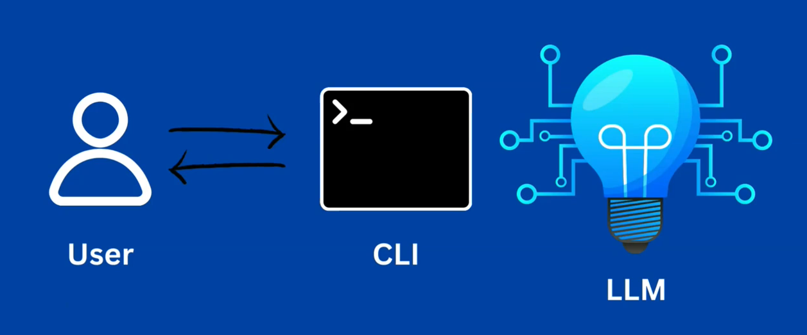

# Building a LLM Command Line Chatbot with Cobra and LangChain

## 1. 预期

在终端中实现基于本地大模型或者云端大模型的聊天机器人。



## 2. 技术栈

### 2.1 Cobra 命令行工具

[Github](https://github.com/spf13/cobra)。

```
Cobra is a library for creating powerful modern CLI applications. Cobra is used in many Go projects such as Kubernetes, Hugo, and GitHub CLI to name a few. This list contains a more extensive list of projects using Cobra.
```

```
Cobra 是一个命令行程序库，可以用来编写命令行程序。 非常多知名的开源项目使用了 Cobra 库构建命令行，如 Kubernetes、Hugo 等等。
```

### 2.2 Langchaingo

[Github](https://github.com/tmc/langchaingo)

```
This is the Go language implementation of LangChain.
```

[LangChain](https://github.com/langchain-ai/langchain)。

## 3. 初始化项目

```bash
mkdir llm_cli
cd llm_cli
go mod init llm_cli
# go: creating new go.mod: module llm_cli
```

安装依赖：

```bash
go get github.com/spf13/cobra
# go: added github.com/inconshreveable/mousetrap v1.1.0
# go: added github.com/spf13/cobra v1.8.1
# go: added github.com/spf13/pflag v1.0.5
```

安装 Cobra 脚手架工具：

```bash
go install github.com/spf13/cobra-cli@latest
# go: downloading github.com/spf13/cobra-cli v1.3.0
# go: downloading github.com/spf13/cobra v1.3.0
# go: downloading github.com/spf13/viper v1.10.1
# go: downloading github.com/spf13/cast v1.4.1
# go: downloading github.com/spf13/afero v1.6.0
# go: downloading github.com/subosito/gotenv v1.2.0
# go: downloading gopkg.in/ini.v1 v1.66.2
# go: downloading github.com/magiconair/properties v1.8.5
# go: downloading github.com/fsnotify/fsnotify v1.5.1
# go: downloading github.com/pelletier/go-toml v1.9.4
# go: downloading golang.org/x/sys v0.0.0-20211210111614-af8b64212486
# go: downloading golang.org/x/text v0.3.7
```

通过脚手架工具初始化项目：

```bash
cobra-cli init
# Your Cobra application is ready at
```

初始化目录结构：

```
.
llm_cli
  ├── cmd
  |    └── root.go # 根命令
  ├── go.mod
  ├── go.sum
  └── main.go # 调用命令入口
```

代码规范：

```bash
go mod tidy # 依赖整理
find . -name '*.go' -exec gofmt -w {} \; # 代码格式化
```

## 4. 增加 chat 子命令

```bash
cobra-cli add chat
```

目录结构更新为：

```
.
llm_cli
  ├── cmd
  |    ├── chat.go # 子命令 chat
  |    └── root.go # 根命令
  ├── go.mod
  ├── go.sum
  └── main.go # 调用命令入口
```

验证 `根命令` 是否正常：

```bash
go run main.go
# A longer description that spans multiple lines and likely contains
# examples and usage of using your application. For example:

# Cobra is a CLI library for Go that empowers applications.
# This application is a tool to generate the needed files
# to quickly create a Cobra application.

# Usage:
#   llm_cli [command]

# Available Commands:
#   chat        LLM chatbot
#   completion  Generate the autocompletion script for the specified shell
#   help        Help about any command

# Flags:
#   -h, --help     help for llm_cli
#   -t, --toggle   Help message for toggle

# Use "llm_cli [command] --help" for more information about a command.
```

```go
// cmd/chat.go

package cmd

import (
  "fmt"

  "github.com/spf13/cobra"
)

// chatCmd represents the chat command
var chatCmd = &cobra.Command{
  Use:   "chat",
  Short: "LLM chatbot",
  Long:  `LLM chatbot`,
  Run: func(cmd *cobra.Command, args []string) {
    fmt.Println("chat called")
  },
}

func init() {
  rootCmd.AddCommand(chatCmd)
}

```

验证 `子命令` 是否正常：

```bash
go run main.go chat
# chat called
```

## 5. 开发

### 5.1 实现无限循环读取标准输入

关键代码：

```go
// cmd/chat.go

// ...

// chatCmd represents the chat command
var chatCmd = &cobra.Command{
  Use:   "chat",
  Short: "LLM chatbot",
  Long:  `LLM chatbot`,
  Run: func(cmd *cobra.Command, args []string) {
    // read input lines form the user
    // so let's create a new reader that reads from stdin
    reader := bufio.NewReader(os.Stdin)

    // input we will create an infinite Loop in which the user can ask questions to llm infinitely.
    for {
      fmt.Print("> ")

      // 从输入流中读取字符串直到遇到换行符 '\n' 为止
      input, _ := reader.ReadString('\n')
      input = strings.TrimSpace(input)

      switch input {
      // "/bye" 是为了和 Ollama 的终端交互退出 chat 保持一致
      case "quit", "exit", "/bye":
        fmt.Printf("Exiting ...")
        os.Exit(0)
      default:
        fmt.Println("You said: ", input)
      }
    }
  },
}

// ...
```

```bash
go run main.go chat
# > who are you?
# You said:  who are you?
# > exit
# Exiting ...
```

### 5.2 Ctrl+C 退出程序

关键代码：

```go
// cmd/chat.go

// ...

  // Set up a channel to listen for interrupt signals
  signalChan := make(chan os.Signal, 1)
  // syscall.SIGINT 表示中断信号，通常由用户按下 Ctrl+C 键触发。
  // syscall.SIGTERM 表示终止信号，通常用于请求进程正常终止。
  signal.Notify(signalChan, syscall.SIGINT, syscall.SIGTERM)

  // 监听到退出信号时，退出程序
  go func() {
    <-signalChan
    fmt.Println("\n Interrupt signal received. Exiting...")
    os.Exit(0)
  }()

// ...
```

```bash
go run main.go chat
# > Hello
# You said:  Hello
# > ^C
#  Interrupt signal received. Exiting...
```

### 5.3 Chatbot

安装依赖：

```bash
go get github.com/tmc/langchaingo
# go: added github.com/tmc/langchaingo v0.1.12
```

关键代码：

```go
// cmd/chat.go

// ...

  // 连接 Ollama
  // 若不设置 ollamaServerURL 或 环境变量 OLLAMA_HOST, 则默认使用本地 ollama 服务
  llm, err := ollama.New(ollama.WithModel("qwen2.5:1.5b"))
  if err != nil {
    log.Fatal(err)
  }

  ctx := context.Background()

  // Initial LLM prompt phase
  fmt.Print("Enter initial prompt for LLM:")
  initialPrompt, _ := reader.ReadString('\n')
  initialPrompt = strings.TrimSpace(initialPrompt)
  content := []llms.MessageContent{
    llms.TextParts(llms.ChatMessageTypeSystem, initialPrompt),
  }
  fmt.Println("Initial prompt receieved. Entering chat mode...")

  // input we will create an infinite Loop in which the user can ask questions to llm infinitely.
  for {
    // ...

    switch input {
    // ...
    default:
      // Process user input with the LLM here
      response := ""
      // 将输入内容添加到上下文中
      content = append(content, llms.TextParts(llms.ChatMessageTypeHuman, input))
      llm.GenerateContent(ctx, content, llms.WithMaxTokens(1024), llms.WithStreamingFunc(func(ctx context.Context, chunk []byte) error {
        fmt.Print(string(chunk))
        response = response + string(chunk)
        return nil
      }))
      // 将回复内容添加到上下文中
      content = append(content, llms.TextParts(llms.ChatMessageTypeSystem, response))
    }
  }

// ...
```

整理依赖：

```bash
go mod tidy
```

运行程序：

```bash
go run main.go chat
Enter initial prompt for LLM: 我正在从事一个涉及使用机器学习和 AI 技术的项目。我对自然语言处理 （NLP） 以及如何使用它来增强软件应用程序中的用户体验特别感兴趣。您能帮我了解基础知识并建议一些实际应用吗？
Initial prompt receieved. Entering chat mode...

> 我应该在开始这个项目之前，先对NLP中的哪些基本概念有所了解？
当然可以！首先，你需要了解以下的基本概念：

1. 语言模型：这是机器学习中的一种技术，它使用大量的文本数据来训练一个模型，该模型能够预测下一个单词或短语。这在自然语言处理（NLP）中非常重要，因为它是理解人类语言的基础。

2. 情感分析：这是一种基于文本的分析方法，用于识别和量化文本中的情感倾向。例如，它可以帮助你了解客户对产品或服务的看法。

3. 词性标注：这是将单词分为名词、动词、形容词等类型的过程。这在理解句子结构中非常重要。

4. 命名实体识别：这是一种技术，用于识别文档中的人名、地名、组织名称等实体。

5. 文本分类：这是一种任务，其中机器学习模型被训练来对文本进行分类，例如将评论分为正面、负面或中性。

6. 机器翻译：这是将一种语言的文本转换为另一种语言的技术。这在跨文化交流和国际业务中非常重要。

7. 情感分析：这是一种技术，用于识别和量化文本中的情感倾向。例如，它可以帮助你了解客户对产品或服务的看法。

8. 基于规则的方法：这种方法是通过编写规则来处理自然语言的，而不是使用机器学习模型。这在某些情况下可能更有效，但在大多数情况下，机器学习方法比基于规则的方法更好。

9. 词向量：这是一种技术，用于将单词表示为数字向量，以便可以像处理其他数据一样处理它们。这在许多NLP任务中都非常有用。

10. 增强现实（AR）和虚拟现实（VR）中的自然语言处理：这是指如何使用机器学习来增强用户与虚拟环境的交互方式。

这些概念是理解自然语言处理的基础，也是你将要开始项目时需要掌握的知识。希望这能帮助你更好地了解这个领域！
> ^C
 Interrupt signal received. Exiting...
```

## 6. 后记

相关链接：

- [Golang - Building a LLM (OpenAI) Command Line Chatbot with Cobra and LangChain](https://www.youtube.com/watch?v=eoLnbIyhjPs)
