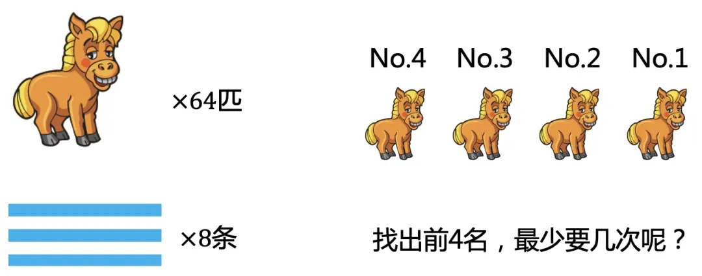
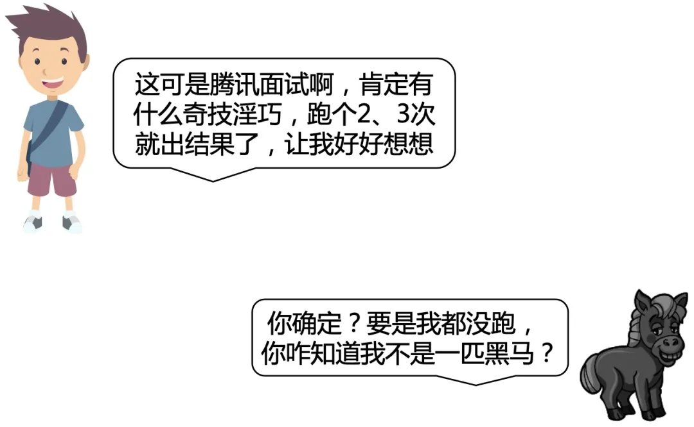
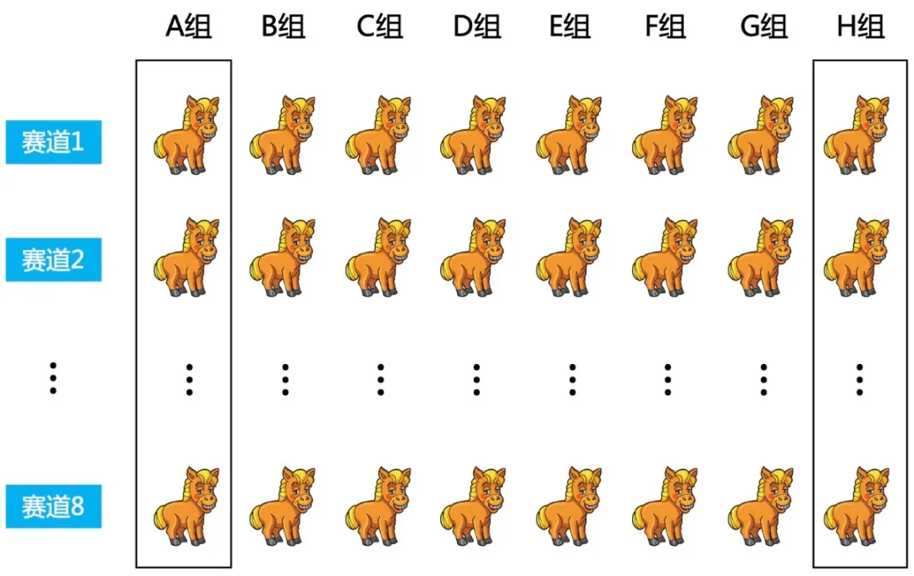
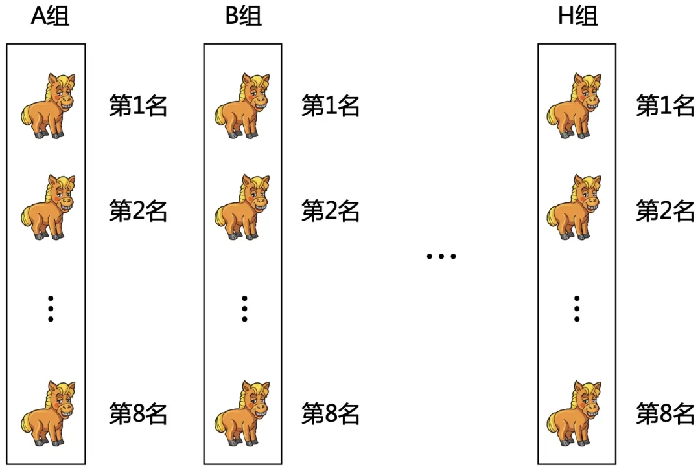
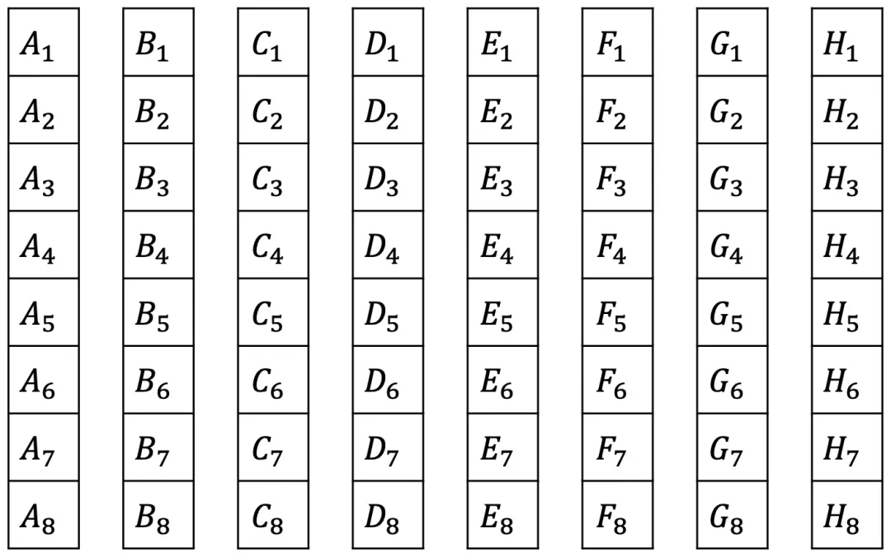
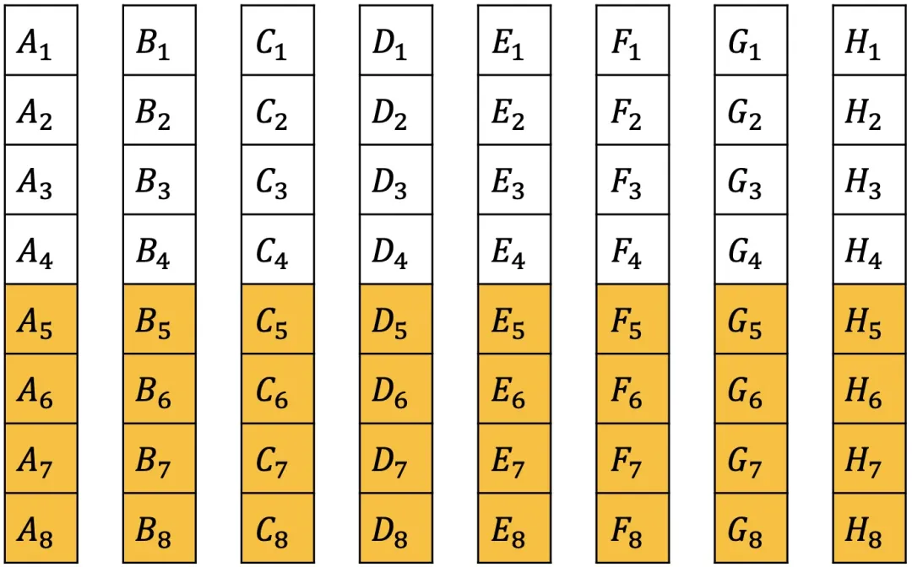
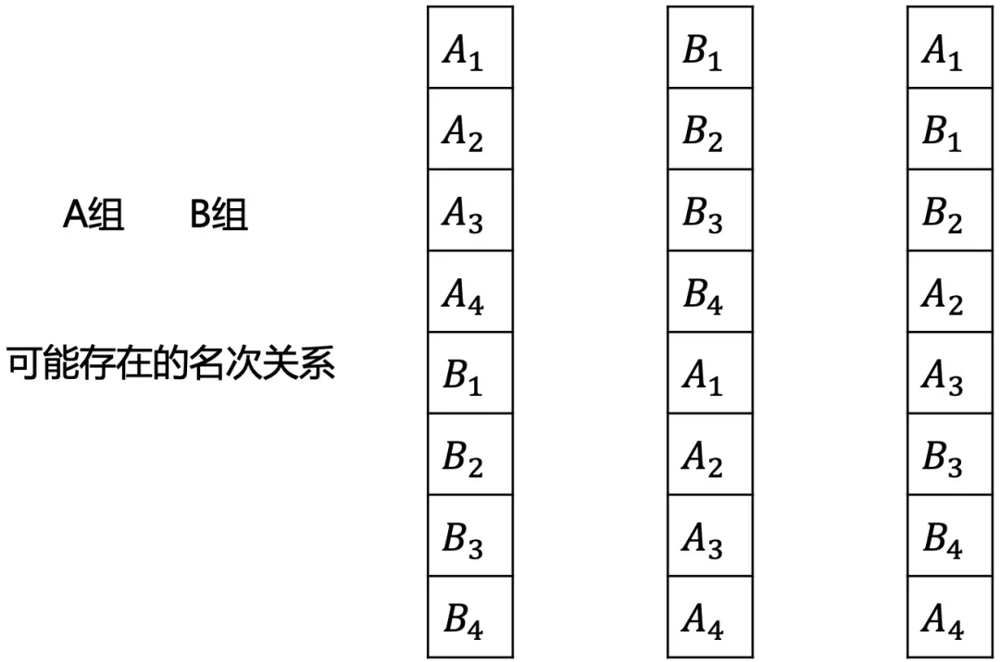
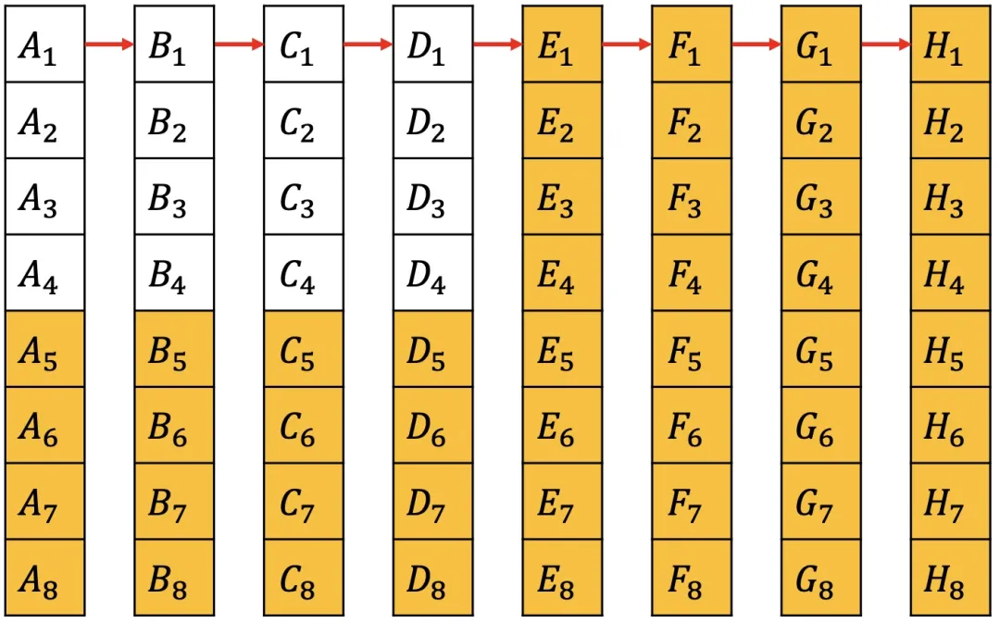
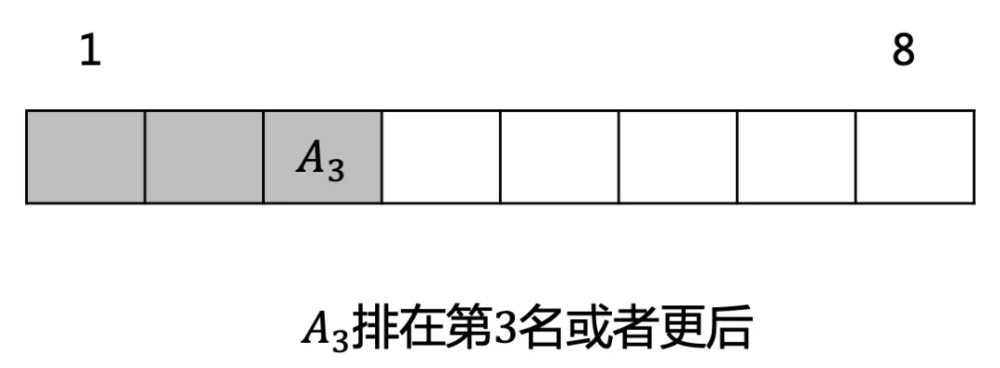

# 64 匹马，8 赛道，找出最快的 4 匹最少要几次？

## 1. 故事起源

有 `64` 匹马, `8` 条赛道，要找出最快的 `4` 匹马，最少要几次呢？

## 2. 初步思考

很多同学可能第一反应就是，这个问题肯定不简单，应该有一些技巧，但技巧是啥呢，又一时想不出来。

其实呢，先别想得太复杂了，比如我现在就问你一个问题，有没有可能存在有一匹不用跑？
答案当然是不行。

## 3. 分析

那也就是每一匹都得先跑一次, `64` 匹, `8` 个赛道，那就先分 `8` 组跑 `8` 次。

每一组都会得到 `8` 匹的相对速度，也就是在同一组内的名次。

为了方便描述，我们用编号来表示。如 `A` 组里面的名次分别用 `A~1~`, `A~2~`, `...`, `A~8~` 来表示。

因为我们只需要找出最快的 `4` 匹，那么 `A~5~`, `A~6~`, `A~7~`, `A~8~` 肯定不属于最快的 `4` 匹，同理把每一组的后 `4` 名先排除。

现在每一组内都有相对名次，但不同的组间是不知道的。如果把 `A` 组和 `B` 组放一起，下面的情况都可能存在。

因为是要找最快的，所以选择每组的第一名再出来跑一次，这样落后的第一名所在的整组都可以排除。
为了描述方便，把最快到最慢的第一名所在的组依次重新命名为 `A`, `B`, ..., `H` 组。

组间的第一名有了名次关系，可以发现 `D~2~`, `D~3~`, `D~4~` 一定不属于前 `4` 名，因为 `A~1~`, `B~1~`, `C~1~`, `D~1~` 都在他们前面。
同理可排除 `C~3~`, `C~4~`, `B~4~`。同时 `A~1~` 是最快的，一定属于前 `4`。
那接下来只需在剩下的 `9` 匹中找出前 `3`。

除去 `A~4~`, 其余 `8` 匹跑一次。如果 `A~3~` 在第 `3` 名或者更后，那说明已经选出了前 `3` 名, `A~4~` 也不用再跑了，否则再取前 `3` 和 `A~4~` 一起跑一次，即可得结果。

最多 `11` 次一定可以选出最快的 `4` 匹。

## 4. 总结

这种思维题，其实是很难直接就想清楚整个过程。
可以先想得简单一点，往下推一步再看，逐步推进就可以引导出正确的结果了。

## 5. 参考

- [腾讯面试题：64 匹马，8 赛道，找出最快的 4 匹最少要几次?](https://mp.weixin.qq.com/s/9h27kV2yFrfsq4Zl1Eo_CA)
