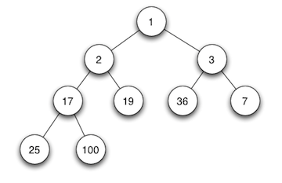
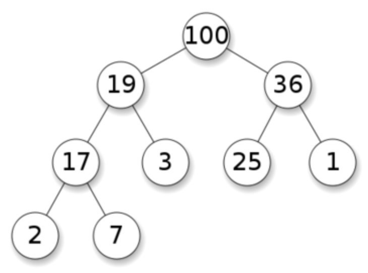

# 数据结构之 Heap 实现(TypeScript版)

> `Comparator` 实现见前文 [前端比较方法的优雅封装](../20220110_前端比较方法的优雅封装/index.md)。

## 1. 堆的定义

- 堆树是一颗完全二叉树；
- 堆树中某个节点的值总是不大于或不小于其子节点的值；
- 堆树中每个节点的子树都是堆树。

当父节点的键值总是小于或等于任何一个子节点的键值时为最小堆。如：


当父节点的键值总是大于或等于任何一个子节点的键值时为最大堆。如：


## 2. 实现思路

- 数据保存：数组保存堆节点信息，通过下标，可计算得出节点的父节点和左右子节点。
- 插入节点：先在堆的最后添加一个节点，然后沿着堆树上升。
- 删除节点：若为最后一个节点，则直接删除返回，否则将删除节点替换为最后一个节点，根据顺序情况决定堆树上升还是下降。

## 3. 代码实现

### 3.1 基本实现

```ts
// data-structures/heap/MaxHeap.ts

import { TypeCompareParam } from '../../utils/comparator/Comparator';
import Heap from './Heap';

export default class MaxHeap extends Heap {
  /**
   * Checks if pair of heap elements is in correct order.
   * For MinHeap the first element must be always smaller or equal.
   * For MaxHeap the first element must be always bigger or equal.
   */
  pairIsInCorrectOrder(firstElement: TypeCompareParam, secondElement: TypeCompareParam) {
    return this.compare.greaterThanOrEqual(firstElement, secondElement);
  }
}
```

```ts
// data-structures/heap/MinHeap.ts

import { TypeCompareParam } from '../../utils/comparator/Comparator';
import Heap from './Heap';

export default class MinHeap extends Heap {
  /**
   * Checks if pair of heap elements is in correct order.
   * For MinHeap the first element must be always smaller or equal.
   * For MaxHeap the first element must be always bigger or equal.
   */
  pairIsInCorrectOrder(firstElement: TypeCompareParam, secondElement: TypeCompareParam) {
    return this.compare.lessThanOrEqual(firstElement, secondElement);
  }
}
```

```ts
// data-structures/heap/Heap.ts

import Comparator, { TypeCompareFun, TypeCompareParam } from '../../utils/comparator/Comparator';

/**
 * Parent class for Min and Max Heaps.
 */
export default class Heap {
  private heapContainer: TypeCompareParam[];
  protected compare: Comparator;

  /**
   * @constructs Heap
   */
  constructor(comparatorFunction?: TypeCompareFun) {
    if (new.target === Heap) {
      throw new TypeError('Cannot construct Heap instance directly');
    }

    // Array representation of the heap.
    this.heapContainer = [];
    this.compare = new Comparator(comparatorFunction);
  }

  /**
   * 获取左子节点下标
   */
  getLeftChildIndex(parentIndex: number) {
    return 2 * parentIndex + 1;
  }

  /**
   * 获取右子节点下标
   */
  getRightChildIndex(parentIndex: number) {
    return 2 * parentIndex + 2;
  }

  /**
   * 获取父节点下标
   */
  getParentIndex(childIndex: number) {
    return Math.floor((childIndex - 1) / 2);
  }

  /**
   * 判断是否有父节点
   */
  hasParent(childIndex: number) {
    return this.getParentIndex(childIndex) >= 0;
  }

  /**
   * 判断是否有左子节点
   */
  hasLeftChild(parentIndex: number) {
    return this.getLeftChildIndex(parentIndex) < this.heapContainer.length;
  }

  /**
   * 判断是否有右子节点
   */
  hasRightChild(parentIndex: number) {
    return this.getRightChildIndex(parentIndex) < this.heapContainer.length;
  }

  /**
   * 获取左子节点
   */
  leftChild(parentIndex: number) {
    return this.heapContainer[this.getLeftChildIndex(parentIndex)];
  }

  /**
   * 获取右子节点
   */
  rightChild(parentIndex: number) {
    return this.heapContainer[this.getRightChildIndex(parentIndex)];
  }

  /**
   * 获取父节点
   */
  parent(childIndex: number) {
    return this.heapContainer[this.getParentIndex(childIndex)];
  }

  /**
   * 根据下标交互数据
   */
  swap(indexOne: number, indexTwo: number) {
    const tmp = this.heapContainer[indexTwo];
    this.heapContainer[indexTwo] = this.heapContainer[indexOne];
    this.heapContainer[indexOne] = tmp;
  }

  /**
   * 获取根节点
   * 最小堆中对应最小值，最大堆中对应最大值
   */
  peek() {
    if (this.heapContainer.length === 0) {
      return null;
    }

    return this.heapContainer[0];
  }

  /**
   * 查找堆节点，返回对应的下标索引数组
   */
  find(item: TypeCompareParam, comparator: Comparator = this.compare): number[] {
    const foundItemIndices: number[] = [];

    for (let itemIndex = 0; itemIndex < this.heapContainer.length; itemIndex += 1) {
      if (comparator.equal(item, this.heapContainer[itemIndex])) {
        foundItemIndices.push(itemIndex);
      }
    }

    return foundItemIndices;
  }

  /**
   * 判断堆是否为空
   */
  isEmpty(): boolean {
    return !this.heapContainer.length;
  }

  /**
   * 将堆数据转为字符串展示
   */
  toString() {
    return this.heapContainer.toString();
  }

  /**
   * Checks if pair of heap elements is in correct order.
   * For MinHeap the first element must be always smaller or equal.
   * For MaxHeap the first element must be always bigger or equal.
   */
  /* istanbul ignore next */
  pairIsInCorrectOrder(firstElement: TypeCompareParam, secondElement: TypeCompareParam): boolean {
    throw new Error(`
      You have to implement heap pair comparision method
      for ${firstElement} and ${secondElement} values.
    `);
  }
}
```

### 3.2 堆树上升

```ts
// data-structures/heap/Heap.ts

// ...

export default class Heap {
  // ...

  /**
   * 指定节点进行堆树上升
   */
  heapifyUp(customStartIndex?: number) {
    // Take the last element (last in array or the bottom left in a tree)
    // in the heap container and lift it up until it is in the correct
    // order with respect to its parent element.
    let currentIndex = customStartIndex || this.heapContainer.length - 1;

    while (
      this.hasParent(currentIndex)
      && !this.pairIsInCorrectOrder(this.parent(currentIndex), this.heapContainer[currentIndex])
    ) {
      this.swap(currentIndex, this.getParentIndex(currentIndex));
      currentIndex = this.getParentIndex(currentIndex);
    }
  }

  // ...
}
```

### 3.3 堆树下降

```ts
// data-structures/heap/Heap.ts

// ...

export default class Heap {
  // ...

  /**
   * 指定节点进行堆树下降
   */
  heapifyDown(customStartIndex = 0) {
    // Compare the parent element to its children and swap parent with the appropriate
    // child (smallest child for MinHeap, largest child for MaxHeap).
    // Do the same for next children after swap.
    let currentIndex = customStartIndex;
    let nextIndex = null;

    while (this.hasLeftChild(currentIndex)) {
      if (
        this.hasRightChild(currentIndex)
        && this.pairIsInCorrectOrder(this.rightChild(currentIndex), this.leftChild(currentIndex))
      ) {
        nextIndex = this.getRightChildIndex(currentIndex);
      }
      else {
        nextIndex = this.getLeftChildIndex(currentIndex);
      }

      if (this.pairIsInCorrectOrder(this.heapContainer[currentIndex], this.heapContainer[nextIndex])) {
        break;
      }

      this.swap(currentIndex, nextIndex);
      currentIndex = nextIndex;
    }
  }

  // ...
}
```

### 3.4 取出根节点

```ts
// data-structures/heap/Heap.ts

// ...

export default class Heap {
  // ...

  /**
   * 取出根节点
   * 最小堆中对应最小值，最大堆中对应最大值
   * 取出后，若还有节点，则将最后节点替换到当前根节点，然后进行堆树下降
   */
  poll() {
    if (this.heapContainer.length === 0) {
      return null;
    }

    if (this.heapContainer.length === 1) {
      return this.heapContainer.pop();
    }

    const item = this.heapContainer[0];

    // Move the last element from the end to the head.
    this.heapContainer[0] = this.heapContainer.pop();
    this.heapifyDown();

    return item;
  }

  // ...
}
```

### 3.5 增加堆节点

```ts
// data-structures/heap/Heap.ts

// ...

export default class Heap {
  // ...

  /**
   * 增加一个堆节点
   * 增加的堆节点在最右侧，所以只需要从最右侧进行堆树上升即可
   */
  add(item: TypeCompareParam) {
    this.heapContainer.push(item);
    this.heapifyUp();
    return this;
  }

  // ...
}
```

### 3.6 删除堆节点

```ts
// data-structures/heap/Heap.ts

// ...

export default class Heap {
  // ...

  /**
   * 删除指定的堆节点
   */
  remove(item: TypeCompareParam, comparator: Comparator = this.compare) {
    // Find number of items to remove.
    const numberOfItemsToRemove = this.find(item, comparator).length;

    for (let iteration = 0; iteration < numberOfItemsToRemove; iteration += 1) {
      // We need to find item index to remove each time after removal since
      // indices are being changed after each heapify process.
      const indexToRemove = this.find(item, comparator).pop();

      // If we need to remove last child in the heap then just remove it.
      // There is no need to heapify the heap afterwards.
      if (indexToRemove === this.heapContainer.length - 1) {
        this.heapContainer.pop();
      }
      else {
        // Move last element in heap to the vacant (removed) position.
        this.heapContainer[indexToRemove] = this.heapContainer.pop();

        // Get parent.
        const parentItem = this.parent(indexToRemove);

        // If there is no parent or parent is in correct order with the node
        // we're going to delete then heapify down. Otherwise heapify up.
        if (
          this.hasLeftChild(indexToRemove)
          && (!parentItem || this.pairIsInCorrectOrder(parentItem, this.heapContainer[indexToRemove]))
        ) {
          this.heapifyDown(indexToRemove);
        }
        else {
          this.heapifyUp(indexToRemove);
        }
      }
    }

    return this;
  }

  // ...
}
```

## 4. 参考

- [JavaScript 算法与数据结构](https://github.com/trekhleb/javascript-algorithms/blob/master/src/data-structures/heap/README.zh-CN.md)
