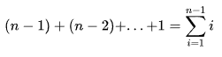
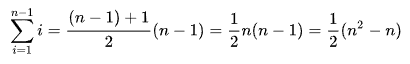
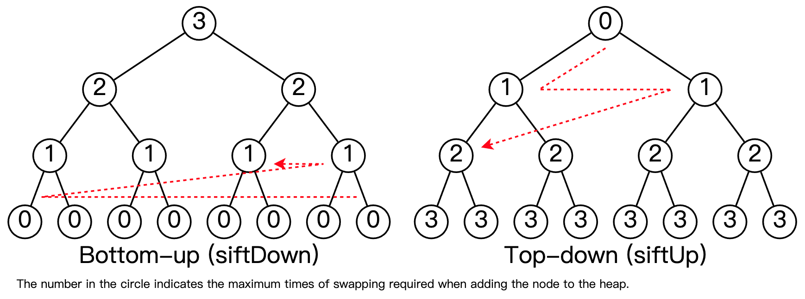
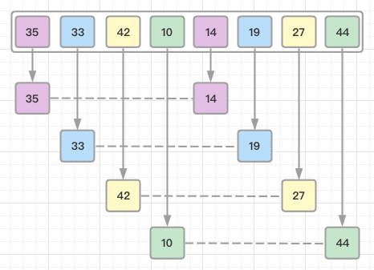
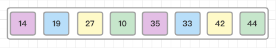
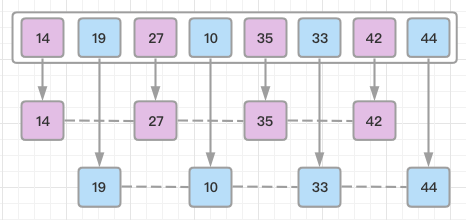
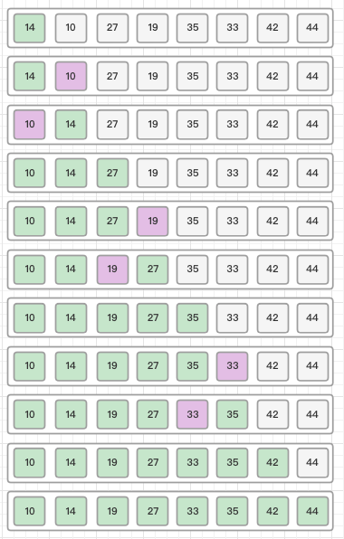
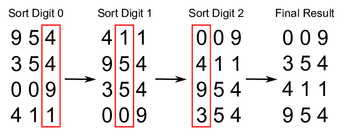

# 常见排序算法实现( TypeScript 版)

## 1. 公共方法封装

- `Comparator` 实现见前文 [前端比较方法的优雅封装](../20220110_前端比较方法的优雅封装/index.md)
- `MinHeap` 实现见前文 [数据结构之 Heap 实现( TypeScript 版)](../20220112_数据结构之Heap实现_TypeScript版/index.md)

### 1.1 排序 Class 实现

```ts
// utils/sort/Sort.ts

import type { TypeCompareFun } from '../comparator/Comparator';
import Comparator, { TypeCompareParam } from '../comparator/Comparator';

export interface ICallbacks {
    // If provided then all elements comparisons will be done through this callback.
    compareCallback?: TypeCompareFun;
    // If provided it will be called each time the sorting function is visiting the next element.
    visitingCallback?: (a?: any) => void;
}

export default class Sort {
    protected callbacks: ICallbacks;
    protected comparator: Comparator;

    constructor(originalCallbacks?: ICallbacks) {
        this.callbacks = Sort.initSortingCallbacks(originalCallbacks);
        this.comparator = new Comparator(this.callbacks.compareCallback);
    }

    static initSortingCallbacks(originalCallbacks: ICallbacks): ICallbacks {
        const callbacks = originalCallbacks || {};
        const stubCallback = () => {};

        callbacks.compareCallback = callbacks.compareCallback || undefined;
        callbacks.visitingCallback = callbacks.visitingCallback || stubCallback;

        return callbacks;
    }

    public sort(array?: TypeCompareParam[]) {
        throw new Error('sort method must be implemented');
    }
}
```

### 1.2 数据交换

```ts
// utils/swap/swap.ts

import { TypeCompareParam } from '../comparator/Comparator';

// 通过解构运算符进行数据交换
// 本项目中采用此方式
export function swap(arr: TypeCompareParam[], i: number, j: number) {
    ;[arr[j], arr[i]] = [arr[i], arr[j]];
}

// 根据数组下标进行数据交换
// 此方式为传统实现方式
export function swap2(arr: TypeCompareParam[], i: number, j: number) {
    if (i === j) {
        return;
    }
    const temp = arr[i];
    arr[i] = arr[j];
    arr[j] = temp;
}

/**
 * 用异或运算符实现交换
 *
 * 因为是二进制操作，所以仅支持数字交换，这里用二进制表示其值
 * 如：A: 4(100), B: 2(010)，那么：
 * 第一次：A = A(100) ^ B(010) = 001
 * 第二次：B = A(001) ^ B(010) = 100
 * 第三次：A = A(001) ^ B(100) = 010
 *
 * 注意：此方法要求 i !== j，因为没有中间变量保存值，会导致如果是相同索引的话，信息会丢失
 */
export function swap3(arr: number[], i: number, j: number) {
    if (i === j) {
        return;
    }
    arr[i] = arr[i] ^ arr[j];
    arr[j] = arr[i] ^ arr[j];
    arr[i] = arr[i] ^ arr[j];
}
```

## 2. 排序实现

### 2.1 冒泡排序（Bubble Sort）

> 冒泡排序，有时也称为下沉排序，是一种简单的排序算法，它反复遍历列表，比较相邻元素并在它们的顺序错误时交换它们，直到列表被排序。
> 该算法是一种比较排序，以较小或较大元素“冒泡”到列表顶部的方式命名。
> 这个算法，不是一种实用的排序算法，它在现实世界的使用中表现不佳，主要用作教育工具。

**动画演示：**


**代码实现：**

```ts
// sorting/bubble-sort/BubbleSort.ts
import { TypeCompareParam } from '../../utils/comparator/Comparator';
import Sort, { ICallbacks } from '../../utils/sort/Sort';
import { swap } from '../../utils/swap/swap';

export default class BubbleSort extends Sort {
    constructor(originalCallbacks?: ICallbacks) {
        super(originalCallbacks);
    }

    sort(originalArray: TypeCompareParam[]) {
    // Flag that holds info about whether the swap has occur or not.
        let swapped = false;
        // Clone original array to prevent its modification.
        const array = [...originalArray];

        for (let i = 1; i < array.length; i += 1) {
            swapped = false;

            // Call visiting callback.
            this.callbacks.visitingCallback(array[i]);

            for (let j = 0; j < array.length - i; j += 1) {
                // Call visiting callback.
                this.callbacks.visitingCallback(array[j]);

                // Swap elements if they are in wrong order.
                if (this.comparator.lessThan(array[j + 1], array[j])) {
                    swap(array, j, j + 1);

                    // Register the swap.
                    swapped = true;
                }
            }

            // If there were no swaps then array is already sorted and there is no need to proceed.
            if (!swapped) {
                return array;
            }
        }

        return array;
    }
}
```

**复杂度：**

| Name            | Best |    Average    |     Worst     | Memory | Stable | Comments |
| --------------- | :--: | :-----------: | :-----------: | :----: | :----: | :------- |
| **Bubble sort** |  n   | n<sup>2</sup> | n<sup>2</sup> |   1    |  Yes   |          |

### 2.2 选择排序（Selection Sort）

> 它具有 O(n2) 时间复杂度，使其在大型列表上效率低下，并且通常比类似的插入排序表现更差。
> 选择排序以其简单性着称，在某些情况下，特别是在辅助内存有限的情况下，它比更复杂的算法具有性能优势。

**动画演示：**


**代码实现：**

```ts
// sorting/selection-sort/SelectionSort.ts
import { TypeCompareParam } from '../../utils/comparator/Comparator';
import Sort, { ICallbacks } from '../../utils/sort/Sort';
import { swap } from '../../utils/swap/swap';

export default class SelectionSort extends Sort {
    constructor(originalCallbacks?: ICallbacks) {
        super(originalCallbacks);
    }

    sort(originalArray: TypeCompareParam[]) {
    // Clone original array to prevent its modification.
        const array = [...originalArray];

        for (let i = 0; i < array.length - 1; i += 1) {
            let minIndex = i;

            // Call visiting callback.
            this.callbacks.visitingCallback(array[i]);

            // Find minimum element in the rest of array.
            for (let j = i + 1; j < array.length; j += 1) {
                // Call visiting callback.
                this.callbacks.visitingCallback(array[j]);

                if (this.comparator.lessThan(array[j], array[minIndex])) {
                    minIndex = j;
                }
            }

            // If new minimum element has been found then swap it with current i-th element.
            if (minIndex !== i) {
                swap(array, i, minIndex);
            }
        }

        return array;
    }
}
```

**复杂度计算：**

比较的总数是：



通过*等差数列求和*得到：



**稳定性分析：**

选择排序是不稳定的。

算法的稳定性定义为，对于待排序列中相同项的原来次序不能被算法改变则称该算法稳定。
比如待排序列为:`(2) 3 6 [2] 4 5 ...`序列中的`(2)`排在`[2]`前面，不能因为算法把`[2]`排到`(2)`前面。

选择排序算法，举个简单的例子，就知道它是否稳定。
例如:`(7) 2 5 9 3 4 [7] 1 ...`当我们利用选择排序算法进行升序排序时候，`(7)`和`1`调换，`(7)`就跑到了`[7]`的后面了，原来的次序改变了，这样就不稳定了。

**复杂度：**

| Name               |     Best      |    Average    |     Worst     | Memory | Stable | Comments |
| ------------------ | :-----------: | :-----------: | :-----------: | :----: | :----: | :------- |
| **Selection sort** | n<sup>2</sup> | n<sup>2</sup> | n<sup>2</sup> |   1    |   No   |          |

### 2.3 插入排序（Insertion Sort）

> 插入排序是一种简单的排序算法，它一次构建一个最终排序的数组（或列表）。
> 与更高级的算法（如快速排序、堆排序或合并排序）相比，它在大型列表上的效率要低得多。

**动画演示：**


**代码实现：**

```ts
// sorting/insertion-sort/InsertionSort.ts
import { TypeCompareParam } from '../../utils/comparator/Comparator';
import Sort, { ICallbacks } from '../../utils/sort/Sort';
import { swap } from '../../utils/swap/swap';

export default class InsertionSort extends Sort {
    constructor(originalCallbacks?: ICallbacks) {
        super(originalCallbacks);
    }

    sort(originalArray: TypeCompareParam[]) {
        const array = [...originalArray];

        // Go through all array elements...
        for (let i = 1; i < array.length; i += 1) {
            let currentIndex = i;

            // Call visiting callback.
            this.callbacks.visitingCallback(array[i]);

            // Check if previous element is greater than current element.
            // If so, swap the two elements.
            while (
                array[currentIndex - 1] !== undefined
                && this.comparator.lessThan(array[currentIndex], array[currentIndex - 1])
            ) {
                // Call visiting callback.
                this.callbacks.visitingCallback(array[currentIndex - 1]);

                // Swap the elements.
                swap(array, currentIndex, currentIndex - 1);

                // Shift current index left.
                currentIndex -= 1;
            }
        }

        return array;
    }
}
```

**复杂度：**

| Name               | Best |    Average    |     Worst     | Memory | Stable | Comments |
| ------------------ | :--: | :-----------: | :-----------: | :----: | :----: | :------- |
| **Insertion sort** |  n   | n<sup>2</sup> | n<sup>2</sup> |   1    |  Yes   |          |

### 2.4 堆排序（Heap Sort）

> 堆排序是一种基于`比较`的排序算法。堆排序可以被认为是一种改进的选择排序。与选择排序一样，堆排序将其输入分为已排序和未排序区域，并通过从中提取最大元素并将其插入已排序区域来迭代地缩小未排序区域。与选择排序不同，堆排序不会浪费时间对未排序区域进行线性时间扫描；相反，堆排序在堆数据结构中维护未排序区域，以便在每个步骤中更快地找到最大元素。
> 首先将列表转换为最大堆来准备列表。然后，该算法重复地将列表的第一个值与最后一个值交换，将堆操作中考虑的值范围减少一个，并将新的第一个值筛选到其在堆中的位置。重复此过程，直到堆列表为空。

**动画演示：**


**代码实现：**

```ts
// sorting/heap-sort/HeapSort.ts

import MinHeap from '../../data-structures/heap/MinHeap';
import { TypeCompareParam } from '../../utils/comparator/Comparator';
import Sort, { ICallbacks } from '../../utils/sort/Sort';

export default class HeapSort extends Sort {
    constructor(originalCallbacks?: ICallbacks) {
        super(originalCallbacks);
    }

    sort(originalArray: TypeCompareParam[]) {
        const sortedArray = [];
        const minHeap = new MinHeap(this.callbacks.compareCallback);

        // Insert all array elements to the heap.
        originalArray.forEach((element) => {
            // Call visiting callback.
            this.callbacks.visitingCallback(element);

            minHeap.add(element);
        });

        // Now we have min heap with minimal element always on top.
        // Let's poll that minimal element one by one and thus form the sorted array.
        while (!minHeap.isEmpty()) {
            const nextMinElement = minHeap.poll();

            // Call visiting callback.
            this.callbacks.visitingCallback(nextMinElement);

            sortedArray.push(nextMinElement);
        }

        return sortedArray;
    }
}
```

**复杂度分析：**



这张图显示了自下而上构建堆（“heapify”）与自上而下构建堆之间的时间复杂度差异。
每个圆圈中的数字表示将相应节点添加到堆中所需的最大交换次数。
通过将两侧的数字相加，很明显，自下而上的构建次数比自上而下的次数少。

**复杂度：**

| Name          |     Best      |    Average    |     Worst     | Memory | Stable | Comments |
| ------------- | :-----------: | :-----------: | :-----------: | :----: | :----: | :------- |
| **Heap sort** | n&nbsp;log(n) | n&nbsp;log(n) | n&nbsp;log(n) |   1    |   No   |          |

### 2.5 归并排序（Merge Sort）

> 归并排序是一种高效的、通用的、基于比较的排序算法。
> 大多数实现都会产生稳定的排序，这意味着该实现会保留排序输出中相等元素的输入顺序。
> 是一种分而治之的算法。

**动画演示：**


**代码实现：**

```ts
// sorting/merge-sort/MergeSort.ts

import { TypeCompareParam } from '../../utils/comparator/Comparator';
import Sort, { ICallbacks } from '../../utils/sort/Sort';

export default class MergeSort extends Sort {
    constructor(originalCallbacks?: ICallbacks) {
        super(originalCallbacks);
    }

    sort(originalArray: TypeCompareParam[]) {
    // Call visiting callback.
        this.callbacks.visitingCallback(null);

        // If array is empty or consists of one element then return this array since it is sorted.
        if (originalArray.length <= 1) {
            return originalArray;
        }

        // Split array on two halves.
        const middleIndex = Math.floor(originalArray.length / 2);
        const leftArray = originalArray.slice(0, middleIndex);
        const rightArray = originalArray.slice(middleIndex, originalArray.length);

        // Sort two halves of split array
        const leftSortedArray = this.sort(leftArray);
        const rightSortedArray = this.sort(rightArray);

        // Merge two sorted arrays into one.
        return this.mergeSortedArrays(leftSortedArray, rightSortedArray);
    }

    mergeSortedArrays(leftArray: TypeCompareParam[], rightArray: TypeCompareParam[]): TypeCompareParam[] {
        const sortedArray: TypeCompareParam[] = [];

        // Use array pointers to exclude old elements after they have been added to the sorted array.
        let leftIndex = 0;
        let rightIndex = 0;

        while (leftIndex < leftArray.length && rightIndex < rightArray.length) {
            let minElement = null;

            // Find the minimum element between the left and right array.
            if (this.comparator.lessThanOrEqual(leftArray[leftIndex], rightArray[rightIndex])) {
                minElement = leftArray[leftIndex];
                // Increment index pointer to the right
                leftIndex += 1;
            }
            else {
                minElement = rightArray[rightIndex];
                // Increment index pointer to the right
                rightIndex += 1;
            }

            // Add the minimum element to the sorted array.
            sortedArray.push(minElement);

            // Call visiting callback.
            this.callbacks.visitingCallback(minElement);
        }

        // There will be elements remaining from either the left OR the right
        // Concatenate the remaining elements into the sorted array
        return sortedArray.concat(leftArray.slice(leftIndex)).concat(rightArray.slice(rightIndex));
    }
}
```

**复杂度：**

| Name           |     Best      |    Average    |     Worst     | Memory | Stable | Comments |
| -------------- | :-----------: | :-----------: | :-----------: | :----: | :----: | :------- |
| **Merge sort** | n&nbsp;log(n) | n&nbsp;log(n) | n&nbsp;log(n) |   n    |  Yes   |          |

### 2.6 快速排序（Quick Sort）

> 快速排序是一种分而治之的算法。
> 快速排序首先将一个大数组分成两个较小的子数组：低元素和高元素。然后快速排序可以递归地对子数组进行排序。

步骤是：

1. 从数组中选择一个元素，称为枢轴。
2. 分区：对数组重新排序，使所有值小于枢轴的元素都在枢轴之前，而所有值大于枢轴的元素都在它之后（相等的值可以去任何一种方式）。在此分区之后，枢轴处于其最终位置。这称为分区操作。
3. 递归地将上述步骤应用于具有较小值的元素的子数组，并分别应用于具有较大值的元素的子数组。

**动画演示：**


**代码实现：**

这里展示两种实现方式。

```ts
// sorting/quick-sort/QuickSort.ts

import { TypeCompareParam } from '../../utils/comparator/Comparator';
import Sort, { ICallbacks } from '../../utils/sort/Sort';

export default class QuickSort extends Sort {
    constructor(originalCallbacks?: ICallbacks) {
        super(originalCallbacks);
    }

    sort(originalArray: TypeCompareParam[]) {
    // Clone original array to prevent it from modification.
        const array = [...originalArray];

        // If array has less than or equal to one elements then it is already sorted.
        if (array.length <= 1) {
            return array;
        }

        // Init left and right arrays.
        const leftArray = [];
        const rightArray = [];

        // Take the first element of array as a pivot.
        const pivotElement = array.shift();
        const centerArray = [pivotElement];

        // Split all array elements between left, center and right arrays.
        while (array.length) {
            const currentElement = array.shift();

            // Call visiting callback.
            this.callbacks.visitingCallback(currentElement);

            if (this.comparator.equal(currentElement, pivotElement)) {
                centerArray.push(currentElement);
            }
            else if (this.comparator.lessThan(currentElement, pivotElement)) {
                leftArray.push(currentElement);
            }
            else {
                rightArray.push(currentElement);
            }
        }

        // Sort left and right arrays.
        const leftArraySorted = this.sort(leftArray);
        const rightArraySorted = this.sort(rightArray);

        // Let's now join sorted left array with center array and with sorted right array.
        return leftArraySorted.concat(centerArray, rightArraySorted);
    }
}
```

```ts
// sorting/quick-sort/QuickSortInPlace.ts

import { TypeCompareParam } from '../../utils/comparator/Comparator';
import Sort, { ICallbacks } from '../../utils/sort/Sort';
import { swap } from '../../utils/swap/swap';

export default class QuickSortInPlace extends Sort {
    constructor(originalCallbacks?: ICallbacks) {
        super(originalCallbacks);
    }

    /**
     * Sorting in place avoids unnecessary use of additional memory, but modifies input array.
     *
     * This process is difficult to describe, but much clearer with a visualization:
     * @see: http://www.algomation.com/algorithm/quick-sort-visualization
     */
    sort(
        originalArray: TypeCompareParam[],
    inputLowIndex = 0,
    inputHighIndex = originalArray.length - 1,
    recursiveCall = false
    ) {
    // Copies array on initial call, and then sorts in place.
        const array = recursiveCall ? originalArray : [...originalArray];

        /**
         * The partitionArray() operates on the subarray between lowIndex and highIndex, inclusive.
         * It arbitrarily chooses the last element in the subarray as the pivot.
         * Then, it partially sorts the subarray into elements than are less than the pivot,
         * and elements that are greater than or equal to the pivot.
         * Each time partitionArray() is executed, the pivot element is in its final sorted position.
         */
        const partitionArray = (lowIndex: number, highIndex: number) => {
            const pivot = array[highIndex];
            // visitingCallback is used for time-complexity analysis.
            this.callbacks.visitingCallback(pivot);

            let partitionIndex = lowIndex;
            for (let currentIndex = lowIndex; currentIndex < highIndex; currentIndex += 1) {
                if (this.comparator.lessThan(array[currentIndex], pivot)) {
                    swap(array, partitionIndex, currentIndex);
                    partitionIndex += 1;
                }
            }

            // The element at the partitionIndex is guaranteed to be greater than or equal to pivot.
            // All elements to the left of partitionIndex are guaranteed to be less than pivot.
            // Swapping the pivot with the partitionIndex therefore places the pivot in its
            // final sorted position.
            swap(array, partitionIndex, highIndex);

            return partitionIndex;
        };

        // Base case is when low and high converge.
        if (inputLowIndex < inputHighIndex) {
            const partitionIndex = partitionArray(inputLowIndex, inputHighIndex);
            const RECURSIVE_CALL = true;
            this.sort(array, inputLowIndex, partitionIndex - 1, RECURSIVE_CALL);
            this.sort(array, partitionIndex + 1, inputHighIndex, RECURSIVE_CALL);
        }

        return array;
    }
}
```

**复杂度：**

| Name           |     Best      |    Average    |     Worst     | Memory | Stable | Comments                                                      |
| -------------- | :-----------: | :-----------: | :-----------: | :----: | :----: | :------------------------------------------------------------ |
| **Quick sort** | n&nbsp;log(n) | n&nbsp;log(n) | n<sup>2</sup> | log(n) |   No   | Quicksort is usually done in-place with O(log(n)) stack space |

### 2.7 希尔排序（Shell Sort）

> 希尔排序，是一种就地比较排序。它可以被看作是插入排序的泛化。
> 该算法首先对彼此相距很远的元素对进行排序，然后逐渐减小要比较的元素之间的差距。
> 从相距很远的元素开始，它可以比简单的近邻交换更快地将一些不合适的元素移动到合适的位置。

**动画演示：**


**工作原理：**

For our example and ease of understanding, we take the interval of `4`.
Make a virtual sub-list of all values located at theinterval of 4 positions.
Here these values are `{35, 14}`, `{33, 19}`, `{42, 27}` and `{10, 44}`:



We compare values in each sub-list and swap them (if necessary) in the original array.
After this step, the new array should look like this:



Then, we take interval of 2 and this gap generates two sub-lists `{14, 27, 35, 42}`, `{19, 10, 33, 44}`:



We compare and swap the values (uses insertion sort), if required, in the original array.
After this step, the array should look like this:


Finally, we sort the rest of the array using interval of value 1.
Shell sort uses insertion sort to sort the array.



**代码实现：**

```ts
// sorting/shell-sort/ShellSort.ts

import { TypeCompareParam } from '../../utils/comparator/Comparator';
import Sort, { ICallbacks } from '../../utils/sort/Sort';
import { swap } from '../../utils/swap/swap';

export default class ShellSort extends Sort {
    constructor(originalCallbacks?: ICallbacks) {
        super(originalCallbacks);
    }

    sort(originalArray: TypeCompareParam[]) {
    // Prevent original array from mutations.
        const array = [...originalArray];

        // Define a gap distance.
        let gap = Math.floor(array.length / 2);

        // Until gap is bigger then zero do elements comparisons and swaps.
        while (gap > 0) {
            // Go and compare all distant element pairs.
            for (let i = 0; i < array.length - gap; i += 1) {
                let currentIndex = i;
                let gapShiftedIndex = i + gap;

                while (currentIndex >= 0) {
                    // Call visiting callback.
                    this.callbacks.visitingCallback(array[currentIndex]);

                    // Compare and swap array elements if needed.
                    if (this.comparator.lessThan(array[gapShiftedIndex], array[currentIndex])) {
                        swap(array, gapShiftedIndex, currentIndex);
                    }

                    gapShiftedIndex = currentIndex;
                    currentIndex -= gap;
                }
            }

            // Shrink the gap.
            gap = Math.floor(gap / 2);
        }

        // Return sorted copy of an original array.
        return array;
    }
}
```

**复杂度：**

| Name           |     Best      |         Average         |            Worst            | Memory | Stable | Comments |
| -------------- | :-----------: | :---------------------: | :-------------------------: | :----: | :----: | :------- |
| **Shell sort** | n&nbsp;log(n) | depends on gap sequence | n&nbsp;(log(n))<sup>2</sup> |   1    |   No   |          |

### 2.8 计数排序（Counting Sort）

> 在计算机科学中，计数排序是一种根据小整数键值对象集合进行排序的算法。也就是说，它是一个整数排序算法。
> 它通过计算具有每个不同键值的对象的数量，并对这些计数来确定每个键值在输出序列中的位置。
> 它的运行时间与项目数和最大最小键值之差呈线性关系，因此只适合在键的变化不明显大于项目数的情况下直接使用。

**动画演示：**

1. 我们计算输入数组的所有元素的计数 A。然后将结果存储在计数数组 C 中。我们的计数方式如下所示。


2. 我们计算每个键值在输出序列中的位置。


3. 在这一步中，我们借助构造的计数数组 C（即我们在第二步中构造的内容）将输入数组元素放置在排序位置。我们使用结果数组 B 来存储排序后的元素。


**代码实现：**

```ts
import Sort, { ICallbacks } from '../../utils/sort/Sort';

// 仅支持数字元素排序，因为要计算最大元素和最小元素的差值作为键的种类
type TCompareParam = number;

export default class CountingSort extends Sort {
    constructor(originalCallbacks?: ICallbacks) {
        super(originalCallbacks);
    }

    sort(
        originalArray: TCompareParam[],
    smallestElement: TCompareParam = undefined,
    biggestElement: TCompareParam = undefined
    ) {
    // Init biggest and smallest elements in array in order to build number bucket array later.
        let detectedSmallestElement = smallestElement || 0;
        let detectedBiggestElement = biggestElement || 0;

        if (smallestElement === undefined || biggestElement === undefined) {
            originalArray.forEach((element) => {
                // Visit element.
                this.callbacks.visitingCallback(element);

                // Detect biggest element.
                if (this.comparator.greaterThan(element, detectedBiggestElement)) {
                    detectedBiggestElement = element;
                }

                // Detect smallest element.
                if (this.comparator.lessThan(element, detectedSmallestElement)) {
                    detectedSmallestElement = element;
                }
            });
        }

        // Init buckets array.
        // This array will hold frequency of each number from originalArray.
        const buckets = Array.from({ length: detectedBiggestElement - detectedSmallestElement + 1 }, () => 0);

        originalArray.forEach((element) => {
            // Visit element.
            this.callbacks.visitingCallback(element);

            buckets[element - detectedSmallestElement] += 1;
        });

        // Add previous frequencies to the current one for each number in bucket
        // to detect how many numbers less then current one should be standing to
        // the left of current one.
        for (let bucketIndex = 1; bucketIndex < buckets.length; bucketIndex += 1) {
            buckets[bucketIndex] += buckets[bucketIndex - 1];
        }

        // Now let's shift frequencies to the right so that they show correct numbers.
        // I.e. if we won't shift right than the value of buckets[5] will display how many
        // elements less than 5 should be placed to the left of 5 in sorted array
        // INCLUDING 5th. After shifting though this number will not include 5th anymore.
        buckets.pop();
        buckets.unshift(0);

        // Now let's assemble sorted array.
        const sortedArray = Array.from({ length: originalArray.length }).fill(null);
        for (let elementIndex = 0; elementIndex < originalArray.length; elementIndex += 1) {
            // Get the element that we want to put into correct sorted position.
            const element = originalArray[elementIndex];

            // Visit element.
            this.callbacks.visitingCallback(element);

            // Get correct position of this element in sorted array.
            const elementSortedPosition = buckets[element - detectedSmallestElement];

            // Put element into correct position in sorted array.
            sortedArray[elementSortedPosition] = element;

            // Increase position of current element in the bucket for future correct placements.
            buckets[element - detectedSmallestElement] += 1;
        }

        // Return sorted array.
        return sortedArray;
    }
}
```

**复杂度：**

| Name              | Best  | Average | Worst | Memory | Stable | Comments                    |
| ----------------- | :---: | :-----: | :---: | :----: | :----: | :-------------------------- |
| **Counting sort** | n + r |  n + r  | n + r | n + r  |  Yes   | r - biggest number in array |

### 2.9 基数排序（Radix Sort）

> 基数排序是一种`非比较`整数排序算法，它通过按`共享相同有效位置和值`的单个数字对键进行分组来使用整数键对数据进行排序。
> 位置符号是必需的，但因为整数可以表示字符串（例如，名称或日期）和特殊格式的浮点数，所以基数排序不限于整数。
> 也叫做桶排序。

**动画演示：**



**代码实现：**

```ts
import { TypeCompareParam } from '../../utils/comparator/Comparator';
import Sort, { ICallbacks } from '../../utils/sort/Sort';

// Using charCode (a = 97, b = 98, etc), we can map characters to buckets from 0 - 25
const BASE_CHAR_CODE = 97;
const NUMBER_OF_POSSIBLE_DIGITS = 10;
const ENGLISH_ALPHABET_LENGTH = 26;

export default class RadixSort extends Sort {
    constructor(originalCallbacks?: ICallbacks) {
        super(originalCallbacks);
    }

    sort(originalArray: TypeCompareParam[]) {
    // Assumes all elements of array are of the same type
        const isArrayOfNumbers = this.isArrayOfNumbers(originalArray);

        let sortedArray = [...originalArray];
        const numPasses = this.determineNumPasses(sortedArray);

        for (let currentIndex = 0; currentIndex < numPasses; currentIndex += 1) {
            const buckets = isArrayOfNumbers
                ? this.placeElementsInNumberBuckets(sortedArray as number[], currentIndex)
                : this.placeElementsInCharacterBuckets(sortedArray as string[], currentIndex, numPasses);

            // Flatten buckets into sortedArray, and repeat at next index
            sortedArray = buckets.reduce((acc, val) => {
                return [...acc, ...val];
            }, []);
        }

        return sortedArray;
    }

    placeElementsInNumberBuckets(array: number[], index: number) {
    // See below. These are used to determine which digit to use for bucket allocation
        const modded = 10 ** (index + 1);
        const divided = 10 ** index;
        const buckets = this.createBuckets(NUMBER_OF_POSSIBLE_DIGITS);

        array.forEach((element) => {
            this.callbacks.visitingCallback(element);
            if (element < divided) {
                buckets[0].push(element);
            }
            else {
                /**
                 * Say we have element of 1,052 and are currently on index 1 (starting from 0). This means
                 * we want to use '5' as the bucket. `modded` would be 10 ** (1 + 1), which
                 * is 100. So we take 1,052 % 100 (52) and divide it by 10 (5.2) and floor it (5).
                 */
                const currentDigit = Math.floor((element % modded) / divided);
                buckets[currentDigit].push(element);
            }
        });

        return buckets;
    }

    placeElementsInCharacterBuckets(array: string[], index: number, numPasses: number) {
        const buckets = this.createBuckets(ENGLISH_ALPHABET_LENGTH);

        array.forEach((element) => {
            this.callbacks.visitingCallback(element);
            const currentBucket = this.getCharCodeOfElementAtIndex(element, index, numPasses);
            buckets[currentBucket].push(element);
        });

        return buckets;
    }

    getCharCodeOfElementAtIndex(element: string, index: number, numPasses: number) {
    // Place element in last bucket if not ready to organize
        if (numPasses - index > element.length) {
            return 0;
        }

        /**
         * iterate backwards through element
         */
        const charPos = numPasses - index - 1;

        return element.toLowerCase().charCodeAt(charPos) - BASE_CHAR_CODE;
    }

    /**
     * Number of passes is determined by the length of the longest element in the array.
     * For integers, this log10(num), and for strings, this would be the length of the string.
     */
    determineNumPasses(array: TypeCompareParam[]) {
        return this.getLengthOfLongestElement(array);
    }

    getLengthOfLongestElement(array: TypeCompareParam[]) {
        if (this.isArrayOfNumbers(array)) {
            return Math.floor(Math.log10(Math.max(...(array as number[])))) + 1;
        }

        return (array as string[]).reduce((acc, val) => {
            return val.length > acc ? val.length : acc;
        }, -Infinity);
    }

    isArrayOfNumbers(array: TypeCompareParam[]) {
    // Assumes all elements of array are of the same type
        return this.isNumber(array[0]);
    }

    createBuckets(numBuckets: number) {
    /**
     * Mapping buckets to an array instead of filling them with
     * an array prevents each bucket from containing a reference to the same array
     */
        return Array.from({ length: numBuckets }, () => []);
    }

    isNumber(element: TypeCompareParam) {
        return Number.isInteger(element);
    }
}
```

**复杂度：**

| Name           |  Best  | Average | Worst  | Memory | Stable | Comments                  |
| -------------- | :----: | :-----: | :----: | :----: | :----: | :------------------------ |
| **Radix sort** | `n*k` | `n*k`  | `n*k` | `n+k`  |  Yes   | k - length of longest key |

## 3. 后记

参考：

- [JavaScript 算法与数据结构](https://github.com/trekhleb/javascript-algorithms/tree/master/src/algorithms/sorting)
- [前端 36 道高频手撕算法题](https://mp.weixin.qq.com/s/XcnJN5uumZjkal4y2TTzyQ)
- [前端比较方法的优雅封装](https://mp.weixin.qq.com/s/D42CXtkFZNukh5EDueTWlQ)
- [数据结构之 Heap 实现（TS 版）](https://mp.weixin.qq.com/s/KRzvexuB-V6dttoketbw2A)
