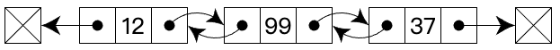

# 数据结构之双向链表实现(TypeScript版)

- `Comparator` 实现见前文 [前端比较方法的优雅封装](../20220110_前端比较方法的优雅封装/index.md)
- `单向链表` 实现见前文 [数据结构之链表实现](../20220127_数据结构之链表实现_TypeScript版/index.md)

## 1. 介绍

在计算机科学中, 一个 **双向链表(doubly linked list)** 是由一组称为节点的顺序链接记录组成的链接数据结构。每个节点包含两个字段，称为链接，它们是对节点序列中上一个节点和下一个节点的引用。两个节点链接允许在任一方向上遍历列表。

在双向链表中进行添加或者删除节点时,需做的链接更改要比单向链表复杂一些。
这种操作在单向链表中更简单高效，因为不需要关注一个节点（除第一个和最后一个节点以外的节点）的两个链接，而只需要关注一个链接即可。

存储格式如下：



## 2. 基础操作

> 这里仅展示和`单向链表`实现不同的部分。

### 2.1 初始化

```ts
// doubly-linked-list/DoublyLinkedListNode.ts

export default class DoublyLinkedListNode {
    public value: any;
    public next: null | DoublyLinkedListNode;
    public previous: any | DoublyLinkedListNode;

    constructor(value: any, next = null, previous = null) {
        this.value = value;
        this.next = next;
        this.previous = previous;
    }

    toString(callback?: (value: any) => any) {
        return callback ? callback(this.value) : `${this.value}`;
    }
}
```

```ts
// doubly-linked-list/DoublyLinkedList.ts

import Comparator, { TypeCompareFun } from '../utils/comparator/Comparator';
import DoublyLinkedListNode from './DoublyLinkedListNode';

export default class DoublyLinkedList {
    public head: null | DoublyLinkedListNode;
    public tail: null | DoublyLinkedListNode;
    public compare: Comparator;

    constructor(comparatorFunction?: TypeCompareFun) {
        this.head = null;

        this.tail = null;

        this.compare = new Comparator(comparatorFunction);
    }

    // ...
}
```

### 2.2 头部插入

```ts
// doubly-linked-list/DoublyLinkedList.ts

// ...

export default class DoublyLinkedList {
    // ...

    // 头部插入
    prepend(value: any) {
    // Make new node to be a head.
        const newNode = new DoublyLinkedListNode(value, this.head);

        // If there is head, then it won't be head anymore.
        // Therefore, make its previous reference to be new node (new head).
        // Then mark the new node as head.
        if (this.head) {
            this.head.previous = newNode;
        }
        this.head = newNode;

        // If there is no tail yet let's make new node a tail.
        if (!this.tail) {
            this.tail = newNode;
        }

        return this;
    }

    // ...
}
```

### 2.3 尾部插入

```ts
// doubly-linked-list/DoublyLinkedList.ts

// ...

export default class DoublyLinkedList {
    // ...

    // 尾部插入
    append(value: any) {
        const newNode = new DoublyLinkedListNode(value);

        // If there is no head yet let's make new node a head.
        if (!this.head) {
            this.head = newNode;
            this.tail = newNode;

            return this;
        }

        // Attach new node to the end of linked list.
        this.tail.next = newNode;

        // Attach current tail to the new node's previous reference.
        newNode.previous = this.tail;

        // Set new node to be the tail of linked list.
        this.tail = newNode;

        return this;
    }

    // ...
}
```

### 2.4 删除节点

```ts
// doubly-linked-list/DoublyLinkedList.ts

// ...

export default class DoublyLinkedList {
    // ...

    // 删除节点
    delete(value: any) {
        if (!this.head) {
            return null;
        }

        let deletedNode = null;
        let currentNode = this.head;

        while (currentNode) {
            if (this.compare.equal(currentNode.value, value)) {
                deletedNode = currentNode;

                if (deletedNode === this.head) {
                    // If HEAD is going to be deleted...

                    // Set head to second node, which will become new head.
                    this.head = deletedNode.next;

                    // Set new head's previous to null.
                    if (this.head) {
                        this.head.previous = null;
                    }

                    // If all the nodes in list has same value that is passed as argument
                    // then all nodes will get deleted, therefore tail needs to be updated.
                    if (deletedNode === this.tail) {
                        this.tail = null;
                    }
                }
                else if (deletedNode === this.tail) {
                    // If TAIL is going to be deleted...

                    // Set tail to second last node, which will become new tail.
                    this.tail = deletedNode.previous;
                    this.tail.next = null;
                }
                else {
                    // If MIDDLE node is going to be deleted...
                    const previousNode = deletedNode.previous;
                    const nextNode = deletedNode.next;

                    previousNode.next = nextNode;
                    nextNode.previous = previousNode;
                }
            }

            currentNode = currentNode.next;
        }

        return deletedNode;
    }

    // ...
}
```

### 2.5 删除尾部节点

```ts
// doubly-linked-list/DoublyLinkedList.ts

// ...

export default class DoublyLinkedList {
    // ...

    // 删除尾部节点
    deleteTail() {
        if (!this.tail) {
            // No tail to delete.
            return null;
        }

        if (this.head === this.tail) {
            // There is only one node in linked list.
            const deletedTail = this.tail;
            this.head = null;
            this.tail = null;

            return deletedTail;
        }

        // If there are many nodes in linked list...
        const deletedTail = this.tail;

        this.tail = this.tail.previous;
        this.tail.next = null;

        return deletedTail;
    }

    // ...
}
```

### 2.6 删除头部节点

```ts
// doubly-linked-list/DoublyLinkedList.ts

// ...

export default class DoublyLinkedList {
    // ...

    // 删除头部节点
    deleteHead() {
        if (!this.head) {
            return null;
        }

        const deletedHead = this.head;

        if (this.head.next) {
            this.head = this.head.next;
            this.head.previous = null;
        }
        else {
            this.head = null;
            this.tail = null;
        }

        return deletedHead;
    }

    // ...
}
```

### 2.7 双向链表反转

```ts
// doubly-linked-list/DoublyLinkedList.ts

// ...

export default class DoublyLinkedList {
    // ...

    // 双向链表反转
    reverse() {
        let currNode = this.head;
        let prevNode = null;
        let nextNode = null;

        while (currNode) {
            // Store next node.
            nextNode = currNode.next;
            prevNode = currNode.previous;

            // Change next node of the current node so it would link to previous node.
            currNode.next = prevNode;
            currNode.previous = nextNode;

            // Move prevNode and currNode nodes one step forward.
            prevNode = currNode;
            currNode = nextNode;
        }

        // Reset head and tail.
        this.tail = this.head;
        this.head = prevNode;

        return this;
    }

    // ...
}
```

## 3. 复杂度

**时间复杂度：**

| Access | Search | Insertion | Deletion |
| :----: | :----: | :-------: | :------: |
|  O(n)  |  O(n)  |   O(1)    |   O(1)   |

**空间复杂度：**

O(n)

## 4. 参考

- [JavaScript 算法与数据结构](https://github.com/trekhleb/javascript-algorithms/blob/master/src/data-structures/heap/README.zh-CN.md)
- [数据结构之链表实现](https://mp.weixin.qq.com/s/q00qFtNx3PGgURFI8IqsyA)
- [前端比较方法的优雅封装](https://mp.weixin.qq.com/s/D42CXtkFZNukh5EDueTWlQ)
