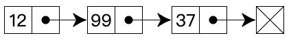

# 数据结构之链表实现( TypeScript 版)

- `Comparator` 实现见前文[前端比较方法的优雅封装](../20220110_前端比较方法的优雅封装/index.md)

## 1. 介绍

在计算机科学中，一个 **链表** 是数据元素的线性集合，元素的线性顺序不是由它们在内存中的物理位置给出的。相反, 每个元素指向下一个元素。它是由一组节点组成的数据结构，这些节点一起，表示序列。

在最简单的形式下，每个节点由数据和到序列中下一个节点的引用（换句话说，链接）组成。这种结构允许在迭代期间有效地从序列中的任何位置插入或删除元素。

更复杂的变体添加额外的链接，允许有效地插入或删除任意元素引用。链表的一个缺点是访问时间是线性的（而且难以管道化）。

更快的访问，如随机访问，是不可行的。与链表相比，数组具有更好的缓存位置。

存储格式如下：



## 2. 基础操作

### 2.1 初始化

```ts
// linked-list/LinkedListNode.ts

export default class LinkedListNode {
    public value: any;
    public next: any;

    constructor(value: any, next = null) {
        this.value = value;
        this.next = next;
    }

    toString(callback?: (value: any) => any) {
        return callback ? callback(this.value) : `${this.value}`;
    }
}
```

```ts
// linked-list/LinkedList.ts

import Comparator, { TypeCompareFun } from '../utils/comparator/Comparator';
import LinkedListNode from './LinkedListNode';

export default class LinkedList {
    public head: null | LinkedListNode;
    public tail: null | LinkedListNode;
    public compare: Comparator;

    constructor(comparatorFunction?: TypeCompareFun) {
        this.head = null;

        this.tail = null;

        this.compare = new Comparator(comparatorFunction);
    }

    // ...
}
```

### 2.2 头部插入

```ts
// linked-list/LinkedList.ts

// ...

export default class LinkedList {
    // ...

    // 头部插入
    prepend(value: any) {
    // Make new node to be a head.
        const newNode = new LinkedListNode(value, this.head);
        this.head = newNode;

        // If there is no tail yet let's make new node a tail.
        if (!this.tail) {
            this.tail = newNode;
        }

        return this;
    }

    // ...
}
```

### 2.3 尾部插入

```ts
// linked-list/LinkedList.ts

// ...

export default class LinkedList {
    // ...

    // 尾部插入
    append(value: any) {
        const newNode = new LinkedListNode(value);

        // If there is no head yet let's make new node a head.
        if (!this.head) {
            this.head = newNode;
            this.tail = newNode;

            return this;
        }

        // Attach new node to the end of linked list.
        this.tail.next = newNode;
        this.tail = newNode;

        return this;
    }

    // ...
}
```

### 2.4 删除节点

```ts
// linked-list/LinkedList.ts

// ...

export default class LinkedList {
    // ...

    // 删除节点
    delete(value: any) {
        if (!this.head) {
            return null;
        }

        let deletedNode = null;

        // If the head must be deleted then make next node that is different
        // from the head to be a new head.
        while (this.head && this.compare.equal(this.head.value, value)) {
            deletedNode = this.head;
            this.head = this.head.next;
        }

        let currentNode = this.head;

        if (currentNode !== null) {
            // If next node must be deleted then make next node to be a next next one.
            while (currentNode.next) {
                if (this.compare.equal(currentNode.next.value, value)) {
                    deletedNode = currentNode.next;
                    currentNode.next = currentNode.next.next;
                }
                else {
                    currentNode = currentNode.next;
                }
            }
        }

        // Check if tail must be deleted.
        if (this.compare.equal(this.tail.value, value)) {
            this.tail = currentNode;
        }

        return deletedNode;
    }

    // ...
}
```

### 2.5 查找节点

```ts
// linked-list/LinkedList.ts

// ...

export default class LinkedList {
    // ...

    // 查找节点
    find({ value = undefined, callback = undefined }) {
        if (!this.head) {
            return null;
        }

        let currentNode = this.head;

        while (currentNode) {
            // If callback is specified then try to find node by callback.
            if (callback && callback(currentNode.value)) {
                return currentNode;
            }

            // If value is specified then try to compare by value..
            if (value !== undefined && this.compare.equal(currentNode.value, value)) {
                return currentNode;
            }

            currentNode = currentNode.next;
        }

        return null;
    }

    // ...
}
```

### 2.6 删除尾部节点

```ts
// linked-list/LinkedList.ts

// ...

export default class LinkedList {
    // ...

    // 删除尾部节点
    deleteTail() {
        const deletedTail = this.tail;

        if (this.head === this.tail) {
            // There is only one node in linked list.
            this.head = null;
            this.tail = null;

            return deletedTail;
        }

        // If there are many nodes in linked list...

        // Rewind to the last node and delete "next" link for the node before the last one.
        let currentNode = this.head;
        while (currentNode.next) {
            if (!currentNode.next.next) {
                currentNode.next = null;
            }
            else {
                currentNode = currentNode.next;
            }
        }

        this.tail = currentNode;

        return deletedTail;
    }

    // ...
}
```

### 2.7 删除头部节点

```ts
// linked-list/LinkedList.ts

// ...

export default class LinkedList {
    // ...

    // 删除头部节点
    deleteHead() {
    // 无节点
        if (!this.head) {
            return null;
        }

        const deletedHead = this.head;

        // 多于一个节点
        if (this.head.next) {
            this.head = this.head.next;
        }
        else {
            // 仅有一个节点
            this.head = null;
            this.tail = null;
        }

        return deletedHead;
    }

    // ...
}
```

### 2.8 根据数组初始化链表

```ts
// linked-list/LinkedList.ts

// ...

export default class LinkedList {
    // ...

    // 根据数组初始化链表
    fromArray(values: any[]) {
        values.forEach(value => this.append(value));

        return this;
    }

    // ...
}
```

### 2.9 转为节点数组

```ts
// linked-list/LinkedList.ts

// ...

export default class LinkedList {
    // ...

    // 转为节点数组
    toArray() {
        const nodes = [];

        let currentNode = this.head;
        while (currentNode) {
            nodes.push(currentNode);
            currentNode = currentNode.next;
        }

        return nodes;
    }

    // ...
}
```

### 2.10 转为字符串展示

```ts
// linked-list/LinkedList.ts

// ...

export default class LinkedList {
    // ...

    // 转为字符串展示
    toString(callback?: (value: any) => any) {
        return this.toArray()
            .map(node => node.toString(callback))
            .toString();
    }

    // ...
}
```

### 2.11 链表头尾倒转

```ts
// linked-list/LinkedList.ts

// ...

export default class LinkedList {
    // ...

    // 链表头尾倒转
    reverse() {
        let currNode = this.head;
        let prevNode = null;
        let nextNode = null;

        while (currNode) {
            // Store next node.
            nextNode = currNode.next;

            // Change next node of the current node so it would link to previous node.
            currNode.next = prevNode;

            // Move prevNode and currNode nodes one step forward.
            prevNode = currNode;
            currNode = nextNode;
        }

        // Reset head and tail.
        this.tail = this.head;
        this.head = prevNode;

        return this;
    }

    // ...
}
```

## 3. 复杂度

**时间复杂度：**

| Access | Search | Insertion | Deletion |
| :----: | :----: | :-------: | :------: |
|  O(n)  |  O(n)  |   O(1)    |   O(1)   |

**空间复杂度：**

O(n)

## 4. 参考

- [JavaScript 算法与数据结构](https://github.com/trekhleb/javascript-algorithms/blob/master/src/data-structures/heap/README.zh-CN.md)
- [前端比较方法的优雅封装](https://mp.weixin.qq.com/s/D42CXtkFZNukh5EDueTWlQ)
