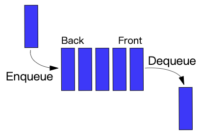
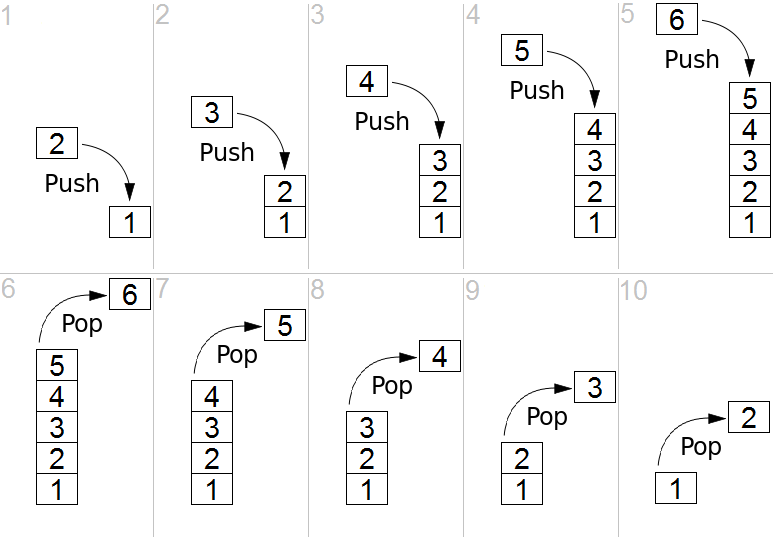

# 数据结构之栈和队列实现(TypeScript版)

- `Comparator` 实现见前文 [前端比较方法的优雅封装](../20220110_前端比较方法的优雅封装/index.md)
- `最小堆` 实现见前文 [数据结构之 Heap 实现](../20220112_数据结构之Heap实现_TypeScript版/index.md)
- `单向链表` 实现见前文 [数据结构之链表实现](../20220127_数据结构之链表实现_TypeScript版/index.md)

## 1. 队列

### 1.1 介绍

队列基本操作有两种：入队和出队。从队列的后端位置添加实体，称为入队；从队列的前端位置移除实体，称为出队。

队列中元素`先进先出 FIFO(first in, first out)`的示意：



### 1.2 实现

```ts
// queue/Queue.ts

import LinkedList from '../linked-list/LinkedList';

export default class Queue {
    public linkedList: LinkedList;

    constructor() {
    // We're going to implement Queue based on LinkedList since the two
    // structures are quite similar. Namely, they both operate mostly on
    // the elements at the beginning and the end. Compare enqueue/dequeue
    // operations of Queue with append/deleteHead operations of LinkedList.
        this.linkedList = new LinkedList();
    }

    isEmpty() {
        return !this.linkedList.head;
    }

    /**
     * Read the element at the front of the queue without removing it.
     */
    peek() {
        if (this.isEmpty()) {
            return null;
        }

        return this.linkedList.head.value;
    }

    /**
     * Add a new element to the end of the queue (the tail of the linked list).
     * This element will be processed after all elements ahead of it.
     */
    enqueue(value: any) {
        this.linkedList.append(value);
    }

    /**
     * Remove the element at the front of the queue (the head of the linked list).
     * If the queue is empty, return null.
     */
    dequeue() {
        const removedHead = this.linkedList.deleteHead();
        return removedHead ? removedHead.value : null;
    }

    toString(callback?: (value: any) => any) {
    // Return string representation of the queue's linked list.
        return this.linkedList.toString(callback);
    }
}
```

## 2. 栈

### 2.1 介绍

`栈`这个名称，可类比于一组物体的堆叠（一摞书，一摞盘子之类的）。

栈的元素`后进先出(LIFO = last in, first out)`操作的示意：



### 2.2 实现

```ts
// stack/Stack.ts

import LinkedList from '../linked-list/LinkedList';

export default class Stack {
    public linkedList: LinkedList;

    constructor() {
    // We're going to implement Stack based on LinkedList since these
    // structures are quite similar. Compare push/pop operations of the Stack
    // with prepend/deleteHead operations of LinkedList.
        this.linkedList = new LinkedList();
    }

    isEmpty() {
    // The stack is empty if its linked list doesn't have a head.
        return !this.linkedList.head;
    }

    peek() {
        if (this.isEmpty()) {
            // If the linked list is empty then there is nothing to peek from.
            return null;
        }

        // Just read the value from the start of linked list without deleting it.
        return this.linkedList.head.value;
    }

    push(value: any) {
    // Pushing means to lay the value on top of the stack. Therefore let's just add
    // the new value at the start of the linked list.
        this.linkedList.prepend(value);
    }

    pop() {
    // Let's try to delete the first node (the head) from the linked list.
    // If there is no head (the linked list is empty) just return null.
        const removedHead = this.linkedList.deleteHead();
        return removedHead ? removedHead.value : null;
    }

    toArray() {
        return this.linkedList.toArray().map(linkedListNode => linkedListNode.value);
    }

    toString(callback?: (value: any) => any) {
        return this.linkedList.toString(callback);
    }
}
```

## 3. 优先队列

### 3.1 介绍

**优先级队列(priority queue)** 是一种抽象数据类型，它类似于常规的队列或栈，但每个元素都有与之关联的“优先级”。

在优先队列中，低优先级的元素前面应该是高优先级的元素。
如果两个元素具有相同的优先级，则根据它们在队列中的顺序即可。

优先队列虽通常用堆来实现，但它在概念上与堆不同。
优先队列是一个抽象概念，就像“列表”或“图”这样的抽象概念一样。

正如列表可以用链表或数组实现一样，优先队列可以用堆或各种其他方法实现，例如无序数组。

### 3.2 实现

```ts
// priority-queue/PriorityQueue.ts

import MinHeap from '../heap/MinHeap';
import Comparator, { TypeCompareParam } from '../utils/comparator/Comparator';

// It is the same as min heap except that when comparing two elements
// we take into account its priority instead of the element's value.
export default class PriorityQueue extends MinHeap {
    private priorities: Map<any, number>;

    constructor() {
    // Call MinHeap constructor first.
        super();

        // Setup priorities map.
        this.priorities = new Map();

        // Use custom comparator for heap elements that will take element priority
        // instead of element value into account.
        this.compare = new Comparator(this.comparePriority.bind(this));
    }

    /**
     * Add item to the priority queue.
     * @param item - item we're going to add to the queue.
     * @param priority - items priority.
     */
    add(item: TypeCompareParam, priority = 0) {
        this.priorities.set(item, priority);
        super.add(item);
        return this;
    }

    /**
     * Remove item from priority queue.
     * @param item - item we're going to remove.
     * @param customFindingComparator - custom function for finding the item to remove
     */
    remove(item: TypeCompareParam, customFindingComparator?: Comparator) {
        super.remove(item, customFindingComparator);
        this.priorities.delete(item);
        return this;
    }

    /**
     * Change priority of the item in a queue.
     * @param item - item we're going to re-prioritize.
     * @param priority - new item's priority.
     */
    changePriority(item: TypeCompareParam, priority: number) {
        this.remove(item, new Comparator(this.compareValue));
        this.add(item, priority);
        return this;
    }

    /**
     * Find item by ite value.
     */
    findByValue(item: TypeCompareParam) {
        return this.find(item, new Comparator(this.compareValue));
    }

    /**
     * Check if item already exists in a queue.
     */
    hasValue(item: TypeCompareParam) {
        return this.findByValue(item).length > 0;
    }

    /**
     * Compares priorities of two items.
     */
    comparePriority(a: TypeCompareParam, b: TypeCompareParam) {
        if (this.priorities.get(a) === this.priorities.get(b)) {
            return 0;
        }
        return this.priorities.get(a) < this.priorities.get(b) ? -1 : 1;
    }

    /**
     * Compares values of two items.
     */
    compareValue(a: TypeCompareParam, b: TypeCompareParam) {
        if (a === b) {
            return 0;
        }
        return a < b ? -1 : 1;
    }
}
```

## 4. 参考

- [JavaScript 算法与数据结构](https://github.com/trekhleb/javascript-algorithms/blob/master/src/data-structures/heap/README.zh-CN.md)
- [前端比较方法的优雅封装](https://mp.weixin.qq.com/s/D42CXtkFZNukh5EDueTWlQ)
- [数据结构之 Heap 实现](https://mp.weixin.qq.com/s/KRzvexuB-V6dttoketbw2A)
- [数据结构之链表实现](https://mp.weixin.qq.com/s/q00qFtNx3PGgURFI8IqsyA)
