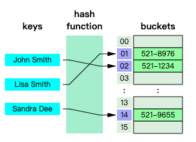

# 数据结构之哈希表(散列)实现(TypeScript版)

- `单向链表` 实现见前文 [数据结构之链表实现](../20220127_数据结构之链表实现_TypeScript版/index.md)

## 1. 介绍

**哈希表(hash table 或 hash map)** 是一种实现 `关联数组(associative array)` 的抽象数据类型，该结构可以将 `键映射到值` 。

哈希表使用 `哈希函数/散列函数` 来计算一个值在 `数组或桶(buckets)` 中或 `槽(slots)` 中对应的索引，可使用该索引找到所需的值。

理想情况下，散列函数将为每个键分配给一个唯一的 `桶(bucket)`，但是大多数哈希表设计采用不完美的散列函数，这可能会导致 `哈希冲突(hash collisions)`，也就是散列函数为多个 `键(key)` 生成了相同的 `索引`，这种碰撞必须以某种方式进行处理。



通过单独的链接解决哈希冲突：


## 2. 实现

```ts
// hash-table/HashTable.ts

import LinkedList from '../linked-list/LinkedList';

// Hash table size directly affects on the number of collisions.
// The bigger the hash table size the less collisions you'll get.
// For demonstrating purposes hash table size is small to show how collisions
// are being handled.
const defaultHashTableSize = 32;

interface TLinkedNode { key: string; value: any }

export default class HashTable {
  public buckets: LinkedList[];
  private keys: { string?: string };

  constructor(hashTableSize = defaultHashTableSize) {
    // Create hash table of certain size and fill each bucket with empty linked list.
    this.buckets = Array.from({ length: hashTableSize })
      .map(() => new LinkedList());

    // Just to keep track of all actual keys in a fast way.
    this.keys = {};
  }

  /**
   * Converts key string to hash number.
   */
  hash(key: string) {
    // For simplicity reasons we will just use character codes sum of all characters of the key
    // to calculate the hash.
    //
    // But you may also use more sophisticated approaches like polynomial string hash to reduce the
    // number of collisions:
    //
    // hash = charCodeAt(0) * PRIME^(n-1) + charCodeAt(1) * PRIME^(n-2) + ... + charCodeAt(n-1)
    //
    // where charCodeAt(i) is the i-th character code of the key, n is the length of the key and
    // PRIME is just any prime number like 31.
    const hash = Array.from(key).reduce((hashAccumulator, keySymbol) => hashAccumulator + keySymbol.charCodeAt(0), 0);

    // Reduce hash number so it would fit hash table size.
    return hash % this.buckets.length;
  }

  set(key: string, value: any) {
    const keyHash = this.hash(key);
    this.keys[key] = keyHash;
    const bucketLinkedList = this.buckets[keyHash];
    const node = bucketLinkedList.find({ callback: (nodeValue: TLinkedNode) => nodeValue.key === key });

    if (!node) {
      // Insert new node.
      bucketLinkedList.append({ key, value });
    }
    else {
      // Update value of existing node.
      node.value.value = value;
    }
  }

  delete(key: string) {
    const keyHash = this.hash(key);
    delete this.keys[key];
    const bucketLinkedList = this.buckets[keyHash];
    const node = bucketLinkedList.find({ callback: (nodeValue: TLinkedNode) => nodeValue.key === key });

    if (node) {
      return bucketLinkedList.delete(node.value);
    }

    return null;
  }

  get(key: string) {
    const bucketLinkedList = this.buckets[this.hash(key)];
    const node = bucketLinkedList.find({ callback: (nodeValue: TLinkedNode) => nodeValue.key === key });

    return node ? node.value.value : undefined;
  }

  has(key: string) {
    return Object.hasOwnProperty.call(this.keys, key);
  }

  getKeys() {
    return Object.keys(this.keys);
  }

  /**
   * Gets the list of all the stored values in the hash table.
   */
  getValues() {
    return this.buckets.reduce((values, bucket) => {
      const bucketValues = bucket.toArray().map(linkedListNode => linkedListNode.value.value);
      return values.concat(bucketValues);
    }, []);
  }
}
```

## 3. 参考

- [JavaScript 算法与数据结构](https://github.com/trekhleb/javascript-algorithms/blob/master/src/data-structures/heap/README.zh-CN.md)
- [数据结构之链表实现](https://mp.weixin.qq.com/s/q00qFtNx3PGgURFI8IqsyA)
