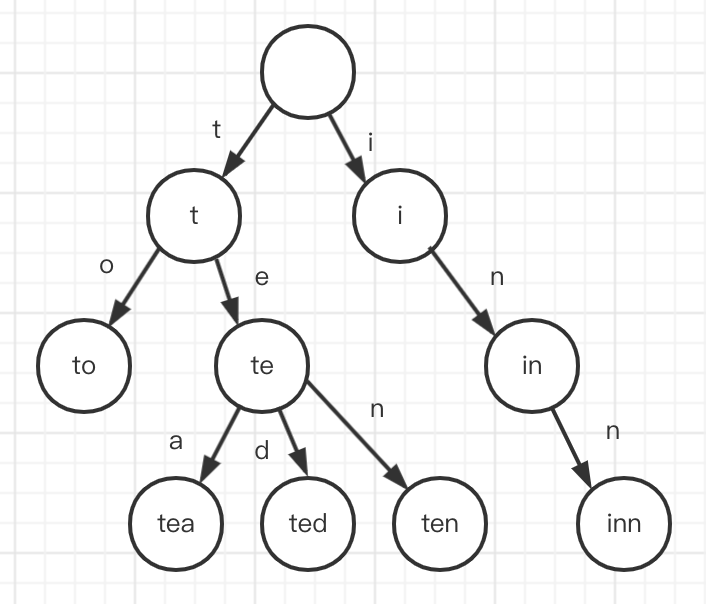

# 数据结构之字典树实现(TypeScript版)

- `哈希表` 实现见前文 [数据结构之哈希表(散列)实现](../20220222_数据结构之哈希表_散列_实现_TypeScript版/index.md)

## 1. 介绍

在计算机科学中, **字典树(trie，中文又被称为“单词查找树”或“键树”)**，也称为前缀树（因为它们可以通过前缀搜索），它是一种搜索树——一种已排序的数据结构，通常用于存储动态集或键为字符串的关联数组。

值对于字典树中关联的节点来说，不是必需的，相反，值往往和相关的叶子相关，以及与一些键相关的内部节点相关。



## 2. 实现

### 2.1 节点

```ts
// trie/TrieNode.ts

import HashTable from '../hash-table/HashTable';

export default class TrieNode {
  public character: string;
  public isCompleteWord: boolean;
  private children: HashTable;

  constructor(character: string, isCompleteWord = false) {
    this.character = character;
    this.isCompleteWord = isCompleteWord;
    this.children = new HashTable();
  }

  // 获取孩子节点
  getChild(character: string) {
    return this.children.get(character);
  }

  // 增加孩子节点，返回增加的节点
  addChild(character: string, isCompleteWord = false): TrieNode {
    if (!this.children.has(character)) {
      this.children.set(character, new TrieNode(character, isCompleteWord));
    }

    const childNode = this.children.get(character);

    // In cases similar to adding "car" after "carpet" we need to mark "r" character as complete.
    childNode.isCompleteWord = childNode.isCompleteWord || isCompleteWord;

    return childNode;
  }

  // 删除孩子节点
  removeChild(character: string) {
    const childNode = this.getChild(character);

    // Delete childNode only if:
    // - childNode has NO children,
    // - childNode.isCompleteWord === false.
    if (childNode && !childNode.isCompleteWord && !childNode.hasChildren()) {
      this.children.delete(character);
    }

    return this;
  }

  // 是否有指定孩子节点
  hasChild(character: string) {
    return this.children.has(character);
  }

  /**
   * Check whether current TrieNode has children or not.
   */
  hasChildren() {
    return this.children.getKeys().length !== 0;
  }

  // 展示孩子节点
  suggestChildren() {
    return [...this.children.getKeys()];
  }

  toString() {
    let childrenAsString = this.suggestChildren().toString();
    childrenAsString = childrenAsString ? `:${childrenAsString}` : '';
    const isCompleteString = this.isCompleteWord ? '*' : '';

    return `${this.character}${isCompleteString}${childrenAsString}`;
  }
}
```

### 2.2 树

```ts
// trie/Trie.ts

import TrieNode from './TrieNode';

// Character that we will use for trie tree root.
const HEAD_CHARACTER = '*';

export default class Trie {
  public head: TrieNode;

  constructor() {
    this.head = new TrieNode(HEAD_CHARACTER);
  }

  // 增加单词
  addWord(word: string) {
    const characters = Array.from(word);
    let currentNode = this.head;

    for (let charIndex = 0; charIndex < characters.length; charIndex += 1) {
      const isComplete = charIndex === characters.length - 1;
      currentNode = currentNode.addChild(characters[charIndex], isComplete);
    }

    return this;
  }

  // 删除单词
  deleteWord(word: string) {
    const depthFirstDelete = (currentNode: TrieNode, charIndex = 0) => {
      if (charIndex >= word.length) {
        // Return if we're trying to delete the character that is out of word's scope.
        return;
      }

      const character = word[charIndex];
      const nextNode = currentNode.getChild(character);

      if (nextNode == null) {
        // Return if we're trying to delete a word that has not been added to the Trie.
        return;
      }

      // Go deeper.
      depthFirstDelete(nextNode, charIndex + 1);

      // Since we're going to delete a word let's un-mark its last character isCompleteWord flag.
      if (charIndex === word.length - 1) {
        nextNode.isCompleteWord = false;
      }

      // childNode is deleted only if:
      // - childNode has NO children
      // - childNode.isCompleteWord === false
      currentNode.removeChild(character);
    };

    // Start depth-first deletion from the head node.
    depthFirstDelete(this.head);

    return this;
  }

  // 根据单词前缀展示后面的子节点
  suggestNextCharacters(word: string) {
    const lastCharacter = this.getLastCharacterNode(word);

    if (!lastCharacter) {
      return null;
    }

    return lastCharacter.suggestChildren();
  }

  /**
   * Check if complete word exists in Trie.
   */
  doesWordExist(word: string) {
    const lastCharacter = this.getLastCharacterNode(word);

    return !!lastCharacter && lastCharacter.isCompleteWord;
  }

  // 根据单词前缀获取最后一个字符对应的节点
  getLastCharacterNode(word: string) {
    const characters = Array.from(word);
    let currentNode = this.head;

    for (let charIndex = 0; charIndex < characters.length; charIndex += 1) {
      if (!currentNode.hasChild(characters[charIndex])) {
        return null;
      }

      currentNode = currentNode.getChild(characters[charIndex]);
    }

    return currentNode;
  }
}
```

## 3. 参考

- [JavaScript 算法与数据结构](https://github.com/trekhleb/javascript-algorithms/blob/master/src/data-structures/heap/README.zh-CN.md)
- [数据结构之哈希表(散列)实现](https://mp.weixin.qq.com/s/9-AqA_IRQahq1XaqV04wIw)
