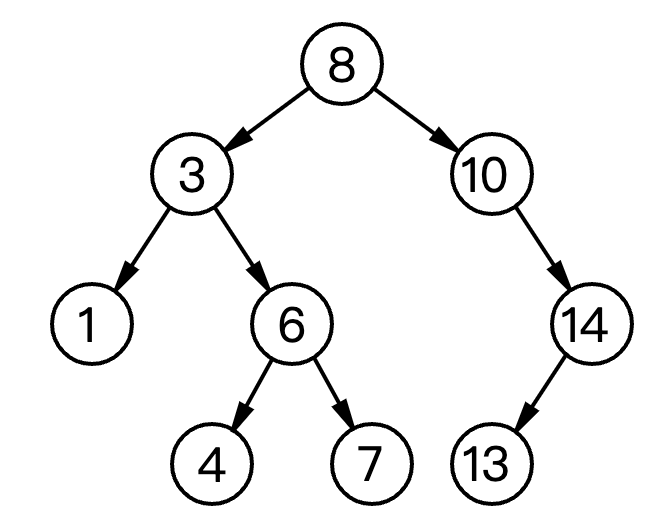

# 数据结构之二叉查找树实现(TypeScript版)

- `Comparator` 实现见前文 [前端比较方法的优雅封装](../20220110_前端比较方法的优雅封装/index.md)
- `哈希表` 实现见前文 [数据结构之哈希表(散列)实现](../20220222_数据结构之哈希表_散列_实现_TypeScript版/index.md)

## 1. 介绍

在计算机科学中，`二叉搜索树(BST)`，也称为有序二叉树或排序二叉树，是一种有根的二叉树数据结构，其内部节点存储的每个键大于节点左子树的所有键，小于节点右子树的所有键。



**Time Complexity**

|  Access   |  Search   | Insertion | Deletion  |
| :-------: | :-------: | :-------: | :-------: |
| O(log(n)) | O(log(n)) | O(log(n)) | O(log(n)) |

**Space Complexity**

O(n)

## 2. 实现

### 2.1 二叉树节点

```ts
// tree/BinaryTreeNode.ts

import HashTable from '../hash-table/HashTable';
import Comparator from '../utils/comparator/Comparator';

export default class BinaryTreeNode {
  public left: null | BinaryTreeNode;
  public right: null | BinaryTreeNode;
  public parent: null | BinaryTreeNode;
  public value: any;

  public meta: HashTable;
  public nodeComparator: Comparator;

  constructor(value = null) {
    this.left = null;
    this.right = null;
    this.parent = null;
    this.value = value;

    // Any node related meta information may be stored here.
    this.meta = new HashTable();

    // This comparator is used to compare binary tree nodes with each other.
    this.nodeComparator = new Comparator();
  }

  get leftHeight() {
    if (!this.left) {
      return 0;
    }

    return this.left.height + 1;
  }

  get rightHeight() {
    if (!this.right) {
      return 0;
    }

    return this.right.height + 1;
  }

  // 获取当前节点的 height
  get height(): number {
    return Math.max(this.leftHeight, this.rightHeight);
  }

  get balanceFactor() {
    return this.leftHeight - this.rightHeight;
  }

  /**
   * Get parent's sibling if it exists.
   */
  get uncle() {
    // Check if current node has parent.
    if (!this.parent) {
      return undefined;
    }

    // Check if current node has grand-parent.
    if (!this.parent.parent) {
      return undefined;
    }

    // Check if grand-parent has two children.
    if (!this.parent.parent.left || !this.parent.parent.right) {
      return undefined;
    }

    // So for now we know that current node has grand-parent and this
    // grand-parent has two children. Let's find out who is the uncle.
    if (this.nodeComparator.equal(this.parent, this.parent.parent.left)) {
      // Right one is an uncle.
      return this.parent.parent.right;
    }

    // Left one is an uncle.
    return this.parent.parent.left;
  }

  // 设置节点的值，作为大小的比较
  setValue(value: any) {
    this.value = value;

    return this;
  }

  // 设置左子节点
  setLeft(node: null | BinaryTreeNode) {
    // Reset parent for left node since it is going to be detached.
    if (this.left) {
      this.left.parent = null;
    }

    // Attach new node to the left.
    this.left = node;

    // Make current node to be a parent for new left one.
    if (node) {
      this.left.parent = this;
    }

    return this;
  }

  // 设置右子节点
  setRight(node: null | BinaryTreeNode) {
    // Reset parent for right node since it is going to be detached.
    if (this.right) {
      this.right.parent = null;
    }

    // Attach new node to the right.
    this.right = node;

    // Make current node to be a parent for new right one.
    if (node) {
      this.right.parent = this;
    }

    return this;
  }

  // 删除子节点
  removeChild(nodeToRemove: null | BinaryTreeNode) {
    if (this.left && this.nodeComparator.equal(this.left, nodeToRemove)) {
      this.left = null;
      return true;
    }

    if (this.right && this.nodeComparator.equal(this.right, nodeToRemove)) {
      this.right = null;
      return true;
    }

    return false;
  }

  // 替换子节点
  replaceChild(nodeToReplace: null | BinaryTreeNode, replacementNode: null | BinaryTreeNode) {
    if (!nodeToReplace || !replacementNode) {
      return false;
    }

    if (this.left && this.nodeComparator.equal(this.left, nodeToReplace)) {
      this.left = replacementNode;
      return true;
    }

    if (this.right && this.nodeComparator.equal(this.right, nodeToReplace)) {
      this.right = replacementNode;
      return true;
    }

    return false;
  }

  // 复制节点
  static copyNode(sourceNode: BinaryTreeNode, targetNode: BinaryTreeNode) {
    targetNode.setValue(sourceNode.value);
    targetNode.setLeft(sourceNode.left);
    targetNode.setRight(sourceNode.right);
  }

  // 顺序遍历
  traverseInOrder() {
    let traverse = [];

    // Add left node.
    if (this.left) {
      traverse = traverse.concat(this.left.traverseInOrder());
    }

    // Add root.
    traverse.push(this.value);

    // Add right node.
    if (this.right) {
      traverse = traverse.concat(this.right.traverseInOrder());
    }

    return traverse;
  }

  toString() {
    return this.traverseInOrder().toString();
  }
}
```

### 2.2 二叉查找树节点

```ts
// tree/binary-search-tree/BinarySearchTreeNode.ts

import Comparator, { TypeCompareFun } from '../../utils/comparator/Comparator';
import BinaryTreeNode from '../BinaryTreeNode';

export default class BinarySearchTreeNode extends BinaryTreeNode {
  declare left: null | BinarySearchTreeNode;
  declare right: null | BinarySearchTreeNode;
  declare parent: null | BinarySearchTreeNode;

  public compareFunction: TypeCompareFun;
  public nodeValueComparator: Comparator;

  constructor(value = null, compareFunction: TypeCompareFun = undefined) {
    super(value);

    // This comparator is used to compare node values with each other.
    this.compareFunction = compareFunction;
    this.nodeValueComparator = new Comparator(compareFunction);
  }

  // 插入项
  insert(value: any): BinarySearchTreeNode {
    if (this.nodeValueComparator.equal(this.value, null)) {
      this.value = value;

      return this;
    }

    if (this.nodeValueComparator.lessThan(value, this.value)) {
      // Insert to the left.
      if (this.left) {
        return this.left.insert(value);
      }

      const newNode = new BinarySearchTreeNode(value, this.compareFunction);
      this.setLeft(newNode);

      return newNode;
    }

    if (this.nodeValueComparator.greaterThan(value, this.value)) {
      // Insert to the right.
      if (this.right) {
        return this.right.insert(value);
      }

      const newNode = new BinarySearchTreeNode(value, this.compareFunction);
      this.setRight(newNode);

      return newNode;
    }

    return this;
  }

  // 查找项
  find(value: any): null | BinarySearchTreeNode {
    // Check the root.
    if (this.nodeValueComparator.equal(this.value, value)) {
      return this;
    }

    if (this.nodeValueComparator.lessThan(value, this.value) && this.left) {
      // Check left nodes.
      return this.left.find(value);
    }

    if (this.nodeValueComparator.greaterThan(value, this.value) && this.right) {
      // Check right nodes.
      return this.right.find(value);
    }

    return null;
  }

  // 是否包含某项
  contains(value: any) {
    return !!this.find(value);
  }

  // 删除项
  remove(value: any) {
    const nodeToRemove = this.find(value);

    if (!nodeToRemove) {
      throw new Error('Item not found in the tree');
    }

    const { parent } = nodeToRemove;

    if (!nodeToRemove.left && !nodeToRemove.right) {
      // Node is a leaf and thus has no children.
      if (parent) {
        // Node has a parent. Just remove the pointer to this node from the parent.
        parent.removeChild(nodeToRemove);
      }
      else {
        // Node has no parent. Just erase current node value.
        nodeToRemove.setValue(undefined);
      }
    }
    else if (nodeToRemove.left && nodeToRemove.right) {
      // Node has two children.
      // Find the next bigger value (minimum value in the right branch)
      // and replace current value node with that next bigger value.
      const nextBiggerNode = nodeToRemove.right.findMin();
      if (!this.nodeComparator.equal(nextBiggerNode, nodeToRemove.right)) {
        this.remove(nextBiggerNode.value);
        nodeToRemove.setValue(nextBiggerNode.value);
      }
      else {
        // In case if next right value is the next bigger one and it doesn't have left child
        // then just replace node that is going to be deleted with the right node.
        nodeToRemove.setValue(nodeToRemove.right.value);
        nodeToRemove.setRight(nodeToRemove.right.right);
      }
    }
    else {
      // Node has only one child.
      // Make this child to be a direct child of current node's parent.
      const childNode = nodeToRemove.left || nodeToRemove.right;

      if (parent) {
        parent.replaceChild(nodeToRemove, childNode);
      }
      else {
        BinaryTreeNode.copyNode(childNode, nodeToRemove);
      }
    }

    // Clear the parent of removed node.
    nodeToRemove.parent = null;

    return true;
  }

  findMin(): BinarySearchTreeNode {
    if (!this.left) {
      return this;
    }

    return this.left.findMin();
  }
}
```

### 2.3 二叉查找树

```ts
// tree/binary-search-tree/BinarySearchTree.ts

import Comparator, { TypeCompareFun } from '../../utils/comparator/Comparator';
import BinarySearchTreeNode from './BinarySearchTreeNode';

export default class BinarySearchTree {
  public root: BinarySearchTreeNode;
  public nodeComparator: Comparator;

  constructor(nodeValueCompareFunction?: TypeCompareFun) {
    this.root = new BinarySearchTreeNode(null, nodeValueCompareFunction);

    // Steal node comparator from the root.
    this.nodeComparator = this.root.nodeComparator;
  }

  // 插入项
  insert(value: any) {
    return this.root.insert(value);
  }

  // 是否包含某项
  contains(value: any) {
    return this.root.contains(value);
  }

  // 删除项
  remove(value: any) {
    return this.root.remove(value);
  }

  toString() {
    return this.root.toString();
  }
}
```

## 3. 参考

- [JavaScript 算法与数据结构](https://github.com/trekhleb/javascript-algorithms/blob/master/src/data-structures/heap/README.zh-CN.md)
- [前端比较方法的优雅封装](https://mp.weixin.qq.com/s/D42CXtkFZNukh5EDueTWlQ)
- [数据结构之哈希表(散列)实现](https://mp.weixin.qq.com/s/9-AqA_IRQahq1XaqV04wIw)
