# 数据结构之平衡二叉树实现(TypeScript版)

- `二叉查找树实现` 实现见前文 [数据结构之二叉查找树实现](../20220225_数据结构之二叉查找树实现_TypeScript版/index.md)

## 1. 介绍

在计算机科学中，一种以发明者命名的 `AVL 树（Adelson-Velsky 和 Landis）` 是一种自平衡二叉搜索树。
在 `AVL` 树中，任意子树的两个子树的高度节点差值（也就是平衡因子的绝对值）最多为 `1`;
如果在任何时候它们的差异至少为 `1`, 需要重新平衡以恢复此属性。

若 `平衡因子 = 右子树的高度 - 左子树的高度`，则插入的树节点的平衡动画：


## 2. 分析

### 2.1 节点的高度和平衡因子

- `h - 子树的高度`
- `f - 平衡因子 = 左子树的高度 - 右子树的高度`

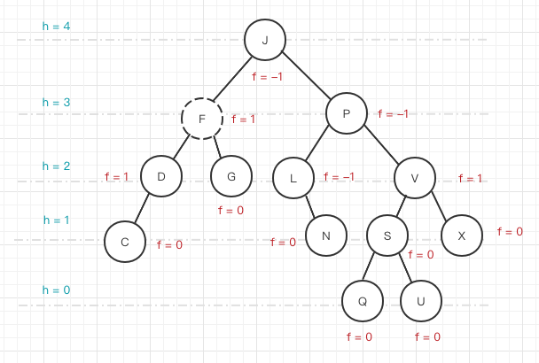

```ts
// tree/BinaryTreeNode.ts

// ...

export default class BinaryTreeNode {
  // ...

  get balanceFactor() {
    return this.leftHeight - this.rightHeight;
  }

  // ...
}
```

### 2.2 平衡操作 - 子树的旋转

#### 2.2.1 左-左(LL)

- 第一个 L 表示插入节点的父节点，第二个 L 表示插入节点
- 向右的单旋转

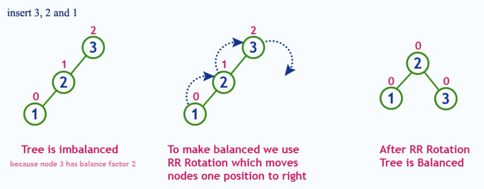

#### 2.2.2 左-右(LR)

- 第一个 L 表示插入节点的父节点，第二个 R 表示插入节点
- 向右的双旋转

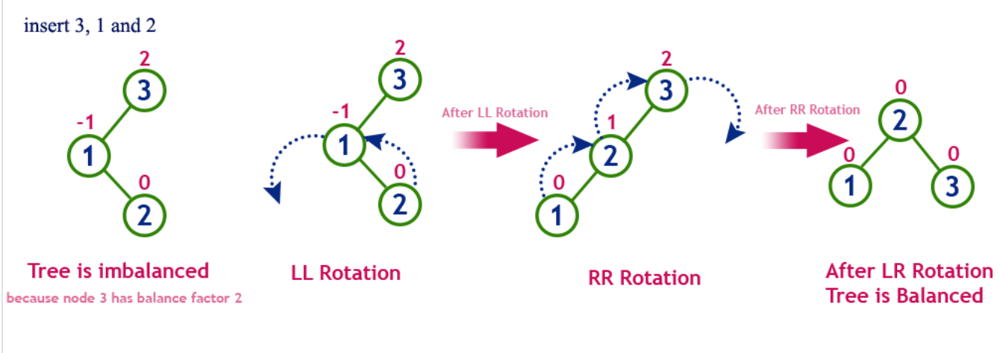

#### 2.2.3 右-右(RR)

- 第一个 R 表示插入节点的父节点，第二个 R 表示插入节点
- 向左的单旋转

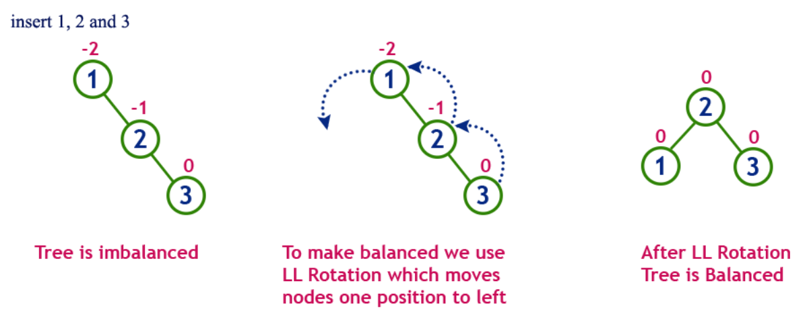

#### 2.2.4 右-左(RL)

- 第一个 R 表示插入节点的父节点，第二个 L 表示插入节点
- 向左的双旋转

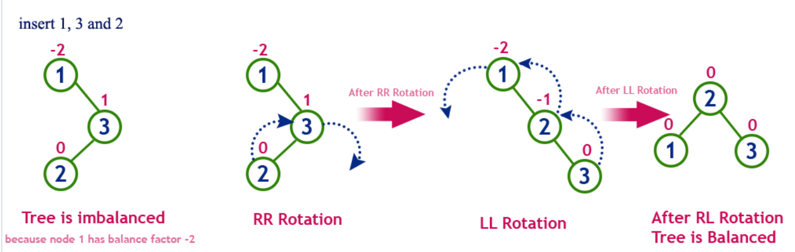

## 3. 实现

### 3.1 插入

因为插入节点之前，已经是平衡状态，所以只需考虑最后插入节点后，四种旋转操作场景即可。

```ts
// tree/avl-tree/AvlTree.ts

import BinarySearchTree from '../binary-search-tree/BinarySearchTree';
import BinarySearchTreeNode from '../binary-search-tree/BinarySearchTreeNode';

export default class AvlTree extends BinarySearchTree {
  // ...

  // 插入项
  insert(value: any) {
    // Do the normal BST insert.
    super.insert(value);

    // Let's move up to the root and check balance factors along the way.
    let currentNode = this.root.find(value);
    while (currentNode) {
      this.balance(currentNode);
      currentNode = currentNode.parent;
    }

    return currentNode;
  }

  // ...
}
```

### 3.2 删除

#### 3.2.1 分析

##### 3.2.1.1 删除叶子节点

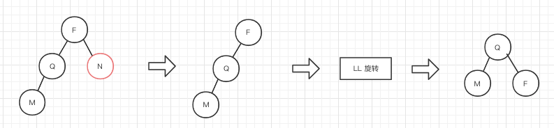

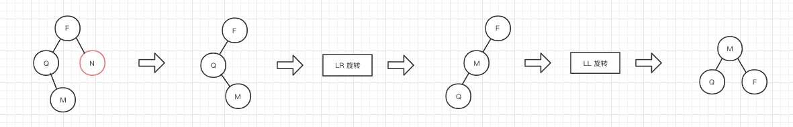

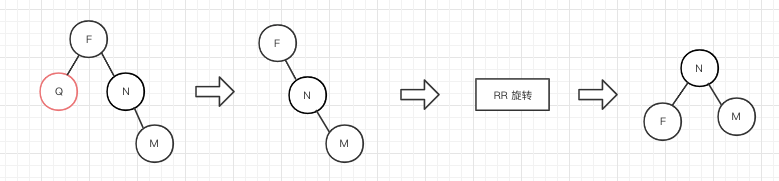

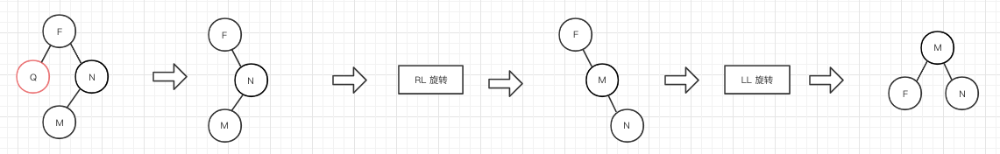

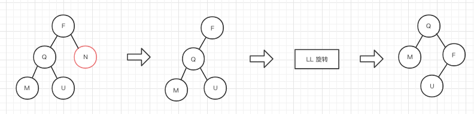

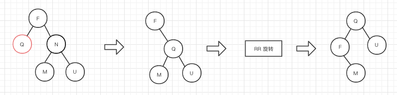

##### 3.2.1.2 删除仅有一个子树的节点

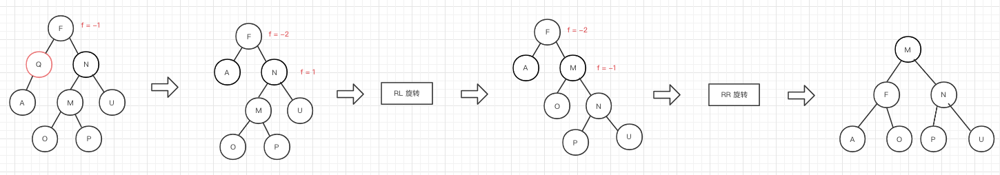

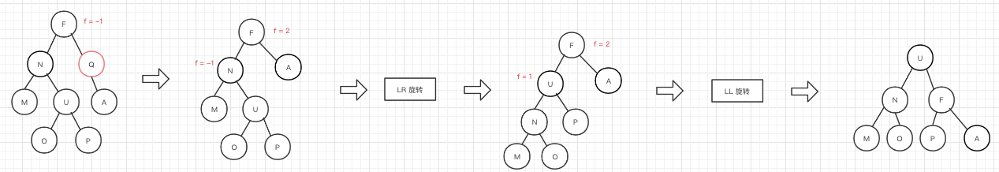

##### 3.2.1.3 删除有两个子树的节点

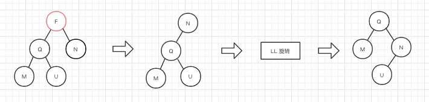

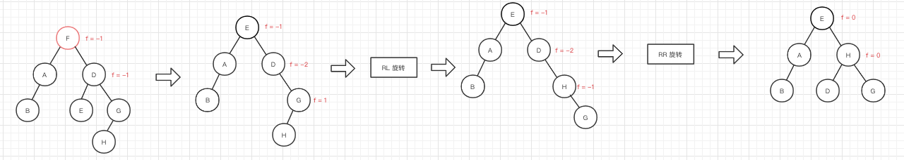

#### 3.2.2 实现

```ts
// tree/avl-tree/AvlTree.ts

// ...

export default class AvlTree extends BinarySearchTree {
  // ...

  // 删除项
  remove(value: any) {
    let currentNode = this.root.find(value);

    if (currentNode.left && currentNode.right) {
      // 左右都有子树的情况，删除仅可能会影响右子树的平衡
      currentNode = currentNode.findMax();
    }
    else if (currentNode.left || currentNode.right) {
      // 仅有一个子树的情况，删除可能会影响子树的平衡
      currentNode = currentNode.left || currentNode.right;
    }
    else {
      // 若为叶子节点，因为没有子树，所以仅需考虑父节点即可
      currentNode = currentNode.parent;
    }

    // Do standard BST removal.
    const result = super.remove(value);

    // Let's move up to the root and check balance factors along the way.
    while (currentNode) {
      this.balance(currentNode);
      currentNode = currentNode.parent;
    }

    return result;
  }

  // ...
}
```

### 3.3 平衡旋转

我们发现，不管是插入还是删除，旋转操作可归类四种：LL、LR、RR、RL。

#### 3.3.1 整体

```ts
// tree/avl-tree/AvlTree.ts

// ...

export default class AvlTree extends BinarySearchTree {
  // ...

  // 平衡当前节点
  balance(node: BinarySearchTreeNode) {
    // If balance factor is not OK then try to balance the node.
    if (node.balanceFactor > 1) {
      // Left rotation.
      if (node.left.balanceFactor < 0) {
        // Left-Right rotation.
        this.rotateLeftRight(node);
      }
      else {
        // Left-Left rotation
        this.rotateLeftLeft(node);
      }
    }
    else if (node.balanceFactor < -1) {
      // Right rotation.
      if (node.right.balanceFactor > 0) {
        // Right-Left rotation.
        this.rotateRightLeft(node);
      }
      else {
        // Right-Right rotation
        this.rotateRightRight(node);
      }
    }
  }

  // ...
}
```

#### 3.3.2 LL

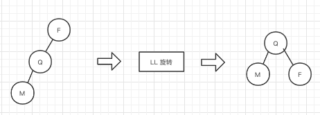

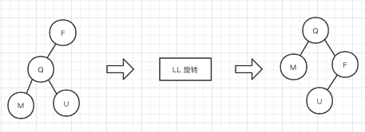

```ts
// tree/avl-tree/AvlTree.ts

// ...

export default class AvlTree extends BinarySearchTree {
  // ...

  // LL
  rotateLeftLeft(rootNode: BinarySearchTreeNode) {
    // Detach left node from root node.
    const leftNode = rootNode.left;
    rootNode.setLeft(null);

    // Make left node to be a child of rootNode's parent.
    if (rootNode.parent) {
      if (rootNode.parent.left === rootNode) {
        rootNode.parent.setLeft(leftNode);
      }
      else {
        rootNode.parent.setRight(leftNode);
      }
    }
    else if (rootNode === this.root) {
      // If root node is root then make left node to be a new root.
      this.root = leftNode;
    }

    // If left node has a right child then detach it and
    // attach it as a left child for rootNode.
    if (leftNode.right) {
      rootNode.setLeft(leftNode.right);
    }

    // Attach rootNode to the right of leftNode.
    leftNode.setRight(rootNode);
  }

  // ...
}
```

#### 3.3.3 LR

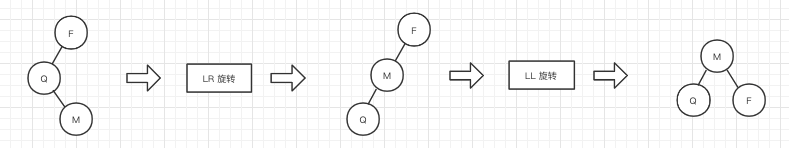

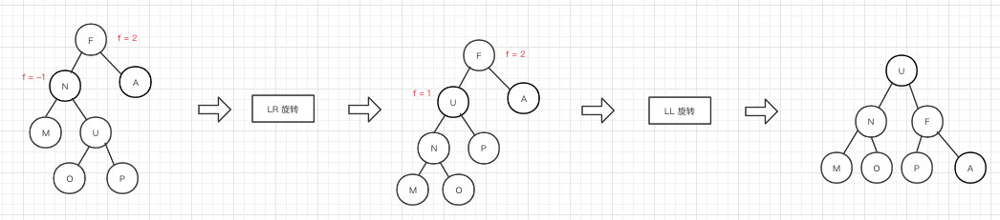

```ts
// tree/avl-tree/AvlTree.ts

// ...

export default class AvlTree extends BinarySearchTree {
  // ...

  // LR
  rotateLeftRight(rootNode: BinarySearchTreeNode) {
    // Detach left node from rootNode since it is going to be replaced.
    const leftNode = rootNode.left;
    rootNode.setLeft(null);

    // Detach right node from leftNode.
    const leftRightNode = leftNode.right;
    leftNode.setRight(null);

    // Preserve leftRightNode's left subtree.
    if (leftRightNode.left) {
      leftNode.setRight(leftRightNode.left);
      leftRightNode.setLeft(null);
    }

    // Attach leftRightNode to the rootNode.
    rootNode.setLeft(leftRightNode);

    // Attach leftNode as left node for leftRight node.
    leftRightNode.setLeft(leftNode);

    // Do left-left rotation.
    this.rotateLeftLeft(rootNode);
  }

  // ...
}
```

#### 3.3.4 RR

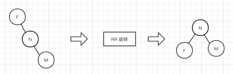

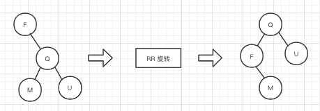

```ts
// tree/avl-tree/AvlTree.ts

// ...

export default class AvlTree extends BinarySearchTree {
  // ...

  // RR
  rotateRightRight(rootNode: BinarySearchTreeNode) {
    // Detach right node from root node.
    const rightNode = rootNode.right;
    rootNode.setRight(null);

    // Make right node to be a child of rootNode's parent.
    if (rootNode.parent) {
      if (rootNode.parent.left === rootNode) {
        rootNode.parent.setLeft(rightNode);
      }
      else {
        rootNode.parent.setRight(rightNode);
      }
    }
    else if (rootNode === this.root) {
      // If root node is root then make right node to be a new root.
      this.root = rightNode;
    }

    // If right node has a left child then detach it and
    // attach it as a right child for rootNode.
    if (rightNode.left) {
      rootNode.setRight(rightNode.left);
    }

    // Attach rootNode to the left of rightNode.
    rightNode.setLeft(rootNode);
  }

  // ...
}
```

#### 3.3.5 RL


```ts
// tree/avl-tree/AvlTree.ts

// ...

export default class AvlTree extends BinarySearchTree {
  // ...

  // RL
  rotateRightLeft(rootNode: BinarySearchTreeNode) {
    // Detach right node from rootNode since it is going to be replaced.
    const rightNode = rootNode.right;
    rootNode.setRight(null);

    // Detach left node from rightNode.
    const rightLeftNode = rightNode.left;
    rightNode.setLeft(null);

    if (rightLeftNode.right) {
      rightNode.setLeft(rightLeftNode.right);
      rightLeftNode.setRight(null);
    }

    // Attach rightLeftNode to the rootNode.
    rootNode.setRight(rightLeftNode);

    // Attach rightNode as right node for rightLeft node.
    rightLeftNode.setRight(rightNode);

    // Do right-right rotation.
    this.rotateRightRight(rootNode);
  }

  // ...
}
```

## 4. 参考

- [JavaScript 算法与数据结构](https://github.com/trekhleb/javascript-algorithms/blob/master/src/data-structures/heap/README.zh-CN.md)
- [数据结构之二叉查找树实现](https://mp.weixin.qq.com/s/kuoBkpauHWjZ0WFT6Sjb_g)
