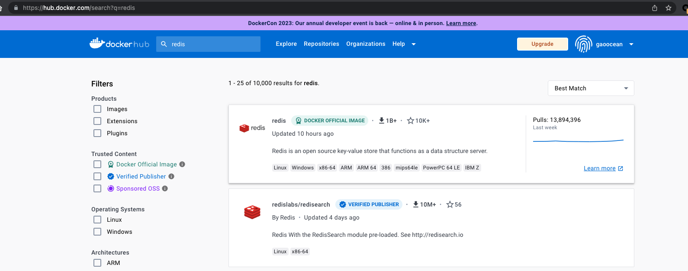
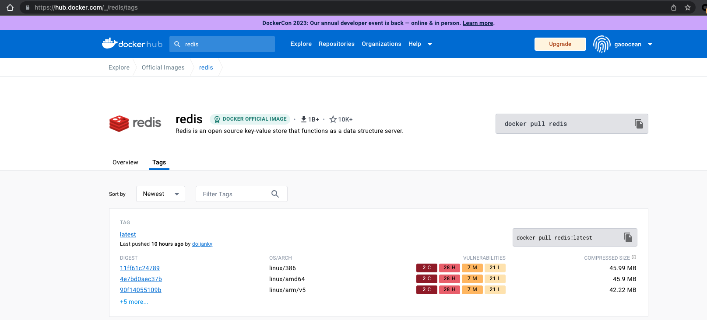
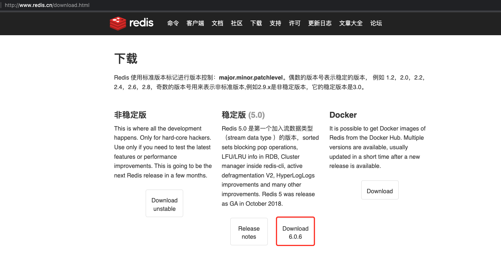

# docker 安装 redis

## 1. Docker 搜索 redis 镜像

### 1.1 docker 命令搜索

```bash
docker search redis
```

搜索结果：

```bash
# NAME                                DESCRIPTION                                     STARS               OFFICIAL            AUTOMATED
# redis                               Redis is an open source key-value store that…   12193               [OK]
# bitnami/redis                       Bitnami Redis Docker Image                      259                                     [OK]
# redislabs/redisinsight              RedisInsight - The GUI for Redis                88
# redis/redis-stack                   redis-stack installs a Redis server with add…   57
```

### 1.2 Docker Hub 中搜索

[官网搜索](https://hub.docker.com/search?q=redis)





## 2. Docker 拉取镜像

```bash
docker pull [镜像名称]:[版本号]
```

```bash
docker pull redis
```

默认安装版本：`latest`。

```bash
docker pull redis
# Using default tag: latest
# latest: Pulling from library/redis
# faef57eae888: Pull complete
# bb595d48e52d: Pull complete
# d479b54c3bb2: Pull complete
# 4bd00b511c2c: Pull complete
# 286fb62a80b5: Pull complete
# 520d4480047f: Pull complete
# Digest: sha256:00a2ca95cde7ca2cbd3e44b9e13ce955dc42af95513c89163954524ff60769f6
# Status: Downloaded newer image for redis:latest
# docker.io/library/redis:latest
```

查看镜像：

```bash
docker images | grep redis
# redis                 latest              4695a05c473a        27 hours ago        130MB
```

## 3. 准备 redis 的配置文件

### 3.1 官方下载

因为 `redis` 运行容器中是没有的，所以需要官方下载一个。

[redis 中文官方网站](http://www.redis.cn/download.html)



下载后，解压即可得到 `redis.conf`。

```bash
cd redis-6.0.6
ls
# 00-RELEASENOTES   COPYING           Makefile          deps              runtest-cluster   sentinel.conf     utils
# BUGS              INSTALL           README.md         redis.conf        runtest-moduleapi src
# CONTRIBUTING      MANIFESTO         TLS.md            runtest           runtest-sentinel  tests
```

### 3.2 初始化本地存储目录

```bash
mkdir -p ~/MyFiles/Docker/ginchat_redis/data
```

### 3.3 复制 redis.conf 到本地存储目录

```bash
cp redis-6.0.6/redis.conf ~/MyFiles/Docker/ginchat_redis
```

### 3.4 修改配置文件

修改 `redis.conf` 配置文件。主要配置如下：

```ini
bind 127.0.0.1            # 注释掉这部分，使 redis 可以外部访问
daemonize no              # 用守护线程的方式启动
requirepass [password]    # 给 redis 设置密码, 如果可以对外访问，这里一定要设置密码，或者在运行的时候设置
appendonly yes            # redis 持久化，默认是 no
```

## 4. 启动 docker redis

```bash
docker run --privileged=true -p 6379:6379 --name ginchat_redis -v ~/MyFiles/Docker/ginchat_redis/redis.conf:/etc/redis/redis.conf  -v ~/MyFiles/Docker/ginchat_redis/data:/data -d redis redis-server /etc/redis/redis.conf --appendonly yes --requirepass "redis"
```

参数解释：

- `--privileged=true` # 让 docker 有权限去读取配置文件
- `-p 6379:6379` # 把容器内的 6379 端口映射到宿主机 6379 端口
- `-v ~/MyFiles/Docker/ginchat_redis/redis.conf:/etc/redis/redis.conf` # 把宿主机配置好的 `redis.conf` 放到容器内的这个位置中
- `-v ~/MyFiles/Docker/ginchat_redis/data:/data` # 把 `redis` 持久化的数据在宿主机内显示，做数据备份
- `redis-server /etc/redis/redis.conf` # 这个是关键配置，让 `redis` 不是无配置启动，而是按照这个 `redis.conf` 的配置启动
- `–appendonly yes`：`redis` # 启动后数据持久化
- `--requirepass "自己设置的密码"` # 设置密码
- `-d` # redis 服务在后台运行，所以 `redis.conf` 文件中的 `daemonize` 需要改为 `no`，否则会有冲突。

查看容器是否运行成功：

```bash
$ docker ps | grep ginchat_redis
4051d68d394f        redis               "docker-entrypoint.s…"   2 hours ago         Up 2 hours          0.0.0.0:6379->6379/tcp              ginchat_redis
```

## 5. 容器内部连接进行测试

进入容器：

```bash
docker exec -it [容器名] /bin/bash
# 或者
docker exec -it [容器名] bash
```

### 5.1 手动连接

```bash
docker exec -it ginchat_redis bash
# root@4051d68d394f:/data# redis-cli -h 127.0.0.1 -p 6379
# 127.0.0.1:6379>
```

### 5.2 自动连接

```bash
docker exec -it ginchat_redis redis-cli
# 127.0.0.1:6379>
```

### 5.3 测试

```bash
# 127.0.0.1:6379>

config get requirepass
# (error) NOAUTH Authentication required.
auth "redis"
# OK
config get requirepass
# 1) "requirepass"
# 2) "redis"
keys *
# (empty array)
set king 1
# OK
get king
# "1"
keys *
# 1) "king"
exit
# root@4051d68d394f:/data#
```

## 6. Docker 删除 Redis

### 6.1 删除 Redis 容器

1. 查看所有的容器：

```bash
docker ps -a
# CONTAINER ID        IMAGE                 COMMAND                  CREATED             STATUS                       PORTS                               NAMES
# 4051d68d394f        redis                 "docker-entrypoint.s…"   2 hours ago         Up 2 hours                   0.0.0.0:6379->6379/tcp              ginchat_redis
```

2. 停止运行的 Redis

停止命令：

```bash
docker stop [容器名]
```

运行命令：

```bash
docker stop ginchat_redis
```

3. 删除 redis 容器

删除容器命令：

```bash
docker rm [容器名]
```

运行命令：

```bash
docker rm ginchat_redis
```

### 6.2 删除 Redis 镜像

删除容器后，我们开始删除 `redis` 镜像。

查看全部镜像：

```bash
docker images
# REPOSITORY            TAG                 IMAGE ID            CREATED             SIZE
# redis                 latest              4695a05c473a        30 hours ago        130MB
```

删除镜像命令：

```bash
docker rmi [容器id]
```

执行命令：

```bash
docker rmi 4695a05c473a
```

再查看镜像 `docker images`，我们会发现删除的镜像已经没有了。

## 7. 参考

- [docker hub redis](https://hub.docker.com/search?q=redis)
- [redis 中文官方网站](http://www.redis.cn/download.html)
