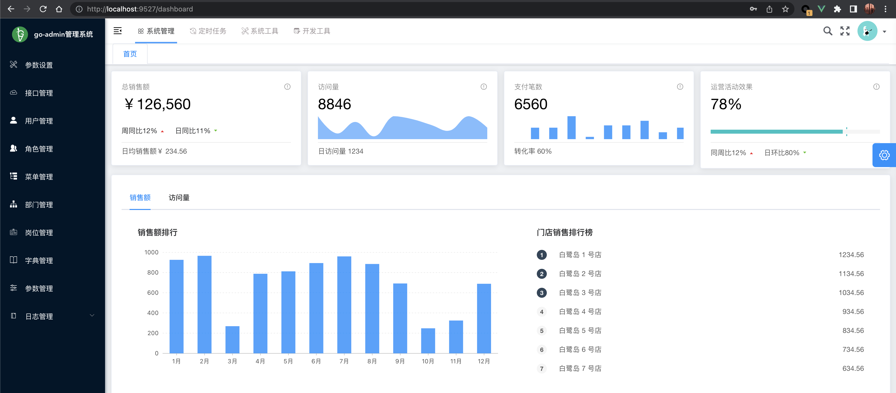

# go-admin 项目本地运行

## 1. 项目拉取到本地

```bash
# 新建目录
mkdir GoProjectGoAdmin
cd GoProjectGoAdmin

# 拉取 go-admin 到本地
git clone git@github.com:go-admin-team/go-admin.git

# 拉取 go-admin-ui 到本地
git clone git@github.com:go-admin-team/go-admin-ui.git
```

## 2. 初始化前端项目

```bash
# 查看 node 版本
node -v
# v16.14.0
```

```bash
cd go-admin-ui

# 安装依赖
yarn
# 或者
yarn install

# 本地运行
yarn dev
#   App running at:
#   - Local:   http://localhost:9527/
#   - Network: http://192.168.0.228:9527/

#   Note that the development build is not optimized.
#   To create a production build, run yarn build.
```

## 3. 初始化后端项目

### 3.1 构建

```bash
# 查看 go 版本
go version
# go version go1.20.5 darwin/amd64
```

```bash
cd go-admin

go mod tidy

go build
```

这个时候，会发现，当前目录下会多一个文件：

```bash
ll | grep go-admin
# -rwxr-xr-x   1 [user]  staff    51M  7 14 19:44 go-admin
# -rw-r--r--   1 [user]  staff   340K  7 14 19:38 go-admin-db.db
```

### 3.2 初始化 mysql

[官网查看版本](https://hub.docker.com/_/mysql)

```bash
# 拉取指定版本镜像
docker pull mysql:8.0
```

编辑配置文件 `mysql.conf.d/mysqld.cnf` ：

```ini
[mysqld]
default_authentication_plugin = mysql_native_password
```

运行：

```bash
docker run \
-d \
-p 3306:3306 \
--name go-admin \
-v /Users/[user]/MyFiles/Docker/go-admin/data:/var/lib/mysql \
-v /Users/[user]/MyFiles/Docker/go-admin/mysql.conf.d/mysqld.cnf:/etc/mysql/mysql.conf.d/mysqld.cnf \
-e MYSQL_ROOT_PASSWORD=root \
mysql:8.0
```

创建数据库：

```bash
docker ps -a | grep mysql:8.0
# 181779e17dc4        mysql:8.0             "docker-entrypoint.s…"   4 minutes ago       Up 4 minutes                     0.0.0.0:3306->3306/tcp, 33060/tcp   go-admin

docker exec -it go-admin bash
# bash-4.4#
```

进入到 `mysql` 容器中，创建一个数据库：

```bash
# bash-4.4#
mysql -h 127.0.0.1 -u root -p
# Enter password:
# Welcome to the MySQL monitor.  Commands end with ; or \g.
# Your MySQL connection id is 9
# Server version: 8.0.33 MySQL Community Server - GPL

# Copyright (c) 2000, 2023, Oracle and/or its affiliates.

# Oracle is a registered trademark of Oracle Corporation and/or its
# affiliates. Other names may be trademarks of their respective
# owners.

# Type 'help;' or '\h' for help. Type '\c' to clear the current input statement.

# mysql>
create database go-admin default charset utf8;
# Query OK, 1 row affected, 1 warning (0.01 sec)

# mysql>
show databases;
# +--------------------+
# | Database           |
# +--------------------+
# | go-admin           |
# | information_schema |
# | mysql              |
# | performance_schema |
# | sys                |
# +--------------------+
# 5 rows in set (0.01 sec)

# mysql>
use go-admin;
# Database changed
# mysql>
show tables;
# Empty set (0.00 sec)
```

### 3.3 修改项目配置

```bash
cp config/settings.yml config/settings.dev.yml
```

修改配置如下：

```yml
database:
    driver: mysql
    source: root:root@tcp(127.0.0.1:3306)/go-admin?charset=utf8&parseTime=True&loc=Local&timeout=1000ms
```

### 3.4 执行数据库迁移脚本

```bash
go run main.go migrate -c config/settings.dev.yml
# 数据库基础数据初始化成功
# 2023/07/14 21:47:19 !!! config init
```

### 3.5 启动服务

```bash
go run main.go  server -c config/settings.dev.yml

# 欢迎使用 go-admin 2.1.0 可以使用 -h 查看命令

# Server run at:
# -  Local:   http://localhost:8000/
# 2023-07-14 22:03:32  [INFO] JobCore Starting...
# -  Network: http://192.168.0.228:8000/
# Swagger run at:
# -  Local:   http://localhost:8000/swagger/admin/index.html
# -  Network: http://192.168.0.228:8000/swagger/admin/index.html
```

## 4. 项目运行



## 5. 参考

- [官网](https://www.go-admin.pro/guide)
- [快速开始](https://www.go-admin.pro/guide/ksks)

- [go-admin](https://github.com/go-admin-team/go-admin)
- [go-admin-ui](https://github.com/go-admin-team/go-admin-ui)
