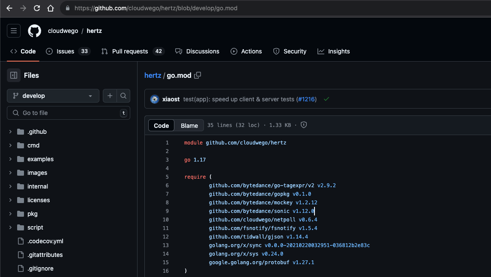
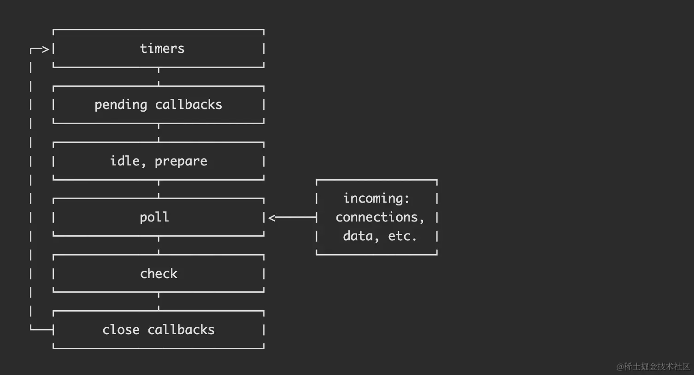
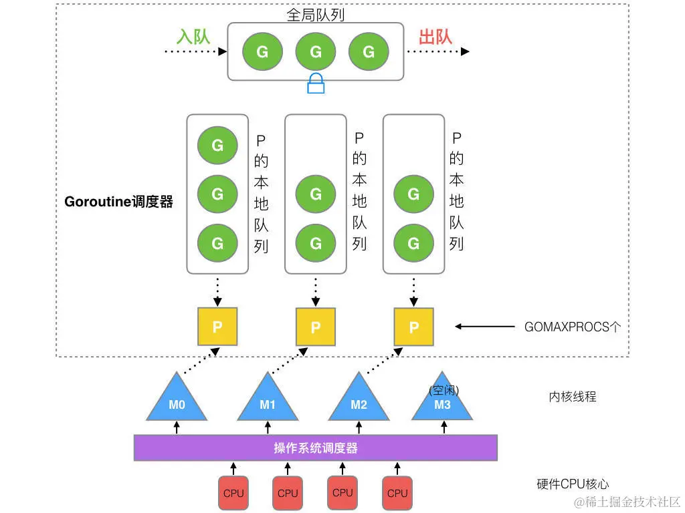

# 前端同学快速入门 Go

## 1. 背景

通过常用项目的实际使用场景，将 `Go` 与 `JS` 中的术语、编程技巧、服务框架进行对比，帮助前端同学快速入门 `Go`。

## 2. 环境搭建

### 2.1 安装 Go

与 `Node` 的 `nvm` 相似，`Go` 社区也提供了 `gvm` 用于快速安装和切换 `Go` 版本。

```bash
# 安装 gvm
bash < <(curl -s -S -L https://raw.githubusercontent.com/moovweb/gvm/master/binscripts/gvm-installer)

# gvm 安装指定版本的 Go
gvm install go1.20.7
gvm use go1.20.7 --default
```

有些文档上，会提到，需要先安装 `Go`，安装 `gvm` 后再卸载默认安装的 `Go`。

```bash
# 先通过 brew 安装 Go
brew install go

# 安装 gvm
# ...

# 删掉 brew 安装的 Go
brew uninstall go
```

### 2.2 GOROOT 与 GOPATH

安装完 `Go` 后经常会提到 `GOROOT` 与 `GOPATH` 两个环境变量，这两个环境变量都对`依赖加载`起作用。
`GOROOT` 可以理解为 `Go 源码`和`可执行文件`存在的目录，对于 `Go 内置的依赖`都将从 `GOROOT` 的目录中寻找。
`GOPATH` 可以理解为`三方依赖`的包会被下载到这里，对于三方依赖将从该目录中寻找。

### 2.3. IDE

- `VSCode`

  安装 `GoLang` 插件，插件识别符为 `golang.go`。

## 3. 依赖管理

`Go` 提供了 `Go Module` 进行依赖管理，与 `Node` 社区存在 `npm/yarn/pnpm` 工具不同，`Go` 的依赖管理工具是 `Go` 官方支持的。

### 3.1 什么是 Go Module

在 `Node` 中依赖的三方包称为 `package`，`package.json` 中的 `"name"` 字段值就是包名。
而在 `Go` 中三方依赖时通过 `git` 管理的，三方依赖称为 `module`，一个 `module` 是指目录下有 `go.mod` 文件，`go.mod` 文件功能与 `package.json` 类似。
`Go` 中 `module` 的名称是 `go.mod` 文件中的 `module` 指令声明的。例如 `github.com/cloudwego/hertz` 是一个 `Go module`，因为仓库目录下存在 `go.mod` 文件，且该 `module` 名称是 `github.com/cloudwego/hertz`。

[https://github.com/cloudwego/hertz/blob/develop/go.mod](https://github.com/cloudwego/hertz/blob/develop/go.mod)


### 3.2 锁定依赖版本

`Node.js` 中通过` package-lock.json` 或 `yarn.lock` 或 `pnpm-lock.yaml` 锁定依赖版本，而 `Go` 中通过 `go.sum` 锁定依赖版本。

### 3.3 如何安装依赖

- 全量安装依赖：`go mod tidy`。
- 新增依赖：`go get {module}@{version}`。
  新手同学可能会在 `go.mod` 中新增依赖，然后执行 `go mod tidy` 来安装新依赖。这种情况下由于项目中没有使用该依赖，执行 `tidy` 后，依赖会从` go.mod` 中移除，新手同学直接懵了。
- 删除依赖： 删除项目中所有导入依赖的代码后，执行 `go mod tidy`。

## 4. 基础知识

### 4.1 Go routine 与协程调度

在并发与调度上，`Go` 与 `Node.js` 存在的不同之处：

- `Go` 中所有系统调用 `API` 都是阻塞式的，而 `Node.js` 所有系统调用都提供了非阻塞式 `API`。
- `Go` 用户代码是多线程的，而 `Node.js` 用户代码是单线程的。

### 4.2 阻塞式 API 与非阻塞式 API

以读取文件内容作为例子，上面是为 `Go` 代码，下面是 `JS` 代码。

```go
// Go 代码，「阻塞式 API」
func demo() {
    os.ReadFile("file.txt")
    // 以下代码将在读取文件结束后才执行
    execFunc()
}
```

```js
// JS 代码，「非阻塞式 API」
function demo() {
    fs.readFile('file.txt', (err, data) => {
        if (err) {
            console.error(err);
            return;
        }
        console.log(data);
    });
    // 以下代码立刻执行
    execFunc();
}
```

```js
// JS 代码，「阻塞式 API」
async function demo() {
    fs.readFileSync('file.txt');
    // 以下代码将在读取文件结束后才执行
    execFunc();
}
```

在 `Node.js` 中所有`系统调用`都推荐使用`非阻塞式 API`，并通过这种方式实现`用户线程发起系统调用（IO 阻塞）`时可继续执行 `JS` 代码。
`Node.js` 底层读取文件的系统调用是在另一个线程中执行的，仍然是阻塞式的。

而 `Go` 中所有`系统调用`都是`阻塞式`的，虽然也可以将 `API` 封装成类似 `JS` 的回调形式，但这不符合 `Go` 的编程习惯。

### 4.3 Go routine 与异步编程

在 `Go` 中通过 `go` 关键字，再加上一个函数调用，就创建了一个 `Go routine`。
`go` 关键字之后的函数调用将在该 `Go routine` 中执行。
在调用方看来，该函数就是异步执行的。

那么我们来看看如何通过 `go routine` 实现类似 `JS` 的 `readFile API`？

#### 4.3.1 实现 `Node.js` 的 `fs.readFile`

```go
func readFile(filePath string, cb func(content []byte, err error)) {
  // 声明一个匿名函数并立即调用
  // 由于匿名函数的调用是在 `go` 关键字后面，所以就创建了一个新的 `Go routine`，并在该 `Go routine` 中执行该匿名函数。
  go func() {
      content, err := os.ReadFile(filePath)
      cb(content, err)
  }()
}
```

#### 4.3.2 实现 Promise.all

```go
func PromiseDotAll() {
    ids := []int{1, 2, 3}
    // 预分配了相应任务数量的 retList，目的是让每个任务都只给对应的 retList[idx] 赋值。
    // 避免每个任务都去操作 retList 引起数据竞争。
    retList = make([]interface{}, len(ids))
    var wg sync.WaitGroup

    fetch := func (idx int) {
        id := ids[idx]
        // 查询 id 对应的数据
        retList[idx] = "xxx"
    }

    for idx := range ids {
        // 在异步任务启动之前给任务数加 1
         wg.Add(1)
         // idx 作为参数，避免闭包问题，同 JS
         go func(idx int) {
             defer func() {
                // 在异步任务结束之后给任务数减 1
                wg.Done()
             }()

             fetch(idx)
         }(idx)
    }
    // 等待所有异步任务结束，当 wg 中的任务数为 0 时继续执行。
    wg.Wait()

    // ids 中所有 id 的都执行完了 fetch 了
}
```

### 4.4 多线程存在的数据竞争问题

在 `Go` 中读写同一个变量时，需要非常小心，因为一不小心就会引起数据竞争导致程序异常。
而在 `Node.js` 中，我们根本不需要关心数据竞争问题。

以`计数`为例子，`TestCnt1` 是存在数据竞争的 `Go` 代码，`代码 2` 是`加锁`后解决数据竞争后的 `Go` 代码。

```bash
# 初始化 demo
go mod init demo
```

```go
// test_cnt/test_cnt.go
package test_cnt

import (
	"fmt"
	"sync"
)

func TestCnt1() {
	cnt := 0
	total := 100000
	var wg sync.WaitGroup

	wg.Add(1)
	wg.Add(1)

	write := func() {
		for i := 0; i < total; i++ {
			cnt += 1
		}
		wg.Done()
	}

	go write()
	go write()
	wg.Wait()

	// 本次打印值不是 200000
	fmt.Println("cnt:", cnt)
}

func TestCnt2() {
	cnt := 0
	total := 100000
	m := sync.Mutex{}
	var wg sync.WaitGroup

	wg.Add(1)
	wg.Add(1)

	write := func() {
		for i := 0; i < total; i++ {
			m.Lock() // 加锁
			cnt += 1
			m.Unlock() // 解锁
		}
		wg.Done()
	}

	go write()
	go write()
	wg.Wait()

	// 本次打印值一定是 200000
	fmt.Println("cnt:", cnt)
}
```

```go
// main.go
package main

import "demo/test_cnt"

func main() {
	test_cnt.TestCnt1()
	test_cnt.TestCnt2()
}
```

```bash
# 执行
go run main.go
# cnt: 104580
# cnt: 200000
```

而类似的功能通过 JS 代码实现时，变量 cnt 的值一定是 200000。

```js
async function demo() {
    let cnt = 0;
    const total = 100000;

    async function write(label) {
        for (let i = 0; i < total; i++) {
            cnt++;
        }
    }
    // 这样写，看起来更异步
    await Promise.all([write(), write()]);
    console.log('cnt:', cnt);
}
```

之所以 `Node.js` `无需加锁`也不会出现数据竞争，是因为 `JS` 的用户代码是执行在`单线程`中的， 而 `Go` 的程序是`多线程`运行的。

在 `Go` 代码中 `cnt += 1` 可以分为两步，第一步是读出 `cnt` 内存中的值，第二步为计算 `cnt + 1` 并赋值。
假设 `cnt` 初始值为 `0`，两个线程按照如下顺序执行，那么尽管执行了两次 `cnt += 1`，但最终 `cnt` 值却为 `1`。


### 4.5 协程调度

> 协程，又称微线程，是一种用户态的轻量级线程，一个线程可以有多个协程。协程的调度完全由用户控制（也就是在用户态执行）。协程拥有自己的寄存器上下文和栈。协程调度切换时，将寄存器上下文和栈保存到线程的堆区，在切回来的时候，恢复先前保存的寄存器上下文和栈，直接操作栈则基本没有内核切换的开销，可以不加锁的访问全局变量，所以协程的上下文切换非常快。
> 协程抽象于线程之上，线程是被分割的 CPU 资源, 协程是组织好的代码流程, 协程需要线程来承载运行。与线程相比，协程占用资源小，由用户调度，切换开销小，同一个线程中的协程不需要使用锁，执行效率更高。

这里的`协程`就是指操作系统中的`用户级别线程`，在 `JS` 中我们说的 `EventLoop` 就是 `JS 协程的调度算法`。
`JS` 的`协程（异步任务）`分为`宏任务`和`微任务`，在 `Node.js` 中`微任务`包括 `nextTick` 和 `Promise`，其他的都是`宏任务`。

流传很广的 `Event Loop 宏任务流程`如下（参考自 [Node.js Docs](https://nodejs.org/en/learn/asynchronous-work/event-loop-timers-and-nexttick)）。在每个`宏任务`阶段生成的`微任务`都会在当前`宏任务`阶段执行完后，才会进入下一个`宏任务`。请大家不要深陷`宏任务执行顺序`的细节中，我们通常只需要知道`异步任务的执行时间`是`未知的`就行了，而不需要深究具体执行顺序。



在 `Go` 中协程就是一个 `Go routine`，`Go routine` 的调度算法是 `GMP`，如下图（参考自[深入理解 Go 语言](https://learnku.com/articles/41728)）。



在 `GMP` 算法中，`G` 是指 `Go routine`，`M` 是指`线程（物理处理器）`，`P` 是指 `Processor（逻辑处理器）`。
一个 `Go routine` 将放在`逻辑处理器 P` 中，`逻辑处理器 P`将分配给一个`物理处理器 M`，并执行其中的 `Go routine`。
与 `Node.js` 相比较，如果我们把`逻辑处理器`设置为 `1`，那么所有 `Go routine` 都将`串行执行`，也就不会出现`数据竞争`问题了。

例如我们修改之前存在数据竞争的`计数例子`，将逻辑处理器设置为 `1`。我们看到尽管没有加锁，但它的运行结果与 `Node.js` 相同，始终都是 `200000`。

```go
func TestCnt3(t *testing.T) {
   runtime.GOMAXPROCS(1)
   cnt := 0
   total := 100000
   var wg sync.WaitGroup

   wg.Add(1)
   wg.Add(1)

   write := func() {
      for i := 0; i < total; i++ {
         cnt += 1
      }
      wg.Done()
   }

   go write()
   go write()
   wg.Wait()

   // 本次打印值一定是 200000
   fmt.Println("cnt:", cnt)
}
```

### 4.6 Go 数据类型

#### 4.6.1 语言内置类型

语言提供的`内置类型`是以`小写字母开头`的类型（如 `int`/`float64`/`bool`/`map`）。
这些类型通常是没有任何可调用方法的，即不能通过 `.xxx()` 调用方法（除了 `error` 外）。比如 `map`：

```go
m := map[string]int{}

// m 下面是没有任何方法的
m.xxx()
```

#### 4.6.2 自定义类型

自定义类型分四种：

- `类型别名`。如：`type BitBool = bool`。 `BitBool` 就是 `bool`，这种用法通常在 `SDK wrapper` 中使用，也用于在实现`继承`时为 `struct embedding` 命名别名。不可以为 `BitBool` 定义新的方法。
- `类型新名`。如：`type BitBool bool`。`BitBool` 和 `bool` 只是内存结构一致，但它们是不同的类型，可以为 `BitBool` 定义新的方法。
- `Struct` 类型。如：`type C3Mgr struct {}`。`Struct` 类型只有属性字段，不包括方法，方法通过 `func` 单独声明。
- `Interface` 类型。如：`type Client interface {}`。`Interface` 类型只有方法，没有属性字段。

以下为 `类型别名` 和 `类型新名` 的区别：

```go
type BitBool = bool
// error: cannot define new methods on non-local type bool compiler(InvalidRecv)
func (b *BitBool) newMethod() {}
```

```go
type BitBool bool
func (b *BitBool) newMethod() {}
```

以下为 `Struct` 类型场景：

```go
type PageInfo struct {
	PageSize    int   `json:"pageSize"`
	CurrentPage int   `json:"currentPage"`
	TotalCount  int64 `json:"totalCount"`
}

func (pager *PageInfo) GetCurrentPage() int {
	if pager.CurrentPage <= 0 {
		pager.CurrentPage = 1
	}
	return pager.CurrentPage
}
```

以下为 `Interface` 类型场景：

```go
// main.go
package main

import "fmt"

// 定义一个接口
type Speaker interface {
	Speak() string
}

// 定义一个类型
type Dog struct {
	Name string
}

// 为这个类型实现 Speaker 接口的 Speak 方法
func (d Dog) Speak() string {
	return fmt.Sprintf("%s says woof!", d.Name)
}

func main() {
	d := Dog{Name: "Max"}
	fmt.Println(d.Speak())

  // 注意，接口类型的变量可以存储任何实现了该接口的值。
  // 例如，如果我们有一个 Speaker 类型的变量，我们可以将一个 Dog 类型的值赋给它，因为 Dog 类型实现了 Speaker 接口。
  var s Speaker
  s = Dog{Name: "Max"}
  fmt.Println(s.Speak())
}
```

以下为 `类型新名` 场景：

```go
package enums

import (
	"database/sql/driver"
	"fmt"
)

// 有效状态 枚举类型定义
type ActiveStatus string

const (
	ACTIVE_STATUS_ACTIVE   ActiveStatus = "ACTIVE"   // 有效
	ACTIVE_STATUS_INACTIVE ActiveStatus = "INACTIVE" // 无效
)

func (a ActiveStatus) Value() (driver.Value, error) {
	switch a {
	case
		ACTIVE_STATUS_ACTIVE,
		ACTIVE_STATUS_INACTIVE:
		return string(a), nil
	default:
		return nil, fmt.Errorf("invalid ActiveStatus: %v", a)
	}
}
```

#### 4.6.3 Any type

`interface{}` 可以代表任意类型，任何值都可以赋值给类型为 `interface{}` 的变量。
`Go` 支持泛型之后 `any` 等价于 `interface{}`。

```go
// 相当于
type any = interface{}
```

```go
var i interface{}
i = 2
i2 := i.(int) // 将其转为 int 类型

i = true
i3 := i.(bool) // 将其转为 bool 类型

if _, ok := i.(int); ok { // 通过 ok 判断类型
  // 是 int 类型
} else {
  // 不是 int 类型
}
```

#### 4.6.4 类型强转与 Type Assertion

在 `Go` 中当`类型 A` 和`类型 B` 的内存结构一致时，可以用于强转，`Go` 会在编译时将检查两个类型是否支持强转。

常用于以下情况：

- `[]byte` 和 `string` 互转；
- `任意类型`都能被`强转`为 `interface{}`；
- `类型新名`互转；

```go
// case 1: []byte 和 string 互转
var (
    bs []byte
    s string
)
s = string(bs)
bs = []byte(s)

// case 2: 任意类型都能被强转为 interface{}
var ia = (interface{})(123)

// case 3: 类型新名互转
type A int
func (a A) p() {
  fmt.Printf("a = %v", int(a))
}
func TestTypeConvert() {
  var a = A(123)
  a.p()
}
```

而 `Type Assertion` 是指将某个 `interface` 类型的变量转换成另一个 `interface` 或者具体类型，`Go` 是在`运行时`进行检查的。
类似于我们要在 `JS` 中检查参数的类型，并进行不同的处理。

```go
func TestTypeAssertion() {
  var p = func(a interface{}) {
    if v, isInt := a.(int); isInt {
      fmt.Printf("我是 int. %d\n", v)
    } else if v, isString := a.(string); isString {
      fmt.Printf("我是 string. %s\n", v)
    } else {
      fmt.Printf("函数不支持该参数类型，%#v\n", a)
    }
  }

  p(123)
  p("cg")
  p([]byte("cg"))
}
// 输出如下：
// 我是 int. 123
// 我是 string. cg
// 函数不支持该参数类型，[]byte{0x63, 0x67}
```

#### 4.6.7 泛型

`Go` 中的泛型比 `TS` 要简单很多，对前端同学来说非常好上手，下面代码是泛型实现的 `interface`/`struct`/`func`。

```go
// main.go
package main

import "fmt"

type a[T any, S any] interface {
  GetT() T
  GetS() S
}

type Pair[T any, S any] struct {
  t T
  s S
}

func (p Pair[T, S]) GetT() T {
  return p.t
}

func (p Pair[T, S]) GetS() S {
  return p.s
}

func main() {
  pair := Pair[int, string]{t: 123, s: "hello"}

  var ai a[int, string] = pair

  fmt.Println(ai.GetT()) // 输出：123
  fmt.Println(ai.GetS()) // 输出：hello
}
```

这段代码定义了一个泛型接口 `a`，其中 `T` 和 `S` 是类型参数，可以是任何类型。接口 `a` 包含了两个方法，`GetT` 返回 `T` 类型的值，`GetS` 返回 `S` 类型的值。

在这个示例中，我们定义了一个 `Pair` 结构体，这个结构体包含了两个字段，`t` 和 `s`，它们的类型分别是 `T` 和 `S`。然后我们为 `Pair` 结构体实现了 `a` 接口的 `GetT` 和 `GetS` 方法。

在 `main` 函数中，我们创建了一个 `Pair` 实例，然后将这个实例赋值给 `a` 接口类型的变量 `ai`。然后我们调用 `ai` 的 `GetT` 和 `GetS` 方法，分别获得 `Pair` 实例的 `t` 和 `s` 字段的值。

```go
package main

import "fmt"

type b[T comparable] struct {
  v T
}

func main() {
  x := b[int]{v: 123}
  y := b[string]{v: "hello"}

  fmt.Println(x) // 输出：{123}
  fmt.Println(y) // 输出：{hello}
}
```

在这个示例中，我们创建了两个 `b` 类型的实例，一个的 `v` 字段是 `int` 类型，另一个的 `v` 字段是 `string` 类型。
因为 `int` 和 `string` 都是可比较的类型，所以它们都可以用作 `b` 的类型参数。

你可以将 `T` 替换为任何可比较的类型，来创建 `b` 类型的实例。

其中，`comparable` 是一个预定义的类型约束，表示 `T` 必须是可比较的类型。
在 `Go` 语言中，可比较的类型包括：

- 所有的基本类型，如：`bool`, `int`, `float64`, `complex128`, `string` 等
- 指针类型
- 数组类型（只有当数组的元素类型是可比较的类型时，数组才是可比较的）
- 结构体类型（只有当所有字段都是可比较的类型时，结构体才是可比较的）
- 接口类型
- 通道类型

```go
package main

import "fmt"

type Equatable interface {
  Equals(other interface{}) bool
}

func f[T Equatable](a, b T) bool {
  return a.Equals(b)
}

type MyInt int

func (m MyInt) Equals(other interface{}) bool {
  if other, ok := other.(MyInt); ok {
      return m == other
  }
  return false
}

func main() {
  fmt.Println(f[MyInt](MyInt(1), MyInt(1))) // 输出：true
  fmt.Println(f[MyInt](MyInt(1), MyInt(2))) // 输出：false
}
```

在这段代码中，`Equatable` 是一个接口，它定义了一个 `Equals` 方法，这个方法接收一个 `interface{}` 类型的参数，返回一个 `bool` 类型的值。`f[T Equatable]` 是一个泛型函数，`T` 是类型参数，`Equatable` 是一个类型约束，表示 `T` 必须实现 `Equatable` 接口。这个函数接收两个 `T` 类型的参数，返回一个 `bool` 类型的值。

这个示例展示了如何使用`泛型函数`和`接口`。你可以将 `MyInt` 类型替换为任何你需要的类型，只要这个类型实现了 `Equatable` 接口，就可以使用 `f` 函数来比较这个类型的值。

在支持泛型的 `Go` 上进行开发时，推荐使用 [Go 中的 lodash 工具库](https://github.com/samber/lo)。
如果你发现有些工具函数在 `lo` 工具库中没有，那有可能该函数已经被 `Go` 内置了。
例如往数组（切片）中插入元素的方法 `slices.Insert` 就不在 `lo` 工具库中，而在官方维护的试验性仓库（[golang.org/x/exp/slices](https://pkg.go.dev/golang.org/x/exp/slices#Insert)）中。

#### 4.6.8 面向接口编程 VS OOP

`Go` 通过 `interface` 强调面向接口编程的设计理念，对于熟悉 `OOP` 的同学来说，在 `Go` 中实现封装性和多态性都很好理解。
但用 `Go` 中来实现继承性的代码就比较奇怪了，`Go` 通过 `struct embedding` 语法实现类似继承的能力。

```go
type A struct {
  a string
}
func (a A) printA() {
  fmt.Printf("printA from A\n")
}

// B 将继承 A 的方法及属性
type B struct {
  // 可以通过类型别名指定为其他名称
  A
}
func (b B) printB() {
  fmt.Printf("printB from B\n")
}

func TestInherit(t *testing.T) {
  var b = B{
      A{
        a: "cg",
      },
  }

  // 从类型为 B 的变量访问类型 A 中的属性
  fmt.Printf("b.A.a: %v\n", b.A.a)

  // 从类型为 B 的变量访问类型 A 中的方法
  b.printA()
  b.printB()
}
```

### 4.7 Go Package 等价于 Node.js 中的 Module

在 `Go` 中，每个文件顶部都有个 `package xxx`。在 `Node.js` 中一个文件就是一个模块，代表导入依赖的粒度。
但在 `Go` 中一个目录下的所有的 `go` 文件是一个 `package（子目录下的不算）`，一个 `package` 是 `Go` 中导入依赖的粒度。
`Go` 基于目录划分 `package` 使得 `Go` 的 `package` 有两点比较特别：

- 文件 `b` 不需要 `import` 就能直接使用同目录下的 `a` 文件中的 `package` 级别变量和方法。
- 同目录下的所有文件的第一行 `package xxx` 必须同名。`Go` 不允许在同目录下声明两个 `package`。

### 4.8 Go 如何导出变量、属性或方法

`Node.js` 的模块通过 `export` 关键字或者 `module.exports` 来导出模块属性，而 `Go` 是通过`变量名的首字母`是否是`大写`来判断一个变量是否对 `package` 外可见。

在 `Go` 中，`package` 中`变量`是否大写开头，`结构体的属性或方法`是否大写开头决定了这些变量、属性或方法是否对 `package 外`的代码是否可见。无论首字母是否大写，这些变量、属性或方法在 `package 内`都是可以访问的。

### 4.9 Go Channel 与 Node.js EventEmitter 对比

> Do not communicate by sharing memory; instead, share memory by communicating.

`Channel` 可以理解为 `Node.js` 中的 `EventEmitter`，一端写入后，另一端会收到通知。但它们又存在以下差异点：

- `Go` 中 `Channel` 发送端发送的一个消息，只能被一个 `Channel` 接收端处理。而 `Node.js` 会遍历所有 `Listener` 并执行，即所有的接收端都会收到该消息。
- `Go` 中 `Channel` 存在消息缓存，当 `Channel` 发送端发送的消息，没有 `Channel` 接收端处理时，该消息会被存入缓存区。如果缓存区也满了，那么发送端会被阻塞直到该消息被存入缓存区或者被接收端处理。而 `Node.js` 中 `EventEmitter` 发送事件时，会同步遍历所有 `Listener` 并执行，没有 `Listener` 时不会发生阻塞。

下面代码是通过将`数组求和`分成两个`并行部分`，分别在两个 `go routine` 中计算两部分的各自的求和结果，并通过 `channel` 将每部分的求和结果通知到 `main goroutine`。

```go
// main.go
package main

func sum(s []int, c chan int) {
  sum := 0
  for _, v := range s {
      sum += v
  }
  c <- sum // send sum to c
}

func main() {
  s := []int{7, 2, 8, -9, 4, 0}

  c := make(chan int)

  go sum(s[:len(s)/2], c)
  go sum(s[len(s)/2:], c)

  x, y := <-c, <-c // receive from c

  fmt.Println(x, y, x+y)
}
```

### 4.10 Go 错误处理

#### 4.10.1 error 作为函数的最后一个返回值

在 `Go` 中推荐将`程序异常状态`作为函数的最后一个返回值，返回给调用方。
例如打开文件的 `os.Open` 方法，它的函数签名如下，当返回一个非空的 `error` 时，表示打开文件失败了。

```go
func Open(name string) (file *File, err error)
```

`error` 类型值可通过 `errors.New()` 或者 `fmt.Errorf()` 生成。
对于 `error` 的类型判断，则通过 `errors.Is()` 进行。
关于 `error` 的最佳实践参考 `Go` 官方的 [Error handling and Go](https://go.dev/blog/error-handling-and-go) 和 [Working with Errors in Go 1.13](https://go.dev/blog/go1.13-errors)。

```go
// main.go
package main

import (
	"errors"
	"fmt"
	"os"
)

func main() {
	_, err := os.Open("non-existent-file.txt")
	if errors.Is(err, os.ErrNotExist) {
		fmt.Println("File does not exist")
	} else if err != nil {
		fmt.Println("An error occurred:", err)
	}
}
```

注意，`errors.Is()` 函数只能检查错误是否`等于特定的错误`，或者错误是否`包含特定的错误`。

在 `Go` 语言中，错误可以通过包装（wrapping）另一个错误来提供更多的上下文。
这就意味着一个错误可以包含或者包装另一个错误。
例如，你可能有一个底层的网络错误，然后在更高的层次上包装这个错误，以提供更多关于发生错误的上下文。

```go
package main

import (
	"errors"
	"fmt"
)

func main() {
	err := fmt.Errorf("network error: %w", errors.New("unable to connect"))
	if errors.Is(err, errors.New("unable to connect")) {
		fmt.Println("A network error occurred")
	}
}
```

当使用 `errors.Is()` 函数时，它会检查错误是否等于特定的错误，或者是否包含特定的错误。
这意味着，如果一个错误包装了另一个错误，`errors.Is()` 会递归地检查这个错误和所有包装的错误，以查看它们是否匹配你指定的错误。

在 `Go` 语言中，`%w` 是一个特殊的占位符，用于 `fmt.Errorf()` 函数中。它用于包装另一个错误，并创建一个新的错误。
在 `fmt.Errorf()` 函数中，你可以使用 `%w` 占位符来包装一个错误，这样你就可以保留原始错误的信息，同时添加更多的上下文。
这对于调试和处理错误非常有用。

```go
package main

import (
	"errors"
	"fmt"
)

func main() {
	err := errors.New("original error")
	wrappedErr := fmt.Errorf("an error occurred: %w", err)

	// 输出：an error occurred: original error
	fmt.Println(wrappedErr)

	// 检查包装的错误是否是原始错误
	if errors.Is(wrappedErr, err) {
		fmt.Println("The error is the original error")
	}
}
```

#### 4.10.2 Panic error

除了将 `error` 作为函数的最后一个返回值外，`Go` 还提供了另一种错误，`panic 错误`。

在 `API` 设计时尽量中不要主动 `panic`，因为任意 `Go routin`e 中未被处理的 `panic` 都将引起整个程序退出。
接口调用方通常不会处理 `panic` 错误，`panic` 错误在 `Go` 程序中通常意味着非预期的错误。

在 `Go` 语言中没有 `try/catch` 语法，只能通过 `defer/recover` 语法拦截 `panic`。

如下代码，该方法将注册 `Apollo` 的路由。如果注册过程中出现 `panic` 错误，那也只会打印日志，不会引起整个程序退出。

```go
func safeRegisterApolloPortal() {
  defer func() {
    // 处理 registerApolloPortal() 出现的 panic 错误
    if r := recover(); r != nil {
        log.Error("panic when register apollo portal to platform. err: %v", r)
    }
  }()

  // 处理 registerApolloPortal() 返回的 error 类型
  if err := registerApolloPortal(); err != nil {
    log.Error("error when register apollo portal to platform. err: %v", err)
  }
}
```

## 5. 参考

- [Go 实践分享（前端同学快速入门 Go）](https://juejin.cn/post/7298927417316884489)
- [Go 版 loadsh](https://github.com/samber/lo)
- [[Golang 三关-典藏版] Golang 调度器 GMP 原理与调度全分析](https://learnku.com/articles/41728)
