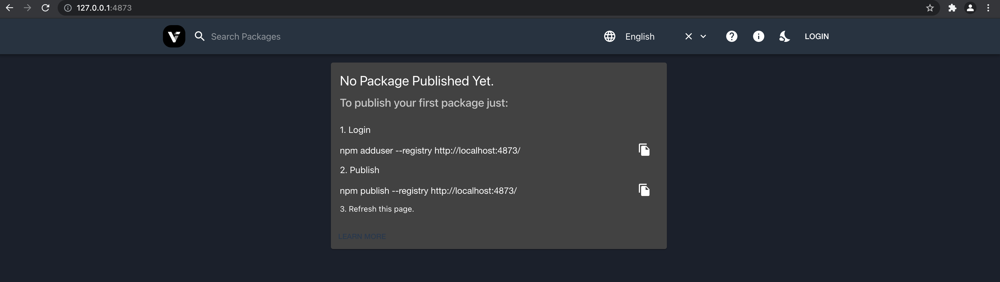
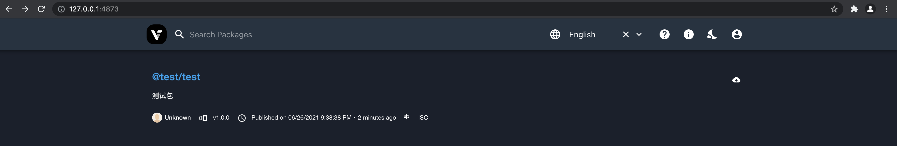

# 基于 Verdaccio + Docker 搭建私有 NPM 仓库

## 1. 前言

> 详细的配置可以参考：[Verdaccio 官网](https://verdaccio.org/docs/en/docker)

应用场景：若公司多个前端项目内有相同的功能代码，那么就可以采用搭建私有 `npm` 服务，来统一发布和管理。
优点：

- 可以设为私有仓库，保证了隐私性。
- 修改了公共库代码，业务项目也还是需要修改 package 的该库版本然后重新打包发布。这样便于版本管理。

如果用 `gitlab` 管理公共代码，也是可以的，只是有以下管理不便：

- 版本发布时候，需要构建代码并推到仓库中，然后再打 `tag`;
- 项目中安装的版本时候，需要按 `gitlab` 仓库地址安装，并且在每次更新时需要手动改 `tag` 号；

小团队推荐使用 `verdaccio` 的原因：

- 轻量化，基本不需要怎么配置，维护负担小；
- 小团队暂时没有做包缓存的需要（也没有富余的机器资源）；
- 官方提供了现成的 `docker` 镜像，几乎可以一键上线；

## 2. 搭建步骤

### 2.1 安装 Verdaccio 镜像

```bash
docker pull verdaccio/verdaccio
# Using default tag: latest
# latest: Pulling from verdaccio/verdaccio
# ddad3d7c1e96: Pull complete
# f845e0f7d73a: Pull complete
# 47d471c4d820: Pull complete
# 1a88008f9c83: Pull complete
# 3af9102d0819: Pull complete
# 8ec2ec2b627b: Pull complete
# 8fc69a8d8b05: Pull complete
# 1f553cc1d42d: Pull complete
# 6c47ad056431: Pull complete
# 0e7568a352e9: Pull complete
# Digest: sha256:e74db1178a15b6a90abc8a7f2cd5ec3dd77a04ea2df0b6fe28a0ef3d5087465b
# Status: Downloaded newer image for verdaccio/verdaccio:latest
# docker.io/verdaccio/verdaccio:latest
```

查看 `docker` 镜像：

```bash
docker images
# REPOSITORY            TAG                 IMAGE ID            CREATED             SIZE
# verdaccio/verdaccio   latest              033f730b4b49        2 weeks ago         146MB
```

若要锁定某一版本安装，则可以执行：

```bash
docker pull verdaccio/verdaccio:4
```

### 2.2 初始化配置项

> 因为运行配置要放在本地，否则的话，每次 `docker` 启动，生成一个新的 `docker` 容器，之前的配置和包数据会丢失。

#### 2.2.1 本地配置目录初始化

```bash
cd [Docker] && mkdir verdaccio
cd verdaccio && mkdir conf && mkdir storage && mkdir plugins
cd conf && touch config.yaml
```

#### 2.2.2 项目配置文件初始化

```bash
vi config.yaml
```

写入如下内容:

```
#
# This is the default config file. It allows all users to do anything,
# so don't use it on production systems.
#
# Look here for more config file examples:
# https://github.com/verdaccio/verdaccio/tree/master/conf
#

# 用户下载安装的包都被缓存在此配置的目录
storage: ./storage
# 插件所在目录
plugins: ./plugins

# 定制 Web 界面
web:
    # 访问服务主页时（http://localhost:4873/），网页标签的title名称，可改成公司名称
    title: XX包管理中心
    # Gravatar 头像支持，默认关闭，可打开（http://cn.gravatar.com/）
    gravatar: true
    # 默认情况下 package 是升序自然排序的，可选值：asc 或 desc
    # sort_packages: asc

auth:
    htpasswd:
        # 存储了加密认证信息的 htpasswd 文件
        file: ./htpasswd
        # 允许注册的用户最大数量, 默认值是 "+inf"，即不限制
        # 可以将此值设置为-1 以禁用新用户注册。
        # max_users: 1000

# 如果你要安装的包在私有的npm库里没有找到，就去下面的服务列表里找
uplinks:
    npmjs:
        url: https://registry.npmjs.org/

packages:
    "@*/*":
        # scoped packages
        #
        # 默认情况下所有用户 (包括未授权用户) 都可以查看和发布任意包
        #
        # 你可以指定 用户名/分组名 (取决于你使用什么授权插件，默认的授权插件是内置的 htpasswd)
        # 访问权限有三个关键词: "$all", "$anonymous", "$authenticated"
        # $all 表示不限制，任何人可访问；$anonymous 表示未注册用户可访问；$authenticated 表示只有注册用户可访问
        #
        access: $all
        # 允许所有注册用户发布/撤销已发布的软件包
        # (注意：默认情况下任何人都可以注册)
        publish: $authenticated
        unpublish: $authenticated
        # 如果私有包服务不可用在本地，则会代理请求到'npmjs'
        proxy: npmjs
    "**":
        proxy: npmjs

# You can specify HTTP/1.1 server keep alive timeout in seconds for incoming connections.
# A value of 0 makes the http server behave similarly to Node.js versions prior to 8.0.0, which did not have a keep-alive timeout.
# WORKAROUND: Through given configuration you can workaround following issue https://github.com/verdaccio/verdaccio/issues/301. Set to 0 in case 60 is not enough.
server:
    keepAliveTimeout: 60

middlewares:
    audit:
        enabled: true

# 终端日志输出配置
logs:
    - { type: stdout, format: pretty, level: http }
    # - { type: file, path: verdaccio.log, level: info }
```

> 在 `packages` 配置内可以描述为满足 `@*/*` 通配符的包名都会进入该匹配项, `access` 所有人的请求, `publish` 只有登录认证了才行。
> 以上是 `verdaccio` 在启动时的默认配置，完整配置还需要可去[官网查看](https://verdaccio.org/docs/zh-CN/configuration)。
> `config.yaml` 配置中也提供了 `web` 用户界面相关 `UI` 元素的修改, `logo`、主题色等，具体[点击这里](https://verdaccio.org/docs/zh-CN/webui)。

建议使用`用户组`的概念来定义可以推送名单，这样可以保证是可信赖的人推送的，那么上面 `package` 块的代码可以改成如下：

```
$user-group: user-a user-b user-c
packages:
    "@*/*":
        access: $all
        publish: $user-group
        unpublish: $user-group
        proxy: npmjs
    "**":
        proxy: npmjs
```

### 2.3 启动 Verdaccio 容器

```bash
V_PATH=[Docker]/verdaccio; \
docker run -d -it --name npm-server-verdaccio \
  -p 4873:4873 \
  -v $V_PATH/conf:/verdaccio/conf \
  -v $V_PATH/storage:/verdaccio/storage \
  -v $V_PATH/plugins:/verdaccio/plugins \
  verdaccio/verdaccio
```

查看运行容器：

```bash
docker ps
# CONTAINER ID        IMAGE                 COMMAND                  CREATED             STATUS              PORTS                               NAMES
# f5b74bc8029e        verdaccio/verdaccio   "uid_entrypoint /bin…"   6 seconds ago       Up 5 seconds        0.0.0.0:4873->4873/tcp              npm-server-verdaccio
```

根据上一步中设置容器暴露的端口: `4873` 于浏览器中访问，顺利打开则代表 `npm` 服务已经成功启动。
打开网站看下效果：

```
http://127.0.0.1:4873/
```



### 2.4 增加用户

```bash
# 注册
npm adduser --registry http://{部署的 ip}:4873
# 登录
npm login --registry http://{部署的 ip}:4873
```

实际执行：

注册用户：

```bash
npm adduser --registry http://127.0.0.1:4873
# Username: admin
# Password:
# Email: (this IS public) test@test.com
# Logged in as admin on http://127.0.0.1:4873/.
```

登录：

```bash
npm login --registry http://127.0.0.1:4873
```

### 2.5 发布包

#### 2.5.1 测试包初始化

```bash
mkdir package && cd package && npm init
# This utility will walk you through creating a package.json file.
# It only covers the most common items, and tries to guess sensible defaults.

# See `npm help json` for definitive documentation on these fields
# and exactly what they do.

# Use `npm install <pkg>` afterwards to install a package and
# save it as a dependency in the package.json file.

# Press ^C at any time to quit.
# package name: (代码片段) @test/test
# version: (1.0.0)
# description: 测试包
# entry point: (index.js)
# test command:
# git repository:
# keywords:
# author:
# license: (ISC)

# {
#   "name": "@test/test",
#   "version": "1.0.0",
#   "description": "测试包",
#   "main": "index.js",
#   "scripts": {
#     "test": "echo \"Error: no test specified\" && exit 1"
#   },
#   "author": "",
#   "license": "ISC"
# }

# Is this OK? (yes) yes
```

#### 2.5.2 测试包开发

```js
// package/index.js
'use strict';

module.exports = {
  test() {
    console.log('test');
  },
};
```

#### 2.5.3 测试包发布

```bash
cd package
npm publish --registry http://127.0.0.1:4873
# npm notice
# npm notice 📦  @test/test@1.0.0
# npm notice === Tarball Contents ===
# npm notice 75B  index.js
# npm notice 215B package.json
# npm notice === Tarball Details ===
# npm notice name:          @test/test
# npm notice version:       1.0.0
# npm notice package size:  341 B
# npm notice unpacked size: 290 B
# npm notice shasum:        7f83672aaaa036596960a90ce41ff92537adebe6
# npm notice integrity:     sha512-jPAO+Y3HmpnW5[...]nxp9cZU37/PbQ==
# npm notice total files:   2
# npm notice
# + @test/test@1.0.0
```

然后 `web` 访问看下这个包是否在：



说明测试包发布成功了，然后我们写个 `demo` 实际安装下看看。

### 2.6 安装包

#### 2.6.1 设置局部 npm 仓库配置

> 指定符合 `@xx` 包空间的使用对应的 `npm` 仓库。

npm:

> 项目根目录下新建 `.npmrc`，@xx 为给该私有仓库自定义的包名前缀，严格上说是包空间(`Scope`)。

```
registry=https://registry.npm.taobao.org
@xx:registry=http://{部署的 ip}:4873
```

yarn:

> 项目根目录下新建 `.yarnrc`。

```
registry "https://registry.npm.taobao.org"
@xx:registry "http://{部署的 ip}:4873"
```

实际执行：

```bash
vi ~/.npmrc
```

增加以下内容：

```
@test:registry=http://127.0.0.1:4873
```

#### 2.6.2 安装

```bash
cd demo

npm install -S @test/test
# npm notice created a lockfile as package-lock.json. You should commit this file.
# npm WARN demo@1.0.0 No description
# npm WARN demo@1.0.0 No repository field.

# + @test/test@1.0.0
# added 1 package in 3.044s

npm install -S jquery
# npm WARN demo@1.0.0 No description
# npm WARN demo@1.0.0 No repository field.

# + jquery@3.6.0
# added 1 package from 1 contributor in 0.372s
```

看下 `package.json` 文件内容：

```json
{
  "name": "demo",
  "version": "1.0.0",
  "description": "",
  "main": "index.js",
  "scripts": {
    "test": "echo \"Error: no test specified\" && exit 1"
  },
  "author": "",
  "license": "ISC",
  "dependencies": {
    "@test/test": "^1.0.0",
    "jquery": "^3.6.0"
  }
}
```

看下 `package-lock.json` 文件内容：

```json
{
  "name": "demo",
  "version": "1.0.0",
  "lockfileVersion": 1,
  "requires": true,
  "dependencies": {
    "@test/test": {
      "version": "1.0.0",
      "resolved": "http://127.0.0.1:4873/@test%2ftest/-/test-1.0.0.tgz",
      "integrity": "sha512-jPAO+Y3HmpnW5A3sUAdPh44QJPGjUrQUcHNenWCLdIxNTcT0LC4Kl0Hw9GJfYpTDJf3GY49Llnxp9cZU37/PbQ=="
    },
    "jquery": {
      "version": "3.6.0",
      "resolved": "https://registry.npm.taobao.org/jquery/download/jquery-3.6.0.tgz",
      "integrity": "sha1-xyoJ8Vwb3OFC9J2/EXC9+K2sJHA="
    }
  }
}
```

我们发现, `@test` 前缀的包，自动从本地私有 `npm` 仓库获取。

## 3. 生产 https 部署

配置 `nginx` 转发：

```
server {
  listen 80;
  listen 443 ssl http2;
  server_name npm.test.com; # 修改这里
  include /etc/nginx/sites-enabled/ssl_certificate;
  location / {
    proxy_pass              http://{部署的 ip}:4873; # 修改这里

    proxy_set_header        Host $host;
    proxy_set_header X-Forwarded-For $proxy_add_x_forwarded_for;
    proxy_set_header X-NginX-Proxy true;
    proxy_ssl_session_reuse off;
    proxy_set_header Host $http_host;
    proxy_redirect off;
  }
}
```

## 4. 更多

`verdaccio` 适合小团队或个人做私有库的相关尝试，因为不用怎么折腾就可以快速达到目的。另一点优势就是本地一些场景的快速验证。
缺点的话就是配置确实很少，如果对于 npm 私有库的需求比较复杂，比如权限控制、包缓存等就不太适合了。

## 5. 参考

- [基于 Verdaccio + Docker 搭建私有 NPM 仓库](https://juejin.cn/post/6964327281204412429)
- [前端工程化之路 - 使用 verdaccio 搭建私有 npm 库](https://segmentfault.com/a/1190000021612560)
- [verdaccio 搭建私有 npm 仓库](https://juejin.cn/post/6950926763341905927)
