# Webpack5 常见配置实践

## 1. 前言

环境依赖：

```
├── webpack           5.44.0
├── webpack-cli       4.7.2
├── node              15.11.0
├── npm               7.6.0
```

## 2. 基本配置

### 2.1 初始化项目

```bash
mkdir webpack-demo && cd webpack-demo
npm init
```

首先添加一个入口文件 `src/index.js` 和 webpack 配置文件 `webpack.config.js`，现在我们的目录结构如下：

```
webpack-demo
    ├── src
    |    └── index.js
    ├── package.json
    └── webpack.config.js
```

安装 `webpack`:

```bash
npm install -D webpack webpack-cli
```

### 2.2 开始搞事情

在 `src/index.js` 中随便写点东西：

```js
class Test {
    constructor() {
        document.write('hello world');
    }
}

const test = new Test();
```

先来打个包看看啥效果， 执行命令：

```bash
npx webpack
# asset main.js 60 bytes [emitted] [minimized] (name: main)
# ./src/index.js 87 bytes [built] [code generated]

# WARNING in configuration
# The 'mode' option has not been set, webpack will fallback to 'production' for this value.
# Set 'mode' option to 'development' or 'production' to enable defaults for each environment.
# You can also set it to 'none' to disable any default behavior. Learn more: https://webpack.js.org/configuration/mode/

# webpack 5.44.0 compiled with 1 warning in 193 ms
```

执行结果：

```
webpack-demo
  + ├── dist
  + |    └── main.js
    ├── src
    |    └── index.js
    ├── package.json
    └── webpack.config.js
```

让我们来看看 `dist/main.js` 里有点啥：

```
new class{constructor(){document.write("hello world")}};
```

目前这代码是不能在浏览器里面直接执行的，所以得将 `js` 代码转成 `es5` 才行。

### 2.3 配置 babel

- babel-loader
- @babel/core
- @babel/preset-env
- @babel/plugin-transform-runtime
- @babel/plugin-proposal-decorators
- @babel/plugin-proposal-class-properties
- @babel/plugin-proposal-private-methods
- @babel/runtime
- @babel/runtime-corejs3

首先安装下 `babel-loader` 及几个相关的依赖：

```bash
npm install -D babel-loader @babel/core @babel/preset-env @babel/plugin-transform-runtime  @babel/plugin-proposal-decorators  @babel/plugin-proposal-class-properties @babel/plugin-proposal-private-methods
npm install -S @babel/runtime @babel/runtime-corejs3
```

修改 `webpack.config.js` 文件， 添加 `babel-loader` 配置：

```js
const path = require('node:path');

module.exports = {
    entry: './src/index.js',
    output: {
        path: path.resolve(__dirname, 'dist'),
        filename: 'bundle.[contenthash:8].js',
    },
    module: {
        rules: [
            {
                test: /\.(jsx|js)$/,
                use: 'babel-loader',
                exclude: /node_modules/,
            },
        ],
    },
};
```

根目录下添加相应的 `.babelrc` 配置文件：

```json
{
    "presets": ["@babel/preset-env"],
    "plugins": [
        ["@babel/plugin-transform-runtime", { "corejs": 3 }],
        ["@babel/plugin-proposal-decorators", { "legacy": true }],
        ["@babel/plugin-proposal-class-properties", { "loose": true }],
        ["@babel/plugin-proposal-private-methods", { "loose": true }]
    ]
}
```

再次执行命令 `npx webpack` 来打个包。

```bash
npx webpack
# assets by status 177 bytes [cached] 1 asset
# orphan modules 176 bytes [orphan] 1 module
# ./src/index.js + 1 modules 367 bytes [built] [code generated]

# WARNING in configuration
# The 'mode' option has not been set, webpack will fallback to 'production' for this value.
# Set 'mode' option to 'development' or 'production' to enable defaults for each environment.
# You can also set it to 'none' to disable any default behavior. Learn more: https://webpack.js.org/configuration/mode/
```

完成后查看目录结构：

```
webpack-demo
    ├── dist
  + |    └── bundle.52813c00.js
  - |    └── main.js
    ├── src
    |    └── index.js
  + ├── .babelrc
    ├── package.json
    └── webpack.config.js
```

查看构建后的 `bundle.b8ba1739.js` 文件：

```
(()=>{"use strict";new function n(){!function(n,t){if(!(n instanceof t))throw new TypeError("Cannot call a class as a function")}(this,n),document.write("hello world")}})();
```

构建产物看着没什么问题了，接下来看下在浏览器中的实际效果。
要看效果，肯定离不开 `html` 文件。

### 2.4 浏览器中看下效果

这里需要引入一个插件 `html-webpack-plugin`，这个插件的作用是将打包产物引入到我们提前准备好的模板 `.html` 文件中，我们访问这个文件就能直观的看到效果了。

先来安装下插件：

```bash
npm install -D html-webpack-plugin
```

接着创建一个 `public` 目录， 用来存放静态资源。新增一个 `index.html` 模板，放在 `public` 目录下：

```
webpack-demo
    ├── dist
    |    └── bundle.b8ba1739.js
    ├── src
    |    └── index.js
  + ├── public
  + |    └── index.html
    ├── .babelrc
    ├── package.json
    └── webpack.config.js
```

```html
<!DOCTYPE html>
<html lang="en">
  <head>
    <meta charset="UTF-8" />
    <meta name="viewport" content="width=device-width, initial-scale=1.0" />
    <title>webpack-demo</title>
  </head>
  <body></body>
</html>
```

在 `webpack.config.js` 中配置 `html-webpack-plugin`:

```js
// 省略 ...
const HtmlWebpackPlugin = require('html-webpack-plugin');

module.exports = {
    // 省略 ...
    plugins: [
        new HtmlWebpackPlugin({
            template: path.resolve(__dirname, './public/index.html'),
            inject: 'body',
            scriptLoading: 'blocking',
        }),
    ],
};
```

再次执行命令 `npx webpack` 来打个包。打完包发现 `dist` 目录下多了一个 `index.html` 文件。

```bash
npx webpack
# assets by status 177 bytes [cached] 1 asset
# asset index.html 42 bytes [emitted]
# orphan modules 176 bytes [orphan] 1 module
# ./src/index.js + 1 modules 367 bytes [built] [code generated]

# WARNING in configuration
# The 'mode' option has not been set, webpack will fallback to 'production' for this value.
# Set 'mode' option to 'development' or 'production' to enable defaults for each environment.
# You can also set it to 'none' to disable any default behavior. Learn more: https://webpack.js.org/configuration/mode/

# webpack 5.44.0 compiled with 1 warning in 605 ms
```

```
webpack-demo
    ├── dist
    |    ├── bundle.b8ba1739.js
  + |    └── index.html
    ├── src
    |    └── index.js
    ├── public
    |    └── index.html
    ├── .babelrc
    ├── package.json
    └── webpack.config.js
```

看下 `dist/index.html` 文件内容：

```html
<script src="bundle.9c0e1634.js"></script>
```

浏览器中打开 `index.html` 看下效果：

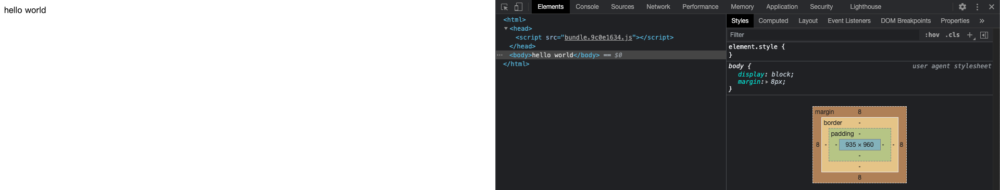

界面上也出现了 `hello world`。到这里为止，算是利用 `webpack` 走通了一个最小流程。

为什么说是最小，因为到目前为止这个配置在实际工作中实用性不大。
细心一点的人已经看出来了，上面存在三个问题：

- 每修改一次代码，都要走一遍打包流程，然后自己手动打开 `html` 文件，预览效果；
- 调用错误 `api` 的时候，报错信息定位不精确；
- 打包目录下面 上次构建产物 也仍旧存在，时间长了会存在越来越多的无用代码；

这里以一个实例来看下第二个痛点：

修改 `src/index.js` 文件内容：

```js
// ...
document.writeTest('hello world');
// ...
```

执行 `npx webpack`后，看下效果：

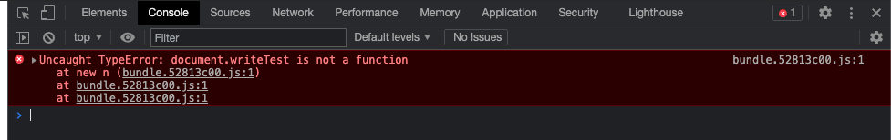

我们一个个来解决。

### 2.5 实时更新并预览效果

根据 [webpack 官网-开发环境小节](https://webpack.docschina.org/guides/development/#choosing-a-development-tool)介绍：

> 在每次编译代码时，手动运行 `npm run build` 会显得很麻烦。
> 多数场景中，你可能需要使用 `webpack-dev-server`。

所以我们引入 `webpack-dev-server`：

```bash
npm install -D webpack-dev-server
```

然后在 `webpack.config.js` 中添加相应的配置：

```js
// 省略 ...
module.exports = {
    // 省略 ...
    devServer: {
        port: '3000', // 默认是 8080
        hot: true,
        stats: 'errors-only', // 终端仅打印 error
        compress: true, // 是否启用 gzip 压缩
        proxy: {
            '/api': {
                target: 'http://127.0.0.1:3001',
                pathRewrite: {
                    '/api': '',
                },
            },
        },
    },
};
```

在 `package.json > script` 中添加一个命令：

```json
{
    "scripts": {
        "dev": "webpack serve --open"
    }
}
```

执行 `npm run dev`, 这个时候自动在浏览器中打开了 `http://127.0.0.1:3000/` 页面。

```bash
npm run dev

# > webpack-demo@1.0.0 dev
# > webpack serve --open

#   Project is running at http://127.0.0.1:3000/
#   webpack output is served from /
#   Content not from webpack is served from [webpack-demo]
#   wait until bundle finished: /
```

光自动打开还不够啊，我们的目标是每次修改后不用构建就能在浏览器中实时查看。
为了测试这个功能是否生效，我们任意修改 `src/index.js` 文件并保存。发现浏览器中内容自动刷新生效了。

`devServer` 更多配置[详见这里](https://webpack.js.org/configuration/dev-server/)。

### 2.6 sourcemap 配置

`报错信息定位不精确`如何处理呢？

我们在 `webpack.config.js` 中添加配置：

```js
// 省略 ...
module.exports = {
    // 省略 ...
    devtool: 'eval-cheap-module-source-map',
};
```

这个配置什么意思呢，它会告诉我们错误是在原始代码的哪一行发生的。先来看看效果：

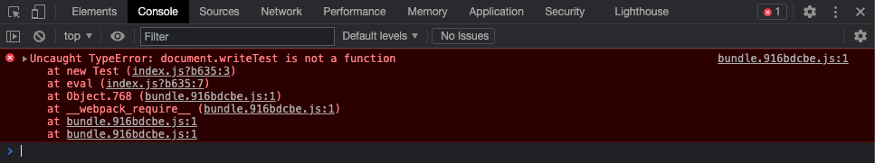

点进去看看是什么情况：

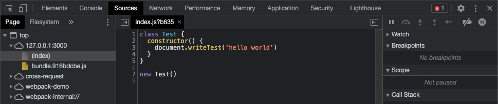

但是，这个配置生产环境可不能乱用。这里建议：

- 开发环境: `eval-cheap-module-source-map`;
- 生产环境: `hidden-source-map`;

看下[官网-Devtool](https://webpack.docschina.org/configuration/devtool/)对其描述：

**对于开发环境：**

- `eval` - 每个模块都使用 `eval()` 执行，并且都有 `//@ sourceURL`。此选项会非常快地构建。主要缺点是，由于会映射到转换后的代码，而不是映射到原始代码（没有从 `loader` 中获取 `source map`），所以不能正确的显示行数。

- `eval-source-map` - 每个模块使用 `eval()` 执行，并且 `source map` 转换为 `DataUrl` 后添加到 `eval()` 中。初始化 `source map` 时比较慢，但是会在重新构建时提供比较快的速度，并且生成实际的文件。行数能够正确映射，因为会映射到原始代码中。它会生成用于开发环境的最佳品质的 `source map`。

- `eval-cheap-source-map` - 类似 `eval-source-map`，每个模块使用 `eval()` 执行。这是 "`cheap(低开销)`" 的 `source map`，因为它没有生成列映射(`column mapping`)，只是映射行数。它会忽略源自 `loader` 的 `source map`，并且仅显示转译后的代码，就像 `eval devtool`。

- `eval-cheap-module-source-map` - 类似 `eval-cheap-source-map`，并且，在这种情况下，源自 `loader` 的 `source map` 会得到更好的处理结果。然而, `loader` `source map` 会被简化为每行一个映射(`mapping`)。

**对于生产环境：**

- (`none`)（省略 `devtool` 选项） - 不生成 `source map`。这是一个不错的选择。
- `source-map` - 整个 `source map` 作为一个单独的文件生成。它为 `bundle` 添加了一个引用注释，以便开发工具知道在哪里可以找到它。
  这个时候，需要将服务器配置为，不允许普通用户访问 `source map` 文件！
- `hidden-source-map` - 与 `source-map` 相同，但不会为 `bundle` 添加引用注释。如果你只想 `source map` 映射那些源自错误报告的错误堆栈跟踪信息，但不想为浏览器开发工具暴露你的 `source map`, 这个选项会很有用。
  不将 `source map` 文件部署到 `web` 服务器。而是只将其用于错误报告工具。

世事总是这么奇妙，按照上面的思路，在解决第二个问题的时候又带出了一个新的问题：
某些配置可能需要区分环境来设置，不同的环境设置合适的配置。

看来在解决上面第三个问题之前，得先解决这个`区分环境配置`的问题了。

### 2.7 拆分环境

按照一般惯例，我们会有`开发`、`测试`、`预发布`、`生产`几个环境。

这里以`开发`和`生产`为例。

修改下目录结构：

```
webpack-demo
  + ├── build
  + |    ├── webpack.base.js
  + |    ├── webpack.dev.js
  + |    ├── webpack.prod.js
    ├── dist
    |    ├── bundle.9c0e1634.js
    |    ├── bundle.b8ba1739.js
    |    └── index.html
    ├── src
    |    └── index.js
    ├── public
    |    └── index.html
    ├── .babelrc
    └── package.json
```

从目录中就可以看出一点东西，我们删除了原先根目录下的 `webpack.config.js` 文件，新增了一个 `build` 目录。
在 `build` 目录下我们需要建一个 `webpack.base.js` 文件。用来存放各个环境公共的配置，毕竟不可能所有配置在各个环境中都不一样。
然后按照我们各自项目实际的需求来建立不同环境的配置文件。

先修改公共配置文件 `build/webpack.base.js`。

- 原先的 `devServe` 配置由于只有开发环境有；
- `devtool` 各个环境不一样；

所以这两个配置从公共配置里移除了。

```js
const path = require('node:path');
const HtmlWebpackPlugin = require('html-webpack-plugin');

const rootDir = process.cwd();

module.exports = {
    entry: path.resolve(rootDir, 'src/index.js'),
    output: {
        path: path.resolve(rootDir, 'dist'),
        filename: 'bundle.[contenthash:8].js',
    },
    module: {
        rules: [
            {
                test: /\.(jsx|js)$/,
                use: 'babel-loader',
                include: path.resolve(rootDir, 'src'),
                exclude: /node_modules/,
            },
        ],
    },
    plugins: [
        new HtmlWebpackPlugin({
            template: path.resolve(rootDir, 'public/index.html'),
            inject: 'body',
            scriptLoading: 'blocking',
        }),
    ],
};
```

接下来配置各个环境的配置，这里主要用到一个 `webpack-merge` 插件，用来合并公共配置，执行：

```bash
npm install -D webpack-merge
```

修改 `webpack.dev.js`：

```js
const { merge } = require('webpack-merge');
const baseConfig = require('./webpack.base');

module.exports = merge(baseConfig, {
    mode: 'development',
    devtool: 'eval-cheap-module-source-map',
    devServer: {
        port: '3000', // 默认是 8080
        hot: true,
        stats: 'errors-only', // 终端仅打印 error
        compress: true, // 是否启用 gzip 压缩
        proxy: {
            '/api': {
                target: 'http://127.0.0.1:3001',
                pathRewrite: {
                    '/api': '',
                },
            },
        },
    },
});
```

修改 `webpack.prod.js`：

```js
const { merge } = require('webpack-merge');
const baseConfig = require('./webpack.base');

module.exports = merge(baseConfig, {
    mode: 'production',
    devtool: 'hidden-source-map',
});
```

修改 `package.json` 中的命令：

```json
{
    "scripts": {
        "dev": "webpack serve --config build/webpack.dev.js --open",
        "build:prod": "webpack --config build/webpack.prod.js"
    }
}
```

执行命令 `npm run dev` 和 `npm run build:prod` 进行实际验证下，这里就忽略了。

现在已经成功把 `webpack.config.js` 文件`根据环境`进行拆分成了多个文件。

### 2.8 打包时清除上次构建产物

每次打包，`上次构建产物`依旧存在，这个项目小的时候其实问题不大，但是当项目大了之后，每次打包都增加几百上千的文件，还是有点恐怖的。
所以这个问题也是有必要解决的。

我们的目标是每次打包时删除上次打包的产物，保证打包目录下所有文件都是新的，我们这里引入一个插件 `clean-webpack-plugin`，来看下这个插件的[官方介绍](https://www.npmjs.com/package/clean-webpack-plugin)：

> A webpack plugin to remove/clean your build folder(s).
> NOTE: Node v10+ and webpack v4+ are supported and tested.
> By default, this plugin will remove all files inside webpack's output.path directory, as well as all unused webpack assets after every successful rebuild.

```bash
npm install -D clean-webpack-plugin
```

修改 `webpack.base.js`:

```js
// 省略 ...
const { CleanWebpackPlugin } = require('clean-webpack-plugin');

module.exports = {
    // 省略 ...
    plugins: [
    // 省略 ...
        new CleanWebpackPlugin(),
    ],
};
```

试下效果，执行 `npm run build:prod` 打个包。查看目录：

```
webpack-demo
    ├── build
    |    ├── webpack.base.js
    |    ├── webpack.dev.js
    |    ├── webpack.pre.js
    |    ├── webpack.pro.js
    ├── dist
  + |    ├── bundle.52813c00.js
  + |    ├── bundle.52813c00.js.map
    |    ├── index.html
    ├── src
    |    └── index.js
    ├── public
    |    └── index.html
    ├── .babelrc
    └── package.json
```

`dist` 目录下原先存在的 `main.js`、`bundle.9c0e1634.js` 等前几次打包产物已经`自动清除`了。

## 3. 功能完善

### 3.1 添加 css 和 less 支持

> 为什么不添加 `sass` 支持？因为 `node-sass` 安装依赖时间要久一些，这里忽略。

首先，在 `src` 目录下添加一个 `index.less` 文件：

```less
.test {
  color: red;
}
```

修改 `src/index.js` 文件，在文件中引用刚才添加的 `less` 文件：

```js
import './index.less';

class Test {
    constructor() {
        this.renderDiv();
    }

    renderDiv() {
        const div = document.createElement('div');
        div.className = 'test';
        div.innerHTML = 'hello world';
        document.body.appendChild(div);
    }
}

const test = new Test();
```

执行 `npm run dev`, 我们发现浏览器执行报错：

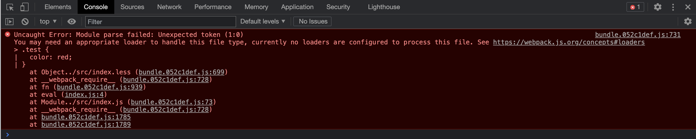

结合[官网-模块]的说明：

> 通过 `loader` 可以使 `webpack` 支持多种语言和预处理器语法编写的模块。
> `loader` 向 `webpack` 描述了如何处理非原生模块，并将相关依赖引入到你的 `bundles` 中。
> `webpack` 社区已经为各种流行的语言和预处理器创建了 `loader`, 详见[loader 列表](https://webpack.docschina.org/loaders/)。

首先安装 `loader`:

```bash
npm install -D less style-loader css-loader less-loader
```

再修改 `webpack.base.js` 文件：

```js
// 省略...

module.exports = {
    // 省略...
    module: {
        rules: [
            // 省略...
            {
                test: /\.(le|c)ss$/,
                exclude: /node_modules/,
                use: ['style-loader', 'css-loader', 'less-loader'],
            },
        ],
    },
    // 省略...
};
```

再次执行 `npm run dev`, 查看效果：

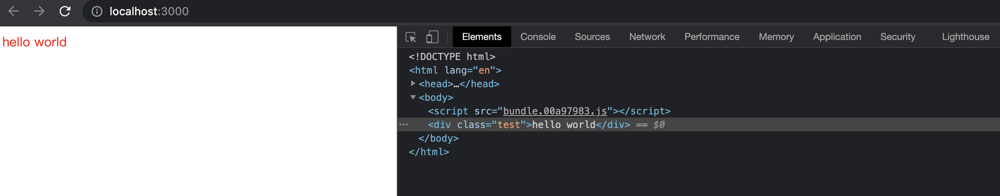

### 3.2 css 自动添加前缀

首先安装插件：

```bash
npm install -D autoprefixer postcss postcss-loader
```

修改 `webpack.base.js` 配置文件：

```js
// 省略 ...
const autoprefixer = require('autoprefixer');

module.exports = {
    // 省略 ...
    module: {
        rules: [
            // 省略 ...
            {
                test: /\.(le|c)ss$/,
                exclude: /node_modules/,
                use: [
                    // 省略 ...
                    {
                        loader: 'postcss-loader',
                        options: {
                            postcssOptions: {
                                plugins: [['autoprefixer']],
                            },
                        },
                    },
                ],
            },
        ],
    },
    // 省略 ...
};
```

修改 `src/index.js`：

```js
// 省略 ...

class Test {
    // 省略 ...

    renderDiv() {
    // 省略 ...
        setTimeout(() => {
            const div = document.querySelector('.test');
            div.classList.add('dropdown');
        }, 1000);
    }
}
// 省略 ...
```

修改 `src/index.less`：

```less
.test {
  // 省略 ...
  &.dropdown {
    animation: dropdown 2s linear infinite;
  }
}

@keyframes dropdown {
  0% {
    margin-top: 0px;
  }
  100% {
    margin-top: 100px;
  }
}
```

执行下 `npm run dev`后，看下效果：

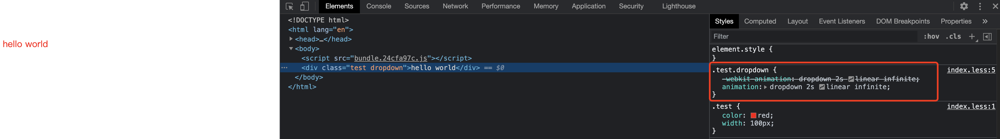

### 3.3 打包后抽离 css 文件

首先安装 `mini-css-extract-plugin` 插件：

```bash
npm install -D mini-css-extract-plugin
```

修改 `webpack.base.js` 配置文件：

```js
// 省略 ...
const MiniCssExtractPlugin = require('mini-css-extract-plugin');

module.exports = {
    // 省略 ...
    module: {
        rules: [
            // 省略 ...
            {
                test: /\.(le|c)ss$/,
                exclude: /node_modules/,
                use: [
                    MiniCssExtractPlugin.loader,
                    // 省略 ...
                ],
            },
        ],
    },
    plugins: [
    // 省略 ...
        new MiniCssExtractPlugin({
            filename: 'css/[name].css',
        }),
    ],
};
```

### 3.4 复制静态资源到打包目录

有些时候有些第三方的 `js` 插件没有提供 `npm` 包，只提供了一个 `cdn` 地址或者一份文件需要自己下载下来。
通常我们下载下来之后放在我们的 `public/js` 目录下面，然后 `public/index.html` 文件里直接用 `script` 标签引入。
这个时候不管是 `npm run dev` 开发时，还是 `npm run build:pro` 构建后，这个 `js` 文件都是找不到的。

我们可以尝试下。
在 `public/js` 新加一个 `test.js` 的空文件，啥内容都不用。然后在 `public/index.html` 中引入这个文件：

```html
<!-- 省略 ... -->
<body>
  <script src="./js/test.js"></script>
</body>
<!-- 省略 ... -->
```

执行 `npm run dev` 查看效果：

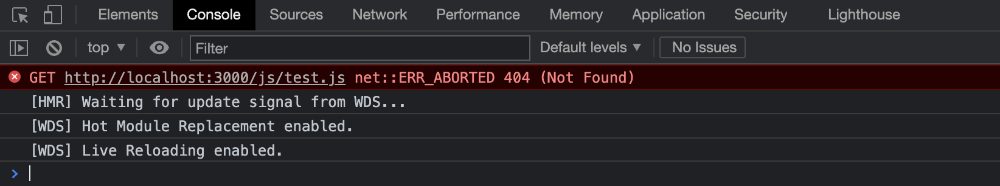

这里我们可以用 `copy-webpack-plugin` 这个插件，在构建的时候，将 `public/js` 的静态资源复制到 `dist` 目录下，这样文件就能找到了。

安装插件：

```bash
npm install -D copy-webpack-plugin
```

修改 `webpack.base.js` 配置文件：

```js
// 省略...
const CopyWebpackPlugin = require('copy-webpack-plugin');

module.exports = {
    // 省略...
    plugins: [
        new CopyWebpackPlugin({
            patterns: [
                {
                    from: '*.js',
                    context: path.resolve(rootDir, 'public/js'),
                    to: path.resolve(rootDir, 'dist/js'),
                },
            ],
        }),
    ],
};
```

执行 `npm run dev` 查看效果：

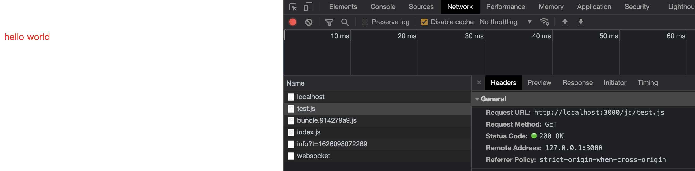

静态文件已经可以正常加载了。

### 3.5 资源加载器

项目中难免要引入一些图标、图片等资源，在不做任何处理的情况下，我们尝试下在代码中引用图片，修改 `src/index.js` 文件如下：

```js
import wuhanjiayou from '../public/asset/a.jpeg';

class Test {
    constructor() {
        this.renderImg();
    }

    renderImg() {
        const img = document.createElement('img');
        img.src = wuhanjiayou;
        document.body.appendChild(img);
    }
}

const test = new Test();
```

执行 `npm run dev`，效果如下：

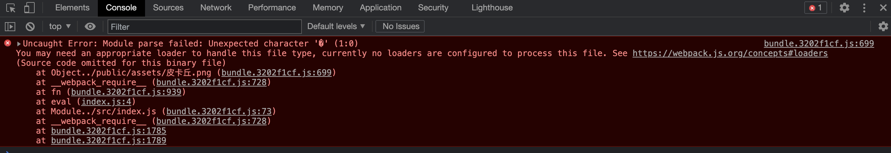

解决办法呢，修改 `webpack.base.js` 配置文件：

```js
// 省略...
module.exports = {
    // 省略...
    module: {
        rules: [
            {
                test: /\.(png|jpg|gif|jpeg|webp|svg|eot|ttf|woff|woff2)$/,
                type: 'asset',
            },
            // 省略...
        ],
    },
    // 省略...
};
```

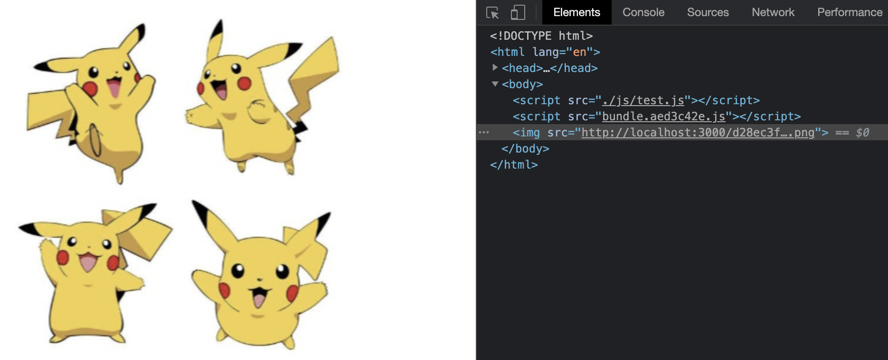

到这里，基本够小项目的日常开发需求了。

## 4. 项目优化

刚才也讲到了，上面的一通操作基本够小项目开发使用了。
为什么是小项目？大项目不行吗？
当一个项目大到路由都有几百个的时候，一次热更新就需要十几二十多秒，一次打包要半个小时。
开发时，一次代码改动保存就要等 `20` 秒，这个时候就需要想点办法来优化。

### 4.1 loader 配置优化

这个其实上面已经做了。明确告诉 `loader`, 哪些文件不用做处理(`exclude`)，或者只处理哪些文件(`include`)。

```js
// 省略...
module.exports = {
    // 省略...
    module: {
        rules: [
            {
                test: /\.(jsx|js)$/,
                use: 'babel-loader',
                include: path.resolve(rootDir, 'src'),
                exclude: /node_modules/,
            },
            // 省略...
        ],
    },
    // 省略...
};
```

一般倾向于使用 `include`, 但是如果怕漏处理一些文件的话，粗暴点，使用 `exclude: /node_modules/` 也可以。

### 4.2 缓存

`webpack5` 自带了持久化缓存，配置如下。

开发环境 `webpack.dev.js`:

```js
// 省略...
module.exports = merge(baseConfig, {
    cache: {
        type: 'memory',
    },
});
```

生产环境 `webpack.prod.js`:

```js
// 省略...
module.exports = merge(baseConfig, {
    cache: {
        type: 'filesystem',
        buildDependencies: {
            config: [__filename],
        },
    },
});
```

以下为两次构建的时间：

```bash
npm run build:prod

# > webpack-demo@1.0.0 build:prod
# > webpack --config build/webpack.prod.js

# assets by info 169 KiB [immutable]
#   asset d28ec3fafa363bcbd738.png 164 KiB [emitted] [immutable] [from: public/assets/皮卡丘.png] (auxiliary name: main)
#   asset bundle.982f57a6.js 5.76 KiB [emitted] [immutable] [minimized] (name: main) 1 related asset
# asset index.html 260 bytes [emitted]
# asset js/test.js 0 bytes [emitted] [from: public/js/test.js] [copied] [minimized]
# orphan modules 850 bytes [orphan] 2 modules
# runtime modules 1.06 KiB 2 modules
# modules by path ./node_modules/core-js-pure/internals/*.js 12.8 KiB 24 modules
# ./src/index.js + 2 modules 1.37 KiB [built] [code generated]
# ./public/assets/皮卡丘.png 42 bytes (javascript) 164 KiB (asset) [built] [code generated]
# ./node_modules/@babel/runtime-corejs3/core-js/object/define-property.js 73 bytes [built] [code generated]
# ./node_modules/core-js-pure/features/object/define-property.js 83 bytes [built] [code generated]
# ./node_modules/core-js-pure/es/object/define-property.js 314 bytes [built] [code generated]
# ./node_modules/core-js-pure/modules/es.object.define-property.js 396 bytes [built] [code generated]
# webpack 5.44.0 compiled successfully in 927 ms
```

```bash
npm run build:prod

# > webpack-demo@1.0.0 build:prod
# > webpack --config build/webpack.prod.js

# assets by info 169 KiB [immutable]
#   asset d28ec3fafa363bcbd738.png 164 KiB [emitted] [immutable] [from: public/assets/皮卡丘.png] (auxiliary name: main)
#   asset bundle.982f57a6.js 5.76 KiB [emitted] [immutable] [minimized] (name: main) 1 related asset
# asset index.html 260 bytes [emitted]
# asset js/test.js 0 bytes [emitted] [from: public/js/test.js] [copied] [minimized]
# cached modules 15.9 KiB (javascript) 164 KiB (asset) 1.06 KiB (runtime) [cached] 34 modules
# webpack 5.44.0 compiled successfully in 281 ms
```

如果在构建时，你主动确定要放弃旧的缓存的话，可以传一个新的 `version` 参数来放弃使用缓存。

生产环境 `webpack.prod.js`:

```js
// 省略...
module.exports = merge(baseConfig, {
    cache: {
    // 省略...
        version: 'new_version',
    },
});
```

再次执行，看下效果：

```bash
npm run build:prod

# > webpack-demo@1.0.0 build:prod
# > webpack --config build/webpack.prod.js

# assets by info 169 KiB [immutable]
#   asset d28ec3fafa363bcbd738.png 164 KiB [emitted] [immutable] [from: public/assets/皮卡丘.png] (auxiliary name: main)
#   asset bundle.982f57a6.js 5.76 KiB [emitted] [immutable] [minimized] (name: main) 1 related asset
# asset index.html 260 bytes [emitted]
# asset js/test.js 0 bytes [emitted] [from: public/js/test.js] [copied] [minimized]
# orphan modules 850 bytes [orphan] 2 modules
# runtime modules 1.06 KiB 2 modules
# modules by path ./node_modules/core-js-pure/internals/*.js 12.8 KiB 24 modules
# ./src/index.js + 2 modules 1.37 KiB [built] [code generated]
# ./public/assets/皮卡丘.png 42 bytes (javascript) 164 KiB (asset) [built] [code generated]
# ./node_modules/@babel/runtime-corejs3/core-js/object/define-property.js 73 bytes [built] [code generated]
# ./node_modules/core-js-pure/features/object/define-property.js 83 bytes [built] [code generated]
# ./node_modules/core-js-pure/es/object/define-property.js 314 bytes [built] [code generated]
# ./node_modules/core-js-pure/modules/es.object.define-property.js 396 bytes [built] [code generated]
# webpack 5.44.0 compiled successfully in 890 ms
```

### 4.3 mode

当设置 `mode: production` 时, `webpack` 已经默认开启了一些优化措施。

**用法**

只需在配置对象中提供 `mode` 选项：

```js
module.exports = {
    mode: 'development',
};
```

或者从 `CLI` 参数中传递：

```bash
webpack --mode=development
```

**说明**

支持以下字符串值：

- `development`: 会将 `DefinePlugin` 中 `process.env.NODE_ENV` 的值设置为 `development`.
  为模块和 `chunk` 启用有效的名。
- `production`: 会将 `DefinePlugin` 中 `process.env.NODE_ENV` 的值设置为 `production`。
  为模块和 `chunk` 启用确定性的混淆名称, `FlagDependencyUsagePlugin`, `FlagIncludedChunksPlugin`, `ModuleConcatenationPlugin`, `NoEmitOnErrorsPlugin` 和 `TerserPlugin`.
- `none`: 不使用任何默认优化选项

如果没有设置, `webpack` 会给 `mode` 的默认值设置为 `production`。

### 4.4 thread-loader

利用 `thread-loader` 插件进行多线程打包。

先安装：

```bash
npm install -D thread-loader
```

再修改配置 `webpack.base.js`:

```js
// 省略...
module.exports = {
    // 省略...
    module: {
        rules: [
            // 省略...
            {
                test: /\.(jsx|js)$/,
                use: ['thread-loader', 'babel-loader'],
                // 省略...
            },
            {
                test: /\.(le|c)ss$/,
                exclude: /node_modules/,
                use: [
                    'thread-loader',
                    // 省略...
                ],
            },
        ],
    },
};
```

执行下，看下效果：

```bash
npm run build:prod

# > webpack-demo@1.0.0 build:prod
# > webpack --config build/webpack.prod.js

# assets by info 169 KiB [immutable]
#   asset d28ec3fafa363bcbd738.png 164 KiB [emitted] [immutable] [from: public/assets/皮卡丘.png] (auxiliary name: main)
#   asset bundle.982f57a6.js 5.76 KiB [emitted] [immutable] [minimized] (name: main) 1 related asset
# asset index.html 260 bytes [emitted]
# asset js/test.js 0 bytes [emitted] [from: public/js/test.js] [copied] [minimized]
# orphan modules 850 bytes [orphan] 2 modules
# runtime modules 1.06 KiB 2 modules
# modules by path ./node_modules/core-js-pure/internals/*.js 12.8 KiB 24 modules
# ./src/index.js + 2 modules 1.37 KiB [built] [code generated]
# ./public/assets/皮卡丘.png 42 bytes (javascript) 164 KiB (asset) [built] [code generated]
# ./node_modules/@babel/runtime-corejs3/core-js/object/define-property.js 73 bytes [built] [code generated]
# ./node_modules/core-js-pure/features/object/define-property.js 83 bytes [built] [code generated]
# ./node_modules/core-js-pure/es/object/define-property.js 314 bytes [built] [code generated]
# ./node_modules/core-js-pure/modules/es.object.define-property.js 396 bytes [built] [code generated]
# webpack 5.44.0 compiled successfully in 1818 ms
```

发现比配置前耗时更多，可能是因为构建的内容比较少，配置的优势没有体现出来的原因。毕竟多线程也是需要有开销的。

## 5. 参考

- [2020 年了, 再不会 webpack 敲得代码就不香了(近万字实战)](https://juejin.cn/post/6844904031240863758#heading-22)
- [webpack 最佳实践](https://mp.weixin.qq.com/s/xNGQSW4CUn-neIUpiEkdXA)
