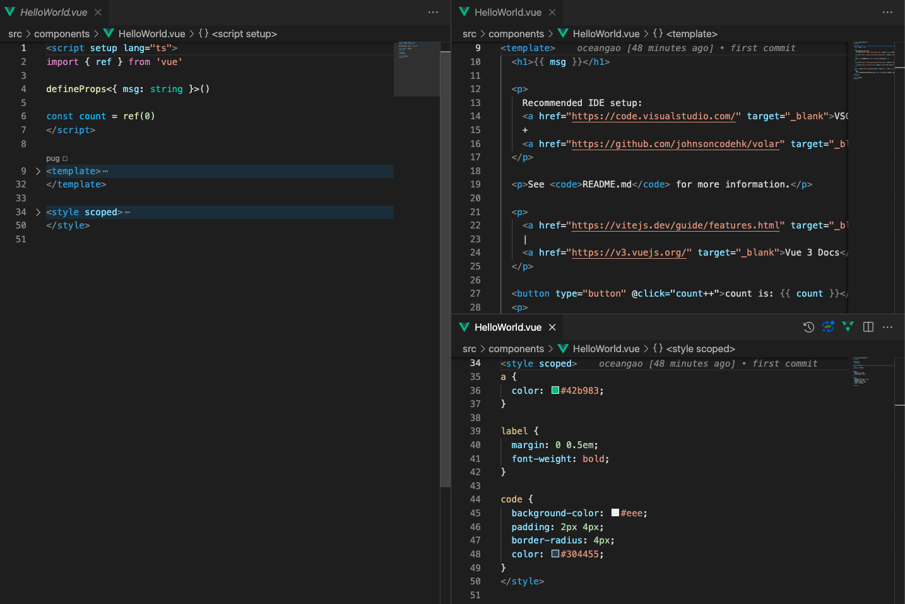

# 前端项目 Stylelint 配置

## 1. 前言

对于 `.css`，`.scss`，`.less`文件内容做规范检查和自动修复，虽然 `prettier` 可以支持。
但能否在 `prettier` 规则的基础上，不影响现有的开发体验，实现更精细的规则校验呢？

我们下面来以实际项目引入 `stylelint` 插件，看能否实现预期。

## 2. 项目初始化

```bash
yarn create vite my-vue-app --template vue-ts
# yarn create v1.23.0-20200205.1242
# [1/4] 🔍  Resolving packages...
# [2/4] 🚚  Fetching packages...
# [3/4] 🔗  Linking dependencies...
# [4/4] 🔨  Building fresh packages...

# success Installed "create-vite@2.6.2" with binaries:
#       - create-vite
#       - cva

# Done. Now run:

#   cd my-vue-app
#   yarn
#   yarn dev

# ✨  Done in 2.77s.
```

## 3. 基础配置

### 3.1 Eslint 相关配置

为了避免 `Stylelint` 和 `Eslint` 冲突，所以先配置下 `Eslint`, 避免 `Stylelint` 配置后，隐藏一些现有开发体验的问题。

```bash
yarn add -D eslint eslint-config-prettier eslint-plugin-prettier eslint-plugin-vue prettier @typescript-eslint/eslint-plugin @typescript-eslint/parser
```

我们这里直接展示下配置结果。

> `.vscode/settings.json` 如下：

```json
{
  // #定义一个默认格式化程序, 该格式化程序优先于所有其他格式化程序设置。必须是提供格式化程序的扩展的标识符。
  "editor.defaultFormatter": null,
  // #每次保存的时候自动格式化
  "editor.formatOnSave": true,
  // #每次保存的时候将代码按eslint格式进行修复
  "editor.codeActionsOnSave": {
    // For ESLint
    "source.fixAll.eslint": "explicit"
  },
  "eslint.run": "onType",
  "eslint.options": {
    "extensions": [".js", ".ts"]
  },
  "eslint.validate": ["javascript", "typescript"],
  "[vue]": {
    "editor.defaultFormatter": "esbenp.prettier-vscode"
  },
  "html.format.enable": false,
  // #Vue3 报错：[vue/no-multiple-template-root] The template root requires exactly one element.[eslint-plugin-vue]
  // 所以需要去掉 Vuex 中 eslint-plugin-vue 校验。
  "vetur.validation.template": false
}
```

> `.eslintrc.js` 如下：

```js
// ESLint 检查 .vue 文件需要单独配置编辑器：
// https://eslint.vuejs.org/user-guide/#editor-integrations
module.exports = {
  root: true,
  parser: '@typescript-eslint/parser',
  parserOptions: {
    sourceType: 'module',
  },
  extends: ['prettier', 'plugin:@typescript-eslint/eslint-recommended'],
  // 插件
  plugins: ['prettier', '@typescript-eslint'],
};
```

用 `vscode` 编辑 `src/main.ts` 保存即格式化符合预期。

### 3.2 存在问题

用 `vscode` 编辑 `src/components/HelloWorld.vue`，发现报错，这个是因为我们需要安装一个扩展 `Volar`。这个是干嘛用的呢？

与 `vetur` 相同, `volar` 是一个针对 `vue` 的 `vscode` 插件，不过与 `vetur` 不同的是, `volar` 提供了更为强大的功能。
具体可以看下[这里](https://zhuanlan.zhihu.com/p/375096539)的介绍。

同样是`.vue`文件，且已经安装了 `Vetur`， vscode 为什么还需要安装 `Volar` 呢？

原因是因为 `HelloWorld.vue` 这个文件里面：

```vue
<script setup lang="ts">
import { ref } from 'vue';

defineProps<{ msg: string }>();

const count = ref(0);
</script>
```

顶部 `script` 标签增加 `setup` 属性（安装 `Volar` 后， 会多一个 `setup sugar` 小图标）。
当然写法也会和正常的写法有所不同：

```vue
<script lang="ts">
import { defineComponent, ref } from 'vue';

export default defineComponent({
  props: {
    msg: {
      type: String,
      required: true,
    },
  },
  setup() {
    const count = ref(0);
    return {
      ref,
      count,
    };
  },
});
</script>
```

安装后有什么用呢？

- 避免语法报错，如上方代码所示，如果不安装的话，会报错 `count` 变量已定义但未使用。
- 可以文件切割，点击右上角 `Volar` 图标，效果如下：

  

### 3.3 Vscode 配置

当然了, `Vetur` 和 `Volar` 是冲突的，所以如果全局安装的是 `Vetur` 的话，需要设置下 `Vscode` 当前工作区 `Vetur 禁用`，`Volar 启用`。

到这里, `Eslint` 相关算是配置完成了。接下来配置下 `Stylelint` 是不是我们想要的结果。

## 4. Stylelint 配置

### 4.1 环境准备

```bash
yarn add -D stylelint stylelint-order stylelint-prettier stylelint-config-standard stylelint-config-prettier stylelint-config-rational-order stylelint-declaration-block-no-ignored-properties stylelint-scss
```

插件说明：

- stylelint-config-standard：stylelint 官方共享的标准规则集成。
- stylelint-order：用于规范样式属性写作顺序的插件。
- stylelint-config-rational-order：和 stylelint-order 结合使用，是对 css 属性进行排序。
- stylelint-config-prettier：排除与 prettier 冲突的 rule。
- stylelint-prettier：基于 prettier 代码风格的 stylelint 规则。
- stylelint-config-prettier：禁用所有与 prettier 冲突的格式相关的 Stylelint 规则，解决 prettier 与 stylelint 规则冲突，确保将其放在 extends 队列最后，这样它将覆盖其他配置。
- stylelint-declaration-block-no-ignored-properties：对 css 代码检测无效的属性。

如果需要支持 `scss`, 需要安装以下插件：

- `stylelint-scss`: 处理 `sass` 文件。

### 4.2 stylelint 配置

项目根目录下，新增 `.stylelintrc.js` 配置文件。

```js
module.exports = {
  extends: ['stylelint-config-standard', 'stylelint-config-rational-order', 'stylelint-prettier/recommended'],
  plugins: ['stylelint-scss', 'stylelint-declaration-block-no-ignored-properties'],
  // https://stylelint.docschina.org/user-guide/rules/
  rules: {
    'no-empty-source': null, // 允许空文件
    'at-rule-no-unknown': null, // 允许未知的@规则。
  },
  ignoreFiles: [],
};
```

其中：

```json
{
  "extends": ["stylelint-prettier/recommended"]
}
```

This does three things:

- Enables the stylelint-plugin-prettier plugin.
- Enables the prettier/prettier rule.
- Extends the stylelint-config-prettier configuration.

详见[这里](https://github.com/prettier/stylelint-prettier)。

### 4.3 vscode 配置

`Vscode` 安装扩展 `stylelint`。

> `.vscode/settigns.json`

```json
{
  // #每次保存的时候将代码进行修复
  "editor.codeActionsOnSave": {
    // 文件保存时开启 stylelint 自动修复程序
    "source.fixAll.stylelint": "explicit"
  },
  // 禁用 Vetur，启用 Volar 即可
  "vetur.format.enable": false,
  // 防止编辑器内置 linter 与插件冲突设置
  "css.validate": false,
  "less.validate": false
}
```

经测试 `.css` 文件已经达到了保存即自动格式化属性顺序的效果。
但 `.scss` 项目不支持解析，报错了。

我们执行下 `yarn add -D sass`，就正常了。

在 `.vue` 中 `style` 模块中代码也同样格式化，Perfect~

## 5. 参考

- [stylelint 规则](https://stylelint.docschina.org/user-guide/rules/)
