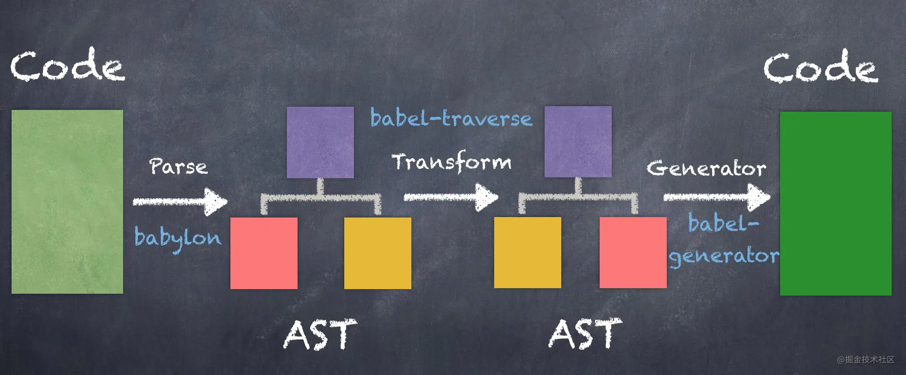

# JavaScript 抽象语法树 AST

## 1. 基础知识

### 1.1 AST 是什么

先贴下官方的解释：

> 在计算机科学中，抽象语法树(`abstract syntax tree` 或者缩写为 `AST`), 或者语法树(`syntax tree`), 是源代码的抽象语法结构的树状表现形式，这里特指编程语言的源代码。

为了方便理解抽象语法树，来看看具体的例子。

```js
const tree = 'this is tree';
```

通过[在线 AST 转换器](https://astexplorer.net/)，我们发现, `js` 源代码将会被转化成下面的抽象语法树：

```json
{
    "type": "Program",
    "start": 0,
    "end": 25,
    "body": [
        {
            "type": "VariableDeclaration",
            "start": 0,
            "end": 25,
            "declarations": [
                {
                    "type": "VariableDeclarator",
                    "start": 4,
                    "end": 25,
                    "id": {
                        "type": "Identifier",
                        "start": 4,
                        "end": 8,
                        "name": "tree"
                    },
                    "init": {
                        "type": "Literal",
                        "start": 11,
                        "end": 25,
                        "value": "this is tree",
                        "raw": "'this is tree'"
                    }
                }
            ],
            "kind": "var"
        }
    ],
    "sourceType": "module"
}
```

可以看到一条语句由若干个词法单元组成。
这个词法单元就像 `26` 个字母，创造出个十几万的单词，通过不同单词的组合又能写出不同内容的文章。

### 1.2 AST 有什么用

- `IDE` 的错误提示、代码格式化、代码高亮、代码自动补全等；
- `JSLint`、`JSHint` 对代码错误或风格的检查等；
- `webpack`、`rollup` 进行代码打包等；
- `CoffeeScript`、`TypeScript`、`JSX` 等转化为原生 `Javascript`；
- `vue` 模板编译、`react` 模板编译；

### 1.3 AST 如何生成

`AST` 整个解析过程分为两个步骤：

- 词法分析 (`Lexical Analysis`)：
  扫描输入的源代码字符串，生成一系列的词法单元 (`tokens`)。
  这些词法单元包括数字，标点符号，运算符等。
  词法单元之间都是独立的，也即在该阶段我们并不关心每一行代码是通过什么方式组合在一起的。
- 语法分析 (`Syntax Analysis`)：
  建立分析语法单元之间的关系。

### 1.4 AST 结构

分析抽象语法树，会发现不同层级有着相似的结构，比如：

```json
{
    "type": "Program",
    "start": 0,
    "end": 25,
    "body": [
    // ...
    ],
    "sourceType": "module"
}
```

```json
{
    "type": "VariableDeclaration",
    "start": 0,
    "end": 25,
    "declarations": [
    // ...
    ],
    "kind": "var"
}
```

像这样的结构叫做节点(`Node`)。
一个 `AST` 是由多个或单个这样的节点组成，节点内部可以有多个这样的子节点，构成一颗语法树，这样就可以描述用于静态分析的程序语法。

节点中的 `type` 字段表示节点的类型，比如上述 `AST` 中的"`Program`"、"`VariableDeclaration`"等，当然每种节点类型会有一些附加的属性用于进一步描述该节点类型。

### 1.5 JsParser

`JavaScript Parser`, 把 `js` 源码转化为抽象语法树的解析器。

- acorn；
- esprima；
- @babel/parser；

我们接下来的实例通过 `@babel/parser` 实现，所以再介绍下 Babel。

## 2. Babel 介绍

### 2.1 Babel 的工作流程



`Babel` 的三个主要处理步骤分别是： 解析(`parse`), 转换(`transform`), 生成(`generate`)。

- 解析
  将代码解析成抽象语法树(`AST`), 每个 `js` 引擎（比如 `Chrome` 浏览器中的 `V8` 引擎）都有自己的 `AST` 解析器，而 `Babel` 是通过 `Babylon` 实现的。
  在解析过程中有两个阶段：词法分析和语法分析，词法分析阶段把字符串形式的代码转换为令牌(`tokens`)流，令牌类似于 `AST` 中节点；
  而语法分析阶段则会把一个令牌流转换成 `AST` 的形式，同时这个阶段会把令牌中的信息转换成 `AST` 的表述结构。
- 转换
  在这个阶段, `Babel` 接受得到 `AST` 并通过 `babel-traverse` 对其进行深度优先遍历，在此过程中对节点进行添加、更新及移除操作。
  这部分也是 `Babel` 插件介入工作的部分。
- 生成
  将经过转换的 `AST` 通过 `babel-generator` 再转换成 `js` 代码，过程就是深度优先遍历整个 `AST`, 然后构建可以表示转换后代码的字符串。

详见[Babel 手册](https://github.com/jamiebuilds/babel-handbook/blob/master/translations/zh-Hans/plugin-handbook.md)。

而值得注意的是, `Babel` 的插件有两种，一种是语法插件，这类插件是在解析阶段辅助解析器(`Babylon`)工作；
另一类插件是转译插件，这类插件是在转换阶段参与进行代码的转译工作，这也是我们使用 `Babel` 最常见也最本质的需求。

这篇文章主要关注的也是 `Babel` 的转译插件。

为了了解 `Babel` 在遍历时处理 `AST` 的具体过程，我们还需要了解下面几个重要知识点。

### 2.2 Visitor

当 `Babel` 处理一个节点时，是以访问者的形式获取节点信息，并进行相关操作，这种方式是通过一个 `visitor` 对象来完成的，在 `visitor` 对象中定义了对于各种节点的访问函数，这样就可以针对不同的节点做出不同的处理。
我们编写的 Babel 插件其实也是通过定义一个实例化 `visitor` 对象处理一系列的 `AST` 节点来完成我们对代码的修改操作。

举个栗子 🌰：

我们想要处理代码中用来加载模块的 `import` 命令语句：

```js
import foo from 'mod';
```

生成的 AST：

```json
{
    "type": "Program",
    "start": 0,
    "end": 22,
    "body": [
        {
            "type": "ImportDeclaration",
            "start": 0,
            "end": 22,
            "specifiers": [
                {
                    "type": "ImportDefaultSpecifier",
                    "start": 7,
                    "end": 10,
                    "local": {
                        "type": "Identifier",
                        "start": 7,
                        "end": 10,
                        "name": "foo"
                    }
                }
            ],
            "source": {
                "type": "Literal",
                "start": 16,
                "end": 21,
                "value": "mod",
                "raw": "'mod'"
            }
        }
    ],
    "sourceType": "module"
}
```

那么我们的 `Babel` 插件就需要定义这样的一个 `visitor` 对象：

```js
const visitor = {
    Program: {
        enter(path, state) {
            console.log('start processing this module...');
        },
        exit(path, state) {
            console.log('end processing this module!');
        },
    },
    ImportDeclaration(path, state) {
        console.log('processing ImportDeclaration...');
    // do something
    },
};
```

当把这个插件用于遍历中时，每当处理到一个 `import` 语句，即 `ImportDeclaration` 节点时，都会自动调用 `ImportDeclaration()` 方法，这个方法中定义了处理 `import` 语句的具体操作。
`ImportDeclaration()` 都是在进入 `ImportDeclaration` 节点时调用的，我们也可以让插件在退出节点时调用方法进行处理。

```js
const visitor = {
    ImportDeclaration: {
        enter(path, state) {
            console.log('start processing ImportDeclaration...');
            // do something
        },
        exit(path, state) {
            console.log('end processing ImportDeclaration!');
            // do something
        },
    },
};
```

当进入 `ImportDeclaration` 节点时调用 `enter()` 方法，退出 `ImportDeclaration` 节点时调用 `exit()` 方法。
上面的 `Program` 节点(`Program` 节点可以通俗地解释为一个模块节点) 也是一样的道理。

值得注意的是, `AST` 的遍历采用深度优先遍历，所以上述 `import` 代码块的 `AST` 遍历的过程如下：

```
─ Program.enter()
  ─ ImportDeclaration.enter()
  ─ ImportDeclaration.exit()
─ Program.exit()
```

所以当创建访问者时你实际上有两次机会来访问一个节点。

注: 有关 `AST` 中各种节点类型的定义可以查看 [Babylon 手册](https://github.com/babel/babylon/blob/master/ast/spec.md)。

### 2.3 Path

从上面的 `visitor` 对象中，可以看到每次访问节点方法时，都会传入一个 `path` 参数，这个 `path` 参数中包含了节点的信息以及节点和所在的位置，以供对特定节点进行操作。

具体来说 `Path` 是表示两个节点之间连接的对象。
这个对象不仅包含了当前节点的信息，也有当前节点的父节点的信息，同时也包含了添加、更新、移动和删除节点有关的其他很多方法。

具体地, `Path` 对象包含的属性和方法主要如下：

```
── 属性
  - node # 当前节点
  - parent # 父节点
  - parentPath # 父 path
  - scope # 作用域
  - context # 上下文
  - ...
── 方法
  - get # 当前节点
  - findParent # 向父节点搜寻节点
  - getSibling # 获取兄弟节点
  - replaceWith # 用 AST 节点替换该节点
  - replaceWithMultiple # 用多个 AST 节点替换该节点
  - insertBefore # 在节点前插入节点
  - insertAfter # 在节点后插入节点
  - remove # 删除节点
  - ...
```

具体的可以查看 [babel-traverse](https://github.com/babel/babel/tree/master/packages/babel-traverse/src/path)。

这里我们继续上面的例子，看看 `path` 参数的 `node` 属性包含哪些信息：

```js
const parser = require('@babel/parser');
const traverse = require('@babel/traverse');

// 源代码
const code = `
import foo from 'mod'
`;

// 1. 源代码解析成 ast
const ast = parser.parse(code, {
    allowImportExportEverywhere: true,
});

// 2. 转换
const visitor = {
    ImportDeclaration(path, state) {
        console.log(path.node);
    // do something
    },
};
traverse.default(ast, visitor);
```

打印结果如下：

```
Node {
  type: 'ImportDeclaration',
  start: 1,
  end: 22,
  loc: SourceLocation {
    start: Position { line: 2, column: 0 },
    end: Position { line: 2, column: 21 },
    filename: undefined,
    identifierName: undefined
  },
  specifiers: [
    Node {
      type: 'ImportDefaultSpecifier',
      start: 8,
      end: 11,
      loc: [SourceLocation],
      local: [Node]
    }
  ],
  source: Node {
    type: 'StringLiteral',
    start: 17,
    end: 22,
    loc: SourceLocation {
      start: [Position],
      end: [Position],
      filename: undefined,
      identifierName: undefined
    },
    extra: { rawValue: 'mod', raw: "'mod'" },
    value: 'mod'
  }
}
```

可以发现除了 `type`、`start`、`end`、`loc` 这些常规字段, `ImportDeclaration` 节点还有 `specifiers` 和 `source` 这两个特殊字段, `specifiers` 表示 `import` 导入的变量组成的节点数组, `source` 表示导出模块的来源节点。

这里再说一下 `specifier` 中的 `imported` 和 `local` 字段, `imported` 表示从导出模块导出的变量, `local` 表示导入后当前模块的变量，还是有点费解，我们把 `import` 命令语句修改一下：

```js
// 源代码
const code = `
import { foo as foo2 } from 'mod'
`;

// ...

// 2. 转换
const visitor = {
    ImportDeclaration(path, state) {
        console.log('node:', path.node);
        console.log('imported:', path.node.specifiers[0].imported);
        console.log('local:', path.node.specifiers[0].local);
    // do something
    },
};
```

打印结果：

```
imported: Node {
  type: 'Identifier',
  start: 10,
  end: 13,
  loc: SourceLocation {
    start: Position { line: 2, column: 9 },
    end: Position { line: 2, column: 12 },
    filename: undefined,
    identifierName: 'foo'
  },
  name: 'foo'
}
local: Node {
  type: 'Identifier',
  start: 17,
  end: 21,
  loc: SourceLocation {
    start: Position { line: 2, column: 16 },
    end: Position { line: 2, column: 20 },
    filename: undefined,
    identifierName: 'foo2'
  },
  name: 'foo2'
}
```

这样就很明显了。如果不使用 `as` 关键字，那么 `imported` 和 `local` 就是表示同一个变量的节点了。

## 3. 实战小例子

### 3.1 去 debugger

源代码：

```js
function fn() {
    console.log('debugger');
    // eslint-disable-next-line no-debugger
    debugger;
}
```

梳理实现步骤：

- 先将源代码转化成 `AST`;
- 遍历**AST**上的节点，找到**debugger**节点，并删除；
- 将转换过的 AST 再生成 JS 代码；

通过在线工具，可得到 `AST` 结果：

```json
{
    "type": "Program",
    "start": 0,
    "end": 54,
    "body": [
        {
            "type": "FunctionDeclaration",
            "start": 0,
            "end": 54,
            "id": {
                "type": "Identifier",
                "start": 9,
                "end": 11,
                "name": "fn"
            },
            "expression": false,
            "generator": false,
            "async": false,
            "params": [],
            "body": {
                "type": "BlockStatement",
                "start": 14,
                "end": 54,
                "body": [
                    {
                        "type": "ExpressionStatement",
                        "start": 18,
                        "end": 41,
                        "expression": {
                            "type": "CallExpression",
                            "start": 18,
                            "end": 41,
                            "callee": {
                                "type": "MemberExpression",
                                "start": 18,
                                "end": 29,
                                "object": {
                                    "type": "Identifier",
                                    "start": 18,
                                    "end": 25,
                                    "name": "console"
                                },
                                "property": {
                                    "type": "Identifier",
                                    "start": 26,
                                    "end": 29,
                                    "name": "log"
                                },
                                "computed": false,
                                "optional": false
                            },
                            "arguments": [
                                {
                                    "type": "Literal",
                                    "start": 30,
                                    "end": 40,
                                    "value": "debugger",
                                    "raw": "'debugger'"
                                }
                            ],
                            "optional": false
                        }
                    },
                    {
                        "type": "DebuggerStatement",
                        "start": 44,
                        "end": 52
                    }
                ]
            }
        }
    ],
    "sourceType": "module"
}
```

`debugger` 语句对应的节点内容：

```json
{
    "type": "DebuggerStatement",
    "start": 44,
    "end": 52
}
```

所以只要把 `debugger` 抽象语法树节点删除就行了。
代码实现：

```bash
yarn add -D @babel/parser @babel/traverse @babel/generator
```

```js
// debugger.js

const generator = require('@babel/generator');
const parser = require('@babel/parser');
const traverse = require('@babel/traverse');

// 源代码
const code = `
function fn() {
  console.log('debugger')
  debugger;
}
`;

// 1. 源代码解析成 ast
const ast = parser.parse(code);

// 2. 转换
const visitor = {
    // traverse 会遍历树节点，只要节点的 type 在 visitor 对象中出现，便会调用该方法
    DebuggerStatement(path) {
    // 删除该抽象语法树节点
        path.remove();
    },
};
traverse.default(ast, visitor);

// 3. 生成
const result = generator.default(ast, {}, code);
console.log(result.code);
```

执行结果：

```bash
node debugger/index.js
# function fn() {
#   console.log('debugger');
# }
```

`babel` 核心逻辑处理都在 `visitor` 里。
`traverse` 会遍历树节点，只要节点的 `type` 在 `visitor` 对象中出现，便会调用该 `type` 对应的方法，在方法中调用 `path.remove()` 将当前节点删除。
`demo` 中使用到的 `path` 的一些 `api` 可以参考 [Babel 手册](https://github.com/jamiebuilds/babel-handbook/blob/master/translations/zh-Hans/plugin-handbook.md)。

### 3.2 修改函数中执行的 console.log 参数

我们有时候在函数里打了日志，但是又想在控制台直观的看出是哪个函数中打的日志，这个时候就可以使用 `AST`, 去解析、转换、生成最后想要的代码。

源代码：

```js
function funA() {
    console.log(1);
}
```

```js
// 转换成
function funA() {
    console.log('from function funA:', 1);
}
```

转换后的 `AST` 结果：

```json
{
    "type": "Program",
    "start": 0,
    "end": 59,
    "body": [
        {
            "type": "FunctionDeclaration",
            "start": 0,
            "end": 59,
            "id": {
                "type": "Identifier",
                "start": 9,
                "end": 13,
                "name": "funA"
            },
            "expression": false,
            "generator": false,
            "async": false,
            "params": [],
            "body": {
                "type": "BlockStatement",
                "start": 16,
                "end": 59,
                "body": [
                    {
                        "type": "ExpressionStatement",
                        "start": 20,
                        "end": 57,
                        "expression": {
                            "type": "CallExpression",
                            "start": 20,
                            "end": 57,
                            "callee": {
                                "type": "MemberExpression",
                                "start": 20,
                                "end": 31,
                                "object": {
                                    "type": "Identifier",
                                    "start": 20,
                                    "end": 27,
                                    "name": "console"
                                },
                                "property": {
                                    "type": "Identifier",
                                    "start": 28,
                                    "end": 31,
                                    "name": "log"
                                },
                                "computed": false,
                                "optional": false
                            },
                            "arguments": [
                                {
                                    "type": "Literal",
                                    "start": 32,
                                    "end": 53,
                                    "value": "from function funA:",
                                    "raw": "'from function funA:'"
                                },
                                {
                                    "type": "Literal",
                                    "start": 55,
                                    "end": 56,
                                    "value": 1,
                                    "raw": "1"
                                }
                            ],
                            "optional": false
                        }
                    }
                ]
            }
        }
    ],
    "sourceType": "module"
}
```

增加的内容对应的节点：

```json
{
    // ...
    "arguments": [
        {
            "type": "Literal",
            "start": 32,
            "end": 53,
            "value": "from function funA:",
            "raw": "'from function funA:'"
        },
        {
            "type": "Literal",
            "start": 55,
            "end": 56,
            "value": 1,
            "raw": "1"
        }
    ]
    // ...
}
```

先梳理下实现思路：

- 使用 `@babel/parser` 将源代码解析成 ast；
- 监听 `@babel/traverse` 遍历到 `CallExpression`；
- 触发后，判断如果执行的方法是 `console.log` 时，往 `arguments` `unshift` 一个 `stringLiteral`；
- 将转换后的 ast 生成代码；

代码实现：

```bash
yarn add -D @babel/types
```

```js
// console_log.js

const generator = require('@babel/generator');
const parser = require('@babel/parser');
const traverse = require('@babel/traverse');
const types = require('@babel/types');

// 源代码
const code = `
function funA() {
  console.log(1)
}
`;

// 1. 源代码解析成 ast
const ast = parser.parse(code);

// 2. 转换
const visitor = {
    // 当遍历到 CallExpression 时候触发
    CallExpression(path) {
        const callee = path.node.callee;
        /**
         "callee": {
            "type": "MemberExpression",
            "start": 20,
            "end": 31,
            "object": {
            "type": "Identifier",
            "start": 20,
            "end": 27,
            "name": "console"
            },
            "property": {
            "type": "Identifier",
            "start": 28,
            "end": 31,
            "name": "log"
            },
            "computed": false,
            "optional": false
         }
         */
        // 判断当前执行的函数是否是 MemberExpression
        if (types.isMemberExpression(callee)) {
            const { object, property } = callee;
            if (types.isIdentifier(object, { name: 'console' }) && types.isIdentifier(property, { name: 'log' })) {
                /**
                 "type": "FunctionDeclaration",
                 "id": {
                    "type": "Identifier",
                    "start": 9,
                    "end": 13,
                    "name": "funA"
                 }
                 */
                // 查找最接近的父函数或程序
                const parent = path.getFunctionParent();
                const parentFunName = parent.node.id.name;
                /**
                 "arguments": [
                    {
                    "type": "Literal",
                    "start": 32,
                    "end": 53,
                    "value": "from function funA:",
                    "raw": "'from function funA:'"
                    },
                    {
                    "type": "Literal",
                    "start": 55,
                    "end": 56,
                    "value": 1,
                    "raw": "1"
                    }
                 ],
                 */
                path.node.arguments.unshift(types.stringLiteral(`from function ${parentFunName}`));
            }
        }
    },
};
traverse.default(ast, visitor);

// 3. 生成
const result = generator.default(ast, {}, code);
console.log(result.code);
```

执行结果：

```bash
node console_log/index.js
# function funA() {
#   console.log("from function funA", 1);
# }
```

### 3.3 Babel 插件实践

```bash
yarn add -D @babel/core
```

定义插件：

```js
// plugin/index.js

const assert = require('node:assert');
const types = require('@babel/types');

function camel2Underline(_str) {
    const str = _str[0].toLowerCase() + _str.substr(1);
    return str.replace(/([A-Z])/g, $1 => `_${$1.toLowerCase()}`);
}

function camel2Dash(_str) {
    const str = _str[0].toLowerCase() + _str.substr(1);
    return str.replace(/([A-Z])/g, $1 => `-${$1.toLowerCase()}`);
}

module.exports = function core() {
    return () => ({
        visitor: {
            ImportDeclaration(path, { opts }) {
                const specifiers = path.node.specifiers;
                const source = path.node.source;

                if (Array.isArray(opts)) {
                    opts.forEach((opt) => {
                        assert(opt.libraryName, 'libraryName should be provided');
                    });
                    if (!opts.find(opt => opt.libraryName === source.value)) {
                        return;
                    }
                }
                else {
                    assert(opts.libraryName, 'libraryName should be provided');
                    if (opts.libraryName !== source.value) {
                        return;
                    }
                }

                const opt = Array.isArray(opts) ? opts.find(opt => opt.libraryName === source.value) : opts;
                opt.camel2UnderlineComponentName
          = typeof opt.camel2UnderlineComponentName === 'undefined' ? false : opt.camel2UnderlineComponentName;
                opt.camel2DashComponentName
          = typeof opt.camel2DashComponentName === 'undefined' ? false : opt.camel2DashComponentName;

                if (!types.isImportDefaultSpecifier(specifiers[0]) && !types.isImportNamespaceSpecifier(specifiers[0])) {
                    const declarations = specifiers.map((specifier) => {
                        const transformedSourceName = opt.camel2UnderlineComponentName
                            ? camel2Underline(specifier.imported.name)
                            : opt.camel2DashComponentName
                                ? camel2Dash(specifier.imported.name)
                                : specifier.imported.name;
                        return types.importDeclaration(
                            [types.importDefaultSpecifier(specifier.local)],
                            types.stringLiteral(opt.customSourceFunc(transformedSourceName))
                        );
                    });
                    path.replaceWithMultiple(declarations);
                }
            },
        },
    });
};
```

测试用例：

```js
// index.js

const babel = require('@babel/core');

const plugin = require('./plugin/index.js');

const visitor = plugin();

const code = `
    import { Select as MySelect, Pagination } from 'xxx-ui';
    import * as UI from 'xxx-ui';
`;

const result = babel.transform(code, {
    plugins: [
        [
            visitor,
            {
                libraryName: 'xxx-ui',
                camel2DashComponentName: true,
                customSourceFunc: componentName => `xxx-ui/src/components/ui-base/${componentName}/${componentName}`,
            },
        ],
    ],
});

console.log(result.code);
```

执行结果：

```bash
node index.js
# import MySelect from './xxx-ui/src/components/ui-base/select/select';
# import Pagination from './xxx-ui/src/components/ui-base/pagination/pagination';
# import * as UI from 'xxx-ui';
```

## 4. 更多

了解 `AST` 可以帮助我们更好地理解开发工具、编译器的原理，并产出提高代码效率的工具。

## 5. 参考

- [babel-handbook](https://github.com/jamiebuilds/babel-handbook/blob/master/translations/zh-Hans/plugin-handbook.md)
- [深入 Babel，这一篇就够了](https://juejin.im/post/6844903746804137991)
- [高级前端基础-JavaScript 抽象语法树 AST](https://juejin.cn/post/6844903798347939853#heading-12)
