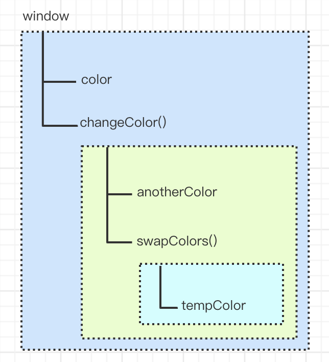

# 执行环境及作用域

## 1. 前言：如何体现函数参数是按值传递的

> `ECMAScript` 中所有函数的参数都是按值传递的。也就是说，把函数外部的值复制给函数内部的参数，就和把值从一个变量复制到另一个变量一样。

这里以引用类型的参数来举例说明：

```javascript
function setName(obj) {
  obj.name = 'Nick';
  obj = new Object();
  obj.name = 'Greg';
}

const person = new Object();
setName(person);
alert(person.name); // Nick
```

如果 person 是按引用传递的，那么 `person` 就会自动被修改为指向其 `name` 属性值为 `Greg` 的新对象。

> 实际上，当在函数内部重写 `obj` 时，这个变量引用的就是一个局部对象了。而这个局部对象会在函数执行完毕后立即被销毁。
> 注：可以把 `ECMAScript` 函数的参数想象成局部变量。

## 2. 基本概念

> `执行环境`（execution context，为简单起见，有时也称为“环境”）是 JavaScript 中最为重要的一个概念。

`执行环境`定义了变量或者函数有权访问的其他数据，决定了它们各自的行为。
每个`执行环境`都有一个与之关联的`变量对象`（variable object），环境中定义的所有变量和函数都保存在这个对象中。
虽然我们编写的代码无法访问到这个对象，但`解析器`在处理数据时会在后台使用它。

`全局执行环境`是`最外围`的一个执行环境。根据 ECMAScript 实现所在的`宿主环境`不同，表示执行环境的对象也不一样。
在 `Web 浏览器`中，全局执行环境被认为是 `window 对象`，因此所有全局变量和函数都是作为 window 对象的属性和方法创建的。
某个执行环境中的所有代码执行完毕后，该环境被销毁，保存在其中的所有变量和函数定义也随之销毁（全局执行环境直到应用程序退出————例如关闭网页或浏览器————时才会被销毁）。

每个函数都有自己的执行环境。当`执行流`进入一个函数时，`函数的环境`就会被推入一个`环境栈`中。
而在函数执行之后，栈将其环境弹出，把`控制权`返回给之前的执行环境。ECMAScript 程序中的执行流正是由这个方便的机制控制着。

当代码在一个环境中执行时，会创建`变量对象`的一个`作用域链`（scope chain）。
作用域链的用途，是保证对执行环境`有权访问`的所有变量和函数的`有序访问`。
作用域链的前端，始终都是`当前执行`的代码所在环境的变量对象。

如果这个环境是`函数`，则将其`活动对象`（activation object）作为`变量对象`。
活动对象在`最开始`时只包含一个变量，即 `arguments 对象`（这个对象在全局环境中是不存在的）。
作用域链中的`下一个变量对象`来自`（外部）环境`，而`再下一个变量对象`则来自`下一个包含环境`。
这样，一直延续到`全局执行环境`；
`全局执行环境`的`变量对象`始终都是`作用域链`中的`最后一个对象`。

`标识符解析`是沿着作用域链一级一级地`搜索标识符`的过程。
搜索过程始终从作用域链的`前端`开始，然后逐级地向后回溯，直至找到标识符为止（如果找不到标识符，通常会导致错误发生）。

> 举个例子说明下：

```javascript
let color = 'blue';

function changeColor() {
  let anotherColor = 'red';

  function swapColors() {
    const tempColor = anotherColor;
    anotherColor = color;
    color = tempColor;

    // 这里可以访问 color、antherColor和tempColor
  }

  // 这里可以访问color和anotherColor，但不能访问tempColor
}
```

> 解析如下：

以上代码共涉及 `3` 个执行环境：`全局环境`、`changeColor()的局部环境` 和 `swepColors()的局部环境`。
`全局环境` 中有一个变量 `color` 和一个函数 `changeColor()`，
`changeColor()的局部环境` 中有 一个名为 `anotherColor` 的变量和 一个名为 `swapColors()` 的函数，但它也可以访问全局环境中的变量 `color`。
`swapColors()的局部环境` 中有一个变量 `tempColor`，该变量只能在这个环境中访问到。
无论全局环境还是 `changeColor()` 的局部环境 都无权访问 `tempColor`。
然而，在 `swapColors()` 内部则可以访问其他两个环境中的所有变量，因为那两个环境是它的父执行环境。

下图形象地展示了前面这个例子的作用域链：



## 3. 查询标识符

当在某个环境中为了读取或写入而引用一个标识符时，必须`通过搜索`来确定该标识符实际代表什么。
搜索过程从`作用域链的前端`开始，`向上逐级査询`与给定名字匹配的标识符。
如果在局部环境中找到了该标识符，搜索过程停止，变量就绪。
如果在局部环境中没有找到该变域名，则继续沿作用域链向上搜索。
搜索过程将一直追溯到`全局环境的变量对象`。
如果在全局环境中也没有找到这个标识符，则意味着该变量尚未声明。

> 变量查询也不是没有代价的。很明显，访冋局部变量要比访问全局变量更快，因为不用向上搜索作用域链。

## 4. 垃圾收集

### 4.1 前言

JavaScript 具有自动垃圾收集机制，也就是说，执行环境会负责管理代码执行过程中使用的内存。
而在 C 和 C++之类的语言中，开发人员的一项基本任务就是手工跟踪内存的使用精况，这是造成许多问题的一个根源。
在编写 JavaScript 程序时，开发人员不用再关心内存使用问题，所需内存的分配以及无用内存的回收完全实现了自动管理。
这种垃圾收集机制的`原理`其实很简单：`找出那些不再继续使用的变量，然后释放其占用的内存。`
为此，`垃圾收集器`会按照`固定的时间间隔`（或代码执行中预定的收集时间）, 周期性地执行这一操作。

> 下面我们来分析一下函数中局部变量的正常生命周期。

`局部变量只在函数执行的过程中存在。`
而在这个过程中，会为局部变量在栈（或堆）内存上分配相应的空间，以便存储它们的值。
然后在函数中使用这些变量，直至函数执行结束。此时，局部变量就没有存在的必要了，因此可以释放它们的内存以供将来使用。
在这种情况下，很容易判断变量是否还有存在的必要；
但并非所有情况下都这么容易就能得出结论。

垃圾收集器必须跟踪哪个变量有用哪个变量没用，对于不再有用的变量打上标记，以备将来收回其占用的内存。
用于标识无用变量的策略可能会因实现而异，但具体到浏览器中的实现，则通常有两个策略：`标记清除` 和 `引用计数`。

> 引用计数已经弃用，这里就简单说下 `标记清除`。

### 4.2 标记清除

`JavaScript` 中最常用的垃圾收集方式是标记清除（mark-and-sweep ）。

当变量进入环境（例如，在函 数中声明一个变量）时，就将这个变量标记为`“进人环境”`。
从逻辑上讲，永远不能释放进入环境的变量所占用的内存，因为只要执行流进入相应的环境，就可能会用到它们。
而当变量离开环境时，则将其 标记为`“离开环境”`。

可以使用任何方式来标记变量。
比如，可以通过翻转某个特殊的位来记录一个变量何时进入环境，或者使用一个“进入环境的”变量列表及一个“离开环境的”变量列表来跟踪哪个变量发生了变化。
说到底，如何标记变量其实并不重要，关键在于釆取什么策略。

`垃圾收集器`在运行的时候会给存储在`内存中的所有变量`都`加上标记`(当然，可以使用任何标记方式)。
然后，它会去掉`环境中的变量`以及`被环境中的变量引用的变量`的标记。

而在此之后再被加上标记的变量将被视为`准备删除的变量`，原因是环境中的变量已经无法访问到这些变量了。
最后，`垃圾收集器`完成内存清除工作，销毁那些带标记的值并回收它们所占用的内存空间。

到 `2008` 年为止，`IE`、`Firefox`、 `Opera`、`Chrome` 和 `Safhri` 的 `JavaScript` 实现使用的都是标记清除式的`垃圾收集策略(或类似的策略)`，只不过垃圾收集的时间间隔互有不同。

### 4.3 性能问题

垃圾收集器是`周期性`运行的，而旦如果为变量分配的内存数量很可观，那么回收工作量也是相当大的。

### 4.4 管理内存

使用具备垃圾收集机制的语言编写程序，开发人员一般不必操心内存管理的问题。
但是，`JavaScript` 在进行内存管理及垃圾收集时面临的问题还是有点与众不同。

其中最主要的一个问题，就是分配给 `Web 浏览器`的可用内存数最通常要比分配给`桌面应用程序`的`少`。
这样做的目的主要是出于安全方面的考虑，目的是防止运行 `JavaScript` 的网页耗尽全部系统内存而导致系统崩溃。

`内存限制问题`不仅会影响`给变量分配内存`，同时还会影响`调用栈`以及`在一个线程中能够同时执行的语句数量`。

因此，确保`占用最少的内存`可以让页面获得`更好的性能`。

而`优化内存占用`的`最佳方式`，就是为执行中的代码`只保存必要的数据`。
一旦数据不再有用，最好通过将其值设置为 null 来释放其引用————这个做法叫做`解除引用(demfferencing)`。
这一做法适用于`大多数全局变量`和`全局对象的属性`。`局部变量`会在它们离开执行环境时`自动被解除引用`。

如下面这个例子所示：

```javascript
function createPerson(name) {
  const localPerson = new Object();
  localPerson.name = name;
  return localPerson;
}

let globalPerson = creacePerson('Nicholas');

// 手工解除 globalPerson 的引用
globalPerson = null;
```

在这个例子中，变量 `globalPerson` 取得了 `createPerson()` 函数 返回的值。
在 `createPerson()` 函数 内部，我们创建了一个对象并将其赋给局部变量 `localPerson`，然后又为该对象添加了一个名为 `name` 的属性。

最后，当调用这个函数时，`localPerson` `以函数值的形式` 返回并赋给全局变量 `globalPerson`，由于 `localPerson` 在 `createPerson` 函数执行完毕后就离开了其执行环境，因此无需我们显式地去为它解除引用。

但是对于全局变量 `globalPerson` 而言，则需要我们在不使用它的 时候手工为它解除引用，这也正是上面例子中最后一行代码的目的。

不过，解除一个值的引用并不意味着自动回收该值所占用的内存。
`解除引用`的`真正作用`是`让值脱离执行环境，以便垃圾收集器下次运行时将其回收`。
