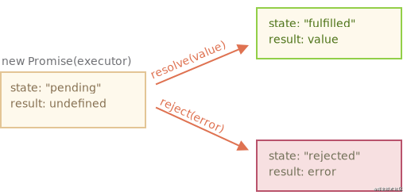
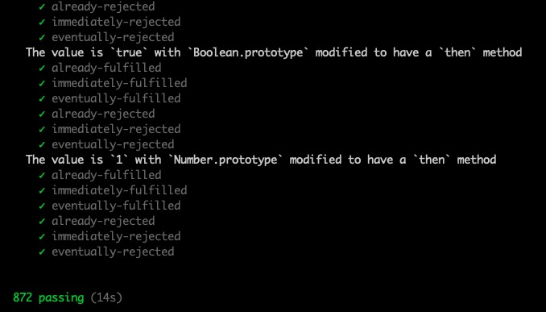

# 按 PromisesA+规范实现一个 Promise (TypeScript版)

## 1. 前言

之前用 `ES6` 实现了一个 `Promise`，[详见这里](./ES6实现.md)。
本次用 `TS` 再实现一个，基本思路是一样的。可以先理解这篇文章后，再看本篇，会更易理解。

`Promise/A+` 规范[详见这里](https://promisesaplus.com/)。

**环境准备**

因为基于 `TS` 开发，浏览器不能直接运行，所以需要有构建环境，配置如下：

```json
// package.json

{
  "scripts": {
    "watch": "tsc -w"
  },
  "dependencies": {},
  "devDependencies": {
    "@types/node": "^15.12.0",
    "typescript": "^3.7.0"
  }
}
```

```json
// tsconfig.json

{
  "compileOnSave": false,
  "compilerOptions": {
    "baseUrl": ".",
    "outDir": "./dist",
    "sourceMap": true,
    "declaration": true,
    "module": "esnext",
    "moduleResolution": "node",
    "target": "es5",
    "allowJs": true,
    "lib": ["es6", "dom", "es2016", "es2017", "es2018", "es2019", "es2020"],
    "paths": {},
    "downlevelIteration": true,
    "typeRoots": ["./node_modules/@types/", "./typings.d.ts"]
  },
  "include": ["src/**/*"],
  "exclude": ["node_modules", "dist", "**/*.spec.ts"],
  "typeAcquisition": {
    "include": []
  }
}
```

实时构建：

```bash
npm run watch
```

## 2. Promise 介绍

### 2.1 Promise 内部状态

`Promise` 的核心思想是 `Promise` 表示异步操作的结果。一个 `Promise` 处于以下三种状态之一：

- `pending` - `Promise` 的初始化状态；
- `fulfilled` - 表示 `Promise` 成功操作的状态；
- `rejected` - 表示 `Promise` 错误操作的状态；

`Promise` 的内部状态改变如图所示：



### 2.2 Promise 的出现解决了什么问题

1. 嵌套地狱的问题

在 `Promise` 没有出现之前，我们会看到很多类似的代码：

```js
const fs = require('node:fs');

const filename = './test.txt';

fs.readFile(filename, 'utf8', (err, data) => {
  if (err) {
    console.error(err);
  }
  else {
    fs.readFile(filename, 'utf8', (err, data) => {
      if (err) {
        console.error(err);
      }
      else {
        fs.readFile(filename, 'utf8', (err, data) => {
          if (err) {
            console.error(err);
          }
          else {
            console.log(data);
          }
        });
      }
    });
  }
});
```

`Promise` 出现之后，就可以采用链式调用的形式来写：

```js
const fs = require('node:fs');

const filename = './test.txt';

function readFile(filename) {
  return new Promise((resolve, reject) => {
    fs.readFile(filename, 'utf8', (err, data) => {
      if (err) {
        reject(err);
      }
      else {
        resolve(data);
      }
    });
  });
}

readFile(filename)
  .then(() => {
    return readFile(filename);
  })
  .then(() => {
    return readFile(filename);
  })
  .then((data) => {
    console.log(data);
  })
  .catch((err) => {
    console.error(err);
  });
```

使用了 `Promise` 之后代码风格变得优雅了很多，写法上也更加直观。

2. 支持多个异步请求并行处理

- `Promise.all` 更加方便的处理多个任务完成时再进行处理的逻辑；
- `Promise.race` 更加方便的处理最早任务完成时再进行处理的逻辑；
- ...

## 3. 根据 Promise/A+ 规范实现 Promise

### 3.1 基本功能实现

在动手写代码之前先了解一下需要实现哪些功能：

1. `Promise constructor`

`new Promise` 时，构造函数需要传入一个 `executor()` 执行器，`executor` 函数会立即执行，并且它支持传入两个参数，分别是 `resolve` 和 `reject`。

```typescript
class Promise<T> {
  constructor(executor: (resolve: (value: T) => void, reject: (reason?: any) => void) => void) {
  }
}
```

2. `Promise` 状态 `「Promise/A+ 2.1」`

`Promise` 必须处于以下三种状态之一：

- `pending（等待中）`，可以转换为 `fulfilled（完成）`或 `rejected（拒绝）`。
- 当状态从 `pending` 切换到 `fulfilled` 时，该状态不得再过渡到其它状态，并且必须具有一个值，该值不能更改。
- 当状态从 `pending` 切换到 rejec`ted 时，该状态不得再过渡到其它状态，并且必须有一个失败的原因，不能更改。

3. `Promise then` 方法 `「Promise/A+ 2.2」`

`Promise` 必须有一个 `then` 方法，`then` 接收两个参数，分别是成功时的回调 `onFulfilled`，和失败时的回调 `onRejected`。

`onFulfilled` 和 `onRejected` 是可选的参数，并且如果传入的 `onFulfilled` 和 `onRejected` 不是函数的话，则必须将其忽略。

如果 `onfulfilled` 是一个函数。则它必须在 `Promise` 的状态变成 `fulfilled（完成）`时才能调用，`Promise` 的值是传进它的第一个参数。
并且它只能被调用一次。

如果 `onRejected` 是一个函数，则它必须在 `Promise` 的状态为 `rejected（失败）`时调用，并把失败的原因传入它的第一个参数。
并且它只能被调用一次。

> 既然知道了需要实现那些功能，那就来动手操作一下，代码如下：

```ts
// 使用枚举定义 Promise 的状态
enum PROMISE_STATUS {
  PENDING,
  FULFILLED,
  REJECTED,
}

class _Promise<T> {
  // 保存当前状态
  private status = PROMISE_STATUS.PENDING;
  // 保存 resolve 的值，或者 reject 的原因
  private value: T;

  constructor(executor: (resolve: (value: T) => void, reject: (reason: any) => void) => void) {
    executor(this._resolve, this._reject);
  }

  // 根据规范完成简易功能的 then 方法
  then(onfulfilled: (value: T) => any, onrejected: (value: any) => any) {
    // 2.2.1
    onfulfilled = typeof onfulfilled === 'function' ? onfulfilled : null;
    onrejected = typeof onrejected === 'function' ? onrejected : null;

    if (this.status === PROMISE_STATUS.FULFILLED) {
      // 状态为 fulfilled 时调用成功的回调函数
      onfulfilled && onfulfilled(this.value);
    }

    if (this.status === PROMISE_STATUS.REJECTED) {
      // 状态为 rejected 时调用失败的回调函数
      onrejected && onrejected(this.value);
    }
  }

  // 传入 executor 方法的第一个参数，调用此方法就是成功
  private _resolve = (value) => {
    if (value === this) {
      throw new TypeError('A promise cannot be resolved with itself.');
    }

    // 只有是 pending 状态才可以更新状态，防止二次调用
    if (this.status !== PROMISE_STATUS.PENDING) { return; }

    this.status = PROMISE_STATUS.FULFILLED;
    this.value = value;
  };

  // 传入 executor 方法的第二个参数，调用此方法就是失败
  private _reject = (value) => {
    // 只有是 pending 状态才可以更新状态，防止二次调用
    if (this.status !== PROMISE_STATUS.PENDING) { return; }

    this.status = PROMISE_STATUS.REJECTED;
    this.value = value;
  };
}

export { _Promise };
```

代码写完了我们测试一下功能：

```html
<!doctype html>
<html lang="en">
  <head>
    <meta charset="UTF-8" />
    <meta http-equiv="X-UA-Compatible" content="IE=edge" />
    <meta name="viewport" content="width=device-width, initial-scale=1.0" />
    <title>Promise测试</title>
  </head>

  <body>
    <script type="module">
      import { _Promise } from "../../dist/example/index1.js";

      const p1 = new _Promise((resolve, reject) => {
        resolve(1);
      });

      p1.then((res) => {
        console.log(res, "then ok 1");
      });

      const p2 = new _Promise((resolve, reject) => {
        setTimeout(() => {
          resolve(2);
        }, 1000);
      });

      p2.then((res) => {
        // 不支持异步
        console.log(res, "then ok 2");
      });
    </script>
  </body>
</html>
```

控制台会打印出：

```
1 "then ok 1"
```

不错，现在已经是稍见雏形。

### 3.2 支持异步操作

我们已经实现了一个入门级的 `Promise`，但是细心的同学应该已经发现了，`then ok 2` 这个值没有打印出来。

导致这个问题出现的原因是什么呢？
原来是我们在执行 `then` 函数的时候，由于是异步操作，状态一直处于 `pending` 的状态，传进来的回调函数没有触发执行。

知道了问题就好解决了。
只需要把传进来的回调函数存储起来，在调用 `resolve` 或 `reject` 方法的时候执行就可以了。
我们优化一下代码：

```ts
class _Promise<T> {
  // ...
  // 保存 then 方法传入的回调函数
  private callbacks = [];
  // ...

  // 根据规范完成简易功能的 then 方法
  then(onfulfilled: (value: T) => any, onrejected: (value: any) => any) {
    // ...

    // 把 then 方法传入的回调函数整合一下
    const handle = () => {
      if (this.status === PROMISE_STATUS.FULFILLED) {
        // 状态为 fulfilled 时调用成功的回调函数
        onfulfilled && onfulfilled(this.value);
      }

      if (this.status === PROMISE_STATUS.REJECTED) {
        // 状态为 rejected 时调用失败的回调函数
        onrejected && onrejected(this.value);
      }
    };

    if (this.status === PROMISE_STATUS.PENDING) {
      // 当状态是 pending 时，把回调函数保存进 callback 里面
      this.callbacks.push(handle);
    }

    handle();
  }
}
```

在来测试一下上面的代码：

```js
const p2 = new _Promise((resolve, reject) => {
  setTimeout(() => {
    resolve(2);
  }, 1000);
});

p2.then((res) => {
  console.log(res, 'then ok 2');
});
```

在等待 1s 后，控制台会打印出：

```
2 "then ok 2"
```

目前已经可以支持异步操作了。

### 3.3 then 方法的链式调用

在文章一开头介绍 `Promise` 时，提到了链式调用的概念 `.then().then()` ，现在就要实现这个至关重要的功能，在开始前先看一下 `Promise/A+` 的规范：

`then` 必须返回一个 `Promise`。`「Promise/A+ 2.2.7」`）

```js
promise2 = promise1.then(onFulfilled, onRejected);
```

如果一个 `onFulfilled` 或 `onRejected` 返回一个值 x，则运行 `Promise Resolution Procedure (会在下面实现这个方法)`。

如果任何一个 `onFulfilled` 或 `onRejected` 引发异常 e 则 `promise2` 必须以 `e` 为其理由 `reject (拒绝)`。
如果 `onFulfilled` 不是函数且 `promise1` 状态已经 `fuifilled（完成）`，则 `promise2` 必须使用与相同的值来实现 `promise1`。
如果 `onRejected` 不是函数而 `promise1` 状态为 `rejected（拒绝）`，则 `promise2` 必须以与相同的理由将其拒绝 `promise1`。

**Promise Resolution Procedure 实现**

首先该方法的使用方式类似于下面这种形式：

```js
// resolvePromise(promise, x, ...)
```

如果 `promise` 和 `x` 引用相同的对象，`promise` 则应该以 `TypeError` 为理由拒绝。`「Promise/A+ 2.3.1」`

如果 `x` 是一个 `promise`，则应该采用它原本的状态返回。`「Promise/A+ 2.3.2」`

否则，判断 `x` 如果是对象或者是函数，则执行以下操作：

先声明 `let then = x.then` ，如果出现异常结果 `e` ，则以 `e` 作为 promise `reject（拒绝）`的原因。
如果 `then` 是个函数，则用 `call` 执行 `then` ，把 `this` 指向为 `x` ，第一个参数用 `resolvePromise` 调用，第二个用 `rejectPromise` 调用。`「Promise/A+ 2.3.3」`
如果 `x` 不是对象或者方法，则使用 `x` 的值 `resolve` 完成。`「Promise/A+ 2.3.4」`

只是通过文字不太容易理解，我们来看一下代码的实现：

```ts
class _Promise<T> {
  // ...

  // 根据规范完成简易功能的 then 方法
  then(onfulfilled: (value: T) => any, onrejected: (value: any) => any) {
    // ...

    const nextPromise = new _Promise((nextResolve, nextReject) => {
      // 把 then 方法传入的回调函数整合一下
      const handle = () => {
        if (this.status === PROMISE_STATUS.FULFILLED) {
          // 状态为 fulfilled 时调用成功的回调函数
          const x = onfulfilled && onfulfilled(this.value);
          this._resolvePromise(nextPromise, x, nextResolve, nextReject);
        }

        if (this.status === PROMISE_STATUS.REJECTED) {
          // 状态为 rejected 时调用失败的回调函数
          if (onrejected) {
            const x = onrejected(this.value);
            this._resolvePromise(nextPromise, x, nextResolve, nextReject);
          }
          else {
            nextReject(this.value);
          }
        }
      };

      if (this.status === PROMISE_STATUS.PENDING) {
        // 当状态是 pending 时，把回调函数保存进 callback 里面
        this.callbacks.push(handle);
      }
      else {
        handle();
      }
    });

    return nextPromise;
  }

  // ...

  private _resolvePromise = <T>(nextPromise: _Promise<T>, x: any, resolve, reject) => {
    // 2.3.1 nextPromise 不能和 x 相等
    if (nextPromise === x) {
      return reject(new TypeError('The promise and the return value are the same'));
    }

    // 2.3.2 如果 x 是 Promise 返回 x 的状态和值
    if (x instanceof _Promise) {
      x.then(resolve, reject);
    }

    // 2.3.3 如果 x 是对象或者函数执行 if 里面的逻辑
    if (typeof x === 'object' || typeof x === 'function') {
      if (x === null) {
        return resolve(x);
      }

      // 2.3.3.1
      let then;
      try {
        then = x.then;
      }
      catch (error) {
        return reject(error);
      }

      // 2.3.3.3
      if (typeof then === 'function') {
        // 声明 called 在调用过一次 resolve 或者 reject 之后，修改为 true ，保证只能调用一次
        let called = false;
        try {
          then.call(
            x,
            (y) => {
              if (called) { return; } // 2.3.3.3.4.1
              called = true;
              // 递归解析的过程（因为可能 promise 中还有 promise）
              this._resolvePromise(nextPromise, y, resolve, reject);
            },
            (r) => {
              if (called) { return; } // 2.3.3.3.4.1
              called = true;
              reject(r);
            }
          );
        }
        catch (e) {
          if (called) { return; } // 2.3.3.3.4.1
          // 2.3.3.3.4
          reject(e);
        }
      }
      else {
        // 2.3.3.4
        resolve(x);
      }
    }
    else {
      // 2.3.4
      resolve(x);
    }
  };
}
```

目前已经实现可以链式调用的功能了，我们来测试一下：

```js
const p3 = new _Promise((resolve, reject) => {
  setTimeout(() => {
    resolve(3);
  }, 1000);
});

p3.then((res) => {
  console.log(res, 'then ok 3.1');
  return '链式调用';
}).then((res) => {
  console.log(res, 'then ok 3.2');
});
```

等待 1s 之后，控制台会打印出：

```
3 "then ok 3.1"
链式调用 then ok 3.2
```

### 3.4 支持微任务

有没有同学想到还缺少了一个尤为重要的功能，那就是微任务。我们应该如何实现和内置 Promise 一样的微任务流程呢？

在 `Web Api` 里面有这样一个方法 `MutationObserver`。我们可以基于它实现微任务的功能。并且也已经有相关的库给我们封装好了这个方法，它就是 asap。只要把需要以微任务执行的函数传入即可。

```js
asap(() => {
  // ...
});
```

其实在 `Web Api` 里面还有这样一个方法 `queueMicrotask` 可以直接使用。使用方式也是把要以微任务执行的函数传入进去即可。

```js
// eslint-disable-next-line no-restricted-globals
self.queueMicrotask(() => {
  // 函数的内容
});
```

`queueMicrotask` 唯一的缺点就是兼容性不太好，在生产环境中建议还是使用 `asap` 这个库来实现微任务。

把之前写好的 `Promise then` 方法稍微做一下调整：

```ts
// ...

class _Promise<T> {
  // ...
  // 根据规范完成 then 方法
  then(onfulfilled: (value: T) => any, onrejected: (value: any) => any) {
    // ...
    const nextPromise = new _Promise((nextResolve, nextReject) => {
      // 把 then 方法传入的回调函数整合一下
      const _handle = () => {
        // ...
      };

      const handle = () => {
        // 支持微任务
        queueMicrotask(_handle);
      };

      // ...
    });
    // ...
  }
  // ...
}
```

```js
console.log('first');
const p1 = new _Promise((resolve) => {
  console.log('second');
  resolve('third');
});
p1.then(console.log);
console.log('fourth');
```

可以看到控制台打印的结果为：

```
first
second
fourth
third
```

> 到这里，我们已经把 `Promise` 最关键的功能完成了：`支持异步操作`，`then 支持链式调用`，`支持微任务`。

## 4. 测试完成的 Promise 是否符合规范

1. `Promise/A+` 规范提供了一个专门的测试脚本 `promises-aplus-tests`：

```bash
npm install -D promises-aplus-tests
```

2. 在我们的代码中加入以下代码：

```ts
;(_Promise as any).deferred = function () {
  const dfd = {} as any;
  dfd.promise = new Promise((resolve, reject) => {
    dfd.resolve = resolve;
    dfd.reject = reject;
  });
  return dfd;
};

module.exports = _Promise;
```

3. 修改 `package.json` 文件增加以下内容（`./dist/index.js` 是需要测试的文件路径）：

```json
// package.json
{
  "scripts": {
    "test": "promises-aplus-tests ./dist/index.js"
  }
}
```

4. 执行 `npm run test`：



可以看到测试用例全部通过。

## 5. Promise 的其它 API 实现

到目前为止，上述代码已经完整的按照 `Promise/A+` 规范实现了，但还有一些内置 Api 没有实现。
下面就把这些内置的方法来实现：

```ts
// ...

class _Promise<T> {
  // ...

  catch(onrejected) {
    return this.then(null, onrejected);
  }

  finally(cb) {
    return this.then(
      value => _Promise.resolve(cb()).then(() => value),
      reason =>
        _Promise.resolve(cb()).then(() => {
          throw reason;
        })
    );
  }

  static resolve(value) {
    if (value instanceof _Promise) {
      return value;
    }

    return new _Promise((resolve) => {
      resolve(value);
    });
  }

  static reject(reason) {
    return new _Promise((resolve, reject) => {
      reject(reason);
    });
  }

  static race(promises) {
    return new _Promise((resolve, reject) => {
      if (!Array.isArray(promises)) {
        return reject(new TypeError('Promise.race accepts an array'));
      }
      for (let i = 0, len = promises.length; i < len; i++) {
        _Promise.resolve(promises[i]).then(resolve, reject);
      }
    });
  }

  static all(promises) {
    const result = [];
    let i = 0;

    return new _Promise((resolve, reject) => {
      const processValue = (index, value) => {
        result[index] = value;
        i++;
        if (i === promises.length) {
          resolve(result);
        }
      };
      for (let index = 0; index < promises.length; index++) {
        promises[index].then((value) => {
          processValue(index, value);
        }, reject);
      }
    });
  }

  static allSettled(promises) {
    const result = [];
    let i = 0;
    return new _Promise((resolve, reject) => {
      const processValue = (index, value, status: 'fulfilled' | 'rejected') => {
        result[index] = { status, value };
        i++;
        if (i === promises.length) {
          resolve(result);
        }
      };

      for (let index = 0; index < promises.length; index++) {
        promises[index].then(
          (value) => {
            processValue(index, value, 'fulfilled');
          },
          (value) => {
            processValue(index, value, 'rejected');
          }
        );
      }
    });
  }
}
```

## 6. 参考

- [手写 Promise，完美实现 Promise/A+规范](https://juejin.cn/post/6965432333038321701)
- [Promises/A+](https://promisesaplus.com/)
- [MutationObserver](https://developer.mozilla.org/zh-CN/docs/Web/API/MutationObserver)
- [queueMicrotask](https://developer.mozilla.org/zh-CN/docs/Web/API/WindowOrWorkerGlobalScope/queueMicrotask)
- [asap](https://github.com/kriskowal/asap)
- [co](https://github.com/tj/co)
