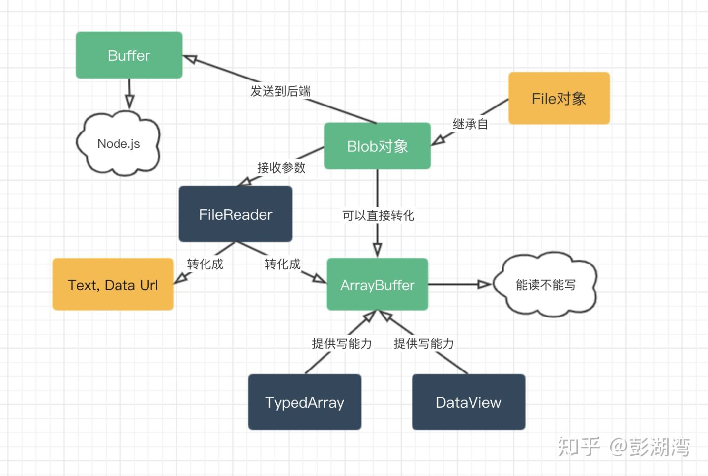
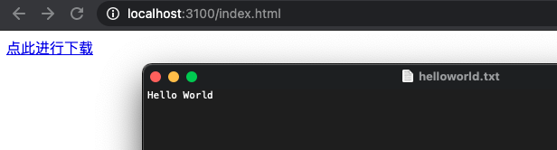
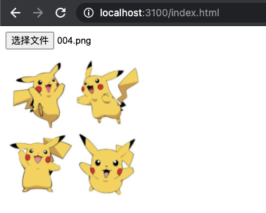
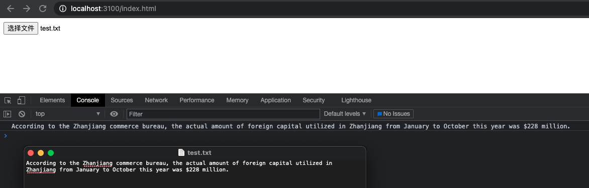
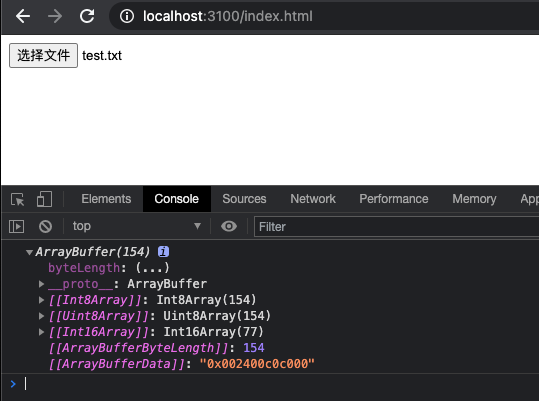
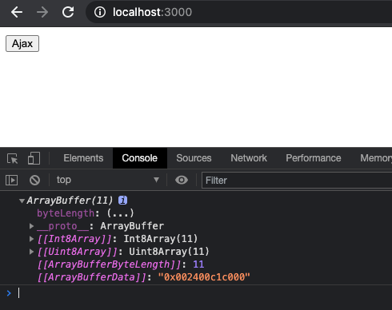
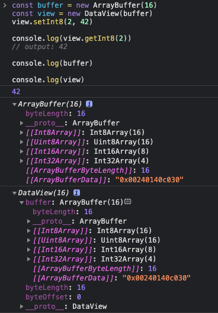
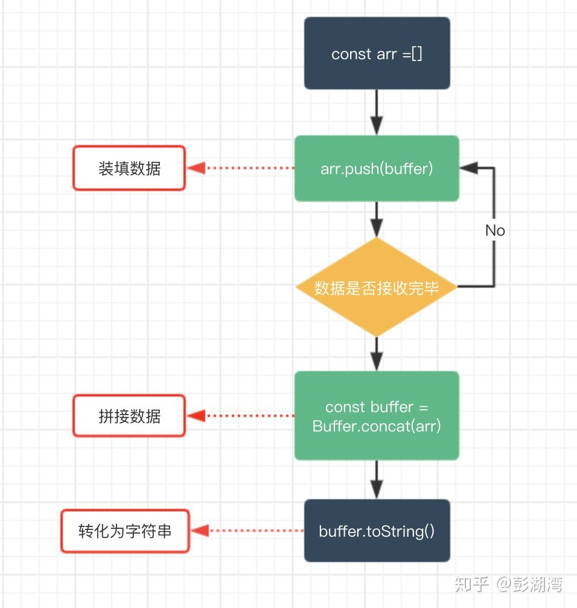

# JS 的二进制家族: Blob、ArrayBuffer 和 Buffer

前端较少涉及对二进制数据的处理，但即便如此，我们偶尔总能在角落里看见它们的身影，今天我们就来聊一聊 `JS` 的二进制家族：`Blob`、`ArrayBuffer` 和 `Buffer（Buffer 由 Node.js 提供）`。

## 1. 概述

- `Blob`: 前端的一个专门用于支持文件操作的二进制对象；
- `ArrayBuffer`: 前端的一个通用的二进制缓冲区，类似数组，但在 API 和特性上却有诸多不同；
- `Buffer`: Node.js 提供的一个二进制缓冲区，常用来处理 I/O 操作；

三者之间的关系是怎样的呢？见下图：



下面就来一一介绍。

## 2. Blob

### 2.1 Blob 介绍

我们首先来介绍 `Blob`，`Blob` 是用来支持文件操作的。
简单的说：在 `JS` 中，有两个构造函数 `File` 和 `Blob`, 而 `File` 继承了所有 `Blob` 的属性。

所以在我们看来，`File` 对象可以看作一种特殊的 `Blob` 对象。

在前端工程中，我们在哪些操作中可以获得 `File` 对象呢？

- `<input />` 标签上选择的文件；
- 拖拽中生成的 `DataTransfer` 对象；

> 注：目前 `File API` 规范的状态为 `Working Draft`。

我们上面说了，`File` 对象是一种特殊的 `Blob` 对象，那么它自然就可以直接调用 `Blob` 对象的方法。
让我们看一看 `Blob` 具体有哪些方法，以及能够用它们实现哪些功能。

- 文件下载：

  通过 `URL.createObjectURL(blob)` 生成 `Blob URL`，赋给 `a.download` 属性。

- 图片显示：

  通过 `URL.createObjectURL(blob)` 生成 `Blob URL`，赋给 `img.src` 属性。

- 资源分段上传：

  通过 `blob.slice` 可以分割二进制数据为子 `Blob` 上传。

- 本地读取文件：

  `FileReader` 的 `API` 可以将 `Blob` 或 `File` 转化为 文本/ArrayBuffer/Data URL 等类型。

### 2.2 Blob 实战

通过 `window.URL.createObjectURL` 方法可以把一个 `blob` 转化为一个 `Blob URL`，并且用做文件下载或者图片显示的链接。

`Blob URL` 所实现的下载或者显示等功能，仅仅可以在单个浏览器内部进行。而不能在服务器上进行存储，亦或者说它没有在服务器端存储的意义。

下面是一个 `Blob` 的例子，可以看到它很短：

```js
const blob = new Blob(['Hello World']);
const url = window.URL.createObjectURL(blob);
console.log(url); // blob:[当前访问url地址]/10b5ad90-8e49-4fd2-8d50-dbbea063a7c6
```

和冗长的 `Base64` 格式的 `Data URL` 相比，`Blob URL` 的长度显然不能够存储足够的信息，这也就意味着它只是类似于一个浏览器内部的“引用“。、从这个角度看，`Blob URL` 是一个浏览器自行制定的一个伪协议。

#### 2.2.1 Blob 实现下载文件

我们可以通过 `window.URL.createObjectURL`，接收一个 `Blob（File）`对象，将其转化为 `Blob URL`，
然后赋给 `a.download` 属性，然后在页面上点击这个链接就可以实现下载了。

```bash
npm install -D http-server
```

```html
<!-- index.html -->

<!doctype html>
<html lang="zh-cn">
  <head>
    <meta charset="UTF-8" />
    <meta http-equiv="X-UA-Compatible" content="IE=edge" />
    <meta name="viewport" content="width=device-width, initial-scale=1.0" />
    <title>Blob 实现下载文件</title>
  </head>
  <body>
    <!-- html部分 -->
    <a id="h">点此进行下载</a>

    <!-- js部分 -->
    <script>
      var blob = new Blob(["Hello World"]);
      var url = window.URL.createObjectURL(blob);
      var a = document.getElementById("h");

      a.download = "helloworld.txt";
      a.href = url;
    </script>
  </body>
</html>
```

启动一个本地静态资源服务：

```bash
npx http-server -p 3100 -c-1
```

看下运行结果：



#### 2.2.2 Blob 实现图片本地显示

`window.URL.createObjectURL` 生成的 `Blob URL` 还可以赋给 `img.src`，从而实现图片的显示。

```html
<!-- index.html -->

<!doctype html>
<html lang="zh-cn">
  <head>
    <meta charset="UTF-8" />
    <meta http-equiv="X-UA-Compatible" content="IE=edge" />
    <meta name="viewport" content="width=device-width, initial-scale=1.0" />
    <title>Blob 实现下载文件</title>
  </head>
  <body>
    <!-- html部分 -->
    <input type="file" id="f" />
    <div style="margin-top: 10px"></div>
    

    <!-- js部分 -->
    <script>
      document.getElementById("f").addEventListener(
        "change",
        function (e) {
          var file = this.files[0];
          const img = document.getElementById("img");
          const url = window.URL.createObjectURL(file);

          img.src = url;
          img.onload = function () {
            // 释放一个之前通过调用 URL.createObjectURL创建的 URL 对象
            window.URL.revokeObjectURL(url);
          };
        },
        false,
      );
    </script>
  </body>
</html>
```

启动一个本地静态资源服务：

```bash
npx http-server -p 3100 -c-1
```

看下运行结果：



#### 2.2.3 Blob 实现文件分片上传

- 通过 `Blob.slice(start, end)` 可以分割大 `Blob` 为多个小 `Blob`；
- `xhr.send` 是可以直接发送 `Blob` 对象的；

```json
// package.json

{
  "scripts": {
    "start": "npx nodemon server.js"
  },
  "dependencies": {
    "koa": "^2.13.1",
    "koa-static": "^5.0.0"
  },
  "devDependencies": {
    "nodemon": "^2.0.7"
  }
}
```

```html
<!-- public/index.html -->

<!doctype html>
<html lang="zh-cn">
  <head>
    <meta charset="UTF-8" />
    <meta http-equiv="X-UA-Compatible" content="IE=edge" />
    <meta name="viewport" content="width=device-width, initial-scale=1.0" />
    <title>Blob 实现文件分片上传</title>
  </head>
  <body>
    <!-- html部分 -->
    <input type="file" id="f" />

    <!-- js部分 -->
    <script>
      function upload(blob) {
        var xhr = new XMLHttpRequest();
        xhr.open("POST", "/ajax", true);
        xhr.setRequestHeader("Content-Type", "text/plain");
        xhr.send(blob);
      }

      document.getElementById("f").addEventListener(
        "change",
        function (e) {
          var blob = this.files[0];
          const CHUNK_SIZE = 20;
          const SIZE = blob.size;
          var start = 0;
          var end = CHUNK_SIZE;

          while (start < SIZE) {
            upload(blob.slice(start, end));
            start = end;
            end = start + CHUNK_SIZE;
          }
        },
        false,
      );
    </script>
  </body>
</html>
```

```js
// server.js

const path = require('node:path');
const Buffer = require('node:buffer').Buffer;

const Koa = require('koa');
const koaStatic = require('koa-static');

const app = new Koa();

app.use(
  // 使用静态资源中间件
  koaStatic(path.join(__dirname, '/public'))
);

function parse(req) {
  return new Promise((resolve, reject) => {
    const chunks = [];

    req.on('data', (buf) => {
      chunks.push(buf);
      console.log(buf);
    });
    req.on('end', () => {
      const buffer = Buffer.concat(chunks);
      resolve(buffer.toString());
    });
  });
}

app.use(async (ctx, next) => {
  await next();

  if (ctx.path === '/ajax') {
    const req = ctx.req;

    const body = await parse(req);
    ctx.status = 200;

    console.log(body);
    console.log('---------------');
  }
});

app.listen(3000, () => {
  console.log('app starting at port 3000');
});
```

文件内容：

```
According to the Zhanjiang commerce bureau, the actual amount of foreign capital utilized in Zhanjiang from January to October this year was $228 million.
```

启动服务：

```bash
npm start
```

运行效果：

```bash
# app starting at port 3000

# <Buffer 41 63 63 6f 72 64 69 6e 67 20 74 6f 20 74 68 65 20 5a 68 61>
# According to the Zha
# ---------------
# <Buffer 6e 6a 69 61 6e 67 20 63 6f 6d 6d 65 72 63 65 20 62 75 72 65>
# njiang commerce bure
# ---------------
# <Buffer 61 75 2c 20 74 68 65 20 61 63 74 75 61 6c 20 61 6d 6f 75 6e>
# au, the actual amoun
# ---------------
# <Buffer 74 20 6f 66 20 66 6f 72 65 69 67 6e 20 63 61 70 69 74 61 6c>
# t of foreign capital
# ---------------
# <Buffer 20 75 74 69 6c 69 7a 65 64 20 69 6e 20 5a 68 61 6e 6a 69 61>
#  utilized in Zhanjia
# ---------------
# <Buffer 6e 67 20 66 72 6f 6d 20 4a 61 6e 75 61 72 79 20 74 6f 20 4f>
# ng from January to O
# ---------------
# <Buffer 63 74 6f 62 65 72 20 74 68 69 73 20 79 65 61 72 20 77 61 73>
# ctober this year was
# ---------------
# <Buffer 20 24 32 32 38 20 6d 69 6c 6c 69 6f 6e 2e>
#  $228 million.
# ---------------
```

#### 2.2.4 Blob 本地读取文件内容

如果想要读取 Blob 或者文件对象并转化为其他格式的数据，可以借助 FileReader 对象的 API 进行操作：

- `FileReader.readAsText(Blob)`: 将 `Blob` 转化为文本字符串；
- `FileReader.readAsArrayBuffer(Blob)`: 将 `Blob` 转为 `ArrayBuffer` 格式数据；
- `FileReader.readAsDataURL()`: 将 `Blob` 转化为 `Base64` 格式的 `Data URL`；

下面我们尝试把一个文件的内容通过字符串的方式读取出来：

```html
<!doctype html>
<html lang="zh-cn">
  <head>
    <meta charset="UTF-8" />
    <meta http-equiv="X-UA-Compatible" content="IE=edge" />
    <meta name="viewport" content="width=device-width, initial-scale=1.0" />
    <title>Blob 本地读取文件内容</title>
  </head>
  <body>
    <!-- html部分 -->
    <input type="file" id="f" />

    <!-- js部分 -->
    <script>
      document.getElementById("f").addEventListener(
        "change",
        function (e) {
          var file = this.files[0];
          const reader = new FileReader();

          reader.onload = function () {
            const content = reader.result;
            console.log(content);
          };
          reader.readAsText(file);
        },
        false,
      );
    </script>
  </body>
</html>
```

启动服务：

```bash
npx http-server -p 3100 -c-1
```

运行结果：



**总结**

上面介绍了 `Blob` 的用法，我们不难发现，`Blob` 是针对文件的，或者可以说它就是一个文件对象。
同时呢我们发现 `Blob` 欠缺对二进制数据的细节操作能力，比如如果如果要具体修改某一部分的二进制数据，`Blob` 显然就不够用了。
而这种细粒度的功能则可以由下面介绍的 `ArrayBuffer` 来完成。

## 3 ArrayBuffer

### 3.1 ArrayBuffer 介绍

`ArrayBuffer` 的大体`功能`：

- 读取

  通过 `FileReader` 将文件转化为 ArrayBuffer 数据。

- 写入

  - 通过 `TypeArray` 对象进行操作；
  - 通过 `DataView` 对象进行操作；

`ArrayBuffer` 跟 `JS` 的原生数组的`区别`：

- `ArrayBuffer` 初始化后固定大小，数组可以自由增减；
- 数组放在堆中，`ArrayBuffer` 把数组放在栈中；
- `ArrayBuffer` 没有 `push/pop` 等数组的方法；
- `ArrayBuffer` 只能读不能写，写要借助 `TypeArray/DataView`；

### 3.2 ArrayBuffer 实战

#### 3.2.1 通过 ArrayBuffer 的格式读取本地数据

```html
<!doctype html>
<html lang="zh-cn">
  <head>
    <meta charset="UTF-8" />
    <meta http-equiv="X-UA-Compatible" content="IE=edge" />
    <meta name="viewport" content="width=device-width, initial-scale=1.0" />
    <title>ArrayBuffer 的格式读取本地数据</title>
  </head>
  <body>
    <!-- html部分 -->
    <input type="file" id="f" />

    <!-- js部分 -->
    <script>
      document.getElementById("f").addEventListener(
        "change",
        function (e) {
          const file = this.files[0];
          const fileReader = new FileReader();

          fileReader.onload = function () {
            const result = fileReader.result;
            console.log(result);
          };
          fileReader.readAsArrayBuffer(file);
        },
        false,
      );
    </script>
  </body>
</html>
```

启动服务：

```bash
npx http-server -p 3100 -c-1
```

运行结果：



#### 3.2.2 通过 ArrayBuffer 的格式读取 Ajax 请求数据

- 通过 `xhr.responseType = "arraybuffer"` 指定响应的数据类型；
- 在 `onload` 回调里打印 `xhr.response`；

```json
// package.json

{
  "scripts": {
    "start": "npx nodemon server.js"
  },
  "dependencies": {
    "koa": "^2.13.1",
    "koa-static": "^5.0.0"
  },
  "devDependencies": {
    "nodemon": "^2.0.7"
  }
}
```

```html
<!-- public/index.html -->

<!doctype html>
<html lang="zh-cn">
  <head>
    <meta charset="UTF-8" />
    <meta http-equiv="X-UA-Compatible" content="IE=edge" />
    <meta name="viewport" content="width=device-width, initial-scale=1.0" />
    <title>ArrayBuffer 的格式读取 Ajax 请求数据</title>
  </head>
  <body>
    <!-- html部分 -->
    <button id="btn">Ajax</button>

    <!-- js部分 -->
    <script>
      function ajax() {
        var xhr = new XMLHttpRequest();
        xhr.open("GET", "/ajax", true);
        xhr.responseType = "arraybuffer";

        xhr.onload = function () {
          console.log(xhr.response);
        };
        xhr.send();
      }

      document.getElementById("btn").addEventListener(
        "click",
        function (e) {
          ajax();
        },
        false,
      );
    </script>
  </body>
</html>
```

```js
// server.js

const path = require('node:path');

const Koa = require('koa');
const koaStatic = require('koa-static');

const app = new Koa();

app.use(
  // 使用静态资源中间件
  koaStatic(path.join(__dirname, '/public'))
);

app.use(async (ctx, next) => {
  await next();

  if (ctx.path === '/ajax') {
    ctx.body = 'hello world';
    ctx.status = 200;
  }
});

app.listen(3000, () => {
  console.log('app starting at port 3000');
});
```

启动服务：

```bash
npm start
```

运行结果：



#### 3.2.3 通过 TypeArray 对 ArrayBuffer 进行写操作

```js
const typedArray1 = new Int8Array(8);
typedArray1[0] = 32;

const typedArray2 = new Int8Array(typedArray1);
typedArray2[1] = 42;

console.log(typedArray1);
// output: Int8Array(8) [32, 0, 0, 0, 0, 0, 0, 0]

console.log(typedArray2);
// output: Int8Array(8) [32, 42, 0, 0, 0, 0, 0, 0]
```

#### 3.2.4 通过 DataView 对 ArrayBuffer 进行写操作

```js
const buffer = new ArrayBuffer(16);
const view = new DataView(buffer);
view.setInt8(2, 42);

console.log(view.getInt8(2));
// output: 42

console.log(buffer);

console.log(view);
```

运行结果：



## 4. Buffer

### 4.1 Buffer 介绍

`Buffer` 是 `Node.js` 提供的对象，浏览器没有。
它一般应用于 `IO` 操作，例如接收前端请求数据时候，可以通过以下的 `Buffer` 的 `API` 对接收到的前端数据进行整合。



### 4.2 Buffer 实战

```html
<!-- public/index.html -->

<!doctype html>
<html lang="zh-cn">
  <head>
    <meta charset="UTF-8" />
    <meta http-equiv="X-UA-Compatible" content="IE=edge" />
    <meta name="viewport" content="width=device-width, initial-scale=1.0" />
    <title>Buffer请求数据整合</title>
  </head>
  <body>
    <!-- html部分 -->
    <button id="btn">Ajax</button>

    <!-- js部分 -->
    <script>
      function ajax() {
        const xhr = new XMLHttpRequest();
        xhr.open("POST", "ajax", true);
        xhr.setRequestHeader("Content-Type", "text/plain");

        xhr.send("Hello World!");
      }

      document.getElementById("btn").addEventListener(
        "click",
        function (e) {
          ajax();
        },
        false,
      );
    </script>
  </body>
</html>
```

```js
// server.js

const path = require('node:path');
const Buffer = require('node:buffer').Buffer;

const Koa = require('koa');
const koaStatic = require('koa-static');

const app = new Koa();

app.use(
  // 使用静态资源中间件
  koaStatic(path.join(__dirname, '/public'))
);

function parse(req) {
  return new Promise((resolve, reject) => {
    const chunks = [];

    req.on('data', (buf) => {
      chunks.push(buf);
    });
    req.on('end', () => {
      const buffer = Buffer.concat(chunks);
      resolve(buffer.toString());
    });
  });
}

app.use(async (ctx, next) => {
  await next();

  if (ctx.path === '/ajax') {
    const req = ctx.req;

    const body = await parse(req);
    ctx.status = 200;

    console.log(body);
  }
});

app.listen(3000, () => {
  console.log('app starting at port 3000');
});
```

启动服务命令同上，看下运行结果：

```bash
npm start
# app starting at port 3000

# Hello World!
```

## 5. 参考

- [聊聊 JS 的二进制家族：Blob、ArrayBuffer 和 Buffer](https://zhuanlan.zhihu.com/p/97768916)
