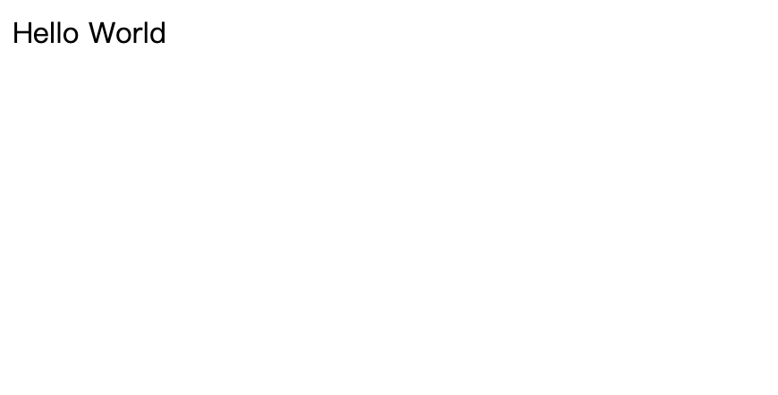
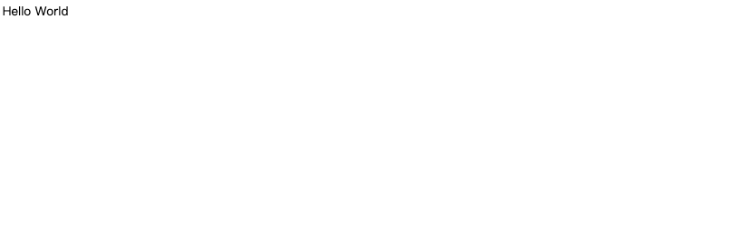
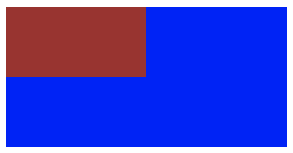
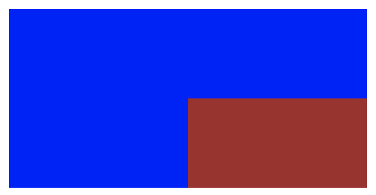
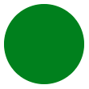
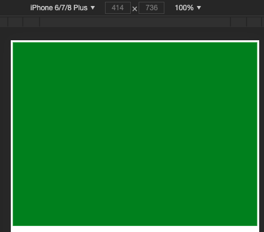
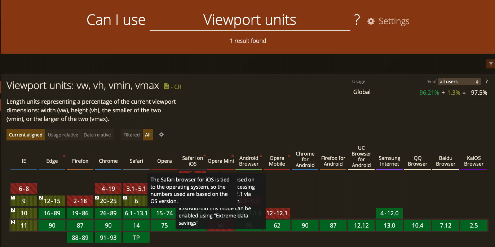

# 响应式布局的常用解决方案对比及实践（媒体查询、百分比、rem 和 vw/vh）

简要介绍：

> 前端开发中，静态网页通常需要适应不同分辨率的设备，常用的自适应解决方案包括`媒体查询`、`百分比`、`rem` 和 `vw/vh` 等。
> 我们先从 `px` 单位出发，分析 `px` 在`移动端布局`中的`不足`，接着介绍了几种不同的`自适应`解决方案。

我们从以下几点逐序介绍：

- `px` 和视口
- 媒体查询
- 百分比
- 自适应场景下的 `rem` 解决方案
- 通过 `vw/vh` 来实现自适应

## 一、px 和视口

在静态网页中，我们经常用`像素（px）`作为单位，来描述一个元素的宽高以及定位信息。
在 `pc` 端，通常认为 `css` 中, `1px` 所表示的真实长度是固定的。

> 那么，`px` 真的是一个设备无关，跟长度单位米和分米一样是固定大小的吗？

答案是否定的，下面两图 分别表示 `pc` 端下和移动端下的显示结果，在网页中我们设置的 `font-size` 统一为 `16px`。

代码如下：

```html
<!-- index.html -->
<!doctype html>
<html lang="zh-CN">
  <head>
    <title>Hello World</title>
    <style type="text/css">
      * {
        font-size: 16px;
      }
    </style>
  </head>
  <body>
    <div>Hello World</div>
  </body>
</html>
```

看下效果：

PC 端效果：


移动端效果：


从上面两幅图的对比可以看出，字体都是 `16px`，显然在 `pc` 端中文字正常显示，而在移动端文字很小，几乎看不到，说明在 `css` 中 `1px` 并不是固定大小，直观上我们发现在移动端 `1px` 所表示的长度较小，所以导致文字显示不清楚。

> 那么 `css` 中的 `1px` 的真实长度到底由什么决定呢？
> 为了理清楚这个概念我们首先介绍像素和视口的概念。

### 1.1 像素

像素是`网页布局`的`基础`，`一个像素`表示了`计算机屏幕`所能显示的`最小区域`，像素分为两种类型：`css 像素`和`物理像素`。

我们在 js 或者 css 代码中使用的 `px 单位`就是指的是 `css 像素`，`物理像素`也称`设备像素`，只与`设备`或者说`硬件`有关，同样尺寸的屏幕，设备的`密度`越高，`物理像素`也就越多。

下表表示 `css` 像素和物理像素的具体区别：

| 像素类型   | 描述                                                 |
| ---------- | ---------------------------------------------------- |
| `css` 像素 | 为 `web` 开发者提供，在 `css` 中使用的一个抽象单位   |
| 物理像素   | 只与设备的硬件密度有关，任何设备的物理像素都是固定的 |

> 那么 `css` 像素与物理像素的转换关系是怎么样的呢？为了明确 `css 像素`和`物理像素`的`转换关系`，必须先了解`视口`是什么。

### 1.2 视口

`广义的视口`，是指浏览器显示内容的`屏幕区域`，`狭义的视口`包括了`布局视口`、`视觉视口`和`理想视口`。

#### 1.2.1 布局视口（layout viewport）

布局视口定义了 `pc 网页`在`移动端`的`默认布局行为`，因为通常 pc 的分辨率`较大`，`布局视口`默认为 `980px`。
也就是说在`不设置`网页的 `viewport` 的情况下，pc 端的网页`默认`会以`布局视口`为基准，在移动端进行展示。
因此我们可以明显看出来，默认为布局视口时，根植于 pc 端的网页在移动端展示很模糊。

#### 1.2.2 视觉视口（visual viewport）

视觉视口表示`浏览器内`看到的`网站的显示区域`，用户可以`通过缩放`来查看网页的`显示内容`，从而`改变视觉视口`。
视觉视口的定义，就像拿着一个`放大镜`分别从`不同距离`观察`同一个物体`，视觉视口仅仅类似于`放大镜中显示的内容`，因此视觉视口`不会`影响`布局视口`的`宽度和高度`。

#### 1.2.3 理想视口（ideal viewport）

理想视口或者应该全称为`“理想的布局视口”`，在`移动设备`中就是指`设备的分辨率`。
换句话说，`理想视口或者说分辨率`就是`给定设备物理像素`的情况下，`最佳的“布局视口”`。

> 上述视口中，最重要的是要明确`理想视口的概念`，在`移动端`中，理想视口或者说分辨率跟物理像素之间有什么关系呢？

#### 1.2.4 理想视口跟物理像素之间有什么关系呢？

为了理清`分辨率`和`物理像素`之间的联系，我们介绍一个用 `DPR（Device pixel ratio）设备像素比`来表示，则可以写成：

```
1 DPR = 物理像素／分辨率
```

在不缩放的情况下，`一个 css 像素`就对应`一个 dpr`，也就是说：

```
1 CSS像素 = 物理像素／分辨率
```

此外，在`移动端`的布局中，我们可以通过 `viewport 元标签`来控制布局，比如一般情况下，我们可以通过下述标签使得移动端在`理想视口`下布局：

```html
<meta
  id="viewport"
  name="viewport"
  content="width=device-width, initial-scale=1.0, maximum-scale=1, user-scalable=no"
/>
```

上述 meta 标签的每一个属性的详细介绍如下：

| 属性名        | 取值    | 描述                                     |
| ------------- | ------- | ---------------------------------------- |
| width         | 正整数  | 定义布局视口的宽度，单位为像素           |
| height        | 正整数  | 定义布局视口的高度，单位为像素，很少使用 |
| initial-scale | [0,10]  | 初始缩放比例，1 表示不缩放               |
| minimum-scale | [0,10]  | 最小缩放比例                             |
| maximum-scale | [0,10]  | 最大缩放比例                             |
| user-scalable | yes／no | 是否允许手动缩放页面，默认值为 yes       |

其中我们来看 width 属性，在移动端布局时，在 meta 标签中我们会将 width 设置称为 device-width。
`device-width` 一般是表示`分辨率的宽`，通过 width=device-width 的设置我们就将`布局视口`设置成了`理想的视口`。

#### 1.2.5 px 与自适应

上述我们了解到了当通过`viewport元标签`，设置布局视口为`理想视口`时，`1个css像素`可以表示成：

```
1 CSS像素 = 物理像素／分辨率
```

我们知道，在`pc端`的`布局视口`通常情况下为`980px`，`移动端`以`iphone6`为例，分辨率为`375 * 667`，也就是说布局视口在理想的情况下为 375px。
比如现在我们有一个 `750px * 1134px` 的`视觉稿`，那么在 pc 端，一个 css 像素可以如下计算：

```
PC端： 1 CSS像素 = 物理像素／分辨率 = 750 ／ 980 =0.76 px
```

而在 iphone6 下：

```
iphone6：1 CSS像素 = 物理像素 ／分辨率 = 750 ／ 375 = 2 px
```

也就是说在 PC 端，`一个 CSS 像素`可以用 `0.76 个物理像素`来表示，而 iphone6 中 一个 CSS 像素表示了 `2 个物理像素`。
此外不同的移动设备分辨率不同，也就是 1 个 CSS 像素`可以表示的物理像素`是`不同的`，因此如果在 css 中仅仅通过 px 作为长度和宽度的单位，造成的结果就是无法通过一套样式，实现各端的自适应。

## 二、媒体查询

在前面我们说到，不同端的设备下，在 css 文件中，`1px` 所表示的`物理像素的大小`是`不同的`，因此通过一套样式，是无法实现各端的自适应。
由此我们联想：

> 如果一套样式不行，那么能否给每一种设备各一套不同的样式来实现自适应的效果？

答案是肯定的。

使用 `@media 媒体查询`可以针对`不同的媒体类型`定义`不同的样式`，特别是响应式页面，可以针对不同屏幕的大小，编写多套样式，从而达到自适应的效果。
举例来说：

```css
@media screen and (max-width: 960px) {
  body {
    background-color: #ff6699;
  }
}

@media screen and (max-width: 768px) {
  body {
    background-color: #00ff66;
  }
}

@media screen and (max-width: 550px) {
  body {
    background-color: #6633ff;
  }
}

@media screen and (max-width: 320px) {
  body {
    background-color: #ffff00;
  }
}
```

上述的代码通过媒体查询定义了几套样式，通过 `max-width` 设置样式生效时的`最大分辨率`，上述的代码分别对分辨率在 0 ～ 320px，320px ～ 550px，550px ～ 768px 以及 768px ～ 960px 的屏幕设置了不同的背景颜色。

通过媒体查询，可以通过给`不同分辨率`的设备编写`不同的样式`来实现`响应式的布局`，比如我们为不同分辨率的屏幕，设置不同的背景图片。比如给小屏幕手机设置@2x 图，为大屏幕手机设置@3x 图，通过媒体查询就能很方便的实现。

但是媒体查询的缺点也很明显，如果在浏览器大小改变时，需要改变的样式太多，那么多套样式代码会很繁琐。

## 三、百分比

除了用 px 结合媒体查询实现响应式布局外，我们也可以通过`百分比单位` `%` 来实现响应式的效果。

比如当浏览器的宽度或者高度发生变化时，通过百分比单位，通过百分比单位可以使得浏览器中的组件的宽和高随着浏览器的变化而变化，从而实现响应式的效果。

为了了解`百分比布局`，首先要了解的问题是：

> css 中的`子元素`中的百分比（%）到底是`谁的百分比`？

`直观的理解`，我们可能会认为`子元素的百分比`完全相对于`直接父元素`，height 百分比相对于 height，width 百分比相对于 width。
当然这种理解是正确的，但是根据 css 的盒式模型，除了 height、width 属性外，还具有 padding、border、margin 等等属性。
那么这些属性设置成百分比，是根据父元素的那些属性呢？
此外还有 border-radius 和 translate 等属性中的百分比，又是相对于什么呢？

下面来具体分析。

### 3.1 百分比的具体分析

#### 3.1.1 子元素 height 和 width 的百分比

子元素的 height 或 width 中使用百分比，是相对于子元素的`直接父元素`，width 相对于父元素的 width，height 相对于父元素的 height。比如：

```html
<!doctype html>
<html lang="zh-CN">
  <head>
    <title>Hello World</title>
    <style type="text/css">
      .parent {
        background-color: blue;
        width: 200px;
        height: 100px;
      }
      .child {
        background-color: brown;
        width: 50%;
        height: 50%;
      }
    </style>
  </head>
  <body>
    <div class="parent">
      <div class="child"></div>
    </div>
  </body>
</html>
```

展示的效果为：



#### 3.1.2 top 和 bottom 、left 和 right

> 注：`子元素本身`需要`非 static 定位`才会生效。

子元素的 top 和 bottom 如果设置百分比，则相对于`直接非 static 定位(默认定位)的父元素`的高度，
同样，
子元素的 left 和 right 如果设置百分比，则相对于`直接非 static 定位(默认定位的)父元素`的宽度。

```html
<!doctype html>
<html lang="zh-CN">
  <head>
    <title>Hello World</title>
    <style type="text/css">
      .parent {
        background-color: blue;
        width: 200px;
        height: 100px;

        position: relative;
      }
      .child {
        background-color: brown;
        width: 50%;
        height: 50%;

        position: relative;
        top: 50%;
        left: 50%;
      }
    </style>
  </head>
  <body>
    <div class="parent">
      <div class="child"></div>
    </div>
  </body>
</html>
```

展示的效果为：



#### 3.1.3 padding

子元素的 padding 如果设置百分比，不论是垂直方向或者是水平方向，都相对于`直接父亲元素的 width`，而与父元素的 height 无关。

举例来说：

```html
<!doctype html>
<html lang="zh-CN">
  <head>
    <title>Hello World</title>
    <style type="text/css">
      .parent {
        background-color: green;
        width: 200px;
      }
      .child {
        background-color: blue;
        width: 0;
        height: 0;

        padding-left: 50%;
        padding-top: 50%;
      }
    </style>
  </head>
  <body>
    <div class="parent">
      <div class="child"></div>
    </div>
  </body>
</html>
```

展示的效果为：


子元素的初始宽高为 0，通过 padding 可以将子元素撑大，同时也将父元素的高度撑大。
上图的蓝色部分是一个正方形，且边长为 100px，说明 padding 不论宽高，如果设置成百分比都相对于`父元素的 width`。

#### 3.1.4 margin

`跟 padding 一样`，margin 也是如此，子元素的 margin 如果设置成百分比，不论是垂直方向还是水平方向，都相对于`直接父元素的 width`。
这里就不具体举例。

#### 3.1.5 border-radius

border-radius 不一样，如果设置 border-radius 为百分比，则是相对于`自身的宽度`，举例来说：

```html
<!doctype html>
<html lang="zh-CN">
  <head>
    <title>Hello World</title>
    <style type="text/css">
      .circle {
        background: green;
        width: 100px;
        height: 100px;

        border-radius: 50%;
      }
    </style>
  </head>
  <body>
    <div class="circle"></div>
  </body>
</html>
```

展示的效果为：



> 除了 border-radius 外，还有比如 `translate`、`background-size` 等都是`相对于自身`的，这里就不一一举例。

### 3.2 百分比单位布局应用

百分比单位在布局上应用还是很广泛的，这里介绍一种应用。

比如我们要实现一个`固定长宽比`的`长方形`，比如要实现一个长宽比为 4:3 的长方形，我们可以`根据 padding 属性`来实现。
因为 padding 不管是垂直方向还是水平方向，百分比单位都相对于`父元素的宽度`，因此我们可以设置 padding-top 为百分比来实现，长宽自适应的长方形。

```html
<!doctype html>
<html lang="zh-CN">
  <head>
    <title>Hello World</title>
    <style type="text/css">
      .rectangle {
        background-color: green;
        height: 0;
        width: 100%;
        padding-top: 75%;
      }
    </style>
  </head>
  <body>
    <div class="rectangle"></div>
  </body>
</html>
```

通过设置 padding-top：75%，相对比宽度的 75%，因此这样就设置了一个长宽高恒定比例的长方形，具体效果展示如下：



### 3.3 百分比单位缺点

从上述对于百分比单位的介绍，我们很容易看出如果全部使用百分比单位来实现响应式的布局，有明显的以下两个缺点：

- 计算困难，如果我们要定义一个元素的宽度和高度，按照设计稿，必须换算成百分比单位。
- 从 3.1 可以看出，各个属性中如果使用百分比，相对父元素的属性并不是唯一的。比如 width 和 height 相对于父元素的 width 和 height，而 margin、padding 不管垂直还是水平方向都相对比父元素的宽度、border-radius 则是相对于元素自身等等，造成我们使用百分比单位容易使布局问题变得复杂。

## 四、自适应场景下的 rem 解决方案

> 首先来看，什么是 rem 单位。

### 4.1 rem 单位

rem 是一个灵活的、可扩展的单位，由`浏览器转化像素`并显示。
与 em 单位不同，rem 单位无论嵌套层级如何，都只相对于`浏览器的根元素（HTML 元素）`的 `font-size`。

`默认情况下`，html 元素的 font-size 为 16px，所以：

```
1 rem = 16px
```

为了计算方便，通常可以将 html 的 font-size 设置成：

```css
html {
  font-size: 62.5%;
}
```

这种情况下：

```
1 rem = 10px
```

### 4.2 通过 rem 来实现响应式布局

rem 单位都是相对于根元素 html 的 font-size 来决定大小的，根元素的 font-size 相当于提供了一个`基准`。
当页面的 size 发生变化时，只需要改变 font-size 的值，那么以 rem 为固定单位的元素的大小也会发生响应的变化。
因此，如果通过 rem 来实现响应式的布局，只需要根据视图容器的大小，动态的改变 font-size 即可。

```
目录结构
.
├── index.html
├── js
|    └── flexible.js
└── css
    └── index.css
```

```html
<!-- index.html -->

<!doctype html>
<html lang="zh-CN">
  <head>
    <meta charset="UTF-8" />
    <!-- 设置为理想视口 -->
    <meta
      id="viewport"
      name="viewport"
      content="width=device-width, initial-scale=1.0, maximum-scale=1, user-scalable=no"
    />
    <meta http-equiv="X-UA-Compatible" content="ie=edge" />

    <title>Hello World</title>

    <script src="./js/flexible.js"></script>
    <link rel="stylesheet" href="./css/index.css" />
  </head>
  <body>
    <div class="wrapper">
      <div class="title">欢迎访问</div>
    </div>
  </body>
</html>
```

```javascript
// flexible.js

;(function (win) {
  const doc = win.document;
  const docEl = doc.documentElement;
  const metaEl = doc.querySelector('meta[name="viewport"]');
  // 设备像素比：1 DPR = 物理像素／分辨率
  let dpr = 0;
  let scale = 0;
  let resizeTimer = null;

  if (metaEl) {
    const match = metaEl.getAttribute('content').match(/initial-scale=([\d.]+)/);
    if (match) {
      scale = Number.parseFloat(match[1]);
      dpr = Number.parseInt(1 / scale);
    }
  }
  else {
    console.warn('仅支持根据已有的meta标签来设置缩放比例，完整实现请参考 https://www.npmjs.com/package/lib-flexible ');
  }

  // 更新 html 根元素的 font-size
  function refreshRem() {
    let width = docEl.getBoundingClientRect().width;
    if (width / dpr > 750) {
      width = 750 * dpr;
    }
    const rem = width / 10;
    docEl.style.fontSize = `${rem}px`;
    win.rem = rem;
  }

  win.addEventListener(
    'resize',
    () => {
      clearTimeout(resizeTimer);
      resizeTimer = setTimeout(refreshRem, 300);
    },
    false
  );

  refreshRem();
})(window);
```

```css
/** index.css **/

/**
 * @font-size-base: 75;
 * 98rem / @font-size-base = 1.3rem
 * 32rem / @font-size-base = 0.4267rem
 */

* {
  margin: 0;
  padding: 0;
}

/** 给容器设置最大展示区域 **/
.wrapper {
  position: relative;
  width: 100%;
  max-width: 750px;
  min-height: 100vh;
  margin: 0 auto;
  border-left: 1px solid #eee;
  border-right: 1px solid #eee;
}

/** 内容自适应 **/
.title {
  width: 100%;
  height: 1.3rem;
  line-height: 1.3rem;
  background: green;
  color: white;
  text-align: center;
  font-size: 0.4267rem;
}
```

这里看下实现效果：

> PC 端：
> _PC端.png>)

> 移动端：
> _移动端.png>)

我们发现，尽管 PC 端和移动端，屏幕大小不一样，但展示效果是一致的。

> 那么，px 和 rem 之间的转换关系，如果用代码实现呢？

```javascript
/**
 * rem 转为 px
 * 比如 0.5rem 转为 37.5px
 */
const rem2px = function (d) {
  let val = Number.parseFloat(d) * this.rem;
  if (typeof d === 'string' && d.match(/rem$/)) {
    val += 'px';
  }
  return val;
};

/**
 * px 转为 rem
 * 比如 75px 转为 1rem
 */
const px2rem = function (d) {
  let val = Number.parseFloat(d) / this.rem;
  if (typeof d === 'string' && d.match(/px$/)) {
    val += 'rem';
  }
  return val;
};
```

> 通过以上代码，我们发现，自适应布局 rem 单位，需要我们手工根据视觉稿尺寸去计算，那么有没自动计算得出 rem 的方法呢？我们继续看下以下内容。

### 4.3 rem2px 和 px2rem

如果在响应式布局中使用 rem 单位，那么存在一个`单位换算`的问题。
rem2px 表示从 rem 换算成 px，这个就不说了，只要 rem 乘以相应的 font-size 中的大小，就能换算成 px。
更多的应用是 px2rem，表示的是从 px 转化为 rem。

比如给定的`视觉稿`为 `750px（物理像素）`，如果我们要将所有的布局单位都用 rem 来表示：

- 一种比较笨的办法就是对所有的 height 和 width 等元素，乘以相应的比例，现将视觉稿换算成 rem 单位，然后一个个的用 rem 来表示（以上 demo 采用的就是这种方式）。
- 另一种比较方便的解决方法就是，在 css 中我们还是用 px 来表示元素的大小，最后编写完 css 代码之后，将 css 文件中的所有 px 单位，转化成 rem 单位。

px2rem 的原理也很简单，重点在于预处理以 px 为单位的 css 文件，处理后将所有的 px 变成 rem 单位。

> 通过两种常规方式来实现：`webpack loader 的形式`和`webpack 中使用 postcss plugin`。

#### 4.3.1 webpack loader 的形式

```bash
npm install px2rem-loader
```

在 webpack 的配置文件中：

```javascript
module.exports = {
  // ...
  module: {
    rules: [{
      test: /\.css$/,
      use: [{
        loader: 'style-loader'
      }, {
        loader: 'css-loader'
      }, {
        loader: 'px2rem-loader',
        // options here
        options: {
          remUni: 75,
        }
      }]
    }]
  }
};
```

#### 4.3.2 webpack 中使用 postcss plugin

```bash
npm install postcss-loader
```

在 webpack 的 plugin 中：

```javascript
const px2rem = require('postcss-px2rem');

module.exports = {
  module: {
    loaders: [
      {
        test: /\.css$/,
        loader: 'style-loader!css-loader!postcss-loader',
      },
    ],
  },
  postcss() {
    return [
      px2rem({
        remUnit: 75,
      }),
    ];
  },
};
```

> 接下来，我们以 vue-cli 生成一个实际的项目，来实现下移动端自适应。

### 4.4 项目配置实例

> 这里以我们常用的 vue-cli 项目为例进行配置说明。

1. 基于 vue-cli 初始化项目

版本号信息：

- Vue CLI v4.5.12
- Vue 2.6.11

```bash
$ npm install -g @vue/cli
$ vue create hello-world

$ cd hello-world
$ npm run serve
```

> 到这里，浏览器就可以正常打开这个项目了。接下来，支持下 px2rem 的设置。

2. 安装插件：

```bash
npm install -S lib-flexible
npm install -D postcss-plugin-px2rem
```

默认配置：

```json
{
  "rootValue": 100,
  "unitPrecision": 5,
  "propWhiteList": [],
  "propBlackList": [],
  "exclude": false,
  "selectorBlackList": [],
  "ignoreIdentifier": false,
  "replace": true,
  "mediaQuery": false,
  "minPixelValue": 0
}
```

> 各字段含义如下：

- `rootValue` (Number|Object) The root element font size. Default is 100.
  - If rootValue is an object, for example `{ px: 50, rpx: 100 }`, it will
    replace rpx to 1/100 rem , and px to 1/50 rem.
- `unitPrecision` (Number) The decimal numbers to allow the REM units to grow to.
- `propWhiteList` (Array) The properties that can change from px to rem.
  - Default is an empty array that means disable the white list and enable all properties.
  - Values need to be exact matches.
- `propBlackList` (Array) The properties that should not change from px to rem.
  - Values need to be exact matches.
- `exclude` (Reg) a way to exclude some folder,eg. /(node_module)/.
- `selectorBlackList` (Array) The selectors to ignore and leave as px.
  - If value is string, it checks to see if selector contains the string.
    - `['body']` will match `.body-class`
  - If value is regexp, it checks to see if the selector matches the regexp.
    - `[/^body$/]` will match `body` but not `.body`
- `ignoreIdentifier` (Boolean/String) a way to have a single property ignored, when ignoreIdentifier enabled, then `replace` would be set to `true` automatically.
- `replace` (Boolean) replaces rules containing rems instead of adding fallbacks.
- `mediaQuery` (Boolean) Allow px to be converted in media queries.
- `minPixelValue` (Number) Set the minimum pixel value to replace.

3. 构建配置

- 在 vue-cli3.0 中。去掉了 build 和 config 文件夹。
- 所有的配置都放到了 vue.config.js 中（默认为空，如果没有这个文件自己写一个）。

> 设置为理想视口：

```html
<!-- public/index.html -->

<!doctype html>
<html lang="zh-CN">
  <head>
    <!-- more -->
    <meta name="viewport" content="width=device-width, initial-scale=1.0, maximum-scale=1, user-scalable=no" />
    <!-- more -->
  </head>
  <!-- more -->
</html>
```

> 构建配置：

```javascript
// vue.config.js

module.exports = {
  /**
   * css中px相关修改保存后，是否页面实时刷新。px转rem的配置（postcss-plugin-px2rem插件）
   */
  lintOnSave: true,
  css: {
    loaderOptions: {
      postcss: {
        plugins: [
          require('postcss-plugin-px2rem')({
            rootValue: 37.5, // 换算基数，默认100。iphone6视觉稿宽度。vant-ui也是这个宽度。
            // unitPrecision: 5, // 允许REM单位增长到的十进制数字。
            // propWhiteList: [],  // 默认值是一个空数组，这意味着禁用白名单并启用所有属性。
            // propBlackList: [], // 黑名单
            exclude: /(node_module)/, // 默认false，可以（reg）利用正则表达式排除某些文件夹的方法，例如/(node_module)/ 。如果想把前端UI框架内的px也转换成rem，请把此属性设为默认值
            selectorBlackList: ['viewport'], // 要忽略并保留为px的选择器
            // ignoreIdentifier: false,  //（boolean/string）忽略单个属性的方法，启用ignoreidentifier后，replace将自动设置为true。
            // replace: true, // （布尔值）替换包含REM的规则，而不是添加回退。
            mediaQuery: false, // （布尔值）允许在媒体查询中转换px。
            minPixelValue: 3, // 设置要替换的最小像素值(3px会被转rem)。 默认 0
          }),
        ],
      },
    },
  },
};
```

> 入口文件加载自适应组件库：

```javascript
// src/main.js

import Vue from 'vue';
import App from './App.vue';

// 增加以下一行代码
import 'lib-flexible';

Vue.config.productionTip = false;

new Vue({
  render: h => h(App),
}).$mount('#app');
```

> 测试代码：

```html
// src/App.vue

<template>
  <div id="app">
    
  </div>
</template>

<style>
  .logo.px2rem {
    width: 100px;
    height: 100px;
  }
</style>
```

> 看下展示效果，验证下配置：

```
$ npm run serve
```

.png>)

我们发现，元素单位，100px 转为了 2.66667rem，和我们自己计算的结果 100 / 37.5 = 2.66667 结果一致。

### 4.5 rem 布局的缺点

先说优点吧，优点还是很明显的，通过 rem 单位，可以实现响应式的布局，特别是引入相应的 postcss 相关插件，免去了设计稿中的 px 到 rem 的计算。

这里所说的 rem 来实现布局的缺点，或者说是小缺陷是：

- 在响应式布局中，必须通过 js 来动态控制根元素 font-size 的大小。
- 也就是说 css 样式和 js 代码有一定的耦合性。且必须将改变 font-size 的代码放在 css 样式之前。

## 五、通过 vw/vh 来实现自适应

### 5.1 什么是 vw/vh ?

css3 中引入了一个新的单位 vw/vh，与`视图窗口`有关，vw 表示相对于视图窗口的宽度，vh 表示相对于视图窗口高度。
除了 vw 和 vh 外，还有 vmin 和 vmax 两个相关的单位。

> 各个单位具体的含义如下：

| 单位 | 含义                               |
| ---- | ---------------------------------- |
| vw   | 相对于视窗的宽度，视窗宽度是 100vw |
| vh   | 相对于视窗的高度，视窗高度是 100vh |
| vmin | vw 和 vh 中的较小值                |
| vmax | vw 和 vh 中的较大值                |

这里我们发现视窗宽高都是 100vw／100vh，那么 vw 或者 vh，下简称 vw，很类似百分比单位。

> vw 和%的区别为：

| 单位  | 含义                                                                           |
| ----- | ------------------------------------------------------------------------------ |
| %     | 大部分相对于直接父元素，也有相对于自身的情况比如（border-radius、translate 等) |
| vw/vh | 相对于视窗的尺寸                                                               |

从对比中我们可以发现，vw 单位与百分比类似，但确有区别，前面我们介绍了百分比单位的换算困难，这里的 vw 更像"理想的百分比单位"。
任意层级元素，在使用 vw 单位的情况下，1vw 都等于视图宽度的百分之一。

### 5.2 vw 单位换算

同样的，如果要将 px 换算成 vw 单位，很简单，只要确定视图的窗口大小（布局视口）。
如果我们将布局视口设置成分辨率大小，比如对于 iphone6/7 375\*667 的分辨率，那么 px 可以通过如下方式换算成 vw：

```
1px = (1 / 375) * 100vw
```

此外，也可以通过 postcss 的相应插件，预处理 css 做一个自动的转换，postcss-px-to-viewport 可以自动将 px 转化成 vw。

> postcss-px-to-viewport 的默认参数为：

```json
{
  "unitToConvert": "px",
  "viewportWidth": 320,
  "unitPrecision": 5,
  "propList": ["*"],
  "viewportUnit": "vw",
  "fontViewportUnit": "vw",
  "selectorBlackList": [],
  "minPixelValue": 1,
  "mediaQuery": false,
  "replace": true,
  "exclude": [],
  "landscape": false,
  "landscapeUnit": "vw",
  "landscapeWidth": 568
}
```

> 字段含义如下：

- `unitToConvert` (String) unit to convert, by default, it is px.
- `viewportWidth` (Number) The width of the viewport.
- `unitPrecision` (Number) The decimal numbers to allow the vw units to grow to.
- `propList` (Array) The properties that can change from px to vw.
  - Values need to be exact matches.
  - Use wildcard _ to enable all properties. Example: ['_']
  - Use * at the start or end of a word. (['*position\*'] will match background-position-y)
  - Use ! to not match a property. Example: ['*', '!letter-spacing']
  - Combine the "not" prefix with the other prefixes. Example: ['*', '!font*']
- `viewportUnit` (String) Expected units.
- `fontViewportUnit` (String) Expected units for font.
- `selectorBlackList` (Array) The selectors to ignore and leave as px.
  - If value is string, it checks to see if selector contains the string.
    - `['body']` will match `.body-class`
  - If value is regexp, it checks to see if the selector matches the regexp.
    - `[/^body$/]` will match `body` but not `.body`
- `minPixelValue` (Number) Set the minimum pixel value to replace.
- `mediaQuery` (Boolean) Allow px to be converted in media queries.
- `replace` (Boolean) replaces rules containing vw instead of adding fallbacks.
- `exclude` (Array or Regexp) Ignore some files like 'node_modules'
  - If value is regexp, will ignore the matches files.
  - If value is array, the elements of the array are regexp.
- `landscape` (Boolean) Adds `@media (orientation: landscape)` with values converted via `landscapeWidth`.
- `landscapeUnit` (String) Expected unit for `landscape` option
- `landscapeWidth` (Number) Viewport width for landscape orientation.

通过指定`视窗的宽度和高度`，以及`换算精度`，就能将 px 转化成 vw。

### 5.3 项目配置实例

> 还是基于上一个 vue 项目继续配置。

1. 安装插件：

```
npm install -D postcss-px-to-viewport
```

2. 添加如下配置：

```javascript
// vue.config.js

module.exports = {
  /**
   * css中px相关修改保存后，是否页面实时刷新。
   * px转rem的配置（postcss-plugin-px2rem插件）
   * px转vw的配置（postcss-px-to-viewport插件）
   */
  lintOnSave: true,
  css: {
    loaderOptions: {
      postcss: {
        plugins: [
          // more
          require('postcss-px-to-viewport')({
            unitToConvert: 'px', // 要转化的单位
            viewportWidth: 375, // UI设计稿的宽度
            unitPrecision: 6, // 转换后的精度，即小数点位数
            propList: ['*'], // 指定转换的css属性的单位，*代表全部css属性的单位都进行转换
            viewportUnit: 'vw', // 指定需要转换成的视窗单位，默认vw
            fontViewportUnit: 'vw', // 指定字体需要转换成的视窗单位，默认vw
            selectorBlackList: ['px2rem'], // 指定不转换为视窗单位的类名，
            minPixelValue: 1, // 默认值1，小于或等于1px则不进行转换
            mediaQuery: true, // 是否在媒体查询的css代码中也进行转换，默认false
            replace: true, // 是否转换后直接更换属性值
            exclude: [/node_modules/], // 设置忽略文件，用正则做目录名匹配
            landscape: false, // 是否处理横屏情况
          }),
        ],
      },
    },
  },
};
```

3. 测试代码：

```html
// src/App.vue

<template>
  <div id="app">
    
    
  </div>
</template>

<style>
  .viewport-logo.viewport {
    width: 100px;
    height: 100px;
  }
</style>
```

4. 看下展示效果：

.png>)

我们发现，虽然采用的转换方案不同，但自适应效果是一致的。

```
1px = (1 / 375) * 100vw
100px = (1 / 375) * 100vw * 100 = 26.66667vw
```

### 5.4 vw/vh 单位的兼容性

可以在 [https://caniuse.com/](https://caniuse.com/) 查看各个版本的浏览器对 vw 单位的支持性。



> 绿色代表支持，根据统计结果，我们发现，目前主流浏览器已基本实现覆盖，所以也可以放心使用。

## 六、参考

- [响应式布局的常用解决方案对比(媒体查询、百分比、rem 和 vw/vh）](https://github.com/forthealllight/blog/issues/13)
