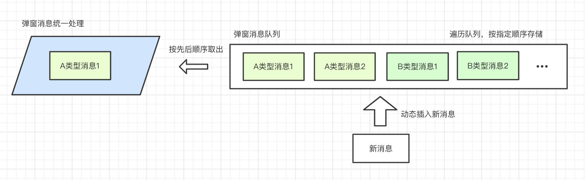
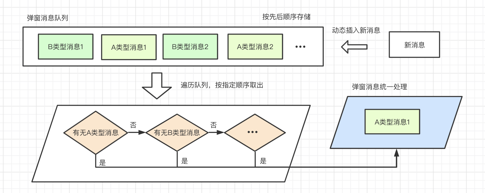
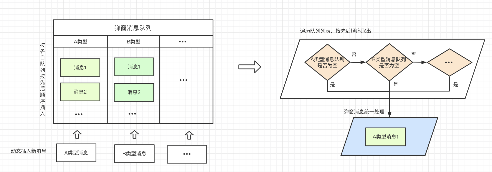

# 小程序按序弹窗设计方案及实现

> 小程序首页可能有多种弹窗：额度申请通过弹窗，优惠券弹窗等多种弹窗类型，且信息加载是异步的，如何实现弹窗是有序的呢？这里做下方案梳理和实现。

## 一、实现方案

### 1. 实现思路

- 有序弹窗，那么就需要有一个`全局`的`有序弹窗消息队列`，信息加载异步没关系，只要保证这个队列是有序的即可
- 从`有序弹窗消息队列`里面`按序`取出`弹窗消息`进行处理
- 弹窗关闭后，判断消息队列中是否还有未处理的消息，如果有，继续处理

> 因为核心逻辑在于`有序弹窗消息队列`，所以我们先梳理下队列实现方案，再梳理`弹窗消息统一处理`实现方案。

### 2. 消息队列方案

#### 2.1 按优先顺序存储，按先后顺序取出



- 优点：取出消息不需要做特别处理。
- 不足：插入消息的时候，都需要按排列顺序插入，有额外的开发成本。

#### 2.2 按先后顺序存储，按优先顺序取出



- 优点：插入消息不需要做特别处理。
- 不足：取出消息的时候，都需要按指定优先级顺序取出，有额外的开发成本。

> 综上发现，两种方案的优点是互补的，根据以空间换时间的思路，我们只需要要维护一个二维的队列，就可以得到一个优化后的方案。

#### 2.3 按先后顺序存储，按先后顺序取出

> 以二维队列作为存储方案，一维队列项为按优先顺序排序好的队列，二维队列项为各自对应的弹窗消息。



> `消息队列方案`确定了后，就再继续梳理下`弹窗消息统一处理方案`的实现。

### 3. 弹窗消息处理


> 通过统一的消息数据结构进行统一处理，数据结构需要包含以下项：

- 执行回调传入参数；
- 执行回调函数；

### 4. 实现

#### 4.1 队列初始化

```typescript
/**
 * 接口定义
 */
// 队列一维数据项
interface IDialogListItem {
  type: string; // 消息类型，其实不需要这个字段，不过还是定义下，作为数据校验的依据；
  list: IDialogItemData[]; // 消息项
}
// 队列二维数据项
interface IDialogItemData {
  data: IAnyObject; // 回调参数
  handler: (...args: any[]) => void; // 回调函数
}

/**
 * 1. 二维消息队列，一维队列项为以排序好的队列。
 * 2. 取出消息按先后顺序取出即可。
 */
const G_DIALOG_TYPE_MAP = {
  // 其他弹窗
  OTHER: 'OTHER',
  // 有新获得的优惠券
  HAS_NEW_COUPON: 'HAS_NEW_COUPON',
};
const G_DIALOG_LIST_STATUS_MAP = {
  READY: 'READY', // 准备就绪状态
  OPENING: 'OPENING', // 有正在打开的弹窗
};
// 弹窗队列状态，初始为准备就绪状态
const G_DIALOG_LIST_STATUS = G_DIALOG_LIST_STATUS_MAP.READY;
/**
 * 二维消息队列
 * 消息优先级：提额弹窗 > 优惠券弹窗
 */
const G_DIALOG_LIST: IDialogListItem[] = [
  {
    type: G_DIALOG_TYPE_MAP.OTHER,
    // 提额消息队列
    list: [] as IDialogItemData[],
  },
  {
    type: G_DIALOG_TYPE_MAP.HAS_NEW_COUPON,
    // 优惠券消息队列
    list: [] as IDialogItemData[],
  },
];
```

#### 4.2 按先后顺序插入新消息

> 这里以插入优惠券消息为例

```typescript
Page({
  onLoad() {
    // ...

    // 初始化优惠券信息
    this.initCouponInfo();

    // ...
  },
  methods: {
    /**
     * 初始化优惠券信息
     */
    async initCouponInfo() {
      // ...

      // 弹窗消息处理，这里省略
      const dialogCouponData = {};

      /**
       * 插入优惠券消息
       */
      G_DIALOG_LIST.find(item => item.type === G_DIALOG_TYPE_MAP.HAS_NEW_COUPON).list.push({
        data: dialogCouponData,

        // 这里要绑定下this执行作用域
        handler: this.dialogCouponHandler.bind(this),
      });

      // 这里执行消息统一处理函数，稍后具体实现
      this.handleDialgList();

      // ...
    },
    // 优惠券弹窗回调处理
    dialogCouponHandler(dialogCouponData = {}) {
      // 打开优惠券弹窗，这里省略
      // 发送优惠券已读消息，这里省略
    },
  },
});
```

#### 4.3 弹窗消息统一处理

```typescript
Page({
  methods: {
    // 弹窗关闭回调，继续处理下一个弹窗消息
    onCloseDialog() {
      // 先把弹窗状态设置为就绪
      G_DIALOG_LIST_STATUS = G_DIALOG_LIST_STATUS_MAP.READY;

      // 这里执行消息统一处理函数
      this.handleDialgList();
    },
    // 消息统一处理
    handleDialgList() {
      if (G_DIALOG_LIST_STATUS === G_DIALOG_LIST_STATUS_MAP.OPENING) {
        logger.log('已有弹窗在打开，待弹窗关闭后继续处理');
        return;
      }

      /**
       * 遍历二维消息队列，按遍历先后顺序，取出一条消息
       */
      let dialogList: IDialogItemData[] = [];
      for (const typeList of G_DIALOG_LIST) {
        if (typeList.list.length > 0) {
          dialogList = typeList.list;
          break;
        }
      }
      if (dialogList.length < 1) {
        logger.log('弹窗队列为空，忽略处理');
        return;
      }
      // 从队列中取出消息
      const dialogItem: IDialogItemData = dialogList.shift();

      // 标记弹窗打开状态，以免弹窗冲突
      G_DIALOG_LIST_STATUS = G_DIALOG_LIST_STATUS_MAP.OPENING;

      // 根据回调函数和回调参数，直接执行
      dialogItem.handler(dialogItem.data);
    },
  },
});
```

### 5. 后记

很欣赏一句话，“管它学海无涯，进一步有进一步的欢喜”，与君共勉。
