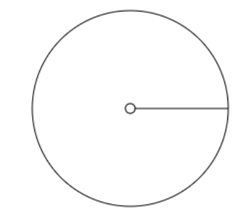
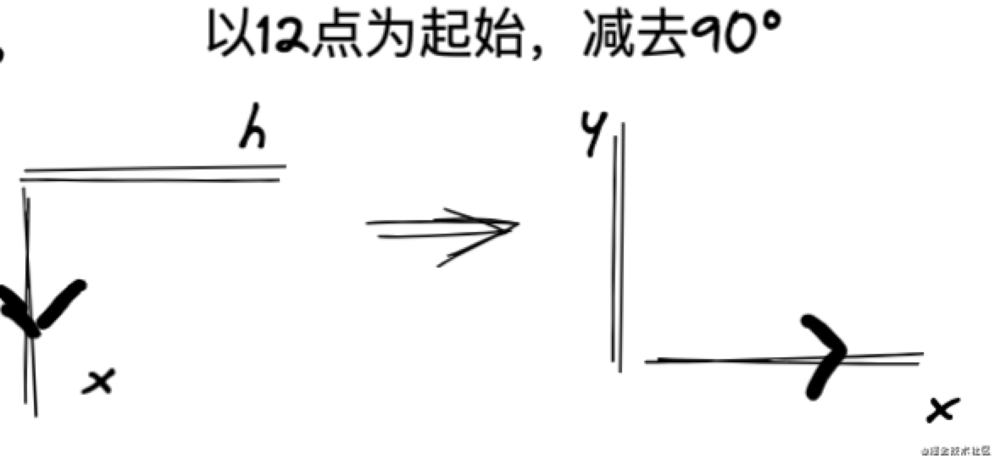
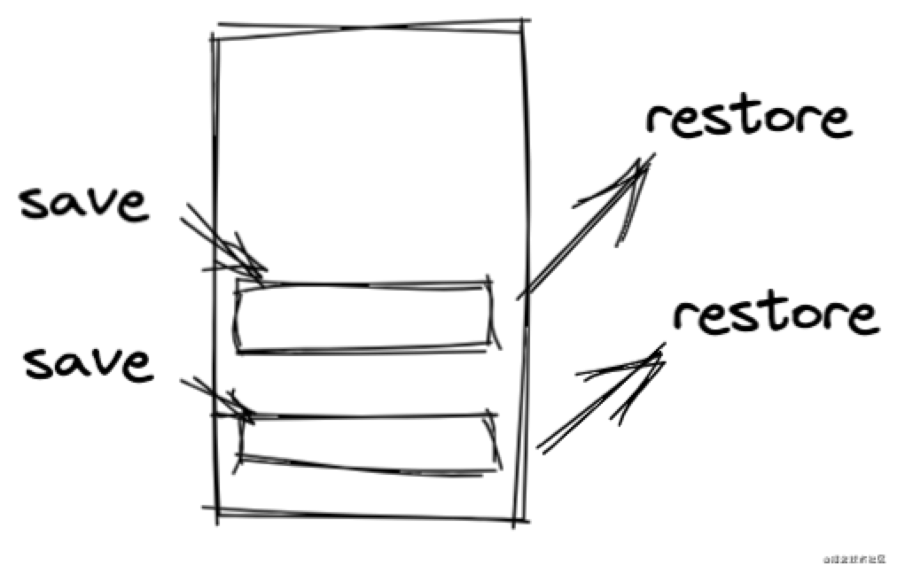
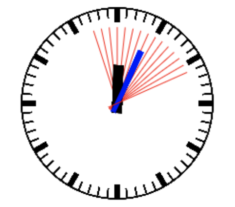

# canvas 实现时钟转动

## 1. 实现思路

实现以下效果，分为几步：

- 1、找到 `canvas` 的中心，画出表心，以及表框
- 2、获取当前时间，并根据时间画出时针，分针，秒针，还有刻度
- 3、使用定时器，每过一秒获取新的时间，并重新绘图，达到时钟转动的效果

## 2. 具体实现

### 2.1 表心，表框

画表心，表框有两个知识点：

- 1、找到 `canvas` 的中心位置
- 2、绘制圆形

```html
<canvas id="canvas" width="400" height="400"></canvas>
```

```js
const canvas = document.getElementById('canvas');
const ctx = canvas.getContext('2d');

// 设置中心点，此时 200，200 变成了坐标的 0，0
ctx.translate(200, 200);
// 画圆线使用 arc(中心点X, 中心点Y, 半径, 起始角度, 结束角度)
ctx.arc(0, 0, 100, 0, 2 * Math.PI);
ctx.arc(0, 0, 5, 0, 2 * Math.PI);
// 执行画线段的操作stroke
ctx.stroke();
```

让我们来看看效果：我们是想画两个独立的圆线，怎么画出来的两个圆连到一起了？



原因是：上面代码画连个圆时，是连着画的，所以画完大圆后，线还没斩断，就接着画小圆，那肯定会大圆小圆连一起。
解决办法就是：`beginPath`，`closePath`。

```js
const canvas = document.getElementById('canvas');
const ctx = canvas.getContext('2d');

// 设置中心点，此时300，300变成了坐标的0，0
ctx.translate(200, 200);

// 画大圆
ctx.beginPath();
// 画圆线使用arc(中心点X,中心点Y,半径,起始角度,结束角度)
ctx.arc(0, 0, 100, 0, 2 * Math.PI);
// 执行画线段的操作stroke
ctx.stroke();
ctx.closePath();

// 画小圆
ctx.beginPath();
// 画圆线使用arc(中心点X,中心点Y,半径,起始角度,结束角度)
ctx.arc(0, 0, 5, 0, 2 * Math.PI);
// 执行画线段的操作stroke
ctx.stroke();
ctx.closePath();
```

### 2.2 时针，分针，秒针

画这三个指针，有两个知识点：

- 1、根据当前时，分，秒去计算角度
- 2、在计算好的角度上去画出时针，分针，秒针

如何根据算好的角度去画线呢，比如算出当前是 `3` 点，那么时针就应该以 `12` 点为起始点，顺时针旋转 `2 * Math.PI / 12 * 3 = 90°`。
分针和秒针也是同样的道理，只不过跟时针不同的是比例问题而已，因为时在表上有 `12` 份，而分针和秒针都是 `60` 份。

这时候又有一个新问题，还是以上面的例子为例，我算出了 `90°`，那我们怎么画出时针呢？
我们可以使用 `moveTo` 和 `lineTo` 去画线段。
至于 `90°`，我们只需要将 x 轴顺时针旋转 `90°`，然后再画出这条线段，那就得到了指定角度的指针了。

但是上面说了，是要以 `12` 点为起始点，我们的默认 `x` 轴确是水平的，所以我们时分秒针算出角度后，每次都要减去 `90°`。可能这有点绕，我们通过下面的图演示一下，还是以上面 `3` 点的例子：

这样就得出了 `3` 点指针的画线角度了。



又有新问题了，比如现在我画完了时针，然后我想画分针，`x` 轴已经在我画时针的时候偏转了，这时候肯定要让 `x` 轴恢复到原来的模样，我们才能继续画分针，否则画出来的分针是不准的。

这时候 `save` 和 `restore` 就派上用场了，`save` 是把 `ctx` 当前的状态打包压入栈中，`restore` 是取出栈顶的状态并赋值给 `ctx``，save` 可多次，但是 `restore` 取状态的次数必须等于 `save` 次数。



懂得了上面所说，剩下画刻度了，起始刻度的道理跟时分秒针道理一样，只不过刻度是死的，不需要计算，只需要规则画出 `60` 个小刻度，和 `12` 个大刻度就行。

代码如下：

```js
const canvas = document.getElementById('canvas');
const ctx = canvas.getContext('2d');

// 设置中心点，此时 [200，200] 变成了坐标的 [0, 0]
ctx.translate(200, 200);

/**
 * 画大圆
 */
ctx.beginPath();
// 画圆线使用 arc(中心点X,中心点Y,半径,起始角度,结束角度)
ctx.arc(0, 0, 100, 0, 2 * Math.PI);
// 执行画线段的操作 stroke
ctx.stroke();
ctx.closePath();

/**
 * 画小圆
 */
ctx.beginPath();
// 画圆线使用 arc(中心点X,中心点Y,半径,起始角度,结束角度)
ctx.arc(0, 0, 5, 0, 2 * Math.PI);
// 执行画线段的操作 stroke
ctx.stroke();
ctx.closePath();

/**
 * 获取当前 时，分，秒
 */
const time = new Date();
const hour = time.getHours() % 12;
const min = time.getMinutes();
const sec = time.getSeconds();

/**
 * 画时针
 */
// 初始保存一次
ctx.save();

// 计算角度从 12 点位置开始计算，但坐标位置从 x 轴方向开始偏移，所以需要减去 90°
ctx.rotate(((2 * Math.PI) / 12) * hour + ((2 * Math.PI) / 12) * (min / 60) - Math.PI / 2);
ctx.beginPath();

// moveTo 设置画线起点
ctx.moveTo(-10, 0);
// lineTo 设置画线经过点
ctx.lineTo(40, 0);
// 设置线宽
ctx.lineWidth = 10;
ctx.strokeStyle = 'black';
ctx.stroke();
ctx.closePath();
// 恢复成上一次save的状态
ctx.restore();
// 恢复完再保存一次
ctx.save();

// 分针
ctx.rotate(((2 * Math.PI) / 60) * min + ((2 * Math.PI) / 60) * (sec / 60) - Math.PI / 2);
ctx.beginPath();
ctx.moveTo(-10, 0);
ctx.lineTo(60, 0);
ctx.lineWidth = 5;
ctx.strokeStyle = 'blue';
ctx.stroke();
ctx.closePath();
ctx.restore();
ctx.save();

// 秒针
ctx.rotate(((2 * Math.PI) / 60) * sec - Math.PI / 2);
ctx.beginPath();
ctx.moveTo(-10, 0);
ctx.lineTo(80, 0);
ctx.lineWidth = 1;
ctx.strokeStyle = 'red';
ctx.stroke();
ctx.closePath();
ctx.restore();
ctx.save();

// 绘制非整点刻度，也是跟绘制时分秒针一样，只不过刻度是死的
ctx.lineWidth = 1;
for (let i = 0; i < 60; i++) {
  ctx.rotate((2 * Math.PI) / 60);
  ctx.beginPath();
  ctx.moveTo(90, 0);
  ctx.lineTo(100, 0);
  ctx.strokeStyle = 'black';
  ctx.stroke();
  ctx.closePath();
}
ctx.restore();
ctx.save();

// 绘制整点刻度
ctx.lineWidth = 5;
for (let i = 0; i < 12; i++) {
  ctx.rotate((2 * Math.PI) / 12);
  ctx.beginPath();
  ctx.moveTo(85, 0);
  ctx.lineTo(100, 0);
  ctx.stroke();
  ctx.closePath();
}

// 恢复成上一次save的状态
ctx.restore();
```

效果如下图：


### 2.3 时钟转动

最后一步就是更新视图，使时钟转动起来。

第一想到的肯定是定时器 `setInterval`，但是注意一个问题：每次更新视图的时候都要把上一次的画布清除，再开始画新的视图，不然就会叠加已有视图，效果如千手观音一样：



最终代码如下：

```js
const canvas = document.getElementById('canvas');
const ctx = canvas.getContext('2d');

setInterval(() => {
  ctx.save();
  // ctx.clearRect(0, 0, 400, 400)
  // 设置中心点，此时 [200，200] 变成了坐标的 [0, 0]
  ctx.translate(200, 200);
  ctx.save();

  /**
   * 画大圆
   */
  ctx.beginPath();
  // 画圆线使用 arc(中心点X,中心点Y,半径,起始角度,结束角度)
  ctx.arc(0, 0, 100, 0, 2 * Math.PI);
  // 执行画线段的操作 stroke
  ctx.stroke();
  ctx.closePath();

  /**
   * 画小圆
   */
  ctx.beginPath();
  // 画圆线使用 arc(中心点X,中心点Y,半径,起始角度,结束角度)
  ctx.arc(0, 0, 5, 0, 2 * Math.PI);
  // 执行画线段的操作 stroke
  ctx.stroke();
  ctx.closePath();

  /**
   * 获取当前 时，分，秒
   */
  const time = new Date();
  const hour = time.getHours() % 12;
  const min = time.getMinutes();
  const sec = time.getSeconds();

  /**
   * 画时针
   */
  // 计算角度从 12 点位置开始计算，但坐标位置从 x 轴方向开始偏移，所以需要减去 90°
  ctx.rotate(((2 * Math.PI) / 12) * hour + ((2 * Math.PI) / 12) * (min / 60) - Math.PI / 2);
  ctx.beginPath();
  // moveTo 设置画线起点
  ctx.moveTo(-10, 0);
  // lineTo 设置画线经过点
  ctx.lineTo(40, 0);
  // 设置线宽
  ctx.lineWidth = 10;
  ctx.strokeStyle = 'black';
  ctx.stroke();
  ctx.closePath();
  // 恢复成上一次save的状态
  ctx.restore();
  // 恢复完再保存一次
  ctx.save();

  // 分针
  ctx.rotate(((2 * Math.PI) / 60) * min + ((2 * Math.PI) / 60) * (sec / 60) - Math.PI / 2);
  ctx.beginPath();
  ctx.moveTo(-10, 0);
  ctx.lineTo(60, 0);
  ctx.lineWidth = 5;
  ctx.strokeStyle = 'blue';
  ctx.stroke();
  ctx.closePath();
  ctx.restore();
  ctx.save();

  // 秒针
  ctx.rotate(((2 * Math.PI) / 60) * sec - Math.PI / 2);
  ctx.beginPath();
  ctx.moveTo(-10, 0);
  ctx.lineTo(80, 0);
  ctx.lineWidth = 1;
  ctx.strokeStyle = 'red';
  ctx.stroke();
  ctx.closePath();
  ctx.restore();
  ctx.save();

  // 绘制非整点刻度，也是跟绘制时分秒针一样，只不过刻度是死的
  ctx.lineWidth = 1;
  for (let i = 0; i < 60; i++) {
    ctx.rotate((2 * Math.PI) / 60);
    ctx.beginPath();
    ctx.moveTo(90, 0);
    ctx.lineTo(100, 0);
    ctx.strokeStyle = 'black';
    ctx.stroke();
    ctx.closePath();
  }
  ctx.restore();
  ctx.save();

  // 绘制整点刻度
  ctx.lineWidth = 5;
  for (let i = 0; i < 12; i++) {
    ctx.rotate((2 * Math.PI) / 12);
    ctx.beginPath();
    ctx.moveTo(85, 0);
    ctx.lineTo(100, 0);
    ctx.stroke();
    ctx.closePath();
  }

  // 恢复成最初 save 的状态
  ctx.restore();
  ctx.restore();
}, 1000);
```

## 3. 参考

- [10 分钟入门 canvas](https://mp.weixin.qq.com/s/wEO5SUI9EWv7sZ5hjT8vdQ)
