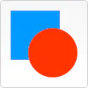
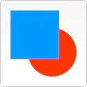
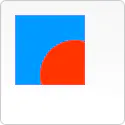
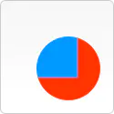
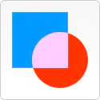
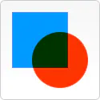
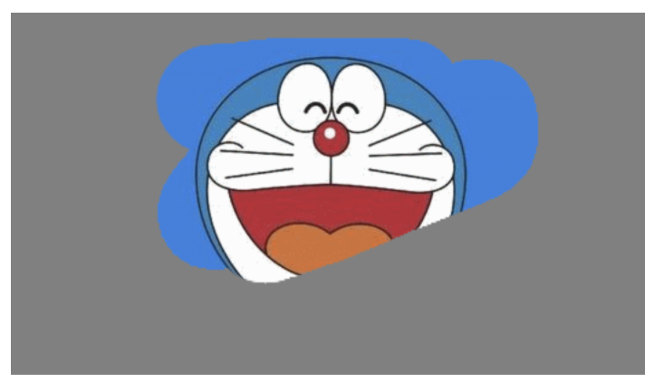

# canvas 实现刮刮卡

## 1. globalCompositeOperation 属性介绍

> `蓝色`表示先绘制的图形、`红色`表示后绘制的图形。

| 属性值                | 描述                                                               | 显示效果                                                  |
| --------------------- | ------------------------------------------------------------------ | --------------------------------------------------------- |
| `source-over` (default) | 新图形会覆盖在原有内容之上                                         |       |
| `destination-over`      | 会在原有内容之下绘制新图形                                         |  |
| `source-in`             | 新图形会仅仅出现与原有内容重叠的部分。其它区域都变成透明的         |         |
| `destination-in`        | 原有内容中与新图形重叠的部分会被保留，其它区域都变成透明的         |    |
| `source-out`            | 结果是只有新图形中与原有内容不重叠的部分会被绘制出来               |        |
| `destination-out`       | 原有内容中与新图形不重叠的部分会被保留                             |   |
| `source-atop`           | 新图形中与原有内容重叠的部分会被绘制，并覆盖于原有内容之上         |       |
| `destination-atop`      | 原有内容中与新内容重叠的部分会被保留，并会在原有内容之下绘制新图形 |  |
| `lighter`               | 两图形中重叠部分作加色处理                                         |           |
| `darker`                | 两图形中重叠的部分作减色处理                                       |            |
| `xor`                   | 重叠的部分会变成透明                                               |               |
| `copy`                  | 只有新图形会被保留，其它都被清除掉                                 |              |

通过 `Context` 的 `globalCompositeOperation` 我们可以灵活的掌握绘制图形之间层叠显示关系，做出很多漂亮的显示效果。
接下来我们就使用 `globalCompositeOperation=destination-out` 来实现一个刮刮卡的效果。

## 2. 实现思路

### 2.1 效果



### 2.2 原理

1. 在页面上放一个 `div` 容器，设置这个 `div` 的宽高、把机器猫的图片设为背景,
2. 在 `div` 中放一个 `canvas` 标签，设置 `canvas` 的宽高和父容器 `div` 的一样。
3. 获取 `canvas` 的 `context` 对象绘制一个以灰色为背景宽高和 `canvas` 宽高相同的矩形，这样机器猫背景图就被遮住了，只能看见一个灰色的背景。
4. `canvas` 绑定鼠标 `mousedown`,`mousemove` 和 `mouseup` 事件(移动端绑定事件分别是: `touchstart`,`touchmove`,`touchend`)，设置鼠标按下标志，鼠标按下或者鼠标按下并且移动时记录鼠标坐标值。
5. 鼠标点击或者按住鼠标移动的时候开始绘图，绘图的时候设置 `context.globalCompositeOperation='destination-out'` 根据上面属性的解释，原有图形（灰色矩形）与新图形（画的线条）不重叠的部分会被保留，所以画过线条的部分不会被保留就可以看见下面机器猫图片背景了。
6. 鼠标抬起设置鼠标按下标志为 `false`, 清空坐标数组。

## 3. 完整代码

```html
<style>
  #div {
    margin: 30px auto;
    width: 350px;
    height: 200px;
    background: url('./test.png') no-repeat;
    background-color: #eee;
    background-size: cover;
  }
</style>
<body>
  <div id="div"></div>
</body>
```

```js
function init() {
    const width = document.getElementById('div').offsetWidth;
    const height = document.getElementById('div').offsetHeight;

    if (!document.getElementById('myCanvas')) {
        const canvas = document.createElement('canvas');

        canvas.setAttribute('width', `${width}px`);
        canvas.setAttribute('height', `${height}px`);
        canvas.id = 'myCanvas';
        document.getElementById('div').appendChild(canvas);
    }

    const myCanvasObject = document.getElementById('myCanvas');
    const ctx = myCanvasObject.getContext('2d');

    // 绘制黑色矩形
    ctx.beginPath();
    ctx.fillStyle = 'gray';
    ctx.rect(0, 0, width, height);
    ctx.closePath();
    ctx.fill();

    // 绘制填充文字
    ctx.beginPath();
    ctx.fillStyle = '#fff';
    ctx.fillText('刮刮卡', 160, 100);
    ctx.closePath();

    let isDown = false; // 鼠标是否按下标志
    let pointerArr = []; // 鼠标移动坐标数组
    let xPointer = 0; // 鼠标当前x坐标
    let yPointer = 0; // 鼠标当前y坐标

    // pc，移动事件兼容写法
    const hastouch = 'ontouchstart' in window;
    const tapstart = hastouch ? 'touchstart' : 'mousedown';
    const tapmove = hastouch ? 'touchmove' : 'mousemove';
    const tapend = hastouch ? 'touchend' : 'mouseup';

    // 鼠标按下
    myCanvasObject.addEventListener(tapstart, function (event) {
        const e = event;

        this.style.cursor = 'move';

        isDown = true;

        xPointer = hastouch ? e.targetTouches[0].clientX - this.offsetLeft : e.clientX - this.offsetLeft;
        yPointer = hastouch ? e.targetTouches[0].clientY - this.offsetTop : e.clientY - this.offsetTop;
        pointerArr.push([xPointer, yPointer]);

        circleReset(ctx);
    });

    // 鼠标按下后拖动
    myCanvasObject.addEventListener(tapmove, function (event) {
        const e = event;

        if (isDown) {
            xPointer = hastouch ? e.targetTouches[0].clientX - this.offsetLeft : e.clientX - this.offsetLeft;
            yPointer = hastouch ? e.targetTouches[0].clientY - this.offsetTop : e.clientY - this.offsetTop;
            pointerArr.push([xPointer, yPointer]);

            circleReset(ctx);
        }
    });

    // 鼠标抬起取消事件
    myCanvasObject.addEventListener(tapend, (event) => {
        isDown = false;
        pointerArr = [];
    });

    // 圆形橡皮檫
    function circleReset(ctx) {
        ctx.save();
        ctx.beginPath();

        ctx.moveTo(pointerArr[0][0], pointerArr[0][1]);

        ctx.lineCap = 'round'; // 设置线条两端为圆弧
        ctx.lineJoin = 'round'; // 设置线条转折为圆弧
        ctx.lineWidth = 60;

        ctx.globalCompositeOperation = 'destination-out';

        if (pointerArr.length === 1) {
            ctx.lineTo(pointerArr[0][0] + 1, pointerArr[0][1] + 1);
        }
        else {
            for (let i = 1; i < pointerArr.length; i++) {
                ctx.lineTo(pointerArr[i][0], pointerArr[i][1]);
                ctx.moveTo(pointerArr[i][0], pointerArr[i][1]);
            }
        }

        ctx.closePath();
        ctx.stroke();
        ctx.restore();
    }
}

init();
```

## 4. 参考

- [10 分钟入门 canvas](https://mp.weixin.qq.com/s/wEO5SUI9EWv7sZ5hjT8vdQ)
