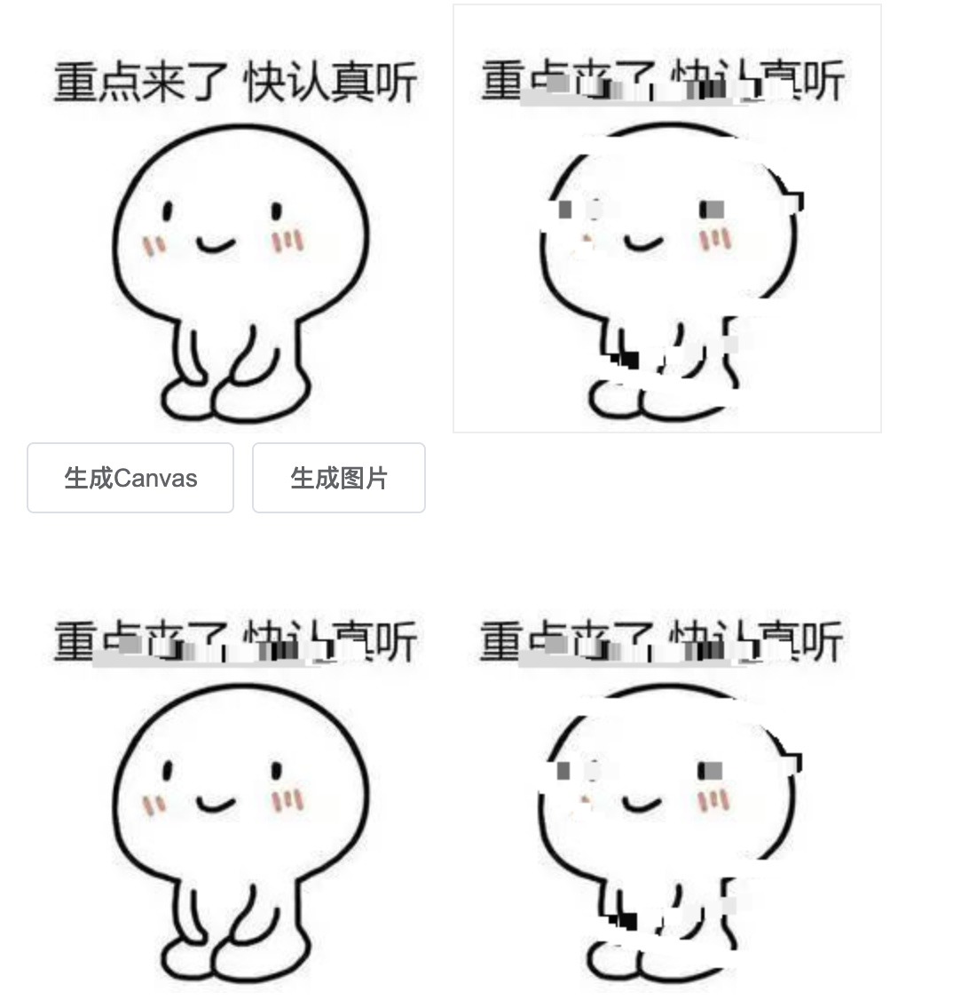

# canvas 实现图片马赛克

## 1. Canvas 简介

> 这个 `HTML` 元素是为了客户端矢量图形而设计的。
> 它自己没有行为，但却把一个绘图 `API` 展现给客户端 `JavaScript` 以使脚本能够把想绘制的东西都绘制到一块画布上。

`HTML5` 元素用于绘制图像（通过脚本，通常是 `JavaScript`）。
不过，这个元素本身并没有绘制能力（它仅仅是图形的容器）- 您必须使用脚本来完成实际的绘图任务。
`Canvas.getContext()` 方法可返回一个对象，该对象提供了用于在画布上绘图的方法和属性。

> `Canvas` 和 `SVG` 之间的差异：

`Canvas` 和 `SVG` 之间的一个重要的不同是，有一个基于 `JavaScript` 的绘图 `API`，而 `SVG` 使用一个 `XML` 文档来描述绘图。
这两种方式在功能上是等同的，任何一种都可以用另一种来模拟。

从表面上看，它们很不相同，可是，每一种都有强项和弱点。
例如，`SVG` 绘图很容易编辑，只要从其描述中移除元素就行。
要从同一图形的 `Canvas` 中移除元素，往往需要擦掉绘图重新绘制它。

## 2. 知识点介绍

- 利用 `js` 创建图片

```js
const img = new Image();
// 可以给图片一个链接
img.src = 'https://www.test.com/static/download.jpg';
// 或者本地已有图片的路径
// img.src = './download.jpg'

// 添加到 HTML 中
document.body.appendChild(img);
```

- `canvas.getContext("2d")`

> 语法：参数 `contextID` 指定了您想要在画布上绘制的类型。
> 当前唯一的合法值是 `2d`，它指定了二维绘图，并且这个方法返回一个环境对象，该对象提供二维绘图 `API`。

```js
const contextID = '2d';
const context = Canvas.getContext(contextID);
```

- `ctx.drawImage()`

在画布上定位图像：

```js
context.drawImage(img, x, y);
```

在画布上定位图像，并规定图像的宽度和高度：

```js
context.drawImage(img, x, y, width, height);
```

剪切图像，并在画布上定位被剪切的部分：

```js
context.drawImage(img, sx, sy, swidth, sheight, x, y, width, height);
```

- `ctx.getImageData()`

> `JavaScript` 语法 `getImageData()` 方法返回 `ImageData` 对象，该对象拷贝了画布指定矩形的像素数据。

对于 `ImageData` 对象中的每个像素，都存在着四方面的信息，即 `RGBA` 值：`R - 红色 (0-255)`、`G - 绿色 (0-255)`
、`B - 蓝色 (0-255)`、`A - alpha 通道 (0-255; 0 是透明的，255 是完全可见的) `。
`color/alpha` 以数组形式存在，并存储于 `ImageData` 对象的 `data` 属性中。

```js
const imgData = context.getImageData(x, y, width, height);
```

- `ctx.putImageData()`

> `putImageData()` 方法将图像数据（从指定的 `ImageData` 对象）放回画布上。

知识储备已准备 OK，接下来就可以实现了。

## 3. 效果



## 4. 实现

```html
<script lang="ts">
  import { defineComponent } from 'vue'
  import { ElButton } from 'element-plus'

  export default defineComponent({
    components: {
      ElButton,
    },
    setup() {
      let img: HTMLImageElement
      let canvas: HTMLCanvasElement
      let ctx: CanvasRenderingContext2D
      let imgData: ImageData

      // pc，移动事件兼容写法
      const hastouch = 'ontouchstart' in window ? true : false,
        tapstart = hastouch ? 'touchstart' : 'mousedown',
        tapmove = hastouch ? 'touchmove' : 'mousemove',
        tapend = hastouch ? 'touchend' : 'mouseup'

      function addCanvas() {
        if (document.querySelector('canvas')) {
          console.warn('已有canvas元素，不支持重复添加')
          return
        }

        img = document.querySelector('img') as HTMLImageElement

        const newImg = new Image()
        newImg.src = '/demo.jpg' // 这里放自己的图片
        newImg.onload = function () {
          const width = newImg.width
          const height = newImg.height

          const { canvas: newCanvas, ctx: newCtx } = createCanvasAndCtx(width, height)

          newCtx.drawImage(newImg, 0, 0, width, height)

          img?.parentNode?.insertBefore(newCanvas, img.nextSibling)
          canvas = newCanvas
          ctx = newCtx
          imgData = ctx.getImageData(0, 0, img.clientWidth, img.clientHeight)
        }
      }

      function createCanvasAndCtx(
        width: number,
        height: number
      ): {
        canvas: HTMLCanvasElement
        ctx: CanvasRenderingContext2D
      } {
        const canvas = document.createElement('canvas')

        canvas.setAttribute('width', width + 'px')
        canvas.setAttribute('height', height + 'px')

        // 鼠标按下
        canvas.addEventListener(tapstart, start)
        // 鼠标抬起
        canvas.addEventListener(tapend, end)
        // PC 鼠标移出
        canvas.addEventListener('mouseout', end)

        const ctx = canvas.getContext('2d') as CanvasRenderingContext2D

        return {
          canvas,
          ctx,
        }
      }

      function start() {
        // 鼠标移动
        canvas.addEventListener(tapmove, move)
      }
      function end() {
        canvas.removeEventListener(tapmove, move)
      }
      function move(e: TouchEvent | MouseEvent) {
        // 马赛克的程度，数字越大越模糊
        const num = 10

        let xPointer = hastouch
          ? (e as TouchEvent).targetTouches[0].clientX - canvas.offsetLeft
          : (e as MouseEvent).clientX - canvas.offsetLeft
        let yPointer = hastouch
          ? (e as TouchEvent).targetTouches[0].clientY - canvas.offsetTop
          : (e as MouseEvent).clientY - canvas.offsetTop

        xPointer = Math.floor(xPointer)
        yPointer = Math.floor(yPointer)

        // 兼容移动端
        if (xPointer > canvas.width || yPointer > canvas.height) {
          return
        }

        // 获取鼠标当前所在的像素 RGBA
        const color = getXY(imgData, xPointer, yPointer)

        for (let k = 0; k < num; k++) {
          for (let l = 0; l < num; l++) {
            // 设置 imgData 上坐标为 (e.offsetX + l, e.offsetY + k) 的的颜色
            setXY(imgData, xPointer + l, yPointer + k, color)
          }
        }

        // 更新 canvas 数据
        ctx.putImageData(imgData, 0, 0)
      }

      function generateImg() {
        if (!canvas) {
          console.warn('请先生成canvas')
          return
        }
        const newImg = new Image()
        newImg.src = canvas.toDataURL('image/png')
        newImg.className = 'img-prevew'
        img?.parentNode?.appendChild(newImg)
      }

      function setXY(obj: ImageData, x: number, y: number, color: Array<number>) {
        const w = obj.width

        obj.data[4 * (y * w + x)] = color[0]
        obj.data[4 * (y * w + x) + 1] = color[1]
        obj.data[4 * (y * w + x) + 2] = color[2]
        obj.data[4 * (y * w + x) + 3] = color[3]
      }

      function getXY(obj: ImageData, x: number, y: number): Array<number> {
        const w = obj.width
        const color = []

        color[0] = obj.data[4 * (y * w + x)]
        color[1] = obj.data[4 * (y * w + x) + 1]
        color[2] = obj.data[4 * (y * w + x) + 2]
        color[3] = obj.data[4 * (y * w + x) + 3]

        return color
      }

      return {
        addCanvas,
        generateImg,
      }
    },
  })
</script>

<template>
  <div class="wrapper">
    
    <div>
      <el-button @click="addCanvas()">生成Canvas</el-button>
      <el-button @click="generateImg()">生成图片</el-button>
    </div>
  </div>
</template>

<style scoped lang="scss">
  .wrapper {
    padding: 30px;
    max-width: 100%;

    :deep canvas {
      border: 1px solid #eee;
    }

    :deep .img-prevew {
      margin-top: 30px;
    }
  }
</style>
```

## 5. 参考

- [手把手教你利用 js 给图片打马赛克](https://mp.weixin.qq.com/s/k38FbhAndxpPrqWhOabVbw)
