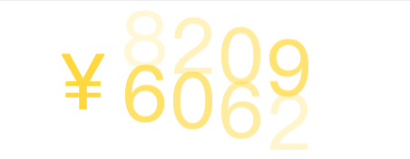

# 使用 Vue 的 transition-group 实现一个简单的数字滚动

## 1. 思考

可以通过 `vue` 中的 `transition-group` 可以实现类似的效果，详见[官网文档](https://v3.cn.vuejs.org/guide/transitions-list.html)。

## 2. 实现

```html
<!-- Amount.vue -->
<template>
  <div class="wrapper">
    <div class="amount">
      <div style="display: flex">
        <span>￥</span>
        <transition-group name="list" tag="p" style="position: relative">
          <div
            style="display: inline-block; position: absolute"
            v-for="(item, index) in todayAmountComputed"
            :style="{
              left: index * 53 + 'px',
              transitionDelay: 0.1 * index + 's',
            }"
            :key="item + index"
          >
            {{ item }}
          </div>
        </transition-group>
      </div>
    </div>
  </div>
</template>

<script lang="ts">
  import { defineComponent, ref, computed, onMounted } from "vue";

  export default defineComponent({
    components: {},
    setup() {
      const todayAmount = ref<string>("0");

      const todayAmountComputed = computed(() => {
        return todayAmount.value.split("");
      });

      onMounted(() => {
        setInterval(() => {
          if (todayAmount.value === "0") {
            todayAmount.value = "1000";
          }
          todayAmount.value = "" + Math.floor(Math.random() * 10000);
        }, 2000);
      });

      return {
        todayAmountComputed,
      };
    },
  });
</script>

<style scoped lang="scss">
  .wrapper {
    padding: 30px;
    max-width: 100%;
    border: 1px solid #eee;
    box-sizing: border-box;

    .amount {
      color: gold;
      font-size: 85px;
      display: flex;
      flex-direction: row;
      align-items: center;
      justify-content: space-around;

      :deep {
        .list-enter-active,
        .list-leave-active {
          transition:
            transform 1s ease,
            opacity 1s ease;
        }

        .list-enter-from {
          opacity: 0;
          transform: translateY(50%);
        }

        .list-leave-to {
          opacity: 0;
          transform: translateY(-50%);
        }
      }
    }
  }
</style>
```

## 3. 效果



## 4. 参考

- [使用 vue3 的 transition-group 实现一个简单的数字滚动](https://juejin.cn/post/7019597165538312200)
