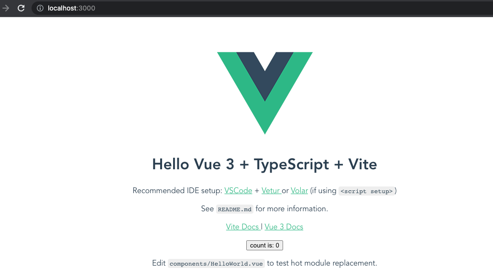
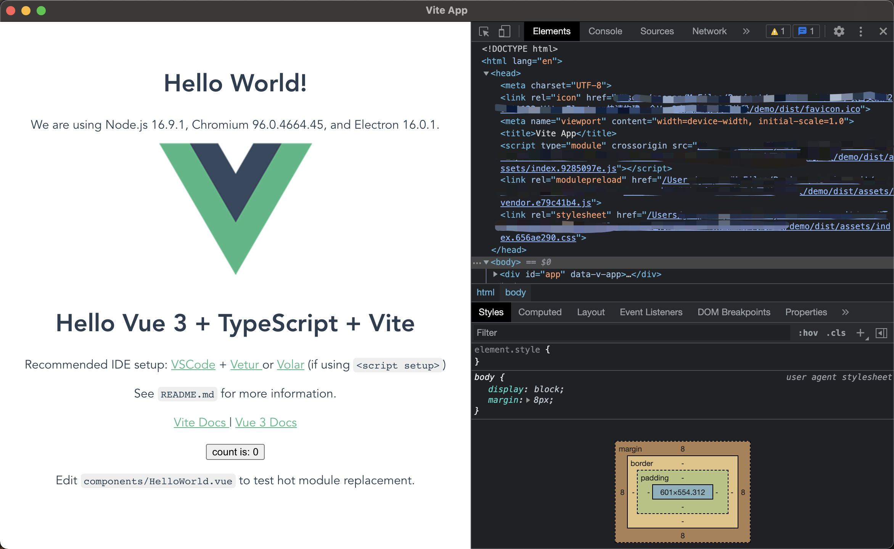

# Vite+Electron 快速构建一个 Vue3 桌面应用

## 1. 简介

首先，介绍下 `Vite` 和 `Electron`。

- `Vite` 是一种新型前端构建工具，能够显著提升前端开发体验。
- `Electron` 是一个使用 `JavaScript`、`HTML` 和 `CSS` 构建桌面应用程序的框架。
  嵌入 `Chromium` 和 `Node.js` 到二进制的 `Electron` 允许您保持一个 `JavaScript` 代码代码库并创建在 `Windows`、`macOS` 上运行的跨平台应用 `macOS`。

## 2. 创建一个 Vite 项目

### 2.1 安装 Vite

```bash
yarn create vite
```

### 2.2 创建项目

> [搭建第一个 Vite 项目](https://vitejs.cn/guide/)

创建命令如下：

```bash
yarn create @vitejs/app <your-vue-app-name> --template vue-ts
```

此处创建一个项目，名为 `demo`。

```bash
yarn create @vitejs/app demo --template vue-ts
```

### 2.3 进入项目运行

```bash
cd demo
yarn install
yarn dev

#  vite v2.6.14 dev server running at:

#  > Local: http://localhost:3000/
#  > Network: use `--host` to expose

```

此时按照输出，打开地址预览，即可看到初始化页面。



至此一个基础的 Vite 项目创建完成。

## 3. 配置 Electron

### 3.1 官方文档

在 [Electron 官网的快速入门文档](https://www.electronjs.org/zh/docs/latest/tutorial/quick-start)中，有官方给出的利用 `html`、`javascript`、`css` 来创建一个 `electron` 应用的案例，`Vite + Electron` 的方案也借鉴其中。

### 3.2 安装

首先安装 `electron` 至 `vite` 应用。当前 `electron` 的版本为`16.0.1`。

```bash
yarn add --dev electron
```

### 3.3 配置文件

```js
// vite.config.js

import path from 'node:path'; // 新增
import vue from '@vitejs/plugin-vue';
import { defineConfig } from 'vite';

// https://vitejs.dev/config/
export default defineConfig({
    base: path.resolve(__dirname, './dist/'), // 新增
    plugins: [vue()],
});
```

再创建一个新的文件 `main.js`，需要注意的是，该内容中 `index.html` 的加载路径跟 `electron` 官网给的配置不同。

```js
// main.js

const path = require('node:path');
// 控制应用生命周期和创建原生浏览器窗口的模组
const { app, BrowserWindow } = require('electron');

function createWindow() {
    // 创建浏览器窗口
    const mainWindow = new BrowserWindow({
        width: 800,
        height: 600,
        webPreferences: {
            preload: path.join(__dirname, 'preload.js'),
        },
    });

    // 加载 index.html
    mainWindow.loadFile('dist/index.html'); // 此处跟electron官网路径不同，需要注意

    // 打开开发工具
    mainWindow.webContents.openDevTools();
}

// 这段程序将会在 Electron 结束初始化
// 和创建浏览器窗口的时候调用
// 部分 API 在 ready 事件触发后才能使用。
app.whenReady().then(() => {
    createWindow();

    app.on('activate', () => {
    // 通常在 macOS 上，当点击 dock 中的应用程序图标时，如果没有其他
    // 打开的窗口，那么程序会重新创建一个窗口。
        if (BrowserWindow.getAllWindows().length === 0) {
            createWindow();
        }
    });
});

// 除了 macOS 外，当所有窗口都被关闭的时候退出程序。 因此，通常对程序和它们在
// 任务栏上的图标来说，应当保持活跃状态，直到用户使用 Cmd + Q 退出。
app.on('window-all-closed', () => {
    if (process.platform !== 'darwin') {
        app.quit();
    }
});

// 在这个文件中，你可以包含应用程序剩余的所有部分的代码，
// 也可以拆分成几个文件，然后用 require 导入。
```

创建一个新的文件 `preload.js`。

```js
// preload.js

// 所有 Node.js API 都可以在预加载过程中使用。
// 它拥有与 Chrome 扩展一样的沙盒。
window.addEventListener('DOMContentLoaded', () => {
    const replaceText = (selector, text) => {
        const element = document.getElementById(selector);
        if (element) {
            element.textContent = text;
        }
    };

    for (const type of ['chrome', 'node', 'electron']) {
        replaceText(`${type}-version`, process.versions[type]);
    }
});
```

增加页面版本信息展示：

```html
<!-- App.vue -->

<template>
  <div>
    <h1>Hello World!</h1>
    We are using Node.js <span id="node-version"></span>, Chromium <span id="chrome-version"></span>, and Electron
    <span id="electron-version"></span>.
  </div>
  <!-- MORE -->
</template>

<!-- MORE -->
```

为了确保能够运行相关 `electron` 的命令，需要修改 `package.json` 文件。

先需要去设置 `main` 属性，`electron` 默认会去在开始时寻找项目根目录下的 `index.js` 文件，此处我们使用的是 `main.js`，所以需要去定义下。
最后我们需要新增 `electron` 的运行命令。

```json
// package.json

{
    "version": "0.0.0",
    "main": "main.js", // 新增
    "scripts": {
        "dev": "vite",
        "build": "vue-tsc --noEmit && vite build",
        "serve": "vite preview",
        "electron:serve": "electron ." // 新增
    },
    "dependencies": {
        "vue": "^3.0.5"
    },
    "devDependencies": {
        "@vitejs/plugin-vue": "^1.2.5",
        "@vue/compiler-sfc": "^3.0.5",
        "electron": "^16.0.1",
        "typescript": "^4.3.2",
        "vite": "^2.4.2",
        "vue-tsc": "^0.0.24"
    }
}
```

## 4. 运行

> 运行 `yarn dev` 是不支持的，因为相对路径改为了绝对路径。所以改动后，需要 `yarn build` 后再启动才能看效果。

直接在终端输入如下命令：

```bash
# 构建结果
yarn build
# 本地启动
yarn electron:serve
```

看下效果：



## 5. 参考

- [Vite+Electron 快速构建一个 VUE3 桌面应用](https://github.com/Kuari/Blog/issues/52)
- [Building a Vue 3 Desktop App with Vite and Electron](https://learnvue.co/2021/05/build-vue-3-desktop-apps-in-just-5-minutes-vite-electron-quick-start-guide/)
