# canvas 实现环形进度条

本项目基于 `Vue3 + Vite + Ts + Canvas` 实现。

## 1. 项目初始化

```bash
yarn create vite demo --template vue-ts
cd demo && yarn install
```

预览效果：

```bash
yarn dev
```

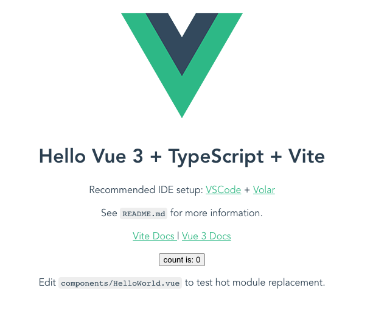

## 2. 静态实现

### 2.1 确定画布大小

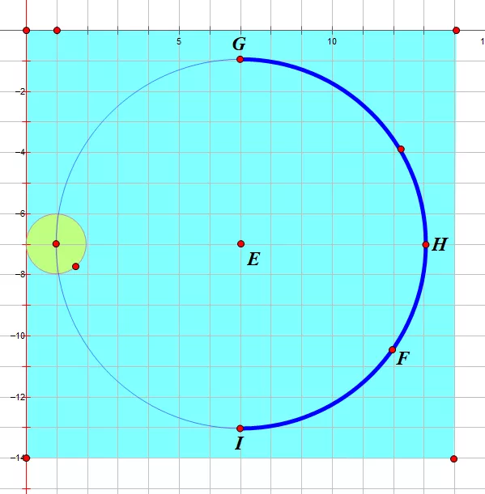

从上图可以直观地看到，整个环形进度条的最外围是由进度圆点确定的，而进度圆点的圆心在圆环圆周上。

因此我们得出公式如下：

```js
// canvasSize: canvas 宽度/高度
// outerRadius: 外围半径
// circleRadius: 圆环半径
// pointRadius: 进度圆点半径
const canvasSize = 2 * outerRadius;
canvasSize === 2 * (pointRadius + circleRadius);
```

组件代码如下：

```html
<!-- components/Progress.vue -->

<template>
  <canvas ref="canvasRef" :width="canvasSize" :height="canvasSize"></canvas>
</template>

<script lang="ts">
  import { computed, defineComponent } from "vue";

  export default defineComponent({
    name: "Progress",
    props: {
      circleRadius: {
        type: Number,
        default: 40,
      },
      pointRadius: {
        type: Number,
        default: 6,
      },
    },
    setup(props) {
      const { circleRadius, pointRadius } = props;

      // 外围半径
      const outerRadius = computed(() => circleRadius + pointRadius);
      // canvas 宽度/高度
      const canvasSize = computed(() => 2 * outerRadius.value);

      return {
        canvasSize,
      };
    },
  });
</script>
```

```html
<!-- App.vue -->

<script setup lang="ts">
  import Progress from "./components/Progress.vue";
</script>

<template>
  <progress></progress>
</template>

<style>
  #app {
    text-align: center;
    margin-top: 60px;
  }
</style>
```

效果如下：

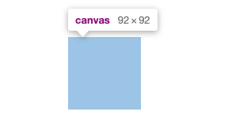

### 2.2 获取绘图上下文

`getContext('2d')` 方法返回一个用于在 `canvas` 上绘图的环境，支持一系列 `2d` 绘图 API。

```html
<!-- components/Progress.vue -->

<template>
  <canvas ref="canvasRef" :width="canvasSize" :height="canvasSize"></canvas>
</template>

<script lang="ts">
  import { computed, defineComponent, nextTick, onMounted, ref } from "vue";

  export default defineComponent({
    // ...
    setup(props) {
      const canvasRef = ref<null | HTMLCanvasElement>(null);
      const ctx = ref<null | CanvasRenderingContext2D>(null);

      // ...

      // 初始化 canvas
      function initCanvas() {
        ctx.value = (canvasRef.value as HTMLCanvasElement).getContext("2d");
      }

      onMounted(async () => {
        // 画布渲染完毕
        await nextTick();

        initCanvas();
      });

      // ...
    },
  });
</script>
```

完成了上述步骤后，我们就可以着手画各个元素了。

### 2.3 画底色圆环

我们先画圆环，这时我们还要定义两个属性，分别是圆环线宽 `circleWidth` 和圆环颜色 `circleColor`。

canvas 提供的画圆弧的方法是 `ctx.arc()`，需要提供圆心坐标，半径，起止弧度，是否逆时针等参数。

```js
ctx.arc(x, y, radius, startAngle, endAngle, anticlockwise);
```

我们知道，`Web` 网页中的坐标系是这样的，从绝对定位的设置上其实就能看出来（`top`，`left` 设置正负值会发生什么变化），而且 原点`(0, 0)`是在盒子（比如说 `canvas`）的左上角哦。

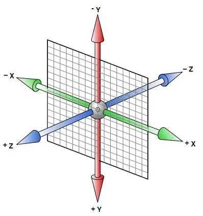

对于角度而言，`0°` 是 `x` 轴正向，默认是`顺时针`方向旋转。
注意 `arc` 传的是弧度参数，而不是我们常理解的 · 这种概念，因此我们需要将我们理解的 `360°` 转为`弧度`。

圆环的圆心就是 `canvas` 的中心，所以 `(x, y)` 取 `outerRadius` 的值就可以了。

代码如下：

```html
<!-- components/Progress.vue -->

<script lang="ts">
  import { computed, defineComponent, nextTick, onMounted, ref } from "vue";

  export default defineComponent({
    name: "Progress",
    props: {
      circleRadius: {
        type: Number,
        default: 40,
      },
      circleWidth: {
        type: Number,
        default: 2,
      },
      circleColor: {
        type: String,
        default: "#E5E5E5",
      },
      pointRadius: {
        type: Number,
        default: 6,
      },
    },
    setup(props) {
      const { circleRadius, circleWidth, circleColor, pointRadius } = props;
      // ...

      // deg 转弧度
      function deg2Arc(deg: number) {
        return (deg / 180) * Math.PI;
      }

      // 画圆环
      function drawCircle() {
        const ctx = canvasCtx.value as CanvasRenderingContext2D;

        ctx.strokeStyle = circleColor;
        ctx.lineWidth = circleWidth;
        ctx.beginPath();
        ctx.arc(outerRadius.value, outerRadius.value, circleRadius, 0, deg2Arc(360));
        ctx.stroke();
        ctx.closePath();
      }

      onMounted(async () => {
        // ...

        // 画圆环
        drawCircle();
      });

      // ...
    },
  });
</script>
```

看下效果：

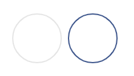

### 2.4 画文字

调用 `fillText` 绘制文字，利用 `canvas.clientWidth / 2` 和 `canvas.clientHeight / 2` 取得中点坐标，结合控制文字对齐的两个属性 `textAlign` 和 `textBaseline`，我们可以将文字绘制在画布中央。

```html
<!-- components/Progress.vue -->

<script lang="ts">
  // ...

  export default defineComponent({
    // ...
    props: {
      // ...
      showText: {
        type: Boolean,
        default: false,
      },
      fontSize: {
        type: Number,
        default: 14,
      },
      fontColor: {
        type: String,
        default: "#333",
      },
      formatText: {
        type: Function,
      },
    },
    setup(props) {
      // ...

      // 画文字
      function drawText() {
        const { showText, fontColor, fontSize } = props;
        const ctx = canvasCtx.value as CanvasRenderingContext2D;

        if (!showText) {
          return;
        }

        ctx.font = `${fontSize}px Arial,"Microsoft YaHei"`;
        ctx.fillStyle = fontColor;
        ctx.textAlign = "center";
        ctx.textBaseline = "middle";
        let text = "";
        if (typeof props.formatText === "function") {
          text = props.formatText();
        }
        ctx.fillText(text, outerRadius.value, outerRadius.value);
      }

      onMounted(async () => {
        // ...

        // 画文字
        drawText();
      });

      // ...
    },
  });
</script>
```

```html
<!-- App.vue -->

<script setup lang="ts">
  import Progress from "./components/Progress.vue";

  const formatText = () => {
    return "0%";
  };
</script>

<template>
  <progress></progress>
  <progress circleColor="#425990" :showText="true" :formatText="formatText"></progress>
</template>
```

看下效果：

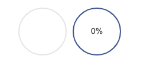

### 2.5 画进度狐

支持普通颜色和渐变色。

通过 `ctx.createLinearGradient()` 方法创建线性的渐变对象。
可使用该对象作为 `strokeStyle` 或 `fillStyle` 属性的值。
使用 `addColorStop()` 方法规定不同的颜色，以及在 `gradient` 对象中的何处定位颜色。

我们这里画一条从上到下的进度弧，即 `270°` 到 `90°`。

```html
<!-- components/Progress.vue -->
<script lang="ts">
  import { computed, defineComponent, nextTick, onMounted, ref } from "vue";

  interface IProgressLineColorStopsItem {
    percent: number;
    color: string;
  }

  export default defineComponent({
    name: "Progress",
    props: {
      // ...
      progressLineWidth: {
        type: Number,
        default: 8,
      },
      progressUseGradient: {
        type: Boolean,
        default: false,
      },
      progressLineColor: {
        type: String,
        default: "#3B77E3",
      },
      // 若 progressUseGradient 为 true，则需要定义此项
      progressLineColorStops: {
        type: Array,
        default: (): IProgressLineColorStopsItem[] => [
          { percent: 0, color: "#13CDE3" },
          { percent: 1, color: "#3B77E3" },
        ],
      },
    },
    setup(props) {
      const {
        // ...
        progressUseGradient,
        progressLineColorStops,
      } = props;
      // ...
      const progressGradient = ref<null | CanvasGradient>(null);

      // ...

      // 初始化 canvas
      function initCanvas() {
        canvasCtx.value = (canvasRef.value as HTMLCanvasElement).getContext("2d") as CanvasRenderingContext2D;

        // 设置渐变色
        if (progressUseGradient) {
          progressGradient.value = canvasCtx.value.createLinearGradient(
            circleRadius,
            0,
            circleRadius,
            circleRadius * 2,
          );
          (progressLineColorStops as IProgressLineColorStopsItem[]).forEach((item) => {
            (progressGradient.value as CanvasGradient).addColorStop(item.percent, item.color);
          });
        }
      }

      // ...

      // 画进度弧线
      function drawProgressLine() {
        const { progressUseGradient, progressLineColor, progressLineWidth } = props;
        const ctx = canvasCtx.value as CanvasRenderingContext2D;

        ctx.strokeStyle = progressUseGradient ? (progressGradient.value as CanvasGradient) : progressLineColor;
        ctx.lineWidth = progressLineWidth;
        ctx.lineCap = "round";
        ctx.beginPath();
        ctx.arc(outerRadius.value, outerRadius.value, circleRadius, deg2Arc(270), deg2Arc(90));
        ctx.stroke();
        ctx.closePath();
      }

      onMounted(async () => {
        // ...

        // 画进度弧线
        drawProgressLine();
      });

      // ...
    },
  });
</script>
```

```html
<!-- App.vue -->
<template>
  <progress></progress>
  <progress circleColor="#425990" :showText="true" :formatText="formatText" :progressUseGradient="true"></progress>
</template>
```

看下效果：

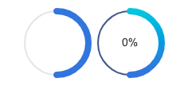

### 2.6 画弧度区间

根据起始角度和百分比来确定终止角度。

代码如下：

```html
<!-- components/Progress.vue -->
<script lang="ts">
  // ...

  export default defineComponent({
    name: "Progress",
    props: {
      // ...
      // 开始角度
      startDeg: {
        type: Number,
        default: 270,
        validator: (value: number) => {
          return value >= 0 && value < 360;
        },
      },
      // 百分比
      percentage: {
        type: Number,
        default: 50,
        validator: (value: number) => {
          return value >= 0 && value <= 100;
        },
      },
    },
    setup(props) {
      // ...

      // 根据开始角度和进度百分比求取目标角度
      function getTargetDegByPercentage(percentage: number) {
        if (percentage === 100) {
          return startDeg + 360;
        } else {
          const targetDeg = (startDeg + (360 * percentage) / 100) % 360;
          return targetDeg;
        }
      }
      // ...

      // 画进度弧线
      function drawProgressLine() {
        // ...
        const nextDeg = getTargetDegByPercentage(percentage);
        const startArc = deg2Arc(startDeg);
        const nextArc = deg2Arc(nextDeg);

        // ...
        ctx.arc(outerRadius.value, outerRadius.value, circleRadius, startArc, nextArc);
        // ...
      }
      // ...
    },
  });
</script>
```

```html
<!-- App.vue -->
<template>
  <progress></progress>
  <progress circleColor="#425990" :showText="true" :formatText="formatText" :progressUseGradient="true"></progress>
  <progress
    circleColor="#425990"
    :showText="true"
    :formatText="formatText"
    :progressUseGradient="true"
    :startDeg="0"
    :percentage="30"
  ></progress>
</template>
```

看下效果：

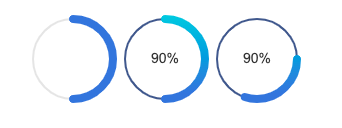

### 2.7 画进度圆点

我们先写死一个角度 `90°`。

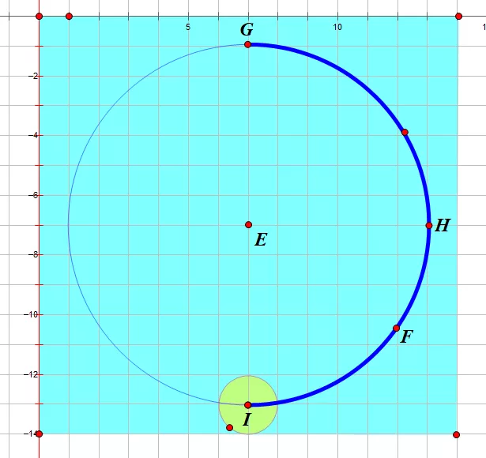

由上图，显而易见，圆点坐标为 `(outerRadius, outerRadius + circleRadius)`。

代码如下：

```ts
function drawPointDeg90() {
  const ctx = canvasCtx.value as CanvasRenderingContext2D;
  const { pointColor, progressUseGradient } = props;

  ctx.fillStyle = progressUseGradient ? (progressGradient.value as CanvasGradient) : pointColor;
  ctx.beginPath();
  ctx.arc(outerRadius.value, outerRadius.value + circleRadius, pointRadius, 0, deg2Arc(360));
  ctx.fill();
  ctx.closePath();
}
```

看下效果：

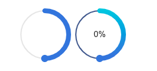

### 2.8 画弧度区间圆点

我们需要根据不同角度求得圆点的圆心坐标，可利用正余弦公式求坐标的思路来实现。

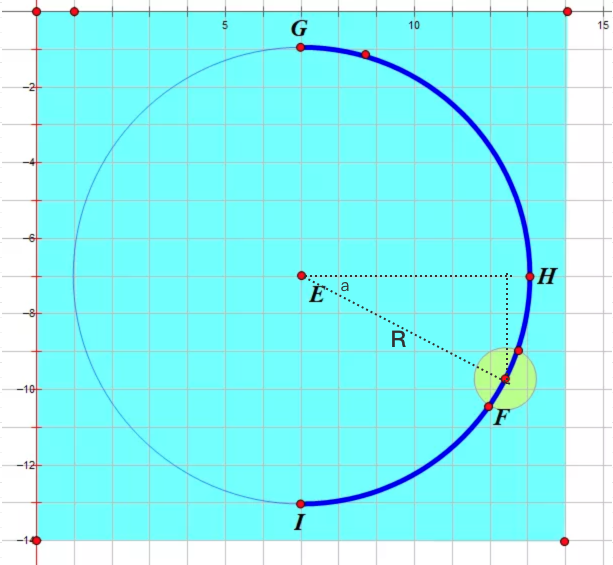

代码如下：

```html
<!-- components/Progress.vue -->
<script lang="ts">
  // ...

  export default defineComponent({
    // ...
    setup(props) {
      // ...

      // 根据角度获取圆点的位置
      function getPointPositionByDeg(deg: number) {
        let x = 0;
        let y = 0;
        if (deg >= 0 && deg <= 90) {
          // 0 ~ 90
          x = circleRadius * (1 + Math.cos(deg2Arc(deg)));
          y = circleRadius * (1 + Math.sin(deg2Arc(deg)));
        } else if (deg > 90 && deg <= 180) {
          // 90 ~ 180
          x = circleRadius * (1 - Math.cos(deg2Arc(180 - deg)));
          y = circleRadius * (1 + Math.sin(deg2Arc(180 - deg)));
        } else if (deg > 180 && deg <= 270) {
          // 180 ~ 270
          x = circleRadius * (1 - Math.sin(deg2Arc(270 - deg)));
          y = circleRadius * (1 - Math.cos(deg2Arc(270 - deg)));
        } else {
          // 270 ~ 360
          x = circleRadius * (1 + Math.cos(deg2Arc(360 - deg)));
          y = circleRadius * (1 - Math.sin(deg2Arc(360 - deg)));
        }
        return { x, y };
      }
      // ...

      // 画进度圆点
      function drawPoint() {
        // ...

        const nextDeg = getTargetDegByPercentage(percentage);
        const pointPosition = getPointPositionByDeg(nextDeg);

        // ...
        ctx.arc(pointPosition.x + pointRadius, pointPosition.y + pointRadius, pointRadius, 0, deg2Arc(360));
        // ...
      }

      onMounted(async () => {
        // ...

        // 画进度圆点
        drawPoint();
      });

      // ...
    },
  });
</script>
```

看下效果：

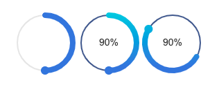

到这里，一个基本的 `canvas` 环形进度条就成型了。

## 3. 动画展示

### 3.1 基础动画

我们先简单实现一个线性的动画效果。
基本思路是把开始角度和结束角度的差值分为 `N` 段，利用 `window.requestAnimationFrame` 依次执行动画。

比如从 `30°` 到 `90°`，我给它分为 `6` 段，每次画 `10°`。要注意 canvas 画这种动画过程一般是要重复地清空画布并重绘的，所以第一次我画的弧线范围就是 `30° ~ 40°`，第二次我画的弧线范围就是 `30° ~ 50°`，以此类推......

```html
<!-- components/Progress.vue -->
<script lang="ts">
  // ...

  export default defineComponent({
    name: "Progress",
    props: {
      // ...
      animated: {
        type: Boolean,
        default: true,
      },
      // 若 animated 为 true，则需要定义此项
      duration: {
        type: Number,
        // 浏览器大约是 60FPS，因此 1s 大约执行 60 次 requestAnimationFrame
        // 默认 1 代表 1S 内渲染完毕，所以 0.5 代表 0.5S，2 代表 2S，以此类推。
        default: 1,
      },
    },
    setup(props) {
      // ...

      let animationId: number = 0;
      // ...
      // 动画绘制
      function animateDrawProgress(beginPercent: number, endPercent: number, stepNo: number, stepTotal: number) {
        const ctx = canvasCtx.value as CanvasRenderingContext2D;
        const canvasInstance = canvasRef.value as HTMLCanvasElement;

        ctx.clearRect(0, 0, canvasInstance.width, canvasInstance.height);

        const nextPercent = beginPercent + (endPercent - beginPercent) * (stepNo / stepTotal);
        const nextDeg = getTargetDegByPercentage(nextPercent);

        // 画圆环
        drawCircle();

        // 画文字
        drawText();

        // 画进度弧线
        drawProgressLine(nextDeg);

        // 画进度圆点
        drawPoint(nextDeg);

        if (stepNo !== stepTotal) {
          stepNo++;
          animationId = window.requestAnimationFrame(
            animateDrawProgress.bind(null, beginPercent, endPercent, stepNo, stepTotal),
          );
        } else {
          window.cancelAnimationFrame(animationId);
          animationId = 0;
        }
      }

      // 渲染内容
      function renderContent() {
        const { percentage, animated } = props;

        if (percentage === 0) {
          animateDrawProgress(0, 0, 0, 0);
        } else {
          if (animated) {
            // 用动画来画动态内容
            animateDrawProgress(0, percentage, 1, steps.value);
          } else {
            animateDrawProgress(0, percentage, steps.value, steps.value);
          }
        }
      }

      onMounted(async () => {
        // ...

        // 渲染内容
        renderContent();
      });

      // ...
    },
  });
</script>
```

看下效果：


### 3.2 缓动效果

线性动画显得有点单调，因此再引入贝塞尔缓动函数 `easing`，增强了可定制性，使用体验更好。

这里仅支持以下动画：

| 动画名称      | 特点                           | 描述                                                                                   |
| ------------- | ------------------------------ | -------------------------------------------------------------------------------------- |
| `linear`      | 匀速                           | 规定以相同速度开始至结束的过渡效果（等于 cubic-bezier(0,0,1,1)）。                     |
| `ease`        | 相对于匀速，中间快，两头慢     | 规定慢速开始，然后变快，然后慢速结束的过渡效果（等于 cubic-bezier(0.25,0.1,0.25,1)）。 |
| `ease-in`     | 相对于匀速，开始时慢，结束时快 | 规定以慢速开始的过渡效果（等于 cubic-bezier(0.42,0,1,1)）。                            |
| `ease-out`    | 相对于匀速，开始时快，结束时慢 | 规定以慢速结束的过渡效果（等于 cubic-bezier(0,0,0.58,1)）。                            |
| `ease-in-out` | 相对于匀速，两头慢             | 规定以慢速开始和结束的过渡效果（等于 cubic-bezier(0.42,0,0.58,1)）。                   |

代码实现：

```html
<!-- components/Progress.vue -->
<script lang="ts">
  // ...
  import BezierEasing from "bezier-easing";

  // ...

  const EASING_MAP = {
    linear: [0, 0, 1, 1] as const,
    ease: [0.25, 0.1, 0.25, 1] as const,
    "ease-in": [0.42, 0, 1, 1] as const,
    "ease-out": [0, 0, 0.58, 1] as const,
    "ease-in-out": [0.42, 0, 0.58, 1] as const,
  };

  type EASING_KEY = keyof typeof EASING_MAP;

  export default defineComponent({
    // ...
    props: {
      // ...
      easing: {
        type: String,
        default: "linear",
        validator: (value: string) => {
          return Object.keys(EASING_MAP).includes(value);
        },
      },
    },
    setup(props) {
      // ...
      const easingFunc = computed(() => {
        const easingInfo = EASING_MAP[easing as EASING_KEY];
        return BezierEasing(easingInfo[0], easingInfo[1], easingInfo[2], easingInfo[3]);
      });
      // ...

      // 动画绘制
      function animateDrawProgress(beginPercent: number, endPercent: number, stepNo: number, stepTotal: number) {
        // ...

        const nextPercent = beginPercent + (endPercent - beginPercent) * easingFunc.value(stepNo / stepTotal);
        const nextDeg = getTargetDegByPercentage(nextPercent);
        // ...
      }
      // ...
    },
  });
</script>
```

```html
<!-- App.vue -->
<template>
  <progress></progress>
  <progress circleColor="#425990" :showText="true" :formatText="formatText" :progressUseGradient="true"></progress>
  <progress
    circleColor="#425990"
    :showText="true"
    :formatText="formatText"
    :progressUseGradient="true"
    :startDeg="30"
    :percentage="50"
    easing="ease-in-out"
    :duration="2"
  ></progress>
</template>
```

看下效果：

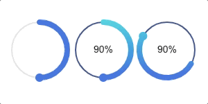

## 4. 自动检测 DPR

支持自动检测 `DPR`，解决高清屏模糊等问题。

```html
<!-- components/Progress.vue -->
<template>
  <canvas ref="canvasRef" :style="{ width: canvasSize + 'px', height: canvasSize + 'px' }"></canvas>
</template>

<script lang="ts">
  // ...

  export default defineComponent({
    // ...
    setup(props) {
      // ...

      // 处理 dpx
      function handleDpx() {
        const canvasInstance = canvasRef.value as HTMLCanvasElement;
        canvasCtx.value = canvasInstance.getContext("2d") as CanvasRenderingContext2D;

        const dpr = Math.max(window.devicePixelRatio, 1);
        // 调整画布物理像素
        canvasInstance.width = canvasSize.value * dpr;
        canvasInstance.height = canvasSize.value * dpr;
        // 同时用 scale 处理倍率
        canvasCtx.value.scale(dpr, dpr);
      }

      // 初始化 canvas
      function initCanvas() {
        // ...

        // 处理 dpx
        handleDpx();
      }
      // ...
    },
  });
</script>
```

## 5. 参考

- [数学与 canvas 碰撞出环形进度条](https://mp.weixin.qq.com/s/7Lc_AtWF2bUdpxAGeHnRJA)
- [vue-awesome-progress](https://github.com/cumt-robin/vue-awesome-progress)
