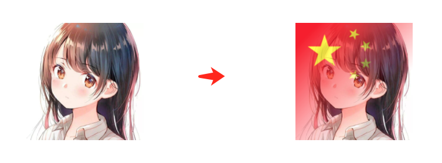
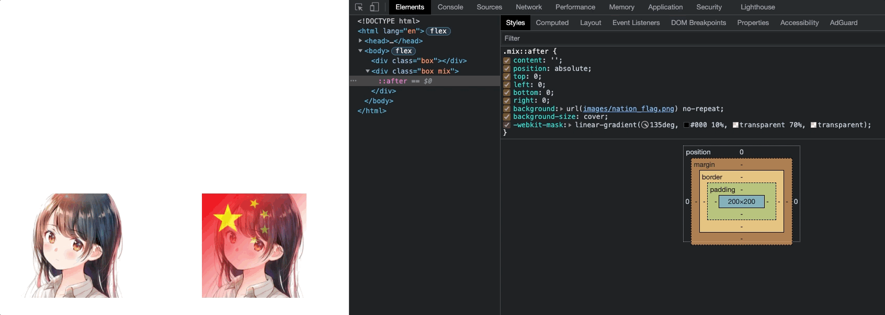
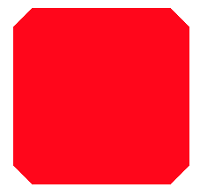
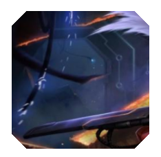
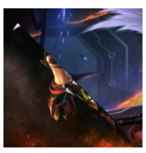
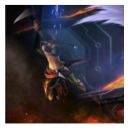
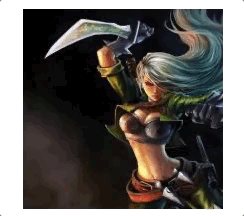

# CSS 实现头像与国旗的融合

## 1. 效果



## 2. 实现

在 `CSS` 中，我们仅仅需要将两张图片叠加在一起，对上层的图片使用 `mask` 属性，一行 `CSS` 代码即可实现该效果。

```html
<body>
  <div class="box"></div>
  <div class="box mix"></div>
</body>
```

```css
html,
body {
  width: 100%;
  height: 100%;
  display: flex;
  flex-direction: row;
  align-items: center;
  justify-content: space-around;
}
.box {
  position: relative;
  width: 200px;
  height: 200px;
  background: url(images/avatar.png) no-repeat;
  background-size: cover;
}
.mix::after {
  content: '';
  position: absolute;
  top: 0;
  left: 0;
  bottom: 0;
  right: 0;
  background: url(images/nation_flag.png) no-repeat;
  background-size: cover;
  -webkit-mask: linear-gradient(135deg, #000 10%, transparent 70%, transparent);
}
```

在上面的代码中，我们利用了 `div` 和它的一个伪元素 `div::after`，实现了将头像和国旗叠加在一起。

只需要在 `div::after` 中，设置一层 `mask` 遮罩 `mask: linear-gradient(110deg, #000 10%, transparent 70%, transparent)`，我们就可以实现头像与国旗的叠加：



## 3. Mask 介绍

顾名思义，`mask` 译为遮罩。
在 `CSS` 中，`mask` 属性允许使用者通过遮罩或者裁切特定区域的图片的方式来隐藏一个元素的部分或者全部可见区域。

### 3.1 语法

```css
* {
  mask: url(mask.png); /* 使用位图来做遮罩 */
  mask: url(masks.svg#star); /* 使用 SVG 图形中的形状来做遮罩 */
  mask: linear-gradient(#000, transparent); /* 使用渐变来做遮罩 */
}
```

### 3.2

#### 3.2.1 渐变遮罩

```html
<div class="box gradient-demo"></div>
```

```css
.gradient-demo {
  background: url(images/avatar.png);
  background-size: cover;
  -webkit-mask: linear-gradient(90deg, transparent, #fff);
}
```

应用了 mask 之后，头像就会变成这样：


这里得到了使用 `mask` 最重要结论：图片与 `mask` 生成的渐变的 `transparent` 的重叠部分，将会变得透明。

值得注意的是，上面的渐变使用的是 `linear-gradient(90deg, transparent, #fff)`，这里的 `#fff` 纯色部分其实换成任意颜色都可以，不影响效果。

#### 3.2.2 图片裁剪

使用线性渐变，我们实现一个简单的切角图形：

```html
<div class="box cut-nothing-demo"></div>
```

```css
.cut-nothing-demo {
  background: linear-gradient(135deg, transparent 15px, red 0) top left, linear-gradient(
        -135deg,
        transparent 15px,
        red 0
      ) top right, linear-gradient(-45deg, transparent 15px, red 0) bottom right, linear-gradient(
        45deg,
        transparent 15px,
        red 0
      ) bottom left;
  background-size: 50% 50%;
  background-repeat: no-repeat;
}
```

效果是这样：



我们将上述渐变运用到 `mask` 之上，而 `background` 替换成一张图片，就可以得到运用了切角效果的图片：

```css
.cut-demo {
  background: url(images/black_demo.png) no-repeat;
  background-size: cover;
  -webkit-mask: linear-gradient(135deg, transparent 15px, #fff 0) top left, linear-gradient(
        -135deg,
        transparent 15px,
        #fff 0
      ) top right, linear-gradient(-45deg, transparent 15px, #fff 0) bottom right, linear-gradient(
        45deg,
        transparent 15px,
        #fff 0
      ) bottom left;
  -webkit-mask-size: 50% 50%;
  -webkit-mask-repeat: no-repeat;
}
```



#### 3.2.3 拼图

假设我们有两张图片，使用 `mask`，可以很好将他们叠加在一起进行展示。最常见的一个用法：

```html
<div class="box multi-demo"></div>
```

```css
.multi-demo {
  position: relative;
  background: url(images/black_demo.png) no-repeat;
  background-size: cover;
}
.multi-demo::before {
  position: absolute;
  content: '';
  top: 0;
  left: 0;
  right: 0;
  bottom: 0;
  background: url(images/black_demo_02.png) no-repeat;
  background-size: cover;
  -webkit-mask: linear-gradient(45deg, #000 50%, transparent 50%);
}
```

两张图片，一张完全重叠在另外一张之上，然后使用 `mask: linear-gradient(45deg, #000 50%, transparent 50%)` 分割两张图片：



如果加上过渡效果：

```html
<div class="box multi-demo multi-gradient-demo"></div>
```

```css
.multi-gradient-demo::before {
  -webkit-mask: linear-gradient(45deg, #000 40%, transparent 60%);
}
```



#### 3.2.4 转场动画

我们通过动态的去改变 mask 的值来实现图片的显示/转场效果。

```html
<div class="box transfer-demo"></div>
```

```css
.transfer-demo {
  position: relative;
  background: url(images/black_demo.png) no-repeat;
}
.transfer-demo::before {
  position: absolute;
  content: '';
  top: 0;
  left: 0;
  right: 0;
  bottom: 0;
  background: url(images/black_demo_02.png);
  animation: maskRotate 1.2s ease-in-out;
}
@keyframes maskRotate {
  0% {
    -webkit-mask: linear-gradient(45deg, #000 0%, transparent 5%, transparent 1%);
  }
  /* ... */
  30% {
    -webkit-mask: linear-gradient(45deg, #000 30%, transparent 35%, transparent 1%);
  }
  /* ... */
  60% {
    -webkit-mask: linear-gradient(45deg, #000 60%, transparent 65%, transparent 1%);
  }
  /* ... */
  100% {
    -webkit-mask: linear-gradient(45deg, #000 100%, transparent 105%, transparent 1%);
  }
}
```

动画可通过 `SASS` 预处理器实现为：

```scss
@keyframes maskRotate {
  @for $i from 0 through 100 {
    #{$i}% {
      mask: linear-gradient(45deg, #000 #{$i + '%'}, transparent #{$i + 5 + '%'}, transparent 1%);
    }
  }
}
```



## 4. 参考

- [哦豁，一行代码实现头像与国旗的融合](https://mp.weixin.qq.com/s/xHa4XwwzO5D3D_OoCbpivg)
- [奇妙的 CSS MASK](https://github.com/chokcoco/iCSS/issues/80)
