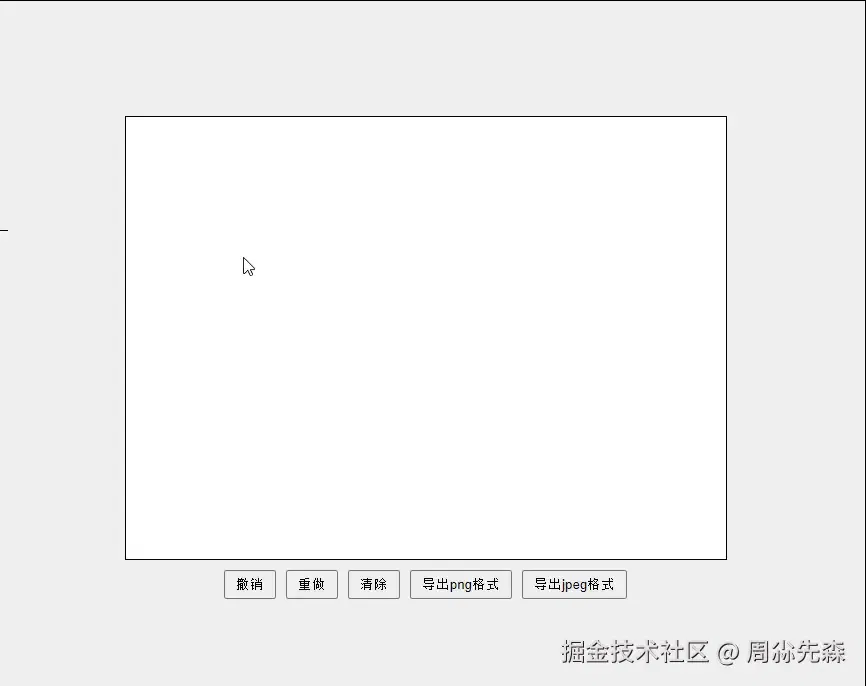

# JavaScript 实现电子签名

## 1. 预期效果



## 2. 开始

让我们使用纯 `HTML`、`CSS` 和 `JavaScript` 创建一个简单的签名板。

首先，`HTML` 文件 —— 在你的工作目录中创建一个 `index.html` 文件：

```html
<!doctype html>
<html lang="en">
  <head>
    <meta charset="UTF-8" />
    <meta name="viewport" content="width=device-width, initial-scale=1.0" />
    <title>JavaScript签名板</title>
    <link rel="stylesheet" href="styles.css" />
  </head>
  <body>
    <div class="signature-container">
      <canvas id="signature-pad" width="400" height="200"></canvas>
      <button id="clear">清除</button>
    </div>
    <script src="script.js"></script>
  </body>
</html>
```

我们将采用 `<canvas>` 标签来构建签名板。选择`画布`作为工具是因为它为我们提供了以下功能：

- 利用 `JavaScript` 实现自由手写，这对于获取签名是必不可少的。
- 对画布的外观和行为进行个性化定制，包括线条的颜色、粗细以及风格。
- 兼容多样的鼠标和触摸事件，捕捉用户在绘图、移动以及提笔或松手时的互动。
- 利用 `toDataURL` 方法将签名以图像形式导出（如 PNG 或 JPEG），这在保存签名或将其上传至服务器时非常有用。

接下来，我们将通过 `styles.css` 为这个页面添加一些样式，以提升其视觉效果。

```css
body {
  display: flex;
  justify-content: center;
  align-items: center;
  height: 100vh;
  background-color: #f0f0f0;
  margin: 0;
}
.signature-container {
  display: flex;
  flex-direction: column;
  align-items: center;
}
.signature-container canvas {
  border: 1px solid #000;
  background-color: #fff;
}
.signature-container button {
  margin-top: 10px;
  padding: 5px 10px;
  cursor: pointer;
}
```

然后向目录中添加一个 `script.js` 文件：

```js
document.addEventListener('DOMContentLoaded', () => {
  const canvas = document.getElementById('signature-pad');
  const ctx = canvas.getContext('2d');
  let drawing = false;
  canvas.addEventListener('mousedown', (e) => {
    drawing = true;
    ctx.beginPath();
    ctx.moveTo(e.offsetX, e.offsetY);
  });
  canvas.addEventListener('mousemove', (e) => {
    if (drawing) {
      ctx.lineTo(e.offsetX, e.offsetY);
      ctx.stroke();
    }
  });
  canvas.addEventListener('mouseup', () => {
    drawing = false;
  });
  canvas.addEventListener('mouseout', () => {
    drawing = false;
  });
  document.getElementById('clear').addEventListener('click', () => {
    ctx.clearRect(0, 0, canvas.width, canvas.height);
  });
});
```

让我们详细解释一下这段代码的工作原理：

- 我们首先通过 `canvas` 变量来绑定到页面上的 `<canvas>` 元素。
- 接着，`ctx` 变量用于获取该画布的 `2D` 渲染上下文，它包含了绘制图形所需的各种方法和属性。
- 当用户按下鼠标按钮时，我们通过一个 `mousedown` 事件监听器来触发绘图动作。此时，`ctx.beginPath()` 用于开启新的绘图路径，而 `ctx.moveTo(e.offsetX, e.offsetY)` 则将画笔定位到鼠标点击的准确位置。
- 用户移动鼠标时，`mousemove` 事件监听器会根据鼠标的当前位置绘制线条。`ctx.lineTo(e.offsetX, e.offsetY)` 命令画笔绘制一条直线到新位置，随后 `ctx.stroke()` 将这条线实际画到画布上。
- 为了结束绘图，我们设置了 `mouseup` 和 `mouseout` 两个事件监听器，分别在鼠标按钮释放和鼠标光标移出画布时停止绘图。此外，当用户点击清除按钮时，`ctx.clearRect(0, 0, canvas.width, canvas.height)` 用于清除整个画布，为新的绘图做准备。

## 3. 添加触摸支持

这个示例主要是为鼠标事件设置的，但它也可以很容易地扩展到支持触摸设备。以下是 `JavaScript` 处理触摸事件：

```js
document.addEventListener('DOMContentLoaded', () => {
  const canvas = document.getElementById('signature-pad');
  const ctx = canvas.getContext('2d');
  let drawing = false;

  function startDrawing(e) {
    drawing = true;
    ctx.beginPath();
    ctx.moveTo(
      e.offsetX || e.touches[0].clientX - canvas.offsetLeft,
      e.offsetY || e.touches[0].clientY - canvas.offsetTop
    );
  }

  function draw(e) {
    if (drawing) {
      ctx.lineTo(
        e.offsetX || e.touches[0].clientX - canvas.offsetLeft,
        e.offsetY || e.touches[0].clientY - canvas.offsetTop
      );
      ctx.stroke();
    }
  }

  function stopDrawing() {
    drawing = false;
  }

  // 鼠标事件
  canvas.addEventListener('mousedown', startDrawing);
  canvas.addEventListener('mousemove', draw);
  canvas.addEventListener('mouseup', stopDrawing);
  canvas.addEventListener('mouseout', stopDrawing);

  // 触摸事件
  canvas.addEventListener('touchstart', startDrawing);
  canvas.addEventListener('touchmove', draw);
  canvas.addEventListener('touchend', stopDrawing);
  canvas.addEventListener('touchcancel', stopDrawing);

  document.getElementById('clear').addEventListener('click', () => {
    ctx.clearRect(0, 0, canvas.width, canvas.height);
  });
});
```

对于触摸事件，使用 `e.touches[0].clientX` 和 `e.touches[0].clientY` 来获取触摸坐标。
为了考虑画布的位置，使用 `canvas.offsetLeft` 和 `canvas.offsetTop` 进行调整。

## 4. 自定义笔触效果

让我们给签名板增添一些新功能，比如让用户能够挑选不同的笔触效果。为此，我们将执行以下关键步骤：

- 在 HTML 代码中嵌入一个 `<select>` 标签，它将包含两个选项：`Pen` 和 `Brush`，从而让用户可以挑选他们喜欢的笔触风格。
- 为这些新增的控件编写相应的 `CSS` 样式，确保它们在页面上正确地显示。
- 为下拉选择菜单设置一个事件监听器，以便在用户选择不同的选项时，动态地改变笔触样式。
- 根据用户所选择的笔触样式，调整 `ctx.lineWidth（线宽）` 和 `ctx.lineCap（线帽形状）` 的值，以反映不同的视觉效果。

以下是需要添加到 `HTML` 文件中的代码片段：

```html
<div class="controls">
  <select id="stroke-style">
    <option value="pen">钢笔</option>
    <option value="brush">刷子</option>
  </select>
  <button id="clear">清除</button>
</div>
```

然后我们更新我们的 `CSS`：

```css
.signature-container .controls {
  margin-top: 10px;
  display: flex;
  gap: 10px;
}
.signature-container .controls button,
.signature-container .controls select {
  padding: 5px 10px;
  cursor: pointer;
}
```

最后，更新 `script.js`：

```js
document.getElementById('stroke-style').addEventListener('change', (e) => {
  strokeStyle = e.target.value;
  if (strokeStyle === 'pen') {
    ctx.lineWidth = 2;
    ctx.lineCap = 'round';
  }
  else if (strokeStyle === 'brush') {
    ctx.lineWidth = 5;
    ctx.lineCap = 'round';
  }
});

// 设置初始笔画样式
ctx.lineWidth = 2;
ctx.lineCap = 'round';
```

## 5. 处理响应性

当屏幕缩小时，签名板可能因为缺少响应式设计而无法正常工作。
为了改善这一点，我们可以增强应用的响应性，使其在小屏幕设备上也能轻松进行签名操作。

关键在于确保画布及其容器能够灵活适应不同的屏幕尺寸。这需要我们根据浏览器窗口的大小来动态调整画布的尺寸。

具体来说，我们需要做出以下调整：

- 为 `.signature-container` 设置一个灵活的宽度，比如占满 `90%` 的可用空间，并设定一个最大宽度限制，比如 `600` 像素。
- 将画布元素的宽度设置为 `width: 100%`，高度设置为 `height: auto`，以实现响应式效果。

在 `JavaScript` 代码中，我们需要执行以下操作：

- 创建一个名为 `resizeCanvas` 的函数，用以根据其容器尺寸的变化来调整画布的大小。
- 在页面加载时首先调用 `resizeCanvas` 函数，并在窗口大小发生变化时添加一个事件监听器，确保画布能够随着窗口大小的变化而动态调整尺寸。

按照上述说明，我们需要更新 `styles.css` 文件，以实现所需的样式调整。

```css
.signature-container {
  /* ... */
  width: 90%;
  max-width: 600px;
}

.signature-container canvas {
  /* ... */
  width: 100%;
  height: auto;
}
```

```js
function resizeCanvas() {
  canvas.width = canvas.offsetWidth;
  canvas.height = canvas.offsetHeight;
  // 设置初始笔画样式
  ctx.lineWidth = strokeStyle === 'pen' ? 2 : 5;
  ctx.lineCap = 'round';
}

// 初始画布设置
resizeCanvas();
window.addEventListener('resize', resizeCanvas);
```

## 6. 浏览器告警解决

`[Violation] Added non-passive event listener to a scroll-blocking 'touchstart' event. Consider marking event handler as 'passive' to make the page more responsive. See https://www.chromestatus.com/feature/5745543795965952`

`script.js:46 [Violation] Added non-passive event listener to a scroll-blocking 'touchmove' event. Consider marking event handler as 'passive' to make the page more responsive. See https://www.chromestatus.com/feature/5745543795965952`

改成以下代码：

```js
canvas.addEventListener('touchstart', startDrawing, { passive: true });
canvas.addEventListener('touchmove', draw, { passive: true });
```

告警即可消失。但因为在移动端，触摸事件触发的时候，会伴随着屏幕的振动，所以要禁用默认行为：

```js
function startDrawing(e) {
  e.preventDefault();
  // ...
}

function draw(e) {
  e.preventDefault();
  // ...
}
```

当 `passive` 选项设置为 `true` 时，浏览器将不会等待 `JavaScript` 代码执行完毕就开始滚动，这可以减少滚动的延迟，使页面感觉更加流畅。
但一个被动的事件监听器意味着它不会阻止事件的默认行为。例如，当一个触摸滚动事件 `touchstart` 或 `touchmove` 的监听器被设置为被动的时候，即使在事件处理函数中调用了 `event.preventDefault()`，也不会阻止页面的滚动。

所以，为了让默认行为禁用生效，需要再改为：

```js
canvas.addEventListener('touchstart', startDrawing, { passive: false });
canvas.addEventListener('touchmove', draw, { passive: false });
```

## 7. 缓存绘制

你可能会观察到，当改变浏览器窗口大小时，画布上的签名会消失，这是因为调整画布尺寸会自动清除其内容。
这是 `<canvas>` 元素的标准行为。不过，我们可以通过一些技巧来避免这个问题。

为了在缩放画布时保持签名的完整性，并且能够正确地对其进行缩放，我们需要先保存画布上的签名，然后在调整画布尺寸后再重新绘制它。
我们可以通过 `toDataURL` 方法来保存画布上的签名。

`HTMLCanvasElement.toDataURL()` 方法能够根据你指定的图片格式，将画布上的内容转换成一个数据 `URL`。
现在，让我们来看一下如何保存签名，以便在窗口大小调整后可以将其恢复。我们需要做的调整如下：

- 定义一个 `signatureData` 变量来存储签名的当前状态，以数据 `URL` 的形式。
- 修改 `resizeCanvas` 函数，使其能在调整画布大小时，先保存签名，再调整尺寸，并最终重新绘制签名。
- 创建一个 `Image` 对象来加载保存的签名，并在调整尺寸后的画布上将其恢复。
- 当完成绘画时，使用 `canvas.toDataURL()` 方法更新 `signatureData` 变量，以便存储当前的画布内容。
- 当用户点击清除按钮时，将 `signatureData` 变量重置为 `null`，以清除保存的签名数据。

实施了上述更改后，我们的 `JavaScript` 文件将如下所示：

```js
let signatureData = null;

function setStrokeStyle() {
  if (strokeStyle === 'pen') {
    ctx.lineWidth = 2;
    ctx.lineCap = 'round';
  }
  else if (strokeStyle === 'brush') {
    ctx.lineWidth = 5;
    ctx.lineCap = 'round';
  }
}

function resizeCanvas() {
  if (signatureData) {
    const img = new Image();
    img.src = signatureData;
    img.onload = function () {
      // 因为设置尺寸会清除画布内容，所以以下代码可不必要
      // ctx.clearRect(0, 0, canvas.width, canvas.height)
      canvas.width = canvas.offsetWidth;
      canvas.height = canvas.offsetHeight;

      // 缓存绘制内容
      ctx.drawImage(img, 0, 0, canvas.width, canvas.height);

      setStrokeStyle();
    };
  }
  else {
    // 默认会自动清除绘制内容
    canvas.width = canvas.offsetWidth;
    canvas.height = canvas.offsetHeight;
    setStrokeStyle();
  }
}

function stopDrawing() {
  // ...
  signatureData = canvas.toDataURL();
}

document.getElementById('clear').addEventListener('click', () => {
  // ...
  signatureData = null;
});

document.getElementById('stroke-style').addEventListener('change', (e) => {
  // ...
  setStrokeStyle();
});
```

## 8. 保存和导出

我们将进一步增强功能，允许用户将他们的签名以 `PNG` 或 `JPEG` 格式导出，且这些图片将拥有白色背景。为此，我们将执行以下步骤：

在 `HTML` 代码中增加两个按钮，分别用于将签名导出为 `PNG` 和 `JPEG` 文件。
开发一个名为 `exportCanvas` 的函数，该函数负责将画布内容（包括白色背景）导出。
这一过程涉及到创建一个新画布，将白色填充为背景色，然后将当前签名绘制上去，最后将其保存为 `PNG` 或 `JPEG` 文件。

以下是经过这些更改后的 `HTML` 代码示例：

```html
<div class="controls">
  <select id="stroke-style">
    <option value="pen">钢笔</option>
    <option value="brush">刷子</option>
  </select>
  <button id="clear">清除</button>
  <button id="export-png">导出 png 格式</button>
  <button id="export-jpeg">导出 jpeg 格式</button>
</div>
```

这是在添加之后 `JavaScript` 文件的样子：

```js
function exportCanvas(format) {
  const exportCanvas = document.createElement('canvas');
  exportCanvas.width = canvas.width;
  exportCanvas.height = canvas.height;
  const exportCtx = exportCanvas.getContext('2d');

  // 用白色填充背景
  exportCtx.fillStyle = '#fff';
  exportCtx.fillRect(0, 0, exportCanvas.width, exportCanvas.height);

  // 绘制签名
  exportCtx.drawImage(canvas, 0, 0);

  // 导出画布
  const dataURL = exportCanvas.toDataURL(`image/${format}`);
  const link = document.createElement('a');
  link.href = dataURL;
  link.download = `signature.${format}`;
  link.click();
}

document.getElementById('export-png').addEventListener('click', () => {
  exportCanvas('png');
});

document.getElementById('export-jpeg').addEventListener('click', () => {
  exportCanvas('jpeg');
});
```

## 9. 添加更多功能

通过引入外部库，我们可以简化签名板中一些复杂功能的实现过程。我们将采用 `signature_pad` 这个库，它非常出色，能够帮助我们轻松地实现之前讨论过的众多功能，并且它还能让我们生成更加流畅的签名效果。

首先，我们需要在 `HTML` 文档中引入 `signature_pad` 库：

```html
<script src="https://cdn.jsdelivr.net/npm/signature_pad@4.1.7/dist/signature_pad.umd.min.js"></script>
```

然后添加必要的按钮。这是最终 `HTML` 的样子：

```html
<!doctype html>
<html lang="en">
  <head>
    <meta charset="UTF-8" />
    <meta name="viewport" content="width=device-width, initial-scale=1.0" />
    <title>JavaScript签名板</title>
    <link rel="stylesheet" href="signature_pad.css" />
    <script src="https://cdn.jsdelivr.net/npm/signature_pad@4.1.7/dist/signature_pad.umd.min.js"></script>
  </head>

  <body>
    <div class="signature-container">
      <canvas id="signature-pad" width="600" height="400"> </canvas>
      <div class="controls">
        <button id="undo">undo 撤销</button>
        <button id="redo">redo 重做</button>
        <button id="clear">clear 清除</button>
        <button id="save-png">导出 png 格式</button>
        <button id="save-jpeg">导出 jpeg 格式</button>
      </div>
    </div>
    <script src="signature_pad.js"></script>
  </body>
</html>
```

更新样式：

```css
body {
  display: flex;
  justify-content: center;
  align-items: center;
  height: 100vh;
  background-color: #f0f0f0;
  margin: 0;
}

.signature-container {
  display: flex;
  flex-direction: column;
  align-items: center;
  width: 90%;
  max-width: 600px;
}

.signature-container canvas {
  border: 1px solid #000;
  background-color: #fff;
  width: 100%;
  height: auto;
}

.signature-container .controls {
  margin-top: 10px;
  display: flex;
  gap: 10px;
  flex-wrap: wrap;
}

.signature-container .controls button {
  padding: 5px 10px;
  cursor: pointer;
}
```

为了进一步完善我们的签名板功能，`script.js` 脚本需要进行以下更新：

- 实现两个栈，`undoStack` 和 `redoStack`，分别用来追踪撤销和重做的历史状态。
- 创建一个 `saveState` 函数，该函数负责将签名板的当前状态存储到撤销栈中。
- 定义 `undo` 和 `redo` 函数，分别用于执行撤销和重做的操作。

经过这些修改，`script.js` 脚本将具备完整的撤销和重做功能。以下是更新后的 `script.js` 脚本：

```js
document.addEventListener('DOMContentLoaded', () => {
  const canvas = document.getElementById('signature-pad');
  const signaturePad = new SignaturePad(canvas);
  let undoStack = [];
  let redoStack = [];

  function deepCopy(data) {
    return JSON.parse(JSON.stringify(data));
  }

  function saveState() {
    console.log('endStroke || signaturePad.toData:', signaturePad.toData());
    undoStack.push(deepCopy(signaturePad.toData()));
    redoStack = [];
  }
  // 撤销
  function undo() {
    if (undoStack.length > 0) {
      // 撤销后，支持重做操作恢复当前状态
      redoStack.push(deepCopy(signaturePad.toData()));

      // 因为停止绘制后，会自动保存当前状态，所以需要把当前状态给忽略
      undoStack.pop();

      // 重置为上一个状态
      signaturePad.clear();
      if (undoStack.length) {
        const lastStroke = undoStack[undoStack.length - 1];
        signaturePad.fromData(lastStroke, {
          clear: false,
        });
      }
    }
  }
  // 重做
  function redo() {
    if (redoStack.length > 0) {
      // 重做后，支持撤销操作恢复当前状态
      undoStack.push(deepCopy(signaturePad.toData()));

      const nextState = redoStack.pop();
      signaturePad.clear();
      signaturePad.fromData(nextState);
    }
  }

  document.getElementById('undo').addEventListener('click', undo);
  document.getElementById('redo').addEventListener('click', redo);
  document.getElementById('clear').addEventListener('click', () => {
    signaturePad.clear();
    undoStack = [];
    redoStack = [];
  });

  document.getElementById('save-png').addEventListener('click', () => {
    if (!signaturePad.isEmpty()) {
      const dataURL = signaturePad.toDataURL('image/png');
      const link = document.createElement('a');
      link.href = dataURL;
      link.download = 'signature.png';
      link.click();
    }
  });

  document.getElementById('save-jpeg').addEventListener('click', () => {
    if (!signaturePad.isEmpty()) {
      const dataURL = signaturePad.toDataURL('image/jpeg');
      const link = document.createElement('a');
      link.href = dataURL;
      link.download = 'signature.jpeg';
      link.click();
    }
  });

  // 绘图结束时保存状态
  signaturePad.addEventListener('endStroke', () => {
    saveState();
  });

  // 初始画布设置
  function resizeCanvas() {
    const ratio = Math.max(window.devicePixelRatio || 1, 1);

    canvas.width = canvas.offsetWidth * ratio;
    canvas.height = canvas.offsetHeight * ratio;
    canvas.getContext('2d').scale(ratio, ratio);

    signaturePad.clear(); // 否则 isEmpty() 可能会返回错误值

    if (undoStack.length > 0) {
      signaturePad.fromData(undoStack[undoStack.length - 1]);
    }
  }

  resizeCanvas();
  window.addEventListener('resize', resizeCanvas);
});
```

## 10. 参考

- [搞点有意思的，JavaScript 实现电子签名](https://mp.weixin.qq.com/s/EgX7RMd8V5dGHP-t3d_U0A)
- [JavaScript 实现签名板](https://juejin.cn/post/7428205122285879350)
