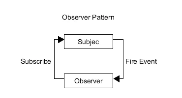
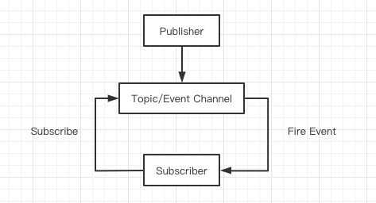

# 总结常用的几种设计模式 (JavaScript 版)


成文思路：分析每种设计模式思想、抽离出应用场景、对这些模式进行对比。

将不变的部分和变化的部分隔开是每个设计模式的主题。

## 1. 前言

> 在软体工程中, `设计模式 (design pattern)` 是对软体设计中普遍存在（反复出现）的各种问题，所提出的解决方案。
> 设计模式并不直接用来完成程式码的编写，而是描述在各种不同情况下，要怎么解决问题的一种方案。
> 设计模式能使不稳定转为相对稳定、具体转为相对抽象，避免会引起麻烦的紧耦合，以增强软体设计面对并适应变化的能力。
>
> ---- 维基百科

设计模式是一种软件开发的思想，有益于降低代码的耦合性，增强代码的健壮性。往往在大型项目中用的比较多。

> 软体工程，即为软件工程。台湾那边称软件为软体。

## 2. 单例模式

> 单例模式的定义是：保证一个类仅有一个实例，并提供一个访问它的全局访问点。

也叫单体模式，核心思想是确保一个类只对应一个实例。
单例模式是一种常用的模式，有一些对象我们往往只需要一个，比如线程池、全局缓存、浏 览器中的 `window` 对象等。

特点：

- 只允许一个例存在，提供全局访问点，缓存初次创建的变量对象；
- 排除全局变量，防止全局变量被重写；
- 可全局访问；
- 创建对象和管理单例的职责被分布在两个不同的方法中；

场景：

- 工厂模式和 `new` 模式实现单例模式；
- 适用于弹框的实现、 全局缓存、一个单一对象等。比如：弹窗，无论点击多少次，弹窗只应该被创建一次；
- `vue` 的安装插件属于单例模式；

### 2.1 直接使用字面量（全局对象）

```js
const person = {
  name: '哈哈',
  age: 18,
};
```

了解 `const` 语法的小伙伴都知道，这只喵是不能被重新赋值的，但是它里面的属性其实是可变的。

如果想要一个不可变的单例对象：

```js
const person = {
  name: '哈哈',
  age: 18,
};
Object.freeze(person);
```

这样就不能新增或修改 `person` 的任何属性。

如果是在模块中使用，上面的写法并不会污染全局作用域，但是`直接生成一个固定的对象缺少了一些灵活性`。

### 2.2 使用构造函数的静态属性

`class` 写法 / `构造函数` 写法：

```js
class A {
  constructor() {
    if (!A._singleton) {
      A._singleton = this;
    }
    return A._singleton;
  }
}

const a1 = new A();
const a2 = new A();
console.log(a1 === a2); // true
```

普通函数写法：

```js
function A(name) {
  // 如果已存在对应的实例
  if (typeof A._singleton === 'object') {
    return A._singleton;
  }
  // 否则正常创建实例
  this.name = name;

  // 缓存
  A._singleton = this;
  return this;
}

const a1 = new A();
const a2 = new A();
console.log(a1 === a2); // true
```

缺点：在于静态属性是能够被人为重写的，不过不会像全局变量那样被无意修改。

### 2.3 借助闭包

1. 考虑重写构造函数

当对象第一次被创建以后，重写构造函数，在重写后的构造函数里面访问私有变量：

```js
function A(name) {
  const instance = this;
  this.name = name;

  // 重写构造函数
  A = function () {
    return instance;
  };
  // 重写构造函数之后，实际上原先的A指针对应的函数还在内存中(因为instance变量还在被引用着)，但是此时A指针已经指向了一个新的函数了。
}

A.prototype.pro1 = 'from prototype1';
const a1 = new A();

A.prototype.pro2 = 'from prototype2';
const a2 = new A();

console.log(a1.pro1); // from prototype1
console.log(a1.pro2); // underfined
console.log(a2.pro1); // from prototype1
console.log(a2.pro2); // underfined
console.log(a1.constructor === A); // false
```

为了解决 A 指针指向新地址的问题，实现原型链继承：

```js
function A(name) {
  let instance = this;
  this.name = name;

  // 重写构造函数
  A = function () {
    return instance;
  };

  // 第一种写法，这里实际上实现了一次原型链继承，如果不想这样实现，也可以直接指向旧的原型
  A.prototype = this;
  // 或者 第二种写法，直接指向旧的原型
  A.prototype = this.constructor.prototype;

  instance = new A();

  // 调整构造函数指针
  instance.constructor = A;

  return instance;
}

A.prototype.pro1 = 'from prototype1';
const a1 = new A();

A.prototype.pro2 = 'from prototype2';
const a2 = new A();

console.log(a1.pro1); // from prototype1
console.log(a1.pro2); // from prototype2
console.log(a2.pro1); // from prototype1
console.log(a2.pro2); // from prototype2
```

2. 利用立即执行函数来保持私有变量

```js
let A
;(function () {
  let instance;
  A = function (name) {
    if (instance) {
      return instance;
    }

    // 赋值给私有变量
    instance = this;

    // 自身属性
    this.name = name;
  };
})();

A.prototype.pro1 = 'from prototype1';
const a1 = new A('a1');

A.prototype.pro2 = 'from prototype2';
const a2 = new A('a2');

console.log(a1.name); // a1
console.log(a1.pro1); // from protptype1
console.log(a1.pro2); // from protptype2
console.log(a1.name); // a2
console.log(a2.pro1); // from protptype1
console.log(a2.pro2); // from protptype2
```

以上通过闭包的方式可以实现单例。

### 2.4 代理实现单例模式

```js
function Singleton(name) {
  this.name = name;
}
const ProxySingleton = (function () {
  let instance = null;
  return function (name) {
    if (!instance) {
      instance = new Singleton(name);
    }
    return instance;
  };
})();

const a1 = new ProxySingleton('a1');
const a2 = new ProxySingleton('a2');

console.log(a1.name); // a1
console.log(a2.name); // a1
console.log(a1 === a2); // true
```

### 2.5 工厂单例

```js
let logger = null;
class Logger {
  log(...args) {
    console.log(...args);
  }
}
function CreateLogger() {
  if (!logger) {
    logger = new Logger();
  }
  return logger;
}

const a = new CreateLogger().log('123'); // 123
const b = new CreateLogger().log('456'); // 456

console.log(new CreateLogger()); // Logger {}
console.log(a === b); // true
```

### 2.6 总结

根据平时的开发经验，自己更偏向于用代理方式实现，更易理解且可读性更好。

## 3. 工厂模式

### 3.1 简单工厂模式

简单工厂模式又叫静态工厂模式，由一个工厂对象决定创建某一种产品对象类的实例。
主要用来创建同一类对象。

> 场景：在实际的项目中，我们常常需要根据用户的权限来渲染不同的页面，高级权限的用户所拥有的页面有些是无法被低级权限的用户所查看。

```js
// User类
class User {
  // 构造器
  constructor(options) {
    this.name = options.name;
    this.viewPageList = options.viewPageList;
  }

  // 静态方法
  static getInstance(role) {
    switch (role) {
      case 'admin':
        return new User({ name: '管理员', viewPageList: ['首页', '应用数据', '权限管理'] });
      case 'user':
        return new User({ name: '普通用户', viewPageList: ['首页', '应用数据'] });
      default:
        throw new Error('参数错误 || 可选参数：admin、user');
    }
  }
}

// 调用
const admin = User.getInstance('admin');
const normalUser = User.getInstance('user');
```

> `User` 就是一个简单工厂，在该函数中有 `2` 个实例中分别对应不同的权限的用户。
> 当我们调用工厂函数时，只需要传递 `admin`, `user` 这 `2` 个可选参数中的一个获取对应的实例对象。

简单工厂的 `优点在于`，你只需要一个正确的参数，就可以获取到你所需要的对象，而无需知道其创建的具体细节。

但是在函数内包含了所有对象的创建逻辑（构造函数）和判断逻辑的代码。
每增加新的构造函数还需要修改判断逻辑代码。
当我们的对象不是 `3` 个而是 `30` 个或更多时，这个函数会成为一个庞大的超级函数，便得难以维护。

所以，简单工厂只能作用于创建的对象数量较少，对象的创建逻辑不复杂时使用。

### 3.2 工厂方法模式

工厂方法模式的本意是将`实际创建对象的工作推迟到子类`中，这样核心类就变成了抽象类。
但是在 `JavaScript` 中很难像传统面向对象那样去实现创建抽象类。

所以在 `JavaScript` 中我们只需要参考它的核心思想即可。
我们可以将工厂方法看作是一个实例化对象的工厂类。

虽然 `ES6` 也没有实现 `abstract`, 但是我们可以使用 `new.target` 来模拟出抽象类。
`new.target` 指向直接被 `new` 执行的构造函数，我们对 `new.target` 进行判断，如果指向了该类则抛出错误来使得该类成为抽象类。

刚才提到，工厂方法我们只把它看作是一个实例化对象的工厂，它只做实例化对象这一件事情！

```js
class User {
  constructor(name = '', viewPageList = []) {
    if (new.target === User) {
      throw new Error('抽象类不能实例化!');
    }
    this.name = name;
    this.viewPageList = viewPageList;
  }
}

class UserFactory extends User {
  constructor(name, viewPageList) {
    super(name, viewPageList);
  }

  create(role) {
    switch (role) {
      case 'admin':
        return new UserFactory('管理员', ['首页', '应用数据', '权限管理']);
      case 'user':
        return new UserFactory('普通用户', ['首页', '应用数据', '权限管理']);
      default:
        throw new Error('参数错误 || 可选参数：admin、user');
    }
  }
}

const userFactory = new UserFactory();
const admin = userFactory.create('admin');
const user = userFactory.create('user');
```

### 3.3 抽象工厂模式

上面介绍了简单工厂模式和工厂方法模式都是直接生成实例，但是抽象工厂模式不同，抽象工厂模式并不直接生成实例， 而是用于对`产品类簇`的创建。

上面例子中的 `admin`，`user` 两种用户角色，其中 `user` 可能是使用不同的社交媒体账户进行注册的，例如：`wechat`，`qq`，`weibo`。
那么这三类社交媒体账户就是对应的类簇。

在抽象工厂中，类簇一般用父类定义，并在父类中定义一些抽象方法，再通过抽象工厂让子类继承父类。
所以，抽象工厂其实是实现子类继承父类的方法。

```js
function getAbstractUserFactory(type) {
  switch (type) {
    case 'wechat':
      return UserOfWechat;
    case 'qq':
      return UserOfQq;
    case 'weibo':
      return UserOfWeibo;
    default:
      throw new Error('参数错误, 可选参数: wechat, qq, weibo');
  }
}

const WechatUserClass = getAbstractUserFactory('wechat');
const QqUserClass = getAbstractUserFactory('qq');
const WeiboUserClass = getAbstractUserFactory('weibo');

const wechatUser = new WechatUserClass('微信小李');
const qqUser = new QqUserClass('QQ小李');
const weiboUser = new WeiboUserClass('微博小李');
```

### 3.4 总结

- 简单工厂模式又叫静态工厂方法，用来创建某一种产品对象的实例，用来创建单一对象；
- 工厂方法模式是将创建实例推迟到子类中进行；
- 抽象工厂模式是对类的工厂抽象用来创建产品类簇，不负责创建某一类产品的实例。

#### 3.4.1 什么时候会用工厂模式？

将 new 操作简单封装，遇到 new 的时候就应该考虑是否用工厂模式。

#### 3.4.2 工厂模式的好处？

举个例子：

- 去购买汉堡，直接点餐、取餐、不会自己亲自做；
  买者不关注汉堡是怎么做的。
- 商店要封装做汉堡的工作，做好直接给买者；
  商家也不会告诉你是怎么做的，也不会傻到给你一片面包，一些奶油，一些生菜让你自己做。

外部不许关心内部构造器是怎么生成的，只需调用一个工厂方法生成一个实例即可；

> 构造函数和创建者分离，符合开放封闭原则。

#### 3.4.3 实战

- `jQuery` 的 `$(selector)`

  jQuery 中 `$('div')` 和 `new $('div')` 哪个好用，很显然直接 `$()` 最方便，这是因为 `$()` 已经是一个工厂方法了；

  ```js
  class jQuery {
    constructor(selector) {
      // super(selector)
    }
    //  ....
  }

  window.$ = function (selector) {
    // eslint-disable-next-line new-cap
    return new jQuery(selector);
  };
  ```

- `React` 的 `createElement()`

  `React.createElement()` 方法就是一个工厂方法。

  ```js
  const profile = React.createElement(
    'div',
    null,
    React.createElement('img', { src: 'avatar.png', className: 'profile' }),
    React.createElement('h3', null, [user.firstName, user.lastName].join(' '))
  );
  ```

  等价于 `JSX` 模板：

  ```jsx
  const profile = (
    <div>
      
      <h3>{[user.firstName, user.lastName].join(' ')}</h3>
    </div>
  );
  ```

  源码解析：

  ```js
  class Vnode {
    constructor(tag, attrs, children) {
      //  ....
    }
    //  ....
  }

  React.createElement = function (tag, attrs, children) {
    return new Vnode(tag, attrs, children);
  };
  ```

## 4. 观察者模式与发布订阅模式

### 4.1 什么是观察者模式？

**先举一个简单的例子：**

毕业前，很多同学都会说类似于这样的话：

“老王，等你结婚了，记得叫我来喝喜酒！”

于是有一天你真的要结婚了，且需要举办酒席，这时候你需要通知你的你的那些老友来喝喜酒。
于是你拿起了手机给你的那些分布于世界各地的好朋友打起了电话，说了结婚酒席一事。

到了酒席那天，有的朋友来了，有的人没来礼却到了，有的呢只有简短的两句祝福，剩下的只有推脱。

**这就是观察者模式。**



在观察者模式中，目标与观察者相互独立，又相互联系：

- 两者都是相互独立的对象个体。
- 观察者在目标对象中订阅事件，目标对象广播发布事件。

就像之前的例子一样：

- 老王就是模式中所谓的目标。
- 同学们在毕业前说的话就相当于在目标对象上订阅事件。
- 老王打电话通知朋友就是发布事件。
- 同学们各自作出了不同的行动回应。

这么说我们的代码就慢慢建立起来了。

首先我们需要定义两个对象：

1. 目标对象：Subject；
2. 观察者对象：Observer；

并且在目标对象中要存放观察者对象的引用，就像老王要存放同学的手机好一样，只有存了才能联系嘛。
于是我们有了下面的代码：

```js
function Subject() {
  this.observers = [];
}
function Observer() {}
```

对于目标对象中的引用，我们必须可以动态的控制：

```js
Subject.prototype.addObserver = function (observer) {
  this.observers.push(observer);
};

Subject.prototype.removeObserver = function (observer) {
  this.observers.splice(this.observers.indexOf(observer), 1);
};
```

现在我们就要考虑发布消息的功能函数了。

首先必须明确一点：目标对象并不能指定观察者对象做出什么相应的变化。
目标对象只有通知的作用。就像老王只能告诉朋友他要办喜酒了，至于朋友接下来怎么办，则全是朋友自己决定的。

所以我们得写一个目标广播消息的功能函数：

```js
Subject.prototype.notify = function (context) {
  const observerCount = this.observers.length;
  for (let i = 0; i < observerCount; i++) {
    this.observers[i].update(context);
  }
};
```

我们将具体的观察者对象作出的变化交给了观察者对象自己去处理。
这就要求观察者对象需要拥有自己的 update(context) 方法来作出改变，同时该方法不应该写在原型链上，因为每一个实例化后的 Observer 对象所做的响应都是不同的，需要独立存储 update(context)方法：

```js
function Observer() {
  this.update = function () {
    // ...
  };
}
```

到此我们就完成了一个简单的观察者模式的构建。

**完整代码：**

```js
function ObserverList() {
  this.observerList = [];
}

ObserverList.prototype.add = function (obj) {
  return this.observerList.push(obj);
};

ObserverList.prototype.count = function () {
  return this.observerList.length;
};

ObserverList.prototype.get = function (index) {
  if (index > -1 && index < this.observerList.length) {
    return this.observerList[index];
  }
};

ObserverList.prototype.indexOf = function (obj, startIndex) {
  let i = startIndex;

  while (i < this.observerList.length) {
    if (this.observerList[i] === obj) {
      return i;
    }
    i++;
  }
  return -1;
};

ObserverList.prototype.removeAt = function (index) {
  this.observerList.splice(index, 1);
};

function Subject() {
  this.observers = new ObserverList();
}

Subject.prototype.addObserver = function (observer) {
  this.observers.add(observer);
};

Subject.prototype.removeObserver = function (observer) {
  this.observers.removeAt(this.observers.indexOf(observer, 0));
};

Subject.prototype.notify = function (context) {
  const observerCount = this.observers.count();
  for (let i = 0; i < observerCount; i++) {
    this.observers.get(i).update(context);
  }
};

// The Observer
function Observer() {
  this.update = function () {
    // ...
  };
}
```

### 4.2 什么是发布订阅模式？

**先举个简单的例子：**

我们生活中，特别是在一线城市打拼的年轻人，与租房的联系再密切不过了。同时我们的身边也有很多租房中介。

某天路人甲需要租一套三室一厅一厨一卫的房，他找到了中介问了问有没有。
中介看了看发现并没有他要的房型，于是和路人甲说：“等有房东提供了此类房型的时候再联系你。”于是你就回去等消息了。

有一天，某一位房东将自己多余的房屋信息以及图片整理好发给中介，中介看了看，这不就是路人甲要的房型吗。
于是立马打电话让路人甲看房。最终撮合了一单生意。

**这就是发布订阅模式。**



可以看出，在发布订阅模式中最重要的是 `Topic/Event Channel (Event)` 对象。我们可以简单的称之为“中介”。

这个中介对象中既要接受发布者所发布的消息，又要将消息派发给订阅者。
所以中介还应该按照不同的事件储存相应的订阅者信息。

首先我们先会给中介对象的每个订阅者对象一个标识。每当有一个新的订阅者订阅事件的时候，我们就给一个 `subUid`。

我们先来写一下`中介对象 (pubsub)`：

```js
const pubsub = {}
;(function (myObject) {
  const topics = {};
  const subUid = -1;

  // 发布消息
  myObject.publish = function () {};
  // 订阅消息
  myObject.subscribe = function () {};
  // 取消订阅
  myObject.unsubscribe = function () {};
})(pubsub);
```

这里我们用了工厂模式来创建我们的中介对象。

**我们先把订阅功能实现：**

首先我们必须认识到 topics 对象将存放着如下类型的数据：

```js
topics = {
  topicA: [
    {
      token: subuid,
      function: func,
    },
    // ...
  ],
  topicB: [
    {
      token: subuid,
      function: func,
    },
    // ...
  ],
  // ...
};
```

对于 topics 对象，存放在许多不同的`事件名称(topicA...)`，对于每一个事件都有指定的一个数组对象用以存放订阅该事件的订阅对象及发生事件之后作出的响应。

所以当有订阅对象在中介中订阅事件时：

```js
myObject.subscribe = function (topic, func) {
  // 如果不存在相应事件就创建一个
  if (!topics[topic]) {
    topics[topic] = [];
  }
  // 将订阅对象信息记录下来
  const token = (++subUid).toString();
  topics[topic].push({
    token,
    func,
  });
  // 返回订阅者标识，方标在取消订阅的时候使用
  return token;
};
```

**接下来我们来实现取消订阅的功能：**

我们只需要遍历 topics 各个事件中的对象即可。

```js
myObject.unsubscribe = function (token) {
  for (const m in topics) {
    if (topics[m]) {
      for (let i = 0, j = topics[m].length; i < j; i++) {
        if (topics[m][i].token === token) {
          topics[m].splice(i, 1);
          return token;
        }
      }
    }
  }
  return this;
};
```

**剩下的就是发布事件的实现了：**

我们只需要给定事件名称 topic 和相应的参数即可，找到相应事件所对应的订阅者列表，遍历调用列表中的方法。

```js
myObject.publish = function (topic, args) {
  if (!topics[topic]) {
    return false;
  }
  const subscribers = topics[topic];
  let len = subscribers ? subscribers.length : 0;
  while (len--) {
    subscribers[len].func(args);
  }
  return this;
};
```

至此，我们的中介对象就完成了。在发布订阅模式中我们不必在意发布者和订阅者。

### 4.3 二者的区别和联系

**区别：**

- 观察者模式中需要观察者对象自己定义事件发生时的相应方法。
- 发布订阅模式者在发布对象和订阅对象之中加了一个中介对象。我们不需要在乎发布者对象和订阅者对象的内部是什么，具体响应事件细节全部由中介对象实现。

**联系：**

- 二者都降低了代码的耦合性。
- 都具有消息传递的机制，以数据为中心的设计思想。

### 4.4 实战

1. 事件监听

> 事件监听是我们经常用到的功能，其实它的实现就是源自于发布订阅模式：

```js
subject.addEventListener('click', () => {
  // ...
});
```

2. 以 JS 动态更新模板渲染为例

假如我们有如下模板需要渲染：

```js
const template = `<span><% this.value %></span>`;
```

该模板依赖的数据源如下：

```js
const data = {
  value: 0,
};
```

现假若 data 中的 value 是动态的，每隔一秒加 1：

```js
setInterval(() => {
  data.value++;
}, 1000);
```

同时我们也要在页面上发生变化，这时你可能写出如下代码：

```js
setInterval(() => {
  data.value++;
  document.body.innerHTML = TemplateEngine(template, data);
}, 1000);
```

我们可以对比一下发布订阅模式的实现：

```js
const template = `<span><% this.value %></span>`;
const data = {
  value: 0,
};
function render() {
  document.body.innerHTML = TemplateEngine(template, data);
}
window.onload = function () {
  // 初始化渲染
  render();

  pubsub.subscribe('change', render); // 订阅更新渲染的消息
  setInterval(() => {
    data.value++;
    pubsub.publish('change'); // 发布更新事件
  }, 1000);
};
```

前者似乎看起来很简单明了，但是：

- 不同功能紧密耦合，如果以后要修改该功能，很可能牵一发而动全身。
- 往往实际开发中我们的订阅者不止一个，发布者的消息也不止一个，远远比这个例子的逻辑复杂的多。剪不断，理还乱。

相比之下，发布订阅模式就显得逻辑清晰，已于维护。

## 5. 装饰者模式

> Elapsed Time

### 5.1 什么是装饰者模式？

装饰者模式是一种为函数或类增添特性的技术，它可以让我们在不修改原来对象的基础上，为其增添新的能力和行为。
它本质上也是一个函数(在 `Javascipt` 中，类也只是函数的语法糖)。

### 5.2 我们什么时候可以用到它呢？

我们来假设一个场景，一个自行车商店有几种型号的自行车，现在商店允许用户为每一种自行车提供一些额外的配件，比如前灯、尾灯、铃铛等。
每选择一种或几种配件都会影响自行车的售价。

如果按照比较传统的创建子类的方式，就等于我们目前有一个自行车基类，而我们要为每一种可能的选择创建一个新的类。
可是由于用户可以选择一种或者几种任意的配件，这就导致最终可能会生产几十上百个子类，这明显是不科学的。

然而，对这种情况，我们可以使用装饰者模式来解决这个问题。

自行车的基类如下：

```js
class Bicycle {
  wash() {} // 清洗
  ride() {} // 骑车
  // 其它方法
  getPrice() {
    return 200;
  }
}
```

那么我们可以先创建一个装饰者模式基类：

```js
class BicycleDecotator {
  constructor(bicycle) {
    this.bicycle = bicycle;
  }

  /**
   * 以下为实现基类方法
   */
  wash() {
    return this.bicycle.wash();
  }

  ride() {
    return this.bicycle.ride();
  }

  getPrice() {
    return this.bicycle.getPrice();
  }
}
```

这个基类其实没有做什么事情，它只是接受一个 Bicycle 实例，实现其对应的方法，并且将调用其方法返回而已。

有了这个基类之后，我们就可以根据我们的需求对原来的 Bicycle 类为所欲为了。
比如我可以创建一个添加了前灯的装饰器以及添加了尾灯的装饰器：

```js
class HeadLightDecorator extends BicycleDecorator {
  constructor(bicycle) {
    super(bicycle);
  }

  getPrice() {
    return this.bicycle.getPrice() + 20;
  }
}
class TailLightDecorator extends BicycleDecorator {
  constructor(bicycle) {
    super(bicycle);
  }

  getPrice() {
    return this.bicycle.getPrice() + 20;
  }
}
```

那么，接下来我们就可以来对其自由组合了：

```js
let bicycle = new Bicycle();
console.log(bicycle.getPrice()); // 200
bicycle = new HeadLightDecorator(bicycle); // 添加了前灯的自行车
console.log(bicycle.getPrice()); // 220
bicycle = new TailLightDecorator(bicycle); // 添加了前灯和尾灯的自行车
console.log(bicycle.getPrice()); // 240
```

这样写的好处是什么呢？

假设说我们有 `10` 个配件，那么我们只需要写 `10` 个配件装饰器，然后就可以任意搭配成不同配件的自行车并计算价格。
而如果是按照子类的实现方式的话, `10` 个配件可能就需要有几百个甚至上千个子类了。

从例子中我们可以看出装饰者模式的适用场合：

- 如果你需要为类 `增添特性或职责`，可是从类派生子类的解决方法并不太现实的情况下，就应该使用装饰者模式。
- 在例子中，我们并没有对原来的 Bicycle 基类进行修改，因此也不会对原有的代码产生副作用。
  我们只是在原有的基础上增添了一些功能。
  因此，**如果想为对象增添特性又不想改变使用该对象的代码的话，则可以采用装饰者模式**。

装饰者模式除了可以应用在类上之外，还可以应用在函数上（其实这就是高阶函数）。

比如，我们想测量函数的执行时间，那么我可以写这么一个装饰器：

```js
function func() {
  console.log('func');
}
function timeProfileDecorator(func) {
  return function (...args) {
    const startTime = new Date();
    func.call(this, ...args);
    const elapsedTime = new Date().getTime() - startTime.getTime();
    console.log(`该函数消耗了${elapsedTime}ms`);
  };
}
const newFunc = timeProfileDecorator(func);
console.log(newFunc());
```

### 5.3 实战

既然知道了装饰者模式可以在不修改原来代码的情况下为其增添一些新的功能，那么我们就可以来做一些有趣的事情。

**我们可以为一个类的方法提供性能分析的功能：**

```js
class TimeProfileDecorator {
  constructor(component, keys) {
    this.component = component;
    this.timers = {};
    const self = this;
    for (const i in keys) {
      const key = keys[i];
      if (typeof component[key] === 'function') {
        self[key] = function (...args) {
          self.startTimer(key);
          component[key]?.(...args);
          self.logTimer(key);
        };
      }
    }
  }

  startTimer(namespace) {
    this.timers[namespace] = new Date();
  }

  logTimer(namespace) {
    const elapsedTime = new Date().getTime() - this.timers[namespace].getTime();
    console.log(`该函数消耗了${elapsedTime}ms`);
  }
}
// example
class Test {
  constructor() {
    this.name = 'Jony';
    this.age = 22;
  }

  sayName() {
    console.log(this.name);
  }

  sayAge() {
    console.log(this.age);
  }
}

let test1 = new Test();
test1 = new TimeProfileDecorator(test1, ['sayName', 'sayAge']);
console.log(test1.sayName());
console.log(test1.sayAge());
```

**对函数进行增强：**

1. 节流函数 or 防抖函数

```js
// 节流
function throttle(func, delay) {
  const self = this;
  let tid;
  return function (...args) {
    // delay 时间内不会重复执行
    if (tid) {
      return;
    }
    tid = setTimeout(() => {
      func.call(self, ...args);
      tid = null;
    }, delay);
  };
}

// 防抖
function debounce(func, delay) {
  const self = this;
  let tid;
  return function (...args) {
    // delay 时间内共用一个计时器
    if (tid) {
      clearTimeout(tid);
    }
    tid = setTimeout(() => {
      func.call(self, ...args);
      tid = null;
    }, delay);
  };
}
```

2. 缓存函数返回值

```js
// 缓存函数结果，对于一些计算量比较大的函数效果比较明显。
function memorize(func) {
  const cache = {};
  return function (...args) {
    const key = JSON.stringify(args);
    if (cache[key]) {
      console.log('缓存中返回');
      return cache[key];
    }
    const result = func.call(this, ...args);
    cache[key] = result;
    return result;
  };
}

function fib(num) {
  return num < 2 ? num : fib(num - 1) + fib(num - 2);
}

const enhanceFib = memorize(fib);
console.log(enhanceFib(40));
console.log(enhanceFib(40)); // > 缓存中返回
```

### 5.4 总结

使用装饰者模式可以让我们为原有的类和函数增添新的功能，并且不会修改原有的代码或者改变其调用方式，因此不会对原有的系统带来副作用。
我们也不用担心原来系统会因为它而失灵或者不兼容。

## 6. 代理模式

### 6.1 什么是代理模式

`代理模式(Proxy Pattern)` 是程序设计中的一种设计模式。

在现实生活中, `proxy` 是一个被授权代表其他人的人。比如，授权他人办理业务。

你很可能听说过 `proxy` 服务器，它会接收来自你这的所有流量，代表你发送给另一端，并把响应返回给你。
当你不希望请求的目的地知道你请求的具体来源时，使用 `proxy` 服务器就很有用了。
所有的目标服务器看到的只是来自 `proxy` 服务器的请求。

再接近本文的主题一些，这种类型的代理和 `ES6 proxy` 要做的就很类似了，涉及到使用`类(B)`去包装`类(A)`并拦截/控制对`类(A)`的访问。

当你想进行以下操作时 `proxy` 模式通常会很有用：

- 拦截或控制对某个对象的访问；
- 通过隐藏事务或辅助逻辑来减小方法/类的复杂性；
- 防止在未经验证/准备的情况下执行重度依赖资源的操作；

> 当一个复杂对象的多份副本须存在时，代理模式可以结合享元模式以减少内存用量。
> 典型作法是创建一个复杂对象及多个代理者，每个代理者会引用到原本的复杂对象。而作用在代理者的运算会转送到原本对象。
> 一旦所有的代理者都不存在时，复杂对象会被移除。
>
> 维基百科

而在 `JavaScript` 中代理模式的具体表现形式就是 `ES6` 中的新增对象---`Proxy`。

### 6.2 ES6 中的代理模式

`ES6` 所提供 `Proxy` 构造函数能够让我们轻松的使用代理模式：

```js
const proxy = new Proxy(target, handler);
```

`Proxy`, 作为构造函数, `Proxy` 接受两个参数。

- 第一个参数是所要代理的目标对象（上例是一个空对象），即如果没有 `Proxy` 的介入，操作原来要访问的就是这个对象；
- 第二个参数是一个配置对象，对于每一个被代理的操作，需要提供一个对应的处理函数，该函数将拦截对应的操作。

`Proxy` 的具体使用方法，可参考这里[《 ECMAScript 入门 - Proxy 》](https://es6.ruanyifeng.com/#docs/proxy)。

`Proxy` 构造器可以在全局对象上访问到。
通过它，你可以有效的拦截针对对象的各种操作，收集访问的信息，并按你的意愿返回任何值。
从这个角度来说, `proxy` 和中间件有很多相似之处。

```js
let dataStore = {
  name: 'Billy Bob',
  age: 15,
};

const handler = {
  get(target, key, proxy) {
    const today = new Date();
    console.log(`GET request made for ${key} at ${today}`);
    return Reflect.get(target, key, proxy);
  },
};

dataStore = new Proxy(dataStore, handler);

// 这会执行我们的拦截逻辑，记录请求并把值赋给`name`变量
const name = dataStore.name; // > GET request made for name at Wed Jul 07 2021 10:28:01 GMT+0800 (中国标准时间)
```

具体来说, `proxy` 允许你拦截许多对象上常用的方法和属性，最常见的有 `get`, `set`, `apply(针对函数)` 和 `construct(针对使用 new 关键字调用的构造函数)`。

`Proxy` 还可以配置成随时停止接受请求，有效的取消所有针对被代理的目标对象的访问。这可以通过一个 `revoke` 方法实现。

### 6.3 代理模式常用场景

#### 6.3.1 剥离验证逻辑

一个把 `Proxy` 用于验证的例子，验证一个数据源中的所有属性都是同一类型。
下面的例子中我们要确保每次给 `numericDataStore` 数据源设置一个属性时，它的值必须是数字。

```js
let numericDataStore = {
  count: 0,
  amount: 1234,
  total: 14,
};

numericDataStore = new Proxy(numericDataStore, {
  set(target, key, value, proxy) {
    if (typeof value !== 'number') {
      throw new TypeError('Properties in numericDataStore can only be numbers');
    }
    return Reflect.set(target, key, value, proxy);
  },
});

// 这会抛出异常
numericDataStore.count = 'foo';

// 这会设置成功
numericDataStore.count = 333;
```

这很有意思，但有多大的可能性你会创建一个这样的对象呢？肯定不会。。。

如果你想为一个对象上的部分或全部属性编写自定义的校验规则，代码可能会更复杂一些。

但 `Proxy` 可以帮你把校验代码与核心代码分离开。

```js
// 定义一个接收自定义校验规则并返回一个 proxy 的校验器
function createValidator(target, validators) {
  return new Proxy(target, {
    _validators: validators,
    set(target, key, value, proxy) {
      if (Object.prototype.hasOwnProperty.call(target, key)) {
        const validator = this._validators[key];
        if (validator(value)) {
          return Reflect.set(target, key, value, proxy);
        }
        else {
          throw new Error(`Cannot set ${key} to ${value}. Invalid.`);
        }
      }
      else {
        // 防止创建一个不存在的属性
        throw new Error(`${key} is not a valid property`);
      }
    },
  });
}

// 定义每个属性的校验规则
const personValidators = {
  name(val) {
    return typeof val === 'string';
  },
  age(val) {
    return typeof age === 'number' && age >= 0;
  },
};
class Person {
  constructor(name, age) {
    this.name = name || '';
    this.age = age || 0;
    return createValidator(this, personValidators);
  }
}

const bill = new Person();

// 以下的操作都会抛出异常
bill.name = 0; // Uncaught Error: Cannot set name to 0. Invalid.
bill.age = 'Bill'; // > Uncaught Error: Cannot set age to Bill. Invalid.
```

通过这种方式，你就可以无限的扩展校验规则而不用修改类或方法。

再说一个和校验有关的小技巧。
假设你想检查传给一个方法的参数并在传入的参数与函数签名不符时输出一些有用的帮助信息。你可以通过 `Proxy` 实现此功能，而不用修改该方法的代码。

```js
let obj = {
  pickyMethodOne(obj, str, num) {
    /* ... */
  },
};

const argTypes = {
  pickyMethodOne: ['object', 'string', 'number'],
};

obj = new Proxy(obj, {
  get(target, key, proxy) {
    const value = target[key];
    return function (...args) {
      console.log('ddd', args);
      const checkArgs = argChecker(key, args, argTypes[key]);
      return Reflect.apply(value, target, args);
    };
  },
});

function argChecker(name, args, checkers) {
  for (let idx = 0; idx < args.length; idx++) {
    const arg = args[idx];
    const type = checkers[idx];
    if (!arg || typeof arg !== type) {
      console.warn(`You are incorrectly implementing the signature of ${name}. Check param ${idx + 1}`);
    }
  }
}

// 不会输出警告信息
obj.pickyMethodOne();

obj.pickyMethodOne('');
// > You are incorrectly implementing the signature of pickyMethodOne. Check param 1

// 不会输出警告信息
obj.pickyMethodOne({}, 'a little string', 123);
```

再看一个表单验证的例子。
`Proxy` 构造函数第二个参数中的 `set` 方法，可以很方便的验证向一个对象的传值。
我们以一个传统的登录表单举例，该表单对象有两个属性，分别是 `account` 和 `password`, 每个属性值都有一个简单和其属性名对应的验证方法，验证规则如下：

```js
// 表单对象
const userForm = {
  account: '',
  password: '',
};

// 验证方法
const validators = {
  account(value) {
    // account 只允许为中文
    const re = /^[\u4E00-\u9FA5]+$/;
    return {
      valid: re.test(value),
      error: '"account" is only allowed to be Chinese',
    };
  },

  password(value) {
    // password 的长度应该大于6个字符
    return {
      valid: value.length >= 6,
      error: '"password "should more than 6 character',
    };
  },
};
```

下面我们来使用 Proxy 实现一个通用的表单验证器：

```js
function getValidateProxy(target, validators) {
  return new Proxy(target, {
    _validators: validators,
    set(target, prop, value) {
      if (value === '') {
        console.error(`"${prop}" is not allowed to be empty`);
        return (target[prop] = false);
      }
      const validResult = this._validators[prop](value);
      if (validResult.valid) {
        return Reflect.set(target, prop, value);
      }
      else {
        console.error(`${validResult.error}`);
        return (target[prop] = false);
      }
    },
  });
}

const userFormProxy = getValidateProxy(userForm, validators);
userFormProxy.account = '123'; // "account" is only allowed to be Chinese
userFormProxy.password = 'he'; // "password "should more than 6 character
```

我们调用 `getValidateProxy` 方法去生成了一个代理对象 `userFormProxy`, 该对象在设置属性的时候会根据 `validators` 的验证规则对值进行校验。
这我们使用的是 `console.error` 抛出错误信息，当然我们也可以加入对 `DOM` 的事件来实现页面中的校验提示。

#### 6.3.2 真正的私有属性

在 `JavaScript` 中常见的做法是在属性名之前放一个`下划线`来标识该属性仅供内部使用。
但这并不能阻止其他人读取或修改它。

在下面的例子中，有一个我们想在 `api` 对象内部访问的 `apiKey` 变量，但我们并不想该变量可以在对象外部访问到。

```js
const api = {
  _apiKey: '123abc456def',
  /* mock methods that use this._apiKey */
  getUsers() {},
  getUser(userId) {},
  setUser(userId, config) {},
};

// logs '123abc456def';
console.log('An apiKey we want to keep private', api._apiKey);

// get and mutate _apiKeys as desired
const apiKey = api._apiKey;
api._apiKey = '987654321';
```

通过使用 `ES6 Proxy`, 可以实现真实，完全的私有属性。

如，可以使用一个 `proxy` 来截获针对某个属性的请求并作出限制或是直接返回 `undefined`。

```js
let api = {
  _apiKey: '123abc456def',
  /* mock methods that use this._apiKey */
  getUsers() {},
  getUser(userId) {},
  setUser(userId, config) {},
};

// Add other restricted properties to this array
const RESTRICTED = ['_apiKey'];

api = new Proxy(api, {
  get(target, key, proxy) {
    if (RESTRICTED.includes(key)) {
      throw new Error(`get ${key} is restricted. Please see api documentation for further info.`);
    }
    return Reflect.get(target, key, proxy);
  },
  set(target, key, value, proxy) {
    if (RESTRICTED.includes(key)) {
      throw new Error(`set ${key} is restricted. Please see api documentation for further info.`);
    }
    return Reflect.set(target, key, value, proxy);
  },
});

// throws an error
console.log(api._apiKey);
// > Uncaught Error: get _apiKey is restricted. Please see api documentation for further info.

// throws an error
api._apiKey = '987654321';
// > Uncaught Error: set _apiKey is restricted. Please see api documentation for further info.
```

#### 6.3.3 默默的记录对象访问

针对那些重度依赖资源，执行缓慢或是频繁使用的方法或接口，你可能喜欢统计它们的使用或是性能。
`Proxy` 可以很容易的悄悄在后台做到这一点。

> 注意：你不能仅仅使用 `apply` 来拦截方法。任何使用当你要执行某个方法时，你首先需要 `get` 这个方法。
> 因此，如果你要拦截一个方法调用，你需要先拦截对该方法的 `get` 操作，然后拦截 `apply` 操作。

```js
let api = {
  _apiKey: '123abc456def',
  getUsers() {
    /* ... */
  },
  getUser(userId) {
    /* ... */
  },
  setUser(userId, config) {
    /* ... */
  },
};

api = new Proxy(api, {
  get(target, key, proxy) {
    const value = target[key];
    return function (...args) {
      logMethodAsync(new Date(), key);
      return Reflect.apply(value, target, args);
    };
  },
});

function logMethodAsync(timestamp, method) {
  setTimeout(() => {
    console.log(`${timestamp} - Logging ${method} request asynchronously.`);
  }, 0);
}

// executes apply trap in the background
api.getUsers();
// > Wed Jul 07 2021 14:51:19 GMT+0800 (中国标准时间) - Logging getUsers request asynchronously.
```

这很酷，因为你可以记录各种各样的信息而不用修改应用程序的代码或是阻塞代码执行。
并且只需要在这些代码的基础上稍加修改就可以记录特性函数的执行性能了。

#### 6.3.4 给出提示信息或是阻止特定操作

假设你想阻止其他人删除 `noDelete` 属性，想让调用 `oldMethod` 方法的人知道该方法已经被废弃，或是想阻止其他人修改 `doNotChange` 属性。以下是一种快捷的方法。

```js
let dataStore = {
  noDelete: 1235,
  oldMethod() {
    /* ... */
  },
  doNotChange: 'tried and true',
};

const NODELETE = ['noDelete'];
const DEPRECATED = ['oldMethod'];
const NOCHANGE = ['doNotChange'];

dataStore = new Proxy(dataStore, {
  set(target, key, value, proxy) {
    if (NOCHANGE.includes(key)) {
      throw new Error(`Error! ${key} is immutable.`);
    }
    return Reflect.set(target, key, value, proxy);
  },
  deleteProperty(target, key) {
    if (NODELETE.includes(key)) {
      throw new Error(`Error! ${key} cannot be deleted.`);
    }
    return Reflect.deleteProperty(target, key);
  },
  get(target, key, proxy) {
    if (DEPRECATED.includes(key)) {
      console.warn(`Warning! ${key} is deprecated.`);
    }
    const val = target[key];

    return typeof val === 'function'
      ? function (...args) {
        Reflect.apply(target[key], target, args);
      }
      : val;
  },
});

// these will throw errors or log warnings, respectively

dataStore.doNotChange = 'foo';
// > Uncaught Error: Error! doNotChange is immutable.

delete dataStore.noDelete;
// > Uncaught Error: Error! noDelete cannot be deleted.

dataStore.oldMethod();
// > Warning! oldMethod is deprecated.
```

#### 6.3.5 防止不必要的资源消耗操作--缓存代理

下面我们以没有经过任何优化的计算斐波那契数列的函数来假设为开销很大的方法，这种递归调用在计算 `40` 以上的斐波那契项时就能明显的感到延迟感。

```js
function getFib(number) {
  if (number <= 2) {
    return 1;
  }
  else {
    return getFib(number - 1) + getFib(number - 2);
  }
}
```

现在我们来写一个创建缓存代理的工厂函数：

```js
function getCacheProxy(fn, cache = new Map()) {
  return new Proxy(fn, {
    apply(target, context, args) {
      const argsString = args.join(' ');
      if (cache.has(argsString)) {
        // 如果有缓存,直接返回缓存数据
        console.log(`输出${args}的缓存结果: ${cache.get(argsString)}`);
        return cache.get(argsString);
      }
      const result = fn(...args);
      cache.set(argsString, result);
      return result;
    },
  });
}

const getFibProxy = getCacheProxy(getFib);
getFibProxy(40); // 102334155
getFibProxy(40); // 输出40的缓存结果: 102334155
```

当我们第二次调用 `getFibProxy(40)` 时, `getFib` 函数并没有被调用，而是直接从 `cache` 中返回了之前被缓存好的计算结果。
通过加入缓存代理的方式, `getFib` 只需要专注于自己计算斐波那契数列的职责，缓存的功能使由 `Proxy` 对象实现的。
这实现了我们之前提到的`单一职责原则`。

#### 6.3.6 即时撤销对敏感数据的访问

`Proxy` 支持随时撤销对目标对象的访问。
当你想彻底封锁对某些数据或 `API` 的访问时(比如，出于安全，认证，性能等原因)，这可能会很有用。

以下是一个使用 `revocable` 方法的简单例子。注意当你使用它时，你不需要对 `Proxy` 方法使用 `new` 关键字。

```js
const sensitiveData = {
  username: 'John',
};
const handler = {};

const { proxy, revoke } = Proxy.revocable(sensitiveData, handler);

function handleSuspectedHack() {
  revoke();
}

// logs 'John'
console.log(proxy.username);

handleSuspectedHack();

// TypeError: Revoked
console.log(proxy.username);
// > Uncaught TypeError: Cannot perform 'get' on a proxy that has been revoked
```

### 6.4 总结

在面向对象的编程中，代理模式的合理使用能够很好的体现下面两条原则：

- 单一职责原则:
  面向对象设计中鼓励将不同的职责分布到细粒度的对象中, `Proxy` 在原对象的基础上进行了功能的衍生而又不影响原对象，符合松耦合高内聚的设计理念。
- 开放-封闭原则：
  代理可以随时从程序中去掉，而不用对其他部分的代码进行修改，在实际场景中，随着版本的迭代可能会有多种原因不再需要代理，那么就可以容易的将代理对象换成原对象的调用

对于代理模式 `Proxy` 的作用主要体现在三个方面：

1. 拦截和监视外部对对象的访问；
2. 降低函数或类的复杂度；
3. 在复杂操作前对操作进行校验或对所需资源进行管理；

## 7. 策略模式

### 7.1 概念

策略模式指的是定义一系列的算法，把它们一个个封装起来。
将不变的部分和变化的部分隔开是每个设计模式的主题，策略模式也不例外，策略模式的目的就是将算法的使用与算法的实现分离开来。

一个基于策略模式的程序至少由两部分组成。

- 第一个部分是一组策略类，策略类封装了具体 的算法，并负责具体的计算过程。
- 第二个部分是环境类 `Context`, `Context` 接受客户的请求，随后 把请求委托给某一个策略类。要做到这点，说明 `Context` 中要维持对某个策略对象的引用。

**优缺点**

优点：

- 策略模式利用组合、委托和多态等技术和思想，可以有效地避免多重条件选择语句。
- 策略模式提供了对开放—封闭原则的完美支持，将算法封装在独立的 `strategy` 中，使得它们易于切换，易于理解，易于扩展。
- 策略模式中的算法也可以复用在系统的其他地方，从而避免许多重复的复制粘贴工作。
- 在策略模式中利用组合和委托来让 `Context` 拥有执行算法的能力，这也是继承的一种更轻便的替代方案。

缺点：

- 增加许多策略类或者策略对象，但实际上这比把它们负责的逻辑堆砌在 `Context` 中要好。
- 要使用策略模式，必须了解所有的 `strategy`, 必须了解各个 `strategy` 之间的不同点，这样才能选择一个合适的 `strategy`。

### 7.2 实例

> 以计算奖金为例。

**粗糙的实现**

```js
const calculateBonus = function (performanceLevel, salary) {
  if (performanceLevel === 'S') {
    return salary * 4;
  }
  if (performanceLevel === 'A') {
    return salary * 3;
  }
  if (performanceLevel === 'B') {
    return salary * 2;
  }
};

console.log(calculateBonus('B', 20000)); // > 40000
console.log(calculateBonus('S', 6000)); // > 24000
```

缺点：

- `calculateBonus` 函数比较庞大，包含了很多 `if-else` 语句；
- `calculateBonus` 函数缺乏弹性，如果增加了一种新的绩效等级 `C`, 或者想把绩效 `S` 的奖金 系数改为 `5`, 那我们必须深入 `calculateBonus` 函数的内部实现，这是违反开放-封闭原则的。；
- 算法的复用性差；

**使用组合函数重构代码**

```js
const performanceS = function (salary) {
  return salary * 4;
};
const performanceA = function (salary) {
  return salary * 3;
};
const performanceB = function (salary) {
  return salary * 2;
};

const calculateBonus = function (performanceLevel, salary) {
  if (performanceLevel === 'S') {
    return performanceS(salary);
  }
  if (performanceLevel === 'A') {
    return performanceA(salary);
  }
  if (performanceLevel === 'B') {
    return performanceB(salary);
  }
};
console.log(calculateBonus('A', 10000)); // > 30000
```

问题依然存在: `calculateBonus` 函数有可能越来越庞大，而且在系统变化的时候缺乏弹性。

**使用策略模式重构代码**

- `JavaScript` 版本的策略模式

  > 在 `JavaScript` 语言中，函数也是对象，所以更简单和直接的做法是把 `strategy` 直接定义为函数。

  ```js
  const strategies = {
    S(salary) {
      return salary * 4;
    },
    A(salary) {
      return salary * 3;
    },
    B(salary) {
      return salary * 2;
    },
  };
  const calculateBonus = function (level, salary) {
    return strategies[level](salary);
  };

  console.log(calculateBonus('S', 20000)); // 输出：80000
  console.log(calculateBonus('A', 10000)); // 输出：30000
  ```

- `ES6` 类实现

  ```js
  const PerformanceS = function () {};
  PerformanceS.prototype.calculate = function (salary) {
    return salary * 4;
  };
  const PerformanceA = function () {};
  PerformanceA.prototype.calculate = function (salary) {
    return salary * 3;
  };
  const PerformanceB = function () {};
  PerformanceB.prototype.calculate = function (salary) {
    return salary * 2;
  };

  // 接下来定义奖金类 Bonus
  class Bonus {
    constructor() {
      this.salary = null; // 原始工资
      this.strategy = null; // 绩效等级对应的策略对象
    }

    setSalary(salary) {
      this.salary = salary; // 设置员工的原始工资
    }

    setStrategy(strategy) {
      this.strategy = strategy; // 设置员工绩效等级对应的策略对象
    }

    getBonus() {
      // 取得奖金数额
      return this.strategy.calculate(this.salary); // 把计算奖金的操作委托给对应的策略对象
    }
  }

  const bonus = new Bonus();
  bonus.setSalary(10000);

  bonus.setStrategy(new PerformanceS()); // 设置策略对象
  console.log(bonus.getBonus()); // > 40000

  bonus.setStrategy(new PerformanceA()); // 设置策略对象
  console.log(bonus.getBonus()); // > 30000
  ```

## 8. 建造者模式

**应用场景：**

- 创建时有很多必填参数需要验证。
- 创建时参数求值有先后顺序、相互依赖。
- 创建有很多步骤，全部成功才能创建对象。

**实例**

```js
class Programmer {
  constructor(options = {}) {
    this.age = options.age;
    this.username = options.username;
    this.color = options.color;
    this.area = options.area;
  }

  toString() {
    console.log(JSON.stringify(this));
  }
}

class Builder {
  build() {
    if (this.age && this.username && this.color && this.area) {
      return new Programmer(this);
    }
    else {
      throw new Error('缺少信息');
    }
  }

  setAge(age) {
    if (age > 18 && age < 36) {
      this.age = age;
      return this;
    }
    else {
      throw new Error('年龄不合适');
    }
  }

  setUsername(username) {
    if (username !== '小明') {
      this.username = username;
      return this;
    }
    else {
      throw new Error('小明不合适');
    }
  }

  setColor(color) {
    if (color !== 'yellow') {
      this.color = color;
      return this;
    }
    else {
      throw new Error('yellow不合适');
    }
  }

  setArea(area) {
    this.area = area;
    return this;
  }
}

const p = new Builder().setAge(10);
// > Uncaught Error: 年龄不合适

const q = new Builder().setAge(20).setUsername('小红').setColor('red').setArea('china').build().toString();
// > {"age":20,"username":"小红","color":"red","area":"china"}
```

## 9. 参考

- [总结常用的几种设计模式](https://juejin.cn/post/6953872475537014820)
- [JavaScript 设计模式与实践--工厂模式](https://juejin.cn/post/6844903653774458888)
- [JavaScript 设计模式之观察者模式与发布订阅模式](https://juejin.cn/post/6844903832443584525)
- [JavaScript 设计模式与实践--代理模式](https://juejin.cn/post/6844903656882438151)
- [js 设计模式--策略模式](https://juejin.cn/post/6844903751225081864)
