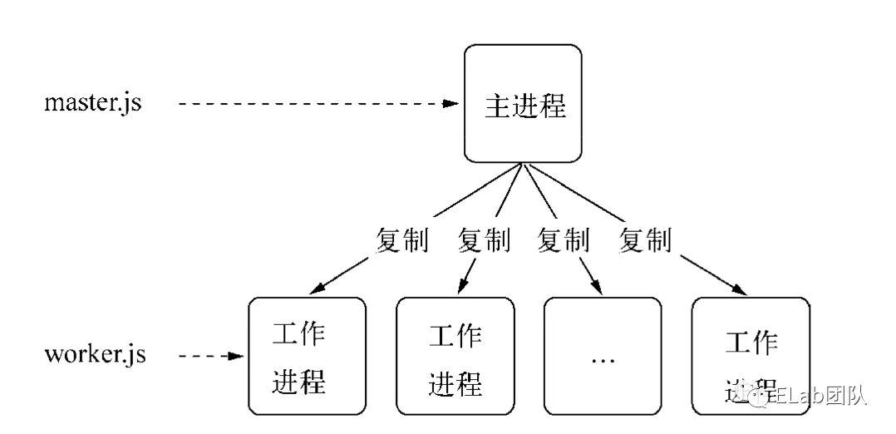
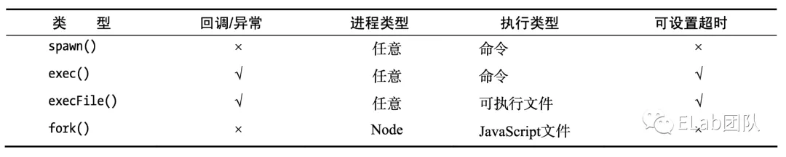
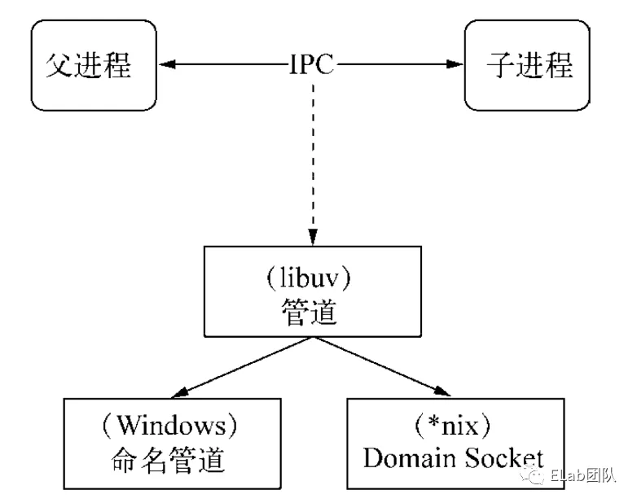
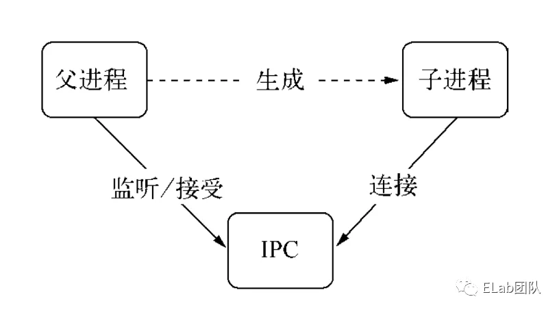
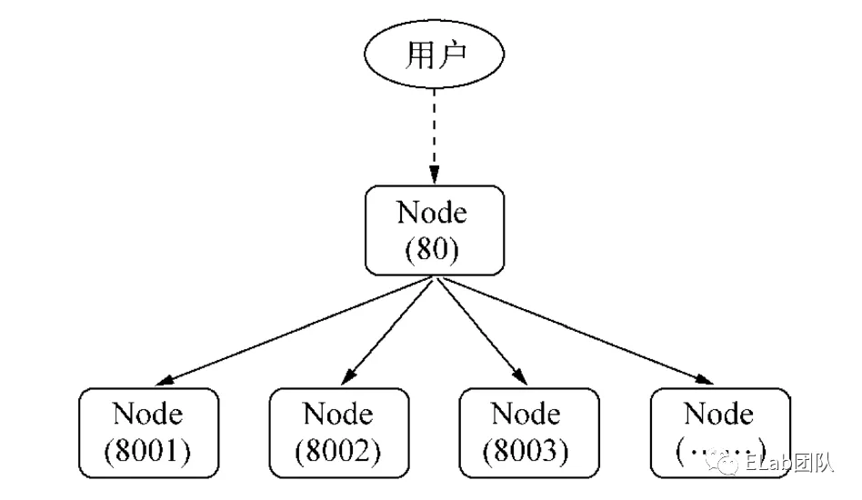
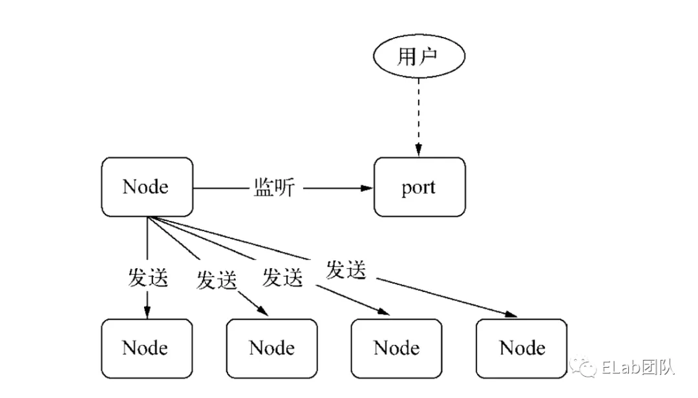
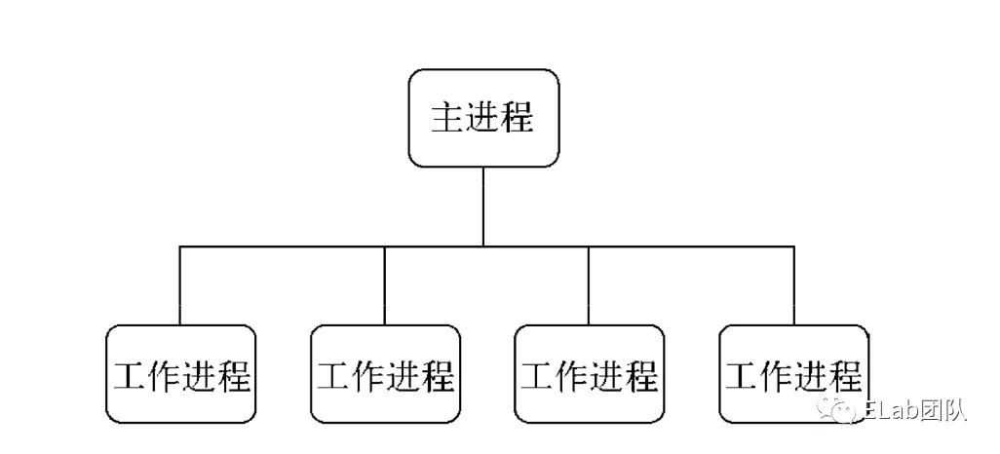

# 浅析 NodeJS 多进程和集群

## 1. 进程

进程是指在系统中正在运行的一个应用程序。

当我们打开活动监视器时，可以看到每一个正在运行的进程：


## 2. 多进程

### 2.1 复制进程

NodeJS 提供了 `child_process` 模块，并且提供了 `child_process.fork()` 函数供我们复制进程。

举个 🌰。

在一个目录下新建 `worker.js` 和 `master.js` 两个文件：

```js
// worker.js

const http = require('node:http');

http
  .createServer((req, res) => {
    res.writeHead(200, { 'Content-Type': 'text/plain' });
    res.end('Hello NodeJS!\n');
  })
  .listen(Math.round((1 + Math.random()) * 2000), '127.0.0.1');
```

```js
// master.js
const { fork } = require('node:child_process');
const { cpus } = require('node:os');

cpus().forEach(() => {
  fork('./worker.js');
});
```

然后执行：

```bash
node master.js
```

启动 `master.js`，然后查看进程的数量，我们可以发现，理想状况下，进程的数量等于 `CPU` 的核心数，每个进程各自利用一个 `CPU`，实现多核 `CPU` 的利用：

```bash
ps aux | grep worker.js
# [user]   83253   0.0  0.1  4607812  21596 s002  S+    7:48下午   0:00.06 [bin/node] ./worker.js
# [user]   83252   0.0  0.1  4618316  21824 s002  S+    7:48下午   0:00.08 [bin/node] ./worker.js
# [user]   83251   0.0  0.1  4633412  21756 s002  S+    7:48下午   0:00.06 [bin/node] ./worker.js
# [user]   83250   0.0  0.1  4617028  21672 s002  S+    7:48下午   0:00.06 [bin/node] ./worker.js
# [user]   83249   0.0  0.1  4651844  21812 s002  S+    7:48下午   0:00.06 [bin/node] ./worker.js
# [user]   83248   0.0  0.1  4633412  21904 s002  S+    7:48下午   0:00.06 [bin/node] ./worker.js
# [user]   83247   0.0  0.1  4651844  21932 s002  S+    7:48下午   0:00.06 [bin/node] ./worker.js
# [user]   83246   0.0  0.1  4634436  21864 s002  S+    7:48下午   0:00.06 [bin/node] ./worker.js
# [user]   83245   0.0  0.1  4634436  21796 s002  S+    7:48下午   0:00.06 [bin/node] ./worker.js
# [user]   83244   0.0  0.1  4634436  21888 s002  S+    7:48下午   0:00.06 [bin/node] ./worker.js
# [user]   83243   0.0  0.1  4651844  22004 s002  S+    7:48下午   0:00.06 [bin/node] ./worker.js
# [user]   83258   0.0  0.1  4580164  21408 s002  S+    7:48下午   0:00.05 [bin/node] ./worker.js
# [user]   83257   0.0  0.1  4613956  21564 s002  S+    7:48下午   0:00.06 [bin/node] ./worker.js
# [user]   83256   0.0  0.1  4607812  21584 s002  S+    7:48下午   0:00.06 [bin/node] ./worker.js
# [user]   83255   0.0  0.1  4614980  21552 s002  S+    7:48下午   0:00.06 [bin/node] ./worker.js
# [user]   83254   0.0  0.1  4643652  21792 s002  S+    7:48下午   0:00.06 [bin/node] ./worker.js
```

这是经典的 `Master-Worker` 模式（主从模式）。



实际上，`fork` 进程是昂贵的，复制进程的目的是充分利用 `CPU` 资源，所以 `NodeJS` 在单线程上使用了事件驱动的方式来解决高并发的问题。

### 2.2 子进程的创建

`child_process` 模块提供了四个方法创建子进程：

- child_process.spawn(command, args)；
- child_process.exec(command, options)；
- child_process.execFile(file, args[, callback])；
- child_process.fork(modulePath, args)；

对比：



后三种方法都是 `spawn()` 的延伸。

## 3. 进程间的通信

在 `NodeJS` 中，子进程对象使用 `send()` 方法实现主进程向子进程发送数据，`message` 事件实现主进程监听由子进程发来的数据。

### 3.1 实例

在一个目录下新建 `parent.js` 和 `child.js` 两个文件：

```js
// parent.js
const { fork } = require('node:child_process');
const sender = fork(path.resolve(__dirname, 'child.js'));

sender.on('message', (msg) => {
  console.log('主进程收到子进程的信息：', msg);
});

sender.send('Hey! 子进程');
```

```js
// child.js
process.on('message', (msg) => {
  console.log('子进程收到来自主进程的信息：', msg);
});

process.send('Hey! 主进程');
```

然后执行：

```bash
node parent.js
```

运行结果：

```bash
node parent.js
# 子进程收到来自主进程的信息： Hey! 子进程
# 主进程收到子进程的信息： Hey! 主进程
```

这样我们就实现了一个最基本的进程间通信。

### 3.2 IPC

IPC 即进程间通信，可以让不同进程之间能够相互访问资源并协调工作。



实际上，父进程会在创建子进程之前，会先创建 `IPC` 通道并监听这个 `IPC`，然后再创建子进程。
通过`环境变量（NODE_CHANNEL_FD）`告诉子进程和 `IPC` 通道相关的文件描述符，子进程启动的时候根据文件描述符连接 `IPC` 通道，从而和父进程建立连接。



## 4. 句柄传递

句柄是一种可以用来标识资源的引用的，它的内部包含了指向对象的文件资源描述符。

一般情况下，当我们想要将多个进程监听到一个端口下，可能会考虑使用主进程代理的方式处理：



然而，这种代理方案会导致每次请求的`接收`和`代理转发`用掉`两个文件描述符`，而系统的文件描述符是有限的，这种方式会影响系统的扩展能力。

所以，为什么要使用句柄？
原因是在实际应用场景下，建立 `IPC` 通信后可能会涉及到比较复杂的数据处理场景，句柄可以作为 `send()` 方法的第二个可选参数传入，也就是说可以直接将资源的标识通过 `IPC` 传输，避免了上面所说的代理转发造成的文件描述符的使用。



以下是支持发送的句柄类型：

- net.Socket；
- net.Server；
- net.Native；
- dgram.Socket；
- dgram.Native；

> `数据报套接字（UDP）`通过 `require('dgram')` 提供。

### 4.1 实例

```js
// parent.js

'use stirct';
const { fork } = require('node:child_process');
const { createServer } = require('node:net');

const server = createServer();
const child = fork('./child.js');

server
  .on('connection', (socket) => {
    child.send('socket', socket);
  })
  .listen(1337);
```

```js
'use strict';

process.on('message', (message, socket) => {
  if (message === 'socket') {
    socket.end('Child handled it.');
  }
});
```

然后启动服务 `node parent.js`，执行：

```bash
curl 127.0.0.1:1337
# Child handled it.%
```

### 4.2 句柄发送与还原

主进程：

- 传递消息和句柄。
- 将消息包装成内部消息，使用 `JSON.stringify` 序列化为字符串。
- 通过对应的 `handleConversion[message.type].send` 方法序列化句柄。
- 将序列化后的字符串和句柄发入 `IPC channel` 。

子进程：

- 使用 `JSON.parse` 反序列化消息字符串为消息对象。
- 触发`内部消息事件（internalMessage）`监听器。
- 将传递来的句柄使用 `handleConversion[message.type].got` 方法反序列化为 `JavaScript` 对象。
- 带着消息对象中的具体消息内容和反序列化后的句柄对象，触发用户级别事件。

### 4.3 监听共同端口

如上图所示，为什么多个进程可以监听同一个端口呢？

原因是主进程通过 `send()` 方法向多个子进程发送属于该主进程的一个服务对象的句柄。
所以对于每一个子进程而言，它们在还原句柄之后，得到的服务对象是一样的。
当网络请求向服务端发起时，进程服务是抢占式的，所以监听相同端口时不会引起异常。

## 5. Cluster（集群）

对 `Cluster` 的理解：

- 在服务器上同时启动多个进程。
- 每个进程里都跑的是同一份源代码（好比把以前一个进程的工作分给多个进程去做）。
- 更神奇的是，这些进程可以同时监听一个端口。

其中：

- 负责启动其他进程的叫做 `Master` 进程，他好比是个『包工头』，不做具体的工作，只负责启动其他进程。
- 其他被启动的叫 `Worker` 进程，顾名思义就是干活的『工人』。它们接收请求，对外提供服务。
- `Worker` 进程的数量一般根据服务器的 `CPU` 核数来定，这样就可以完美利用多核资源。

```js
const cluster = require('node:cluster');
const http = require('node:http');

if (cluster.isMaster) {
  console.log('isMaster');

  // 跟踪 http 请求。
  let numReqs = 0;
  setInterval(() => {
    console.log(`请求的数量 = ${numReqs}`);
  }, 1000);

  // 对请求计数。
  function messageHandler(msg) {
    if (msg.cmd && msg.cmd === 'notifyRequest') {
      numReqs += 1;
    }
  }

  // 启动 worker 并监听包含 notifyRequest 的消息。
  const numCPUs = require('node:os').cpus().length;
  console.log('numCPUs:', numCPUs);
  for (let i = 0; i < numCPUs; i++) {
    cluster.fork();
  }

  for (const id in cluster.workers) {
    cluster.workers[id].on('message', messageHandler);
  }
}
else {
  // 工作进程有一个 http 服务器。
  http
    .Server((req, res) => {
      res.writeHead(200);
      res.end('你好世界\n');

      // 通知主进程接收到了请求。
      process.send({ cmd: 'notifyRequest' });
    })
    .listen(8000);
}
```

```bash
node index.js
# isMaster
# numCPUs: 16
# 请求的数量 = 0
```

```bash
curl 127.0.0.1:8000
# 你好世界
```

```bash
node index.js
# isMaster
# numCPUs: 16
# 请求的数量 = 0
# 请求的数量 = 1
```

简单来说，`cluster` 模块是 `child_process` 模块和 `net` 模块的组合应用。

`cluster` 启动时，内部会启动 `TCP` 服务器，将这个 `TCP` 服务器端 `socket` 的文件描述符发给工作进程。

在 `cluster` 模块应用中，一个主进程只能管理一组工作进程，其运作模式没有 `child_process` 模块那么灵活，但是更加稳定：



为了让集群更加稳定和健壮，`cluster` 模块也暴露了许多事件：

- fork
- online
- listening
- disconnect
- exit
- setup

这些事件在进程间消息传递的基础了完成了封装，保证了集群的稳定性和健壮性。

## 6. 进程守护

**未捕获异常**

当代码抛出了异常没有被捕获到时，进程将会退出，此时 `Node.js` 提供了 `process.on('uncaughtException', handler)` 接口来捕获它，但是当一个 `Worker` 进程遇到未捕获的异常时，它已经处于一个不确定状态，此时我们应该让这个进程优雅退出：

- 关闭异常 `Worker` 进程所有的 `TCP Server`（将已有的连接快速断开，且不再接收新的连接），断开和 `Master` 的 `IPC` 通道，不再接受新的用户请求。
- `Master` 立刻 `fork` 一个新的 `Worker` 进程，保证在线的『工人』总数不变。
- 异常 `Worker` 等待一段时间，处理完已经接受的请求后退出。

```bash
# +---------+                 +---------+
# |  Worker |                 |  Master |
# +---------+                 +----+----+
#      | uncaughtException         |
#      +------------+              |
#      |            |              |                   +---------+
#      | <----------+              |                   |  Worker |
#      |                           |                   +----+----+
#      |        disconnect         |   fork a new worker    |
#      +-------------------------> + ---------------------> |
#      |         wait...           |                        |
#      |          exit             |                        |
#      +-------------------------> |                        |
#      |                           |                        |
#     die                          |                        |
#                                  |                        |
#                                  |                        |
```

**OOM、系统异常**

当一个进程出现异常导致 `crash` 或者 `OOM(Out Of Memory)` 被系统杀死时，不像未捕获异常发生时我们还有机会让进程继续执行，只能够让当前进程直接退出，`Master` 立刻 `fork` 一个新的 `Worker`。

## 7. 参考

- [浅析 NodeJS 多进程和集群](https://mp.weixin.qq.com/s/XHXO3L8YRwhWvBcQdVjeHw)
- [Node.js 中文网](http://nodejs.cn/api/)
- [通过源码解析 Node.js 中进程间通信中的 socket 句柄传递](https://segmentfault.com/a/1190000005069010)
