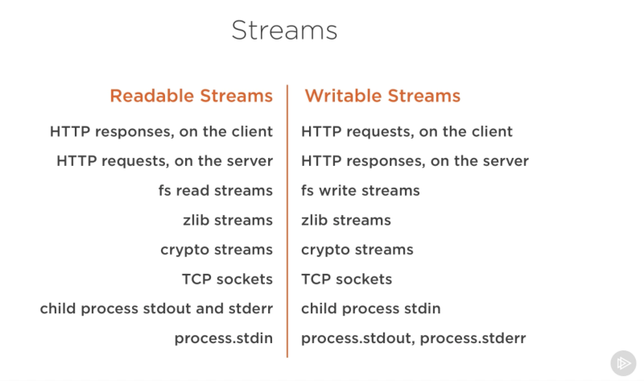
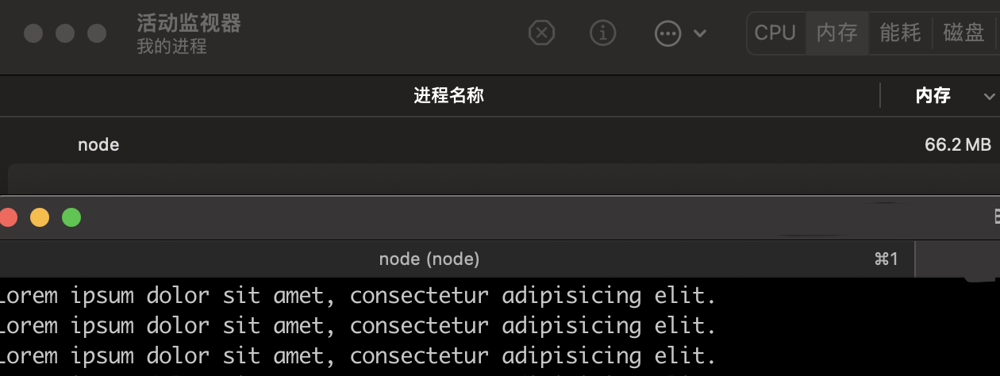
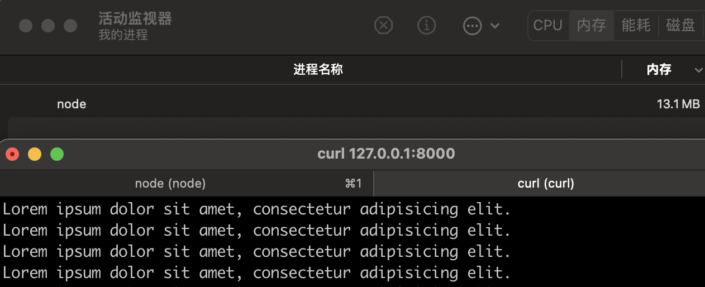
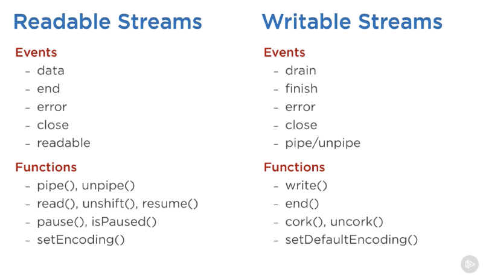
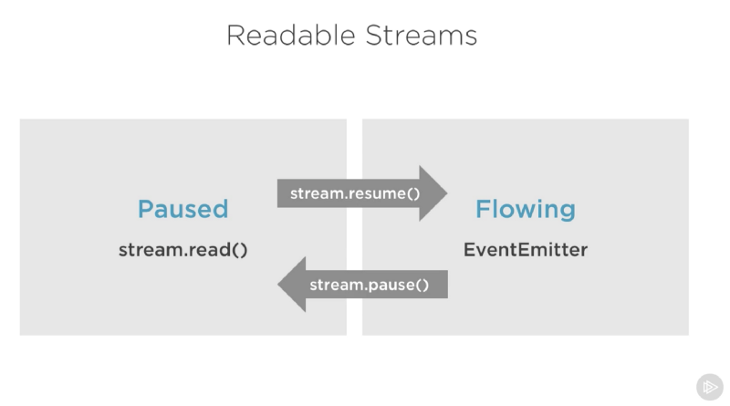

# Node.js 流(Streams)介绍

## 1. 前言

**到底什么是流(streams)？**

流是数据的集合 - 就像数组或者字符串。
他们之间的区别是流可能不是一次性获取到的，它们不需要匹配内存。
这让流在处理大容量数据，或者从一个额外的源每次获取一块数据的时候变得非常强大。

然而，流不仅可以处理大容量的数据。
它们也给了我们在代码中组合的能力。就像在我们可以通过导入其他一些更小的 `Linux` 命令那样组合出强大的 `Linux` 命令。

```bash
history | grep docker
```

```js
// const history = ... // history 输出流
// const grep = ... // grep 输入流
history.pipe(grep);
```

很多在 Node.js 内置的模块都实现了流接口：



上面列表中有些原生的 `Node.js` 对象是可读和可写的流，它们中的一些即是可读的也是可写的流，比如 `TCP sockets`，`zlib`，`crypto` 流。

注意对象是否可写或者可读跟所处的场景也是紧密相关的。
在客户端的 `HTTP response` 是可读的，而在服务器端是可写的。
因为在 `HTTP` 例子中，我们基本上是从一个对象（`http.IncomingMessage`）里面读数据并且往另一个对象（`http.ServerResponse`）里面写数据。

注意，当出现子进程时，子进程的标准输入输出流（`stdin`，`stdout`，`stderr`）有着相反的流类型。
这允许以非常方便的方式从主进程输入输出流导入到子进程的输入输出流中。

## 2. 一个流实例

有理论，也要有实例，才有充足的说服力。让我们看一个例子，展示了不同的流在代码中内存消耗。

让我们首先创建一个大文件：

```js
// createBigFile.js
const fs = require('node:fs');
const file = fs.createWriteStream('./big.text');
for (let i = 0; i <= 1e6; i++) {
  file.write('Lorem ipsum dolor sit amet, consectetur adipisicing elit. \n');
}
file.end();
```

看下创建这个大文件用了什么？一个可写的流！
fs 模块可以被用来从一个流接口里面读或者写一个文件。
在上面的例子中，我们在一个循环中往一个可写流 `big.text` 中写入数据。

运行下面的命令可以生成一个大约 `56MB` 的文件。

```bash
node createBigFile.js
```

这里有一个专门提供 `big.text` 文件的 `Node web` 服务器：

```js
// bigFileServer.js
const fs = require('node:fs');
const server = require('node:http').createServer();
server.on('request', (req, res) => {
  fs.readFile('./big.text', (err, data) => {
    if (err) { throw err; }
    res.end(data);
  });
});
server.listen(8000);
```

当请求服务器的时候，它会用异步的方式提供这个大文件。
这种方式不像在事件循环中阻塞了任何的东西。看起来很棒，对吗？

好吧，看下当我们运行上面的服务器时发生了什么，模拟内存的变化情况。

当我运行上面的代码时，它开始正常的内存数量是，`9 MB`：

```bash
node bigFileServer.js
```


然后连上服务器。注意内存消耗情况：

```bash
curl 127.0.0.1:8000
```



哇 - 内存的消耗一下子飙升到 `66.2 MB`。

在我们将大文件写入到 `http` 的响应对象，把整个 `big.text` 文件内存放到了内存里面。
这样效率很低。

`HTTP` 响应对象（上面代码中 `res`）也是一个可写的流。
这意味着如果我们有一个可以代表 `big.text` 内容的可读流，我们可以将两个对象互相导入，达到同样的目标但是不用消耗大约 `66 MB` 的内存。

`Node` 的 `fs` 模块可以使用 `createReadStream` 方法创建一个可读的流，我们可以将它导入（`pipe`）到响应对象里面。

```js
// bigFileStreamServer.js
const fs = require('node:fs');
const server = require('node:http').createServer();

server.on('request', (req, res) => {
  const src = fs.createReadStream('./big.text');
  src.pipe(res);
});

server.listen(8000);
```

现在连接到服务器，神奇的事情发生了（看内存的消耗情况）。

```bash
node bigFileStreamServer.js
```

```bash
curl 127.0.0.1:8000
```



发生了什么？

当一个客户端请求这个大文件的时候，每次流入一个数据块，意味着再也不用在内存中，缓冲整个文件了。
内存的使用增长到了 `13.1MB` ，就是这样。

## 3. Streams 流介绍

在 `Node.js` 中有四种基本的流类型：`Readable（可读流）`，`Writable（可写流）`，`Duplex（双向流）`，`Transform（转换流）`。

- `可读流`是数据可以被消费的源的抽象。一个例子就是 `fs.createReadStream` 方法。
- `可写流`是数据可以被写入目标的抽象。一个例子就是 `fs.createWriteStream` 方法。
- `双向流`即是可读的也是可写的。一个例子是 `TCP socket`。
- `转换流`是`基于双向流`的，可以在读或者写的时候被用来更改或者转换数据。
  一个例子是 `zlib.createGzip` 使用 `gzip` 算法压缩数据。
  你可以将转换流想象成一个函数，它的输入是可写流，输出是可读流。
  你或许也听过将转换流称为“`通过流（through streams）`”。

所有的流都是 `EventEmitter` 的实例。
触发它们的事件可以读或者写入数据，然而，我们可以使用 `pipe` 方法消费流的数据。

### 3.1 pipe 方法

这里有一行需要你记住的神奇的代码：

```js
readableSrc.pipe(writableDest);
```

在这一行简单的代码中，我们导入可读流的输出 -- 源数据，作为可写流的输入 -- 目标。
源数据必须是一个可读流，目标数据必须是一个可读流。当然，他们也都可以是 双向流/转换流。
实际上，我们往双向流中导入数据，我们可以链式导入就像在 `Linux` 中做的那样：

```js
readableSrc.pipe(transformStream1).pipe(transformStream2).pipe(finalWrtitableDest);
```

`pipe` 方法返回目标流，可以让我们做链式调用 `pipe`。
对于流 `a (readable)`, `b` and `c (duplex)`, and `d(writable)`, 我们可以：

```js
a.pipe(b).pipe(c).pipe(d);

//  Which is equivalent to:
a.pipe(b);
b.pipe(c);
c.pipe(d);
```

```bash
# Which, in Linux, is equivalent to:
$ a | b | c | d
```

`pipe` 方法是消费流最简单的方法。
通常建议使用 `pipe` 方法或者事件来消费流，但是不要混合使用它们。
通常当你使用 `pipe` 方法时，不需要使用事件，但是如果你学要用更多自定义的方式使用流，那么就需要使用事件的方式。

### 3.2 Stream 事件

除了从一个可读源流读取和往一个目标流中写入数据，`pipe` 方式自动管理一些事情。例如，处理错误，文件末尾，或者当一个流比另一个快或者满的情形。

然而，流可以被事件直接消费。
这里有一个 `pipe` 方法读取数据等价的使用事件消费流的代码：

```js
// readable.pipe(writable)
readable.on('data', (chunk) => {
  writable.write(chunk);
});
readable.on('end', () => {
  writable.end();
});
```

这里有一个被可读流和可写流使用的重要事件和函数列表：



事件和函数是某种方式相关的，因为它们可以一起使用。

在可读流上最重要的事件有：

- `data` 事件，当流传递给消费者一个数据块的时候会触发。
- `end` 事件，当在流中没有可以消费的数据的时候会触发。

在可写流上面最重要的事件有：

- `drain` 事件，当可写流可以接受更多的数据时的一个标志。
- `finish` 事件，当所有的数据都写入到底层系统中时会触发。

事件和函数可以结合起来自定义和优化流的使用。
为了消费一个可读流，我们可以使用 `pipe/unpipe` 方法，或者 `read/unshift/resume` 方法。
为了消费一个可写流，我们可以将它作为 `pipe/unpipe` 的目标，或者使用 `write` 方法写入，当我们完成的时候调用 `end` 方法。

### 3.3 可读流的暂停和流动模式

可读流有两个主要模式影响到我们消费它们的方式：

- 可以是`暂停模式（paused）`
- 或者`流动（flowing）模式`

这些模式有时也被称为 `拉（pull）` 和 `推（push）` 的模式。

所有的可读流默认都是以暂停模式开始的，但是它们很容易切换到流动模式，并且在需要的时候退回到暂停模式。有时候，这种切换是自动发生的。

当一个可读流在暂停模式，我们可以使用 `read()` 方法从流中按需读取数据，然而，对于一个在流动模式的可读流，数据持续流动，我们不得不监听事件去消费它。

处在流动模式，如果没有可获取的消费者去处理它，数据实际上可能会丢失，当有一个在流动模式的可读流，我们需要一个 `data` 事件处理器。
实际上，添加一个 `data` 事件处理器就能将暂停状态的流切换到流动模式，移除 `data` 事件会将流切换回原来的暂停模式。
这样做是为了兼容一些旧的流接口。

为了手动切换两个流模式，你可以使用 `resume()` 方法和 `pause()` 方法。



当使用 `pipe` 方法消费可读流时，我们不用担心那些模式，因为 `pipe` 会自动管理的。

## 4. 实现流（Streams）

当我们在 `Node.js` 中谈论流时，这里有两个主要的任务：

- `实现（implementing）`流的任务
- `消费（consuming）`流的任务

目前我们仅仅谈论了消费流。让我们实现一些吧！

实现流通常需要 `stream` 模块。

### 4.1 实现一个可写流

为了实现一个可写流，我们需要从 `stream` 模块中使用 `Writable` 构造函数。

```js
const { Writable } = require('node:stream');
```

我们可以通过很多方式实现一个可写流。比如，扩展（extend）Writable 构造函数。

```js
class myWritableStream extends Writable {}
```

然而，我更喜欢简单的构造函数方法。
我们仅仅从 Writable 中创建了一个对象，然后传入一些选项。
唯一的一个需要的选项时一个 `write` 函数，暴露数据需要写入的那一个块。

```js
// outStream.js
const { Writable } = require('node:stream');
const outStream = new Writable({
  write(chunk, encoding, callback) {
    console.log(chunk.toString());
    callback();
  },
});

process.stdin.pipe(outStream);
```

`write` 方法接受三个参数。

- 如果我们没有配置流的格式，`chunk` 通常是一个 `buffer`。
- `encoding` 在某种情况下是需要的，但是通常我们可以忽略它。
- `callback` 是一个当我们处理完数据块之后需要调用的一个函数。
  它标识着是否写入成功，为了标识失败，可以调用一个带有错误对象的 `callback`。

在 `outStream`，我们可以简单以字符串的形式打印出 `chunk`，并且调用 `callback`，没有错误的话就代表成功。
这是一个最简单也是最没有用的 `echo` 流。它将会打印出任何它接收到的东西。

为了消费这个流，我们可以简单地用 `process.stdin` 使用它，是一个可读流，因此我们可以将 `process.stdin` 导入到 outStream。

当我们运行上面的代码时，我们键入到 `process.stdin` 的任何字符都会被 `outStream` 的 `console.log` 打印出来。

执行看下效果：

```bash
node outStream.js
# 哈哈哈
# 哈哈哈

# 123456
# 123456
```

这并不是一个有用的实现的流，因为已经内置实现了。等价于 `process.stdout`。
我们可以直接将 `stdin` 导入到 `stdout` 中，仅仅一行就实现了相同的特性：

```js
// outStream_same.js
process.stdin.pipe(process.stdout);
```

```bash
node outStream_same.js
# 哈哈哈
# 哈哈哈
```

### 4.2 实现一个可读流

为了实现一个可读流，我们可以获取 `Readable` 接口并且从它构建一个对象：

```js
const { Readable } = require('node:stream');
const inStream = new Readable({});
```

这里有一个实现可读流简单的方式。我们可以直接 `push` 消费者想要消费的数据。

```js
// inStream.js
const { Readable } = require('node:stream');
const inStream = new Readable();

inStream.push('ABCDEFGHIJKLM');
inStream.push('NOPQRSTUVWXYZ');
inStream.push(null); // No more data
inStream.pipe(process.stdout);
```

当我们 `push` 一个 `null` 对象，意味着我们想要标识流没有更多的数据了。

为了消费这个简单的可读的流，我们可以简单地将它导入到可写流 `process.stdout`。

当我们运行上面的代码，我们将会从 inStream 中读取所有的数据，并且将它打印到标准输出。

```bash
node inStream.js
# ABCDEFGHIJKLMNOPQRSTUVWXYZ%
```

非常简单，但却不那么高效。
在将它导入到 `process.stdout` 之前，我们仅仅在流中 `push` 所有地数据。
更好的方式是`按需 push`，当一个消费者需要它时，我们可以在一个可读流地配置中通过 `read` 方法实现：

```js
const inStream = new Readable({
  read(size) {
    // there is a demand on the data... Someone wants to read it.
  },
});
```

当 `read` 方法在一个可读流上调用时，`实现（imeplementation）`可以 `push` 部分数据到队列中。
例如，我们可以一次 `push` 一个字符，从`字符码 65（代表 A）` 开始，并且随着每个 `push` 增加：

```js
// inStream_same.js
const { Readable } = require('node:stream');

const inStream = new Readable({
  read(size) {
    this.push(String.fromCharCode(this.currentCharCode++));
    if (this.currentCharCode > 90) {
      this.push(null);
    }
  },
});
inStream.currentCharCode = 65;

inStream.pipe(process.stdout);
```

```bash
node inStream_same.js
# ABCDEFGHIJKLMNOPQRSTUVWXYZ%
```

当消费者读取一个可读流时，`read` 方法将会持续触发，我们会 `push` 更多地字符。
我们需要在某个地方停止这个周期，这就是为什么当条件成立时（比 90 大）我们 `push` 了 `null`。

这个代码等价于刚开始更简单的那个，但是我们在消费者需要的时候`按需推入数据`。

### 4.3 实现双向流和转换流

使用双向流，我们可以在一个对象里面实现可读和可写流。就好像继承了两个接口。

这里有一个将上面可读的和可写的例子结合的双向流实例：

```js
// inoutStream.js
const { Duplex } = require('node:stream');

const inoutStream = new Duplex({
  write(chunk, encoding, callback) {
    console.log(chunk.toString());
    callback();
  },

  read(size) {
    this.push(String.fromCharCode(this.currentCharCode++));
    if (this.currentCharCode > 90) {
      this.push(null);
    }
  },
});
inoutStream.currentCharCode = 65;

process.stdin.pipe(inoutStream).pipe(process.stdout);
```

执行结果：

```bash
node inoutStream.js
# ABCDEFGHIJKLMNOPQRSTUVWXYZ哈哈哈
# 哈哈哈

# 123456
# 123456
```

通过结合方法，我们可以使用这个双向流读取字符，也可以使用它`打印（echo）`的特性。
我们将可读的 `stdin` 流导入到双向流中使用打印的特性，我们将双向流导入到可写的 `stdout` 流查看从 `A` 到 `Z` 的字符。

理解双向流的读写独立于彼此非常重要。这只是将两个特性一起放到了一个对象上面。

转换流比双向流更有趣，因为它的输出是从它的输入里面计算的。

对于一个转换流，我们没必要实现 `read` 或者 `write` 方法，我们仅仅需要实现 `transform` 方法，它结合了它们两个。
它有一个 `write` 方法的特性并且我们也可以使用它来 `push` 数据。

这里有一个简单的 `transform` 流的例子，将会以大写的格式打印任何你键入的字符：

```js
// upperCaseTr.js
const { Transform } = require('node:stream');

const upperCaseTr = new Transform({
  transform(chunk, encoding, callback) {
    this.push(chunk.toString().toUpperCase());
    callback();
  },
});

process.stdin.pipe(upperCaseTr).pipe(process.stdout);
```

执行结果：

```bash
node upperCaseTr.js
# abcde
# ABCDE
```

在这个转换流中，我们可以像之前的例子中的双向流一样消费它，我们仅仅实现了一个 `transform` 方法。
在那个例子中，我们将每个 `chunk` 转换到大写的格式，并且作为可读的一部分被 `push` 到可读流里面了。

## 5. 流对象模式

流除了 `Buffer/String` 值，这里还有一个`对象模式（objectMode）`的标识，我们可以设置以接受任何的 `Javascript 对象`。

这里有一个简单的示例。
下面转换流的结合实现了一个特性，可以将逗号分割的字符串转换为 Javascript 对象，因此 `"a,b,c,d"`会变成 `{a: b, c: d}`：

```js
// commaToObj.js
const { Transform } = require('node:stream');

const commaSplitter = new Transform({
  readableObjectMode: true,
  transform(chunk, encoding, callback) {
    this.push(chunk.toString().trim().split(','));
    callback();
  },
});

const arrayToObject = new Transform({
  readableObjectMode: true,
  writableObjectMode: true,
  transform(chunk, encoding, callback) {
    const obj = {};
    for (let i = 0; i < chunk.length; i += 2) {
      obj[chunk[i]] = chunk[i + 1];
    }
    this.push(obj);
    callback();
  },
});

const objectToString = new Transform({
  writableObjectMode: true,
  transform(chunk, encoding, callback) {
    this.push(`${JSON.stringify(chunk)}\n`);
    callback();
  },
});

process.stdin.pipe(commaSplitter).pipe(arrayToObject).pipe(objectToString).pipe(process.stdout);
```

执行结果：

```bash
node commaToObj.js
# a,b,c,d,e,f
# {"a":"b","c":"d","e":"f"}
# 1,2,3,4
# {"1":"2","3":"4"}
```

我们传递了一个输入字符（例如：`a, b, c, d`）通过 `commaSplitter` 流转换为 （`["a", "b", "c", "d"]`）。
在流上面添加 `readableObjectMode` 是必要的，因为 `push` 了一个对象，不是字符串。

当我们获取到数组并且将它 `pipe` 到 `arrayToObject` 流中。我们需要一个 `writableObjectMode` 标识让这个流接受对象。
它将会 `push` 一个对象。这就是这里为什么也需要 `readableObjectMode` 标识了。

最后一个 `objectToString` 流接受一个对象但是 `push` 一个字符串，这就是为什么这里只需要 `writableObjectMode` 标识。
可读的部分是一个正常的字符串（字符化的对象）。

## 6. Node 的内置转换流

`Node` 有一些非常有用的内置转换流。也就是，`zlib` 和 `crypto` 流。

这里有一个示例，使用 `zlib.crreateGzip() 流`与 `fs readable/writable 流`结合起来创建一个文件压缩的脚本：

```js
// gzipFile.js
const fs = require('node:fs');
const zlib = require('node:zlib');
const file = process.argv[2];

fs.createReadStream(file)
  .pipe(zlib.createGzip())
  .pipe(fs.createWriteStream(`${file}.gz`));
```

你可以使用这个脚本 `gzip` 压缩任何你在参数中传递的文件。
我们导入了一个可读的流，然后导入到 `zlib 内置转换流`，接着导入到新压缩过的文件的可写流。

执行结果：

```bash
node gzipFile.js big.text
ll | grep big.text
# -rw-r--r--  56M 11 19 17:18 big.text
# -rw-r--r--  168K 11 19 19:18 big.text.gz
```

关于导入很酷的事情是，如果需要可以结合它们。
也就是说，例如，我想要用户在脚本工作的时候看到一个进度指示器，脚本执行完毕，就会有“done”信息。
因为 `pipe` 方法返回目标流，我们可以也可以链式注册事件处理器：

```js
// streamProcess.js
const fs = require('node:fs');
const zlib = require('node:zlib');
const file = process.argv[2];

fs.createReadStream(file)
  .pipe(zlib.createGzip())
  .on('data', () => process.stdout.write('.'))
  .pipe(fs.createWriteStream(`${file}.gzip`))
  .on('finish', () => console.log('Done'));
```

执行结果：

```bash
node streamProcess.js big.text
# .........................Done
```

因此使用 `pipe` 方法，我们可以很容易地消耗流，但是我们仍然在需要的地方使用事件自定义我们和那些流的交互。

关于 `pipe` 方法最棒的是，我们可以使用它以一种更为可读的方式来一片一片地组合我们的程序。
例如，取代监听 `data` 事件，我们可以简单地创建一个转换流报告进度，用另一个 `pipe` 调用代替 `.on()` 调用：

```js
// streamProcess_v2.js
const fs = require('node:fs');
const zlib = require('node:zlib');
const file = process.argv[2];

const { Transform } = require('node:stream');

const reportProgress = new Transform({
  transform(chunk, encoding, callback) {
    process.stdout.write('.');
    callback(null, chunk);
  },
});

fs.createReadStream(file)
  .pipe(zlib.createGzip())
  .pipe(reportProgress)
  .pipe(fs.createWriteStream(`${file}.gzip`))
  .on('finish', () => console.log('Done'));
```

执行结果：

```bash
node streamProcess_v2.js big.text
# .........................Done
```

`reportProgress` 流是简单的通过`（pass-through）流`，但是它也向标准输出报告了进度。

注意我在 `transform()` 方法内部是如何在 `callback()` 的`第二个参数`中 `push` 数据的。等价于：

```js
// streamProcess_v3.js
// ...
const reportProgress = new Transform({
  transform(chunk, encoding, callback) {
    process.stdout.write('.');
    this.push(chunk);
    callback();
  },
});
// ...
```

结合流的应用没有结束。
例如，如果我们需要在 `gzip` 之前或者之后`加密文件`，我们需要做的就是以一种我们需要的顺序 `pipe` 到另一个 `transform` 流。
我们可以使用 `Node` 的 `crypto` 模块：

```js
// cryptoGzip.js
const crypto = require('node:crypto');
// ...
fs.createReadStream(file)
  .pipe(zlib.createGzip())
  .pipe(crypto.createCipheriv('aes192', 'a_secret'))
  .pipe(reportProgress)
  .pipe(fs.createWriteStream(`${file}.gzip`))
  .on('finish', () => console.log('Done'));
```

上面的脚本压缩然后加密一个传入的文件，仅仅那些使用输出文件的有密码。
我们不能用正常的方法解压一个文件，因为它是加密的。

为了能够解压上面的脚本生成的压缩文件，我们需要以一个相反的顺序使用 `crypto` 和 `zlib`。

```js
// cryptoGunzip.js
// ...
fs.createReadStream(file)
  .pipe(crypto.createDecipheriv('aes192', 'a_secret'))
  .pipe(zlib.createGunzip())
  .pipe(reportProgress)
  .pipe(fs.createWriteStream(file.slice(0, -3)))
  .on('finish', () => console.log('Done'));
```

假设传递的文件是压缩的版本，上面的代码将会创建一个可读流，将它导入到 `crypto createDecipher() 流`中（使用相同的密码），将输出导入到 `zlib createGunzip() 流`中，然后写一个东西到一个文件中，即为加密前压缩前的原始内容。

## 7. 参考

- [Node.js 流（stream）：你需要知道的一切](https://zhuanlan.zhihu.com/p/36728655)
- [Node.js Streams: Everything you need to know](https://www.freecodecamp.org/news/node-js-streams-everything-you-need-to-know-c9141306be93/)
