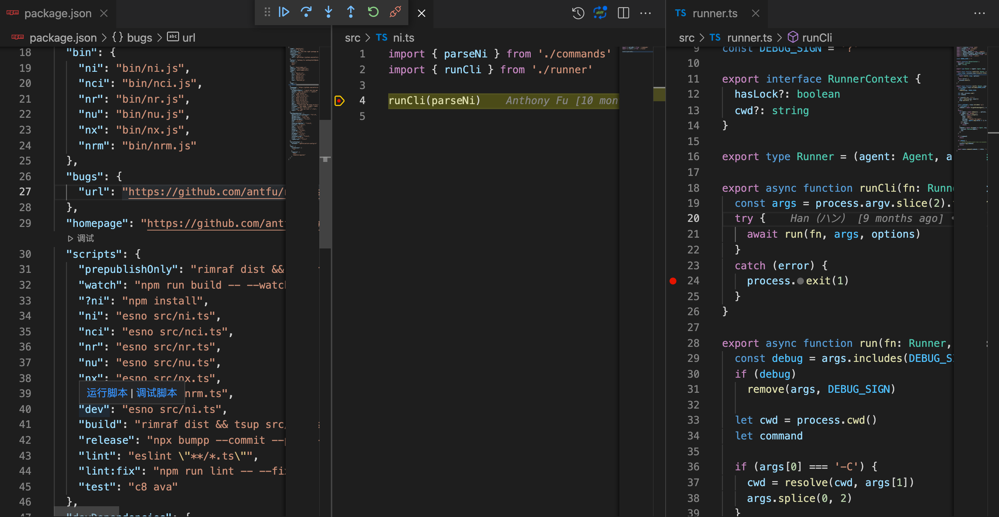

# 包管理器 ni 源码解读

## 1. 安装

> 如果全局安装遭遇冲突，我们可以加上 `--force` 参数强制安装。

```bash
npm i -g @antfu/ni
```

## 2. 体验

在 `ni` 运行之前，它会检测你的 `yarn.lock` / `pnpm-lock.yaml` / `package-lock.json` 以了解当前的包管理器，并运行相应的命令。

解释下，就是说，使用 `ni` 在项目中安装依赖时：

- 假设你的项目中有锁文件 `yarn.lock`，那么它最终会执行 `yarn install` 命令。
- 假设你的项目中有锁文件 `pnpm-lock.yaml`，那么它最终会执行 `pnpm i` 命令。
- 假设你的项目中有锁文件 `package-lock.json`，那么它最终会执行 `npm i` 命令。

例如，使用 `ni -g vue-cli` 安装全局依赖时，默认使用 `npm i -g vue-cli`。

当然不只有 `ni` 安装依赖，还有：

- `nr` - run
- `nx` - execute
- `nu` - upgrade
- `nci` - clean install
- `nrm` - remove

> `ni` 相关的命令，都可以在末尾追加 `\?`，表示只打印具体执行的命令，不是真正执行。

所以全局安装 `ni` 后，可以尽情测试，比如 `ni \?`，`nr dev --port=3000 \?`，因为仅打印，所以可以在各种目录下执行，有助于理解 `ni` 源码。目前测试了如下实例：

```bash
ll pnpm-lock.yaml
# -rw-r--r-- pnpm-lock.yaml
ni \?
# pnpm i
nr dev --port=3000 \?
# pnpm run dev -- --port=3000
```

假设项目目录下没有锁文件，默认就会让用户从 `npm`、`yarn`、`pnpm` 选择，然后执行相应的命令。

```bash
ni \?
# ✔ Choose the agent › yarn
# yarn install

ni \?
# ? Choose the agent › - Use arrow-keys. Return to submit.
#     npm
# ❯   yarn
#     pnpm
```

但如果在 `~/.nirc` 文件中，设置了全局默认的配置，则使用默认配置执行对应命令。

> 默认是没有这个文件的，需要自己创建，文件内容为 `ini` 格式。

```ini
; ~/.nirc

; fallback when no lock found
; 当前项目运行
defaultAgent=npm # default "prompt"，也就是选择确认

; for global installs
; 安装全局依赖
globalAgent=npm
```

因此，我们可以得知这个工具必然要做三件事：

1. 根据锁文件猜测用哪个包管理器 `npm/yarn/pnpm`
2. 抹平不同的包管理器的命令差异
3. 最终运行相应的脚本

## 3. 使用

官方文档见[这里](https://github.com/antfu/ni#readme)。

举几个常用的例子。

### 3.1 ni - install

```bash
ni

# npm install
# yarn install
# pnpm install
```

```bash
ni axios

# npm i axios
# yarn add axios
# pnpm i axios
```

### 3.2 nr - run

```bash
nr
# 交互式选择命令去执行
# interactively select the script to run
# supports https://www.npmjs.com/package/npm-scripts-info convention
```

```bash
nr dev --port=3000

# npm run dev -- --port=3000
# yarn run dev --port=3000
# pnpm run dev -- --port=3000
```

```bash
nr -

# 重新执行最后一次执行的命令
# rerun the last command
```

**npm-run-script 说明：**

```bash
npm run-script [command] [--silent] [-- <args>...]

# alias: npm run
```

The special option `--` is used by getopt to delimit the end of the options. npm will pass all the arguments after the `--` directly to your script:

```bash
npm run test -- --grep="pattern"
```

### 3.3 nx - execute

```bash
nx jest

# npx jest
# yarn dlx jest
# pnpm dlx jest
```

## 4. 阅读源码前的准备工作

### 4.1 克隆项目

```bash
# 克隆官方仓库
git clone https://github.com/antfu/ni.git
cd ni
# npm i -g pnpm
# 安装依赖
pnpm i
# 当然也可以直接用 ni
```

众所周知，看一个开源项目，先从 `package.json` 文件开始看起。

### 4.2 package.json

```json
{
    "name": "@antfu/ni",
    "version": "0.10.1",
    "description": "Use the right package manager",
    "files": ["dist", "bin"],
    // 暴露了六个命令
    "bin": {
        "ni": "bin/ni.js",
        "nci": "bin/nci.js",
        "nr": "bin/nr.js",
        "nu": "bin/nu.js",
        "nx": "bin/nx.js",
        "nrm": "bin/nrm.js"
    },
    "scripts": {
        "ni": "esno src/ni.ts",
        // 省略了其他的命令 用 esno 执行 ts 文件
        // 可以加上 ? 便于调试，也可以不加
        // 或者是终端 npm run dev \?
        "dev": "esno src/ni.ts"
    }
}
```

> `esno` 为执行 `ts` 文件。可 `--watch` 实现文件监听。

根据 `dev` 命令，我们找到主入口文件 `src/ni.ts`。

### 4.3 从源码主入口开始调试

```ts
// ni/src/ni.ts
import { parseNi } from './commands';
import { runCli } from './runner';

// 我们可以在这里断点
runCli(parseNi);
```

`vscode` 打开项目，找到 `package.json` 的 `scripts`，把鼠标移动到 `dev` 命令上，会出现运行脚本和调试脚本命令。如下图所示，选择调试脚本。

> `Command + \`即可分屏显示。



**调试按钮解释：**

- `继续(F5)`：
  点击后代码会直接执行到下一个断点所在位置，如果没有下一个断点，则认为本次代码执行完成.
- `单步跳过(F10)`：
  点击后会跳到当前代码下一行继续执行，不会进入到函数内部。
- `单步调试 (F11）`：
  点击后进入到当前西数的内部调试，比如在 fn 这一行中执行单步调试，会进入到 fn 函数内部进行调试。
- `单光跳出 (Shift + F11)`：
  点击后跳出当前调试的函数，与单步调试对应。

## 5. 主流程 runner

### 5.1 runCli 函数

这个函数就是对终端传入的命令行参数做一次解析。最终还是执行的 `run` 函数。

```ts
// src/runner.ts

export async function runCli(fn: Runner, options: DetectOptions = {}) {
    // process.argv：返回一个数组，成员是当前进程的所有命令行参数。
    // 其中 process.argv 的第一和第二个元素是 Node 可执行文件和被执行 JavaScript 文件的完全限定的文件系统路径，无论你是否这样输入他们。
    const args = process.argv.slice(2).filter(Boolean);
    try {
        await run(fn, args, options);
    }
    catch (error) {
    // process.exit 方法用来退出当前进程。它可以接受一个数值参数，如果参数大于 0，表示执行失败；如果等于 0 表示执行成功。
        process.exit(1);
    }
}
```

[process 对象介绍](http://javascript.ruanyifeng.com/nodejs/process.html)

我们接着来看，`run` 函数。

### 5.2 run 主函数

这个函数主要做了三件事：

1. 根据锁文件猜测用哪个包管理器 `npm/yarn/pnpm` - `detect` 函数
2. 抹平不同的包管理器的命令差异 - `parseNi` 函数
3. 最终运行相应的脚本 - `execa` 工具

```ts
// src/runner.ts
// 源码有删减

import execa from 'execa';
const DEBUG_SIGN = '?';

export async function run(fn: Runner, args: string[], options: DetectOptions = {}) {
    // 命令参数包含 问号? 则是调试模式，不执行脚本
    const debug = args.includes(DEBUG_SIGN);
    // 调试模式下，删除这个问号
    if (debug) {
        remove(args, DEBUG_SIGN);
    }

    // cwd 方法返回进程的当前目录（绝对路径）
    let cwd = process.cwd();
    let command;

    // 支持指定 文件目录
    // ni -C packages/foo vite
    // nr -C playground dev
    if (args[0] === '-C') {
        cwd = resolve(cwd, args[1]);
        // 删掉这两个参数 -C packages/foo
        args.splice(0, 2);
    }

    // 如果是全局安装，那么实用全局的包管理器
    const isGlobal = args.includes('-g');
    if (isGlobal) {
        command = await fn(getGlobalAgent(), args);
    }
    else {
    // 猜测使用哪个包管理器，如果没有发现锁文件，会返回 null，则调用 getDefaultAgent 函数，默认返回是让用户选择 prompt
        let agent = (await detect({ ...options, cwd })) || getDefaultAgent();
        if (agent === 'prompt') {
            agent = (
                await prompts({
                    name: 'agent',
                    type: 'select',
                    message: 'Choose the agent',
                    choices: agents.map(value => ({ title: value, value })),
                })
            ).agent;
            if (!agent) {
                return;
            }
        }
        // 这里的 fn 是 传入解析代码的函数
        command = await fn(agent as Agent, args, {
            hasLock: Boolean(agent),
            cwd,
        });
    }

    // 如果没有命令，直接返回，上一个 runCli 函数报错，退出进程
    if (!command) {
        return;
    }

    // 如果是调试模式，那么直接打印出命令。调试非常有用。
    if (debug) {
        console.log(command);
        return;
    }

    // 最终用 execa 执行命令，比如 npm i
    // https://github.com/sindresorhus/execa
    await execa.command(command, { stdio: 'inherit', encoding: 'utf-8', cwd });
}
```

根据入口我们可以知道。

```js
runCli(parseNi);

run(fn);

// 这里 fn 则是 parseNi
```

我们学习完主流程，接着来看两个重要的函数：`detect` 函数、`parseNi` 函数。

## 6. 底层函数

### 6.1 根据锁文件猜测用哪个包管理器（npm/yarn/pnpm） - detect 函数

主要就做了三件事情:

1. 找到项目根路径下的锁文件。返回对应的包管理器 `npm/yarn/pnpm`。
2. 如果没找到，那就返回 `null`。
3. 如果找到了，但是用户电脑没有这个命令，则询问用户是否自动安装。

```ts
// src/agents.ts
// 源码有删减

export const LOCKS: Record<string, Agent> = {
    'pnpm-lock.yaml': 'pnpm',
    'yarn.lock': 'yarn',
    'package-lock.json': 'npm',
};
export const INSTALL_PAGE: Record<Agent, string> = {
    pnpm: 'https://pnpm.js.org/en/installation',
    yarn: 'https://yarnpkg.com/getting-started/install',
    npm: 'https://www.npmjs.com/get-npm',
};
```

```ts
// src/detect.ts
// 源码有删减

import process from 'node:process';

export interface DetectOptions {
    autoInstall?: boolean;
    cwd?: string;
}

export async function detect({ autoInstall, cwd }: DetectOptions) {
    // 根据当前目录向上一层遍历，找到匹配到的锁文件
    const result = await findUp(Object.keys(LOCKS), { cwd });
    // 若匹配到锁文件，则获取对应的包管理器 npm/yarn/pnpm
    const agent = result ? LOCKS[path.basename(result)] : null;

    // 判断包管理命令是否已全局安装，若没有安装，则提示安装
    if (agent && !cmdExists(agent)) {
        if (!autoInstall) {
            console.warn(`Detected ${agent} but it doesn't seem to be installed.\n`);

            // 大多数 CI 服务器会自动设置 process.env.CI = true
            if (process.env.CI) {
                process.exit(1);
            }

            // 终端可点击官网下载介绍
            const link = terminalLink(agent, INSTALL_PAGE[agent]);
            const { tryInstall } = await prompts({
                name: 'tryInstall',
                type: 'confirm',
                message: `Would you like to globally install ${link}?`,
            });
            if (!tryInstall) {
                process.exit(1);
            }
        }

        // 全局安装，有 node 环境就会有 npm，所以这里通过 npm 安装即可。
        await execa.command(`npm i -g ${agent}`, { stdio: 'inherit', cwd });
    }

    return agent;
}
```

接着我们来看 parseNi 函数。

### 6.2 抹平不同的包管理器的命令差异 - parseNi 函数

```ts
// src/commands.ts
// 源码有删减

export const parseNi = <Runner>((agent, args, ctx) => {
    // 支持 ni -v 命令行，打印版本号
    if (args.length === 1 && args[0] === '-v') {
        console.log(`@antfu/ni v${version}`);
        process.exit(0);
    }

    // ni 直接运行，默认执行安装
    if (args.length === 0) {
        return getCommand(agent, 'install');
    }

    // 若为全局安装依赖
    if (args.includes('-g')) {
        return getCommand(agent, 'global', exclude(args, '-g'));
    }

    // 省略一些代码

    // 即使有 lockfile 的存在，也无法保证在持续集成环境中每次安装依赖都和开发时一致。
    // 因为可能存在 package.json 和 lockfile 版本号不匹配并需要更新依赖版本的情况。
    // 必须存在 lockfile 且依赖版本和 package.json 匹配时才会安装依赖，否则报错。
    if (args.includes('--frozen')) {
        return getCommand(agent, 'frozen', exclude(args, '--frozen'));
    }

    return getCommand(agent, 'add', args);
});
```

通过 `getCommand` 获取命令。

```ts
// src/agents.ts
// 源码有删减
// 一份配置，写个这三种包管理器中的命令。

export const AGENTS = {
    npm: {
        install: 'npm i',
    },
    yarn: {
        install: 'yarn install',
    },
    pnpm: {
        install: 'pnpm i',
    },
};
```

```ts
// src/commands.ts
// 源码有删减

export function getCommand(agent: Agent, command: Command, args: string[] = []) {
    // 包管理器不在 AGENTS 中则报错
    // 比如 npm 不在
    // 正常不会出现这种情况，代码逻辑校验用
    if (!(agent in AGENTS)) {
        throw new Error(`Unsupported agent "${agent}"`);
    }

    // 获取命令 安装则对应 npm install
    const c = AGENTS[agent][command];

    // 如果是函数，则执行函数。
    // 目前没有这种场景。
    if (typeof c === 'function') {
        return c(args);
    }

    // 命令 没找到，则报错
    if (!c) {
        throw new Error(`Command "${command}" is not support by agent "${agent}"`);
    }

    // 最终拼接成命令字符串，{0} 代表 参数列表
    return c.replace('{0}', args.join(' ')).trim();
}
```

### 6.3 最终运行相应的脚本

得到相应的命令，比如是 `npm i`，最终用这个工具 `execa` 执行最终得到的相应的脚本。

```ts
// 详见 src/detect.ts 中 detect 函数

await execa.command(command, { stdio: 'inherit', encoding: 'utf-8', cwd });
```

## 7. 脚本构建

```json
{
    "main": "dist/index.js",
    "module": "dist/index.mjs",
    "types": "dist/index.d.ts",
    "scripts": {
        "build": "rimraf dist && tsup src/ni.ts src/nci.ts src/nr.ts src/nu.ts src/nx.ts src/nrm.ts src/index.ts --format cjs,esm --dts"
    }
}
```

- `rimraf` 为删除目录或文件的 npm 包，等价于 `rm -rf`。
- `tsup` 打包 `ts` 文件到 `dist` 目录，支持 `cjs`,`esm` 文件输出。`--dts` 为 `.d.ts` 文件输出。

我们看下 `src/index.ts` 的内容：

```ts
// src/index.ts

export * from './commands';
export * from './config';
export * from './detect';
export * from './runner';
export * from './utils';
```

我们发现 `ni` 不仅支持了常用的包管理器命令的封装，并且暴露了一些自身的方法供外部调用。

## 8. 后记

我们看完源码，可以知道这个神器 `ni` 主要做了三件事：

1. 根据锁文件猜测用哪个包管理器 `npm/yarn/pnpm` - `detect` 函数
2. 抹平不同的包管理器的命令差异 - `parseNi` 函数
3. 最终运行相应的脚本 - `execa` 工具

我们日常开发中，可能容易 `npm`、`yarn`、`pnpm` 混用。有了 `ni` 后，可以用于日常开发使用。

## 9. 参考

- [Github](https://github.com/antfu/ni.git)
- [尤雨溪推荐神器 ni ，能替代 npm/yarn/pnpm ？简单好用！源码揭秘！](https://mp.weixin.qq.com/s/w34g0gwxzTcOPykJb-CWlA)
