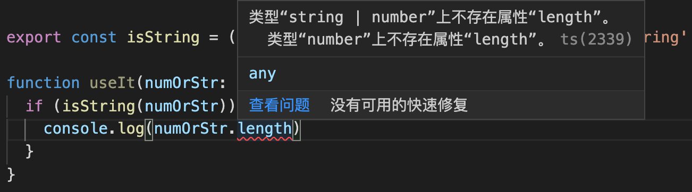

# TypeScript 之类型编程

> 类型编程实际也是编程。

## 1. 前言

这篇文章就是为了解决这后者的问题，尝试专注于 TypeScript 的类型编程部分（TS 还有几个部分？请看下面的解释），从最基础的泛型开始，到索引、映射、条件等类型，再到 is、in、infer 等关键字，最后是压轴的工具类型。

**TypeScript = 类型编程 + ES 提案**

笔者通常将 TypeScript 划分成两个部分：

- 预实现的 ES 提案

  如 装饰器、可选链?. 、空值合并运算符??（和可选链一起在 TypeScript3.7 中引入）、类的私有成员 private 等。
  除了部分极端不稳定的语法（说的就是你，装饰器）以外，大部分的 TS 实现实际上就是未来的 ES 语法。

- 类型编程

  从一个简简单单的 interface，到看起来挺高级的 T extends SomeType ，再到各种不明觉厉的工具类型 Partial、Required 等，这些都属于类型编程的范畴。
  这一部分对代码实际的功能层面没有任何影响，不会影响你代码本身的逻辑。

  然而，这也就是类型编程一直不受到太多重视的原因：相比于语法，它会带来许多额外的代码量（类型定义代码甚至可能超过业务代码量）等问题。
  而且实际业务中并不会需要多么苛刻的类型定义，通常只会对接口数据、应用状态流等进行定义，通常是底层框架类库才会需要大量的类型编程代码。

接下来进入正题。

## 2. 泛型

在 TypeScript 的整个类型编程体系中，它是最基础的那部分，所有的进阶类型都基于它书写。
就像编程时我们不能没有变量，类型编程中的变量就是泛型。

假设我们有这么一个函数：

```ts
function foo(args: unknown): unknown { /* ... */ }
```

- 如果它接收一个字符串，返回这个字符串的部分截取。
- 如果接收一个数字，返回这个数字的 n 倍。
- 如果接收一个对象，返回键值被更改过的对象（键名不变）。

上面这些场景有一个共同点，即函数的返回值与入参是同一类型.

如果在这里要获得精确地类型定义，应该怎么做？

- 把 unknown 替换为 string | number | object ？
  但这样代表的意思是这个函数接受任何值，其返回类型都可能是 string / number / object，虽然有了类型定义，但完全称不上是精确。

别忘记我们需要的是 入参与返回值类型相同 的效果。这个时候泛型就该登场了，我们先用一个泛型收集参数的类型值，再将其作为返回值，就像这样：

```ts
function foo<T>(args: T): T {
    return args;
}
```

这样在我们使用 foo 函数时，编辑器就能实时根据我们传入的参数确定此函数的返回值了。
就像编程时，程序中变量的值会在其运行时才被确定，泛型的值（类型）也是在方法被调用、类被实例化等类似的执行过程实际发生时才会被确定的。

泛型使得代码段的类型定义`易于重用`（比如后续又多了一种接收 boolean 返回 boolean 的函数实现），并提升了灵活性与严谨性。

> 通常泛型只会使用单个字母。如 T U K V S 等。
> 我的推荐做法是在项目达到一定复杂度后，使用带有具体意义的泛型变量声明，如 BasicBusinessType 这种形式。

```ts
foo<string>('str');
```

上面的例子也可以不指定，因为 TS 会自动推导出泛型的实际类型：

```ts
foo('str');
```

在部分 Lint 规则中，实际上也不推荐添加能够被自动推导出的类型值。

泛型在箭头函数下的书写：

```ts
const foo = <T>(arg: T): T => arg;
```

如果你在 `TSX` 文件中这么写，`<T>` 可能会被识别为 `JSX` 标签，因此需要显式告知编译器：

```ts
const foo = <T extends SomeBasicType>(arg: T): T => arg;
```

除了用在函数中，泛型也可以在类中使用：

```ts
class Foo<T, U> {
    constructor(public arg1: T, public arg2: U) {}

    public method(): T {
        return this.arg1;
    }
}
```

单独对于泛型的介绍就到这里，在接下来的进阶类型篇章中，我们会讲解更多泛型的使用。

## 3. 类型守卫

我们从相对简单直观的知识点：`类型守卫` 开始，由浅入深的了解基于泛型的类型编程。

### 3.1 is、in 关键字

假设有这么一个字段，它可能字符串也可能是数字：

```ts
let numOrStrProp: number | string;
```

现在在使用时，你想将这个字段的`联合类型`缩小范围，比如精确到 string，你可能会这么写：

```ts
export const isString = (arg: unknown): boolean => typeof arg === 'string';
```

看看这么写的效果：

```ts
function useIt(numOrStr: number | string) {
    if (isString(numOrStr)) {
        console.log(numOrStr.length);
    }
}
```



看起来 isString 函数并没有起到`缩小类型范围`的作用，参数依然是`联合类型`。这个时候就该使用 `is` 关键字了：

这个时候再去使用，就会发现在 isString(numOrStr) 为 true 后，numOrStr 的类型就被缩小到了 string。

这只是以`原始类型`为成员的`联合类型`，我们完全可以扩展到各种场景上，先看一个简单的假值判断：

```ts
export type Falsy = false | '' | 0 | null | undefined;

export const isFalsy = (val: unknown): val is Falsy => !val;
```

而使用 `in` 关键字，我们可以进一步`收窄类型（Type Narrowing）`，思考下面这个例子，要如何将 "A | B" 的联合类型缩小到 "A" ？

```ts
class A {
    public a() {}

    public useA() {
        return 'A';
    }
}
class B {
    public b() {}

    public useB() {
        return 'B';
    }
}
```

首先联想下 `for...in` 循环，它遍历对象的属性名，而 `in` 关键字也是一样，它能够判断一个属性是否为对象所拥有：

```ts
function useIt(arg: A | B): void {
    'a' in arg ? arg.useA() : arg.useB();
}
```

如果参数中存在 a 属性，由于 A、B 两个类型的交集并不包含 a，所以这样能立刻收窄类型判断到 A 身上。
由于 A、B 两个类型的交集并不包含 a 这个属性，所以这里的 `in` 判断会精确地将类型对应收窄到三元表达式的前后。即 A 或者 B。

再看一个使用字面量类型作为类型守卫的例子：

```ts
interface IBoy {
    name: 'mike';
    gf: string;
}
interface IGirl {
    name: 'sofia';
    bf: string;
}
function getLover(child: IBoy | IGirl): string {
    if (child.name === 'mike') {
        return child.gf;
    } else {
        return child.bf;
    }
}
```

> 关于字面量类型 `literal types`，它是对类型的进一步限制，比如你的状态码只可能是 `0/1/2`，那么你就可以写成 `status: 0 | 1 | 2` 的形式，而不是用一个 number 来表达。
> 字面量类型包括`字符串字面量`、`数字字面量`、`布尔值字面量`，以及 4.1 版本引入的`模板字面量`类型。

- 字符串字面量，常见如 mode: "dev" | "prod"。
- 布尔值字面量通常与其他字面量类型混用，如 open: true | "none" | "chrome"。

### 3.2 基于字段区分接口

比如，登录与未登录下的用户信息是完全不同的接口（或者是类似的，需要基于属性、字段来区分不同接口），其实也可以使用 `in` 关键字 解决：

```ts
interface ILogInUserProps {
    isLogin: boolean;
    name: string;
}
interface IUnLoginUserProps {
    isLogin: boolean;
    from: string;
}
type UserProps = ILogInUserProps | IUnLoginUserProps;
function getUserInfo(user: UserProps): string {
    return 'name' in user ? user.name : user.from;
}
```

或者通过字面量类型：

```ts
interface ICommonUserProps {
    type: 'common';
    accountLevel: string;
}
interface IVIPUserProps {
    type: 'vip';
    vipLevel: string;
}
type UserProps = ICommonUserProps | IVIPUserProps;
function getUserInfo(user: UserProps): string {
    return user.type === 'common' ? user.accountLevel : user.vipLevel;
}
```

## 4. 索引类型与映射类型

### 4.1 索引类型

就像你写业务代码的时候常常会遍历一个对象，而在类型编程中我们也会经常遍历一个接口。
因此，你完全可以将一部分编程思路复用过来。

首先实现一个简单的函数，它返回一个对象的某个键值：

```js
// 假设 key 是 obj 键名
function pickSingleValue(obj, key) {
    return obj[key];
}
```

要为其进行类型定义的话，有哪些需要定义的地方？

- 参数 obj
- 参数 key
- 返回值

这三样之间存在着一定关联：

- key 必然是 obj 中的键值名之一，且一定为 string 类型（通常我们只会使用字符串作为对象键名）
- 返回的值一定是 obj 中的键值

因此我们初步得到这样的结果：

```ts
function pickSingleValue<T>(obj: T, key: keyof T) {
    return obj[key];
}
```

`keyof` 是 **索引类型查询** 的语法， 它会返回后面跟着的类型参数的键值组成的字面量联合类型，举个例子：

```ts
interface foo {
    a: number;
    b: string;
}
type KEY_OF_FOO = keyof foo; // "a" | "b"
```

是不是就像 `Object.keys()` 一样？区别就在于它返回的是`联合类型`。

联合类型 `Union Type` 通常使用 `|` 语法，代表`多个可能的取值`，实际上在最开始我们就已经使用过了。

还少了返回值，我们先联想下 `for...in` 语法，遍历对象时我们可能会这么写：

```js
const fooObj = { a: 1, b: '1' };

for (const key in fooObj) {
    console.log(key);
    console.log(fooObj[key]);
}
```

和上面的写法一样，我们拿到了 key，就能拿到对应的 value，那么 value 的类型就更简单了：

```ts
function pickSingleValue<T>(obj: T, key: keyof T): T[keyof T] {
    return obj[key];
}
```

解释下：

```ts
interface T {
    a: number;
    b: string;
}
type TKeys = keyof T; // "a" | "b"
type PropAType = T['a']; // number
```

> 你用键名可以取出对象上的键值，自然也就可以取出接口上的键值（也就是类型）啦~

但这种写法很明显有可以改进的地方：keyof 出现了两次，以及泛型 T 其实应该被限制为对象类型。
对于第一点，就像我们平时编程会做的那样：用一个变量把多处出现的存起来，记得，`在类型编程里，泛型就是变量`。

```ts
function pickSingleValue<T extends object, U extends keyof T>(obj: T, key: U): T[U] {
    return obj[key];
}
```

这里又出现了新东西 `extends`... 它是啥？你可以暂时把 `T extends object` 理解为 T 被限制为对象类型，`U extends keyof T` 理解为 `泛型 U 必然是泛型 T 的键名组成的联合类型`（以字面量类型的形式，比如 T 这个对象的键名包括 a b c，那么 U 的取值只能是"a" "b" "c"之一，即 `"a" | "b" | "c"`）。

假设现在不只要取出一个值了，我们要取出一系列值，即参数 2 将是一个数组，成员均为参数 1 的键名组成：

```ts
function pick<T extends object, U extends keyof T>(obj: T, keys: U[]): T[U][] {
    return keys.map(key => obj[key]);
}
// pick(obj, ['a', 'b'])
```

有两个重要变化：

- `keys: U[]`
  我们知道 U 是 T 的键名组成的联合类型，那么要表示一个内部元素均是 T 键名的数组，就可以使用这种方式。
- `T[U][]`
  它的原理实际上和上面一条相同，首先是 T[U]，代表参数 1 的键值（就像 Object[Key]）

这是一个很好地例子，表现了 TS 类型编程的组合性，你不感觉这种写法就像搭积木一样吗？

### 4.2 索引签名 Index Signature

在 JavaScript 中，我们通常使用 arr[1] 的方式索引数组，使用 obj[key] 的方式索引对象。
说白了，索引就是你获取一个对象成员的方式，而在类型编程中，索引签名用于快速建立一个内部字段类型相同的接口，如：

```ts
interface Foo {
    [keys: string]: string;
}
```

那么接口 Foo 实际上等价于一个键值全部为 string 类型，不限制成员的接口。

值得注意的是，由于 JS 可以同时通过数字与字符串访问对象属性，因此 `keyof Foo` 的结果会是 `string | number`。

```ts
const o: Foo = {
    1: '芜湖！',
};
o[1] === o['1']; // true
```

但是一旦某个接口的索引签名类型为 `number`，那么使用它的对象就不能再通过字符串索引访问，如 o['1']，将会抛出错误，`元素隐式具有 "any" 类型，因为索引表达式的类型不为 "number"`。

### 4.3 映射类型 Mapped Types

在开始映射类型前，首先想想 JavaScript 中数组的 map 方法，通过使用 map，我们从一个数组按照既定的映射关系获得一个新的数组。
在类型编程中，我们则会从一个类型定义（包括但不限于接口、类型别名）映射得到一个新的类型定义。通常会在旧有类型的基础上进行改造，如：

- 修改原接口的键值类型
- 为原接口键值类型新增修饰符，如 `readonly` 与 可选 `?`

从一个简单场景入手：

```ts
interface A {
    a: boolean;
    b: string;
    c: number;
    d: () => void;
}
```

现在我们有个需求，实现一个接口，它的字段与接口 A 完全相同，但是其中的类型全部为 string，你会怎么做？
直接重新声明一个然后手写吗？

如果把接口换成对象再想想，假设要拷贝一个对象（假设没有嵌套，不考虑引用类型变量存放地址），常用的方式是首先 new 一个新的空对象，然后遍历原先对象的键值对来填充新对象。而接口其实也一样：

```ts
type StringifyA<T> = {
    [K in keyof T]: string
};
```

是不是很熟悉？重要的就是这个 `in` 操作符，你完全可以把它理解为 `for...in/for...of` 这种遍历的思路，获取到键名之后，键值就简单了，所以我们可以很容易的拷贝一个新的类型别名出来。

```ts
type ClonedA<T> = {
    [K in keyof T]: T[K]
};
```

掌握这种思路，其实你已经接触到一些工具类型的底层实现了：

> 你可以把工具类型理解为你平时放在 utils 文件夹下的公共函数，提供了对公用逻辑（在这里则是类型编程逻辑）的封装。比如上面的两个类型接口就是。

先写个最常用的 Partial 看下：

```ts
// 将接口下的字段全部变为可选的
type Partial<T> = {
    [K in keyof T]?: T[K]
};
```

> `key?: value` 意为这一字段是可选的，在大部分情况下等同于 `key: value | undefined`。

## 5. 条件类型 Conditional Types

### 5.1 三元表达式条件类型

在编程中遇到条件判断，我们常用 if 语句与三元表达式实现，如：

```js
if (condition) {
    execute();
}
```

这种没有 else 的 If 语句，也可以写成：

```js
condition ? execute() : void 0;
```

而`条件类型`的语法，实际上就是三元表达式，看一个最简单的例子：

```ts
type ConditionType<T, U, X, Y> = T extends U ? X : Y;
```

> 如果你觉得这里的 extends 不太好理解，可以暂时简单理解为 U 中的属性在 T 中都有。

为什么会有条件类型？
可以看到`条件类型`通常是和`泛型`一同使用的，联想到泛型的使用场景以及值的延迟推断，我想你应该明白了些什么。
对于类型无法即时确定的场景，使用`条件类型`来在运行时动态的确定最终的类型（运行时可能不太准确，或者可以理解为，你提供的函数被他人使用时，根据他人使用时传入的参数来动态确定需要被满足的类型约束）。

类比到编程语句中，其实就是根据条件判断来动态的赋予变量值：

```ts
let unknownVar: string;
// eslint-disable-next-line prefer-const
unknownVar = condition ? '前端' : 'FED';

type LiteralType<T> = T extends string ? 'foo' : 'bar';
```

条件类型理解起来其实也很直观，唯一需要有一定理解成本的就是何时条件类型系统会收集到足够的信息来确定类型，也就是说，条件类型有时不会立刻完成判断，比如工具库提供的函数，需要用户在使用时传入参数才会完成`条件类型`的判断。

在了解这一点前，我们先来看看条件类型常用的一个场景：`泛型约束`，实际上就是我们上面`索引类型`的例子：

```ts
function pickSingleValue<T extends object, U extends keyof T>(obj: T, key: U): T[U] {
    return obj[key];
}
```

这里的 `T extends object` 与 `U extends keyof T` 都是`泛型约束`，分别将 `T` 约束为`对象类型` 和将 `U` 约束为 `T` 键名的`字面量联合类型`（提示：1 | 2 | 3）。
我们通常使用`泛型约束`来`收窄类型约束`，简单的说，`泛型`本身是来者不拒的，所有类型都能被`显式传入`（如 `Array<number>`）或者`隐式推导`（如 foo(1)），这样其实不是我们想要的，就像我们有时会检测函数的参数：

```js
function checkArgFirst(arg) {
    if (typeof arg !== 'number') {
        throw new TypeError('arg must be number type!');
    }
}
```

在 TS 中，我们通过`泛型约束`，要求`传入的泛型`只能是`固定的类型`，如 `T extends {}` 约束泛型至对象类型，`T extends number | string` 将泛型约束至数字与字符串类型。

以一个使用条件类型作为函数返回值类型的例子：

```ts
declare function strOrNum<T extends boolean>(x: T): T extends true ? string : number;
```

在这种情况下，条件类型的推导就会被延迟，因为此时类型系统没有足够的信息来完成判断。
只有给出了所需信息（在这里是入参 x 的类型），才可以完成推导。

```ts
const strReturnType = strOrNum(true);
const numReturnType = strOrNum(false);
```

同样的，就像三元表达式可以嵌套，条件类型也可以嵌套。条件类型可以将类型约束收拢到非常窄的范围内，提供精确的条件类型，如：

```ts
type TypeName<T> = T extends string
    ? 'string'
    : T extends number
        ? 'number'
        : T extends boolean
            ? 'boolean'
            : T extends undefined
                ? 'undefined'
                // eslint-disable-next-line ts/no-unsafe-function-type
                : T extends Function
                    ? 'function'
                    : 'object';
```

### 5.2 分布式条件类型 Distributive Conditional Types

分布式条件类型实际上不是一种特殊的条件类型，而是其特性之一（所以说条件类型的分布式特性更为准确）。
我们直接先上概念：对于属于裸类型参数的检查类型，条件类型会在实例化时期自动分发到联合类型上。

> 原文: Conditional types in which the checked type is a naked type parameter are called distributive conditional types. Distributive conditional types are automatically distributed over union types during instantiation.

先提取几个关键词，然后我们再通过例子理清这个概念：

- 裸类型参数（类型参数即泛型）
- 实例化
- 分发到联合类型

```ts
// 使用上面的 TypeName 类型别名

// "string" | "function"
type T1 = TypeName<string | (() => void)>;

// "string" | "object"
type T2 = TypeName<string | string[]>;

// "object"
type T3 = TypeName<string[] | number[]>;
```

我们发现在上面的例子里，条件类型的推导结果都是联合类型（T3 实际上也是，只不过因为结果相同所以被合并了）。
其实就是类型参数被依次进行条件判断后，再使用 `|` 组合得来的结果。

上面的例子中泛型都是裸露着的，如果被包裹着，其条件类型判断结果会有什么变化吗？我们再看另一个例子：

```ts
type Naked<T> = T extends boolean ? 'Y' : 'N';
type Wrapped<T> = [T] extends [boolean] ? 'Y' : 'N';

// "N" | "Y"
type Distributed = Naked<number | boolean>;

// "N"
type NotDistributed = Wrapped<number | boolean>;
```

- 其中，Distributed 类型别名，其类型参数（number | boolean）会正确的分发，即
  先分发到 `Naked<number> | Naked<boolean>`，再进行判断，所以结果是 `"N" | "Y"`。

- 而 NotDistributed 类型别名，第一眼看上去感觉 TS 应该会自动按数组进行分发，结果应该也是 `"N" | "Y"` ？
  但实际上，它的类型参数（`number | boolean`）不会有分发流程，直接进行 `[number | boolean] extends [boolean]` 的判断，所以结果是 `"N"`。

现在我们可以来讲讲这几个概念了：

- 裸类型参数
  没有额外被 `[]` 包裹过的，就像被数组包裹后就不能再被称为裸类型参数。

- 实例化
  其实就是条件类型的判断过程，就像我们前面说的，条件类型需要在收集到足够的推断信息之后才能进行这个过程。

- 分发到联合类型：

  - 对于 TypeName，它内部的类型参数 T 是没有被包裹过的，所以 `TypeName<string | (() => void)>` 会被分发为 `TypeName<string> | TypeName<(() => void)>`，然后再次进行判断，最后分发为 `"string" | "function"`。
  - 抽象下具体过程：

  ```ts
  // ( A | B | C ) extends T ? X : Y
  // 相当于
  // (A extends T ? X : Y) | (B extends T ? X : Y) | (C extends T ? X : Y)

  // 使用 [] 包裹后，不会进行额外的分发逻辑。
  // [A | B | C] extends [T] ? X : Y
  ```

  - 一句话概括：没有被 `[]` 额外包装的联合类型参数，在条件类型进行判定时会将联合类型分发，分别进行判断。

这两种行为没有好坏之分，区别只在于`是否进行联合类型的分发`，如果你需要走分布式条件类型，那么注意保持你的类型参数为`裸类型参数`。
如果你想避免这种行为，那么使用 `[]` 包裹你的类型参数即可（注意在 `extends` 关键字的两侧都需要）。

## 6. infer 关键字

在`条件类型`中，我们展示了如何`通过条件判断来延迟确定类型`，但仅仅使用条件类型也有一定不足：它无法从条件上得到类型信息。
举例来说，`T extends Array<PrimitiveType> ? "foo" : "bar"` 这一例子，我们不能从作为条件的 `Array<PrimitiveType>` 中获取到 `PrimitiveType` 的实际类型。

而这样的场景又是十分常见的，如获取函数返回值的类型、拆箱 Promise / 数组等，因此这一节我们来介绍下 `infer` 关键字。

`infer` 是 `inference` 的缩写，通常的使用方式是用于修饰作为类型参数的泛型，如：`infer R`，`R` 表示`待推断的类型`。
通常 infer 不会被直接使用，而是与条件类型一起，被放置在底层工具类型中。
如果说条件类型提供了延迟推断的能力，那么加上 `infer` 就是提供了`基于条件进行延迟推断的能力`。

看一个简单的例子，用于获取函数返回值类型的工具类型 `ReturnType`：

```ts
function foo(): string {
    return 'linbudu';
}

type ReturnType<T> = T extends (...args: any[]) => infer R ? R : never;

// string
type FooReturnType = ReturnType<typeof foo>;
```

- `(...args: any[]) => infer R` 是一个整体，这里函数的返回值类型的位置被 `infer R` 占据了。
- 当 `ReturnType` 被调用，类型参数 T 、R 被显式赋值（`T` 为 `typeof foo`，`infer R` 被整体赋值为 `string`，即函数的返回值类型），如果 `T` 满足条件类型的约束，就返回 infer 完毕的 R 的值，在这里 R 即为函数的返回值实际类型。
- 实际上为了严谨，应当约束泛型 T 为函数类型，即：

  ```ts
  // 第一个 extends 约束可传入的泛型只能为函数类型
  // 第二个 extends 作为条件判断
  type ReturnType<T extends (...args: any[]) => any> = T extends (...args: any[]) => infer R ? R : never;
  ```

infer 的使用思路可能不是那么好习惯，我们可以用前端开发中常见的一个例子类比，页面初始化时先显示占位交互，像 Loading / 骨架屏，在请求返回后再去渲染真实数据。
infer 也是这个思路，类型系统在获得足够的信息（通常来自于条件的延迟推断）后，就能将 infer 后跟随的类型参数推导出来，最后通常会返回这个推导结果。

另外，对于 TS 中函数重载的情况，使用 infer（如上面的 ReturnType）不会为所有重载执行推导过程，只有最后一个重载（因为一般来说最后一个重载通常是最广泛的情况）会被使用。

## 7. 工具类型 Tool Type

这一部分包括 TS 内置工具类型与社区的扩展工具类型，可以在自己的项目里新建一个.d.ts 文件（或是 /utils/tool-types.ts 这样）存储常用的一些工具类型。

### 7.1 内置工具类型

在上面我们已经实现了内置工具类型中被使用最多的一个：

```ts
type Partial<T> = {
    [K in keyof T]?: T[K]
};
```

它用于将一个接口中的字段全部变为可选，除了索引类型以及映射类型以外，它只使用了 `?` 可选修饰符，那么继续展示其他场景：

- 去除可选修饰符：`-?`，位置与 `?` 一致
- 只读修饰符：`readonly`，位置在键名，如 `readonly key: string`
- 去除只读修饰符：`-readonly`，位置同 `readonly`。

恭喜，你得到了 `Required` 和 `Readonly`（去除 readonly 修饰符的工具类型不属于内置的，我们会在后面看到）：

```ts
type Required<T> = {
    [K in keyof T]-?: T[K]
};

type Readonly<T> = {
    readonly [K in keyof T]: T[K]
};
```

在上面我们实现了一个 pick 函数：

```ts
function pick<T extends object, U extends keyof T>(obj: T, keys: U[]): T[U][] {
    return keys.map(key => obj[key]);
}
console.log(pick({ a: 123, b: 'name' }, ['a', 'b'])); // [ 123, 'name' ]
```

类似的，假设我们现在需要从一个接口中挑选一些字段：

```ts
type Pick<T, K extends keyof T> = {
    [P in K]: T[P]
};

// 期望用法
/**
 * 期望结果：
 * {
 *    a: boolean;
 *    b: string;
 * }
 */
interface A {
    a: boolean;
    b: string;
    c: number;
    d: () => void;
}
type Part = Pick<A, 'a' | 'b'>;
```

还是映射类型，只不过现在映射类型的映射源是传入给 Pick 的类型参数 K。

既然有了 Pick，那么自然要有 `Omit`（一个是从对象中挑选部分，一个是排除部分），它和 Pick 的写法非常像，但有一个问题要解决：
我们要怎么表示 T 中剔除了 K 后的剩余字段？

> Pick 选取传入的键值，Omit 移除传入的键值。

这里我们又要引入一个知识点：`never` 类型，它表示`永远不会出现的类型`，通常被用来`收窄联合类型或是接口`，或者作为条件类型判断的兜底。

上面的场景其实可以简化为：

```ts
// "3" | "4" | "5"
type LeftFields = Exclude<'1' | '2' | '3' | '4' | '5', '1' | '2'>;
```

`Exclude`，字面意思看起来是排除，那么第一个参数应该是`要进行筛选的`，第二个应该是`筛选条件`。先按着这个思路试试：

这里实际上使用到了分布式条件类型的特性，假设 `Exclude` 接收 `T` `U` 两个类型参数，`T` 联合类型中的类型会依次与 `U` 类型进行判断，如果这个类型参数在 `U` 中，就`剔除`掉它（赋值为 `never`）。

> 通俗些解释：`"1"` 在 `"1" | "2"` 里面( `"1" extends "1" | "2" -> true` )吗？在的话，就剔除掉它（赋值为 never），不在的话就保留。

```ts
type Exclude<T, U> = T extends U ? never : T;
```

那么 `Omit` 就很简单了，对原接口的成员，剔除掉传入的联合类型成员，应用 `Pick` 即可。

```ts
type Omit<T, K extends keyof any> = Pick<T, Exclude<keyof T, K>>;
// 期望用法
/**
 * 期望结果：
 * {
 *    c: number;
      d: () => void;
 * }
 */
interface A {
    a: boolean;
    b: string;
    c: number;
    d: () => void;
}
type OmitPart = Omit<A, 'a' | 'b'>;
```

其实，几乎所有使用`条件类型`的场景，把判断后的赋值语句反一下，就会有新的场景，比如 `Exclude` 移除掉键名，那反一下就是保留键名：

```ts
type Extract<T, U> = T extends U ? T : never;
// "1" | "2"
type MyExtractFields = Extract<'1' | '2' | '3' | '4' | '5', '1' | '2'>;
```

再来看个常用的工具类型 `Record<Keys, Type>`，通常用于生成以`联合类型`为键名（`Keys`），`键值类型`为 `Type` 的新接口，比如：

```ts
type MyNav = 'a' | 'b' | 'c';
interface INavWidgets {
    widgets: string[];
    title?: string;
    keepAlive?: boolean;
}
const router: Record<MyNav, INavWidgets> = {
    a: { widgets: [''] },
    b: { widgets: [''] },
    c: { widgets: [''] },
};
```

其实很简单，把 `Keys` 的每个键值拿出来，类型规定为 `Type` 即可：

```ts
// K extends keyof any 约束 K 必须为联合类型
type Record<K extends keyof any, T> = {
    [P in K]: T
};
```

注意，`Record` 也支持 `Record<string, unknown>` 这样的使用方式，`string extends keyof any` 也是成立的，因为 `keyof` 的最终结果必然是 `string` 组成的`联合类型`（除了使用数字作为键名的情况）。

在前面的 `infer` 一节中我们实现了用于获取函数返回值的 `ReturnType`：

```ts
type ReturnType<T extends (...args: any[]) => any> = T extends (...args: any[]) => infer R ? R : any;
```

其实把 `infer` 换个位置，比如放到入参处，它就变成了获取参数类型的 `Parameters`：

```ts
function foo(name: string, sex: string): string {
    return `${name}_${sex}`;
}
type Parameters<T extends (...args: any[]) => any> = T extends (...args: infer P) => any ? P : never;
// [ name: string, sex: string ]
type FooParameters = Parameters<typeof foo>;
```

如果再大胆一点，把`普通函数`换成`类的构造函数`，那么就得到了`获取类构造函数入参类型`的 `ConstructorParameters`：

```ts
class ClassB {
    constructor(public name: string) {
        this.name = name;
    }
}
type ConstructorParameters<T extends new (...args: any[]) => any> = T extends new (...args: infer P) => any ? P : never;
// [ name: string ]
type ClassBConstructorParameters = ConstructorParameters<typeof ClassB>;
```

> 加上 `new` 关键字来使其成为`可实例化类型声明`，即此处约束泛型为`类`。

这个是获得类的构造函数入参类型，如果把待 `infer` 的类型放到其返回处，想想 `new` 一个类的返回值是什么？实例！所以我们得到了实例类型 `InstanceType`：

```ts
class ClassB {
    constructor(public name: string) {
        this.name = name;
    }
}
type InstanceType<T extends new (...args: any[]) => any> = T extends new (...args: any[]) => infer R ? R : any;
// ClassB
type ClassBInstanceType = InstanceType<typeof ClassB>;
```

这几个例子看下来，你会发现，类型编程的确没有特别高深晦涩的语法，它考验的是你对其中基础部分如`索引`、`映射`、`条件类型`的掌握程度，以及举一反三的能力。
下面我们要学习的`社区工具类型`，本质上还是各种基础类型的组合，只是从常见场景下出发，补充了官方没有覆盖到的部分。

### 7.2 社区工具类型

这一部分的工具类型大多来自于 `utility-types`。

我们由浅入深，先封装基础的类型别名和对应的类型守卫：

```ts
export type Primitive = string | number | bigint | boolean | symbol | null | undefined;

export function isPrimitive(val: unknown): val is Primitive {
    if (val === null || val === undefined) {
        return true;
    }

    const typeDef = typeof val;

    const primitiveNonNullishTypes = ['string', 'number', 'bigint', 'boolean', 'symbol'];

    return primitiveNonNullishTypes.includes(typeDef);
}

// null 或 undefined 别名
export type Nullish = null | undefined;
// 非 undefined
export type NonUndefined<A> = A extends undefined ? never : A;
// 非 null
export type NonNullable<T> = T extends null ? never : T;
```

我们再来看一个常用的场景，提取 Promise 的实际类型：

```ts
function foo(): Promise<string> {
    return new Promise((resolve, reject) => {
        resolve('name');
    });
}

export type PromiseType<T extends Promise<any>> = T extends Promise<infer U> ? U : never;

// Promise<string>
type FooReturnType = ReturnType<typeof foo>;
// string
type NakedFooReturnType = PromiseType<FooReturnType>;
```

只需要用一个 `infer` 参数作为 `Promise` 的泛型即可，使用 `infer R` 来等待类型系统推导出 `R` 的具体类型。

### 7.3 递归的工具类型

前面我们写了个 `Partial` `Readonly` `Required` 等几个对接口字段进行修饰的工具类型，但实际上都有局限性，如果接口中存在着嵌套呢？

```ts
type Partial<T> = {
    [P in keyof T]?: T[P]
};
```

理一下逻辑：

- 如果不是对象类型，就只是加上 `?` 修饰符；
- 如果是对象类型，那就遍历这个对象内部；
- 重复上述流程。

是否是对象类型的判断我们见过很多次了, `T extends object` 即可，那么如何遍历对象内部？实际上就是递归。

```ts
export type DeepPartial<T> = {
    [P in keyof T]?: T[P] extends object ? DeepPartial<T[P]> : T[P]
};
```

> 实际封装比这个要复杂些，还要考虑数组的情况，这里为了便于理解做了简化，后面的工具类型也同样存在此类简化。

那么 DeepReadobly、 DeepRequired 也就很简单了：

```ts
export type DeepMutable<T> = {
    -readonly [P in keyof T]: T[P] extends object ? DeepMutable<T[P]> : T[P]
};

// 即 DeepReadonly
export type DeepImmutable<T> = {
    +readonly [P in keyof T]: T[P] extends object ? DeepImmutable<T[P]> : T[P]
};

export type DeepRequired<T> = {
    [P in keyof T]-?: T[P] extends object ? DeepRequired<T[P]> : T[P]
};
```

### 7.4 返回键名的工具类型

在有些场景下我们需要一个工具类型，它返回接口字段键名组成的联合类型，然后用这个联合类型进行进一步操作（比如给 Pick 或者 Omit 这种使用），一般键名会符合特定条件，比如：

- 可选/必选/只读/非只读的字段
- （非）对象/（非）函数/类型的字段

来看个最简单的函数类型字段 `FunctionTypeKeys`：

```ts
interface IObjWithFuncKeys {
    a: string;
    b: number;
    c: boolean;
    d: () => void;
    e: () => void;
}
export type FunctTypeKeys<T extends object> = {
    // eslint-disable-next-line ts/no-unsafe-function-type
    [K in keyof T]-?: T[K] extends Function ? K : never
}[keyof T];
// "d" | "e"
type FunKeys = FunctTypeKeys<IObjWithFuncKeys>;
```

`{[K in keyof T]: ... }[keyof T]` 这个写法可能有点难以理解，拆开来看：

```ts
interface IObjWithFuncKeys {
    a: string;
    b: number;
    c: boolean;
    d: () => void;
}

type WithFunKeysIsThis<T extends object> = {
    // eslint-disable-next-line ts/no-unsafe-function-type
    [K in keyof T]-?: T[K] extends Function ? K : never
};

type UseIt = WithFunKeysIsThis<IObjWithFuncKeys>;
```

很容易推导出 `UseIt` 实际上就是：

```ts
interface UseIt {
    a: never;
    b: never;
    c: never;
    d: 'd';
}
```

> `UseIt` 会保留所有字段，满足条件的字段其键值为字面量类型（即键名），不满足的则为 never。

加上后面一部分：

```ts
type UseItFilter = UseIt[keyof IObjWithFuncKeys];
```

这个过程类似排列组合：`never` 类型的值不会出现在`联合类型`中：

```ts
// never 类型会被自动去除掉 string | number
type WithNever = string | never | number;
```

所以 `{ [K in keyof T]: ... }[keyof T]` 这个写法实际上就是为了返回键名（准备的说，是键名组成的`联合类型`）。

下面来看可选字段 `OptionalKeys` 与必选字段 `RequiredKeys`，先来看个小例子：

```ts
// "N"
// eslint-disable-next-line ts/no-empty-object-type
type JUDGE1 = {} extends { prop: number } ? 'Y' : 'N';
// "Y
// eslint-disable-next-line ts/no-empty-object-type
type JUDGE2 = {} extends { prop?: number } ? 'Y' : 'N';
```

对于前面一个情况，prop 是必须的，因此空对象 `{}` 并不能满足 `extends { prop: number }`，而对于 prop 为可选的情况下则可以。

因此，我们使用这种思路来得到可选/必选的键名，以 OptionalKeys 为例：

- `{} extends Pick<T, K>`，如果 K 是可选字段，那么就留下，否则就剔除。
- 怎么剔除？当然是用 never 了。

```ts
interface IObjKeys {
    a?: string;
    b: number;
    c: boolean;
}
export type RequiredKeys<T> = {
    // eslint-disable-next-line ts/no-empty-object-type
    [K in keyof T]-?: {} extends MyPick<T, K> ? never : K
}[keyof T];
// "b" | "c"
type IObjRequiredKeys = RequiredKeys<IObjKeys>;
```

这里是剔除可选字段，那么 OptionalKeys 就是保留了：

```ts
interface IObjKeys {
    a?: string;
    b: number;
    c: boolean;
}
export type OptionalKeys<T> = {
    // eslint-disable-next-line ts/no-empty-object-type
    [K in keyof T]-?: {} extends Pick<T, K> ? K : never
}[keyof T];
// "a"
type IObjOptionalKeys = OptionalKeys<IObjKeys>;
```

只读字段 `IMmutableKeys` 与非只读字段 `MutableKeys` 的思路类似，即先获得：

```ts
interface MutableKeys {
    readonlyKeys: never;
    notReadonlyKeys: 'notReadonlyKeys';
}
```

然后再获得不为 `never` 的字段名即可。

首先定义一个工具类型 Equal，比较两个类型是否相同，甚至可以比较修饰前后的情况下，也就是这里只读与非只读的情况。

```ts
interface IEqualKeys {
    a?: string;
    b: number;
    c: boolean;
}
type Equal<X, Y, A = X, B = never> = (<T>() => T extends X ? 1 : 2) extends <T>() => T extends Y ? 1 : 2 ? A : B;
// "never"
type EqualKeys1 = Equal<IEqualKeys, { [P in keyof IEqualKeys]-?: IEqualKeys[P] }>;
// "hahaha"
type EqualKeys2 = Equal<
    { [P in keyof IEqualKeys]-?: IEqualKeys[P] },
    { [P in keyof IEqualKeys]-?: IEqualKeys[P] },
    'hahaha'
>;
```

- 不要被 `<T>() => T extends X ? 1 : 2` 干扰，可以理解为就是用于比较的包装，这一层包装能够区分出来只读与非只读属性。
  即 `(<T>() => T extends X ? 1 : 2)` 这一部分，只有在类型参数 `X` 完全一致时，两个 `(<T>() => T extends X ? 1 : 2)` 才会是全等的，这个一致要求只读性、可选性等修饰也要一致。
- 实际使用时（以非只读的情况为例），我们为 `X` 传入接口，为 `Y` 传入去除了只读属性 `-readonly` 的接口，使得所有键都被进行一次与去除只读属性的键的比较。
  为 A 传入字段名，B 这里我们需要的就是 never，因此可以不填。

实例：

```ts
interface IReadonlyKeys {
    readonly a: string;
    b: number;
    c: boolean;
}
// 非只读的 Keys
export type MutableKeys<T extends object> = {
    [P in keyof T]-?: Equal<{ [Q in P]: T[P] }, { -readonly [Q in P]: T[P] }, P, never>
}[keyof T];
// "b" | "c"
type MutableKeys1 = MutableKeys<IReadonlyKeys>;
```

几个容易绕弯子的点：

- 泛型 Q 在这里不会实际使用，只是映射类型的字段占位。
- X 、 Y 同样存在着分布式条件类型，来依次比对字段去除 `readonly` 前后。

同样的有：

```ts
interface IReadonlyKeys {
    readonly a: string;
    b: number;
    c: boolean;
}
export type IMmutableKeys<T extends object> = {
    [P in keyof T]-?: Equal<{ [Q in P]: T[P] }, { -readonly [Q in P]: T[P] }, never, P>
}[keyof T];
// "a"
type MutableKeys2 = IMmutableKeys<IReadonlyKeys>;
```

- 这里不是对 `readonly` 修饰符操作，而是调换条件类型的判断语句。

### 7.5 基于值类型的 Pick 与 Omit

前面我们实现的 Pick 与 Omit 是基于键名的，假设现在我们需要按照值类型来做选取剔除呢？

其实很简单，就是 `T[K] extends ValueType` 即可：

```ts
interface IValueTypeKeys {
    a: string;
    b: number;
    c: boolean;
}
export type PickByValueType<T, ValueType> = Pick<
    T,
    { [Key in keyof T]-?: T[Key] extends ValueType ? Key : never }[keyof T]
>;
// { a: string; }
type PickByValueType1 = PickByValueType<IValueTypeKeys, string>;

export type OmitByValueType<T, ValueType> = Pick<
    T,
    { [Key in keyof T]-?: T[Key] extends ValueType ? never : Key }[keyof T]
>;
// { b: number; c: boolean; }
type PickByValueType2 = OmitByValueType<IValueTypeKeys, string>;
```

### 7.6 工具类型一览

总结下我们上面书写的工具类型：

- 全量修饰接口：`Partial`、`Readonly(Immutable)`、`Mutable`、`Required`，以及对应的递归版本。
- 裁剪接口：`Pick`、`Omit`、`PickByValueType`、`OmitByValueType`
- 基于 infer：`ReturnType`、`ParamType`、`PromiseType`
- 获取指定条件字段：`FunctionKeys`、`OptionalKeys`、`RequiredKeys`

需要注意的是，有时候单个工具类型并不能满足你的要求，你可能需要多个工具类型协作，比如用 `FunctionKeys` + `Pick` 得到一个`接口中类型为函数的字段`。

## 8. TypeScript 4.x 中的部分新特性

这一部分主要包括了 4.1 - 4.4 版本中引入的一部分与本文介绍内容有关的新特性，包括 `模板字面量类型` 与 `重映射`。

### 8.1 模板字面量类型

[TypeScript 4.1](https://devblogs.microsoft.com/typescript/announcing-typescript-4-1/) 中引入了模板字面量类型，使得我们可以使用 `${}` 这一语法来构造字面量类型，如：

```ts
type World = 'world';
// "hello world"
type Greeting = `hello ${World}`;
```

如果 vscode 有报错如下：

```
Parsing error: Cannot read property 'map' of undefined. eslint
```

原因是 `@typescript-eslint/parser` 太低了。
解决方案：升级 `@typescript-eslint/eslint-plugin` 和 `@typescript-eslint/parser` 为最新即可。

模板字面量类型同样支持分布式条件类型，如：

```ts
type SizeRecord<Size extends string> = `${Size}-Record`;

// "Small-Record"
type SmallSizeRecord = SizeRecord<'Small'>;
// "Middle-Record"
type MiddleSizeRecord = SizeRecord<'Middle'>;
// "Huge-Record"
type HugeSizeRecord = SizeRecord<'Huge'>;

// "Small-Record" | "Middle-Record" | "Huge-Record"
type UnionSizeRecord = SizeRecord<'Small' | 'Middle' | 'Huge'>;
```

还有个有趣的地方，模板插槽（`${}`）中可以传入联合类型，并且同一模板中如果存在多个插槽，各个联合类型将会被分别排列组合。

```ts
// "Small-Record" | "Small-Report" | "Middle-Record" | "Middle-Report" | "Huge-Record" | "Huge-Report"
type SizeRecordOrReport = `${'Small' | 'Middle' | 'Huge'}-${'Record' | 'Report'}`;
```

随之而来的还有四个新的工具类型：

```ts
type Uppercase<S extends string> = intrinsic;
type Lowercase<S extends string> = intrinsic;
type Capitalize<S extends string> = intrinsic;
type Uncapitalize<S extends string> = intrinsic;
```

`intrinsic` 代表了这些工具类型是由 TS 编译器内部实现的，我们无法通过类型编程来改变字面量的值。

使用方式如下：

```ts
// DEMO
type UppercaseType = Uppercase<'Demo'>;
// demo
type LowercaseType = Lowercase<'Demo'>;
// Demo
type CapitalizeType = Capitalize<'demo'>;
// demo
type UncapitalizeType = Uncapitalize<'Demo'>;
```

你可能会想到，模板字面量如果想截取其中的一部分要怎么办？这里可没法调用 slice 方法。其实思路就在我们上面提到过的 infer，使用 infer 占位后，便能够提取出字面量的一部分，如：

```ts
type CutStr<Str extends string> = Str extends `${infer Part}World` ? Part : never;

// "Hello"
type Tmp = CutStr<'HelloWorld'>;
```

再进一步，`[1,2,3]` 这样的字符串，如果我们提供 `[${infer Member1}, ${infer Member2}, ${infer Member}]` 这样的插槽匹配，就可以实现神奇的提取字符串数组成员效果：

```ts
type ExtractMember<Str extends string> = Str extends `[${infer Member1}, ${infer Member2}, ${infer Member3}]`
    ? [Member1, Member2, Member3]
    : unknown;

// ["1", "2", "3"]
type Tmp = ExtractMember<'[1, 2, 3]'>;
```

注意，这里的模板插槽被使用 `,` 分隔开了，如果多个带有 infer 的插槽紧挨在一起，那么前面的 infer 只会获得单个字符，最后一个 infer 会获得所有的剩余字符（如果有的话），比如我们把上面的例子改成这样：

```ts
type ExtractMember<Str extends string> = Str extends `[${infer Member1}${infer Member2}${infer Member3}]`
    ? [Member1, Member2, Member3]
    : unknown;

// ["1", ",", " 2, 3"]
type Tmp = ExtractMember<'[1, 2, 3]'>;
```

这一特性使得我们可以使用多个相邻的 infer + 插槽，对最后一个 infer 获得的值进行递归操作，如：

```ts
type JoinArrayMember<T extends unknown[], D extends string> = T extends []
    ? ''
    : T extends [any]
        ? `${T[0]}`
        : T extends [any, ...infer U]
            ? `${T[0]}${D}${JoinArrayMember<U, D>}`
            : string;

// ""
type Tmp1 = JoinArrayMember<[], '.'>;
// "1"
type Tmp3 = JoinArrayMember<[1], '.'>;
// "1.2.3.4"
type Tmp2 = JoinArrayMember<[1, 2, 3, 4], '.'>;
```

原理也很简单，每次将数组的第一个成员添加上 `.`，在最后一个成员时不作操作，在最后一次匹配（`[]`）返回空字符串，即可。

又或者反过来？把 `1.2.3.4` 回归到数组形式？

```ts
type SplitArrayMember<S extends string, D extends string> = string extends S
    ? string[]
    : S extends ''
        ? []
        : S extends `${infer T}${D}${infer U}`
            ? [T, ...SplitArrayMember<U, D>]
            : [S];
// ["foo"]
type Tmp1 = SplitArrayMember<'foo', '.'>;
// ["foo", "bar", "baz"]
type Tmp2 = SplitArrayMember<'foo.bar.baz', '.'>;
// ["f", "o", "o", ".", "b", "a", "r"]
type Tmp3 = SplitArrayMember<'foo.bar', ''>;
// string[]
type Tmp4 = SplitArrayMember<any, '.'>;
```

最后，看到 `a.b.c` 这样的形式，你应该想到了 `Lodash` 的 `get` 方法，即通过 `get({},"a.b.c")` 的形式快速获得`嵌套属性`。
但是这样要怎么提供类型声明？有了模板字面量类型后，只需要结合 infer + 条件类型即可。

```ts
type PropType<T, Path extends string> = string extends Path
    ? unknown
    : Path extends keyof T
        ? T[Path]
        : Path extends `${infer K}.${infer R}`
            ? K extends keyof T
                ? PropType<T[K], R>
                : unknown
            : unknown;
declare function getPropValue<T, P extends string>(obj: T, path: P): PropType<T, P>;
declare const s: string;
const propTypeObj = {
    a: {
        b: {
            c: 42,
            d: 'hello',
        },
    },
};
getPropValue(propTypeObj, 'a'); // { b: { c: number; d: string; } }
getPropValue(propTypeObj, 'a.b'); // { c: number; d: string; }
getPropValue(propTypeObj, 'a.b.d'); // string
getPropValue(propTypeObj, 'a.b.x'); // unknown
getPropValue(propTypeObj, s); // unknown
```

### 8.2 重映射

这一能力在 [TS 4.1](https://devblogs.microsoft.com/typescript/announcing-typescript-4-1/#key-remapping-mapped-types) 中引入，提供了在映射类型中重定向映射源至新类型的能力。
这里的新类型可以是工具类型的返回结果、字面量模板类型等，用于解决在使用映射类型时，我们想要过滤/新增拷贝的接口成员，通常会将原接口成员的键作为新的转换方法参数，如：

```ts
type Getters<T> = {
    [K in keyof T as `get${Capitalize<string & K>}`]: () => T[K]
};
interface Person {
    name: string;
    age: number;
    location: string;
    fun: () => void;
}
// type LazyPerson = {
//   getName: () => string
//   getAge: () => number
//   getLocation: () => string
// }
type LazyPerson = Getters<Person>;
```

转换后的结果：

```ts
interface LazyPerson {
    getName: () => string;
    getAge: () => number;
    getLocation: () => string;
}
```

> 这里的 `string & k` 是因为重映射的转换方法（即 as 后面的部分）必须是可分配给 `string | number | symbol` 的，而 `K` 来自于 `keyof`，可能包含 `symbol` 类型，这样的话是不能交给`模板字面量类型`使用的。

如果转换方法返回了 `never`，那么这个成员就被除去了，所以我们可以使用这个方法来过滤掉成员。

```ts
type RemoveKindField<T> = {
    [K in keyof T as Exclude<K, 'kind'>]: T[K]
};
interface Circle {
    kind: 'circle';
    radius: number;
}
// type KindlessCircle = {
//   radius: number
// }
type KindlessCircle = RemoveKindField<Circle>;
```

最后，当与`模板字面量`一同使用时，由于其`排列组合`的特性，如果重映射的转换方法是一个由`模板字面量类型`组成的`联合类型`，那么就会从排列组合得到多个成员。

```ts
type DoubleProp<T> = {
    [P in keyof T & string as `${P}1` | `${P}2`]: T[P]
};
// type TmpDubleProp = {
//   a1: string
//   a2: string
//   b1: number
//   b2: number
// }
type TmpDubleProp = DoubleProp<{ a: string; b: number }>;
```

## 9. 总结

类型编程的本质也是编程。

## 10. 参考

- [TypeScript 的另一面：类型编程（2021 重制版）](https://juejin.cn/post/7000360236372459527)
- [官网文档](https://www.typescriptlang.org/docs/handbook/intro.html)
- [TypeScript 入门教程](https://ts.xcatliu.com/)
