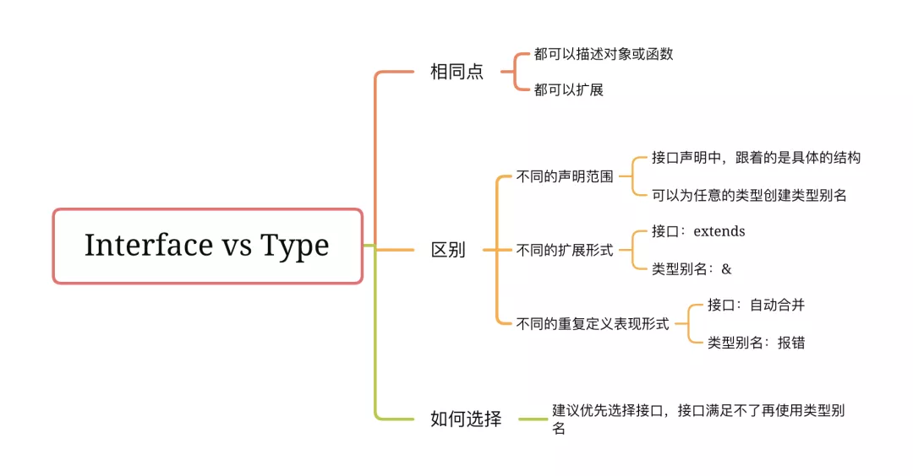

# TypeScript 中 Interface 与 Type 的区别？

## 1. 概览



## 2. 接口 与 类型别名 的异同点

### 2.1 相同点

#### 2.1.1 都可以描述对象或函数

```ts
{
    // 接口
    interface Sister {
        name: string;
        age: number;
    }
    interface SetSister {
        (name: string, age: number): void;
    }
}
{
    // 类型别名
    interface Sister {
        name: string;
        age: number;
    }
  type SetSister = (name: string, age: number) => void;
}
```

#### 2.1.2 都可以扩展

interface 和 type 可以混合扩展，也就是说 interface 可以扩展 type，type 也可以扩展 interface。

但需要注意的是，接口的扩展是继承（ extends ）。类型别名的扩展就是交叉类型（通过 & 实现）。

```ts
{
    // 接口
    interface SisterAn {
        name: string;
    }

    // 类型别名
    interface SisterRan {
        age: number;
    }

    // 接口扩展接口
    interface Sister extends SisterAn {
        age: number;
    }

  // 类型别名扩展类型别名
  type SisterPro = SisterRan & {
      name: string;
  };

  // 接口扩展类型别名
  interface Sister2 extends SisterRan {
      name: string;
  }

  // 类型别名扩展接口
  type SisterPro2 = SisterAn & {
      age: number;
  };
}
```

### 2.2 区别

[官方](https://www.typescriptlang.org/docs/handbook/2/everyday-types.html)中这样介绍两者的区别：

```
Differences Between Type Aliases and Interfaces

Type aliases and interfaces are very similar, and in many cases you can choose between them freely. Almost all features of an interface are available in type, the key distinction is that a type cannot be re-opened to add new properties vs an interface which is always extendable.
```

意思就是说几乎接口的所有特性都可以通过类型别名来实现，主要区别在于：

#### 2.2.1 不同的声明范围

与接口不同，可以为任意的类型创建类型别名。

类型别名的右边可以是任何类型，包括基本类型、元祖、类型表达式（ & 或 | 等）；
而在接口声明中，右边必须为变量结构。

例如，下面的类型别名就不能转换成接口：

```ts
{
  type Name = string;
  type Text = string | { text: string };
  type Coordinates = [number, number];
}
```

#### 2.2.2 不同的扩展形式

接口是通过继承的方式来扩展，类型别名是通过 `&` 来扩展：

```ts
{
    // 接口扩展
    interface SisterAn {
        name: string;
    }
    interface Sister extends SisterAn {
        age: number;
    }

    // 类型别名扩展
    interface SisterRan {
        age: number;
    }
  type SisterPro = SisterRan & {
      name: string;
  };
}
```

这里需要注意的是，接口扩展时，typescript 会检查扩展的接口是否可以赋值给被扩展的接口：

```ts
{
    // 接口扩展
    interface SisterAn {
        name: string;
        age: string;
    }

    // 接口“Sister”错误扩展接口“SisterAn”。
    // 属性“age”的类型不兼容。
    // 不能将类型“number”分配给类型“string”。ts(2430)
    interface Sister extends SisterAn {
        name: string;
        age: number;
    }
}
```

但使用交集类型时就不会出现这种情况：

```ts
{
    // 类型别名扩展
    interface SisterRan {
        name: string;
        age: string;
    }
  type SisterPro = SisterRan & {
      name: string;
      age: number;
  };
}
```

类型别名扩展时，typescript 将尽其所能把扩展和被扩展的类型组合在一起，而不会抛出编译时错误。

#### 2.2.3 不同的重复定义表现形式

接口可以定义多次，多次的声明会自动合并：

```ts
{
    interface Sister {
        name: string;
    }
    interface Sister {
        age: number;
    }

    // 类型 "{ name: string; }" 中缺少属性 "age"，但类型 "Sister" 中需要该属性。ts(2741)
    // const sisterAn: Sister = {
    //   name: 'sisterAn',
    // }

    // 正确
    const sisterRan: Sister = {
        name: 'sisterRan',
        age: 12,
    };
}
```

但是类型别名如果定义多次，会报错：

```ts
{
    // 标识符“Sister”重复。ts(2300)
    interface Sister {
        name: string;
    }

    // 标识符“Sister”重复。ts(2300)
    interface Sister {
        age: number;
    }
}
```

## 3. 如何选择 Interface、Type

虽然[官方](https://www.typescriptlang.org/docs/handbook/2/everyday-types.html#differences-between-type-aliases-and-interfaces)中说几乎接口的所有特性都可以通过类型别名来实现，但建议优先选择接口，接口满足不了再使用类型别名，在 typescript 官网 [Preferring Interfaces Over Intersections](https://github.com/microsoft/TypeScript/wiki/Performance#writing-easy-to-compile-code) 有说明，具体内容如下：

> 大多数时候，对象类型的简单类型别名的作用与接口非常相似：

```ts
{
    interface Foo {
        prop: string;
    }

    interface Bar { prop: string }
}
```

> 但是，一旦你需要组合两个或多个类型来实现其他类型时，你就可以选择使用接口扩展这些类型，或者使用类型别名将它们交叉在一个中（交叉类型），这就是差异开始的时候。

- 接口创建一个单一的平面对象类型来检测属性冲突，这通常很重要！而交叉类型只是递归的进行属性合并，在某种情况下可能产生 never 类型。
- 接口也始终显示得更好，而交叉类型做为其他交叉类型的一部分时，直观上表现不出来，还是会认为是不同基本类型的组合。
- 接口之间的类型关系会被缓存，而交叉类型会被看成组合起来的一个整体。
- 最后一个值得注意的区别是，在检查到目标类型之前会先检查每一个组分。

出于这个原因，建议使用接口/扩展扩展类型而不是创建交叉类型。

```diff
- type Foo = Bar & Baz & {
-     someProp: string;
- }
+ interface Foo extends Bar, Baz {
+     someProp: string;
+ }
```

简单的说，接口更加符合 JavaScript 对象的工作方式，简单的说明下，当出现属性冲突时：

```ts
{
    // 接口扩展
    interface Sister {
        sex: number;
    }

    // 接口“SisterAn”错误扩展接口“Sister”。
    // 属性“sex”的类型不兼容。
    // 不能将类型“string”分配给类型“number”。ts(2430)
    interface SisterAn extends Sister {
        sex: string;
    }
}
```

```ts
{
    // 交叉类型
    interface Sister1 {
        sex: number;
    }

    interface Sister2 {
        sex: string;
    }

  // 不报错，此时的 SisterAn 是一个'number & string'类型，也就是 never
  type SisterAn = Sister1 & Sister2;
}
```

## 4. 参考

- [第 213 题：TypeScript 中 Interface 与 Type 的区别？在写 TypeScript 的时候，该用哪个比较好？ #524](https://github.com/Advanced-Frontend/Daily-Interview-Question/issues/524)
