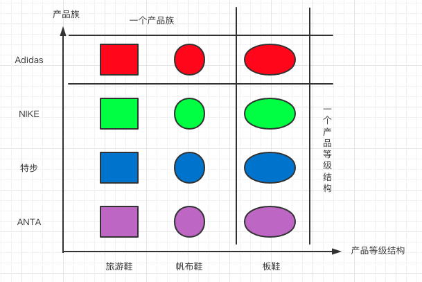

# 总结常用的几种设计模式(TypeScript 版)

## 1. 设计原则

- 单一职责原则
  - 一个类只负责一项职责。
- 接口隔离原则
  - 一个类对另一个类的依赖建立在最小接口上。
- 依赖倒转原则
  - 细节依赖抽象；
  - 面向接口编程。
- 里氏替换原则
  - 子类中尽量不要重写父类的方法。
- 开闭原则 ocp
  - 多扩展开放，对修改关闭.
- 迪米特法则
  - 只与直接朋友通信（出现在成员变量、方法参数、方法返回值中的）。
- 合成复用原则
  - 尽量使用合成/聚合的方式，而不是使用继承。

## 2. 创建型模式

- 单例模式
- 简单工厂模式
- 工厂方法模式
- 抽象工厂模式
- 原型模式
- 建造者模式

> 创建型模式就是创建对象的模式，抽象了实例化的过程。
> 它帮助一个系统独立于如何创建、组合和表示它的那些对象。
> 关注的是对象的创建，创建型模式将创建对象的过程进行了抽象，也可以理解为将创建对象的过程进行了封装，作为客户程序仅仅需要去使用对象，而不再关心创建对象过程中的逻辑。

### 2.1 单例模式

**定义：**

一个类仅有一个实例，并提供一个访问它的全局访问点（静态方法）。

**优缺点：**

优点：

- 减少开销（内存、系统性能...）；
- 优化和共享资源访问；

缺点：

- 扩展困难；
- 对测试不利；
- 与单一职责原则冲突；

**应用场景：**

需要频繁的进行创建和销毁的对象、创建对象耗时或耗资源过多但又经常用到。

**角色：**

- `Singleton`: 单例

**举个例子 🌰：**

```ts
// 饿汉式
class Singleton1 {
    // 1. 构造器私有化，外部不能 new
    private constructor() {}

    // 2. 本类内部创建对象实例化
    private static instance: Singleton1 = new Singleton1();

    // 3. 提供一个公有的静态方法，返回实例对象
    public static getInstance(): Singleton1 {
        return this.instance;
    }
}
console.log(Singleton1.getInstance()); // Singleton1 {}

// 懒汉式
class Singleton2 {
    private constructor() {}

    private static instance: Singleton2 = null;

    public static getInstance(): Singleton2 {
    // 访问的时候再初始化实例
        if (this.instance === null) {
            this.instance = new Singleton2();
        }

        return this.instance;
    }
}
console.log(Singleton2.getInstance()); // Singleton2 {}
```

### 2.2 简单工厂模式

**定义：**

定义一个创建对象的类，由这个类来封装实例化对象的行为。

**优缺点：**

优点：

- 客户类与具体子类解耦；
- 客户类不需要知道所有子类细节；

缺点：

- 工厂类职责过重；
- 增加工厂类增加了系统复杂度；
- 系统扩展困难（会修改工厂逻辑）；

**应用场景：**

工厂类负责创建的对象较少、客户端对如何创建对象不关心。

**角色：**

- `SimpleFactory`: 简单工厂类
- `Product`: 抽象产品类
- `ConcreteProduct`: 具体产品类

**举个例子 🌰：**

```ts
/**
 * 简单工厂模式
 */

// 抽象产品接口
interface Product {}

// 具体产品一
class ConcreteProduct1 implements Product {
    constructor() {}
}

// 具体产品二
class ConcreteProduct2 implements Product {
    constructor() {}
}

// 简单工厂
class SimpleFactory {
    public static createProduct(type: number): Product {
        let product = null;
        if (type === 1) {
            product = new ConcreteProduct1();
        }
        else if (type === 2) {
            product = new ConcreteProduct2();
        }

        return product;
    }
}

// 使用
const product = SimpleFactory.createProduct(1);
console.log(product); // ConcreteProduct1 {}
```

### 2.3 工厂方法模式

**定义：**

定义了一个创建对象的抽象方法，由子类决定要实例化的类。

**优缺点：**

优点：

- 用户只需关心产品对应的工厂；
- 添加新产品是只要添加一个具体工厂和具体产品（符合开闭原则）；

缺点：

- 类个数成倍增加（增加一个产品会增加具体类和实现工厂）；

**应用场景：**

所有生成对象的地方都可以使用（权衡代价）、需要灵活且可扩展的框架时。

**角色：**

- `Creator`: 抽象工厂类
- `ConcreteCreator`: 具体工厂类
- `Product`: 抽象产品类
- `ConcreteProduct`: 具体产品类

**举个例子 🌰：**

```ts
// 抽象产品接口
interface Product2 {
    method1: () => void;
    method2: () => void;
}

// 具体产品一
class ConcreteProduct_1 implements Product2 {
    constructor() {}
    method1() {}
    method2() {}
}

// 具体产品二
class ConcreteProduct_2 implements Product2 {
    constructor() {}
    method1() {}
    method2() {}
}

// 抽象工厂
abstract class Creator {
    public abstract createProduct(type: number): Product2;
}

// 具体工厂
class ConcreteCreator extends Creator {
    constructor() {
        super();
    }

    public createProduct(type: number): Product2 {
        let product = null;
        if (type === 1) {
            product = new ConcreteProduct_1();
        }
        else if (type === 2) {
            product = new ConcreteProduct_2();
        }
        return product;
    }
}

// 使用
const creator: Creator = new ConcreteCreator();
const myProduct: Product2 = creator.createProduct(1);
```

### 2.4 抽象工厂模式



**定义：**

为创建一组相关或相互依赖的对象提供个接口，而且无须指定它们的具体类。

**优缺点：**

优点：

增加新的产品族很容易。

缺点：

增加新的产品结构很麻烦（违背开闭原则）。

**应用场景：**

无需关心对象创建过程、系统有多于一个的产品族且每次只需要某一个产品族、产品等级结构稳定。

**角色：**

- `AbstractProduct`: 抽象产品类
- `ConcreteProduct`: 具体产品类
- `AbstractFactory`: 抽象工厂类
- `ConcreteFactory`: 具体工厂类

**举个例子 🌰：**

```ts
// 抽象工厂接口
interface AbstractFactory {
    createProductA: () => AbstractProductA;
    createProductB: () => AbstractProductB;
}

// 抽象产品 A 接口
interface AbstractProductA {}

// 抽象产品 B 接口
interface AbstractProductB {}

// 具体工厂1
class ConcreteFactory1 implements AbstractFactory {
    constructor() {}
    public createProductA(): AbstractProductA {
        return new ConcreteProductA1();
    }

    public createProductB(): AbstractProductB {
        return new ConcreteProductB1();
    }
}

// 具体工厂2
class ConcreteFactory2 implements AbstractFactory {
    constructor() {}
    public createProductA(): AbstractProductA {
        return new ConcreteProductA2();
    }

    public createProductB(): AbstractProductB {
        return new ConcreteProductB2();
    }
}

// 具体产品 A1
class ConcreteProductA1 implements AbstractProductA {}
// 具体产品 A2
class ConcreteProductA2 implements AbstractProductA {}
// 具体产品 B1
class ConcreteProductB1 implements AbstractProductB {}
// 具体产品 B2
class ConcreteProductB2 implements AbstractProductA {}

// 使用
const factory1: AbstractFactory = new ConcreteFactory1();
const factory2: AbstractFactory = new ConcreteFactory2();
const productA1: AbstractProductA = factory1.createProductA();
const productA2: AbstractProductA = factory2.createProductA();
const productB1: AbstractProductB = factory1.createProductB();
const productB2: AbstractProductB = factory2.createProductB();
```

### 2.5 原型模式

**定义：**

用原型实例指定创建对象的种类，并且通过拷贝这些原型，创建新的对象。

**优缺点：**

优点：

- 简化创建新对象的过程并提高效率；
- 可动态获取对象运行时的状态；
- 原始对象变化（增加或减少属性）相应克隆对象也会变化；

缺点：

- 对已有类修改时，需要修改源码，违背 `ocp` 原则；

**应用场景：**

- 创建成本比较大的场景；
- 需要动态获取当前的对象运行状态的场景；

**角色：**

- `Prototype`: 抽象原型对象
- `ConcretePrototype`: 具体原型角色（被复制的对象）

**举个例子 🌰：**

```ts
interface Prototype {
    clone: () => Prototype;
}

class Dog implements Prototype {
    public name: string;
    public birthYear: number;
    public sex: string;
    public presentYear: number;
    constructor() {
        this.name = 'xiaohuang';
        this.birthYear = 2018;
        this.sex = '女';
        this.presentYear = 2019;
    }

    public getDiscription(): string {
        return `狗狗叫${this.name},性别${this.sex},${this.birthYear}年出生${this.presentYear - this.birthYear}岁了`;
    }

    // 实现复制
    public clone(): Dog {
        return Object.create(this);
    }
}

// 使用
const dog = new Dog();
const dog2 = Object.create(dog);
dog2.presentYear = 2020;
const dog3 = dog.clone();
dog3.presentYear = 2021;

console.log(dog.getDiscription()); // 狗狗叫xiaohuang,性别女,2018年出生1岁了
console.log(dog2.getDiscription()); // 狗狗叫xiaohuang,性别女,2018年出生2岁了
console.log(dog3.getDiscription()); // 狗狗叫xiaohuang,性别女,2018年出生3岁了
```

### 2.6 建造者模式

**定义：**

将一个复杂对象的构建与它的表示分离，使得同样的构建过程可以创建不同的表示。

**优缺点：**

优点：

- 将产品本身与产品构建过程解耦，使得相同创建过程可创建不同产品；
- 具体建造者相互独立，扩展容易；
- 可以精确控制产品创建过程；

缺点：

- 使用范围受限（要求所创建产品一般具有较多共同点）；
- 产品内部变化复杂会导致具体建造者过多；

**应用场景：**

要求按照指定的蓝图建造产品，通过组装零配件产生一个新产品（产品对象具备共性）。

**角色：**

- Product：产品角色，一个具体的产品对象
- Builder：抽象建造者
- ConcreteBuilder：具体建造者，构建和装配各个部件
- Director：指挥者，创建—个复杂的对象

**举个例子 🌰：**

```ts
// 抽象建造者
abstract class Builder {
    public abstract buildPartA(): void;
    public abstract buildPartB(): void;
    public abstract buildPartC(): void;
    public abstract buildProduct(): Product;
}

// 具体建造者
class ConcreteBuilder extends Builder {
    private product: Product;
    constructor(product: Product) {
        super();
        this.product = product;
    }

    public buildPartA(): void {}
    public buildPartB(): void {}
    public buildPartC(): void {}

    // 最终组建一个产品
    public buildProduct(): Product {
        return this.product;
    }
}

// 产品角色
class Product {
    public doSomething(): void {
    // 独立业务
    }
}

// 指挥者
class Director {
    private _builder: Builder;
    constructor(builder: Builder) {
        this._builder = builder;
    }

    set builder(builder: Builder) {
        this._builder = builder;
    }

    get builder() {
        return this._builder;
    }

    // 将处理建造的流程交给指挥者
    public constructorProduct() {
        this._builder.buildPartA();
        this._builder.buildPartB();
        this._builder.buildPartC();
        return this._builder.buildProduct();
    }
}

// 使用
const builder: Builder = new ConcreteBuilder(new Product());
const director: Director = new Director(builder);
const product: Product = director.constructorProduct();
```

## 3. 结构型模式

- 适配器模式
- 桥接模式
- 装饰模式
- 组合模式
- 外观模式
- 享元模式
- 代理模式

> 结构型模式为解决怎样组装现有的类，设计他们的交互方式，从而达到实现一定的功能。

### 3.1 适配器模式

**定义：**

适配器模式（变压器模式、包装模式）是将一个类的接口变换为客户端所期待的另一种接口，从而使原本因接口不匹配而无法在一起工作的两个类能够在一起工作。

**优缺点：**

优点：

- 让两个没关系类可以一起运行；
- 提高类的复用性（源角色在原有系统还可以使用）；

缺点：

- 类适配器：
  - 不支持多重继承语言一次只能适配一个被适配者类，而且目标抽象类只能为接口，有一定局限性；
  - 被适配者类的方法在 Adapter 中都会暴露出来；
- 对象适配器：
  - 与类适配器模式相比，要想置换被适配者类的方法就不容易；

**应用场景：**

- 类适配器和对象适配器：
  - 接口不符合规范，通过适配后变成符合规范的接口进行使用；
- 接口适配器：
  - 适用于一个接口不想使用其所有的方法的情况；

**角色：**

- Target：目标角色，定义把其他类转换为何种接口
- Adaptee：被适配者，就是源角色
- Adapter：适配器，负责将 Adaptee 的接口转换为 Target 的接口

**举个例子 🌰：**

```ts
// 类适配器
{
    // 目标对象
    interface Target {
        request: () => void;
    }
    // 被适配者
    class Adaptee {
        constructor() {}
        // 这是源角色，有自己的的业务逻辑
        public specificRequest(): void {}
    }
    // 适配器
    class Adapter extends Adaptee implements Target {
        constructor() {
            super();
        }

        public request(): void {
            super.specificRequest();
        }
    }

    const target: Target = new Adapter();
    target.request();
}

// 对象适配器
{
    // 目标对象
    interface Target {
        request: () => void;
    }
    // 被适配者
    class Adaptee {
        constructor() {}
        // 这是源角色，有自己的的业务逻辑
        public specificRequest(): void {}
    }
    // 适配器
    class Adapter implements Target {
        private adaptee: Adaptee;
        constructor(adaptee: Adaptee) {
            this.adaptee = adaptee;
        }

        public request(): void {
            this.adaptee.specificRequest();
        }
    }
    // 使用
    const target: Target = new Adapter(new Adaptee());
    target.request();
}

// 接口适配器
{
    interface Adaptee {
        operation1: () => void;
        operation2: () => void;
    }

    abstract class AbsAdapter implements Adaptee {
        public operation1(): void {}
        public operation2(): void {}
    }

    class UseClass extends AbsAdapter {
        public operation1(): void {} // 重写该类
    }
}
```

### 3.2 桥接模式

**定义：**

将实现与抽象放在两个不同的层次中，使得两者可以独立地变化（最主要的将实现和抽象两个层次划分开来）。

**优缺点：**

优点：

- 实现了抽象和实现部分的分离，提高了系统的灵活性；
- 替代了多层继承方案，减少了子类的个数；

缺点：

- 增加了系统的理解和设计模式；
- 要求正确识别出系统中两个独立变化的维度使用范围有一定局限性；

**应用场景：**

- 不希望使用继承或因为多层继承导致类爆炸的系统；
- 消息管理（消息类型、消息分类）。

**角色：**

- Abstraction：抽象类，充当桥接类，主要职责是定义出该角色的行为，同时保存一个对实现化角色的引用。
- RefinedAbstraction：是 Abstraction 抽象类的子类
- Implementor（实现化角色）：行为实现化的接口
- Concretelmplementor（具体实现化角色）：行为的具体实现类

**举个例子 🌰：**

```ts
// 实现接口角色
interface Implementor {
    doSomething: () => void;
    doAnything: () => void;
}

// 具体实现角色
class ConcreteImplementor1 implements Implementor {
    public doSomething(): void {}
    public doAnything(): void {}
}
class ConcreteImplementor2 implements Implementor {
    public doSomething(): void {}
    public doAnything(): void {}
}

// 抽象类
abstract class Abstraction {
    private imp: Implementor;
    constructor(imp: Implementor) {
        this.imp = imp;
    }

    // 自身的行为和属性
    public request(): void {
        this.imp.doSomething();
    }
}
// 具体抽象化角色
class RefinedAbstraction extends Abstraction {
    constructor(imp: Implementor) {
        super(imp);
    }

    public request(): void {
    // 自己写一些处理业务
        super.request();
    }
}

// 调用
// 定义一个实现化角色
const imp: Implementor = new ConcreteImplementor1();
// 定义一个抽象化角色
const abs: Abstraction = new RefinedAbstraction(imp);
// 执行上下文
abs.request();
```

### 3.3 装饰者模式

**定义：**

动态的将新功能附加到对象上。
对象功能扩展方便，它比继承更有弹性，装饰者模式也体现了开闭原则(ocp）。

**优缺点：**

优点：

- 装饰类和被装饰类可以独立发展，而不会相互糯合；
- 装饰模式是继承关系的一个替代方案，但是装饰者模式比继承更灵活；
- 装饰模式可以动态地扩展一个实现类的功能；

缺点：

- 多层的装饰是比较复杂的。
  由于装饰者模式会导致设计中出现许多小对象，过度使用，会让程序变的更复杂。

**应用场景：**

- 需要扩展一个类的功能，或给一个类增加附加功能；
- 需要动态地给一个对象增加功能，这些功能可以再动态地撤销；
- 需要增加由一些基本功能的排列组合而产生的非常大量的功能；

**角色：**

- Component（抽象构件）：一个接口或者抽象类，定义最核心的对象
- ConcreteComponent（具体构件）：最核心、最原始、最基本的接口或抽象类的实现，要装饰的对象
- Decorator(装饰角色）：持有一个构件（Component）对象的实例，并定义一个与抽象构件接口一致的接口。
- ConcreteDecoratorA 和 ConcreteDecoratorB（具体装饰角色）：两个具体的装饰类

**举个例子 🌰：**

```ts
// 抽象构件
abstract class Component {
    public abstract operate(): void;
}

// 具体构件
class ConcreteComponent extends Component {
    public operate(): void {
        console.log('do something');
    }
}

// 装饰角色
abstract class Decorator extends Component {
    private component: Component = null;
    constructor(component: Component) {
        super();
        this.component = component;
    }

    public operate(): void {
        this.component.operate();
    }
}

// 具体装饰者
class ConcreteDecoratorA extends Decorator {
    constructor(component: Component) {
        super(component);
    }

    // 定义自己的修饰方法
    private methodA(): void {
        console.log('methodA 修饰');
    }

    // 重写父类方法
    public operate(): void {
        this.methodA();
        super.operate();
    }
}

class ConcreteDecoratorB extends Decorator {
    constructor(component: Component) {
        super(component);
    }

    // 定义自己的修饰方法
    private methodB(): void {
        console.log('methodB 修饰');
    }

    // 重写父类方法
    public operate(): void {
        this.methodB();
        super.operate();
    }
}

function main() {
    let component: Component = new ConcreteComponent();
    // 第一次装饰
    component = new ConcreteDecoratorA(component);
    // 第二次装饰
    component = new ConcreteDecoratorB(component);
    // 装饰后运行
    component.operate();
}

main();
// methodB 修饰
// methodA 修饰
// do something
```

### 3.4 组合模式

**定义：**

也叫`合成模式`或`部分-整体模式`，主要用来描述部分和整体的关系。
将对象组合成树形结构以表示“部分-整体”的层次结构，使得用户对单个对象和组合对象的使用具有一致性。

**优缺点：**

优点：

- 调用简单
  - 只需要面对一致的对象而不用考虑整体部分或者叶子节点的问颞；
- 扩展性强
  - 一方面，当更改组合对象时，只需要调整内部的层次关系，用户不用做出任何改动；
  - 另一方面，容易增加节点，只要找到它的父节点即可；

缺点：

要求较高的抽象性，如果节点和叶子结点有很多差异性的话（比如很多方法和属性不一样），不适合使用组合模式。

**应用场景：**

- 需要遍历组织结构或者处理的对象具有树形结构时，非常适合使用组合模式；
- 维护和展示`部分-整体关系`的场景，如树形菜单、文件和文件夹管理；
- 一句话就是组合模式是应树形结构而生，所以组合模式的的使用场景就是出现树形结构的地方；

**角色：**

- Component（抽象构件角色）：定义参加组合对象的共有方法和属性，可以定义一些默认的行为或属性；
- Leaf（叶子构件角色）：在组合中表示叶子节点；
- Composite（树枝构件角色）：非叶子节点，主要作用是存储和管理子部件，通常包含 Add()、 Remove()、GetChild() 等方法；

**举个例子 🌰：**

```ts
abstract class Component {
    protected name: string;
    constructor(name: string) {
        this.name = name;
    }

    public abstract doOperation(): void;

    public add(component: Component): void {}

    public remove(component: Component): void {}

    public getChildren(): Array<Component> {
        return [];
    }
}

class Composite extends Component {
    // 构件容器
    private componentList: Component[];
    constructor(name: string) {
        super(name);
        this.componentList = [];
    }

    public doOperation(): void {
        console.log(`这是容器${this.name}，处理一些逻辑业务！`);
    }

    public add(component: Component): void {
        this.componentList.push(component);
    }

    public remove(component: Component): void {
        const componentIndex = this.componentList.findIndex((value: Component) => {
            return value === component;
        });
        this.componentList.splice(componentIndex, 1);
    }

    public getChildren(): Array<Component> {
        return this.componentList;
    }
}

class Leaf extends Component {
    constructor(name: string) {
        super(name);
    }

    public doOperation(): void {
        console.log(`这是叶子节点${this.name}，处理一些逻辑业务！`);
    }
}

function main() {
    const root: Component = new Composite('root');
    const node1: Component = new Leaf('1');
    const node2: Component = new Composite('2');
    const node3: Component = new Leaf('3');

    root.add(node1);
    root.add(node2);
    root.add(node3);

    const node2_1: Component = new Leaf('2_1');
    node2.add(node2_1);

    const children1 = root.getChildren();
    console.log(children1);
    // [
    //   Leaf { name: '1' },
    //   Composite { name: '2', componentList: [ [Leaf] ] },
    //   Leaf { name: '3' }
    // ]

    root.remove(node2);

    const children2 = root.getChildren();
    console.log(children2);
    // [ Leaf { name: '1' }, Leaf { name: '3' } ]
}

main();
```

### 3.5 外观模式

**定义：**

要求一个子系统的外部与其内部的通信必须通过一个统一的对象进行。
外观模式提供一个高层次的接口，使得子系统更易于使用。

> 简言之就是提供一个统一的接口，用来访问子系统中的一群接口，从而让子系统更容易使用。

**优缺点：**

优点：

- 外观模式最大的优点就是使复杂子系统的接口变的简单可用，减少了客户端对子系统的依赖，达到了解耦的效果；
- 让子系统内部的模块更易维护和扩展；
- 遵循迪米特法则，对内封装具体细节，对外只暴露必要的接口；

缺点：

- 不符合开闭原则，如果要修改某一个子系统的功能，通常外观类也要一起修改。

**应用场景：**

- 为一个复杂的模块或子系统提供一个供外界访问的接口；
- 子系统相对独立——外界对子系统的访问只要黑箱操作即可；
- 维护一个大型遗留系统的时候，可能这个系统已经非常难以维护和扩展，此时可以考虑为新系统开发一个 Facade 类，来提供遗留系统的比较清晰简单的接口，让新系统与 Facade 类交互，提高复用性；
- 当系统需要进行分层设计时，可以考虑使用 Facade 模式；

**角色：**

- Facade（门面角色）：提供一个外观接口，对外，它提供一个易于客户端访问的接口，对内，它可以访问子系统中的所有功能；
- SubSystem（子系统角色）：实现系统的部分功能，客户可以通过外观角色访问它；

**举个例子 🌰：**

```ts
class SubSystemA {
    public doOperationA(): void {
        console.log('子系统 A 的举动');
    }
}

class SubSystemB {
    public doOperationB(): void {
        console.log('子系统 B 的举动');
    }
}

class Facade {
    private subSystemA: SubSystemA;
    private subSystemB: SubSystemB;
    constructor() {
        this.subSystemA = new SubSystemA();
        this.subSystemB = new SubSystemB();
    }

    public doOperation(): void {
        this.subSystemA.doOperationA();
        this.subSystemB.doOperationB();
    }
}

function main() {
    const facade: Facade = new Facade();
    facade.doOperation();
}

main();
// 子系统 A 的举动
// 子系统 B 的举动
```

### 3.6 享元模式

**定义：**

享元模式也叫`蝇量模式`，使用共享对象可有效地支持大量的细粒度的对象，是池技术的重要实现方式。

**扩展：**

享元模式提出了两个要求：细粒度和共享对象。这里就涉及到内部状态和外部状态了，即将对象的信息分为两个部分：内部状态和外部状态。

内部状态指对象共享出来的信息，存储在享元对象内部且不会随环境的改变而改变。
外部状态指对象得以依赖的一个标记，是隧环境改变而改变的、不可共享的状态。

**优缺点：**

优点：

- 享元模式大大减少了对象的创建，隆低了程序内存的占用，提高效率。

缺点：

- 提高了系统复杂性，需要分离出外部状态和内部状态，而目外部状态具有固化特性，不应该随内部状态改变而改变，否则会导致系统的逻辑混乱。

**应用场景：**

- 最典型的应用场景是需要缓冲池的场景，比如 String 常量池、数据库连接池。
- 系统中存在大量的相似对象。
- 细粒度的对象都具备较接近的外部状态，而且内部状态与环境无关，也就是说对象没有特定身份。

**角色：**

- Flyweight（抽象享元角色）：一个产品的抽象类 ，同时定义出对象的内部状态和外部状态的接口或实现。
- ConcreteFlyweight（具体享元角色）：具体的一个产品类，实现抽象角色定义的业务。
- unsharedConcreteFlyweight（不可共享的享元角色）：该对象一股不会出现在享元工厂中。
- FlyweiahtFactory（享元工厂）：用于构建一个池容器（集合），同时提供从池中获取对象方法。

**举个例子 🌰：**

```ts
abstract class Flyweight {
    public abstract doOperation(extrinsicState: string): void;
}

class ConcreteFlyweight extends Flyweight {
    private intrinsicState: string;
    constructor(intrinsicState: string) {
        super();
        this.intrinsicState = intrinsicState;
    }

    public doOperation(extrinsicState: string): void {
        console.log(`这是具体享元角色，内部状态为${this.intrinsicState},外部状态为${extrinsicState}`);
    }
}

interface FlyweightObject {
    [key: string]: Flyweight;
}

class FlyweightFactory {
    private flyweights: FlyweightObject;
    constructor() {
        this.flyweights = {};
    }

    public getFlyweight(intrinsicState: string): Flyweight {
        if (!this.flyweights[intrinsicState]) {
            const flyweight: Flyweight = new ConcreteFlyweight(intrinsicState);
            this.flyweights[intrinsicState] = flyweight;
        }
        return this.flyweights[intrinsicState];
    }
}

function main() {
    const factory: FlyweightFactory = new FlyweightFactory();
    const flyweight1: Flyweight = factory.getFlyweight('aa');
    const flyweight2: Flyweight = factory.getFlyweight('bb');
    flyweight1.doOperation('x');
    flyweight2.doOperation('y');
}

main();
// 这是具体享元角色，内部状态为aa,外部状态为x
// 这是具体享元角色，内部状态为bb,外部状态为y
```

### 3.7 代理模式

为其他对象提供一种代理以控制对这个对象的访问。

#### 3.7.1 静态代理

**定义：**

在使用时，需要定义接口或者父类，被代理对象（即目标对象）与代理对象一起实现相同的接口成者是继承相同的父类。

**优缺点：**

优点：

- 在不修改目标对象的功能前提下，能通过代理对象对目标功能扩展。

缺点：

- 因为代理对象需要与目标对象实现一样的接口，所以会有很多代理类；
- 一旦接口增加方法,目标对象与代理对象都要维护；
- 增加代理类之后明显会增加处理时间，拖慢处理时间。

**角色：**

- Subject（抽象主题角色）：是抽象类也可以是接口；
- RealSubject（具体主题角色、被委托角色、被代理角色）：是业务逻相的具体执行者；
- Proxy（代理主题角色、委托类、代理类）：负责对真实角色的应用，把所有抽象主题角色定义的方法限制委托给真实主题角色实现，并且在真实主题角色处理完毕前后做预处理和善后处理工作；

#### 3.7.2 动态代理（JDK 代理、接口代理）

**定义：**

代理对象不需要实现接口，但是目标对象要实现接口，否则不能用动态代理。
其中代理对象的生成，是利用 JDK 的 API，动态的在内存中构建代理对象。

**优缺点：**

优点：

- 代理对象不需要实现接口。

缺点：

- 增加代理类之后会增加处理时间。

**角色：**

- ProxyFactory（代理工厂角色）。

#### 3.7.3 应用场景

- 远程代理（Remote Froxy）：控制对远程对象（不同地址空间）的访问，它负责将请求及其参数进行编码，并向不同地址空间中的对象发送己经编码的请求。
- 虚拟代理（Virtual Proxy)： 根据需要创建开销很大的对象，它可以缓存实体的附加信息，以便延迟对它的访问，例如在网站加载一个很大图片时，不能马上完成，可以用虚拟代理缓存图片的大小信息，然后生成一张临时图片代替原始图片。
- 保护代理（Protection Proxy）：按权限控制对象的访问，它负责检查调用者是否具有实现一个请求所必须的访问权限。
- 智能代理（Smart Reference）：取代了简单的指针，它在访问对象时执行一些附加操作：
  - 记录对象的引用次数；
  - 当第一次引用一个对象时，将它装入内存；
  - 在访问一个实际对象前，检查是否已经锁定了它，以确保其它对象不能改变它；

#### 3.7.4 举个例子 🌰

```ts
{
    // 静态代理
    interface Subject {
        doOperation: () => void;
    }

    class RealSubject implements Subject {
        public doOperation() {
            console.log('我是RealSubject类，正在执行');
        }
    }

    class MyProxy implements Subject {
        private target: Subject;
        constructor(realSubject: Subject) {
            this.target = realSubject;
        }

        public doOperation() {
            console.log('我是代理类');
            this.target.doOperation();
        }
    }

    const main = () => {
        const realSubject: Subject = new RealSubject();
        const myProxy: Subject = new MyProxy(realSubject);

        myProxy.doOperation();
    };

    main(); // 我是RealSubject类，正在执行
}

{
    // 动态代理
    interface Subject {
        doOperation: () => void;
    }

    class RealSubject implements Subject {
        constructor() {}

        public doOperation(): void {
            console.log('我是RealSubject类，正在执行');
        }
    }

    class ProxyFactory {
        private target: Subject;
        constructor(target: Subject) {
            this.target = target;
        }

        public getProxyInstance(): Subject {
            return new Proxy(this.target, {
                get: (target, propKey: keyof Subject) => {
                    // 做的一些拦截处理
                    return target[propKey];
                },
            });
        }
    }

    const main = () => {
        const target: Subject = new RealSubject();
        const proxyInstance: Subject = new ProxyFactory(target).getProxyInstance();

        proxyInstance.doOperation();
    };

    main(); // 我是RealSubject类，正在执行
}
```

## 4. 行为型模式

- 模板方法模式
- 命令模式
- 访问者模式
- 迭代器模式
- 观察者模式
- 中介者模式
- 备忘录模式
- 解释器模式（Interpreter 模式）
- 状态模式
- 策略模式
- 职责链模式（责任链模式）

> 行为型模式对在不同的对象之间划分责任和算法的抽象化，行为型模式不仅仅关注类和对象的结构，而且重点关注他们之间的相互作用，通过行为型模式，可以更加清晰地划分类与对象的职责，并研究系统在运行时实例对象之间的交互。

### 4.1 模板方法模式

**定义：**

定义一个操作中的算法的框架，而将一些步骤延迟到子类中，使得子类可以不改变一个算法的结构即可重定义该算法的某些特定步骤。

**优缺点：**

优点：

- 既统一了算法，也提供了很大的灵活性。父类的模板方法确保了算法的结构保持不变，同时由子类提供部分步骤的实现；
- 实现了最大化代码复用。父类的模板方法和已实现的某些步骤会被子类继承而直接使用。

缺点：

- 每一个不同的实现都需要一个子类实现，导致类的个数增加，使得系统更加庞大。

**应用场景：**

- 当要完成某个过程，该过程要执行一系列步骤，这一系列的步骤基本相同，但个别步骤在实现时可能不同，通常考虑使用模板方法模式来处理；
- 重构时。把相同的代码抽取到父类中，然后通过钩子函数约束其行为。

**角色：**

- AbstractClass（抽象模板）：
  它的方法分为两类：基本方法和模板方法。
  基本方法是由子类实现的方法，并且在模板方法中调用；
  模板方法定义算法的骨架。
- ConcreteClass（具体模板）：实现父类抽象方法或按需重写方法；

**举个例子 🌰：**

```ts
abstract class AbstractClass {
    constructor() {}

    // 模板方法
    public template(): void {
        this.operation1();
        this.hookMethod() && this.operation2();
        this.operation3();
    }

    // 基本方法
    protected operation1(): void {
        console.log('使用了方法operation1');
    }

    protected operation2(): void {
        console.log('使用了方法operation2');
    }

    protected operation3(): void {
        console.log('使用了方法operation3');
    }

    // 钩子方法
    protected hookMethod(): boolean {
        return true;
    }
}

class ConcreteClassA extends AbstractClass {
    protected operation2(): void {
        console.log('对该方法operation2进行了修改再使用');
    }

    protected operation3(): void {
        console.log('对该方法operation3进行了修改再使用');
    }
}

class ConcreteClassB extends AbstractClass {
    // 覆盖钩子方法
    protected hookMethod(): boolean {
        return false;
    }
}

function main() {
    const class1: AbstractClass = new ConcreteClassA();
    const class2: AbstractClass = new ConcreteClassB();

    class1.template();
    // 使用了方法operation1
    // 对该方法operation2进行了修改再使用
    // 对该方法operation3进行了修改再使用

    class2.template();
    // 使用了方法operation1
    // 使用了方法operation3
}

main();
```

### 4.2 命令模式

**定义：**

将一个请求封装成一个对象，从而让你使用不同的请求把客户端参数化，对请求排队或者记录请求日志（使用不同参数来表示不同的请求），可以提供命令
的撤销和恢复功能。

**优缺点：**

优点：

- 命令模式使得请求发送者与请求接收者消除彼此之间的耦合；
- 可扩展性。Command 子类可以非常容易地扩展；

缺点：

- 可能导致某些系统有过多地具体命令类，增加了系统地复杂度；

**应用场景：**

- 命令模式适合用在需要将请求调用者和请求的接收者进行解耦的场景，经典的应用场景：界面的一个按钮都是一条命令可以采用命令模式；
- 模拟 CMD（DOS 命令）；
- 订单地撤/恢复；
- 触发-反馈机制；

**角色：**

- Invoker（调用者角色）：通过它来调用命令；
- Receiver（接收者角色）：命令的真正执行者；
- Command（命令角色）：需要执行的所有命令都在这里声明；
- ConcreteCommand（具体命令角色）：将一个接收者对象与一个动作绑定，调用接收者相应的操作，实现 execute。

**举个例子 🌰：**

```ts
interface Command {
    execute: () => void;
    undo: () => void;
}

// 开启命令
class ConcreteCommandOn implements Command {
    private receiver: Receiver;
    constructor(receiver: Receiver) {
        this.receiver = receiver;
    }

    // 执行命令的方法
    public execute(): void {
        this.receiver.actionOn();
    }

    // 撤销命令的方法
    public undo(): void {
        this.receiver.actionOff();
    }
}

// 关闭命令
class ConcreteCommandOff implements Command {
    private receiver: Receiver;
    constructor(receiver: Receiver) {
        this.receiver = receiver;
    }

    // 执行命令的方法
    public execute(): void {
        this.receiver.actionOff();
    }

    // 撤销命令的方法
    public undo(): void {
        this.receiver.actionOn();
    }
}

// 空命令（省去判空操作）
class NoCommand implements Command {
    public execute(): void {}
    public undo(): void {}
}

class Receiver {
    public actionOn(): void {
        console.log('我是命令接收者，开启了某动作');
    }

    public actionOff(): void {
        console.log('我是命令接收者，关闭了某动作');
    }
}

class Invoker {
    private onCommands: Array<Command>;
    private offCommands: Array<Command>;
    private undoCommand: Command;
    private slotNum: number = 7;
    constructor() {
        this.undoCommand = new NoCommand();
        this.onCommands = [];
        this.offCommands = [];

        for (let i = 0; i < this.slotNum; i++) {
            this.onCommands[i] = new NoCommand();
            this.offCommands[i] = new NoCommand();
        }
    }

    public setCommand(index: number, onCommand: Command, offCommand: Command): void {
        this.onCommands[index] = onCommand;
        this.offCommands[index] = offCommand;
    }

    // 开启
    public on(index: number): void {
        this.onCommands[index].execute(); // 调用相应方法
        // 记录这次操作，用于撤销
        this.undoCommand = this.onCommands[index];
    }

    // 关闭
    public off(index: number): void {
        this.offCommands[index].execute();
        this.undoCommand = this.offCommands[index];
    }

    // 撤销
    public undo(): void {
        this.undoCommand.undo();
    }
}

function main() {
    // 创建接收者
    const receiver: Receiver = new Receiver();

    // 创建命令
    const commandOn: Command = new ConcreteCommandOn(receiver);
    const commandOff: Command = new ConcreteCommandOff(receiver);

    // 创建调用者
    const invoker: Invoker = new Invoker();
    invoker.setCommand(0, commandOn, commandOff);

    invoker.on(0); // 我是命令接收者，开启了某动作
    invoker.off(0); // 我是命令接收者，关闭了某动作
    invoker.undo(); // 我是命令接收者，开启了某动作
}

main();
```

### 4.3 访问者模式

**定义：**

封装一些作用于某种数据结构中的各元素的操作，它可以在不改变数据结构的前提下定义作用于这些元素的新的操作。
（主要将数据结构与数据操作分离，解决数据结构和操作耦合性问题）

**优缺点：**

优点：

- 访问者模式符合单一职责原则、让程序具有优秀的扩展性、灵活性非常高；
- 访问者模式可以对功能进行统一，可以做报表、UI、拦截器与过滤器，适用于数据结构相对稳定的系统；

缺点：

- 具体元素对访问者公布细节，也就是说访问者关注了其他类的内部细节，这是迪米特法则所不建议的，这样造成了具体元素变更比较困难；
- 违背了依赖倒转原则。访问者依赖的是具体元素，而不是抽象元素；
- 因此，如果一个系统有比较稳定的数据结构，又有经常变化的功能需求，那么访问者模式就是比较合适的；

**应用场景：**

- 需要对一个对象结构中的对象进行很多不同操作（这些操作彼此没有关联），同时需要避免让这些操作“污染”这些对象的类，可以选用访问者模式解决。

**角色：**

- Visitor（抽象访问者）：抽象类或者接口，声明访问者可以访问哪些元素。为该对象结构中的 ConcreteElement 的每一个类声明一个 visit 操作。
- ConcreteVistor（具体访问者）：实现每个有 Visitor 声明的操作，是每个操作实现的部分。
- Element（抽象元素）：接口或者抽象类，定义一个 accept 方法，接收一个访问者对象。
- ConcreteElement（具体元素）：实现了 accept 方法。
- ObjectStruture（结构对象）：是一个包含元素角色的容器，提供让访问者对象遍历容器中的所有元素的方法。

**举个例子 🌰：**

```ts
abstract class AbstractElement {
    // 定义业务逻辑
    public abstract doSomething(): void;
    // 允许谁来访问
    public abstract accept(visitor: Visitor): void;
}

class ConcreteElement1 extends AbstractElement {
    public doSomething(): void {
        console.log('ConcreteElement1执行的业务逻辑');
    }

    public accept(visitor: Visitor): void {
        visitor.visit1(this);
    }
}

class ConcreteElement2 extends AbstractElement {
    public doSomething(): void {
        console.log('ConcreteElement1执行的业务逻辑');
    }

    public accept(visitor: Visitor): void {
        visitor.visit2(this);
    }
}

abstract class Visitor {
    public abstract visit1(element1: ConcreteElement1): void;
    public abstract visit2(element2: ConcreteElement2): void;
}

class ConcreteVistor extends Visitor {
    public visit1(element1: ConcreteElement1): void {
        console.log('进入处理element1');
        element1.doSomething();
    }

    public visit2(element2: ConcreteElement2): void {
        console.log('进入处理element2');
        element2.doSomething();
    }
}

// 数据结构，管理很多元素（ConcreteElement1，ConcreteElement1）
class ObjectStructure {
    private listSet: Set<AbstractElement>;
    constructor() {
        this.listSet = new Set();
    }

    // 增加
    public attach(element: AbstractElement): void {
        this.listSet.add(element);
    }

    // 删除
    public detach(element: AbstractElement): void {
        this.listSet.delete(element);
    }

    // 显示
    public display(visitor: Visitor): void {
        for (const element of this.listSet.values()) {
            element.accept(visitor);
        }
    }
}

function main() {
    const objectStructure: ObjectStructure = new ObjectStructure();
    objectStructure.attach(new ConcreteElement1());
    objectStructure.attach(new ConcreteElement2());

    const visitor: Visitor = new ConcreteVistor();

    objectStructure.display(visitor);
}

main();
// 进入处理element1
// ConcreteElement1执行的业务逻辑
// 进入处理element2
// ConcreteElement1执行的业务逻辑
```

### 4.4 迭代器模式

**定义：**

提供一种方法访问一个容器对象中各个元素，而又不需暴露该对象的内部细节。

**优缺点：**

优点：

- 提供一个统一的方法遍历对象，客户不用再考虑聚合的类型，使用一种方法就可以遍历对象了。
- 隐藏了聚合的内部结构，客户端要遍历聚合的时候只能取到迭代器，而不会知道聚合的具体组成。
- 提供了一种设计思想，就是一个类应该只有一个引起变化的原因（叫做单一责任原则）。在聚合类中，我们把迭代器分开，就是要把管理对象集合和遍历对象集合的责任分开，这样一来集合改变的话，只影响到聚合对象。而如果遍历方式改变的话，只影响到了迭代器。

缺点：

- 每个聚合对象都要一个迭代器，会生成多个迭代器不好管理类。

**应用场景：**

当要展示一组相似对象，或者遍历一组相同对象时使用。

**角色：**

- Iterator（抽象迭代器）：抽象迭代器定义负责访问和遍历元素的接口；
- Concretelterator（具体迭代器）：实现迭代器接口，完成容器元素的遍历；
- Aggregate（抽象容器）：负责创建具体迭代器角色的接口，必然提供一个类似 createlterator() 这样的方法；
- ConcreteAggregate（具体容器）：实现容器接口定义的方法，创建出容纳迭代器；

**举个例子 🌰：**

```ts
interface AbstractIterator {
    next: () => any;
    hasNext: () => boolean;
}

class ConcreteIterator implements AbstractIterator {
    private list: any[];
    public cursor: number = 0;
    constructor(array: any[]) {
        this.list = array;
    }

    public next(): any {
        return this.hasNext() ? this.list[this.cursor++] : null;
    }

    public hasNext(): boolean {
        return this.cursor < this.list.length;
    }
}

interface Aggregate {
    add: (value: any) => void;
    remove: (value: any) => void;
    createIterator: () => AbstractIterator;
}

class ConcreteAggregate implements Aggregate {
    // 容纳对象的容器
    private list: any[];
    constructor() {
        this.list = [];
    }

    add(value: any): void {
        this.list.push(value);
    }

    remove(value: any): void {
        const index = this.list.findIndex((listValue) => {
            return value === listValue;
        });
        this.list.splice(index, 1);
    }

    createIterator(): AbstractIterator {
        return new ConcreteIterator(this.list);
    }
}

function main() {
    const aggregate: Aggregate = new ConcreteAggregate();
    aggregate.add('first');
    aggregate.add('second');

    const iterator: AbstractIterator = aggregate.createIterator();
    while (iterator.hasNext()) {
        console.log(iterator.next());
    }
}

main();
// first
// second
```

### 4.5 观察者模式

**定义：**

定义对象间一种一对多的依赖关系，当一个对象改变状态，则所有依赖于它的对象都会得到通知并被自动更新。

**优缺点：**

优点：

- 在被观察者和观察者之间建立一个抽象的耦合；
- 观察者模式支持广播通讯，被观察者会向所有的登记过的观察者发出通知；

缺点：

- 观察者模式需要考虑一下开发效率和运行效率问题，一个被观察者，多个观察者，开发和调试就会比较复杂；

**应用场景：**

- 对一个对象状态的更新，需要其他对象同步更新，而且其他对象的数量动态可变；
- 对象仅需要将自己的更新通知给其他对象而不需要知道其他对象的细节；

**角色：**

- Subject（被观察者）：定义被观察者实现的职责，用于管理观察者并通知观察者；
- Observer（观察者）：观察者收到消息后进行 update 操作；
- ConcreteSubject（具体的被观察者）：具体实现；
- ConcreteObserver（具体的观察者）：具体实现；

**与发布订阅模式区别：**

- 观察者模式存在问题：
  - 目标无法选择自己想要的消息发布，观察者会接收所有消息；
- 发布订阅模式：
  - 发布/订阅模式在观察者模式的基础上，在目标和观察者之间增加一个调度中心。
  - 订阅者（观察者）把自己想要订阅的事件注册到调度中心，当该事件触发的时候，发布者（目标）发布该事件到调度中心，由调度中心统一调度订阅者注册到调度中心的处理代码；
- 区别：
  - 观察者模式是由具体目标调度的，而发布/订阅模式是统一由调度中心调度的，所以观察者模式的订阅者与发布者之间是存在依赖的，而发布/订阅模式则不会，所以发布订阅模式的组件是松散耦合的；

**举个例子 🌰：**

```ts
// 观察者模式
interface AbstractSubject {
    registerObserver: (observer: Observer) => void;
    remove: (observer: Observer) => void;
    notifyObservers: (...args: any[]) => void;
}

class ConcreteSubject implements AbstractSubject {
    private observers: Array<Observer>;

    constructor() {
        this.observers = [];
    }

    public registerObserver(observer: Observer): void {
        this.observers.push(observer);
    }

    public remove(observer: Observer): void {
        const observerIndex = this.observers.findIndex((value) => {
            return value === observer;
        });

        observerIndex >= 0 && this.observers.splice(observerIndex, 1);
    }

    public notifyObservers(...args: any[]): void {
        this.observers.forEach(observer => observer.update(...args));
    }
}

interface Observer {
    update: (...value: any[]) => void;
}

class ConcreteObserver1 implements Observer {
    public update(...value: any[]): void {
        console.log('已经执行更新操作1，值为：', ...value);
    }
}
class ConcreteObserver2 implements Observer {
    public update(...value: any[]): void {
        console.log('已经执行更新操作2，值为：', ...value);
    }
}

function main() {
    const subject: AbstractSubject = new ConcreteSubject();
    const observer1: Observer = new ConcreteObserver1();
    const observer2: Observer = new ConcreteObserver2();

    subject.registerObserver(observer1);
    subject.registerObserver(observer2);

    subject.notifyObservers(1, 2, 3);
}

main();
// 已经执行更新操作1，值为： 1 2 3
// 已经执行更新操作2，值为： 1 2 3
```

```ts
// 发布订阅模式
interface Publish {
    registerObserver: (eventType: string, subscribe: Subscribe) => void;
    remove: (eventType: string, subscribe?: Subscribe) => void;
    notifyObservers: (eventType: string) => void;
}
interface SubscribesObject {
    [key: string]: Array<Subscribe>;
}
class ConcretePublish implements Publish {
    private subscribes: SubscribesObject;

    constructor() {
        this.subscribes = {};
    }

    registerObserver(eventType: string, subscribe: Subscribe): void {
        if (!this.subscribes[eventType]) {
            this.subscribes[eventType] = [];
        }

        this.subscribes[eventType].push(subscribe);
    }

    remove(eventType: string, subscribe?: Subscribe): void {
        const subscribeArray = this.subscribes[eventType];
        if (subscribeArray) {
            if (!subscribe) {
                delete this.subscribes[eventType];
            }
            else {
                const index = subscribeArray.indexOf(subscribe);
                index >= 0 && subscribeArray.splice(index, 1);
            }
        }
    }

    notifyObservers(eventType: string, ...args: any[]): void {
        const subscribes = this.subscribes[eventType];
        if (subscribes) {
            subscribes.forEach(subscribe => subscribe.update(...args));
        }
    }
}

interface Subscribe {
    update: (...value: any[]) => void;
}

class ConcreteSubscribe1 implements Subscribe {
    public update(...value: any[]): void {
        console.log('已经执行更新操作1，值为：', ...value);
    }
}
class ConcreteSubscribe2 implements Subscribe {
    public update(...value: any[]): void {
        console.log('已经执行更新操作2，值为：', ...value);
    }
}

function main() {
    const publish = new ConcretePublish();
    const subscribe1 = new ConcreteSubscribe1();
    const subscribe2 = new ConcreteSubscribe2();

    publish.registerObserver('1', subscribe1);
    publish.registerObserver('2', subscribe2);

    publish.notifyObservers('2', 1, 2, 3);
}

main();
// 已经执行更新操作2，值为： 1 2 3
```

### 4.6 中介者模式

**定义：**

用一个中介对象封装一系列的对象交互，中介者使各对象不需要显示地相互作用，从而使其耦合松散，而且可以独立地改变它们之间的交互。

**优缺点：**

优点：

- 多个类相互耦合会形成网状结构，使用中介者模式将网状结构分离为星型结构，进行解耦；
- 减少类间依赖，降低了耦合，符合迪米特原则；

缺点：

- 中介者承担了较多的责任，一旦中介者出现了问题，整个系统就会受到影响；
- 设计不当会使中介者对象本身变得过于复杂；

**应用场景：**

- 适用于多个对象之间紧密耦合的情况（紧密耦合的标准是：出现了蜘蛛网状结构），这种情况要考虑中介者模式，将蜘蛛网梳理为星型结构；
- 机场调度中心、MVC 框架、媒体网关、中介服务等；

**角色：**

- Mediator（抽象中介者角色）：抽象中介者角色定义统一的接口，用于各同事角色之间的通信；
- ConcreteMediator（具体中介者角色）：通过协调各同事角色实现协作行为；
- Colleague（抽象同事角色）
- Concrete Colleague（具体同事角色）：每个同事只知道自己的行为，与其他同事角色通信的时候一定要通过中介者角色协作；

**举个例子 🌰：**

```ts
abstract class Colleague {
    public abstract onEvent(eventType: string): void;
}

class ConcreteColleagueA extends Colleague {
    private mediator: Mediator;
    constructor(mediator: Mediator) {
        super();
        this.mediator = mediator;
    }

    public onEvent(eventType: string): void {
        this.mediator.doEvent(eventType);
    }

    // 自己的一些事情
    public doSomething(): void {
        console.log('A被运行了');
    }
}

class ConcreteColleagueB extends Colleague {
    private mediator: Mediator;
    constructor(mediator: Mediator) {
        super();
        this.mediator = mediator;
    }

    public onEvent(eventType: string): void {
        this.mediator.doEvent(eventType);
    }

    // 自己的一些事情
    public doSomething(): void {
        console.log('B被运行了');
    }
}

abstract class Mediator {
    protected _colleagueA?: ConcreteColleagueA;
    protected _colleagueB?: ConcreteColleagueB;

    set colleagueA(colleagueA: ConcreteColleagueA) {
        this._colleagueA = colleagueA;
    }

    get colleagueA() {
        return this._colleagueA;
    }

    set colleagueB(colleagueB: ConcreteColleagueB) {
        this._colleagueB = colleagueB;
    }

    get colleagueB() {
        return this._colleagueB;
    }

    public abstract doEvent(eventType: string): void;
}

class ConcreteMediator extends Mediator {
    // 1. 根据得到消息，完成对应任务
    // 2. 中介者在这个方法，协调各个具体的同事对象，完成任务
    public doEvent(eventType: string): void {
        switch (eventType) {
            case 'A': {
                this.doColleagueAEvent();
                break;
            }
            case 'B': {
                this.doColleagueBEvent();
                break;
            }
            default: {
                break;
            }
        }
    }

    // 相应业务逻辑
    public doColleagueAEvent(): void {
        super._colleagueA && super._colleagueA.doSomething();
        super._colleagueB && super._colleagueB.doSomething();
        console.log('A-B执行完毕');
    }

    public doColleagueBEvent(): void {
        super._colleagueB && super._colleagueB.doSomething();
        super._colleagueA && super._colleagueA.doSomething();
        console.log('B-A执行完毕');
    }
}

function main() {
    const mediator: Mediator = new ConcreteMediator();
    const myColleagueA: ConcreteColleagueA = new ConcreteColleagueA(mediator);
    const myColleagueB: ConcreteColleagueB = new ConcreteColleagueB(mediator);
    mediator.colleagueA = myColleagueA;
    mediator.colleagueB = myColleagueB;

    myColleagueA.onEvent('A'); // A-B执行完毕
    myColleagueB.onEvent('B'); // B-A执行完毕
}

main();
```

### 4.7 备忘录模式

**定义：**

在不破坏封装性的前提下，捕获一个对象的内部状态，并在该对象之外保存这个状态，这样以后就可将该对象恢复到原来保存的状态。

**优缺点：**

优点：

- 给用户提供了一种可以恢复状态的机制，可以使用户能够比较方便地回到某个历史的状态；
- 实现了信息的封装，使得用户不需要关心状态的保存细节；

缺点：

- 如果类的成员变量过多，势必会占用比较大的资源，而且每一次保存都会消耗一定的内存，这个需要注意；

**应用场景：**

- 需要保存和恢复数据的相关状态场景，例如 `word` 中的 `CTRL+Z` 组合键，文件管理器上的 `backspace` 键等；
- 需要监控的主副本场景中；
- 数据库连接的事务管理就是用的备忘录模式；

**角色：**

- `Originator`(发起人角色): 记录当前时刻的内部状态，负责定义哪些属于备份范围的状态，负责创建和恢复备忘录数据；
- `Memento`(备忘录角色): 负责存储 `Originator` 发起人对象的内部状态，在需要的时候提供发起人需要的内部状态。
- `Caretaker`(守护者角色): 负责保存多个备忘录对象，使用集合管理，提高效率；

**举个例子 🌰：**

```ts
class Originator {
    private _state: string = '';
    constructor() {}

    get state() {
        return this._state;
    }

    set state(value) {
        this._state = value;
    }

    // 创建一个备忘录
    public createMemento(): Memento {
        console.log('创建了一个备忘录!');
        return new Memento(this._state);
    }

    // 恢复一个备忘录
    public recoverMemento(memento: Memento) {
        console.log('恢复了一个备忘录!');
        this.state = memento.state;
    }
}

class Memento {
    private _state: string;
    constructor(state: string) {
        this._state = state;
    }

    get state(): string {
        return this._state;
    }
}

class Caretaker {
    // 保存一次状态用此，保存多次用数组
    private memento?: Memento;

    public getMemento(): Memento | undefined {
        return this.memento;
    }

    public setMemento(memento: Memento) {
        this.memento = memento;
    }
}

function main() {
    // 定义发起人
    const originator: Originator = new Originator();
    // 定义守护者
    const caretaker: Caretaker = new Caretaker();

    // 创建一个备忘录
    originator.state = '123';
    const memento: Memento = originator.createMemento();
    // 将备忘录存储到守护者
    caretaker.setMemento(memento);

    originator.state = '456';
    console.log(originator.state);

    // 恢复一个备忘录
    originator.recoverMemento(memento);
    console.log(originator.state);
}

main();
// 创建了一个备忘录!
// 456
// 恢复了一个备忘录!
// 123
```

### 4.8 解释器模式

**定义：**

给定一门语言，定义它的文法的一种表示，并定义一个解释器，该解释器使用该表示来解释语言中的句子。

**优缺点：**

优点：

- 扩展性很好，修改语法规则只要修改相应的非终结符表达式就可以，若扩展语法，则只要增加非终结符类就可以。

缺点：

- 解择器模式会引起类膨胀（非终结符表达式）；
- 解释器模式采用递归调用方法，将会导致调试非常复杂；
- 效率可能降低（因为使用了大量的循环和递归）；

**应用场景：**

- 应用可以将-个需要解择执行的语言中的句子表示为一个抽象语法树；
- 重复发生的问题可以使用解释器模式，例如多个服务器产生的日志进行分析（各个服务器的日志格式不同，但是数据要素是相同的）；
- 一个简单语法需要解释的场景；
- 编译器、运算表达式计算、正则表达式、机器人等；

**角色：**

- `AbstractExpression`(抽象解择器): 具体的解释任务由各个实现类完成，具体的解释器分别由 `TerminalExpression` 和 `NonTerminalExpression` 完成。
- `Terminal Expression`(终结符表达式): 实现与文法中的元素相关联的解释操作，通常一个解释器模式中只有一个终结符表达式，但有多个实例，对应不同的终结符。
- `NonTerminal Expression`(非终结符表达式): 文法中的每条规则对应于一个非终结表达式，具体到四则运算中就是加减法规则分别对应到 `AddExpression` 和 `SubExpression` 两个类。
- `Context`(环境角色): 含有解释器之外的全局信息。

**举个例子 🌰：**

```ts
// 以下是一个规则检验器实现，具有 and 和 or 规则，通过规则可以构建一颗解析树，用来检验一个文本是否满足解析树定义的规则。

// 例如一颗解析树为 D And (A Or (B C))，文本 "D A" 或者 "A D" 满足该解析树定义的规则
abstract class Expression {
    // 解释器方法为必须，这样子表达式可以递归判断
    public abstract interpreter(str: string): boolean;
}

class TerminalExpression extends Expression {
    private literal: string;
    constructor(str: string) {
        super();
        this.literal = str;
    }

    // 终结符表达式需要结束递归调用
    // 判断规则为检测字符是否存在，所以顺序不影响结果
    public interpreter(str: string): boolean {
        for (const charVal of str) {
            if (charVal === this.literal) {
                return true;
            }
        }

        return false;
    }
}

class AndExpression extends Expression {
    private expression1: Expression;
    private expression2: Expression;

    constructor(expression1: Expression, expression2: Expression) {
        super();
        this.expression1 = expression1;
        this.expression2 = expression2;
    }

    public interpreter(str: string): boolean {
        return this.expression1.interpreter(str) && this.expression2.interpreter(str);
    }
}

class OrExpression extends Expression {
    private expression1: Expression;
    private expression2: Expression;

    constructor(expression1: Expression, expression2: Expression) {
        super();
        this.expression1 = expression1;
        this.expression2 = expression2;
    }

    public interpreter(str: string): boolean {
        return this.expression1.interpreter(str) || this.expression2.interpreter(str);
    }
}

// 构建检测表达式 D And (A Or (B C))
function buildInterpreterTree() {
    const terminal1: Expression = new TerminalExpression('A');
    const terminal2: Expression = new TerminalExpression('B');
    const terminal3: Expression = new TerminalExpression('C');
    const terminal4: Expression = new TerminalExpression('D');

    // B And C
    const alternation1: Expression = new AndExpression(terminal2, terminal3);
    // A Or (B C)
    const alternation2: Expression = new OrExpression(terminal1, alternation1);
    // D And (A Or (B C))
    return new AndExpression(terminal4, alternation2);
}

function main() {
    const define: Expression = buildInterpreterTree();
    const context1: string = 'D A';
    const context2: string = 'D B C';
    const context3: string = 'A D';
    const context4: string = 'D C';
    const context5: string = 'C D B';

    console.log(define.interpreter(context1)); // true
    console.log(define.interpreter(context2)); // true
    console.log(define.interpreter(context3)); // true
    console.log(define.interpreter(context4)); // false
    console.log(define.interpreter(context5)); // true
}

main();
```

### 4.9 状态模式

**定义：**

当一个对象内在状态改变时允许其改变行为，这个对象看起来像改变了其类。

**优缺点：**

优点：

- 代码有很强的可读性。
  状态模式将每个状态的行为封装到对应的一个类中；
- 方便维护。
  将容易产生问题的 `if-else` 语句删除了，如果把每个状态的行为都放到一个类中，每次调用方法时都要判断当前是什么状态，不但会产出很多 `if-else` 语句，而且容易出错；
- 符合“开闭原则”。
  容易增删状态；

缺点：

会产生很多类。每个状态都要一个对应的类，当状态过多时会产生很多类，加大维护难度；

**应用场景：**

- 行为随状态改变而改变的场景。
  当一个事件或者对象有很多种状态，状态之间会相互转换，对不同的状态要求有不同的行为的时候，可以考虑使用状态模式；
- 条件、分支判断语句的替代者。
  在程序中大量使用 `switch` 语句或者 `if` 判断语句会导致程序结构不清晰，使用状态模式，通过扩展子类实现了条件的判断处理。

**角色：**

- `State`(抽象状态角色): 接口或抽象类，负责对象状态定义，并且封装环境角色以实现状态切换。
- `ConcreteState`(具体状态角色): 每一个具体状态必须完成两个职责：本状态的行为管理以及趋向状态处理。
- `Context`(环境角色): 定义客户端需要的接口，并旦负责具体状态的切换。

**举个例子 🌰：**

```ts
abstract class State {
    public abstract handle1(): void;
    public abstract handle2(): void;
}

class ConcreteState1 extends State {
    private context: Context;
    constructor(context: Context) {
        super();
        this.context = context;
    }

    // 本状态下需要处理的逻辑
    public handle1(): void {
        console.log('State1的状态需要处理的逻辑');
    }

    // 将进行状态转移
    public handle2(): void {
        this.context.currentState = this.context.STATE2;
        console.log('由状态state1转为state2');
    }
}

class ConcreteState2 extends State {
    private context: Context;
    constructor(context: Context) {
        super();
        this.context = context;
    }

    // 进行状态转移
    public handle1(): void {
        this.context.currentState = this.context.STATE1;
        console.log('由状态state2转为state1');
    }

    // 本状态下的处理逻辑
    public handle2(): void {
        console.log('State2的状态需要处理的逻辑');
    }
}

class Context {
    public STATE1: State = new ConcreteState1(this);
    public STATE2: State = new ConcreteState2(this);
    public currentState: State;

    constructor() {
        this.currentState = this.STATE1;
    }

    public doOperation1() {
        this.currentState?.handle1();
        this.currentState?.handle2();
    }

    public doOperation2() {
        this.currentState?.handle2();
        this.currentState?.handle1();
    }
}

function main() {
    const context: Context = new Context();
    context.doOperation1();
    context.doOperation2();
}

main();
// State1的状态需要处理的逻辑
// 由状态state1转为state2
// State2的状态需要处理的逻辑
// 由状态state2转为state1
```

### 4.10 策略模式

**定义：**

定义一组算法，将每个算法都封装起来，并且使它们之间可以互换。

**优缺点：**

优点：

- 算法可以自由切换。
  只要实现抽象策略，它就成为策略家族的一个成员，通过封装角色对齐进行封装，保证对外提供“可自由切换〞的策略。
- 避免使用多重条件判断。
- 扩展性良好。客户端增加行为不用修改原有代码，只要添加一种策略即可。

缺点：

- 策略类数量增多，会导致类数目庞大；
- 所有的策略类都需要对外暴露，对于这个缺陷可通过工厂方法模式；
- 代理模式或享元模式修正；

**应用场景：**

- 多个类只有在算法或行为上稍有不同的场景；
- 算法需要自由切换的场景；
- 需要屏蔽算法规则的场景；

**角色：**

- `Context`(上下文角色): 起承上启下封装作用，屏蔽高层模块对策略、算法的直接访问，封装可能存在的变化。
- `Strategy`(抽象策略角色): 策略、算法家族的抽象，通常为接口，定义每个策略或算法心须具有的方法和属性。
- `ConcreteStrategy`(具体策略角色): 实现抽象策略中的操作。

**举个例子 🌰：**

```ts
interface Strategy {
    // 策略模式运算法则
    doSomething: () => void;
}

class ConcreteStrategy1 implements Strategy {
    public doSomething(): void {
        console.log('使用的策略1');
    }
}

class ConcreteStrategy2 implements Strategy {
    public doSomething(): void {
        console.log('使用的策略2');
    }
}

class ContextOfStrategy {
    private _strategy: Strategy;
    constructor(strategy: Strategy) {
        this._strategy = strategy;
    }

    set strategy(strategy: Strategy) {
        this._strategy = strategy;
    }

    get strategy() {
        return this._strategy;
    }

    // 封装后的策略方法
    doOperation(): void {
        this._strategy.doSomething();
    }
}

function main() {
    const strategy1: Strategy = new ConcreteStrategy1();
    const strategy2: Strategy = new ConcreteStrategy2();
    const context: ContextOfStrategy = new ContextOfStrategy(strategy1);
    context.doOperation();
    context.strategy = strategy2;
    context.doOperation();
}

main();
// 使用的策略1
// 使用的策略2
```

### 4.11 职责链模式

**定义：**

使多个对象都有机会处理请求，从而避免了请求的发送者和接受者之间的耦合关系。
将这些对象连成一条链，并沿着这条链传递该请求，直到有对象处理它为止：

**优缺点：**

优点：

- 将请求和处理分开，实现解糯，提高系统的灵活性；
- 简化了对象，使对象不需要知道链的结构；

缺点：

- 性能会受到影响，特别是在链比较长的时候，因此需要控制链中最大节点数量。
- 调试不方便。采用了类似递归的方式，调试时逻辑可能比较复杂。

**应用场景：**

- 有多个对象可以处理同一个请求时，例如多级请求、请假申批流程、拦截器等；

**角色：**

- `Handler`(抽象的处理者): 定义了一个处理请求的接口，同时包含另外的 `Handler`;
- `ConcreteHandler`(具体的处理者): 处理它自己负责的请求，可以访问它的后继者（即下一个处理者)，如果可以处理当前请求，则处理，否则就将该请求交给后继
  者去处理，从而形成一个职责链；
- `Request`(请求): 包含很多属性，表示一个请求；

**举个例子 🌰：**

```ts
abstract class Handler {
    // 下一个处理者
    public successor?: Handler;

    public abstract handleRequest(request: MyRequest): void;

    public setNext(successor: Handler): void {
        this.successor = successor;
    }
}

class ConcreteHandler1 extends Handler {
    public handleRequest(request: MyRequest): void {
    // 首先判断当前级别是否能够处理，不能够处理则交给下一个级别处理
        if (request.level <= 1) {
            console.log('被一级处理');
        }
        else {
            // 交给下一级处理
            this.successor && this.successor.handleRequest(request);
        }
    }
}

class ConcreteHandler2 extends Handler {
    public handleRequest(request: MyRequest): void {
    // 首先判断当前级别是否能够处理，不能够处理则交给下一个级别处理
        if (request.level > 1 && request.level <= 2) {
            console.log('被二级处理');
        }
        else {
            // 交给下一级处理
            this.successor && this.successor.handleRequest(request);
        }
    }
}

class ConcreteHandler3 extends Handler {
    public handleRequest(request: MyRequest): void {
    // 首先判断当前级别是否能够处理，不能够处理则交给下一个级别处理
        if (request.level > 2) {
            console.log('被三级处理');
        }
        else {
            // 交给下一级处理
            this.successor && this.successor.handleRequest(request);
        }
    }
}

class MyRequest {
    private _level: number;
    constructor(level: number) {
        this._level = level;
    }

    get level(): number {
        return this._level;
    }

    set level(value: number) {
        this._level = value;
    }
}

function main() {
    // 创建一个请求
    const request: MyRequest = new MyRequest(5);

    // 创建相关处理人
    const handler1: Handler = new ConcreteHandler1();
    const handler2: Handler = new ConcreteHandler2();
    const handler3: Handler = new ConcreteHandler3();

    // 设置下级别审批，构成环形结构
    handler1.setNext(handler2);
    handler2.setNext(handler3);
    handler3.setNext(handler1);

    handler1.handleRequest(request);

    request.level = 1;
    handler1.handleRequest(request);
}

main();
// 被三级处理
// 被一级处理
```

## 5. 参考

- [图解 23 种设计模式（TypeScript 版）——前端切图崽必修内功心法](https://mp.weixin.qq.com/s/VEJpFm2E9D4ZqR0HkAoSKA)
