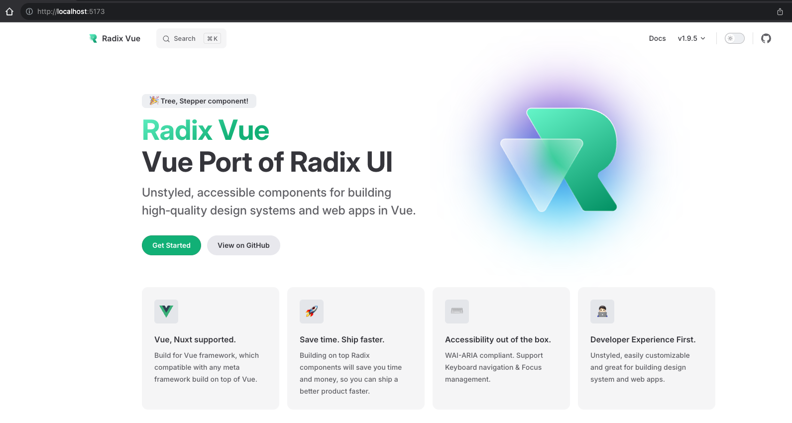
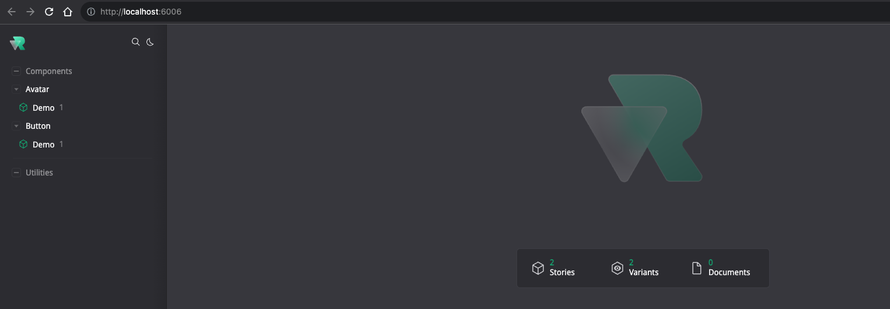
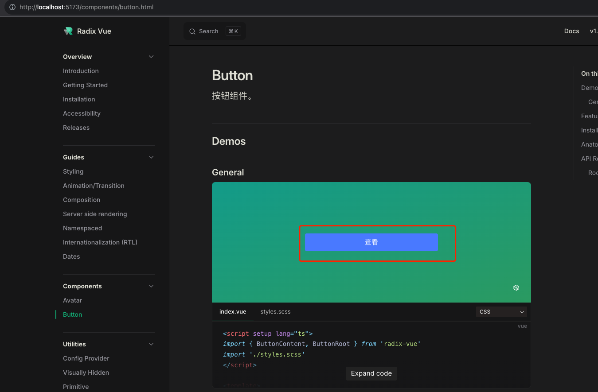

### 基于 Headless + Vue3 实现 UI 组件

#### 1. 探索背景

传统的 `UI` 组件库，是 `UI` + 交互逻辑的聚合。
而 `Headless UI` 模式，则是将 `UI` 组件与交互逻辑分离，只提供 `UI` 组件的 `API`, 让开发者自行实现交互逻辑。
这样就可以针对不同的场景，灵活地选择使用 `Headless UI` 模式，也可以减少组件的依赖，提高组件的复用性。
特别是移动端，由于交互和 `UI` 各异，很难一套有一套通用的 `UI` 组件库覆盖所有 `UI` 场景，这时就需要采用 `Headless UI` 模式。

#### 2. Headless 的历史和背景

`Headless` 一词最初就是来源于 ``Headless Computer（无头计算机）`, 也就是 `Headless System（无头系统）`，维基百科的介绍为：

> `无头系统（Headless System）`是指已配置为无须显示器（即“头”）、键盘和鼠标操作的计算机系统或设备。无头系统通常通过网络连接控制，但也有部分无头系统的设备需要通过 `RS-232` 串行连接进行设备的管理。服务器通常采用无头模式以降低运作成本。

后来慢慢的就有了 `Headless Browser（无头浏览器）`、`Headless CMS`, `Headless BI` 等等常见的 `Headless` 系列；

后来在 `2018` 年 `10` 月 `26` 日改变现有 `React` 和 `Vue` 格局的 `《React Conf 2018》`大会引入了现有的 `React Hooks` 概念之后； `Headless UI` 概念才慢慢的被大家所接受。

因为在大家后知后觉中，其实发现 `Headless UI` 概念其实与 `React Hooks` 概念大同小异，只是差别在了一个更多的实现`所有数据或交互的状态逻辑层`，一个实现现有`常见的 UI 库的数据或状态逻辑层`。

#### 3. 什么是 Headless UI

`Headless UI` 全称是 `Headless User Interface （无头用户界面）`，是一种前端开发的方法论（亦或者是一种设计模式），其核心思想是将 `用户界面（UI）的逻辑和交互行为` 与 `视觉表现（CSS 样式）`分离开来；
换句话说, `Headless UI` 提供了一种方式来构建只包含`逻辑和功能`的用户界面组件，而不依赖于特定的 `CSS 样式框架或 UI 库`。
具体而言, `Headless UI` 的组件通常是纯粹的 JavaScript（或其他编程语言）组件，它们包含了一些`交互逻辑和状态管理`，但没有任何与视觉样式相关的代码。

#### 4. 为什么需要 Headless UI？

在传统的 `UI` 组件中，通常被拆分为两大部分：

- 外观样式（传统组件 `UI` 展示层）
- 逻辑部分（`Headless UI` 部分）

`外观样式`负责展示`元素标签与样式`，而`逻辑组件部分`则负责处理`数据逻辑、状态管理和用户交互`等功能。

传统的 `UI` 组件库优势：

- 开箱即用： 直接 `install` ，注册组件就可以用了；
- 易学易用： 一般会有完善的组件库文档，按照 `demo` 和 示例即可快速上手；
- 功能性全： 包含常见的常见，如表单、导航、对话框等；

传统的 `UI` 组件库限制：

- 样式难以定制： 正所谓一个萝卜一个坑，一个公司一套样式，一个项目一套样式，那么这时候的劣势就无限被放大了；
- 耦合性高： 传统 `UI` 组件库通常将界面样式、数据逻辑和用户交互等功能耦合在一起，导致代码难以维护和扩展；
- 创意受限： 公司设计师根据现有传统 UI 组件库提供的一套固定组件和样式，他们想要拓展创意，都收到了很大的影响；
- 依赖过多： 一些传统 `UI` 组件库可能依赖于大量的第三方库和插件，增加了项目的复杂性和维护成本；

`Headless UI` 的优势：

- 灵活性高： 因为 `Headless UI` 将组件的逻辑和样式分离，可自由组合使用，满足不同的项目需求；
- 可定制： 开发者可以根据自己的需求，自由定制组件的样式，实现完全的个性化；
- 轻量级： 相比于传统的 `UI` 组件库，`Headless UI` 的体积更小，加载速度更快，维护成本更低；
- 测试友好： 因为不需要关注样式，开发者可以更方便地进行单元测试，保证组件的稳定性和可靠性；

当然 `Headless UI` 也有缺点，并不适用于所有的项目：

- 如果你项目使用简单，对设计没有较大的要求，还是用现成的 `UI` 库比较合适，毕竟开箱即用；
- 产品设计风格统一或风格变化稳定，那么封装一套通用的，支持换肤即可适配多场景；

#### 5. 初次尝试

这里基于开源项目 `radix-vue`，以 常见的 `Button` 组件为例，尝试使用 `Headless UI`。
其实 `Button` 组件交互比较简单，可以直接基于 `Headless` 原始元素组件进行封装，如：

```vue
<!-- CustomButton.vue -->

<template>
  <Primitive as="button" :as-child="false" class="button button-type-primary button-size-medium">
    <IconLoading v-if="loading" />
    <slot />
  </Primitive>
</template>

<script setup lang="ts">
import { IconLoading } from 'icon/xxx';
import { Primitive, type PrimitiveProps } from 'radix-vue';

interface ButtonProps extends PrimitiveProps {
  loading?: boolean;
}
</script>
```

在这个例子中，我们定义了一个名为 `Button` 的组件，它继承自 `Primitive` 组件。
`Primitive` 是一个由 `Radix UI` 提供的组件，它可以用来创建自定义的 `HTML` 元素。
我们定义了一个名为 `ButtonProps` 的接口，它继承自 `PrimitiveProps` 接口，并添加了一个名为 `loading` 的布尔属性。

那么，如果要把这个 `Button` 组件基于 `Headless` 风格进行封装再次，预期为:

- 里面带有一些交互逻辑，比如 `Loading` 状态内部进行自动控制；
- 无障碍友好；
- 内部数据状态体现在元素属性上，使得更好的运用样式控制；
- ...

那么应该如何实现呢？

##### 5.1 本地运行

```bash
git clone git@github.com:radix-vue/radix-vue.git
cd radix-vue
# 1. 安装依赖
pnpm install
# 2. 构建项目，文档本地启动，需要先生成构建结果
pnpm build
```

文档项目运行正常后，是这个样子：

```bash
# 3. 启动文档
pnpm docs:dev
```



调试项目运行正常后，是这个样子：

```bash
# 4. 启动调试
pnpm story:dev
```



##### 5.2 项目目录结构

```
.
├── .histoire
├── .vscode
├── docs
├── packages
|    ├── plugins
|    └── radix-vue
|          ├── constant
|          └── src
|               └── Button
|                  ├── story
|                       └── Button.story.vue
|                  ├── ButtonContent.vue
|                  ├── ButtonLoading.vue
|                  ├── ButtonRoot.vue
|                  └── index.ts
├── patches
├── src
|    ├── assets
|    ├── components
|    ├── App.vue
|    └── main.js
├── package.json
└── pnpm-workspace.yaml
```

##### 5.3 组件实现

```ts
// index.ts

export {
  type ButtonContentProps,
  default as ButtonContent,
} from './ButtonContent.vue';
export {
  type ButtonLoadingProps,
  default as ButtonLoading,
} from './ButtonLoading.vue';
export { type ButtonRootProps, default as ButtonRoot } from './ButtonRoot.vue';
```

```vue
<!-- ButtonRoot.vue -->

<template>
  <Primitive :as-child="asChild" :as="as" role="button">
    <slot />
  </Primitive>
</template>

<script lang="ts">
import type { PrimitiveProps } from '@/Primitive';
import type { Ref } from 'vue';
import { createContext, useForwardExpose } from '@/shared';
</script>

<script setup lang="ts">
import { Primitive } from '@/Primitive';
import { toRefs } from 'vue';

export interface ButtonRootProps extends PrimitiveProps {
  loading?: boolean;
}
export interface ButtonRootContext {
  loading?: Ref<boolean>;
}
const props = withDefaults(defineProps<ButtonRootProps>(), {
  as: 'button',
});

const [injectButtonRootContext, provideButtonRootContext] = createContext<ButtonRootContext>('ButtonRoot');

useForwardExpose();

const { loading } = toRefs(props);
provideButtonRootContext({
  loading,
});
</script>
```

```vue
<!-- ButtonLoading.vue -->

<template>
  <Primitive v-show="loading" role="icon" :as-child="asChild" :as="as" :data-hidden="loading ? true : false">
    <slot />
  </Primitive>
</template>

<script lang="ts">
import type { PrimitiveProps } from '@/Primitive';
import { useForwardExpose } from '@/shared';
</script>

<script setup lang="ts">
import { Primitive } from '../Primitive';
import { injectButtonRootContext } from './ButtonRoot.vue';

export interface ButtonLoadingProps extends PrimitiveProps {}

withDefaults(defineProps<ButtonLoadingProps>(), { as: 'span' });

useForwardExpose();
const { loading } = injectButtonRootContext();
</script>
```

```vue
<!-- ButtonContent.vue -->

<template>
  <Primitive :as-child="asChild" :as="as" role="text">
    <slot />
  </Primitive>
</template>

<script lang="ts">
import type { PrimitiveProps } from '@/Primitive';
import { useForwardExpose } from '@/shared';
</script>

<script setup lang="ts">
import { Primitive } from '@/Primitive';

export interface ButtonContentProps extends PrimitiveProps {}

withDefaults(defineProps<ButtonContentProps>(), {
  as: 'span',
});

useForwardExpose();
</script>
```

接下来调试看看效果。

##### 5.4 调试

```vue
<!-- Button.story.vue -->

<template>
  <Story title="Button/Demo">
    <Variant title="default">
      <ButtonRoot :loading="state.loading">
        <ButtonLoading> Loading </ButtonLoading>
        <ButtonContent> 按钮 </ButtonContent>
      </ButtonRoot>
    </Variant>
  </Story>
</template>

<script setup lang="ts">
import { reactive } from 'vue';
import { ButtonContent, ButtonLoading, ButtonRoot } from '../';

const state = reactive({
  loading: false,
});
</script>
```


我们看到，这个组件只有交互逻辑，没有样式，无障碍信息也体现在元素结构中, `loading` 状态也可视化更新。
那么现在就算基本符合 `headless` 的初衷了。

我们也可以很方便的根据内部状态进行样式控制，如:

```css
[data-hidden="false"] {
  /* 添加内部状态样式 */
}
```

另外，写法上也会和传统的组件有些不同：

1. 更细粒度的组合；
2. 层次清晰，每个逻辑层都可控，层级结构和 `dom` 层级保持一致，使得可以充分自由定制；

##### 5.5 实际应用

目前的 `Button` 组件只有交互逻辑，没有样式，自然是不能直接应用到项目中，需要结合样式库或者自定义样式。
所以，我们就可以将其封装成一个通用的组件在我们项目中，或者封装一个个性化组件，仅针对某个别场景使用。

```vue
<!-- docs/components/demo/Button_General/css/index.vue -->
<template>
  <div>
    <ButtonRoot class="ButtonRoot">
      <ButtonContent class="ButtonContent">
        查看
      </ButtonContent>
    </ButtonRoot>
  </div>
</template>

<script setup lang="ts">
import { ButtonContent, ButtonRoot } from 'radix-vue';
import './styles.scss';
</script>
```

```scss
@import "@radix-ui/colors/black-alpha.css";
@import "@radix-ui/colors/grass.css";

.ButtonRoot {
  width: 100%;
  line-height: 22px;
  position: relative;
  display: flex;
  align-items: center;
  justify-content: center;
  height: var(--f-btn-height);
  padding: var(--f-btn-padding);
  color: var(--f-btn-color);
  font-weight: 400;
  font-size: var(--f-btn-font-size);
  white-space: nowrap;
  vertical-align: middle;
  background: var(--f-btn-bg-color);
  border: var(--f-btn-border-width) var(--f-btn-border-style) transparent;
  border-color: var(--f-btn-border-color);
  border-radius: var(--f-btn-border-radius);
  cursor: pointer;
}
```

效果如下：



#### 6. 更多

1. 现有 `UI` 组件库，对应到 `headless` 写法，有没一套方法论？进而把规则写好，让 AI 协助生成代码。
2. 对于特有的交互，如移动端下拉框，日期选择器等弹出层，需要写对应的 `headless` 公共逻辑，目前这方便是比较缺失的，需要后续特别补充。
3. `headless` 组件提供的 `API` 接口，与现有组件已有的 API，哪些是 `headless` 提供的，哪些是组件应用层提供？这个需要进一步明确和规划。
4. 仅有 `headless` 是不能直接应用于项目的，那么自然是不是需要把已有的移动端组件库基于 `headless` 封装的组件做一下改造？

#### 7. 参考

- [headlessui](https://github.com/tailwindlabs/headlessui)
- [tailwindcss](https://github.com/tailwindlabs/tailwindcss)
- [radix-vue](https://github.com/unovue/radix-vue)
- [shadcn-vue](https://github.com/unovue/shadcn-vue)
