# MasterGo 插件开发初体验

## 1. 背景

`Sketch` 插件开发多有不便，表现在：

- 官方 `sdk` 和文档比较老旧，跟不上时代的步伐；
- `demo` 支持和 `ts` 类型等是个盲盒，除非对 api 很熟悉，否则扩展和支持有些成本；
- 客户端原生语言并不是 `web` 技术栈，所以对原生开发的插件比较友好，而对于基于 `web` 开发的插件响应会有些卡顿；
- 免费账号有使用期限，过了有效期只能换邮箱重新注册，比较麻烦；

而现在比较流行的 `Figma`，插件开发比较友好，但也存在一些痛点：

- `Figma` 虽然不需代理即可访问，但由于目前没有在国内架设服务器，会存在在访问时会遇到加载延迟的问题；
- 所有在 `Figma` 中创建的文件，实际上都存放在 `Figma` 租用的亚马逊 `AWS` 服务器上，会有文件的信息安全问题，就如之前大疆团队设计账号被 `Figma` 官方冻结的事件，数据存放在海外，主动权就掌握在 `Figma` 手上，可以随时冻结用户的数据。

## 2. 调研

调研的国内设计软件主要有：

`MasterGo`：

蓝湖旗下开发的一款软件。

- [官网](https://mastergo.com/)
- [插件广场](https://mastergo.com/community/plugin)
- [使用文档](https://mastergo.com/help/)
- [插件介绍及使用](https://mastergo.com/help/view/plugin)
- [开发者平台](https://developers.mastergo.com/)
- [官方开源项目](https://github.com/mastergo-design)

`即时设计`：

被称为国内版 `Figma`。

- [官网](https://js.design/)
- [插件广场](https://js.design/community?category=plugin)
- [开发者中心](https://js.design/developer)
- [插件 API](https://js.design/developer-doc/plugin/guide/start/Intro)
- [官方开源项目](https://github.com/mastergo-design)
- [插件 demo](https://github.com/jsdesigndev)

`Pixso`：

- [官网](https://pixso.cn/)
- [插件广场](https://pixso.cn/plugins/)
- [开发者文档](https://pixso.cn/developer/zh/)

综上来看，`MasterGo` 和 `即时设计`，不管是插件生态还是开发者体验，都更胜一筹。
考虑到平时有在使用 `MasterGo`，所以先体验下这个产品的插件开发流程。

## 3. 插件开发

### 3.1 创建插件

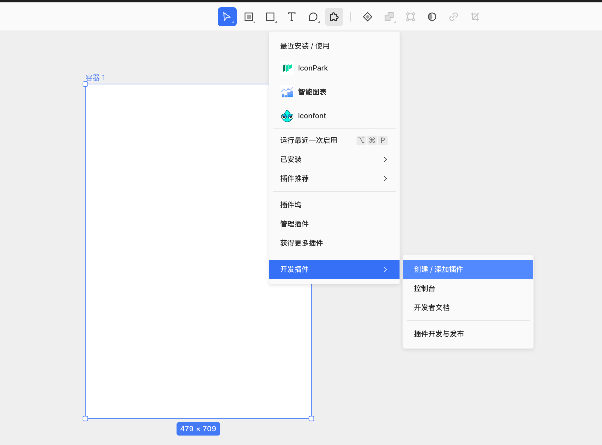

填写插件名称：

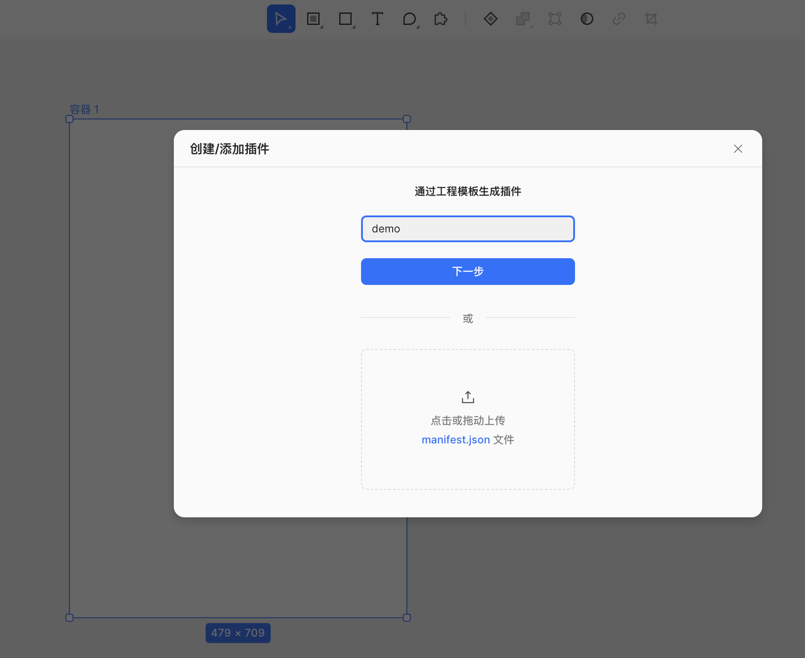

选择模板：

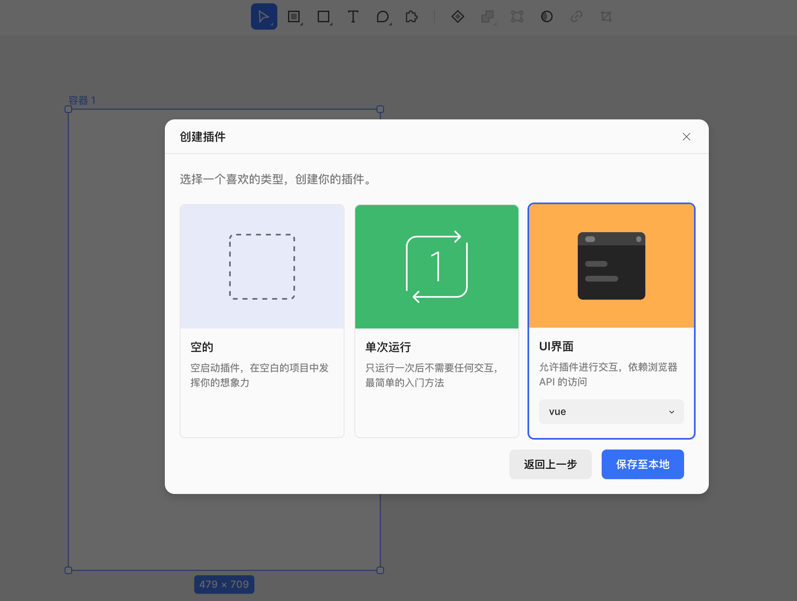

如果是添加已有的插件：

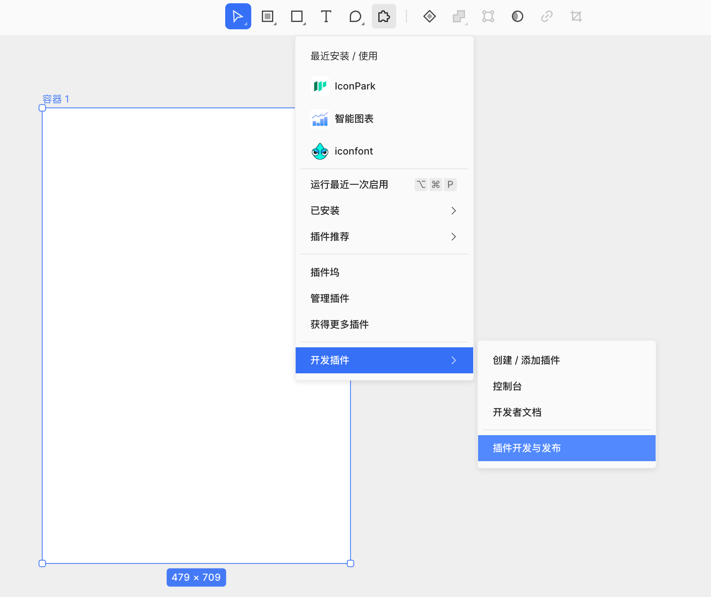
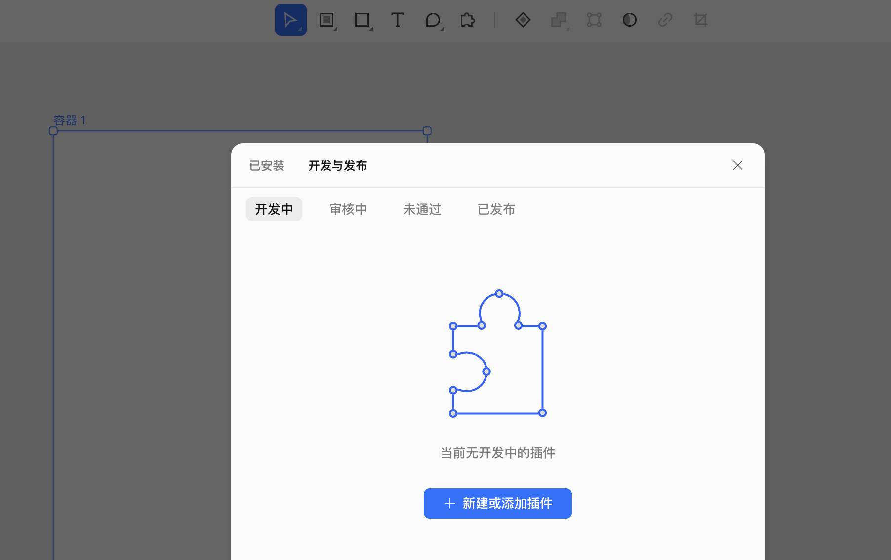
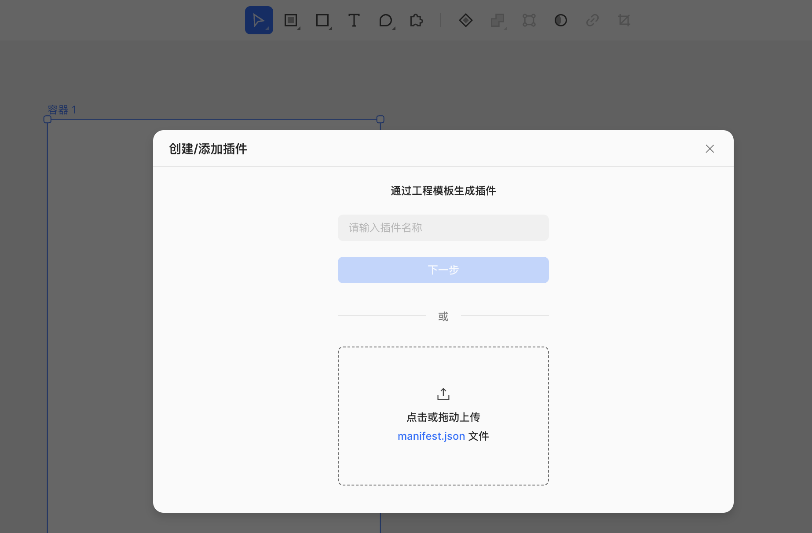
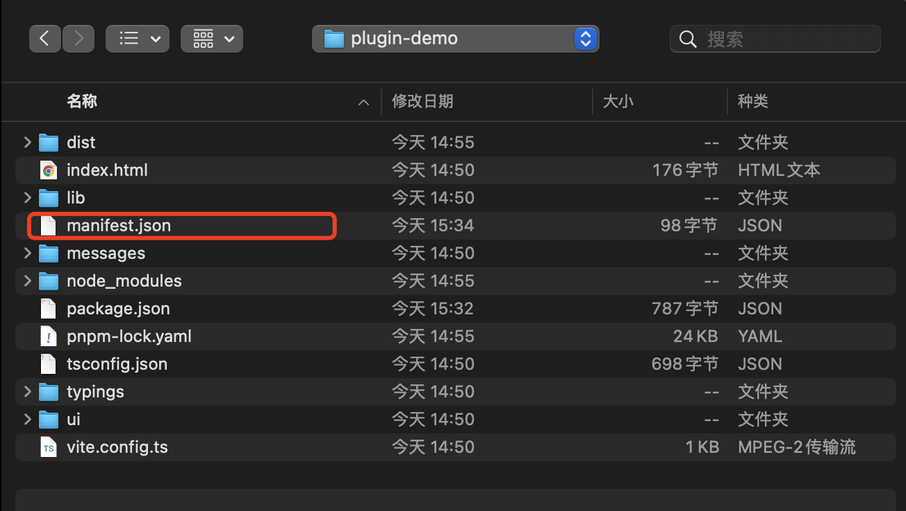

这个时候插件列表中就会显示这个插件了：

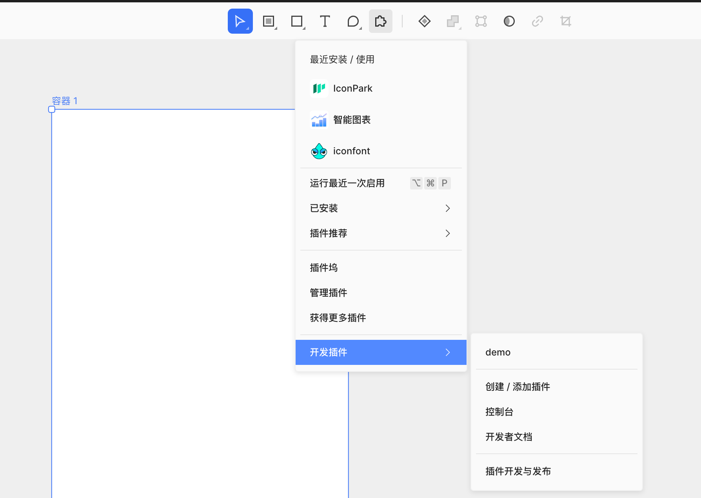

如果是刚创建的插件，这个时候还不可用，需要本地启动项目才能体验。

### 3.2 启动项目

```bash
cd plugin-demo
pnpm install
npm run dev
```

看下效果：

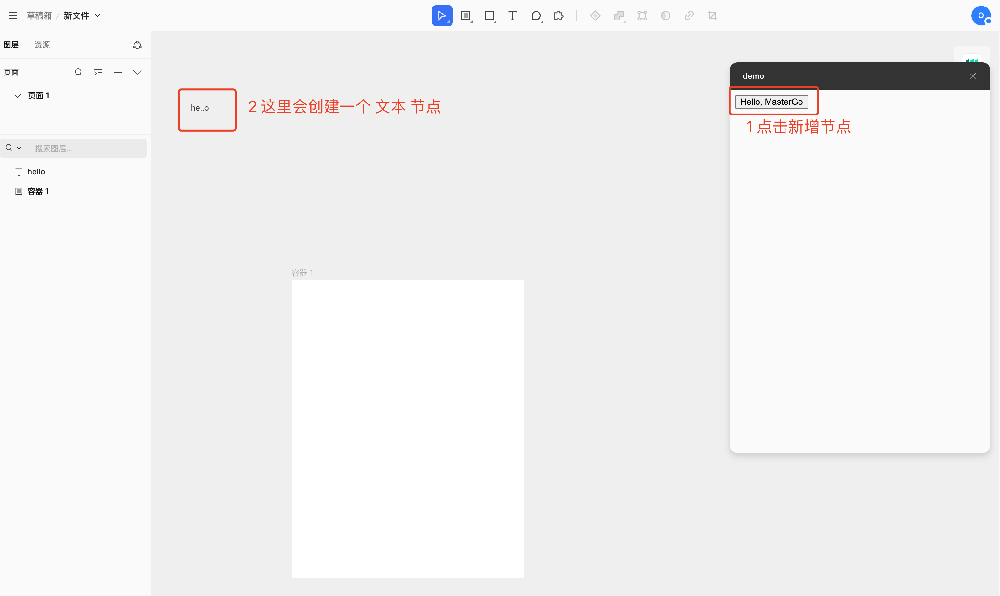

一般设计页面的时候，需要用一个容器节点包括起来，所以可以尝试把这个节点拖拽到容器中：

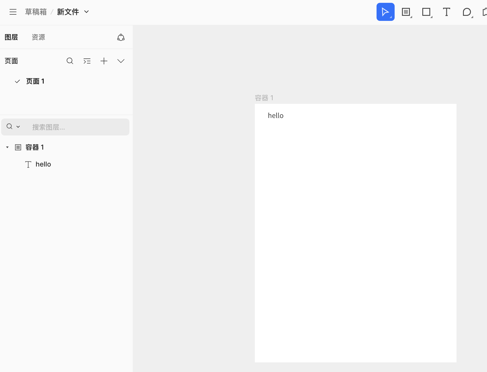

### 3.3 插件构建

```bash
npm run build
```

我们会发现，`dist` 目录下多了两个文件：

```
.
plugin-demo
|   ├── dist
|   |   ├── index.html  # ui 页面
|   |   └── main.js     # 主进程
```

## 4. 源码梳理

### 4.1 目录结构

插件项目目录结构：

```
.
├── lib
|    └── main.ts           # 主进程入口
├── messages
|    └── sender.ts
├── typings
|    └── shims-vue.d.ts
├── ui
|    ├── App.vue
|    └── ui.ts             # UI页面入口
├── index.html
├── manifest.json
├── package.json
├── pnpm-lock.yaml
├── tsconfig.json
└── vite.config.ts
```

### 4.2 插件构建

不管是调试还是构建，都使用 `vite` 构建工具。

根据 `package.json`，可以看到，调试和构建，其实是对 `ui` 和 `lib` 分别打包的：

```json
// package.json
{
  "scripts": {
    "dev": "yarn dev:ui & yarn dev:main",
    "dev:ui": "cross-env TARGET=ui NODE_ENV=development vite build --mode development -w",
    "dev:main": "cross-env TARGET=main NODE_ENV=development vite build --mode development -w",
    "build": "yarn build:ui && yarn build:main && rm -rf ./dist/assets",
    "build:ui": "cross-env TARGET=ui vite build",
    "build:main": "cross-env TARGET=main vite build"
  }
}
```

构建配置如下：

```typescript
// vite.config.ts

// ...

const target = process.env.TARGET;

export default defineConfig(() => {
  const buildConfig
    = target === 'ui'
      ? {
          target: 'esnext',
          assetsInlineLimit: 100000000,
          chunkSizeWarningLimit: 100000000,
          cssCodeSplit: false,
          brotliSize: false,
          rollupOptions: {
            inlineDynamicImports: true,
            output: {
              manualChunks: () => 'ui.js',
            },
          },
        }
      : {
          lib: {
            entry: resolve(__dirname, './lib/main.ts'),
            name: 'myLib',
            formats: ['umd'],
            fileName: () => `main.js`,
          },
        };

  return {
    // ...
    build: {
      ...(buildConfig as BuildOptions),
      emptyOutDir: false,
    },
    // ...
  };
});
```

根据配置和构建结果，可以看到 `ui` 和 `lib` 最终是两个入口文件:

- `main.js` 主进程入口
- `index.html` UI 页面入口

特别是 `index.html`，它把 `js` 和 `css` 构建到了 `index.html` 中。
原因是 `MasterGo` 通过 `mg.showUI` 方法展示插件的用户界面。
调用该方法会创建一个模态框。该模态框中会包含 `<iframe>` 标签，并加载 `HTMLString` 中指定的 `html` 字符串。

调用方式如下：

```typescript
// lib/main.ts

mg.showUI(__html__);
```

第一个参数可传入 `__html__` 加载 `ui` 代码，或者传入其他 `html` 代码。`__html__` 为全局变量，类型为 `string`，该值由 `manifest.json` 中指定的 `ui` 字段所引用的文件内容。

```json
// manifest.json
{
  "name": "demo",
  "id": 140904089808559,
  "main": "dist/main.js",
  "ui": "dist/index.html"
}
```

也就是相当于 `iframe` 打开本地 `index.html` 的方式。
而基于 `vite` 构建的项目，由于 `index.html` 中是通过 `type=module` 的方式加载静态资源的，这种方式在本地加载 `html` 的情况下无法正常工作。
这也是为什么 `dev` 模式也需要通过 `vite build` 命令来构建项目的原因。

### 4.2 插件运行机制

正如 `MasterGo` 是基于 `Web` 技术一样，插件也是基于 `Web` 技术的。
这意味着，可以使用 `JavaScript`、`HTML`、`CSS` 等技术来构建插件。
但出于安全性的考虑，`MasterGo` 在这些 `Web` 技术上构建了一些规则和限制。

#### 4.2.1 为插件构建用户界面

`MasterGo` 可以使用 `HTML` 文件为插件创建用户界面，允许用户与插件进行可视化交互。
需要指出的是，用户界面是运行在 `<iframe>` 中的，因此无法直接在 `HTML` 文件嵌入的脚本中直接访问 `MasterGo` 的插件 `API`。
但也正因为用户界面运行在 `<iframe>` 中，因此，你可以使用全部的 `Web API` 来构建用户界面。

正如：

```typescript
// lib/main.ts

mg.showUI(__html__);
```

#### 4.2.2 访问 MasterGO 的文件内容

由于用户界面中的脚本无法访问 `MasterGo` 的文件内容（即无法使用 `MasterGo` 插件 `API`），因此需要编写单独的 `JavaScript` 脚本来完成该任务。
同样出于安全性的考虑，这个特殊的 `JavaScript` 脚本会运行在主线程的一个沙箱中。
该沙箱是一个最小化的 `JavaScript` 运行环境，无法通过运行与沙箱中的代码访问浏览器提供的 `APIs`，如 `XMLHTTPRequest`。
但仍然可以运行标准的 `ES2021` 代码。例如 `Promise APIs`、`Uint8Array`、`JSON` 等等。

#### 4.2.3 主线程脚本与用户界面间的通信

用户界面内的脚本无法直接访问 `MasterGo` 文件的内容，而运行在沙箱内的脚本虽然可以调用 `MasterGo` 插件 `API` 访问 `MasterGo` 的文件内容，但无法访问并利用浏览器 `APIs`。
所以 `MasterGo` 在`用户界面内的脚本`与`沙箱内的脚本`之间建立信息交流的“通道”。
如下图所示：

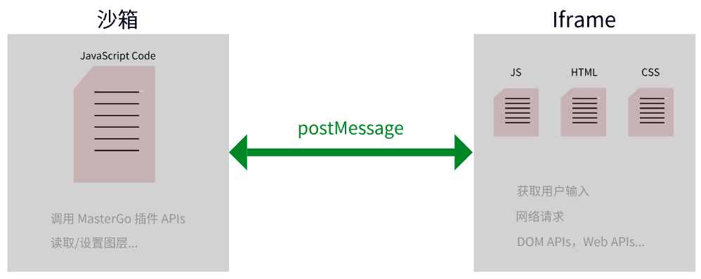

正如：

```vue
<template>
  <button @click="handleAddTextNode">
    Hello, Demo
  </button>
</template>

<script lang="ts" setup>
import { ref } from 'vue';

const mg = ref('MasterGo');

function handleAddTextNode() {
  // ui 通过 parent.postMessage 发送消息
  parent.postMessage(data, '*');
}
</script>
```

```typescript
mg.showUI(__html__);

// 主进程通过监听 message 事件 获取消息
mg.ui.onmessage = (msg: { type: string; data: any }) => {
  const { type, data } = msg;
  if (type === 'demo') {
    const textNode = mg.createText();
    textNode.characters = data;
  }
};
```

## 5. 更多

还有一些其他功能需要 `demo` 支持：

- `ui` 和主进程双向通信；
- 拖拽元素插入节点到指定画布位置；
- 根据选中的容器，拖拽元素到指定的容器，甚至限制只有先选择容器，才能拖拽元素；
- 元素增加个性化配置项，再次选中节点，插件能反向解析到对应的元素和配置项信息；
- 低代码物料的配置、预览；
- 获取画布节点数据解析得到低代码渲染 `schema`；
- 指定低代码应用和页面，根据 `schema` 进行初始化。

## 6. 参考

`sketch` 插件设计相关：

- [网易云音乐设计协同演进之路](https://juejin.cn/post/7317193434733150223)
- [网易云音乐基于 C2D2C 的「无损」设计协同](https://juejin.cn/post/7205016004924293157)
- [云音乐 D2C 设计稿转代码建设实践](https://juejin.cn/post/7317478551628103695)
- [D2C 设计方案调研：FigmaToCode 设计稿转代码 布局方案剖析](https://juejin.cn/post/7252546940105179194)
- [如何使用 Fin2.0 文生图登上云音乐首页](https://zhuanlan.zhihu.com/p/666741239)
- [C2D2C 功能演示](https://crazynote.v.netease.com/2023/0209/4422069aef7c817e5ec1bfb157fda38e.mp4)

`sketch` 插件开发相关：

- [Sketch 官方下载](https://www.sketch.com/apps/)
- [官方插件开发指南](https://developer.sketch.com/)
- [sketch 插件开发指南](https://juejin.cn/post/7033911797279096845)
- [一键生成 BizCharts 图表代码的 Sketch 插件](https://juejin.cn/post/6844903849874948103)
- [拖拽插件开发 demo](https://github.com/pratikjshah/sketch-cloud-design-system)

`Figma` 插件开发相关：

- [https://www.figma.com/plugin-docs/](https://www.figma.com/plugin-docs/)

`MasterGo`：

- [官网](https://mastergo.com/)
- [插件广场](https://mastergo.com/community/plugin)
- [使用文档](https://mastergo.com/help/)
- [插件介绍及使用](https://mastergo.com/help/view/plugin)
- [开发者平台](https://developers.mastergo.com/)
- [官方开源项目](https://github.com/mastergo-design)
