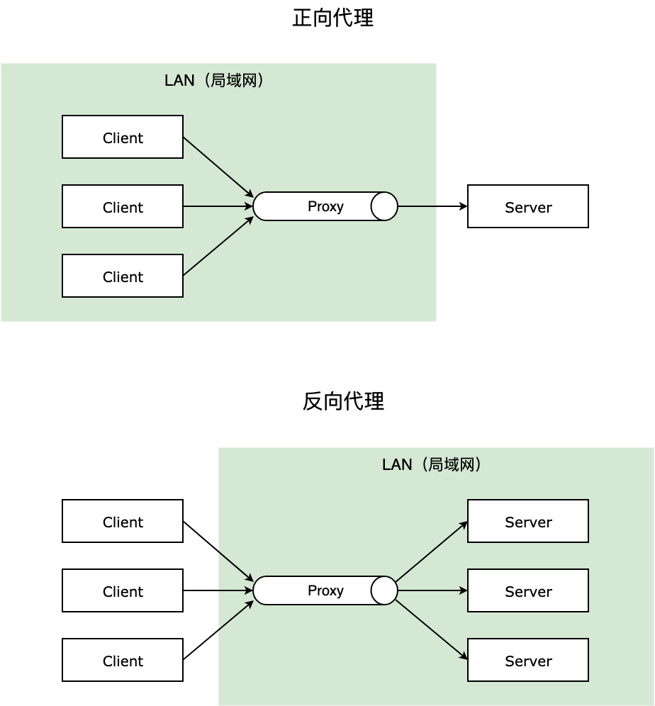
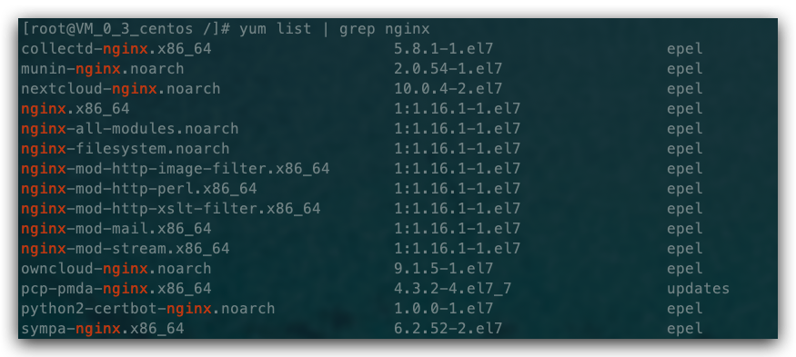
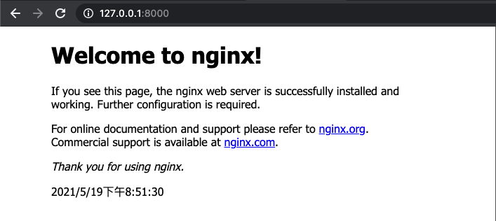
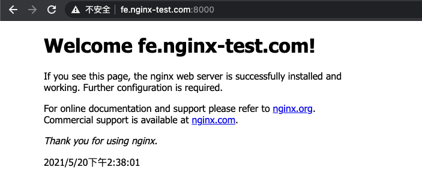
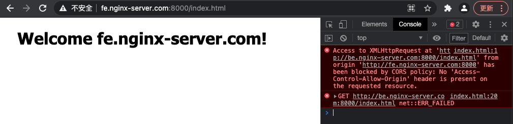
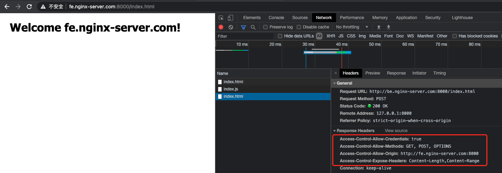
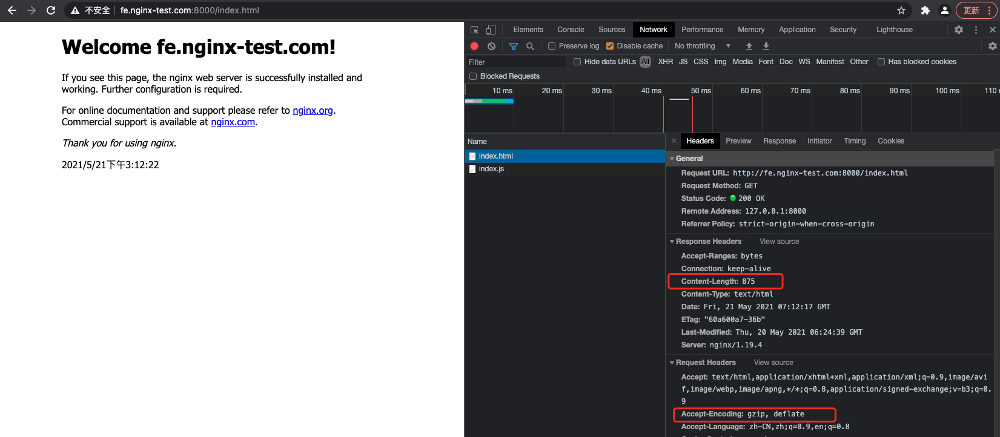
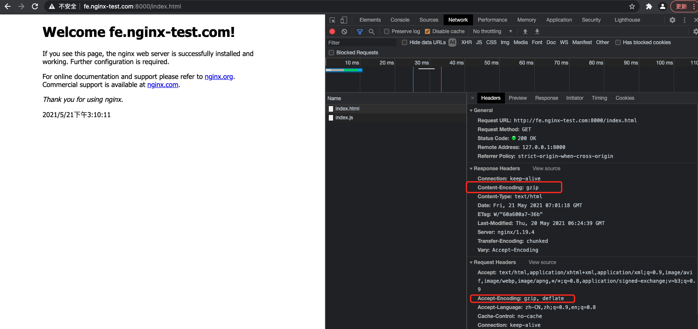
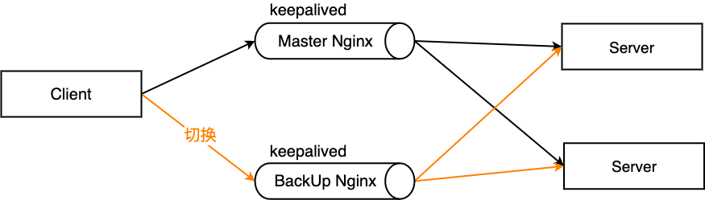

# Nginx 配置实践

因为平时前端开发中，配置域名站点等，不可避免要用到 `Nginx`, 所以这里做下 `Nginx` 的知识点梳理和实践。

> 具体配置梳理说明[详见这里](../20210520_Nginx配置项说明/index.md)。

## 1. Nginx 介绍

传统的 `Web` 服务器，每个客户端连接作为一个单独的进程或线程处理。
需在切换任务时将 `CPU` 切换到新的任务并创建一个新的运行时上下文，消耗额外的内存和 `CPU` 时间。
当并发请求增加时，服务器响应变慢，从而对性能产生负面影响。


`Nginx` 是开源、高性能、高可靠的 `Web` 和反向代理服务器，而且支持热部署，几乎可以做到 `7 * 24` 小时不间断运行，即使运行几个月也不需要重新启动，还能在不间断服务的情况下对软件版本进行热更新。
性能是 `Nginx` 最重要的考量，其占用内存少、并发能力强、能支持高达 `5w` 个并发连接数，最重要的是, `Nginx` 是免费的并可以商业化，配置使用也比较简单。

**Nginx 特点**

- 高并发、高性能；
- 模块化架构使得它的扩展性非常好；
- 异步非阻塞的事件驱动模型这点和 `Node.js` 相似；
- 相对于其它服务器来说它可以连续几个月甚至更长而不需要重启服务器使得它具有高可靠性；
- 热部署、平滑升级；
- 完全开源，生态繁荣；

**Nginx 作用**

`Nginx` 的最重要的几个使用场景：

- 静态资源服务，通过本地文件系统提供服务；
- 反向代理服务，延伸出包括缓存、负载均衡等；
- `API` 服务，`OpenResty`；

对于前端来说 `Node.js` 不陌生了，`Nginx` 和 `Node.js` 的很多理念类似，`HTTP` 服务器、事件驱动、异步非阻塞等，且 `Nginx` 的大部分功能使用 `Node.js` 也可以实现。
但 `Nginx` 和 `Node.js` 并不冲突，都有自己擅长的领域。
`Nginx` 擅长于底层服务器端资源的处理（静态资源处理转发、反向代理，负载均衡等）。
`Node.js` 更擅长上层具体业务逻辑的处理，两者可以完美组合，共同助力前端开发。

用一张图表示：


下面我们着重学习一下 `Nginx` 的使用。

## 2. 相关概念

### 2.1 简单请求和非简单请求

首先我们来了解一下简单请求和非简单请求，如果同时满足下面两个条件，就属于简单请求：

1. 请求方法是 `HEAD`、`GET`、`POST` 三种之一；
2. HTTP 头信息不超过右边着几个字段：`Accept`、`Accept-Language`、`Content-Language`、`Last-Event-ID`、`Content-Type` 只限于三个值 `application/x-www-form-urlencoded`、`multipart/form-data`、`text/plain`；

凡是不同时满足这两个条件的，都属于非简单请求。

浏览器处理简单请求和非简单请求的方式不一样：

**简单请求**

对于简单请求，浏览器会在头信息中增加 `Origin` 字段后直接发出，`Origin` 字段用来说明，本次请求来自的哪个源（协议+域名+端口）。

如果服务器发现 `Origin` 指定的源不在许可范围内，服务器会返回一个正常的 HTTP 回应，浏览器取到回应之后发现回应的头信息中没有包含 `Access-Control-Allow-Origin` 字段，就抛出一个错误给 XHR 的 `error` 事件；

如果服务器发现 `Origin` 指定的域名在许可范围内，服务器返回的响应会多出几个 `Access-Control-` 开头的头信息字段。

**非简单请求**

非简单请求是那种对服务器有特殊要求的请求，比如请求方法是 `PUT` 或 `DELETE`，或 `Content-Type` 值为 `application/json`。

浏览器会在正式通信之前，发送一次 `HTTP` 预检 `OPTIONS` 请求，先询问服务器，当前网页所在的域名是否在服务器的许可名单之中，以及可以使用哪些 `HTTP` 请求方法和头信息字段。
只有得到肯定答复，浏览器才会发出正式的 `XHR` 请求，否则报错。

### 2.2 跨域

在浏览器上当前访问的网站向另一个网站发送请求获取数据的过程就是跨域请求。

跨域是浏览器的`同源策略`决定的，是一个重要的浏览器安全策略，用于限制一个 `origin` 的文档或者它加载的脚本与另一个源的资源进行交互，它能够帮助阻隔恶意文档，减少可能被攻击的媒介，可以使用 `CORS 配置`解除这个限制。

可以直接看 `MDN` 的 [浏览器的同源策略](https://developer.mozilla.org/zh-CN/docs/Web/Security/Same-origin_policy) 文档进一步了解，这里就列举几个同源和不同源的例子，简单说明一下。

```ini
# 同源的例子
http://example.com/app1/index.html  # 只是路径不同
http://example.com/app2/index.html

http://Example.com:80  # 只是大小写差异
http://example.com
```

```ini
# 不同源的例子
http://example.com/app1   # 协议不同
https://example.com/app2

http://example.com        # host 不同
http://www.example.com
http://myapp.example.com

http://example.com        # 端口不同
http://example.com:8080
```

### 2.3 正向代码和反向代理

代理是在服务器和客户端之间假设的一层服务器，代理将接收客户端的请求并将它转发给服务器，然后将服务端的响应转发给客户端。

`反向代理（Reverse Proxy）`对应的是`正向代理（Forward Proxy）`，他们的区别：

**正向代理：**

> 正向代理，意思是一个位于客户端和`原始服务器(origin server)`之间的服务器，为了从原始服务器取得内容，客户端向代理发送一个请求并指定目标(原始服务器)，然后代理向原始服务器转交请求并将获得的内容返回给客户端。

正向代理是为我们服务的，即为客户端服务的，客户端可以根据正向代理访问到它本身无法访问到的服务器资源。

正向代理对我们是透明的，对服务端是非透明的，即服务端并不知道自己收到的是来自代理的访问还是来自真实客户端的访问。

一般的访问流程是客户端直接向目标服务器发送请求并获取内容。
使用正向代理后，客户端改为向代理服务器发送请求，并指定目标服务器（原始服务器），然后由代理服务器和原始服务器通信，转交请求并获得的内容，再返回给客户端。

正向代理隐藏了真实的客户端，为客户端收发请求，使真实客户端对服务器不可见；

举个具体的例子 🌰，你的浏览器无法直接访问谷歌，这时候可以通过一个代理服务器来帮助你访问谷歌，那么这个服务器就叫正向代理。

**反向代理：**

> `反向代理(Reverse Proxy)` 方式是指以代理服务器来接受 `internet` 上的连接请求，然后将请求转发给内部网络上的服务器，并将从服务器上得到的结果返回给 `internet` 上请求连接的客户端，此时代理服务器对外就表现为一个反向代理服务器。

反向代理是为服务端服务的，反向代理可以帮助服务器接收来自客户端的请求，帮助服务器做请求转发，负载均衡等。

反向代理对服务端是透明的，对我们是非透明的，即我们并不知道自己访问的是代理服务器，而服务器知道反向代理在为他服务。

与一般访问流程相比，使用反向代理后，直接收到请求的服务器是代理服务器，然后将请求转发给内部网络上真正进行处理的服务器，得到的结果返回给客户端。

反向代理隐藏了真实的服务器，为服务器收发请求，使真实服务器对客户端不可见。
一般在处理跨域请求的时候比较常用。

举个具体的例子 🌰，去饭店吃饭，可以点川菜、粤菜、江浙菜，饭店也分别有三个菜系的厨师 👨‍🍳，但是你作为顾客不用管哪个厨师给你做的菜，只用点菜即可，小二将你菜单中的菜分配给不同的厨师来具体处理，那么这个小二就是反向代理服务器。

**总结**

> 简单的说，一般给客户端做代理的都是正向代理，给服务器做代理的就是反向代理。

正向代理和反向代理主要的原理区别可以参见下图：



反向代理的优势：

- 隐藏真实服务器；
- 负载均衡便于横向扩充后端动态服务；
- 动静分离，提升系统健壮性；

> 那么“动静分离”是什么？负载均衡又是什么？

### 2.4 负载均衡

一般情况下，客户端发送多个请求到服务器，服务器处理请求，其中一部分可能要操作一些资源比如数据库、静态资源等，服务器处理完毕后，再将结果返回给客户端。

这种模式对于早期的系统来说，功能要求不复杂，且并发请求相对较少的情况下还能胜任，成本也低。
随着信息数量不断增长，访问量和数据量飞速增长，以及系统业务复杂度持续增加，这种做法已无法满足要求，并发量特别大时，服务器容易崩。

很明显这是由于服务器性能的瓶颈造成的问题，除了堆机器之外，最重要的做法就是负载均衡。

请求爆发式增长的情况下，单个机器性能再强劲也无法满足要求了，这个时候集群的概念产生了，单个服务器解决不了的问题，可以使用多个服务器，然后将请求分发到各个服务器上，将负载分发到不同的服务器，这就是负载均衡，核心是「分摊压力」。
Nginx 实现负载均衡，一般来说指的是将请求转发给服务器集群。

举个具体的例子 🌰，晚高峰乘坐地铁的时候，入站口经常会有地铁工作人员大喇叭“请走 `B` 口，`B` 口人少车空....”，这个工作人员的作用就是负载均衡。


`Nginx` 实现负载均衡的策略：

- 轮询策略：默认情况下采用的策略，将所有客户端请求轮询分配给服务端。
  - 这种策略是可以正常工作的，但是如果其中某一台服务器压力太大，出现延迟，会影响所有分配在这台服务器下的用户。
- 最小连接数策略：将请求优先分配给压力较小的服务器，它可以平衡每个队列的长度，并避免向压力大的服务器添加更多的请求。
- 最快响应时间策略：优先分配给响应时间最短的服务器。
- 客户端 `ip` 绑定策略：来自同一个 `ip` 的请求永远只分配一台服务器，有效解决了动态网页存在的 `session` 共享问题。

### 2.5 动静分离

> 动静分离是指在 `web` 服务器架构中，将静态页面与动态页面或者静态内容接口和动态内容接口分开不同系统访问的架构设计方法，进而提示整个服务的访问性和可维护性。

为了加快网站的解析速度，可以把动态页面和静态页面由不同的服务器来解析，加快解析速度，降低原来单个服务器的压力。


一般来说，都需要将动态资源和静态资源分开，由于 Nginx 的高并发和静态资源缓存等特性，经常将静态资源部署在 Nginx 上。
如果请求的是静态资源，直接到静态资源目录获取资源。
如果是动态资源的请求，则利用反向代理的原理，把请求转发给对应后台应用去处理，从而实现动静分离。

使用前后端分离后，可以很大程度提升静态资源的访问速度，即使动态服务不可用，静态资源的访问也不会受到影响。

## 3. Nginx 快速安装

### 3.1 Centos 安装

> CentOS 版本：7.6

```bash
yum list | grep nginx
```



然后：

```bash
yum install nginx
```

来安装 Nginx，然后我们在命令行中 nginx -v 就可以看到具体的 Nginx 版本信息，也就安装完毕了。


### 3.2 docker 安装

```bash
docker pull nginx:stable
```

```bash
docker run --name docker_nginx_8000 -d -p 8000:80  nginx
```

进入容器：

```bash
docker exec -it docker_nginx_8000 bash
# root@9a2f7ba8ce25:/#
```

查看安装版本：

```bash
# root@9a2f7ba8ce25:/#
nginx -v
# nginx version: nginx/1.19.4
```

```bash
# 查看linux版本
# root@9a2f7ba8ce25:/#
cat /etc/issue
# Debian GNU/Linux 10 \n \l
```

### 3.3 相关文件夹

`Centos` 下，然后我们可以使用 `rpm -ql nginx` 来查看 Nginx 被安装到了什么地方，有哪些相关目录。
其中位于 `/etc` 目录下的主要是配置文件，还有一些文件如下：

```ini
# Nginx配置文件
/etc/nginx/nginx.conf # nginx 主配置文件
/etc/nginx/nginx.conf.default

# 可执行程序文件
/usr/bin/nginx-upgrade
/usr/sbin/nginx # Nginx服务的启动管理终端命令

# nginx库文件
/usr/lib/systemd/system/nginx.service # 用于配置系统守护进程
/usr/lib64/nginx/modules # Nginx模块目录

# 帮助文档
/usr/share/doc/nginx-1.16.1
/usr/share/doc/nginx-1.16.1/CHANGES
/usr/share/doc/nginx-1.16.1/README
/usr/share/doc/nginx-1.16.1/README.dynamic
/usr/share/doc/nginx-1.16.1/UPGRADE-NOTES-1.6-to-1.10

# 静态资源目录
/usr/share/nginx/html/404.html
/usr/share/nginx/html/50x.html
/usr/share/nginx/html/index.html

# 存放Nginx日志文件
/var/log/nginx

# cgi配置相关
/etc/nginx/fastcgi.conf
/etc/nginx/fastcgi.conf.default
/etc/nginx/fastcgi_params
/etc/nginx/fastcgi_params.default
/etc/nginx/scgi_params
/etc/nginx/scgi_params.default
/etc/nginx/uwsgi_params
/etc/nginx/uwsgi_params.default

# 编码转换映射转化文件
/etc/nginx/koi-utf
/etc/nginx/koi-win
/etc/nginx/win-utf

# 设置http协议的Content-Type与扩展名对应关系
/etc/nginx/mine.types
/etc/nginx/mine.types.default

# 配置文件，Nginx日志轮转，用于日志切割
/etc/logrotate.d/nginx
```

主要关注的文件夹有两个：

- `/etc/nginx/conf.d/` 文件夹，是我们进行`子配置的配置项`存放处，`/etc/nginx/nginx.conf` 主配置文件会默认把这个文件夹中`所有子配置项`都引入；
- `/usr/share/nginx/html/` 文件夹，通常`静态文件`都放在这个文件夹，也可以根据你自己的习惯放其他地方；

### 3.4 跑起来看看

#### 3.4.1 Centos 环境启动

安装之后开启 `Nginx`, 如果系统开启了防火墙，那么需要设置一下在防火墙中加入需要开放的端口。
下面列举几个常用的防火墙操作（没开启的话不用管这个）：

```bash
systemctl start firewalld  # 开启防火墙
systemctl stop firewalld   # 关闭防火墙
systemctl status firewalld # 查看防火墙开启状态，显示running则是正在运行
firewall-cmd --reload      # 重启防火墙，永久打开端口需要reload一下

# 添加开启端口，--permanent表示永久打开，不加是临时打开重启之后失效
firewall-cmd --permanent --zone=public --add-port=8888/tcp

# 查看防火墙，添加的端口也可以看到
firewall-cmd --list-all
```

然后设置 `Nginx` 的开机启动：

```bash
systemctl enable nginx
```

启动 `Nginx`:

```bash
systemctl start nginx
```

然后访问你的 `IP`, 这时候就可以看到 `Nginx` 的欢迎页面了～ `Welcome to nginx！` 👏

#### 3.4.2 docker 环境启动

1. 创建将要挂载的目录

```bash
mkdir -p [本地docker数据目录]/nginx/{conf,conf.d,html,logs}
```

2. 创建本地配置文件

> `[本地docker数据目录]/nginx/nginx.conf`

```bash
vim conf/nginx.conf
```

> 内容粘贴自 `nginx` 容器的文件内容 `cat /etc/nginx/nginx.conf`。

```ini
user  nginx;
worker_processes  1;

error_log  /var/log/nginx/error.log warn;
pid        /var/run/nginx.pid;

events {
    worker_connections  1024;
}

http {
    include       /etc/nginx/mime.types;
    default_type  application/octet-stream;

    log_format  main  '$remote_addr - $remote_user [$time_local] "$request" '
                      '$status $body_bytes_sent "$http_referer" '
                      '"$http_user_agent" "$http_x_forwarded_for"';

    access_log  /var/log/nginx/access.log  main;

    sendfile        on;
    #tcp_nopush     on;

    keepalive_timeout  65;

    #gzip  on;

    include /etc/nginx/conf.d/*.conf;
}
```

> `[本地docker数据目录]/nginx/conf.d/default.conf`

```bash
vim conf.d/default.conf
```

> 内容粘贴自 `nginx` 容器的文件内容 `cat /etc/nginx/nginx.d/default.conf`。

```ini
server {
    listen       80;
    listen  [::]:80;
    server_name  localhost;

    #charset koi8-r;
    #access_log  /var/log/nginx/host.access.log  main;

    location / {
        root   /usr/share/nginx/html;
        index  index.html index.htm;
    }

    #error_page  404              /404.html;

    # redirect server error pages to the static page /50x.html
    #
    error_page   500 502 503 504  /50x.html;
    location = /50x.html {
        root   /usr/share/nginx/html;
    }

    # proxy the PHP scripts to Apache listening on 127.0.0.1:80
    #
    #location ~ \.php$ {
    #    proxy_pass   http://127.0.0.1;
    #}

    # pass the PHP scripts to FastCGI server listening on 127.0.0.1:9000
    #
    #location ~ \.php$ {
    #    root           html;
    #    fastcgi_pass   127.0.0.1:9000;
    #    fastcgi_index  index.php;
    #    fastcgi_param  SCRIPT_FILENAME  /scripts$fastcgi_script_name;
    #    include        fastcgi_params;
    #}

    # deny access to .htaccess files, if Apache's document root
    # concurs with nginx's one
    #
    #location ~ /\.ht {
    #    deny  all;
    #}
}
```

> `[本地docker数据目录]/nginx/html/index.html`

```bash
vim html/index.html
```

> 内容粘贴自 `nginx` 容器的文件内容 `cat /usr/share/nginx/html/index.html`。

```html
<!DOCTYPE html>
<html>
  <head>
    <title>Welcome to nginx!</title>
    <style>
      body {
        width: 35em;
        margin: 0 auto;
        font-family: Tahoma, Verdana, Arial, sans-serif;
      }
    </style>
  </head>
  <body>
    <h1>Welcome to nginx!</h1>
    <p>
      If you see this page, the nginx web server is successfully installed and working. Further configuration is
      required.
    </p>

    <p>
      For online documentation and support please refer to <a href="http://nginx.org/">nginx.org</a>.<br />
      Commercial support is available at
      <a href="http://nginx.com/">nginx.com</a>.
    </p>

    <p><em>Thank you for using nginx.</em></p>

    <div id="datetime">
      <script>
        setInterval("document.getElementById('datetime').innerHTML=new Date().toLocaleString();", 1000)
      </script>
    </div>
  </body>
</html>
```

3. 启动容器

```bash
docker run \
--name docker_nginx_8000 \
-p 8000:80 \
-v [本地docker数据目录]/nginx/html:/usr/share/nginx/html \
-v [本地docker数据目录]/nginx/conf/nginx.conf:/etc/nginx/nginx.conf \
-v [本地docker数据目录]/nginx/logs:/var/log/nginx \
-v [本地docker数据目录]/nginx/conf.d:/etc/nginx/conf.d \
-d nginx
```

4. 访问 `Nginx`



5. 查看 `Nginx` 日志

```bash
# 展示最后一行日志，且实时监听打印
tail -n 1  -f access.log
# 172.17.0.1 - - [19/May/2021:12:51:23 +0000] "GET / HTTP/1.1" 304 0 "-" "Mozilla/5.0 (Macintosh; Intel Mac OS X 10_15_7) AppleWebKit/537.36 (KHTML, like Gecko) Chrome/90.0.4430.93 Safari/537.36" "-"
# 172.17.0.1 - - [19/May/2021:12:55:44 +0000] "GET / HTTP/1.1" 304 0 "-" "Mozilla/5.0 (Macintosh; Intel Mac OS X 10_15_7) AppleWebKit/537.36 (KHTML, like Gecko) Chrome/90.0.4430.93 Safari/537.36" "-"
```

## 4. Nginx 操作常用命令

`Nginx` 的命令在控制台中输入 `nginx -h` 就可以看到完整的命令，这里列举几个常用的命令：

```bash
nginx -s reload  # 向主进程发送信号，重新加载配置文件，热重启
nginx -s reopen  # 重启 Nginx
nginx -s stop    # 快速关闭
nginx -s quit    # 等待工作进程处理完成后关闭
nginx -T         # 查看当前 Nginx 最终的配置
nginx -t -c [配置路径]    # 检查配置是否有问题，如果已经在配置目录，则不需要-c
```

`systemctl` 是 `Linux` 系统应用管理工具 `systemd` 的主命令，用于管理系统，我们也可以用它来对 `Nginx` 进行管理，相关命令如下：

```bash
systemctl start nginx    # 启动 Nginx
systemctl stop nginx     # 停止 Nginx
systemctl restart nginx  # 重启 Nginx
systemctl reload nginx   # 重新加载 Nginx，用于修改配置后
systemctl enable nginx   # 设置开机启动 Nginx
systemctl disable nginx  # 关闭开机启动 Nginx
systemctl status nginx   # 查看 Nginx 运行状态
```

## 5. Nginx 配置语法

`Nginx` 的主配置文件是 `/etc/nginx/nginx.conf`，可以使用 `cat -n nginx.conf` 来查看配置。

```bash
cat -n nginx/conf/nginx.conf
#   1 user  nginx;
#   2 worker_processes  1;
#   3
#   4 error_log  /var/log/nginx/error.log warn;
#   5 pid        /var/run/nginx.pid;
#   6
#   7
#   8 events {
#   9     worker_connections  1024;
# 10  }
# 11
# 12
# 13  http {
# 1      include       /etc/nginx/mime.types;
# 15      default_type  application/octet-stream;
# 16
# 17      log_format  main  '$remote_addr - $remote_user [$time_local] "$request" '
# 18                        '$status $body_bytes_sent "$http_referer" '
# 19                        '"$http_user_agent" "$http_x_forwarded_for"';
# 20
# 21      access_log  /var/log/nginx/access.log  main;
# 22
# 23      sendfile        on;
# 24      #tcp_nopush     on;
# 25
# 26      keepalive_timeout  65;
# 27
# 28      #gzip  on;
# 29
# 30      include /etc/nginx/conf.d/*.conf;
# 31  }
```

`nginx.conf` 结构图可以这样概括：

```ini
main        # 全局配置，对全局生效
├── events  # 配置影响 Nginx 服务器或与用户的网络连接
├── http    # 配置代理，缓存，日志定义等绝大多数功能和第三方模块的配置
│   ├── upstream # 配置后端服务器具体地址，负载均衡配置不可或缺的部分
│   ├── server   # 配置虚拟主机的相关参数，一个 http 块中可以有多个 server 块
│   ├── server
│   │   ├── location  # server 块可以包含多个 location 块，location 指令用于匹配 uri
│   │   ├── location
│   │   └── ...
│   └── ...
└── ...
```

一个 `Nginx` 配置文件的结构就像 `nginx.conf` 显示的那样，配置文件的语法规则：

- 配置文件由`指令`与`指令块`构成；
- 每条指令以 `;` 分号结尾，指令与参数间以空格符号分隔；
- 指令块以 `{}` 大括号将多条指令组织在一起；
- `include` 语句允许组合多个配置文件以提升可维护性；
- 使用 `#` 符号添加注释，提高可读性；
- 使用 `$` 符号使用变量；
- 部分指令的参数支持正则表达式；

`Nginx` 的典型配置：

```ini
user  nginx;                        # 运行用户，默认即是nginx，可以不进行设置
worker_processes  1;                # Nginx 进程数，一般设置为和 CPU 核数一样
error_log  /var/log/nginx/error.log warn;   # Nginx 的错误日志存放目录
pid        /var/run/nginx.pid;      # Nginx 服务启动时的 pid 存放位置

events {
    use epoll;     # 使用epoll的I/O模型(如果你不知道Nginx该使用哪种轮询方法，会自动选择一个最适合你操作系统的)
    worker_connections 1024;   # 每个进程允许最大并发数
}

http {   # 配置使用最频繁的部分，代理、缓存、日志定义等绝大多数功能和第三方模块的配置都在这里设置
    # 设置日志模式
    log_format  main  '$remote_addr - $remote_user [$time_local] "$request" '
                      '$status $body_bytes_sent "$http_referer" '
                      '"$http_user_agent" "$http_x_forwarded_for"';

    access_log  /var/log/nginx/access.log  main;   # Nginx访问日志存放位置

    sendfile            on;   # 开启高效传输模式
    tcp_nopush          on;   # 减少网络报文段的数量
    tcp_nodelay         on;
    keepalive_timeout   65;   # 保持连接的时间，也叫超时时间，单位秒
    types_hash_max_size 2048;

    include             /etc/nginx/mime.types;      # 文件扩展名与类型映射表
    default_type        application/octet-stream;   # 默认文件类型

    include /etc/nginx/conf.d/*.conf;   # 加载子配置项

    server {
      listen       80;       # 配置监听的端口
      server_name  localhost;    # 配置的域名

      location / {
        root   /usr/share/nginx/html;  # 网站根目录
        index  index.html index.htm;   # 默认首页文件
        deny 172.168.22.11;   # 禁止访问的ip地址，可以为all
        allow 172.168.33.44；# 允许访问的ip地址，可以为all
      }

      error_page 500 502 503 504 /50x.html;  # 默认50x对应的访问页面
      error_page 400 404 error.html;   # 同上
    }
}
```

## 6. 设置二级域名虚拟主机

如果是云主机的话：

在某某云上购买了域名之后，就可以配置虚拟主机了，一般配置的路径在 `域名管理 -> 解析 -> 添加记录` 中添加`二级域名`。
配置后某某云会把二级域名也解析到我们配置的服务器 `IP` 上，然后我们在 `Nginx` 上配置一下虚拟主机的访问监听，就可以拿到从这个二级域名过来的请求了。

接下来，我们通过 `dokcer`, 本地配置一个二级域名的解析。

1. 增加本地 `host` 解析

```bash
sudo vim /etc/hosts

# 127.0.0.1 fe.nginx-test.com
```

2. 创建配置文件

由于默认配置文件 `/etc/nginx/nginx.conf` 的 `http` 模块中有一句 `include /etc/nginx/conf.d/_.conf` 也就是说 `conf.d` 文件夹下的所有 `_.conf` 文件都会作为子配置项被引入配置文件中。
为了维护方便，我在 `/etc/nginx/conf.d` 文件夹中新建一个 `fe.nginx-test.com.conf`:

```bash
vim [本地docker数据目录]/nginx/conf.d/fe.nginx-test.com.conf

# /etc/nginx/conf.d/fe.nginx-test.com.conf

# server {
#   listen 80;
#   server_name fe.nginx-test.com;

#   location / {
#     root  /usr/share/nginx/html/fe;
#     index index.html;
#   }
# }
```

然后在 `[本地docker数据目录]/nginx/html` 文件夹下新建 `fe` 文件夹，新建文件 index.html，具体这里就不展示文件具体内容了。

改完后：

```bash
docker exec -it docker_nginx_8000 bash
# root@05e67b49c983:/#
nginx -s reload
```

浏览器中输入 `http://fe.nginx-test.com:8000/`，发现从二级域名就可以访问到我们刚刚新建的 `fe` 文件夹：

> 因为本地 `8000` 端口映射到 `docker` 容器 `80` 端口，所以这里需要增加下端口号。



## 7. 配置反向代理

反向代理是工作中最常用的服务器功能，经常被用来解决跨域问题，下面简单介绍一下如何实现反向代理。

> 以下通过 `docker` 配置部署。

首先增加 `Nginx` 的配置文件：

```bash
touch [本地docker数据目录]/nginx/conf.d/proxy_baidu.nginx-test.com.conf
```

为了看起来方便，把行号显示出来 `:set nu` ，然后我们去 `http` 模块的 `server` 块中的 `location /`，增加一行将默认网址重定向到 `baidu` 的 `proxy_pass` 配置 🤓 ：

```bash
vim proxy_baidu.nginx-test.com.conf
# 1 server {
# 2   listen 80;
# 3         server_name proxy_baidu.nginx-test.com;
# 4
# 5         location / {
# 6                 proxy_pass https://www.baidu.com;
# 7         }
# 8 }
```

重启 Nginx：

```bash
docker exec -it docker_nginx_8000 bash
# root@05e67b49c983:/#
```

```bash
# root@05e67b49c983:/#
nginx -t
# nginx: the configuration file /etc/nginx/nginx.conf syntax is ok
# nginx: configuration file /etc/nginx/nginx.conf test is successful
```

```bash
# root@05e67b49c983:/#
nginx -s reload
```

本地 `hosts`:

```bash
sudo vim /etc/hosts

# 127.0.0.1 proxy_baidu.nginx-test.com # 增加行
```

访问`http://proxy_baidu.nginx-test.com:8000/`，我们发现，打开的是百度网站。

> 本地 `8000` 端口映射到 docker 容器 `80` 端口。


实际使用中，可以将请求转发到本机另一个服务器上，也可以根据访问的路径跳转到不同端口的服务中。

比如我们监听 `9001` 端口，然后把`访问不同路径的请求`进行反向代理：

- 把访问 `http://127.0.0.1:9001/edu` 的请求转发到 `http://127.0.0.1:8080`;
- 把访问 `http://127.0.0.1:9001/vod` 的请求转发到 `http://127.0.0.1:8081`;

这种要怎么配置呢，首先同样打开域名配置文件，然后在 `http` 模块下增加一个 `server` 块：

```ini
server {
  listen 9001;
  server_name www.nginx-test.com;

  location ~ /edu/ {
    proxy_pass http://127.0.0.1:8080;
  }

  location ~ /vod/ {
    proxy_pass http://127.0.0.1:8081;
  }
}
```

反向代理还有一些其他的指令，可以了解一下：

- `proxy_set_header`: 在将客户端请求发送给后端服务器之前，更改来自客户端的请求头信息；
- `proxy_connect_timeout`: 配置 `Nginx` 与后端代理服务器尝试建立连接的超时时间；
- `proxy_read_timeout`: 配置 `Nginx` 向后端服务器组发出 `read` 请求后，等待相应的超时时间；
- `proxy_send_timeout`: 配置 `Nginx` 向后端服务器组发出 `write` 请求后，等待相应的超时时间；
- `proxy_redirect`: 用于修改后端服务器返回的响应头中的 `Location` 和 `Refresh`。

## 8. 跨域 CORS 配置

关于简单请求、非简单请求、跨域的概念，前面已经介绍过了。
现在前后端分离的项目一统天下，经常本地起了前端服务，需要访问不同的后端地址，不可避免遇到跨域问题。

要解决跨域问题，我们先来制造一个跨域问题。

首先和前面设置`二级域名`的方式一样，先设置好 `fe.nginx-server.com` 和 `be.nginx-server.com` 二级域名，都指向本地 `Docker` 容器 `Nginx` 服务器地址。
虽然对应 `IP` 是一样的，但是在 `fe.nginx-server.com` 域名发出的请求访问 `be.nginx-server.com` 域名的请求还是跨域了。
因为访问的 `host` 不一致（具体原因详见前面跨域的内容）。

**跨域实例**

```ini
# /etc/nginx/conf.d/be.nginx-server.com.conf

server {
  listen 80;
  server_name be.nginx-server.com;

  location / {
    root  /usr/share/nginx/html/server-be;
    index index.html;
  }
}
```

```ini
# /etc/nginx/conf.d/fe.nginx-server.com.conf

server {
  listen 80;
  server_name fe.nginx-server.com;

  location / {
    root  /usr/share/nginx/html/server-fe;
    index index.html;
  }
}
```

```html
<!-- /usr/share/nginx/html/server-fe/index.html -->

<!DOCTYPE html>
<html>
  <head>
    <title>Welcome to nginx!</title>
    <style>
      body {
        width: 35em;
        margin: 0 auto;
        font-family: Tahoma, Verdana, Arial, sans-serif;
      }
    </style>
  </head>
  <body>
    <h1>Welcome fe.nginx-server.com!</h1>

    <script type="text/javascript">
      var xhr = new XMLHttpRequest()
      // XMLHttpRequest API文档详见：https://developer.mozilla.org/zh-CN/docs/Web/API/XMLHttpRequest
      xhr.open('GET', 'http://be.nginx-server.com:8000/index.html', true)
      xhr.send()
    </script>
  </body>
</html>
```

```bash
sudo vim /etc/hosts
# 127.0.0.1 fe.nginx-server.com
# 127.0.0.1 be.nginx-server.com
```

`Docker` 容器中重启 `Nginx`:

```bash
docker exec -it docker_nginx_8000 bash
# root@05e67b49c983:/#
```

```bash
# root@05e67b49c983:/#
nginx -t
# nginx: the configuration file /etc/nginx/nginx.conf syntax is ok
# nginx: configuration file /etc/nginx/nginx.conf test is successful
```

```bash
# root@05e67b49c983:/#
nginx -s reload
```

访问 `http://fe.nginx-server.com:8000/index.html`，结果：



### 8.1 使用反向代理解决跨域

在前端服务地址为 `fe.nginx-server.com` 的页面请求 `be.nginx-server.com` 的后端服务导致的跨域，可以这样配置：

```ini
server {
  listen 80;
  server_name fe.nginx-server.com;

  location / {
    proxy_pass be.nginx-server.com;
  }
}
```

这样就将对前一个域名 `fe.nginx-server.com` 的请求全都代理到了 `be.nginx-server.com`，前端的请求都被我们用服务器代理到了后端地址下，绕过了跨域。

这里对静态文件的请求和后端服务的请求都以 `fe.nginx-server.com` 开始，不易区分。
所以为了实现对后端服务请求的统一转发，通常我们会约定对后端服务的请求加上 `/api/` 前缀或者其他的 path 来和对`静态资源`的请求加以区分，此时我们可以这样配置：

```ini
# /etc/nginx/conf.d/fe.nginx-server.com.conf

server {
  listen 80;
  server_name fe.nginx-server.com;

  location / {
    root  /usr/share/nginx/html/server-fe;
    index index.html;
  }

  # 请求跨域，约定代理后端服务请求path以/api/开头
  location ^~/api/ {
    # 这里重写了请求，将正则匹配中的第一个分组的path拼接到真正的请求后面，并用break停止后续匹配
    rewrite ^/api/(.*)$ /$1 break;
    proxy_pass be.nginx-server.com;

    # 两个域名之间cookie的传递与回写
    proxy_cookie_domain be.nginx-server.com fe.nginx-server.com;
  }
}
```

这样，静态资源我们使用 `fe.nginx-server.com/test.html`，动态资源我们使用 `fe.nginx-server.com/api/getSth`。
浏览器页面看起来仍然访问的前端服务器，绕过了浏览器的同源策略，毕竟我们看起来并没有跨域。

也可以统一一点，直接把前后端服务器地址直接都转发到另一个 `server.nginx-server.com`，只通过在后面添加的 path 来区分请求的是静态资源还是后端服务，看需求了。

```html
<!-- /usr/share/nginx/html/server-fe/index.html -->

<!DOCTYPE html>
<html>
  <head>
    <title>Welcome to nginx!</title>
    <style>
      body {
        width: 35em;
        margin: 0 auto;
        font-family: Tahoma, Verdana, Arial, sans-serif;
      }
    </style>
  </head>
  <body>
    <h1>Welcome fe.nginx-server.com!</h1>

    <script type="text/javascript">
      var xhr = new XMLHttpRequest()
      // API文档详见：https://developer.mozilla.org/zh-CN/docs/Web/API/XMLHttpRequest
      xhr.open('GET', 'http://fe.nginx-server.com:8000/api/index.html', true)
      xhr.withCredentials = true // 携带跨域cookie
      xhr.send()
    </script>
  </body>
</html>
```

```ini
# /etc/nginx/conf.d/fe.nginx-server.com.conf

server {
  listen 80;
  server_name fe.nginx-server.com;

  location / {
    root  /usr/share/nginx/html/server-fe;
    index index.html;
  }

  # 请求跨域，约定代理后端服务请求path以/api/开头
  location ^~/api/ {
    # 这里重写了请求，将正则匹配中的第一个分组的path拼接到真正的请求后面，并用break停止后续匹配
    rewrite ^/api/(.*)$ /$1 break;
    proxy_pass http://be.nginx-server.com;

    # 两个域名之间cookie的传递与回写
    proxy_cookie_domain be.nginx-server.com fe.nginx-server.com;
  }
}
```

```ini
# /etc/nginx/conf.d/be.nginx-server.com.conf

server {
  listen 80;
  server_name be.nginx-server.com;

  location / {
    return 200 "
      remote_addr: $remote_addr
      remote_port: $remote_port
      server_addr: $server_addr
      server_port: $server_port
      server_protocol: $server_protocol
      connection: $connection
      uri: $uri
      request_uri: $request_uri
      scheme: $scheme
      request_method: $request_method
      request_length: $request_length
      args: $args
      arg_pid: $arg_pid
      is_args: $is_args
      query_string: $query_string
      host: $host
      http_user_agent: $http_user_agent
      http_referer: $http_referer
      http_via: $http_via
      http_cookie: $http_cookie
      request_time: $request_time
      https: $https
      request_filename: $request_filename
      document_root: $document_root
    ";
  }
}
```

重启 `Docker` `Nginx` 服务后，请求结果：

```
# Request URL: http://fe.nginx-server.com:8000/api/index.html

      remote_addr: 127.0.0.1
      remote_port: 34002
      server_addr: 127.0.0.1
      server_port: 80
      server_protocol: HTTP/1.0
      connection: 87
      uri: /index.html
      request_uri: /index.html
      scheme: http
      request_method: GET
      request_length: 367
      args:
      arg_pid:
      is_args:
      query_string:
      host: be.nginx-server.com
      http_user_agent: Mozilla/5.0 (Macintosh; Intel Mac OS X 10_15_7) AppleWebKit/537.36 (KHTML, like Gecko) Chrome/90.0.4430.93 Safari/537.36
      http_referer: http://fe.nginx-server.com:8000/index.html
      http_via:
      http_cookie: test=name
      request_time: 0.000
      https:
      request_filename: /etc/nginx/html/index.html
      document_root: /etc/nginx/html
```

### 8.2 使用 header 解决跨域

当浏览器在访问跨源的服务器时，也可以在跨域的服务器上直接设置 `Nginx`, 从而前端就可以无感地开发。
不用把实际上访问后端的地址改成前端服务的地址，这样可适性更高。

```ini
# /etc/nginx/conf.d/be.nginx-server.com.conf

server {
  listen 80;
  server_name be.nginx-server.com;

  add_header 'Access-Control-Allow-Origin' $http_origin;   # 全局变量获得当前请求origin，带cookie的请求不支持*
  add_header 'Access-Control-Allow-Credentials' 'true';    # 为 true 可带上 cookie
  add_header 'Access-Control-Allow-Methods' 'GET, POST, OPTIONS';  # 允许请求方法
  add_header 'Access-Control-Allow-Headers' $http_access_control_request_headers;  # 允许请求的 header，可以为 *
  add_header 'Access-Control-Expose-Headers' 'Content-Length,Content-Range';

  if ( $request_method = 'OPTIONS' ) {
    return 204;                  # 200 也可以
  }

  location / {
    root  /usr/share/nginx/html/server-be;
    index index.html;
  }
}
```

然后 `nginx -s reload` 重新加载配置。这时再访问 `fe.sherlocked93.club/index.html` 结果如下，请求中出现了我们刚刚配置的 `Header`：



> 实践中，跨域服务可以正常请求，但 `Cookie` 信息无法带过去。

## 9. 开启 gzip 压缩

`gzip` 是一种常用的网页压缩技术，传输的网页经过 `gzip` 压缩之后大小通常可以变为原来的一半甚至更小（官网原话）。
更小的网页体积也就意味着带宽的节约和传输速度的提升，特别是对于访问量巨大大型网站来说，每一个静态资源体积的减小，都会带来可观的流量与带宽的节省。

[这里可以在线测试网站 gzip 压缩情况](http://www.ab173.com/zhanzhang/gzip.php)。

### 9.1 Nginx 配置 gzip

使用 `gzip` 不仅需要 `Nginx` 配置，浏览器端也需要配合，需要在请求消息头中包含 `Accept-Encoding: gzip`（`IE5` 之后所有的浏览器都支持了，是现代浏览器的默认设置）。
一般在请求 `html` 和 `css` 等静态资源的时候，支持的浏览器在 `request` 请求静态资源的时候，会加上 `Accept-Encoding: gzip` 这个 `header`，表示自己支持 `gzip` 的压缩方式。
`Nginx` 在拿到这个请求的时候，如果有相应配置，就会返回经过 `gzip` 压缩过的文件给浏览器，并在 `response` 响应的时候加上 `content-encoding: gzip` 来告诉浏览器自己采用的压缩方式（因为浏览器在传给服务器的时候一般还告诉服务器自己支持好几种压缩方式），浏览器拿到压缩的文件后，根据自己的解压方式进行解析。

先来看看 `Nginx` 怎么进行 `gzip` 配置：

```ini
# /etc/nginx/snippets/gzip.conf

gzip on; # 默认off，是否开启gzip
gzip_types text/plain text/css application/json application/x-javascript text/xml application/xml application/xml+rss text/javascript;

# 上面两个开启基本就能跑起了，下面的愿意折腾就了解一下
gzip_static on;
gzip_proxied any;
gzip_vary on;
gzip_comp_level 6;
gzip_buffers 16 8k;
# gzip_min_length 1k;
gzip_http_version 1.1;
```

```ini
# /etc/nginx/conf.d/fe.nginx-test.com.conf

server {
  listen 80;
  server_name fe.nginx-test.com;

  include /etc/nginx/snippets/gzip.conf;

  location / {
    root  /usr/share/nginx/html/fe;
    index index.html;
  }
}
```

稍微解释一下：

- `gzip_types`: 要采用 `gzip` 压缩的 `MIME` 文件类型，其中 `text/html` 被系统强制启用；
- `gzip_static`: 默认 `off`, 该模块启用后, `Nginx` 首先检查是否存在请求静态文件的 `gz` 结尾的文件，如果有则直接返回该 `.gz` 文件内容；
- `gzip_proxied`: 默认 `off`, `nginx` 做为反向代理时启用，用于设置启用或禁用从代理服务器上收到响应内容 `gzip` 压缩；
- `gzip_vary`: 用于在响应消息头中添加 `Vary：Accept-Encoding`，使代理服务器根据请求头中的 `Accept-Encoding` 识别是否启用 `gzip` 压缩；
- `gzip_comp_level`: `gzip` 压缩比，压缩级别是 `1-9`，`1` 压缩级别最低，`9` 最高，级别越高压缩率越大，压缩时间越长，建议 `4-6`；
- `gzip_buffers`: 获取多少内存用于缓存压缩结果，`16 8k` 表示以 `8k*16` 为单位获得；
- `gzip_min_length`: 允许压缩的页面最小字节数，页面字节数从 `header` 头中的 `Content-Length` 中进行获取。默认值是 `0`，不管页面多大都压缩。建议设置成大于 `1k` 的字节数，小于 `1k` 可能会越压越大；
- `gzip_http_version`: 默认 `1.1`，启用 `gzip` 所需的 `HTTP` 最低版本；

这个配置可以插入到 `http` 模块整个服务器的配置里，也可以插入到需要使用的虚拟主机的 `server` 或者下面的 `location` 模块中。
当然像上面我们这样写的话就是被 `include` 到 `server` 模块中了。

其他更全的配置信息可以查看[官网文档 ngx_http_gzip_module](http://nginx.org/en/docs/http/ngx_http_gzip_module.html)。

配置前是这样的：



配置之后 `response` 的 `header` 里面多了一个 `Content-Encoding: gzip`，返回信息被压缩了：



注意了，一般 `gzip` 的配置建议加上 `gzip_min_length 1k;`。
不加的话，由于文件太小，`gzip` 压缩之后体积还比压缩之前体积大，所以最好设置低于 `1kb` 的文件就不要 `gzip` 压缩了 🤪。

### 9.2 Webpack 的 gzip 配置

当前端项目使用 `Webpack` 进行打包的时候，也可以开启 `gzip` 压缩：

```bash
npm install -D compression-webpack-plugin
```

```js
// webpack.config.js

const CompressionWebpackPlugin = require('compression-webpack-plugin');

module.exports = {
    // ...

    plugins: [
        new CompressionWebpackPlugin({
            test: /\.js$|\.html$|\.css/, // 匹配文件名
            threshold: 1024, // 文件压缩阈值，对超过1k的进行压缩
            deleteOriginalAssets: false, // 是否删除源文件
        }),
    ],

    // ...
};
```

执行打包命令：

```bash
npx webpack --config webpack.config.js
```

由此打包出来的文件如下：

```
目录结构
.
├── dist
|    ├── bundle.js
|    ├── bundle.js.gz
|    ├── commons.bundle.js
|    ├── commons.bundle.js.gz
|    └── src_async_js.bundle.js
├── src
├── index.html
└── webpack.config.js
```

这里可以看到某些打包之后的文件下面有一个对应的 `.gz` 经过 `gzip` 压缩之后的文件。
这是因为这个文件超过了 `1kb`，有的文件没有超过 `1kb` 就没有进行 `gzip` 打包。
如果你期望压缩文件的体积阈值大一点，可以在 `compression-webpack-plugin` 这个插件的配置里进行对应配置。

那么为啥这里 `Nginx` 已经有了 `gzip` 压缩，`Webpack` 这里又整了个 `gzip` 呢？
因为如果全都是使用 `Nginx` 来压缩文件，会耗费服务器的计算资源。
如果服务器的 `gzip_comp_level` 配置的比较高，就更增加服务器的开销，相应增加客户端的请求时间，得不偿失。

如果压缩的动作在前端打包的时候就做了，把打包之后的高压缩等级文件作为静态资源放在服务器上，`Nginx` 会优先查找这些压缩之后的文件返回给客户端。
相当于把压缩文件的动作从 `Nginx` 提前给 `Webpack` 打包的时候完成，节约了服务器资源，所以一般推介在生产环境应用 `Webpack` 配置 `gzip` 压缩。

## 10. 配置高可用集群（双机热备）

> 本小节没有实际验证过，这里仅做备份记录，需要用到的时候再根据实际操作结果补充更新。

当主 `Nginx` 服务器宕机之后，切换到备份 `Nginx` 服务器。



首先安装 `keepalived`:

```bash
yum install keepalived -y
```

然后编辑 `/etc/keepalived/keepalived.conf` 配置文件，并在配置文件中增加 `vrrp_script` 定义一个外围检测机制，并在 `vrrp_instance` 中通过定义 `track_script` 来追踪脚本执行过程，实现节点转移：

```ini
global_defs{
   notification_email {
        acassen@firewall.loc
   }
   notification_email_from Alexandre@firewall.loc
   smtp_server 127.0.0.1
   smtp_connect_timeout 30  # 上面都是邮件配置，没卵用
   router_id LVS_DEVEL      # 当前服务器名字，用 hostname 命令来查看
}
vrrp_script chk_maintainace { // 检测机制的脚本名称为chk_maintainace
    script "[[ -e/etc/keepalived/down ]] && exit 1 || exit 0" # 可以是脚本路径或脚本命令
    # script "/etc/keepalived/nginx_check.sh"    # 比如这样的脚本路径
    interval 2  # 每隔2秒检测一次
    weight -20  # 当脚本执行成立，那么把当前服务器优先级改为-20
}
vrrp_instanceVI_1 {   # 每一个 vrrp_instance 就是定义一个虚拟路由器
    state MASTER      # 主机为 MASTER，备用机为 BACKUP
    interface eth0    # 网卡名字，可以从ifconfig中查找
    virtual_router_id 51 # 虚拟路由的 id 号，一般小于 255，主备机 id 需要一样
    priority 100      # 优先级，master 的优先级比 backup 的大
    advert_int 1      # 默认心跳间隔
    authentication {  # 认证机制
        auth_type PASS
        auth_pass 1111   # 密码
    }
    virtual_ipaddress {  # 虚拟地址 vip
       172.16.2.8
    }
}
```

其中检测脚本 `nginx_check.sh`，这里提供一个：

```bash
#!/bin/bash

A=`ps -C nginx --no-header | wc -l`
if [ $A -eq 0 ];then
    /usr/sbin/nginx # 尝试重新启动nginx
    sleep 2         # 睡眠2秒
    if [ `ps -C nginx --no-header | wc -l` -eq 0 ];then
        killall keepalived # 启动失败，将keepalived服务杀死。将vip漂移到其它备份节点
    fi
fi
```

复制一份到备份服务器，备份 `Nginx` 的配置要将 `state` 后改为 `BACKUP`，`priority` 改为比主机小。

设置完毕后各自 `service keepalived start` 启动，经过访问成功之后，可以把 `Master` 机的 `keepalived` 停掉，此时 `Master` 机就不再是主机了 `service keepalived stop`，看访问虚拟 IP 时是否能够自动切换到备机 `ip addr`。

再次启动 `Master` 的 `keepalived`，此时 `vip` 又变到了主机上。

## 11. 适配 PC 或移动设备

根据用户设备不同返回不同样式的站点，以前经常使用的是纯前端的自适应布局，但无论是复杂性和易用性上面还是不如分开编写的好。
比如我们常见的淘宝、京东......这些大型网站就都没有采用自适应，而是用分开制作的方式，根据用户请求的 `user-agent` 来判断是返回 `PC` 还是 `H5` 站点。

首先在 `/usr/share/nginx/html` 文件夹下 `mkdir` 分别新建两个文件夹 `PC` 和 `mobile`，`vim` 编辑两个 `index.html` 随便写点内容。

```bash
cd /usr/share/nginx/html
mkdir pc mobile

cd pc
vim index.html   # 随便写点比如 hello pc!
cd ../mobile
vim index.html   # 随便写点比如 hello mobile!
```

然后和设置二级域名虚拟主机时候一样，去 `/etc/nginx/conf.d` 文件夹下新建一个配置文件 `agent.nginx-test.com.conf` ：

```ini
# /etc/nginx/conf.d/agent.nginx-test.com.conf

server {
  listen 80;
  server_name agent.nginx-test.com;

  location / {
    root  /usr/share/nginx/html/pc;
    if ($http_user_agent ~* '(Android|webOS|iPhone|iPod|BlackBerry)') {
      root /usr/share/nginx/html/mobile;
    }
    index index.html;
  }
}
```

配置基本没什么不一样的，主要多了一个 `if` 语句，然后使用 `$http_user_agent` 全局变量来判断用户请求的 `user-agent`，指向不同的 `root` 路径，返回对应站点。

在浏览器访问这个站点，然后 `F12` 中模拟使用手机访问，可以看到在模拟使用移动端访问的时候，`Nginx` 返回的站点变成了移动端对应的 `html` 了。


## 12. 一些常用技巧

### 12.1 静态服务

```ini
server {
  listen       80;
  server_name  static.nginx-test.com;
  charset utf-8;    # 防止中文文件名乱码

  location /download {
    alias          /usr/share/nginx/html/static;  # 静态资源目录

    autoindex               on;    # 开启静态资源列目录
    autoindex_exact_size    off;   # on(默认)显示文件的确切大小，单位是byte；off显示文件大概大小，单位KB、MB、GB
    autoindex_localtime     off;   # off(默认)时显示的文件时间为GMT时间；on显示的文件时间为服务器时间
  }
}
```

### 12.2 图片防盗链

```ini
server {
  listen       80;
  server_name  *.nginx-test.com;

  # 图片防盗链
  location ~* \.(gif|jpg|jpeg|png|bmp|swf)$ {
    valid_referers none blocked 127.0.0.1;  # 只允许本机 IP 外链引用
    if ($invalid_referer) {
      return 403;
    }
  }
}
```

### 12.3 请求过滤

```ini
# 非指定请求全返回 403
if ( $request_method !~ ^(GET|POST|HEAD)$ ) {
  return 403;
}

location / {
  # IP访问限制（只允许IP是 127.0.0.1 机器访问）
  allow 127.0.0.1;
  deny all;

  root   html;
  index  index.html index.htm;
}
```

### 12.4 配置图片、字体等静态文件缓存

由于图片、字体、音频、视频等静态文件在打包的时候通常会增加了 `hash`，所以缓存可以设置的长一点，先设置强制缓存，再设置协商缓存；
如果存在没有 `hash` 值的静态文件，建议不设置强制缓存，仅通过协商缓存判断是否需要使用缓存。

```ini
# 图片缓存时间设置
location ~ .*\.(css|js|jpg|png|gif|swf|woff|woff2|eot|svg|ttf|otf|mp3|m4a|aac|txt)$ {
  expires 3d;
}

# 如果不希望缓存
expires -1;
```

### 12.5 单页面项目 history 路由配置

```ini
server {
  listen       80;
  server_name  fe.nginx-test.com;

  location / {
    root       /usr/share/nginx/html/dist;  # vue 打包后的文件夹
    index      index.html index.htm;
    try_files  $uri $uri/ @rewrites;

    expires -1;                          # 首页一般没有强制缓存
    add_header Cache-Control no-cache;
  }

  # 接口转发，如果需要的话
  #location ~ ^/api {
  #  proxy_pass http://be.nginx-test.com;
  #}

  location @rewrites {
    rewrite ^(.+)$ /index.html break;
  }
}
```

### 12.6 HTTP 请求转发到 HTTPS

配置完 `HTTPS` 后，浏览器还是可以访问 `HTTP` 的地址 `http://www.nginx-test.com/` 的，可以做一个 `301` 跳转，把对应域名的 `HTTP` 请求重定向到 `HTTPS` 上：

```ini
server {
    listen      80;
    server_name www.nginx-test.com;

    # 单域名重定向
    if ($host = 'www.nginx-test.com'){
        return 301 https://www.nginx-test.com$request_uri;
    }

    # 全局非 https 协议时重定向
    if ($scheme != 'https') {
        return 301 https://$server_name$request_uri;
    }

    # 或者全部重定向
    return 301 https://$server_name$request_uri;

    # 以上配置选择自己需要的即可，不用全部加
}
```

### 12.7 泛域名路径分离

这是一个非常实用的技能，经常有时候我们可能需要配置一些二级或者三级域名，希望通过 `Nginx` 自动指向对应目录，比如：

- `test1.doc.nginx-test.com` 自动指向 `/usr/share/nginx/html/doc/test1` 服务器地址；
- `test2.doc.nginx-test.com` 自动指向 `/usr/share/nginx/html/doc/test2` 服务器地址；

```
server {
    listen       80;
    server_name  ~^([\w-]+)\.doc\.nginx-test\.com$;

    root /usr/share/nginx/html/doc/$1;
}
```

### 12.8 泛域名转发

和之前的功能类似，有时候我们希望把二级或者三级域名链接重写到我们希望的路径，让后端就可以根据路由解析不同的规则：

- `test1.serv.nginx-test.com/api?name=a` 自动转发到 `127.0.0.1:8080/test1/api?name=a` ；
- `test2.serv.nginx-test.com/api?name=a` 自动转发到 `127.0.0.1:8080/test2/api?name=a` ；

```
server {
    listen       80;
    server_name ~^([\w-]+)\.serv\.nginx-test\.com$;

    location / {
        proxy_set_header        X-Real-IP $remote_addr;
        proxy_set_header        X-Forwarded-For $proxy_add_x_forwarded_for;
        proxy_set_header        Host $http_host;
        proxy_set_header        X-NginX-Proxy true;
        proxy_pass              http://127.0.0.1:8080/$1$request_uri;
    }
}
```

## 13. 最佳配置实践

- 为了使 `Nginx` 配置更易于维护，建议为每个服务创建一个单独的配置文件，存储在 `/etc/nginx/conf.d` 目录，根据需求可以创建任意多个独立的配置文件。

- 独立的配置文件，建议遵循以下命名约定 `<服务>.conf`，比如域名是 `nginx-test.com`，那么你的配置文件的应该是这样的 `/etc/nginx/conf.d/nginx-test.com.conf`，如果部署多个服务，也可以在文件名中加上 `Nginx` 转发的端口号，比如 `nginx-test.com.8080.conf`，如果是二级域名，建议也都加上，如 `fe.nginx-test.com.conf`。

- 常用的、复用频率比较高的配置可以放到 `/etc/nginx/snippets` 文件夹，在 `Nginx` 的配置文件中需要用到的位置 `include` 进去，以功能来命名，并在每个 `snippet` 配置文件的开头注释标明主要功能和引入位置，方便管理。比如之前的 `gzip`、`cors` 等常用配置。

- `Nginx` 日志相关目录，以 `域名.type.log` 命名（比如 `be.nginx-test.com.access.log` 和 `be.nginx-test.com.error.log` ）位于 `/var/log/nginx/` 目录中，为每个独立的服务配置不同的访问权限和错误日志文件，这样查找错误时，会更加方便快捷。

## 14. 参考

- [Nginx 从入门到实践，万字详解！](https://mp.weixin.qq.com/s/4kSX2tmKXimr1flSRhu1uA)
- [万字总结，体系化带你全面认识 Nginx ！](https://mp.weixin.qq.com/s/vwmwruNt_u0LZXP9dXA-1A)
