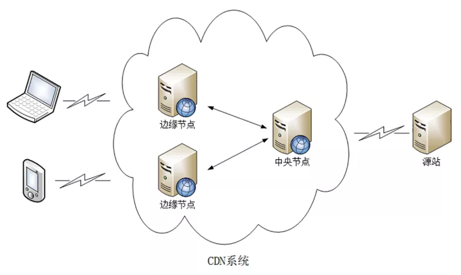
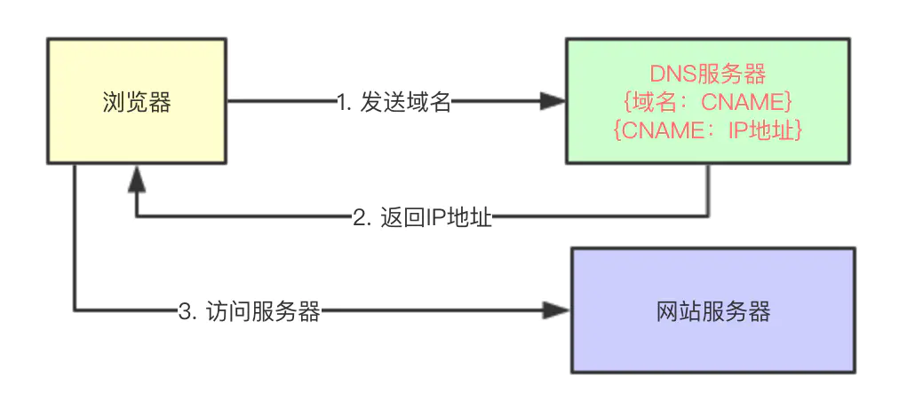
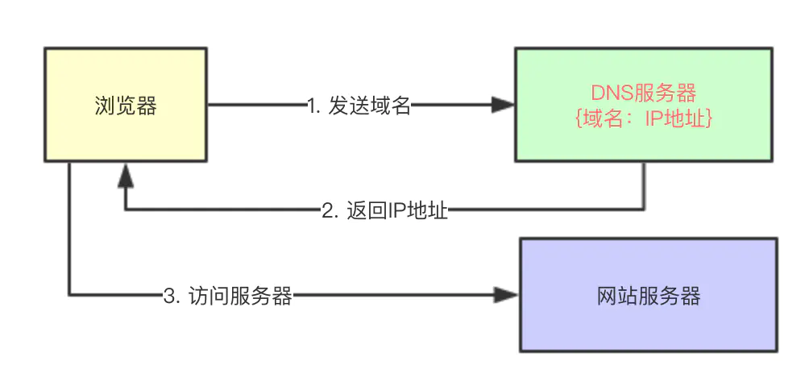
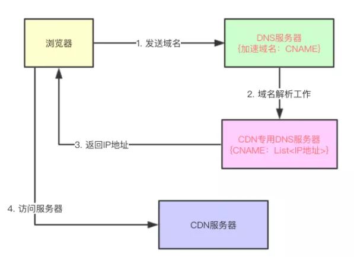

# CDN 原理简单介绍

## 1. CDN 概念

> 实际上 `CDN` 这个概念是在 `1996` 年由美国麻省理工学院的一个研究小组为`改善互联网的服务质量`而提出的。

`CDN (全称 Content Delivery Network)`，即`内容分发网络`。

构建在现有网络基础之上的智能虚拟网络，依靠部署在各地的`边缘服务器`，通过`中心平台`的负载均衡、内容分发、调度等功能模块，使用户就近获取所需内容，降低网络拥塞，提高用户访问响应速度和命中率。

简单来讲，`CDN` 就是根据用户位置分配最近的资源。

于是，用户在上网的时候不用直接访问源站，而是访问离他`“最近的”一个 CDN 节点`，术语叫`「边缘节点」`，其实就是缓存了源站内容的代理服务器。如下图：

## 2. CDN 原理分析

我们知道，当我们使用域名访问某一个网站时，实际上就是将请求包（以 `Http` 请求为例）通过网络传输给某台服务器，比如访问`“www.baidu.com”`时：

1. 首先解析出该域名所对应的 `IP` 地址(`DNS` 域名解析)；
2. 然后将 `Http` 请求包通过网络路由到 `IP` 地址所对应的服务器；

> 我们通常说“服务器的 `IP` 地址”，这其实不太准确，`IP` 地址是和网卡绑定的，一个服务器可以有多个网卡，也就是可能有多个 `IP` 地址。

> `DNS` 即 `Domain Name System`，是域名解析服务的意思。它在互联网的作用是：把域名转换成为网络可以识别的 `ip` 地址。人们习惯记忆域名，但机器间互相只认 `IP` 地址，域名与 `IP` 地址之间是一一对应的，它们之间的转换工作称为域名解析，域名解析需要由专门的域名解析服务器来完成，整个过程是自动进行的。

我们先来看第一步：域名解析。

### 2.1 域名解析

解析域名分为两种：

- 将一个域名解析为一个 `IP` 地址；
- 将一个域名解析为另外一个域名；

比如，我们在域名服务商购买了一个域名之后，需要去映射一个 `IP` 地址，可以用 `Map` 来表示这个关系：`{域名：IP}`。

同时我们也可以给某个域名取一个别名，比如`“www.baidu.com”`取一个别名`“test.baidu.com”`，这种关系也可以用 `Map` 来表示：`{域名：别名}`。这里的`别名`专业一点叫做 `CNAME( Canonical Name )`。

而`域名解析`，实际上就是解析出指定域名所对应的 `IP 地址，或者该域名的一个 CNAME。

域名解析是由 `DNS 系统`来负责的，`DNS` 服务接受外部请求，从请求里提取域名，

- 如果这个域名对应的是 `IP` 地址，则返回这个 `IP` 地址，
- 如果这个域名对应的是 `CNAME`，则继续查找 `CNAME` 域名的 `IP` 地址，然后将该地址返回给请求发送者。

请求发送者拿到 `IP` 地址之后，完成真正的请求调用。

实际上 `DNS` 系统是非常庞大的，这里不去多讲，大家把它当作一个黑盒子，这个盒子的作用就是上文所描述的，这里用一个简单的图来表示一下。

没有 `CNAME` 的情况：

有 `CNAME` 的情况：

域名解析时有多种类型的记录，最常用的比如：

- `A` 记录：一个域名对应一个 `IP` 地址；
- `CNAME`：一个域名对应另外一个域名；
- `NS`：将子域名指定其他 `DNS` 服务器解析；

**总结**

在没有应用 `CDN` 时，我们使用域名访问某一个站点时的路径为：

> 用户提交域名 → 浏览器对域名进行解释 → `DNS` 解析得到目的主机的 `IP` 地址 → 根据 `IP` 地址访问发出请求 → 得到请求数据并回复。

应用 `CDN` 后，`DNS` 返回的不再是 `IP` 地址，而是一个 `CNAME( Canonical Name )` 别名记录，指向 `CDN` 的`全局负载均衡`。

**特别注意**，`CNAME` 实际上在`域名解析`的过程中承担了`中间人（或者说代理）`的角色，这是 `CDN` 实现的关键。

而实现 `CDN` 的关键技术主要有`内容存储`和`分发技术`。下面分别做下简单介绍。

### 2.2 负载均衡系统

由于没有返回 `IP` 地址，于是本地 `DNS` 会向`负载均衡系统`再发送请求 ，则进入到 `CDN` 的`全局负载均衡系统`进行智能调度：

- 看用户的 `IP` 地址，查表得知地理位置，找相对最近的边缘节点；
- 看用户所在的运营商网络，找相同网络的边缘节点；
- 检查边缘节点的负载情况，找负载较轻的节点；
- 其他，比如节点的“健康状况”、服务能力、带宽、响应时间等；

结合上面的因素，得到最合适的`边缘节点`，然后把这个节点返回给用户，用户就能够就近访问 `CDN` 的缓存代理。
整体流程如下图：

### 2.3 缓存代理

缓存系统是 `CDN` 的另一个关键组成部分，缓存系统会有选择地缓存那些最常用的那些资源。

其中有两个`衡量 CDN 服务质量`的指标：

- 命中率：用户访问的资源恰好在缓存系统里，可以直接返回给用户，命中次数与所有访问次数之比；
- 回源率：缓存里没有，必须用代理的方式回源站取，回源次数与所有访问次数之比；

缓存系统也可以划分出层次，分成`一级缓存节点`和`二级缓存节点`。

一级缓存配置高一些，直连源站。二级缓存配置低一些，直连用户。
回源的时候二级缓存只找一级缓存，一级缓存没有才回源站，可以有效地减少真正的回源。

现在的商业 `CDN` 命中率都在 `90%` 以上，相当于把源站的服务能力放大了 `10` 倍以上。
也就是 `10` 次请求，至少 `9` 次走的都是缓存，相当于不到一次的请求走到源服务器。

## 3. CDN 优缺点

### 3.1 优点

- 实现跨运营商、跨地域的全网覆盖
  互联不互通、区域 `ISP` 地域局限、出口带宽受限制等种种因素都造成了网站的区域性无法访问。`CDN` 加速可以覆盖全球的线路，通过和运营商合作，部署 `IDC` 资源，在全国骨干节点商，合理部署 `CDN` 边缘分发存储节点，充分利用带宽资源，平衡源站流量。

- 保障网站安全
  `CDN` 的负载均衡和分布式存储技术，可以加强网站的可靠性，相当无无形中给你的网站添加了一把保护伞，应对绝大部分的互联网攻击事件。防攻击系统也能避免网站遭到恶意攻击。

- 异地备援
  当某个服务器发生意外故障时，系统将会调用其他临近的健康服务器节点进行服务，进而提供接近 `100%` 的可靠性，这就让你的网站可以做到永不宕机。

- 为了节约成本
  投入使用 `CDN` 加速可以实现网站的全国铺设，不用考虑购买服务器与后续的托管运维，服务器之间镜像同步，也不用为了管理维护技术人员而烦恼，节省了人力、精力和财力。

- 更专注业务本身
  `CDN` 加速厂商一般都会提供一站式服务，业务不仅限于 `CDN`，还有配套的云存储、大数据服务、视频云服务等，而且一般会提供 `7x24` 运维监控支持，保证网络随时畅通，你可以放心使用。并且将更多的精力投入到发展自身的核心业务之上。

### 3.2 缺点

- 搭建基础设施，需要更多的费用成本，且实现也非常复杂，是一个庞大的工程。
- 对开发者影响：有时源服务器文件已修改，但是通过浏览器（不清理浏览器缓存）依然看到的是未更新的文件。

避免 `CDN` 文件缓存的方法：

- 在静态资源 `URL` 链接后加动态参数；
- `CDN` 后台刷新链接：在后台更新目标 `URL`(`CDN` 服务商提供刷新接口)；
- 域名绑定 `hosts` 到源服务器 `IP`，绕过 `CDN`。

## 4. 题外

其实，`CDN` 本身就是一种 `DNS` 劫持，只不过是良性的。
不同于黑客强制 `DNS` 把域名解析到自己的钓鱼 `IP` 上，`CDN` 则是让 `DNS` 主动配合，把域名解析到临近的服务器上。

劫持通常分为两类：

- 域名劫持，又称 `DNS` 劫持。
  通常是指域名指向到`非正常 IP（恶意 IP）`，该`恶意 IP` 通过反向代理的方式，在能返回网页正常内容的情况，可能插入恶意代码、监听网民访问、劫持敏感信息等操作。通常验证一个域名是否被劫持的方法是 `PING` 一个域名，如果发现 `PING` 出来的 `IP` 不是您的服务器真实 `IP`，则可以确定被劫持了（当然如果使用了知道创宇云安全等安全加速平台，得到的 `IP` 为平台 `IP`，并非劫持）。

- 数据劫持。
  通常由电信运营商中某些员工等勾结犯罪分子，在公网中进行数据支持，插入，此类情况极隐蔽，不会改变用户域名解析 `IP`，而是直接数据流经运营商宽带时在网页中挺入内容，此类情况，建议网页启用 `HTTPS` 加密，可以解决这一问题（通信是加密的，运营商无法插入恶意内容）。

## 5. 总结

`CDN` 目的是为了改善互联网的服务质量，通俗一点说其实就是提高访问速度。

`CDN` 构建了全国、全球级别的专网，让用户就近访问专网里的边缘节点，降低了传输延迟，实现了网站加速。

通过 `CDN` 的`负载均衡系统`，智能调度边缘节点提供服务，相当于 `CDN` 服务的`大脑`。
而`缓存系统`相当于 `CDN` 的`心脏`，缓存命中直接返回给用户，否则回源。

服务器上的资源分为两种：静态资源与动态资源。

- 静态资源：这种资源通常是很少变动的，比如图片，视频，`css`，`javascript` 等；
- 动态资源：这种资源不同用户不同时刻访问通常是不一样的，比如 `xhr 请求` 等；

静态资源通常不涉及到数据库，成本也比较低，而且也能提高用户的访问速度，所以一般 `CDN` 节点部署的都是静态资源。

## 6. 参考

- [面试官：如何理解 CDN？说说实现原理？](https://mp.weixin.qq.com/s/MDdSL1GmpM2Mls5cuaYX1g)
- [程序员要搞明白 CDN，这篇应该够了](https://juejin.cn/post/6844903890706661389#heading-5)
- [CDN 原理简单介绍](https://zhuanlan.zhihu.com/p/113037678)
- [一文读懂 CDN 和 CDN 实现的原理](https://blog.csdn.net/lxx309707872/article/details/109078783)
