# 理解浏览器的缓存机制

## 1. 前言

缓存可以说是性能优化中简单高效的一种优化方式了。
一个优秀的缓存策略可以缩短网页请求资源的距离，减少延迟，并且由于缓存文件可以重复利用，还可以减少带宽，降低网络负荷。

对于一个数据请求来说，可以分为发起网络请求、服务端处理、浏览器响应三个步骤。
浏览器缓存可以帮助我们在第一和第三步骤中优化性能。
比如说直接使用缓存而不发起请求，或者发起了请求但服务端存储的数据和前端一致，那么就没有必要再将数据回传回来，这样就减少了响应数据。

接下来的内容中我们将通过`缓存位置`、`缓存策略`以及`实际场景应用缓存策略`等方面来探讨浏览器缓存机制。

## 2. 缓存位置

从缓存位置上来说分为四种，并且各自有优先级，当依次查找缓存且都没有命中的时候，才会去请求网络。

- `Service Worker`
- `Memory Cache`
- `Disk Cache`
- `Push Cache`

### 2.1 Service Worker

`Service Worker` 是运行在浏览器背后的`独立线程`，一般可以用来实现缓存功能。

使用 `Service Worker` 的话，传输协议必须为 `HTTPS`。
因为 `Service Worker` 中涉及到请求拦截，所以必须使用 `HTTPS` 协议来保障安全。

`Service Worker` 的缓存与浏览器其他内建的缓存机制不同，它可以让我们`自由控制`缓存哪些文件、如何匹配缓存、如何读取缓存，并且缓存是持续性的。

`Service Worker` 实现缓存功能一般分为三个步骤：

1. 首先需要先注册 `Service Worker`；
2. 然后监听到 `install` 事件以后就可以缓存需要的文件；
3. 那么在下次用户访问的时候就可以通过`拦截请求`的方式查询是否存在缓存，存在缓存的话就可以直接读取缓存文件，否则就去请求数据。

当 `Service Worker` 没有命中缓存的时候，我们需要去调用 `fetch` 函数获取数据。
也就是说，如果我们没有在 `Service Worker` 命中缓存的话，会根据`缓存查找优先级`去查找数据。

但是不管我们是从 `Memory Cache` 中还是从网络请求中获取的数据，浏览器都会显示我们是从 `Service Worker` 中获取的内容。

### 2.2 Memory Cache

`Memory Cache` 也就是内存中的缓存，主要包含的是当前页面中已经抓取到的资源，例如页面上已经下载的样式、脚本、图片等。

读取内存中的数据肯定比磁盘快，内存缓存虽然读取高效，可是缓存持续性很短，会随着进程的释放而释放。
一旦我们关闭 `Tab` 页面，内存中的缓存也就被释放了。

那么既然内存缓存这么高效，我们是不是能让数据都存放在内存中呢？这是不可能的。
计算机中的内存一定比硬盘容量小得多，操作系统需要精打细算内存的使用，所以能让我们使用的内存必然不多。

当我们访问过页面以后，再次刷新页面，可以发现很多数据都来自于内存缓存：

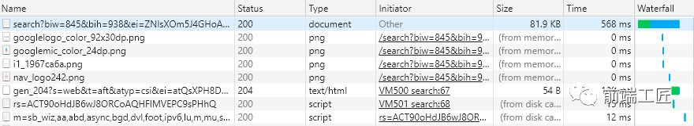

内存缓存中有一块重要的缓存资源是 `preloader 相关指令（例如 <linkrel="prefetch">）下载`的资源。
众所周知 `preloader` 的相关指令已经是`页面优化`的常见手段之一，它可以一边解析 `js/css` 文件，一边网络请求下一个资源。

需要注意的事情是，内存缓存在缓存资源时`并不关心`返回资源的 `HTTP 缓存头 Cache-Control` 是什么值，同时资源的匹配也`并非仅仅是对 URL 做匹配`，还可能会对 `Content-Type`，`CORS` 等其他特征做校验。

### 2.3 Disk Cache

`Disk Cache` 也就是存储在硬盘中的缓存，读取速度慢点，但是什么都能存储到磁盘中，比之 `Memory Cache` 胜在`容量`和`存储时效性`上。

在所有浏览器缓存中，`Disk Cache` 覆盖面基本是最大的。
它会根据 `HTTP Herder` 中的字段判断哪些资源需要缓存，哪些资源可以不请求直接使用，哪些资源已经过期需要重新请求。
并且即使在`跨站点`的情况下，相同地址的资源一旦被硬盘缓存下来，就不会再次去请求数据。

绝大部分的缓存都来自 `Disk Cache`，关于 `HTTP 的协议头`中的缓存字段，我们会在`下文`进行详细介绍。

浏览器会把哪些文件丢进内存中？哪些丢进硬盘中？关于这点，与浏览器实现机制有关，所以并没有确定说法，不过以下观点比较靠得住：

- 对于大文件来说，大概率是不存储在内存中的，反之优先；
- 当前系统内存使用率高的话，文件优先存储进硬盘；

### 2.4 Push Cache

`Push Cache（推送缓存）`是 `HTTP/2` 中的内容，当以上三种缓存都没有命中时，它才会被使用。

它只在`会话（Session）`中存在，一旦会话结束就被释放，并且缓存时间也很短暂，在 `Chrome` 浏览器中只有 `5` 分钟左右，同时它也`并非严格执行` `HTTP` 头中的缓存指令。

下图为理想中整体请求流程：

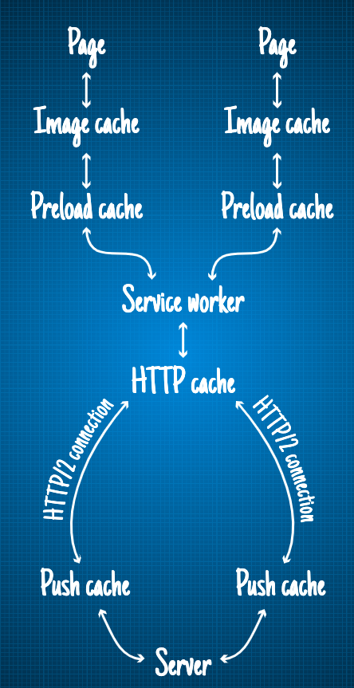

**传统的 Web 请求与解析的过程一般是这样的：**

1. 请求并接收 index.html；
2. `parse html` 文件，发现有一大票的依赖，包含 `stylesheet`、`js file`、`image` 等；
3. 对依赖文件发送请求，并苦苦等待；
4. 获取所有依赖，完成 `parse` 过程；

**（理想中的） HTTP push 可以很好的解决这一问题：**

1. 请求 `index.html` 并从服务器接收 `index.html` 并附带上了一大堆不知道干什么用的文件；
2. `parse html` 文件并惊喜的发现需要的依赖都已经包含在那一堆杂物里头了；
3. 完成 `parse` 过程；

但是理想终归是理想，现实中 `HTTP/2 push` 是否真如此美好呢？这里仅列一些实际的情况。

- 多浏览器测试：
  `Edge` 和 `Safari` 浏览器支持相对比较差，并且仅有 `chrome` 提供了开发工具。

- `push cache` 仅在 `http` 连接关闭前有效：
  一旦 `http` 连接被关闭，`Push Cache` 就被释放。

  `push cache` 是在 `http cache` 之上的，只有当浏览器请求 `push cache` 中的对应资源时，其才会从 `push cache` 中被取出，经过 `http cache`、`service worker` 等，最终到达 `page`。
  可能出现的情况是，当 `server` 成功 `push` 了一堆资源，浏览器却在请求对应依赖前关闭了该 `http` 连接，从而导致需要重新建立 `http` 连接。

- `non credentials` 请求会建立独立的连接：

  当使用 `cookie`、`HTTP basic auth` 等方法时，你建立的连接实际上是一个 `credentialed` 的连接。
  为了保证隐私性，浏览器会对 `non-credentialed` 的连接建立独立的连接。

  这也意味着，`credentialed` 和 `non-credentialed` 的连接无法使用同一份 `push cache`。
  例如，当使用 `credentialed` 的连接获取了 `page` 后， `non-credentialed` 的连接无法从对应的 `push cache` 中获取资源。

- 多个页面可以使用同一个 `HTTP/2` 的连接，也就可以使用同一个 `Push Cache`:

  这主要还是依赖浏览器的实现而定，出于对性能的考虑，有的浏览器会对相同域名但不同的 `tab` 标签使用同一个 `HTTP` 连接。

- `Push Cache` 中的缓存只能被使用一次：

  当浏览器从 `push cache` 中获取了资源时，其将从 `push cache` 中进行删除。

## 3. 缓存过程分析

浏览器与服务器通信的方式为`应答模式`，即是：`浏览器发起 HTTP 请求 –> 服务器响应该请求`。

那么浏览器怎么确定一个资源该不该缓存，如何去缓存呢？
浏览器第一次向服务器发起该请求后拿到请求结果后，将`请求结果`和`缓存标识`存入浏览器缓存，浏览器对于缓存的处理是根据`第一次请求`资源时返回的`响应头`来确定的。
具体过程如下图：

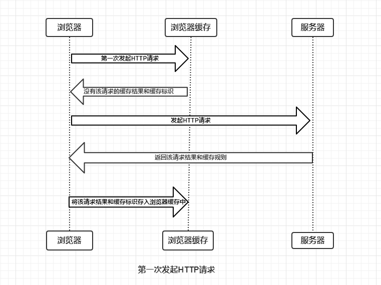

由上图我们可以知道：

- 浏览器每次发起请求，都会先在浏览器缓存中查找该请求的结果以及缓存标识；
- 浏览器每次拿到返回的请求结果都会将该结果和缓存标识存入浏览器缓存中；

以上两点结论就是浏览器缓存机制的关键，它确保了每个请求的缓存存入与读取。
只要我们再理解浏览器缓存的使用规则，那么所有的问题就迎刃而解了，本文也将围绕着这点进行详细分析。

为了方便大家理解，这里我们根据是否需要向服务器重新发起 `HTTP` 请求将缓存过程分为两个部分，分别是`强制缓存`和`协商缓存`。

### 3.1 强制缓存

强制缓存就是向浏览器缓存查找该请求结果，并根据该结果的缓存规则来决定是否使用该缓存结果的过程，强制缓存的情况主要有以下三种。

1. `不存在该缓存结果和缓存标识`，强制缓存失效，则直接向服务器发起请求（跟第一次发起请求一致），如下图：

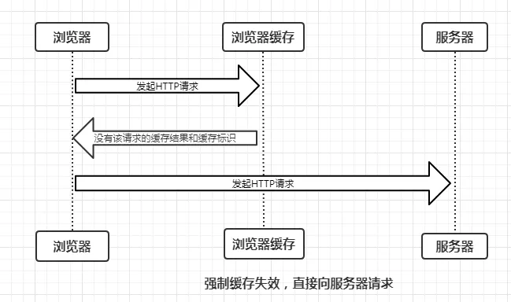

2. 存在该缓存结果和缓存标识，但`该结果已失效`，强制缓存失效，则使用协商缓存(暂不分析)，如下图：

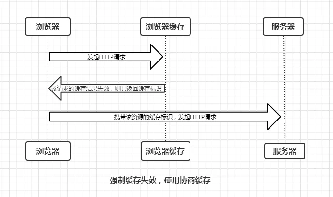

3. 存在该缓存结果和缓存标识，且该结果尚未失效，`强制缓存生效`，直接返回该结果，如下图：

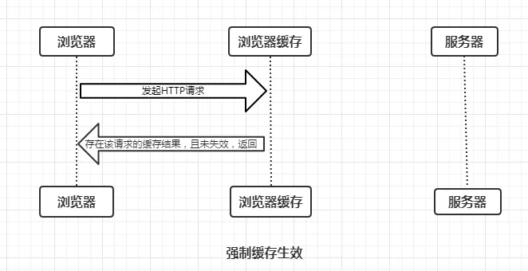

我们发现，`强制缓存`：不会向服务器发送请求，直接从缓存中读取资源，在 `chrome` 控制台的 `Network` 选项中可以看到该请求返回 `200 的状态码`，并且 `Size` 显示 `from disk cache` 或 `from memory cache`。

> 那么强制缓存的缓存规则是什么？

强制缓存可以通过设置两种 `HTTP Header` 实现：`Expires` 和 `Cache-Control`。
当浏览器向服务器发起请求时，服务器会将`缓存规则`放入 `HTTP 响应报文`的 `HTTP 头`中和请求结果一起返回给浏览器，控制强制缓存的字段分别是 `Expires` 和 `Cache-Control`，其中 `Cache-Control` 优先级比 `Expires` 高。

#### 3.1.1 Expires

> `Expires` 是 `HTTP/1.0` 控制网页缓存的字段，其值为服务器返回该请求结果`缓存的到期时间`，即再次发起该请求时，如果`客户端的时间`小于 `Expires` 的值时，直接使用缓存结果。

`Expires` 即缓存过期时间，用来指定资源到期的时间，是服务器端的具体的时间点。
也就是说，`Expires=max-age + 请求时间`，需要和 `Last-modified` 结合使用。

> `Expires` 是 `HTTP/1.0` 的字段，但是现在浏览器`默认`使用的是 `HTTP/1.1`，那么在 `HTTP/1.1` 中网页缓存还是否由 `Expires` 控制？

到了 `HTTP/1.1`，`Expire` 已经被 `Cache-Control` 替代，原因在于 `Expires` 控制缓存的原理是使用客户端的时间与服务端返回的时间做对比，那么如果客户端与服务端的时间因为某些原因（例如时区不同；客户端和服务端有一方的时间不准确）发生误差，那么强制缓存则会直接失效，这样的话强制缓存的存在则毫无意义，那么 `Cache-Control` 又是如何控制的呢？

#### 3.1.2 Cache-Control

在 `HTTP/1.1` 中，`Cache-Control` 是最重要的规则，主要用于`控制网页缓存`。
比如当 `Cache-Control:max-age=300` 时，则代表在这个请求正确返回时间（浏览器也会记录下来）的 `5` 分钟内再次加载资源，就会命中强缓存。

`Cache-Control` 主要取值为：

| 指令         | 作用                                                     |
| ------------ | -------------------------------------------------------- |
| `public`       | 表示响应可以被客户端和代理服务器缓存                     |
| `private`      | 表示响应只可以被客户端缓存                               |
| `max-age=30`   | 缓存 30 秒后就过期，需要重新请求                         |
| `s-maxage=30`  | 覆盖 max-age，作用一样，只在代理服务器中生效             |
| `no-store`     | 不缓存任何响应                                           |
| `no-cache`     | 资源被缓存，但是立即失效，下次会发起请求验证资源是否过期 |
| `max-stale=30` | 30 秒内，即时缓存过期，也使用该缓存                      |
| `min-fresh=30` | 希望 30 秒内获取最新的响应                               |

- `public`:

  所有内容都将被缓存（客户端和代理服务器都可缓存）。

  具体来说响应可被任何中间节点缓存，如 `Browser <-- proxy1 <-- proxy2 <-- Server`，中间的 `proxy` 可以缓存资源，比如下次再请求同一资源 `proxy1` 直接把自己缓存的东西给 `Browser` 而不再向 `proxy2` 要。

- `private`:

  所有内容只有客户端可以缓存，`Cache-Control` 的`默认取值`。

  具体来说，表示`中间节点不允许缓存`，对于 `Browser <-- proxy1 <-- proxy2 <-- Server`，`proxy` 会老老实实把 `Server` 返回的数据发送给 `proxy1`，自己不缓存任何数据。
  当下次 `Browser` 再次请求时 `proxy` 会做好请求转发而不是自作主张给自己缓存的数据。

- `no-cache`:

  客户端缓存内容，是否使用缓存则需要经过协商缓存来验证决定。

  表示不使用 `Cache-Control` 的缓存控制方式做前置验证，而是使用 `Etag` 或者 `Last-Modified` 字段来控制缓存。

  需要注意的是，`no-cache` 这个名字有一点误导。
  设置了 `no-cache` 之后，并不是说浏览器就不再缓存数据，只是浏览器在使用缓存数据时，需要先确认一下数据是否还跟服务器保持一致。

- `no-store`:

  所有内容都不会被缓存，即不使用强制缓存，也不使用协商缓存。

- `max-age`:

  `max-age=xxx (xxx is numeric)` 表示缓存内容将在 `xxx` 秒后失效。

- `s-maxage`(单位为 `s`)：

  同 `max-age` 作用一样，只在代理服务器中生效（比如 `CDN` 缓存）。

  比如当 `s-maxage=60` 时，在这 `60` 秒中，即使更新了 `CDN` 的内容，浏览器也不会进行请求。
  `max-age` 用于普通缓存，而 `s-maxage` 用于代理缓存。
  `s-maxage` 的优先级高于 `max-age`。如果存在 `s-maxage`，则会覆盖掉 `max-age` 和 `Expires header`。

- `max-stale`:

  能容忍的最大过期时间。

  `max-stale` 指令标示了客户端愿意接收一个已经过期了的响应。
  如果指定了 `max-stale` 的值，则最大容忍时间为对应的秒数。
  如果没有指定，那么说明浏览器愿意接收任何 `age` 的响应（`age` 表示响应由源站生成或确认的时间与当前时间的差值）。

- `min-fresh`:

  能够容忍的最小新鲜度。

  `min-fresh` 标示了客户端不愿意接受新鲜度不多于当前的 `age` 加上 `min-fresh` 设定的时间之和的响应。

`Cache-Control` 可以在请求头或者响应头中设置，并且可以`组合使用`多种指令：

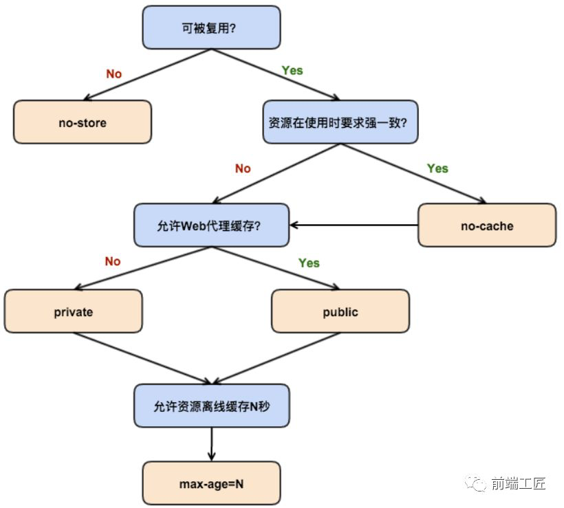

从图中我们可以看到，我们可以将多个指令配合起来一起使用，达到多个目的。
比如说我们希望资源能被缓存下来，并且是客户端和代理服务器都能缓存，还能设置缓存失效时间等等。

#### 3.1.3 拓展思考

浏览器的缓存存放在哪里，如何在浏览器中判断强制缓存是否生效？如下图：

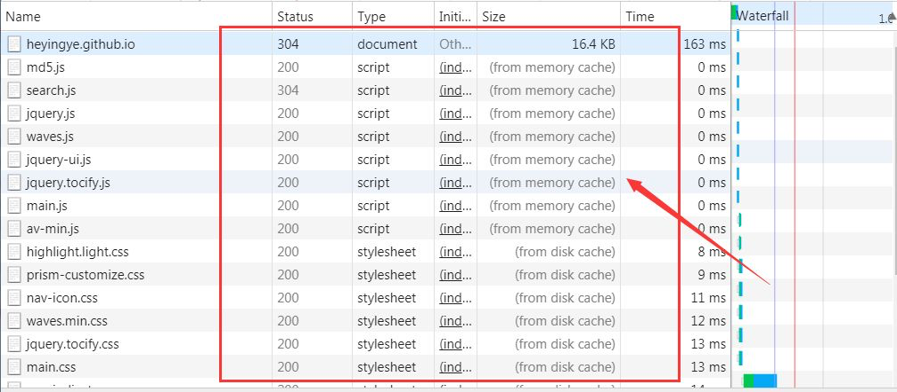

我们发现，`状态码为灰色`的请求则代表`使用了强制缓存`，请求对应的 `Size` 值则代表`该缓存存放的位置`，分别为 `from memory cache` 和 `from disk cache`。

> 那么 `from memory cache` 和 `from disk cache` 又分别代表的是什么呢？什么时候会使用 `from disk cache`，什么时候会使用 `from memory cache` 呢？

`from memory cache` 代表使用内存中的缓存，`from disk cache` 则代表使用的是硬盘中的缓存，浏览器读取缓存的顺序为 `memory –> disk`。
分别有以下特点：

- `内存缓存(from memory cache)`:

  内存缓存具有两个特点，分别是快速读取和时效性：
  - 快速读取：内存缓存会将编译解析后的文件，直接存入该进程的内存中，占据该进程一定的内存资源，以方便下次运行使用时的快速读取。
  - 时效性：一旦该进程关闭，则该进程的内存则会清空。

- `硬盘缓存(from disk cache)`:

  硬盘缓存则是直接将缓存写入硬盘文件中，读取缓存需要对该缓存存放的硬盘文件进行 I/O 操作，然后重新解析该缓存内容，读取复杂，速度比内存缓存慢。

#### 3.1.4 Expires 和 Cache-Control 两者对比

形式上有以下特点：

- `HTTP` 响应报文中 `expires` 的时间值，是一个`绝对值`；
- `HTTP` 响应报文中 `Cache-Control` 为 `max-age=600`，是`相对值`；

其实这两者差别不大，区别就在于 `Expires` 是 `http1.0` 的产物，`Cache-Control` 是 `http1.1` `的产物，两者同时存在的话，Cache-Control` 优先级高于 `Expires`；

在某些不支持 `HTTP1.1` 的环境下，`Expires` 就会发挥用处。
所以 `Expires` 其实是过时的产物，现阶段它的存在只是一种兼容性的写法。

> 综上：在无法确定客户端的时间是否与服务端的时间同步的情况下，`Cache-Control` 相比于 `expires` 是更好的选择，若同时存在时，只有 `Cache-Control` 生效。

强制缓存判断是否缓存的`依据`来自于`是否超出某个时间或者某个时间段`，而不关心服务器端文件是否已经更新。
这可能会导致加载文件`不是`服务器端`最新的内容`，那我们如何获知服务器端内容是否已经发生了更新呢？
此时我们需要用到`协商缓存策略`。

## 4. 协商缓存

协商缓存就是强制缓存失效后，浏览器`携带缓存标识`向服务器发起请求，由服务器根据缓存标识决定是否使用缓存的过程，主要有以下两种情况：

1. 协商缓存生效，返回 `304`，如下：


2. 协商缓存失效，返回 `200` 和请求结果结果，如下：

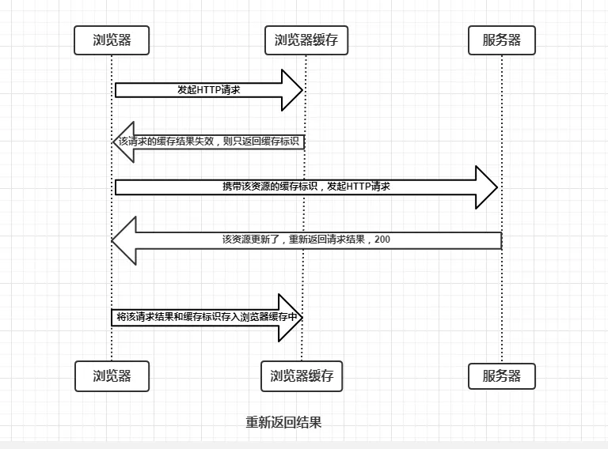

同样，`协商缓存的标识`也是在`响应报文的 HTTP 头`中和请求结果一起返回给浏览器的，协商缓存可以通过设置两种 `HTTP Header` 实现，分别有：`Last-Modified / If-Modified-Since` 和 `Etag / If-None-Match`，其中 `Etag / If-None-Match` 的优先级比 `Last-Modified / If-Modified-Since` 高。

### 4.1 Last-Modified / If-Modified-Since

`Last-Modified` 是服务器响应请求时，返回该资源文件在服务器最后被修改的时间。

`If-Modified-Since` 则是客户端再次发起该请求时，携带上次请求返回的 `Last-Modified` 值，通过此字段值告诉服务器该资源上次请求返回的最后被修改时间。
服务器收到该请求，发现请求头含有 `If-Modified-Since` 字段，则会根据 `If-Modified-Since` 的字段值与该资源在服务器的最后被修改时间做对比，若服务器的资源最后被修改时间大于 `If-Modified-Since` 的字段值，则重新返回资源，状态码为 `200`；否则则返回 `304`，代表资源无更新，可继续使用缓存文件。

两者关系见下图：

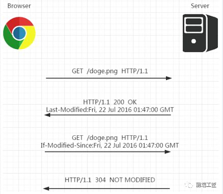

但 `Last-Modified` 存在一些弊端：

- 如果本地打开缓存文件，即使没有对文件进行修改，但还是会造成 `Last-Modified` 被修改，服务端不能命中缓存导致发送相同的资源；
- 因为 `Last-Modified` 只能以秒计时，如果在`不可感知的时间内`修改完成文件，那么服务端会认为资源还是命中了，不会返回正确的资源；

既然根据`文件修改时间`来决定是否缓存尚有不足，能否可以直接根据`文件内容是否修改`来决定缓存策略？
所以在 `HTTP/1.1` 出现了 `ETag` 和 `If-None-Match`。

### 4.2 ETag 和 If-None-Match

`Etag` 是服务器响应请求时，返回当`前资源文件的一个唯一标识(由服务器生成)`。

`If-None-Match` 是客户端再次发起该请求时，携带上次请求返回的唯一标识 `Etag` 值，通过此字段值告诉服务器该资源上次请求返回的唯一标识值。
服务器收到该请求后，发现该请求头中含有 `If-None-Match`，则会根据 `If-None-Match` 的字段值与该资源在服务器的 `Etag` 值做对比，一致则返回 `304`，代表资源无更新，继续使用缓存文件；不一致则重新返回资源文件，状态码为 `200`。

两者关系见下图：

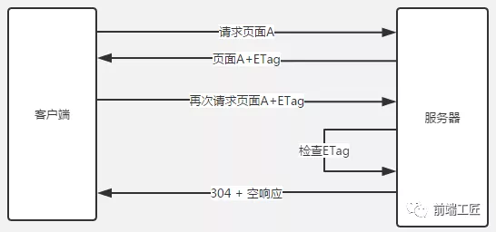

### 4.3 两者对比

- 首先在`精确度`上，`Etag` 要优于 `Last-Modified`。

  `Last-Modified` 的时间单位是`秒`，如果某个文件在 1 秒内改变了多次，那么他们的 `Last-Modified` 其实并没有体现出来修改，但是 `Etag` 每次都会改变确保了精度；
  如果是负载均衡的服务器，各个服务器生成的 `Last-Modified` 也有可能不一致。

- 第二在`性能`上，`Etag` 要逊于 `Last-Modified`，毕竟 `Last-Modified` 只需要记录时间，而 `Etag` 需要服务器通过算法来计算出一个 `hash` 值。

- 第三在`优先级`上，服务器校验优先考虑 `Etag`。

> 注：`Etag / If-None-Match` 优先级高于 `Last-Modified / If-Modified-Since`，同时存在则只有 `Etag / If-None-Match` 生效。

## 5. 缓存机制

`强制缓存`优先于`协商缓存`进行，若`强制缓存(Expires 和 Cache-Control)生效`则直接使用缓存，若不生效则进行`协商缓存(Last-Modified / If-Modified-Since 和 Etag / If-None-Match)`。
协商缓存由服务器决定是否使用缓存，若协商缓存失效，那么代表该请求的缓存失效，返回 `200`，重新返回资源和缓存标识，再存入浏览器缓存中；生效则返回 `304`，继续使用缓存。
具体流程图如下：

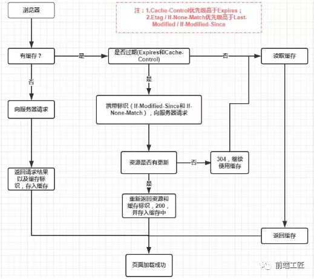

> 拓展：
> 看到这里，不知道你是否存在这样一个疑问：如果什么缓存策略都没设置，那么浏览器会怎么处理？
>
> 对于这种情况，浏览器会采用一个启发式的算法，通常会取响应头中的 `Date` 减去 `Last-Modified` 值的 `10%` 作为`缓存时间`。

## 6. 实际场景应用缓存策略

### 6.1 频繁变动的资源

```
Cache-Control: no-cache
```

对于频繁变动的资源，首先需要使用 `Cache-Control: no-cache` 使浏览器每次都请求服务器，然后配合 `ETag` 或者 `Last-Modified` 来验证资源是否有效。
这样的做法虽然不能节省请求数量，但是能显著减少响应数据大小。

### 6.2 不常变化的资源

```
Cache-Control: max-age=31536000
```

通常在处理这类资源时，给它们的 `Cache-Control` 配置一个很大的 `max-age=31536000 (一年)`，这样浏览器之后请求相同的 URL 会命中强制缓存。

而为了解决`更新`的问题，就需要在文件名(或者路径)中添加 `hash`， 版本号等`动态字符`，之后更改动态字符，从而达到`更改引用 URL` 的目的，让之前的强制缓存失效 (其实并未立即失效，只是不再使用了而已)。

在线提供的类库 (如 `jquery-3.3.1.min.js`, `lodash.min.js` 等) 均采用这个模式。

### 7. 用户行为对浏览器缓存的影响

所谓用户行为对浏览器缓存的影响，指的就是用户在浏览器如何操作时，会`触发怎样的缓存策略`。
主要有 `3` 种：

- 打开网页，地址栏输入地址：

  查找 `disk cache` 中是否有匹配。如有则使用；如没有则发送网络请求。

- 普通刷新 (`F5`)：

  因为 `TAB` 并没有关闭，因此 `memory cache` 是可用的，会被优先使用(如果匹配的话)。其次才是 `disk cache`。

- 强制刷新 (`Ctrl + F5`)：

  浏览器不使用缓存，因此发送的请求头部均带有 `Cache-control: no-cache(为了兼容，还带了 Pragma: no-cache)`，服务器直接返回 `200` 和最新内容。

## 8. 参考

> 前文提到的 `HTTP` 请求中的 `ETag` 是如何生成的呢？[详见这里](../20210603_HTTP中的ETag是如何生成的/index.md)。

- [彻底理解浏览器的缓存机制](https://mp.weixin.qq.com/s/d2zeGhUptGUGJpB5xHQbOA)
- [深入理解浏览器的缓存机制](https://mp.weixin.qq.com/s/A93VNkEKTVb982knhVN4eQ)
- [HTTP/2 push is tougher than I thought](https://jakearchibald.com/2017/h2-push-tougher-than-i-thought/)
- [阅读理解：HTTP/2 push is tougher than I thought](https://blog.csdn.net/qq_35368183/article/details/82961573)
