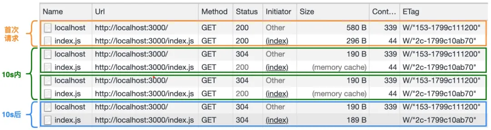
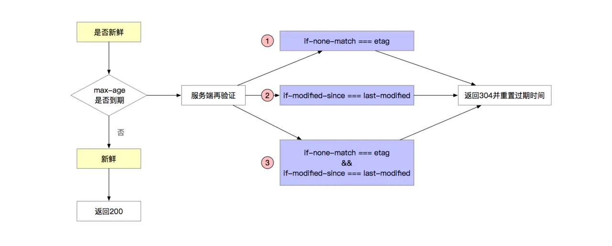

# HTTP 中的 ETag 是如何生成的？

## 1. 前言

之前介绍了[浏览器缓存机制](../20210601_理解浏览器的缓存机制/index.md)。
本文将介绍如何利用 `ETag` 和 `If-None-Match` 来实现缓存控制。
此外，还将介绍 HTTP 中的 `ETag` 是如何生成的。

## 2. ETag 简介

### 2.1 ETag 是什么

`ETag（Entity Tag）`是万维网协议 `HTTP` 的一部分。
它是 `HTTP` 协议提供的若干机制中的一种 `Web 缓存验证机制`，并且允许客户端进行缓存协商。
这使得缓存变得更加高效，而且节省带宽。
如果资源的内容没有发生改变，`Web` 服务器就不需要发送一个完整的响应。

### 2.2 ETag 的作用

`ETag` 是一个不透明的标识符，由 `Web` 服务器根据 `URL` 上的资源的特定版本而指定。
如果 `URL` 上的资源内容改变，一个新的不一样的 `ETag` 就会被生成。
`ETag` 可以看成是资源的指纹，它们能够被快速地比较，以确定两个版本的资源是否相同。

> 需要注意的是 `ETag` 的比较只对同一个 `URL` 有意义 ———— 不同 `URL` 上资源的 `ETag` 值可能相同也可能不同，具体以 `Web` 服务器实现而定。

### 2.3 ETag 的语法

```
ETag: W/"<etag_value>"
ETag: "<etag_value>"
```

- `W/(可选)`：`'W/'（大小写敏感）` 表示使用弱验证器。

  弱验证器很容易生成，但不利于比较。
  强验证器是比较的理想选择，但很难有效地生成。
  相同资源的两个弱 `Etag` 值可能语义等同，但不是每个字节都相同。

- `"<etag_value>"`：实体标签唯一地表示所请求的资源。

  它们是位于双引号之间的 `ASCII` 字符串（如 “2c-1799c10ab70” ）。
  没有明确指定生成 `ETag` 值的方法。
  通常是使用内容的散列、最后修改时间戳的哈希值或简单地使用版本号。比如，`MDN` 使用 `wiki` 内容的十六进制数字的哈希值。

### 2.4 ETag 的使用

在大多数场景下，当一个 `URL` 被请求，`Web` 服务器会返回资源和其相应的 `ETag` 值，它会被放置在 `HTTP` 响应头的 `ETag` 字段中：

```
HTTP/1.1 200 OK
Content-Length: 44
Cache-Control: max-age=10
Content-Type: application/javascript; charset=utf-8
ETag: W/"2c-1799c10ab70"
```

然后，客户端可以决定是否缓存这个资源和它的 `ETag`。
以后，如果客户端想再次请求相同的 URL，将会发送一个包含已保存的 `ETag` 和 `If-None-Match` 字段的请求：

```
GET /index.js HTTP/1.1
Host: localhost:3000
Connection: keep-alive
If-None-Match: W/"2c-1799c10ab70"
```

客户端请求之后，服务器可能会比较客户端的 `ETag` 和当前版本资源的 `ETag`。
如果 ETag 值匹配，这就意味着资源没有改变，服务器便会发送回一个极短的响应，包含 HTTP `“304 未修改”` 的状态。
304 状态码告诉客户端，它的缓存版本是最新的，可以直接使用它：

```
HTTP/1.1 304 Not Modified
Cache-Control: max-age=10
ETag: W/"2c-1799c10ab70"
Connection: keep-alive
```

## 3. ETag 实战

### 3.1 创建 Koa 服务器

接下来我们将基于 `koa`、`koa-conditional-get`、`koa-etag` 和 `koa-static` 这些库来介绍一下，在实际项目中如何利用 `ETag` 响应头和 `If-None-Match` 请求头实现资源的缓存控制。

```json
// package.json

{
    "scripts": {
        "start": "node server.js"
    },
    "dependencies": {
        "koa": "^2.13.1",
        "koa-conditional-get": "^3.0.0",
        "koa-etag": "^4.0.0",
        "koa-static": "^5.0.0"
    },
    "devDependencies": {
        "nodemon": "^2.0.7"
    }
}
```

```js
// server.js

const path = require('node:path');

const Koa = require('koa');
const conditional = require('koa-conditional-get');
const etag = require('koa-etag');
const koaStatic = require('koa-static');

const app = new Koa();

app.use(conditional()); // 使用条件请求中间件
app.use(etag()); // 使用etag中间件
app.use(
    // 使用静态资源中间件
    koaStatic(path.join(__dirname, '/public'), {
        maxage: 10 * 1000, // 设置缓存存储的最大周期，单位为秒
    })
);

app.listen(3000, () => {
    console.log('app starting at port 3000');
});
```

引入中间件说明：

- `koa-conditional-get`：对于未更新的资源返回 `304`，默认资源过期后再次请求返回的是 `200`。
- `koa-etag`：静态资源响应生成 ETag；

综上，只有这两个中间件结合使用，才会实现我们想要的效果。下文会详细介绍其实现。

在以上代码中，我们使用了 `koa-static` 中间件来处理静态资源，这些资源被保存在 `public` 目录下。
在该目录下，我们创建了 `index.html` 和 `index.js` 两个资源文件，文件中的内容分别如下所示：

```html
<!-- public/index.html -->

<!DOCTYPE html>
<html lang="zh-cn">
  <head>
    <meta charset="UTF-8" />
    <meta http-equiv="X-UA-Compatible" content="IE=edge" />
    <meta name="viewport" content="width=device-width, initial-scale=1.0" />
    <title>ETag 使用示例</title>
    <script src="./index.js"></script>
  </head>
  <body>
    <h3>ETag 使用示例</h3>
  </body>
</html>
```

```js
// public/index.js

console.log('Hello World!');
```

然后启动服务器：

```bash
node server.js
# 或者
npx nodemon server.js
# 或者
npm start
# 或者
npm run start
```

在启动完服务器之后，我们打开 `Chrome 开发者工具`并切换到 `Network 标签栏`，然后在浏览器地址栏输入 `http://localhost:3000/` 地址，接着多次访问该地址（地址栏多次回车）。下图是多次访问的结果：



### 3.2 ETag 和 If-None-Match

下面我们将以 `index.js` 为例，来分析上图中与之对应的 `HTTP` 报文。

> 对于 `index.html` 文件，这里就不具体分析了。只要知道，`html` 文件不会强制缓存，只会协商缓存即可。

#### 3.2.1 首次请求报文

`General`:

```
Request URL: http://localhost:3000/
Request Method: GET
Status Code: 200 OK
```

`Request Headers`:

```
GET / HTTP/1.1
Host: localhost:3000
Connection: keep-alive
Pragma: no-cache
Cache-Control: no-cache
```

`Response Headers`:

```
HTTP/1.1 200 OK
Content-Length: 383
Last-Modified: Thu, 03 Jun 2021 03:30:43 GMT
Cache-Control: max-age=10
Content-Type: text/html; charset=utf-8
ETag: W/"17f-179cfec57a9"
Date: Thu, 03 Jun 2021 04:15:36 GMT
Connection: keep-alive
```

在使用了 `koa-static` 和 `koa-etag` 中间件之后，`index.js` 文件首次请求的响应报文中会包含 `Cache-Control` 和 `ETag` 的字段信息。

> `Cache-Control` 描述的是一个相对时间，在进行缓存命中的时候，都是利用客户端时间进行判断。
> 所以相比较 `Expires`，`Cache-Control` 的缓存管理更有效，安全一些。

#### 3.2.2 10s 内请求报文

`General`:

```
Request URL: http://localhost:3000/index.js
Request Method: GET
Status Code: 200 OK (from memory cache)
```

`Request Headers`:

```
GET /index.js HTTP/1.1
Host: localhost:3000
Connection: keep-alive
Pragma: no-cache
Cache-Control: no-cache
```

`Response Headers`:

```
Cache-Control: max-age=10
Connection: keep-alive
Content-Length: 48
Content-Type: application/javascript; charset=utf-8
Date: Thu, 03 Jun 2021 04:15:36 GMT
ETag: W/"30-179cff082eb"
Last-Modified: Thu, 03 Jun 2021 03:35:16 GMT
```

由于我们设置了 `index.js` 资源文件的最大缓存时间为 `10s`，所以在 `10s` 内浏览器会直接从缓存中读取文件的内容。
需要注意的是，此时的状态码为：`Status Code: 200 OK (from memory cache)`。

#### 3.2.3 10s 后请求报文

`General`:

```
Request URL: http://localhost:3000/index.js
Request Method: GET
Status Code: 304 Not Modified
```

`Request Headers`:

```
GET /index.js HTTP/1.1
Host: localhost:3000
Connection: keep-alive
sec-ch-ua: " Not A;Brand";v="99", "Chromium";v="90", "Google Chrome";v="90"
If-None-Match: W/"30-179cff082eb"
If-Modified-Since: Thu, 03 Jun 2021 03:35:16 GMT
```

因为 `10s` 之后，缓存已经过期了，而且在 `index.js` 文件首次请求的响应报文中也返回了 `ETag` 字段。
所以此时浏览器会发起 `If-None-Match` 条件请求。
这类请求可以用来验证缓存的有效性，省去不必要的控制手段。

`Response Headers`:

```
HTTP/1.1 304 Not Modified
Last-Modified: Thu, 03 Jun 2021 03:35:16 GMT
Cache-Control: max-age=10
ETag: W/"30-179cff082eb"
Date: Thu, 03 Jun 2021 04:26:24 GMT
Connection: keep-alive
```

因为文件的内容未发生改变，所以 `10s` 后的响应报文的状态码为 `304 Not Modified`。
此外，响应报文中也返回了 `ETag` 字段。

> 接下来，我们介绍下 `koa-conditional-get` 和 `koa-etag` 是如何实现的。

## 4. koa-conditional-get 源码解析

在前面的示例中，我们使用了 `koa-conditional-get` 中间件来实现资源的协商缓存生效。
原因是对`资源新鲜度`做了 `304` 返回的处理。

这里`资源新鲜`，指的是浏览器缓存的资源是最新的资源的意思。

该中间件的实现，具体如下所示：

```js
module.exports = function conditional() {
    return async function (ctx, next) {
        await next();

        if (ctx.fresh) {
            ctx.status = 304;
            ctx.body = null;
        }
    };
};
```

那么 `ctx.fresh` 是如何处理的？

可以看到 `Koa` 在 `request` 中的 `fresh` 方法如下：

```js
// node_modules/koa/lib/request.js

module.exports = {
    // ...

    get fresh() {
        const method = this.method;
        const s = this.ctx.status;

        // GET or HEAD for weak freshness validation only
        if (method !== 'GET' && method !== 'HEAD') {
            return false;
        }

        // 2xx or 304 as per rfc2616 14.26
        if ((s >= 200 && s < 300) || s === 304) {
            return fresh(this.header, this.response.header);
        }

        return false;
    },

    // ...
};
```

状态码 `200-300` 之间以及 `304` 调用 `fresh` 方法，判断该请求的资源是否新鲜。

`fresh` 方法源码：

```js
// node_modules/fresh/index.js

const CACHE_CONTROL_NO_CACHE_REGEXP = /(?:^|,)\s*no-cache\s*(?:,|$)/;

module.exports = fresh;

function fresh(reqHeaders, resHeaders) {
    // fields
    const modifiedSince = reqHeaders['if-modified-since'];
    const noneMatch = reqHeaders['if-none-match'];

    // unconditional request
    if (!modifiedSince && !noneMatch) {
        return false;
    }

    // Always return stale when Cache-Control: no-cache
    // to support end-to-end reload requests
    // https://tools.ietf.org/html/rfc2616#section-14.9.4
    const cacheControl = reqHeaders['cache-control'];
    if (cacheControl && CACHE_CONTROL_NO_CACHE_REGEXP.test(cacheControl)) {
        return false;
    }

    // if-none-match
    if (noneMatch && noneMatch !== '*') {
        const etag = resHeaders.etag;

        if (!etag) {
            return false;
        }

        let etagStale = true;
        const matches = parseTokenList(noneMatch);
        for (let i = 0; i < matches.length; i++) {
            const match = matches[i];
            if (match === etag || match === `W/${etag}` || `W/${match}` === etag) {
                etagStale = false;
                break;
            }
        }

        // 不新鲜资源，则返回false
        if (etagStale) {
            return false;
        }
    }

    // if-modified-since
    if (modifiedSince) {
        const lastModified = resHeaders['last-modified'];
        const modifiedStale = !lastModified || !(parseHttpDate(lastModified) <= parseHttpDate(modifiedSince));

        // 不新鲜资源，则返回false
        if (modifiedStale) {
            return false;
        }
    }

    return true;
}

// 将字符串日期格式转为日期对象
function parseHttpDate(date) {
    const timestamp = date && Date.parse(date);

    // istanbul ignore next: guard against date.js Date.parse patching
    return typeof timestamp === 'number' ? timestamp : Number.NaN;
}

// 获取请求头 ETag: W/"2c-1799c10ab70" 的值 W/"2c-1799c10ab70"，这里兼容了返回多个ETag以逗号或者空格分隔的情况。
function parseTokenList(str) {
    let end = 0;
    const list = [];
    let start = 0;

    // gather tokens
    for (let i = 0, len = str.length; i < len; i++) {
        switch (str.charCodeAt(i)) {
            case 0x20 /*   */:
                if (start === end) {
                    start = end = i + 1;
                }
                break;
            case 0x2C /* , */:
                list.push(str.substring(start, end));
                start = end = i + 1;
                break;
            default:
                end = i + 1;
                break;
        }
    }

    // final token
    list.push(str.substring(start, end));

    return list;
}
```

`fresh` 的代码判断逻辑总结如下，满足 3 种条件之一，fresh 为 `true`。



## 5. koa-etag 源码解析

在前面的示例中，我们使用了 `koa-etag` 中间件来实现资源的缓存控制。

该中间件的实现，具体如下所示：

```js
// node_modules/koa-etag/index.js

const Stream = require('node:stream');
const calculate = require('etag');
const promisify = require('node:util').promisify;
const fs = require('node:fs');
const Buffer = require('node:buffer').Buffer;

const stat = promisify(fs.stat);

module.exports = function etag(options) {
    return async function etag(ctx, next) {
        await next();
        const entity = await getResponseEntity(ctx);
        setEtag(ctx, entity, options);
    };
};

async function getResponseEntity(ctx) {
    // no body
    const body = ctx.body;
    if (!body || ctx.response.get('etag')) {
        return;
    }

    // type
    const status = (ctx.status / 100) | 0; // 小数取整

    // 仅 2xx 校验通过
    if (status !== 2) {
        return;
    }

    if (body instanceof Stream) {
        if (!body.path) {
            return;
        }
        return await stat(body.path);
    }
    else if (typeof body === 'string' || Buffer.isBuffer(body)) {
        return body;
    }
    else {
        return JSON.stringify(body);
    }
}

function setEtag(ctx, entity, options) {
    if (!entity) {
        return;
    }

    ctx.response.etag = calculate(entity, options);
}
```

由以上代码可知，在 `koa-etag` 中间件内部会先通过 `getResponseEntity` 函数来获取`响应实体对象`，然后再调用 `setETag` 函数来生成 `ETag`。
而 `setETag` 函数的实现很简单，在 `setETag` 函数内部，会通过 `etag` 这个第三方库来生成 `ETag`。

`etag` 这个库对外提供了一个 `etag` 函数来创建 `ETag`，该函数的签名如下：

```js
etag(entity, [options]);
```

- `entity`：用于生成 `ETag` 的实体，类型支持 `Strings`，`Buffers` 和 `fs.Stats`。除了 `fs.Stats` 对象之外，默认将生成 `strong ETag`。
- `options`：配置对象，支持通过 `options.weak` 属性来配置生成 `weak ETag`。

了解完 `etag` 函数的参数之后，我们来看一下该函数的具体实现：

```js
// node_modules/etag/index.js

const crypto = require('node:crypto');
const Stats = require('node:fs').Stats;
const Buffer = require('node:buffer').Buffer;

const toString = Object.prototype.toString;

module.exports = etag;

function etag(entity, options) {
    if (entity == null) {
        throw new TypeError('argument entity is required');
    }

    // support fs.Stats object
    const isStats = isstats(entity);
    const weak = options && typeof options.weak === 'boolean' ? options.weak : isStats;

    // validate argument
    if (!isStats && typeof entity !== 'string' && !Buffer.isBuffer(entity)) {
        throw new TypeError('argument entity must be string, Buffer, or fs.Stats');
    }

    // generate entity tag
    const tag = isStats ? stattag(entity) : entitytag(entity);

    return weak ? `W/${tag}` : tag;
}

function isstats(obj) {
    // genuine fs.Stats
    if (typeof Stats === 'function' && obj instanceof Stats) {
        return true;
    }

    // quack quack
    return (
        obj
        && typeof obj === 'object'
        && 'ctime' in obj
        && toString.call(obj.ctime) === '[object Date]'
        && 'mtime' in obj
        && toString.call(obj.mtime) === '[object Date]'
        && 'ino' in obj
        && typeof obj.ino === 'number'
        && 'size' in obj
        && typeof obj.size === 'number'
    );
}
```

在 `etag` 函数内部会根据 `entity` 的类型，执行不同的生成逻辑。

如果 `entity` 是 `fs.Stats` 对象，则会调用 `stattag` 函数来创建 `ETag`。

```js
// node_modules/etag/index.js

function stattag(stat) {
    const mtime = stat.mtime.getTime().toString(16);
    const size = stat.size.toString(16);

    return `"${size}-${mtime}"`;
}
```

而如果 `entity` 参数非 `fs.Stats` 对象，则会调用 `entitytag` 函数来生成 `ETag`。其中 `entitytag` 函数的具体实现如下：

```js
// node_modules/etag/index.js

const Buffer = require('node:buffer').Buffer;

function entitytag(entity) {
    if (entity.length === 0) {
    // fast-path empty
        return '"0-2jmj7l5rSw0yVb/vlWAYkK/YBwk"';
    }

    // compute hash of entity
    const hash = crypto.createHash('sha1').update(entity, 'utf8').digest('base64').substring(0, 27);

    // compute length of entity
    const len = typeof entity === 'string' ? Buffer.byteLength(entity, 'utf8') : entity.length;

    return `"${len.toString(16)}-${hash}"`;
}
```

对于非 `fs.Stats` 对象来说，在 `entitytag` 函数内部会使用 `sha1` 消息摘要算法来生成 `hash` 值并以 `base64` 格式输出，而实际的生成的 `hash` 值会取前 `27` 个字符。此外，由以上代码可知，最终的 `ETag` 将由实体的长度和哈希值两部分组成。

需要注意的是，生成 `ETag` 的算法并不是固定的，通常是使用内容的散列、最后修改时间戳的哈希值或简单地使用版本号。

## 6. ETag vs Last-Modified

其实除了 `ETag` 字段之外，大多数情况下，响应头中还会包含 `Last-Modified` 字段。它们之间的区别如下：

- 精确度上，`Etag` 要优于 `Last-Modified`。

  `Last-Modified` 的时间单位是秒，如果某个文件在 1 秒内被改变多次，那么它们的 `Last-Modified` 并没有体现出来修改，但是 `Etag` 每次都会改变，从而确保了精度；
  此外，如果是负载均衡的服务器，各个服务器生成的 `Last-Modified` 也有可能不一致。

- 性能上，`Etag` 要逊于 `Last-Modified`。

  毕竟 `Last-Modified` 只需要记录时间，而 `ETag` 需要服务器通过消息摘要算法来计算出一个 `hash` 值。

- 优先级上，在资源新鲜度校验时，服务器会优先考虑 `Etag`。

  即如果条件请求的请求头同时携带 `If-Modified-Since` 和 `If-None-Match` 字段，则会优先判断资源的 `ETag` 值是否发生变化。

## 7. 参考

- [HTTP 中的 ETag 是如何生成的？](https://mp.weixin.qq.com/s/3v5ZPExKpm4Tn8cyqesa3A)
- [轻松理解浏览器缓存（Koa 缓存源码解析）](https://juejin.cn/post/6844904133024022536)
- [crypto](https://www.liaoxuefeng.com/wiki/1022910821149312/1023025778520640)
