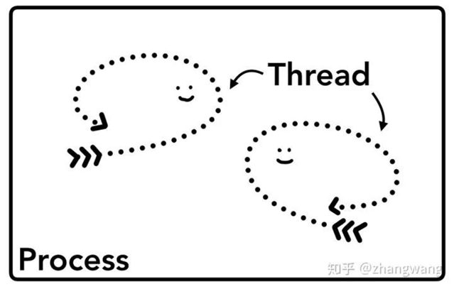
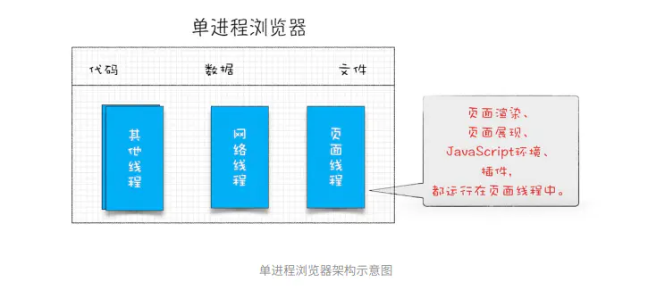
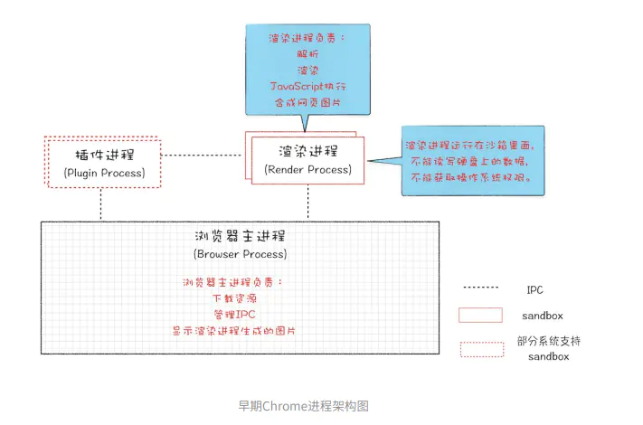
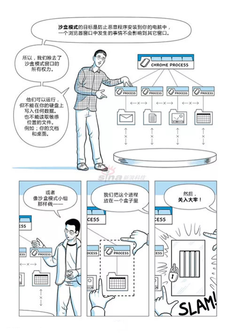
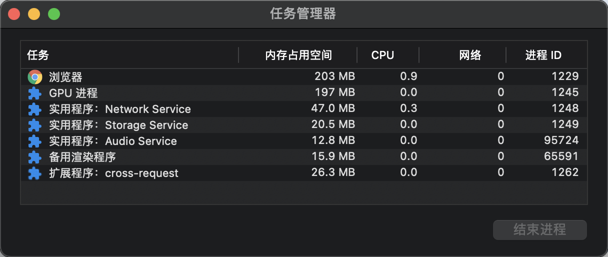
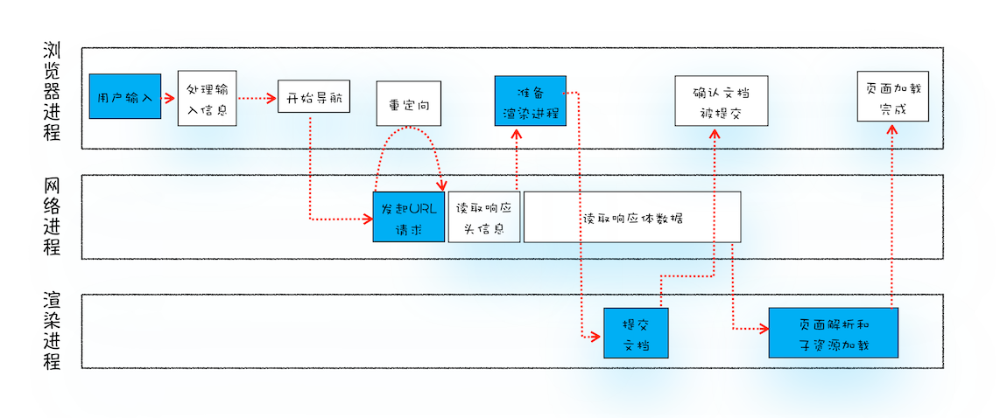
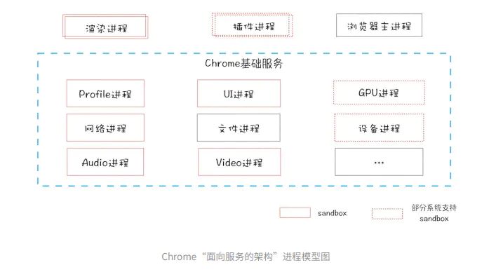

# 浏览器运行时架构浅析

## 1. 前言

浏览器是一个应用程序， 应用程序的运行就离不开进程和线程的相关知识。首先我们来简单的回顾一下进程以及线程。

- 进程：

  一个进程就是一个程序的运行实例。
  详细解释就是，启动一个程序的时候，操作系统会为该程序创建一块内存，用来存放代码、运行中的数据和一个执行任务的主线程，我们把这样的一个运行环境叫进程。

- 线程：

  线程是系统分配处理器时间资源的基本单元，或者说进程之内独立执行的一个单元。
  对于操作系统而言其调度单元是线程。
  一个进程至少包括一个线程，通常将该线程称为主线程。

**进程和线程的关系**

- 线程是不能单独存在的，它是由进程来启动和管理的；
- 一个进程就是一个程序的运行实例；
- 线程是依附于进程的，而进程中使用多线程并行处理能提升运算效率；

**进程和线程的 4 个特点：**

- 进程之间的内容相互隔离，互不影响。
- 线程之间共享进程中的数据。
- 进程中的任意一线程执行出错，都会导致整个进程的崩溃。
- 当一个进程关闭之后，操作系统会回收进程所占用的内存。

## 2. 早期-单进程架构

> 顾名思义，单进程浏览器是指浏览器的所有功能模块都是运行在同一个进程里。

在 `2007` 年之前，市面上浏览器都是单进程的。
单进程浏览器是指浏览器的所有功能模块都是运行在同一个进程里，这些模块包含了网络、插件、`JavaScript` 运行环境、渲染引擎和页面等。

如此多的功能模块运行在一个进程里，是导致单进程浏览器不稳定、不流畅和不安全的一个主要因素。

- 不稳定

  早期浏览器需要借助于插件来实现诸如 `Web` 视频、`Web` 游戏等各种功能，但是插件是最容易出问题的模块，并且还运行在浏览器进程之中，所以一个插件的意外崩溃会引起整个浏览器的崩溃。

  除了插件之外，渲染引擎模块也是不稳定的，通常一些复杂的 `JavaScript` 代码就有可能引起渲染引擎模块的崩溃。
  和插件一样，渲染引擎的崩溃也会导致整个浏览器的崩溃。

- 不流畅

  - 执行阻塞：

    因为所有页面的渲染模块、`JavaScript` 执行环境以及插件都是运行在同一个线程中的，这就意味着同一时刻只能有一个模块可以执行。

    比如执行过程中有一段无限循环的脚本，当其执行时，它会独占整个线程，这样导致其他运行在该线程中的模块就没有机会被执行。
    因为浏览器中所有的页面都运行在该线程中，所以这些页面都没有机会去执行任务，这样就会导致整个浏览器失去响应，变卡顿。

  - 内存泄露：

    通常浏览器的内核都是非常复杂的，运行一个复杂些的页面再关闭页面，会存在内存不能完全回收的情况。
    这样导致的问题是使用时间越长，内存占用越高，浏览器会变得越慢。

- 不安全

  插件可以使用 `C/C++` 等代码编写，通过插件可以获取到操作系统的任意资源，当你在页面运行一个插件时也就意味着这个插件能完全操作你的电脑。
  如果是个恶意插件，那么它就可以释放病毒、窃取你的账号密码，引发安全性问题。
  页面脚本可以通过浏览器的漏洞来获取系统权限，这些脚本获取系统权限之后也可以对你的电脑做一些恶意的事情，同样也会引发安全问题。

## 3. 早期-多进程架构

### 3.1 架构介绍

`2008` 年 `Chrome` 发布时的进程架构：

特点：`Chrome` 的页面是运行在单独的渲染进程中的，同时页面里的插件也是运行在单独的插件进程之中，而进程之间是通过 `IPC` 机制进行通信。

- 解决不稳定的问题

  由于进程是相互隔离的，所以当一个页面或者插件崩溃时，影响到的仅仅是当前的页面进程或者插件进程，并不会影响到浏览器和其他页面，这就完美地解决了页面或者插件的崩溃会导致整个浏览器崩溃，也就是不稳定的问题。

- 解决不流畅的问题

  `JavaScript` 是运行在渲染进程中的，所以即使 `JavaScript` 阻塞了渲染进程，影响到的也只是当前的渲染页面，而并不会影响浏览器和其他页面，因为其他页面的脚本是运行在它们自己的渲染进程中的。

  对于内存泄漏的解决方法，因为当关闭一个页面时，整个渲染进程也会被关闭，之后该进程所占用的内存都会被系统回收，这样就轻松解决了浏览器页面的内存泄漏问题。

- 解决不安全的问题

  采用多进程架构的额外好处是可以使用安全沙箱，你可以把沙箱看成是操作系统给进程上了一把锁，沙箱里面的程序可以运行，但是不能在你的硬盘上写入任何数据，也不能在敏感位置读取任何数据，例如你的文档和桌面。

  `Chrome` 把「插件进程」和「渲染进程」锁在沙箱里面，这样即使在渲染进程或者插件进程里面执行了恶意程序，恶意程序也无法突破沙箱去获取系统权限。

### 3.2 安全沙箱

> 浏览器进程为什么不能引入安全沙箱呢？原因是因为安全沙箱的最小单位是进程。

下面我们用一张图来简述一下安全沙箱。

## 4. 目前-多进程架构

### 4.1 架构介绍

最新的 `Chrome` 浏览器包括：

- 1 个`浏览器（Browser）`主进程；
- 1 个 `GPU` 进程；
- 1 个`网络（NetWork）`进程；
- 多个渲染进程和多个插件进程；

几个进程的主要功能：

- 浏览器进程

  主要负责界面显示、用户交互、子进程管理，同时提供存储等功能。

- 渲染进程

  核心任务是将 `HTML`、`CSS` 和 `JavaScript` 转换为用户可以与之交互的网页。
  排版引擎 `Blink` 和 `JavaScript` 引擎 `V8` 都是运行在该进程中。
  默认情况下，`Chrome` 会为每个 `Tab` 标签创建一个渲染进程。

  因为渲染进程所有的内容都是通过网络获取的，会存在一些恶意代码利用浏览器漏洞对系统进行攻击，所以运行在渲染进程里面的代码是不被信任的。
  出于安全考虑，渲染进程都是运行在沙箱模式下。

- `GPU` 进程

  其实，`Chrome` 刚开始发布的时候是没有 `GPU` 进程的。
  而 `GPU` 的使用初衷是为了实现 `3D` `CSS` 的效果，只是随后网页、`Chrome` 的 `UI` 界面都选择采用 `GPU` 来绘制，这使得 `GPU` 成为浏览器普遍的需求。
  最后，`Chrome` 在其多进程架构上也引入了 `GPU` 进程。

- 网络进程

  主要负责页面的网络资源加载，是面向渲染进程和浏览器进程等提供网络下载功能。
  最初是作为一个模块运行在浏览器进程里面的，直至后来才独立出来，成为一个单独的进程。

- 插件进程

  主要是负责插件的运行，因插件易崩溃，所以需要通过插件进程来隔离，以保证插件进程崩溃不会对浏览器和页面造成影响。

所以打开 1 个页面至少需要：

- 1 个网络进程；
- 1 个浏览器进程；
- 1 个 `GPU` 进程；
- 1 个渲染进程；

共 `4` 个。

如果打开的页面有运行插件的话，还需要再加上 `1` 个插件进程。

**分析**

多进程模型提升了浏览器的稳定性、流畅性和安全性，但同样不可避免地带来了一些问题：

- 更高的资源占用

  因为每个进程都会包含公共基础结构的副本（如 `JavaScript` 运行环境），这就意味着浏览器会消耗更多的内存资源。

- 更复杂的体系架构

  浏览器各模块之间耦合性高、扩展性差等问题，会导致现在的架构已经很难适应新的需求了。

### 4.2 实例分析

我们打开一个空白浏览器页面，然后`打开“浏览器选项”->“更多工具”->“任务管理器”`，如下图：

一个空白页面初始化的时候启动了这么多个进程？是的，没错。这就是现代的浏览器架构： 多进程架构。

### 4.3 多进程之间的协作方式

这里我们先来想一个经典的前端面试题： 从用户在浏览器中输入 `URL` 到页面渲染的过程中发生了什么？

OK，这道面试题涉及的面非常广，我们这里仅指针对浏览器进程协作的内容进行描述。

- 首先，浏览器进程接收到用户输入的 `URL` 请求，浏览器进程便将该 `URL` 转发给网络进程。
- 然后，在网络进程中发起真正的 `URL` 请求。
- 接着网络进程接收到了响应头数据，便解析响应头数据，并将数据转发给浏览器进程。
- 浏览器进程接收到网络进程的响应头数据之后，发送`“提交导航 (CommitNavigation)”`消息到渲染进程；
- 渲染进程接收到“提交导航”的消息之后，便开始准备接收 `HTML` 数据，接收数据的方式是直接和网络进程建立数据管道；
- 最后渲染进程会向浏览器进程“确认提交”，这是告诉浏览器进程：“已经准备好接受和解析页面数据了”。
- 浏览器进程接收到渲染进程“提交文档”的消息之后，便开始移除之前旧的文档，然后更新浏览器进程中的页面状态。

## 5. 未来-面向服务的架构 SOA

为了解决这些问题，在 `2016` 年，`Chrome` 官方团队使用`“面向服务的架构”（Services Oriented Architecture，简称 SOA）`的思想设计了新的 `Chrome` 架构。

也就是说 `Chrome` 整体架构会朝向现代操作系统所采用的“面向服务的架构”方向发展。
原来的各种模块会被重构成独立的`服务（Service）`，每个`服务（Service）`都可以在独立的进程中运行，访问`服务（Service）`必须使用定义好的接口，通过 `IPC` 来通信。
从而构建一个更内聚、松耦合、易于维护和扩展的系统，更好实现 `Chrome` 简单、稳定、高速、安全的目标。

## 6. 总结

- 单进程浏览器具有不稳定，不流畅，且不安全的问题；
- 多进程浏览器通过多进程，安全沙箱，进程之间的隔离等方法了，解决了单进程浏览器中存在的各种问题；

## 7. 参考

- [单进程浏览器和多进程浏览器的区别](https://juejin.cn/post/6844904115542163463)
- [Chrome 的多进程架构](https://zhuanlan.zhihu.com/p/150145602)
