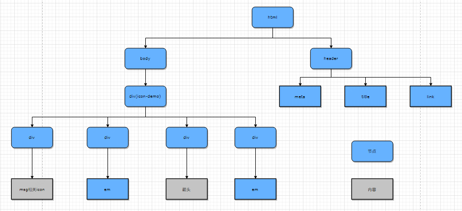
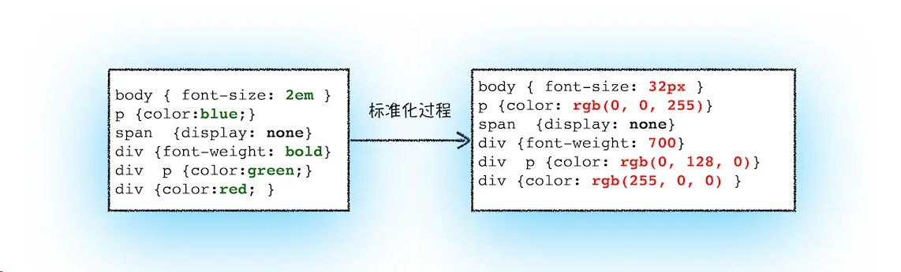
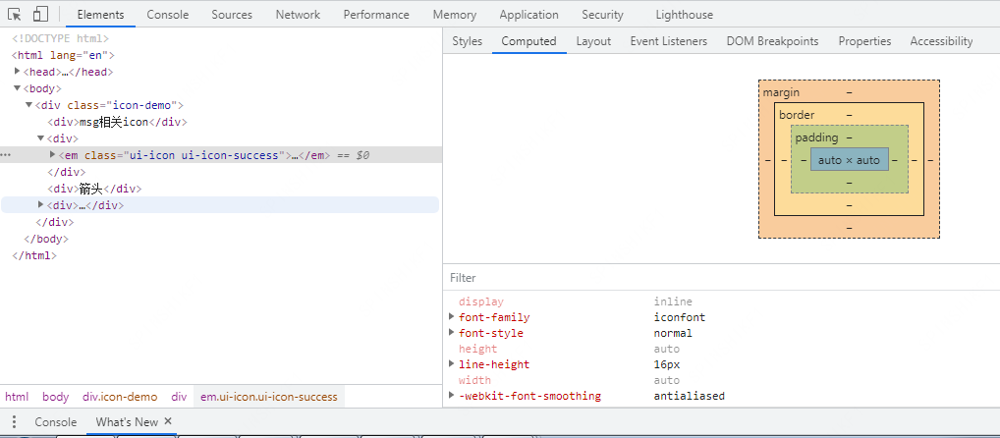
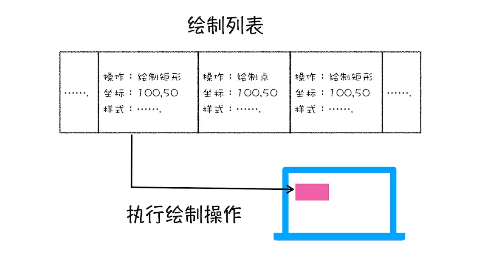
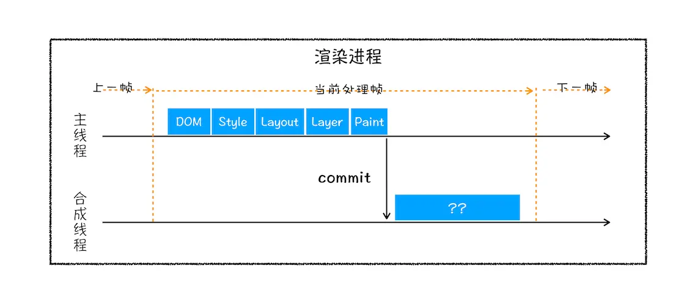
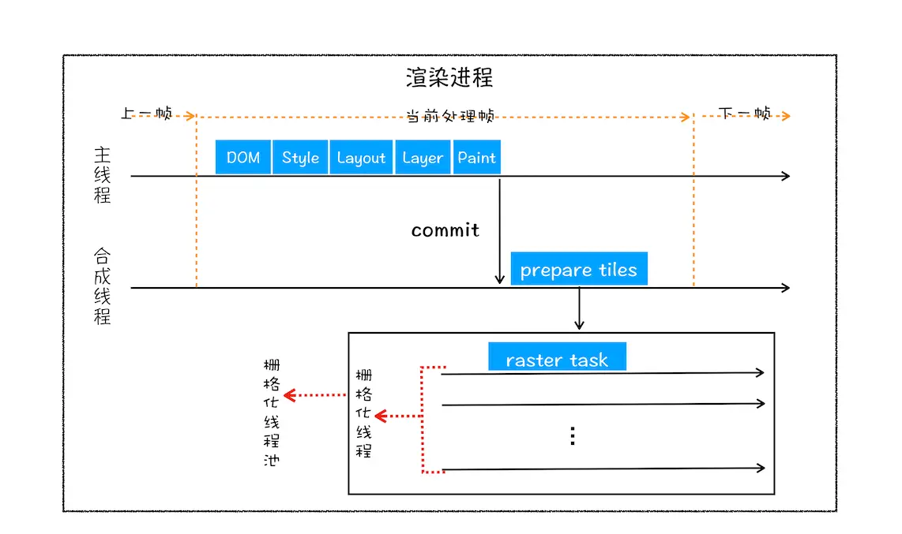

# 浏览器页面渲染流程浅析

## 1. 渲染流水线概述

我们在浏览器中输入网址，加载完 `HTML`、`CSS`、`JavaScript` 这些数据后，这些数据经过中间渲染模块的处理，最终输出为屏幕上的像素，从而展现出我们看到的页面。

由于渲染机制过于复杂，所以渲染模块在执行过程中会被划分为很多子阶段，`HTML` 、`CSS` 以及 `JAVASCRIPT` 经过这些子阶段，最后输出像素。
这样的一个处理流程叫做渲染流水线，其大致流程如下图所示：


按照渲染的时间顺序，流水线可分为如下几个子阶：

- 构建 `DOM` 树；
- 样式计算；
- 布局阶段；
- 分层；
- 绘制；
- 分块；
- 光栅化；
- 合成；

## 2. 渲染流水线分析

### 2.1 构建 DOM 树

由于浏览器无法直接理解和使用 `HTML`，所以需要将 `HTML` 转换为浏览器能够理解的结构 —— `DOM` 树。

如图， 以下 `HTML` 通过 `DOM` 解析器解析成 `DOM` 树结构：

```html
<!doctype html>
<html lang="en">
  <head>
    <meta charset="utf-8" />
    <meta name="viewport" content="initial-scale=1" />
    <title>iconfont_demo</title>
    <link rel="stylesheet" href="./icon_demo.css" />
  </head>
  <body>
    <div class="icon-demo">
      <div>msg相关icon</div>
      <div><em class="ui-icon ui-icon-sucess"></em></div>

      <div>箭头</div>
      <div><em class="ui-arrow ui-arrow-right"></em></div>
    </div>
  </body>
</html>
```



当然，我们也可以在浏览器的 `console` 面板中输入 `document` 然后回车，就可以直观的看出 `html` 的树形结构。

### 2.2 样式计算（Recalculate Style）

样式计算主要分为三个部分：

#### 2.2.1 把 CSS 转换为浏览器能够理解的结构

和 `HTML` 文件一样，浏览器也是无法直接理解这些纯文本的 `CSS` 样式，所以当渲染引擎接收到 CS`S 文本时，会执行一个转换操作，将 `CSS`文本转换为浏览器可以理解的结构 ————`styleSheets`。

`styleSheets` 也是一种树形结构，我们可以在浏览器 `console` 面板输入： `document.styleSheets` 后回车，就可以看到对应的树形结构。

#### 2.2.2 转换样式表中的属性值，使其标准化

我们编写样式的时候，可能经常会用到 `em`, `bold`, `red` 等 `css` 的值或单位， 这些是浏览器不认识的， 那么就需要将这些解析成标准的属性值。

```css
body {
  font-size: 2em;
}
p {
  color: blue;
}
span {
  display: none;
}
div {
  font-weight: bold;
}
div p {
  color: green;
}
div {
  color: red;
}
```



#### 2.2.3 计算出 DOM 树中每个节点的具体样式

样式计算阶段的目的是为了计算出 `DOM` 节点中每个元素的具体样式，在计算过程中需要遵守 `CSS` 的继承和层叠两个规则。
这个阶段最终输出的内容是每个 `DOM` 节点的样式，并被保存在 `ComputedStyle` 的结构内。

我们可以在 `chrome` 中打开`开发者工具`，进入`Elements`选项卡。点击某个元素，然后再进入右侧`Computed`子选项卡，即可查看对应元素的样式计算结果：



### 2.3 布局阶段

有了 `DOM` 树和样式计算后， 我们接下来需要对元素进行排版，这里就来到了布局阶段。布局阶段分为：创建布局树和布局计算。

- 创建布局树

  构建布局树，浏览器大体上完成了下面这些工作：遍历 `DOM` 树中的所有可见节点，并把这些节点加到布局树中；而不可见的节点会被布局树忽略掉。

- 布局计算

  创建好了布局树后， 我们就要计算布局树节点的坐标位置了。计算布局树的过程比较复杂，涵盖在后续的流程中。所以我们继续往下了解后续的流程。

### 2.4 分层（Layers）

页面中有很多复杂的效果，如一些复杂的 `3D` 变换、页面滚动，或者使用 `z-index` 做 `z` 轴排序等，为了更加方便地实现这些效果，渲染引擎还需要为特定的节点生成专用的图层，并生成一棵对应的`图层树（LayerTree）`。

- 拥有层叠上下文属性的元素会被提升为单独的一层。

  通常情况下，并不是布局树的每个节点都包含一个图层，如果一个节点没有对应的层，那么这个节点就从属于父节点的图层。
  但不管怎样，最终每一个节点都会直接或者间接地从属于一个层。

- 需要`剪裁（clip）`的地方也会被创建为图层。

  元素有了层叠上下文的属性或者需要被剪裁，满足其中任意一点，就会被提升成为单独一层。

### 2.5 图层绘制

渲染引擎实现图层的绘制，会把一个图层的绘制拆分成很多小的绘制指令，然后再把这些指令按照顺序组成一个待绘制列表，如下图所示：



### 2.6 栅格化（raster）操作

绘制列表只是用来记录绘制顺序和绘制指令的列表，而实际上绘制操作是由渲染引擎中的`合成线程`来完成的。
可以结合下图来看下`渲染主线程`和`合成线程`之间的关系：



通常一个页面可能很大，但是用户只能看到其中的一部分，我们把用户可以看到的这个部分叫做`视口（viewport）`。

基于这个原因，合成线程会将图层划分为`图块（tile）`，这些图块的大小通常是 `256x256` 或者 `512x512`。
然后合成线程会按照视口附近的图块来优先生成位图，实际生成位图的操作是由栅格化来执行的。

所谓栅格化，是指将图块转换为位图。而图块是栅格化执行的最小单位。
渲染进程维护了一个栅格化的线程池，所有的图块栅格化都是在线程池内执行的，运行方式如下图所示：



通常，栅格化过程都会使用 `GPU` 来加速生成，使用 `GPU` 生成位图的过程叫快速栅格化，或者 `GPU` 栅格化，生成的位图被保存在 `GPU` 内存中。

### 2.7 合成和显示

一旦所有图块都被光栅化，合成线程就会生成一个绘制图块的命令——`DrawQuad`，然后将该命令提交给浏览器进程。

浏览器进程里面有一个叫 `viz` 的组件，用来接收合成线程发过来的 `DrawQuad` 命令，然后根据 `DrawQuad` 命令，将其页面内容绘制到内存中，最后再将内存显示在屏幕上。
