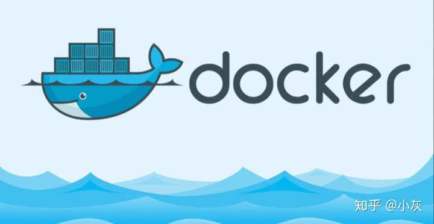
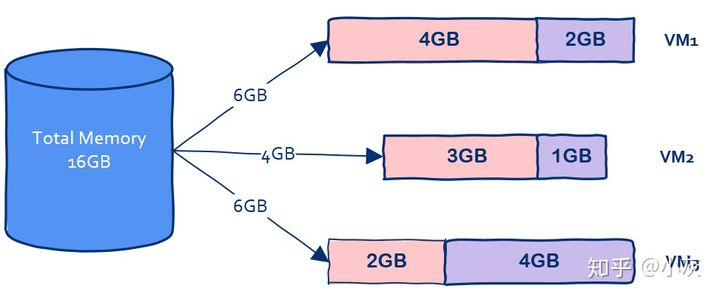
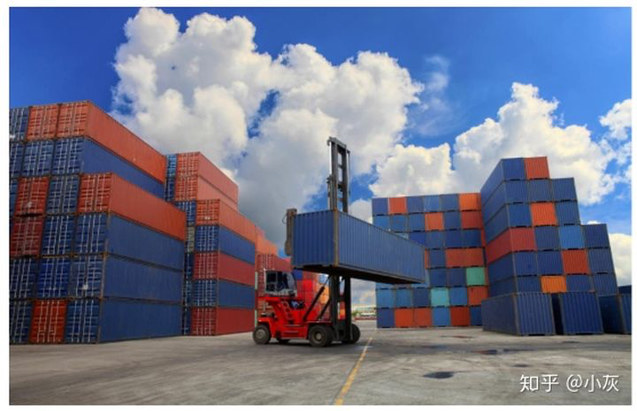
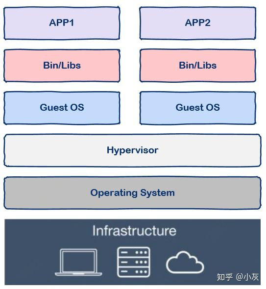
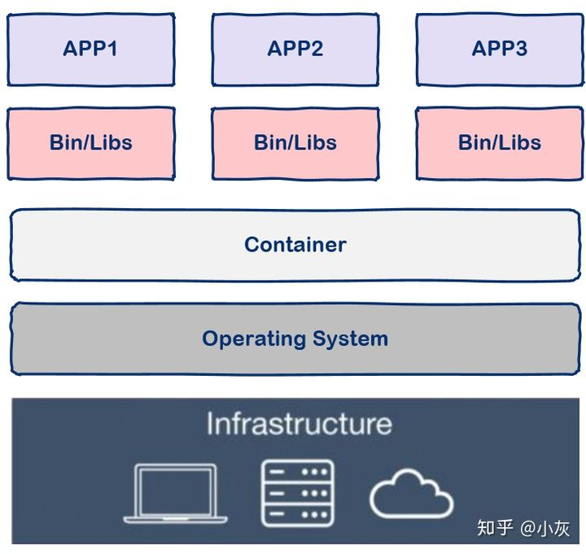
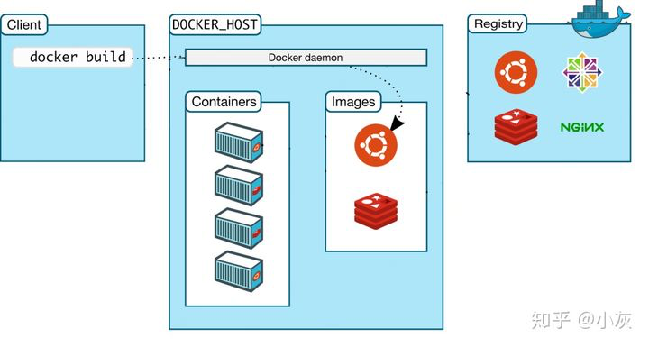
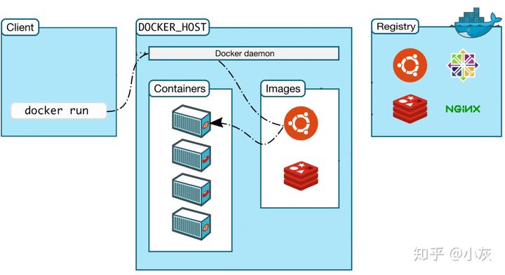
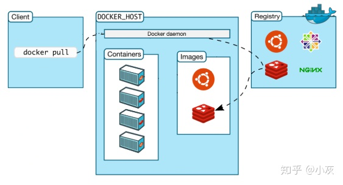

# Docker 简单介绍

> “真正实现 `build once, run everywhere` ”。这句话是错误的。因为容器只打包了用户空间的系统调用，执行系统调用的地方依然是宿主的 kernel，所以当你 `docker run centos:6 bash` 执行这句话的时候，在新的内核上可能会发生段错误，而老的宿主机却不会。
> 真正要做到 `BORE`，还是必使用同样的内核，那样的话，和使用虚拟机就没差别了。
> 总之不可能做到开发，测试，运维只要用同一个镜像就能表现完全一致，只要提供系统调用的内核版本不同，嗯，行为就绝对不能保证一致。

## 1. 容器技术的起源

假设你们公司研发一个 `APP`，程序员自己从头到尾搭建了一套环境开始写代码，写完代码后程序员要把代码交给测试同学测试，这时测试同学开始从头到尾搭建这套环境，测试过程中出现问题程序员也不用担心，大可以一脸无辜的撒娇，“明明在人家的环境上可以运行的”。

测试同学测完后终于可以上线了，这时运维同学又要重新从头到尾搭建这套环境，费了九牛二虎之力搭建好环境开始上线，糟糕，上线系统就崩溃了，这时心理素质好的程序员又可以施展演技了，“明明在人家的环境上可以运行的”。

从整个过程可以看到，不但我们重复搭建了三套环境还要迫使程序员转行演员浪费表演才华，典型的浪费时间和效率，聪明的程序员是永远不会满足现状的，因此又到了程序员改变世界的时候了，容器技术应运而生。

有的同学可能会说：“等等，先别改变世界，我们有虚拟机啊，VMware 好用的飞起，先搭好一套虚拟机环境然后给测试和运维 `clone` 出来不就可以了吗？”

在没有容器技术之前，这确实是一个好办法，只不过这个办法还没有那么好。

先科普一下，现在云计算其底层的基石就是虚拟机技术，云计算厂商买回来一堆硬件搭建好数据中心后使用虚拟机技术就可以将硬件资源进行切分了，比如可以切分出 100 台虚拟机，这样就可以卖给很多用户了。

你可能会想这个办法为什么不好呢？

## 2. 容器技术 vs 虚拟机

我们知道操作系统运行起来是需要占用很多资源的，大家对此肯定深有体会，刚装好的系统还什么都没有部署，单纯的操作系统其磁盘占用至少 `几十G` 起步，内存要 `几个G` 起步。

假设我有一台机器，`16G` 内存，需要部署三个应用，那么使用虚拟机技术可以这样划分：

在这台机器上开启三个虚拟机，每个虚拟机上部署一个应用，其中 `VM1` 占用 `2G` 内存，`VM2` 占用 `1G` 内存，`VM3` 占用了 `4G` 内存。

我们可以看到虚拟本身就占据了总共 `7G` 内存，因此我们没有办法划分出更过虚拟机从而部署更多的应用程序。
可是我们部署的是应用程序，要用的也是应用程序而不是操作系统。

如果有一种技术可以让我们避免把内存浪费在“无用”的操作系统上岂不是更好？这是问题一，主要原因在于操作系统太重了。

还有另一个问题，那就是启动时间问题，我们知道操作系统重启是非常慢的，因为操作系统要从头到尾把该检测的都检测了该加载的都加载上，这个过程非常缓慢，动辄数分钟，因此操作系统还是太笨了。

那么有没有一种技术可以让我们获得虚拟机的好处又能克服这些缺点从而一举实现鱼和熊掌的兼得呢？

答案是肯定的，这就是容器技术。

## 3. 什么是容器

容器一词的英文是 `container`，其实 `container` 还有`集装箱`的意思，集装箱绝对是商业史上了不起的一项发明，大大降低了海洋贸易运输成本。让我们来看看集装箱的好处：

- 集装箱之间相互隔离；
- 长期反复使用；
- 快速装载和卸载；
- 规格标准，在港口和船上都可以摆放；

回到软件中的容器，其实容器和集装箱在概念上是很相似的。

现代软件开发的一大目的就是隔离，应用程序在运行时相互独立互不干扰，这种隔离实现起来是很不容易的，其中一种解决方案就是上面提到的虚拟机技术，通过将应用程序部署在不同的虚拟机中从而实现隔离。

但是虚拟机技术有上述提到的各种缺点，那么容器技术又怎么样呢？

与虚拟机通过操作系统实现隔离不同，容器技术只隔离应用程序的运行时环境但容器之间可以共享同一个操作系统，这里的运行时环境指的是程序运行依赖的各种库以及配置。

从图中我们可以看到容器更加的轻量级且占用的资源更少，与操作系统动辄 `几G` 的内存占用相比，容器技术只需 `数M` 空间，因此我们可以在同样规格的硬件上大量部署容器，这是虚拟机所不能比拟的，而且不同于操作系统数分钟的启动时间容器几乎瞬时启动，容器技术为打包服务栈提供了一种更加高效的方式。

那么我们该怎么使用容器呢？这就要讲到 `docker` 了。

注意，容器是一种通用技术，`docker` 只是其中的一种实现。

## 4. 什么是 docker

`docker` 是一个用 `Go` 语言实现的开源项目，可以让我们方便的创建和使用容器，`docker` 将程序以及程序所有的依赖都打包到 `docker container`，这样你的程序可以在任何环境都会有一致的表现，这里程序运行的依赖也就是容器就好比集装箱，容器所处的操作系统环境就好比货船或港口，程序的表现只和集装箱有关系(容器)，和集装箱放在哪个货船或者哪个港口(操作系统)没有关系。

因此我们可以看到 `docker` 可以屏蔽环境差异，也就是说，只要你的程序打包到了 `docker` 中，那么无论运行在什么环境下程序的行为都是一致的，程序员再也无法施展表演才华了，不会再有“在我的环境上可以运行”，真正实现 `build once, run everywhere` 。

此外 `docker` 的另一个好处就是快速部署，这是当前互联网公司最常见的一个应用场景，一个原因在于容器启动速度非常快，另一个原因在于只要确保一个容器中的程序正确运行，那么你就能确信无论在生产环境部署多少都能正确运行。

## 5. 如何使用 docker

`docker` 中有这样几个概念：

- `dockerfile`
- `image`
- `container`

实际上你可以简单的把 `image` 理解为可执行程序，`container` 就是运行起来的进程。

那么写程序需要源代码，那么“写” `image` 就需要 `dockerfile`，`dockerfile` 就是 `image` 的源代码，`docker` 就是"编译器"。

因此我们只需要在 `dockerfile` 中指定需要哪些程序、依赖什么样的配置，之后把 `dockerfile` 交给“编译器” `docker` 进行“编译”，也就是 `docker build` 命令，生成的可执行程序就是 `image`，之后就可以运行这个 `image` 了，这就是 `docker run` 命令，`image` 运行起来后就是 `docker container`。

具体的使用方法就不在这里赘述了。

## 6. docker 是如何工作的

实际上 `docker` 使用了常见的 `CS 架构`，也就是 `client-server 模式`，`docker client` 负责处理用户输入的各种命令，比如 `docker build`、`docker run`，真正工作的其实是 `server`，也就是 `docker daemon`，值得注意的是，`docker client` 和 `docker daemon` 可以运行在同一台机器上。

接下来我们用几个命令来讲解一下 `docker` 的工作流程：

### 6.1 docker build

当我们写完 `dockerfile` 交给 `docker` “编译”时使用这个命令，那么 `client` 在接收到请求后转发给 `docker daemon`，接着 `docker daemon` 根据 `dockerfile` 创建出“可执行程序” `image`。

### 6.2 docker run

有了“可执行程序” `image` 后就可以运行程序了，接下来使用命令 `docker run`，· 接收到该命令后找到具体的 image，然后加载到内存开始执行，`image` 执行起来就是所谓的 `container`。

### 6.3 docker pull

其实 `docker build` 和 `docker run` 是两个最核心的命令，会用这两个命令基本上 `docker` 就可以用起来了，剩下的就是一些补充。

那么 `docker pull` 是什么意思呢？

我们之前说过，`docker` 中 `image` 的概念就类似于“可执行程序”，我们可以从哪里下载到别人写好的应用程序呢？很简单，那就是 `App Store`，即应用商店。与之类似，既然 `image` 也是一种“可执行程序”，那么有没有 `Docker Image Store` 呢？答案是肯定的，这就是 `Docker Hub``，docker` 官方的“应用商店”，你可以在这里下载到别人编写好的 `image`，这样你就不用自己编写 `dockerfile` 了。

`docker registry` 可以用来存放各种 `image`，公共的可以供任何人下载 `image` 的仓库就是 `docker Hub`。那么该怎么从 `Docker Hub` 中下载 `image` 呢，就是这里的 `docker pull` 命令了。

因此，这个命令的实现也很简单，那就是用户通过 `docker client` 发送命令，`docker daemon` 接收到命令后向 `docker registry` 发送 `image` 下载请求，下载后存放在本地，这样我们就可以使用 `image` 了。

最后，让我们来看一下 `docker` 的底层实现。

## 7. docker 的底层实现

`docker` 基于 `Linux` 内核提供这样几项功能实现的：

- `NameSpace`
  我们知道 `Linux` 中的 `PID`、`IPC`、`网络`等资源是全局的，而 `NameSpace` 机制是一种资源隔离方案，在该机制下这些资源就不再是全局的了，而是属于某个特定的 `NameSpace`，各个 `NameSpace` 下的资源互不干扰，这就使得每个 `NameSpace` 看上去就像一个独立的操作系统一样，但是只有 `NameSpace` 是不够。
- `Control groups`
  虽然有了 `NameSpace` 技术可以实现资源隔离，但进程还是可以不受控的访问系统资源，比如 `CPU`、内存、磁盘、网络等，为了控制容器中进程对资源的访问，`Docker` 采用 `control groups` 技术(也就是 `cgroup`)，有了 `cgroup` 就可以控制容器中进程对系统资源的消耗了，比如你可以限制某个容器使用内存的上限、可以在哪些 `CPU` 上运行等等。

有了这两项技术，容器看起来就真的像是独立的操作系统了。

## 8. 参考

- [什么是 Docker？看这一篇干货文章就够了！](https://zhuanlan.zhihu.com/p/187505981)
