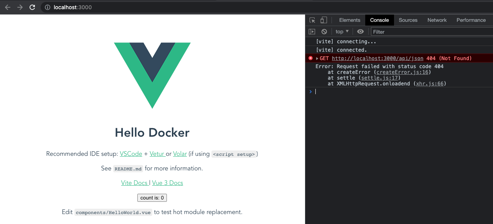
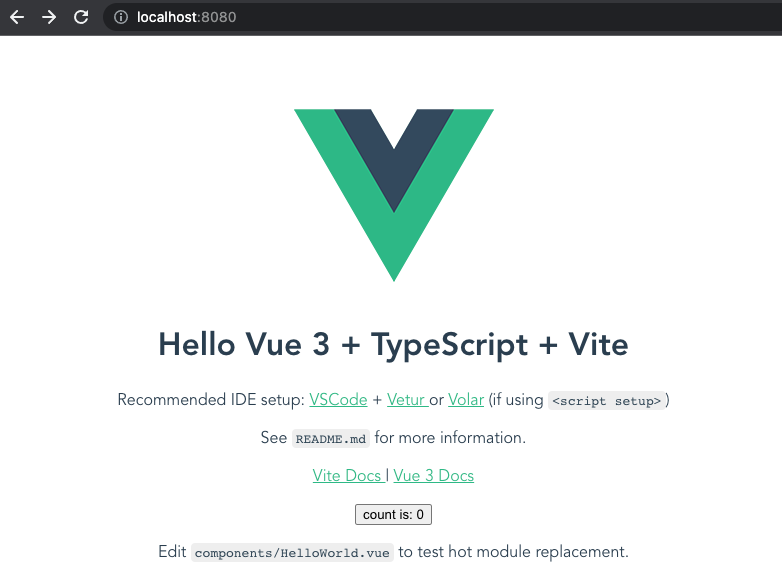
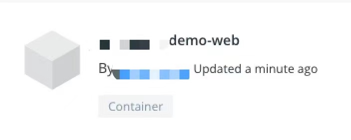
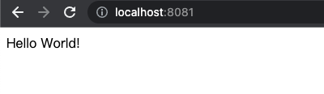
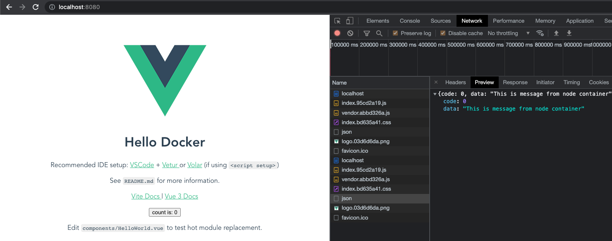

# 使用 Docker 构建前端应用

- `Docker` `镜像（Image）`一个特殊的文件系统。
  `Docker` 镜像是一个特殊的文件系统，除了提供容器运行时所需的程序、库、资源、配置等文件外，还包含了一些为运行时准备的一些配置参数（如匿名卷、环境变量、用户等）。
  镜像不包含任何动态数据，其内容在构建之后也不会被改变。
- `Docker` 镜像相关操作有：
  搜索镜像，`docker search [REPOSITORY[:TAG]]`；
  拉取镜像，`docker pull [REPOSITORY[:TAG]]`；
  查看镜像列表，`docker image ls`；
  删除镜像，`docker image rm [REPOSITORY[:TAG]]` / `docker rmi [REPOSITORY[:TAG]]`；
- `Docker` 镜像名称由 `REPOSITORY` 和 `TAG` 组成 `[REPOSITORY[:TAG]]`，`TAG` 默认为 `latest`。

随着容器化技术的大行其道，`Docker` 在前端领域中也有着越来越广泛的应用。
本文主要介绍了容器化技术给前端工程带来的变化，演示了如何使用 `Docker` 构建不同种类的前端应用。

## 1. 使用 Docker 构建 Web 前端项目

`Web` 前端项目的部署上线一般会经历 `babel` 编译，`webpack` 构建等过程，最终将打包后的静态资源放在静态资源服务器上。

### 1.1 创建项目

> 这个过程和使用的框架并没有太多关系，这里就拿 `Vite+Vue` 来演示。

```bash
yarn create @vitejs/app demo-web --template vue-ts
cd demo-web
yarn install
yarn dev # 测试本地运行
yarn build # 构建出部署所需要的静态资源
```

若构建报错，需要增加以下依赖：

```bash
yarn add --dev @babel/types
```

然后增加接口调用：

```bash
yarn add axios
```

```html
<!-- demo-web/src/App.vue -->

<template>
  <!-- ... -->
  <HelloWorld msg="Hello Docker" />
</template>

<script lang="ts">
  import axios from "axios";
  // ...

  export default defineComponent({
    // ...
    setup() {
      onMounted(() => {
        axios
          .get("/api/json", {
            params: {},
          })
          .then((res) => {
            console.log(res);
          })
          .catch((error) => {
            console.log(error);
          });
      });
    },
  });
</script>
```

运行看下效果：



`/api/json` 接口 `404`，当然此时这个接口还不存在，暂时写到这里，一会再调这个接口。

### 1.2 选择合适的静态资源服务器

> `Nginx` 是一个高性能的 `HTTP` 和反向代理服务器，此处我们选用 `Nginx` 镜像作为基础来构建我们的 `vue` 应用镜像。

这里选用 `Nginx`，这是一款轻量级的 `HTTP` 服务器，具有很多非常优越的特性：轻量、高性能、并发能力强，用来部署静态页面很便捷。

- 现代前端框架几乎都使用了 `HTML5 push/pop history API` 来完全控制 `Web` 应用程序的历史记录，在 `Nginx` 中需要配置 `try_files` 指令；
- 前后端分离后，在 `Nginx` 中需要配置反向代理解决前端跨域问题；
- ...

```ini
# demo-web/nginx/default.conf

server {
    listen 80;
    server_name localhost;

    access_log  /var/log/nginx/host.access.log  main;
    error_log  /var/log/nginx/error.log  error;

    location  / {
        root /usr/share/nginx/html;
        index  index.html;
        try_files $uri $uri/ /index.html;
    }

    error_page  404              /404.html;

    # redirect server error pages to the static page /50x.html
    #
    error_page   500 502 503 504  /50x.html;
    location = /50x.html {
        root   /usr/share/nginx/html;
    }

    # location  ~ /api/  {
    #   proxy_connect_timeout 2s;
    #   proxy_read_timeout 600s;
    #   proxy_send_timeout 600s;
    #   proxy_pass http://gateway:8080;
    #   proxy_set_header        Host    $host:80;
    #   proxy_set_header        X-Real-IP       $remote_addr;
    #   proxy_set_header        X-Forwarded-For $proxy_add_x_forwarded_for;
    #   client_max_body_size    1000m;
    # }
}
```

### 1.3 定制镜像

在项目的根目录创建 `Dockerfile` 文件来定制我们的镜像。

若为本地构建，仅在 `docker` 中部署，则文件内容如下：

```Dockerfile
# demo-web/Dockerfile
# Dockerfile_v1

FROM nginx:latest
LABEL maintainer "***@***.com"
ADD dist/ /usr/share/nginx/html/
COPY nginx/default.conf /etc/nginx/conf.d/default.conf
EXPOSE 80
```

若为 docker 中构建+部署，则文件内容如下：

> 参考官方文档[多阶段构建](https://docs.docker.com/develop/develop-images/multistage-build/)

```Dockerfile
# demo-web/Dockerfile
# Dockerfile

FROM node:latest as builder
WORKDIR /app
COPY package.json .
RUN npm install
COPY . .
RUN npm run build

FROM nginx:latest
COPY nginx/default.conf /etc/nginx/conf.d/default.conf
COPY --from=builder /app/dist /usr/share/nginx/html

EXPOSE 80
```

> 注意在以上的代码里面执行了两次 `copy`，第一次只是拷贝了 `package.json` 文件，第二次拷贝了全部的文件。
> 可能在你没有更改 `package.json` 文件的时候，你并不希望它执行很耗时的 `npm install`。`docker` 的 `cache` 机制，能帮你避免不必要的依赖安装的耗时。
> 当你在你的部署机上第一次构建这个镜像的之后，镜像保存在你的本地，第二次构建的时候，他会根据你 `COPY` 指令中对应的内容是否与上一次构建的内容一致来决定是否要启用上一次执行的 `cache`，如果检查到 `COPY package.json .` 这一层中，`package.json` 文件和上次没有任何改变，那么接下来的 `RUN npm install` 这一层就会使用上一次执行的 `cache`。
> 所有的指令执行完，就完成了在镜像中打包，所有的静态文件都会在 `/app/dist` 目录下。

`--from=builder` 的参数表明，`copy` 动作是要从该指令之前 `build` 完成的 `stage` 中拷贝，等号右边的参数是我们之前的 `build` 镜像中`指定的名字`。这样就完成了 `copy`。

### 1.4 构建镜像

使用 `docker build` 命令进行镜像构建。

`OPTIONS` 说明：

> `--tag, -t`: 镜像的名字及标签，通常 `name:tag` 或者 `name` 格式；可以在一次构建中为一个镜像设置多个标签。

若为仅 `docker` 中部署情况，则：

```bash
docker build -t ocean/demo-web .
# [+] Building 0.1s (8/8) FINISHED
#  => [internal] load build definition from Dockerfile  0.0s
#  => => transferring dockerfile: 169B 0.0s
#  => [internal] load .dockerignore 0.0s
#  => => transferring context: 2B 0.0s
#  => [internal] load metadata for docker.io/library/nginx:latest 0.0s
#  => [1/3] FROM docker.io/library/nginx:latest 0.0s
#  => => resolve docker.io/library/nginx:latest 0.0s
#  => [internal] load build context 0.0s
#  => => transferring context: 63.51kB 0.0s
#  => [2/3] ADD ./dist/ /usr/share/nginx/html/ 0.0s
#  => [3/3] ADD nginx.conf /etc/nginx/ 0.0s
#  => exporting to image 0.0s
#  => => exporting layers 0.0s
#  => => writing image sha256:39f7ee1f1a24e6b0de407e049891aa111ae1fc0dbc38e6d281297235311580c9 0.0s
#  => => naming to docker.io/library/ocean/demo-web 0.0s
```

若为 `docker` 中构建+部署情况，则：

```bash
docker build -t ocean/demo-web .
# [+] Building 75.7s (15/15) FINISHED
#  => [internal] load .dockerignore  0.0s
#  => => transferring context: 2B 0.0s
#  => [internal] load build definition from Dockerfile 0.0s
#  => => transferring dockerfile: 37B 0.0s
#  => [internal] load metadata for docker.io/library/nginx:latest 0.0s
#  => [internal] load metadata for docker.io/library/node:latest 2.6s
#  => [stage-1 1/3] FROM docker.io/library/nginx:latest  0.0s
#  => [builder 1/6] FROM docker.io/library/node:latest@sha256:22f1866405ad50bb1d141739596ba803aed073d618ab2ae6d5e66aedcf9261b5 0.0s
#  => [internal] load build context 0.2s
#  => => transferring context: 1.28MB 0.2s
#  => CACHED [builder 2/6] WORKDIR /app 0.0s
#  => CACHED [stage-1 2/3] COPY nginx/default.conf /etc/nginx/conf.d/default.conf 0.0s
#  => [builder 3/6] COPY package.json . 0.0s
#  => [builder 4/6] RUN npm install 59.2s
#  => [builder 5/6] COPY . . 0.6s
#  => [builder 6/6] RUN npm run build 12.9s
#  => [stage-1 3/3] COPY --from=builder /app/dist /usr/share/nginx/html 0.0s
#  => exporting to image 0.0s
#  => => exporting layers 0.0s
#  => => writing image sha256:6ed09c6456afd5b4077e2814a7c7ccf68c15aa59aa39db8f7c59b10bd285dc79 0.0s
#  => => naming to docker.io/ocean/demo-web 0.0s
```

查询下镜像文件是否在：

```bash
docker images | grep demo-web
# ocean/demo-web  latest  39f7ee1f1a24  5 minutes ago  133MB
```

### 1.5 测试并上传镜像

> 如果每次本地通过 `dockerfile` 构建生成镜像的方式进行运行，是不需要上传镜像的。

使用 `docker run` 命令启动容器并将本地的 `8080` 端口 映射到容器的 80 端口：

```bash
docker run -d -p 8080:80 ocean/demo-web
# 8bad54667d87e0d92567ed3b5b530824fa21be9fbd84a47cabd3c40ded89f356
```

- `docker run` 基于镜像启动一个容器
- `-p 8080:80` 端口映射，将宿主的 `8080` 端口映射到容器的 `80` 端口
- `-d` 后台方式运行
- `--name` 容器名，查看 `Docker` 进程

```bash
docker ps
# CONTAINER ID        IMAGE               COMMAND                  CREATED             STATUS              PORTS                  NAMES
# 859f62c603a9        ocean/demo-web   "/docker-entrypoint.…"   2 minutes ago       Up 2 minutes        0.0.0.0:8080->80/tcp   romantic_heisenberg
```

打开浏览器，访问 `localhost:8080`。出现如下页面表示工作正常，测试通过。



目前为止，已经通过 `Docker` 容器部署了一个静态资源服务，可以访问到静态资源文件。
还有 `/api/json` 这个接口数据没有，接下来我们来解决一下这个问题。

使用 `docker push` 上传镜像。这里只是演示，直接上传到了 `Docker Hub` 上，推荐搭建私有镜像仓库。

如果没有安装 `docker` 客户端的话，需要先登录：

```bash
docker login -u [username] -p [password]
```

上传到 `Docker Hub`：

```bash
docker push ocean/demo-web
# The push refers to repository [docker.io/ocean/demo-web]
# d8136b7b00c5: Pushed
# 868e43e8923d: Pushed
# b9e73ac5343e: Pushed
# 5887d03dfc3d: Pushed
# e3a971c30b12: Mounted from library/nginx
# 32048dd980c7: Pushed
# f5600c6330da: Pushed
# latest: digest: sha256:abb5a5b734e9390c8b20ff96f55002476f55829488f18070306a8e08ec2f2f76 size: 1778
```

远程访问 `Docker Hub` 看下：



## 2. 使用 Docker 构建 Node.js 前端项目

前端应用中还包括使用 `Node.js` 开发的后端服务，常用于承担一些 `Api 中间层`、`BFF(Backend For Frontend) 层` 的角色，甚至是完整的核心服务。

### 2.1 创建项目

可选的框架有很多，比如 `express`，`koa` 等。我们这里以 `Express` 为例。

```bash
mkdir demo-node
cd demo-node
npm init -y
yarn add express # 或者 npm install --save express 或者 npm install -S express
```

当前 `express` 版本为 `4.17.1`。

```js
// demo-node/app.js

'use strict';

const express = require('express');

const PORT = 8000;
const HOST = '0.0.0.0';

const app = express();
app.get('/', (req, res) => {
  res.send('Hello world\n');
});

app.get('/json', (req, res) => {
  res.json({
    code: 0,
    data: 'This is message from node container',
  });
});

app.listen(PORT, HOST);
console.log(`Running on http://${HOST}:${PORT}`);
```

### 2.2 定制镜像

在项目的根目录创建 `Dockerfile` 文件来定制我们的镜像。

- 使用 F`ROM 指令指定基础镜像，这里使用官方提供的 `node:8`
- 使用 `LABEL` 指令为构建的镜像设置作者信息
- 使用 `COPY` 指令将根目录下的所有文件拷贝至镜像内
- 使用 `RUN` 指令执行 `npm install` 安装依赖
- 使用 `EXPOSE` 指令声明运行时容器提供的服务端口，暴露 `7001` 端口
- 使用 `CMD` 指令设置容器启动命令为 `npm start`

```Dockerfile
# demo-node/Dockerfile

FROM node:latest
LABEL maintainer "***@***.com"

COPY package.json .
RUN npm install
COPY . .

EXPOSE 8000
CMD ["npm", "start"]
```

构建镜像的时候 `node_modules` 的依赖直接通过 `RUN npm install` 来安装，项目中创建一个 `.dockerignore` 文件来忽略一些直接跳过的文件：

```
node_modules
npm-debug.log
```

### 2.3 构建镜像

使用 `docker build` 命令进行镜像构建。

```bash
docker build -t ocean/demo-node .
```

### 2.4 测试镜像

```bash
docker run -d -p 8081:8000 --name=demo-node ocean/demo-node
```

```bash
docker ps
# CONTAINER ID        IMAGE                COMMAND                  CREATED             STATUS              PORTS                    NAMES
# 641d4d7ef026        ocean/demo-node   "docker-entrypoint.s…"   15 seconds ago      Up 14 seconds       0.0.0.0:8081->8000/tcp   demo-node
```

打开浏览器，访问 `localhost:8081`。出现如下的页面表示工作正常，测试通过。



请求接口看下：

```bash
curl http://localhost:8081/json
# {"code":0,"data":"This is message from node container"}
```

## 3. 请求转发

想要将 `demo-web` 容器 上的请求转发到 `demo-node` 容器上。
首先需要知道 `demo-node` 容器的 `IP` 地址和端口，目前已知 `demo-node` 容器内部服务监听在 `8000` 端口，还需要知道 `IP` 即可。

### 3.1 查看容器的 IP 地址

查看容器内部 `IP` 有多种方式，这里提供两种：

1、进入容器内部查看：

```bash
docker ps
# CONTAINER ID        IMAGE                COMMAND                  CREATED             STATUS              PORTS                    NAMES
# cc322d093f80        ocean/demo-node   "docker-entrypoint.s…"   5 minutes ago       Up 5 minutes        0.0.0.0:8081->8000/tcp   demo-node
```

```bash
docker exec -it cc322d093f80 /bin/sh;
cat /etc/hosts
# 127.0.0.1 localhost
# ::1 localhost ip6-localhost ip6-loopback
# fe00::0 ip6-localnet
# ff00::0 ip6-mcastprefix
# ff02::1 ip6-allnodes
# ff02::2 ip6-allrouters
# 172.17.0.2  cc322d093f80
# exit
```

2、`docker inspect [ containerId ]` 直接查看容器信息：

```bash
docker inspect cc322d093f80
```

在其中找到 `Networks` 相关配置信息：

```json
{
  // ...
  "Networks": {
    "bridge": {
      "IPAMConfig": null,
      "Links": null,
      "Aliases": null,
      "NetworkID": "b1b55419db220e91eeca216f9076063789dc14e1021d6a2b9222732c817b1893",
      "EndpointID": "72810be9fadfc3844f31cb2c85078aad3929f4892800e4309a0b9f1995b165b3",
      "Gateway": "172.17.0.1",
      "IPAddress": "172.17.0.2",
      "IPPrefixLen": 16,
      "IPv6Gateway": "",
      "GlobalIPv6Address": "",
      "GlobalIPv6PrefixLen": 0,
      "MacAddress": "02:42:ac:11:00:02",
      "DriverOpts": null
    }
  }
}
```

记录下 `Node` 服务容器对应的 `IP` 为 `172.17.0.2`，一会儿配置 `Nginx` 转发的时候会用到。

### 3.2 修改 Nginx 配置

添加一条重写规则，将 `/api/{path}` 转到目标服务的 `/{path}` 接口上。
在前面的 `nginx/default.conf` 文件中加入：

```ini
location /api/ {
    rewrite  /api/(.*)  /$1  break;
    proxy_pass http://172.17.0.2:8000;
}
```

### 3.3 重新构建+运行 demo-web 容器

```bash
docker build -t ocean/demo-web .
docker run -d -p 8080:80 --name=demo-web ocean/demo-web
```

此时我们再访问 `http://localhost:8080/api/json` 能看到接口能正常返回，说明转发生效了。



至此接口服务的转发也调通了。

### 3.4 配置负载均衡

后端服务一般都是双机或者多机以确保服务的稳定性。我们可以再启动一个后端服务容器，并修改 `Nginx` 的配置来优化资源利用率，最大化吞吐量，减少延迟，确保容错配置。

基于 `demo-node` 镜像，新启动一个容器，查看到新容器的 `IP（172.17.0.4）`。

```bash
docker run -d -p 8082:8000 --name=demo-node2 ocean/demo-node
```

修改一下 `nginx/default.conf`（新增 `upstream` ，修改 `location /api/` 中的 `proxy_pass`）：

```ini
upstream backend {
  server 172.17.0.2:8000;
  server 172.17.0.4:8000;
}

# ...

location /api/ {
  rewrite  /api/(.*)  /$1  break;
  proxy_pass http://backend;
}
```

## 4. 脚本

> 这里以 `demo-web` 项目为例。

### 4.1 镜像构建脚本

```bash
#!/bin/bash

# 构建镜像
docker build -t ocean/demo-web .

# 清除 tag 为 none 的 image
docker images | grep none | awk '{print $3}' | xargs docker rmi
```

**删除 tag 为 none 的无用 image**

第一次构建不会生成 `tag` 为 `none` 的 `image`，但是后面每次再次执行该命令就会出现这样的情况。
所以每次构建了一个新的 `image` 后，需要清除不需要的 `image`。

```bash
docker images | grep none | awk '{print $3}' | xargs docker rmi
```

使用 `grep` 命令匹配到 `tag` 为 `none` 的 `image，awk` 是一个强大的文本分析工具，`{print $3}` 表示打印出匹配到的每一行的第三个字段，也就是 `docker` 的 `image` 的 `ID`。如果是 `$0` 的话表示当前整行的数据。

`xargs` 是一个给其他命令（也就是后面的 `docker rmi`）传递参数的一个过滤器，将标准输入转换成命令行参数。

总结来说，上述命令就是找到 `tag` 为 `none` 的 `image` 的 `ID`，然后使用 `docker rmi` 命令移除该 `image`。

### 4.2 镜像启动脚本

在启动 `container` 时，如果此 `container` 已经在运行了，此时如果再次运行 `docker run` 命令就会报错。
所以在这里做一个判断，第一个 `if` 判断如果存在指定 `name` 的 `container` 正在运行，就停止当前容器再重新启动。
如果不存在则直接启动容器。

```bash
#!/bin/bash

name=demo-web
docker pull ocean/$name

# awk $0-表示所有 $1-表示第一个 $NF-表示最后一个 $(NF-1)-表示倒数第二个
# grep -F或--fixed-regexp 将范本样式视为固定字符串的列表
# grep -x或--line-regexp 只显示全列符合的列
if docker ps | grep $name | awk {'print $(NF)'} | grep -Fx $name; then
    echo "Container is already start"
    docker stop $name
    docker rm $name
    docker run -d --name $name -p 8080:80 ocean/$name
else
    echo "Container is not start!, starting"
    docker run -d --name $name -p 8080:80 ocean/$name
    echo "Finish starting"
fi

docker images | grep none | awk '{print $3}' | xargs docker rmi
```

## 5. 其他 docker 命令

> `tail -n +2` 表示从第二行开始读取。

`docker` 中启动所有的容器命令：

```bash
docker start $(docker ps -a | awk '{ print $1}' | tail -n +2)
```

`docker` 中关闭所有的容器命令：

```bash
docker stop $(docker ps -a | awk '{ print $1}' | tail -n +2)
```

`docker` 中删除所有的容器命令：

```bash
docker rm $(docker ps -a | awk '{ print $1}' | tail -n +2)
```

`docker` 中删除所有的镜像：

```bash
docker rmi $(docker images | awk '{print $3}' |tail -n +2)
```

查看 `Docker` 容器命令：

```bash
# 不加 -a 仅列出正在运行的，像退出了的或者仅仅只是创建了的就不列出来
docker ps -a # 列出所有容器
docker container ls # 查看正在运行的所有容器
docker container ls -a # 查看所有容器
```

进入 `Docker` 容器：

```bash
docker exec -it cc322d093f80 /bin/sh;
```

我们启动镜像，自动会生成容器：

```bash
docker run -p 8000:3000 app
```

但如果我们手动生成+运行容器：

```bash
docker container create -p 8000:3000 app # 生成容器，这个时候会打印容器 hash 值
docker container start ***(上面那段 hash 值) # 运行容器
```

## 6. 取得构建结果

> 容器 ID: `c2a8a7421124` 可通过 `docker ps -a` 获取。

```bash
docker container create -p 8080:80 ocean/demo-web
# c2a8a742112400752e4781157a60f9ecd10e0f138154e9733011d901be20b681

docker cp c2a8a7421124:/usr/share/nginx/html ./docker-cp-dist/

cd ./docker-cp-dist/html && ls
# 50x.html    assets      favicon.ico index.html
```

## 5. 参考

- [使用 Docker 构建前端应用](https://zhuanlan.zhihu.com/p/39241059)
- [怎样用 Docker 部署前端应用](https://www.jianshu.com/p/08e6f00bb689)
- [将你的前端应用打包成 docker 镜像并部署到服务器？仅需一个脚本搞定](https://blog.csdn.net/dupeng0811/article/details/89877409)
- [手把手教你使用 Docker 部署 Vue.js 项目](http://www.dockone.io/article/8834)
