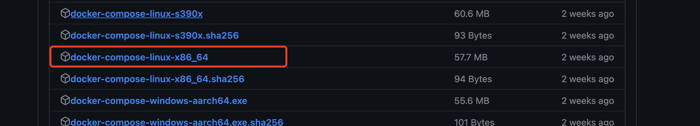
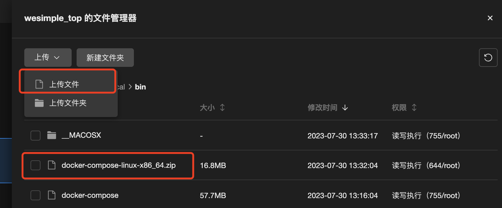

# 腾讯云服务器安装 Docker

## 1. 查看系统版本

```bash
# [root@VM-32-6-opencloudos ~]#
uname -a
# Linux VM-32-6-opencloudos 5.4.119-20.0009.20 #1 SMP Mon Jan 9 13:11:31 CST 2023 x86_64 x86_64 x86_64 GNU/Linux
```

## 2. 更新 yum 包, 需要时间可能会比较久

```bash
# [root@VM-32-6-opencloudos ~]#
yum update
# 上次元数据过期检查：4:07:21 前，执行于 2023年07月29日 星期六 15时00分02秒。
# 依赖关系解决。
# 无需任何处理。
# 完毕！
```

## 3. 设置 yum 源, 选用阿里仓库为例

```bash
# [root@VM-32-6-opencloudos ~]#
yum-config-manager --add-repo http://mirrors.aliyun.com/docker-ce/linux/centos/docker-ce.repo
# 添加仓库自: http://mirrors.aliyun.com/docker-ce/linux/centos/docker-ce.repo
```

## 4. 查看所有可安装的额版本

```bash
# [root@VM-32-6-opencloudos ~]#
yum list docker-ce --showduplicates | sort -r
# docker-ce.x86_64                3:24.0.5-1.el8                  docker-ce-stable
# docker-ce.x86_64                3:24.0.4-1.el8                  docker-ce-stable
# docker-ce.x86_64                3:24.0.3-1.el8                  docker-ce-stable
# docker-ce.x86_64                3:24.0.2-1.el8                  docker-ce-stable
# ...
# Docker CE Stable - x86_64                       120 kB/s |  49 kB     00:00
# 可安装的软件包
```

## 5. 安装

```bash
# [root@VM-32-6-opencloudos ~]#
yum install docker-ce
# 上次元数据过期检查：0:00:44 前，执行于 2023年07月29日 星期六 19时07分46秒。
# 依赖关系解决。
# ===========================================================================================================================
#  软件包                                架构               版本                          仓库                          大小
# ===========================================================================================================================
# 安装:
#  docker-ce                             x86_64             3:24.0.5-1.el8                docker-ce-stable              24 M
# 安装依赖关系:
#  containerd.io                         x86_64             1.6.21-3.1.el8                docker-ce-stable              34 M
#  docker-ce-cli                         x86_64             1:24.0.5-1.el8                docker-ce-stable             7.2 M
#  docker-ce-rootless-extras             x86_64             24.0.5-1.el8                  docker-ce-stable             4.9 M
# 安装弱的依赖:
#  docker-buildx-plugin                  x86_64             0.11.2-1.el8                  docker-ce-stable              13 M
#  docker-compose-plugin                 x86_64             2.20.2-1.el8                  docker-ce-stable              13 M

# 事务概要
# ===========================================================================================================================
# 安装  6 软件包

# 总下载：96 M
# 安装大小：372 M
# 确定吗？[y/N]： y
# 下载软件包：
# (1/6): docker-buildx-plugin-0.11.2-1.el8.x86_64.rpm                                        8.1 MB/s |  13 MB     00:01
# (2/6): docker-ce-24.0.5-1.el8.x86_64.rpm                                                    11 MB/s |  24 MB     00:02
# (3/6): containerd.io-1.6.21-3.1.el8.x86_64.rpm                                              13 MB/s |  34 MB     00:02
# (4/6): docker-ce-cli-24.0.5-1.el8.x86_64.rpm                                               5.6 MB/s | 7.2 MB     00:01
# (5/6): docker-ce-rootless-extras-24.0.5-1.el8.x86_64.rpm                                   5.1 MB/s | 4.9 MB     00:00
# (6/6): docker-compose-plugin-2.20.2-1.el8.x86_64.rpm                                       8.7 MB/s |  13 MB     00:01
# ---------------------------------------------------------------------------------------------------------------------------
# 总计                                                                                        23 MB/s |  96 MB     00:04
# Docker CE Stable - x86_64                                                                   28 kB/s | 1.6 kB     00:00
# 导入 GPG 公钥 0x621E9F35:
#  Userid: "Docker Release (CE rpm) <docker@docker.com>"
#  指纹: 060A 61C5 1B55 8A7F 742B 77AA C52F EB6B 621E 9F35
#  来自: https://mirrors.aliyun.com/docker-ce/linux/centos/gpg
# 确定吗？[y/N]： y
# 导入公钥成功
# 运行事务检查
# 事务检查成功。
# 运行事务测试
# 事务测试成功。
# 运行事务
#   准备中  :                                                                                                            1/1
#   安装    : docker-compose-plugin-2.20.2-1.el8.x86_64                                                                  1/6
#   运行脚本: docker-compose-plugin-2.20.2-1.el8.x86_64                                                                  1/6
#   安装    : docker-buildx-plugin-0.11.2-1.el8.x86_64                                                                   2/6
#   运行脚本: docker-buildx-plugin-0.11.2-1.el8.x86_64                                                                   2/6
#   安装    : docker-ce-cli-1:24.0.5-1.el8.x86_64                                                                        3/6
#   运行脚本: docker-ce-cli-1:24.0.5-1.el8.x86_64                                                                        3/6
#   安装    : containerd.io-1.6.21-3.1.el8.x86_64                                                                        4/6
#   运行脚本: containerd.io-1.6.21-3.1.el8.x86_64                                                                        4/6
#   安装    : docker-ce-rootless-extras-24.0.5-1.el8.x86_64                                                              5/6
#   运行脚本: docker-ce-rootless-extras-24.0.5-1.el8.x86_64                                                              5/6
#   安装    : docker-ce-3:24.0.5-1.el8.x86_64                                                                            6/6
#   运行脚本: docker-ce-3:24.0.5-1.el8.x86_64                                                                            6/6
#   验证    : containerd.io-1.6.21-3.1.el8.x86_64                                                                        1/6
#   验证    : docker-buildx-plugin-0.11.2-1.el8.x86_64                                                                   2/6
#   验证    : docker-ce-3:24.0.5-1.el8.x86_64                                                                            3/6
#   验证    : docker-ce-cli-1:24.0.5-1.el8.x86_64                                                                        4/6
#   验证    : docker-ce-rootless-extras-24.0.5-1.el8.x86_64                                                              5/6
#   验证    : docker-compose-plugin-2.20.2-1.el8.x86_64                                                                  6/6

# 已安装:
#   containerd.io-1.6.21-3.1.el8.x86_64                            docker-buildx-plugin-0.11.2-1.el8.x86_64
#   docker-ce-3:24.0.5-1.el8.x86_64                                docker-ce-cli-1:24.0.5-1.el8.x86_64
#   docker-ce-rootless-extras-24.0.5-1.el8.x86_64                  docker-compose-plugin-2.20.2-1.el8.x86_64

# 完毕！
```

## 6. 启动

```bash
# [root@VM-32-6-opencloudos ~]#
systemctl start docker
```

## 7. 设置开机启动

```bash
# [root@VM-32-6-opencloudos ~]#
systemctl enable  docker
```

## 8. 查看版本, 验证安装

```bash
# [root@VM-32-6-opencloudos ~]#
docker version
# Client: Docker Engine - Community
#  Version:           24.0.5
#  API version:       1.43
#  Go version:        go1.20.6
#  Git commit:        ced0996
#  Built:             Fri Jul 21 20:36:32 2023
#  OS/Arch:           linux/amd64
#  Context:           default

# Server: Docker Engine - Community
#  Engine:
#   Version:          24.0.5
#   API version:      1.43 (minimum version 1.12)
#   Go version:       go1.20.6
#   Git commit:       a61e2b4
#   Built:            Fri Jul 21 20:35:32 2023
#   OS/Arch:          linux/amd64
#   Experimental:     false
#  containerd:
#   Version:          1.6.21
#   GitCommit:        3dce8eb055cbb6872793272b4f20ed16117344f8
#  runc:
#   Version:          1.1.7
#   GitCommit:        v1.1.7-0-g860f061
#  docker-init:
#   Version:          0.19.0
#   GitCommit:        de40ad0
```

## 9. 安装 Docker-Compose

### 9.1 下载安装包

#### 9.1.1 命令行直接下载

```bash
sudo curl -L https://github.com/docker/compose/releases/download/2.20.2/docker-compose-$(uname -s)-$(uname -m) -o /usr/local/bin/docker-compose
```

可以看到我们上面下载的版本是 `2.20.2`。
这个可能很快就过期了，这个时候可以查看 [Releases](https://github.com/docker/compose/releases) 页面了解最新发布的版本。
然后将最新发布的版本号替换上面命令中已知的版本号进行下载。

#### 9.1.2 本地下载后，上传到服务器

因为上面的方式，直接在服务器上下载的话，是很慢的，甚至下载不到。因为需要开代理才能访问。
那么就需要本地开代理，下载后，再上传到服务器。

1. 本地下载

[版本文件查看](https://github.com/docker/compose/releases)



文件命名规则为 `docker-compose-$(uname -s)-$(uname -m)`。
服务器上执行可得到具体的结果：

```bash
# [root@VM-32-6-opencloudos /]#
uname -s
# Linux
# [root@VM-32-6-opencloudos /]#
uname -m
# x86_64
```

2. 上传文件到服务器

> 请注意：访问国内站点，需要把代理关掉，以免腾讯云服务器访问不到或者上传失败。



> 另外请注意，因为 `docker-compose-linux-x86_64` 是可执行文件，是不能直接上传的，所以需要本地先压缩后上传。

3. 服务器解压文件

```bash
# [root@VM-32-6-opencloudos bin]#
unzip docker-compose-linux-x86_64.zip
# Archive:  docker-compose-linux-x86_64.zip
#   inflating: docker-compose-linux-x86_64
#   inflating: __MACOSX/._docker-compose-linux-x86_64
```

4. 重命名文件

```bash
mv docker-compose-linux-x86_64 docker-compose
```

5. 删除不必要的文件

```bash
rm -rf docker-compose-linux-x86_64.zip
```

### 9.2 授予执行权限

```bash
sudo chmod +x /usr/local/bin/docker-compose
```

### 9.3 查看版本，验证安装

```bash
docker-componse -v
# 或者
docker-compose --version
# Docker Compose version v2.20.2
```

## 10. 参考

- [安装 Docker 并配置镜像加速源](https://cloud.tencent.com/document/product/1207/45596)
- [搭建 Docker](https://cloud.tencent.com/document/product/213/46000#.E5.AE.89.E8.A3.85-docker)
- [Docker Compose 安装](https://cloud.tencent.com/developer/article/1942706)
